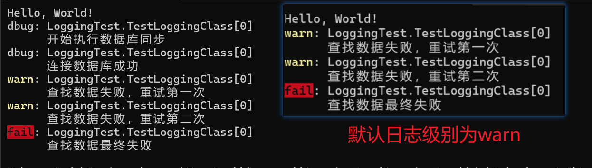
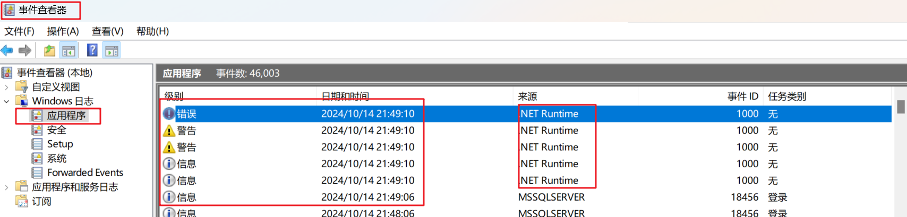

1、日志级别:Trace<Debug<Information <Warning< Error < Critical

2、日志提供者(LoggingProvider):把日志输出到哪里。控制台、文件、数据库等。

3、.NETT的日志非常灵活，对于业务代码只要注入日志对象记录日志即可，具体哪些日志输出到哪里、什么样的格式、是否输出等都有配置或者初始化代码决定。

## 输出日志到控制台

### 安装包

安装 日志框架的基础包 Microsoft.Extensions.Logging（logging依赖于DependencyInjection，所以内置了DI框架）

```bash
NuGet\Install-Package Microsoft.Extensions.Logging -Version 8.0.0
```

向控制台输出则再安装一个 Microsoft.Extensions.Logging.Console

```bash
NuGet\Install-Package Microsoft.Extensions.Logging.Console -Version 8.0.0
```

### 注入logging服务

AddLogging的定义如下：需要传入一个参数为ILoggingBuilder类型没有返回值的委托方法

```C#
public static IServiceCollection AddLogging(this IServiceCollection services, Action<ILoggingBuilder> configure)
```

也就是如下lambda表达式

```C#
// See https://aka.ms/new-console-template for more information
using LoggingTest;
using Microsoft.Extensions.DependencyInjection;
using Microsoft.Extensions.Logging;
//new 一个服务对象
ServiceCollection services = new ServiceCollection();
services.AddLogging(logBuilder => //注入日志服务
{
    logBuilder.AddConsole(); //指明日志服务打印方式为Console
    logBuilder.SetMinimumLevel(LogLevel.Trace); //设置最低输出级别
});

using(var sp = services.BuildServiceProvider()) //获取服务Provider
{
}

```

### 打印测试类

```C#
using System;
using System.Collections.Generic;
using System.Linq;
using System.Text;
using System.Threading.Tasks;
using Microsoft.Extensions.Logging;

namespace LoggingTest
{
    public class TestLoggingClass
    {
        //构造函数注入ILogger服务
        private readonly ILogger<TestLoggingClass> _logger;

        public TestLoggingClass(ILogger<TestLoggingClass> logger)
        {
            _logger = logger;
        }
        //测试方法
        public void Start()
        {
            _logger.LogDebug("开始执行数据库同步");
            _logger.LogDebug("连接数据库成功");
            _logger.LogWarning("查找数据失败，重试第一次");
            _logger.LogWarning("查找数据失败，重试第二次");
            _logger.LogError("查找数据最终失败");
        }
    }
}

```

### 注入测试实例

```C#
// See https://aka.ms/new-console-template for more information
using LoggingTest;
using Microsoft.Extensions.DependencyInjection;
using Microsoft.Extensions.Logging;
//new 一个服务对象
ServiceCollection services = new ServiceCollection();
services.AddLogging(logBuilder => //注入日志服务
{
    logBuilder.AddConsole(); //指明日志服务打印方式为Console
    logBuilder.SetMinimumLevel(LogLevel.Trace); //设置最低输出级别
});
services.AddScoped<TestLoggingClass>(); //注入Service实例
using(var sp = services.BuildServiceProvider()) //获取服务Provider
{
    //获取测试实例对象，并启动测试方法
    var test1 = sp.GetRequiredService<TestLoggingClass>();
    test1.Start();
}

```

效果：



## 输出日志到EventLog

1、Console只适合开发阶段，why?（控制台程序无法持久化保存，日志增多则很难找到目标日志）所以运行阶段需要输出到文件等。
2、采用和Configuration类似的扩展机制，不仅内置了Debug、事件查看器、文件、āzure日志等提供者，还可以扩展。Provider可以共存。

3、EventLog:Windows Only。在Windows下部署的程序、网站运行出错、不正常，先去EventLog看看。NuGet安装:Microsoft.Extensions.Logging.EventLog。然后logBuilder.AddEventLog()

### 安装包

```bash
NuGet\Install-Package Microsoft.Extensions.Logging.EventLog -Version 8.0.0
```

只需要在注入logging时多指定一个打印方式为EventLog就可以了

```C#
// See https://aka.ms/new-console-template for more information
using LoggingTest;
using Microsoft.Extensions.DependencyInjection;
using Microsoft.Extensions.Logging;
//new 一个服务对象
ServiceCollection services = new ServiceCollection();
services.AddLogging(logBuilder => //注入日志服务
{
    logBuilder.AddConsole(); //指明日志服务打印方式为Console
    logBuilder.AddEventLog(); //指明日志服务打印方式为EventLog
    logBuilder.SetMinimumLevel(LogLevel.Trace);
});
services.AddScoped<TestLoggingClass>(); //注入Service实例
using(var sp = services.BuildServiceProvider()) //获取服务Provider
{
    //获取测试实例对象，并启动测试方法
    var test1 = sp.GetRequiredService<TestLoggingClass>();
    test1.Start();
}

```

效果：

