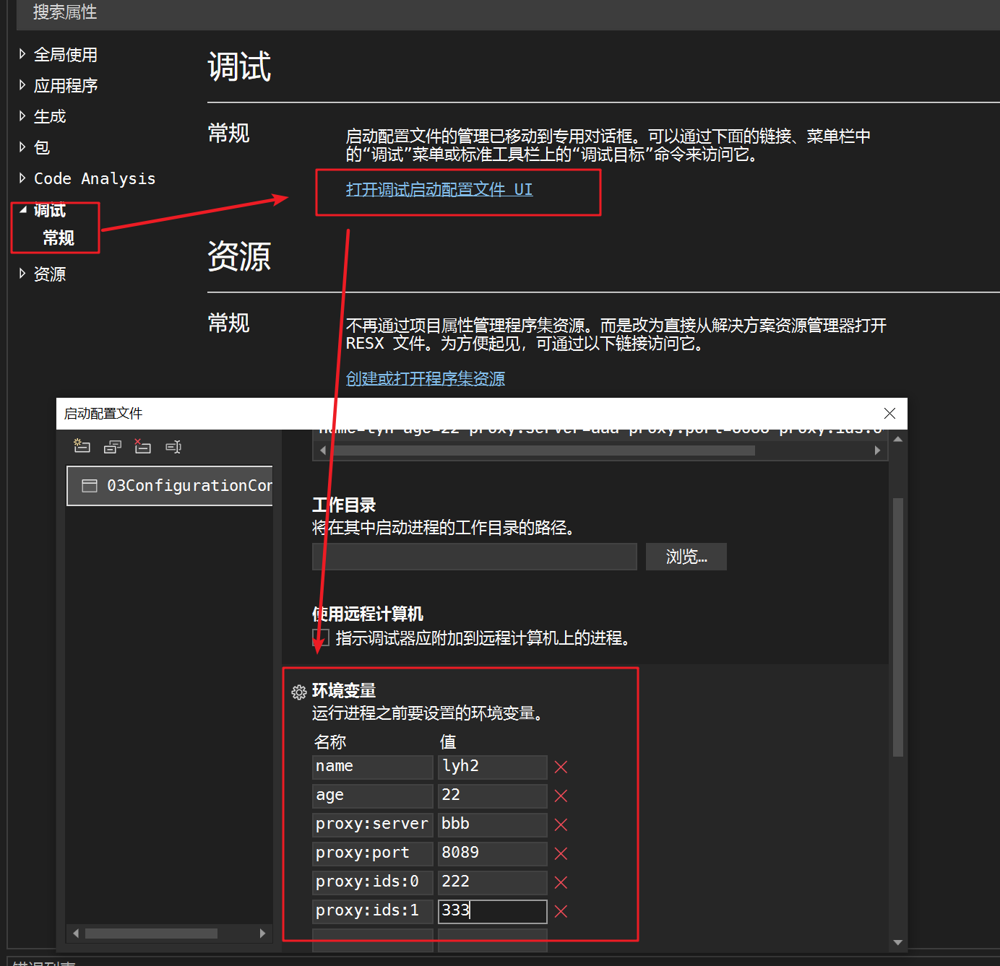

## 1、简介

1、传统Web.config配置的缺点，之前DI讲到过。

2、为了兼容，仍然可以使用Web.config和ConfigurationManager类，但不推荐，

3、.NET 中的配置系统支持丰富的配置源，包括文件(json、xml、ini等)、注册表、环境变量、命令行、Azure Key Vault **还内置或者第三方支持中心化配置服务器，比如使用Apollo、Nacos等开源服务器，或者使用Azure、阿里云等的配置服务**。具体看文档即可。等，还可以配置自定义配置源。可以跟踪配置的改变，可以按照优先级覆盖。

## 2、Json文件直接读取

1、创建一个json文件config.json，【右键】-【属性】-【高级】-【复制到输出到目录】-【如果较新则赋值】，使得文件改动后自动复制到exe文件同级的目录下，这样exe文件读取性文件就可以应用更改。

```json
{
  "name": "lyh",
  "age": "18",
  "proxy": {
    "server": "http://badu.com",
    "port": "8080"
  }
}
```

如项目目录如下，简称根目录

```text
E:\.netCode\Projects\mypro\YangZack\homework\03ConfigurationConsole\03ConfigurationConsole
```

那么在debug模式下实际运行的是```根目录\bin\Debug\net6.0``` 下的03ConfigurationConsole.exe文件，此文件读取的json文件是```根目录\bin\Debug\net6.0\config.json``` 而不是```根目录 \config.json```

2、NuGet安装Microsoft.Extensions.Configuration（配置框架基础包，配置框架不止能读json文件，可以读ini xml 数据库 环境变量）和Microsoft.Extensions.Configuration.Json（读取json文件）.

```bash
NuGet\Install-Package Microsoft.Extensions.Configuration -Version 7.0.0
NuGet\Install-Package Microsoft.Extensions.Configuration.Json -Version 7.0.0
```

3、program.cs中编写代码，先用简单的方式读取配置。

```C#
using Microsoft.Extensions.Configuration;

ConfigurationBuilder configBuilder = new ConfigurationBuilder();
configBuilder.AddJsonFile("config.json", 
    optional: false, //为false表示找不到文件时报错
    reloadOnChange: true //为true表示配置更新时立刻变更，无需重启
    );
IConfigurationRoot config = configBuilder.Build();
string name = config["name"];
string age = config.GetSection("age").Value;
string server = config.GetSection("proxy").GetSection("server").Value;
string server2 = config.GetSection("proxy:server").Value;
Console.WriteLine($"name={name} age={age} server={server} server2={server2}");
//name = lyh age = 18 server = http://badu.com server2=http://badu.com
```

## 3、Binder读取为对象

1、可以绑定一个类Proxy，自动完成配置的读取

```C#
namespace _03ConfigurationConsole.Entity
{
    public class Proxy
    {
        public string Server { get; set; }
        public int Port { get; set; }

        public override string? ToString()
        {
            return $"Serve={Server} Port={Port}";
        }
    }
}
```

2、NuGet安装 Microsoft.Extensions.Configuration.Binder

```bash
NuGet\Install-Package Microsoft.Extensions.Configuration.Binder -Version 7.0.0
```

3、Server server = configRoot.GetSection("proxy").Get<Proxy>()

program.cs文件

```C#
using _03ConfigurationConsole.Entity;
using Microsoft.Extensions.Configuration;

ConfigurationBuilder configBuilder = new ConfigurationBuilder();
configBuilder.AddJsonFile("config.json", 
    optional: true, //为true表示找不到文件时报错
    reloadOnChange: true //为true表示配置更新时立刻变更，无需重启
    );
IConfigurationRoot config = configBuilder.Build();
Proxy proxy = config.GetSection("Proxy").Get<Proxy>(); //获取配置的对象
Console.WriteLine(proxy.ToString());
//Server = http://badu.com Port=8080
```

## 4、使用选项结合依赖注入

推荐使用选项方式读取，和DI结合更好，且更好利用“reloadonchange”机制。

NuGet安装:Microsoft.Extensions.Options、Microsoft.Extensions.Configuration.Binder，当然也需要Microsoft.Extensions.Configuration、Microsoft.Extensions.Configuration.Json.

```bash
NuGet\Install-Package Microsoft.Extensions.Configuration -Version 7.0.0
NuGet\Install-Package Microsoft.Extensions.Configuration.Json -Version 7.0.0
NuGet\Install-Package Microsoft.Extensions.Configuration.Binder -Version 7.0.0
//新增这条
NuGet\Install-Package Microsoft.Extensions.Options -Version 7.0.0
//依赖注入
NuGet\Install-Package Microsoft.Extensions.DependencyInjection -Version 7.0.0
```

读取配置的时候，DI要声明I0ptions<T>、l0ptionsMonitor<T>、l0ptionsSnapshot<T>等类型，区别如下：

- l0ptions<T>不会读取到新的值；l0ptionsMonitor<T>、l0ptionsSnapshot<T>都可以读取到新的值

- l0ptionsMonitor<T>会立刻读取到新的值，如果一个范围内的代码读取了两次此配置，在两次中间时对配置文件的修改会被l0ptionsMonitor监测到，并执行修改
- l0ptionsSnapshot<T>较l0ptionsMonitor<T>会在同一个范围内(比如ASP.NET Core-个请求中)保持一致，建议用I0ptionssnapshot。

配置文件绑定的类Config，要以IOptionsSnapshot形式注入

```C#
using _03ConfigurationConsole.Entity;
using Microsoft.Extensions.Options;

namespace _03ConfigurationConsole
{
    public class TestController
    {
        //以IOptionsSnapshot形式读取配置
        private readonly IOptionsSnapshot<Config> _optionsSnapshot;

        public TestController(IOptionsSnapshot<Config> optionsSnapshot)
        {
            _optionsSnapshot = optionsSnapshot;
        }
        public void Run()
        {
            //_optionsSnapshot.Value获取到_optionsSnapshot定义时的类型实例
            Console.WriteLine(_optionsSnapshot.Value.Age);
            Console.WriteLine("-------------------------");
            Console.WriteLine(_optionsSnapshot.Value.Age);
        }
    }
}
```

program.cs文件中

```C#
// See https://aka.ms/new-console-template for more information
using _03ConfigurationConsole;
using _03ConfigurationConsole.Entity;
using Microsoft.Extensions.Configuration;
using Microsoft.Extensions.DependencyInjection;

ServiceCollection services = new ServiceCollection();

ConfigurationBuilder configBuilder = new ConfigurationBuilder();
configBuilder.AddJsonFile("config.json", 
    optional: true, //为true表示找不到文件时报错
    reloadOnChange: true //为true表示配置更新时立刻变更，无需重启
    );
IConfigurationRoot configRoot = configBuilder.Build();

//只有注册到依赖框架的容器中的对象，才会被框架自动注入
services.AddOptions()
        //Config对象绑定到根节点configRoot
        .Configure<Config>(e => configRoot.Bind(e))
    	//Proxy对象绑定到根节点下的"Proxy"
        .Configure<Proxy>(e => configRoot.GetSection("Proxy").Bind(e));

//TestController注册到依赖框架的容器
services.AddScoped<TestController>();
services.AddScoped<Test2>();
//TestController实例化
using (var sp = services.BuildServiceProvider())
{
    var item = sp.GetRequiredService<TestController>();
    item.Run();
    var item2 = sp.GetRequiredService<Test2>();
    item2.Run();
}
```

新建 Test2 文件，其中只读取配置中的Proxy属性

```C#
using _03ConfigurationConsole.Entity;
using Microsoft.Extensions.Options;

namespace _03ConfigurationConsole
{
    public class Test2
    {
        private readonly IOptionsSnapshot<Proxy> _optionsSnapshot;

        public Test2(IOptionsSnapshot<Proxy> optionsSnapshot)
        {
            _optionsSnapshot = optionsSnapshot;
        }
        public void Run()
        {
            Console.WriteLine(_optionsSnapshot.Value.Server);
        }
    }
}

```

## 5、使用命令行读取配置

需要安装包 Microsoft.Extensions.Configuration.CommandLine 其中有ConfigurationBuilder的扩展方法，使用 AddCommandLine 声明以命令行的方式读取配置

```bash’
NuGet\Install-Package Microsoft.Extensions.Configuration.CommandLine -Version 7.0.0
```

program.cs文件

```C#
// See https://aka.ms/new-console-template for more information
using _03ConfigurationConsole;
using _03ConfigurationConsole.Entity;
using Microsoft.Extensions.Configuration;
using Microsoft.Extensions.DependencyInjection;

//依赖注入的服务
ServiceCollection services = new ServiceCollection();
//配置容器
ConfigurationBuilder configBuilder = new ConfigurationBuilder();
//通过json file的形式读取配置(AddJsonFile是ConfigurationBuilder的扩展方法)
//configBuilder.AddJsonFile("config.json", 
//    optional: true, //为true表示找不到文件时报错
//    reloadOnChange: true //为true表示配置更新时立刻变更，无需重启
//    );

//通过命令行的形式读取配置(AddCommandLine是ConfigurationBuilder的扩展方法)
configBuilder.AddCommandLine(args); //使用args接受命令行的参数【修改这里】
IConfigurationRoot configRoot = configBuilder.Build();

//只有注册到依赖框架的容器中的对象，才会被框架自动注入
services.AddOptions()
        //Config对象绑定到根节点
        .Configure<Config>(e => configRoot.Bind(e))
        //Proxy对象绑定到根节点下的"Proxy"
        .Configure<Proxy>(e => configRoot.GetSection("Proxy").Bind(e));

//注入TestController
services.AddScoped<TestController>();
services.AddScoped<Test2>();
//测试运行
using (var sp = services.BuildServiceProvider())
{
    var item = sp.GetRequiredService<TestController>();
    item.Run();
    var item2 = sp.GetRequiredService<Test2>();
    item2.Run();
}
```

在项目路径下的\bin\Debug\net6.0运行cmd，使用应用程序 03ConfigurationConsole.exe 执行传参

```bash
E:\.netCode\Projects\mypro\YangZack\homework\03ConfigurationConsole\03ConfigurationConsole\bin\Debug\net6.0>03ConfigurationConsole.exe age=19
19
-------------------------
```

使用cmd打开文件再传参进行调试太麻烦，可以使用VS-【项目属性】-【调试】-【常规】-【打开调试启动配置文件】-【命令行参数】-【name=lyh age=22】配置，再启动程序

如果在TestController中需要输出复杂类型的属性值，命令行的参数无法实现嵌套的结构，需要涉及到扁平化配置。

实体类型：

```C#
namespace _03ConfigurationConsole.Entity
{
    public class Config
    {
        public string Name { get; set; }
        public int Age { get; set; }
        public Proxy Proxy { get; set; }
    }
    public class Proxy
    {
        public string Server { get; set; }
        public int Port { get; set; }
        public int[] Ids { get; set; }

        public override string? ToString()
        {
            return $"Server={Server} Port={Port}";
        }
    }
}
```

json事例（查看结构用的）

```json
{
  "name": "lyh",
  "age": "18",
  "proxy": {
    "server": "http://badu.com",
    "port": "8080",
    "Ids": [3,5,8]
  }
}
```

测试方法

```C#
using _03ConfigurationConsole.Entity;
using Microsoft.Extensions.DependencyInjection;
using Microsoft.Extensions.Options;

namespace _03ConfigurationConsole
{
    public class TestController
    {
        private readonly IOptionsSnapshot<Config> _optionsSnapshot;

        public TestController(IOptionsSnapshot<Config> optionsSnapshot)
        {
            _optionsSnapshot = optionsSnapshot;
        }
        public void Run()
        {
            //_optionsSnapshot.Value获取到_optionsSnapshot定义时的类型实例
            var config = _optionsSnapshot.Value;
            Console.WriteLine($"name={config.Name} age={config.Age} server={config.Proxy.Server} port={config.Proxy.Port} ids=[{config.Proxy.Ids[0]},{config.Proxy.Ids[1]}]");
            Console.WriteLine("-------------------------");
        }
    }
}

```

### 5.1扁平化配置

1、对于环境变量、命令行等简单的键值对结构，如果想要进行复杂结构的配置，需要进行“扁平化处理”。对于配置的名字需要采用“层级配置”。例如```proxy:server=aaa```。对于数字这样配置(添加数组下标)```proxy:ids:0=3```、 ```proxy:ids:1=5```、 ```proxy:ids:2=8```。

3、这个知识点在自定义配置Provider中还会用到,

命令行参数格式：

```bash
name=lyh age=22 proxy:server=aaa proxy:port=8088 proxy:ids:0=3 proxy:ids:1=5
```

输出：

```bash
name=lyh age=22 server=aaa port=8088 ids=[3,5]
```

## 6、使用环境变量读取配置

1、NuGet安装 Microsoft.Extensions.Configuration.Binder。

```bash
NuGet\Install-Package Microsoft.Extensions.Configuration.EnvironmentVariables -Version 7.0.0
```

```C#
// See https://aka.ms/new-console-template for more information
using _03ConfigurationConsole;
using _03ConfigurationConsole.Entity;
using Microsoft.Extensions.Configuration;
using Microsoft.Extensions.DependencyInjection;

//Console.WriteLine("Hello, World!");
ServiceCollection services = new ServiceCollection();

ConfigurationBuilder configBuilder = new ConfigurationBuilder();
//通过json file的形式读取配置(AddJsonFile是ConfigurationBuilder的扩展方法)
configBuilder.AddJsonFile("config.json", 
    optional: true, //为true表示找不到文件时报错
    reloadOnChange: true //为true表示配置更新时立刻变更，无需重启
    );

//通过命令行的形式读取配置(AddCommandLine是ConfigurationBuilder的扩展方法)
configBuilder.AddCommandLine(args); //使用args接受命令行的参数

//通过环境变量的形式读取配置(AddEnvironmentVariables是ConfigurationBuilder的扩展方法)
configBuilder.AddEnvironmentVariables(); 

IConfigurationRoot configRoot = configBuilder.Build();

//只有注册到依赖框架的容器中的对象，才会被框架自动注入
services.AddOptions()
        //Config对象绑定到根节点
        .Configure<Config>(e => configRoot.Bind(e))
        //Proxy对象绑定到根节点下的"Proxy"
        .Configure<Proxy>(e => configRoot.GetSection("Proxy").Bind(e));

//注入TestController
services.AddScoped<TestController>();
services.AddScoped<Test2>();
//测试运行
using (var sp = services.BuildServiceProvider())
{
    var item = sp.GetRequiredService<TestController>();
    item.Run();
    var item2 = sp.GetRequiredService<Test2>();
    item2.Run();
}
```



输出：

```bash
name=lyh2 age=22 server=bbb port=8089 ids=[222,333]
```

```C#
configBuilder.AddEnvironmentVariables();
configBuilder.AddEnvironmentVariables("C1_");
```

无参数版本会把程序相关的所有环境变量都加载进来，由于有可能和系统中已有的环境变量冲突，因此建议用有prefix参数的AddEnvironmentVariables()。读取配置的时候，prefix参数会被忽略。

## 7、开发自己的配置提供者

这个项目主要意义还是展示如何编写自定义配置提供者，实用意义不大。主要为下一个更实用的配置提供者做知识准备。

开发自定义配置提供者（从文件或者从配置读取）的步骤

读取web.config里的connectionstrings和appsettings的内容

```config
<?xml version="1.0" encoding="utf-8" ?>
<configuration>
  <connectionStrings>
    <add name="connstr1" connectionString="Server=localhost;Database=netcore;Uid=root;Pwd=root;" providerName="System.Data.MySqlClient"/>
    <add name="connstr2" connectionString="Data Source=ServerName;Initial Catalog=DatabaseName;User ID=UserName;Password=Password" providerName="System.Data.SqlClient" />
  </connectionStrings>
  <appSettings>
    <add key="config:proxy:server" value="smtp.test.com" />
    <add key="config:proxy.port" value="8080"/>
    <add key="config:proxy:ids:0" value="222"/>
    <add key="config:proxy:ids:1" value="333"/>
    <add key="config:name" value="lyh"/>
    <add key="config:age" value="23"/>
  </appSettings>
</configuration>
```

1、开发一个直接或者间接实现IConfigurationProvider接口的类XXXConfigurationProvider，一般继承自ConfigurationProvider。（如果是从文件读取，可以继承自FileConfigurationProvider。重写Load方法，把“扁平化数据设置到Data属性即可）

```C#
using System;
using System.Collections.Generic;
using System.Linq;
using System.Text;
using System.Threading.Tasks;
using System.Xml;
using Microsoft.Extensions.Configuration;

namespace _03ConfigurationConsole
{
    public class MyConfigProvider : FileConfigurationProvider
    {
        public MyConfigProvider(MyConfigSource source) : base(source)
        {
        }
        /// <summary>
        /// 
        /// </summary>
        /// <param name="stream">配置文件的流</param>
        /// <exception cref="NotImplementedException"></exception>
        public override void Load(Stream stream)
        {
            var dic = new Dictionary<string, string>(StringComparer.OrdinalIgnoreCase);
            XmlDocument doc = new XmlDocument();
            doc.Load(stream);
            var connNodes = doc.SelectNodes("/configuration/connectionStrings/add");
            /*  <add name="connstr1" connectionString="Server=localhost;Database=netcore;Uid=root;Pwd=root;" providerName="System.Data.MySqlClient"/>*/
            foreach (XmlNode node in connNodes.Cast<XmlNode>())
            {
                var connName = node.Attributes["name"].Value;//"connstr1" 
                var connectionString = node.Attributes["connectionString"].Value; //"Server=localhost;Database=netcore;Uid=root;Pwd=root;" 
                //[connStr1:{connectionString:"xxx",providerName:"xxx"},connStr2:{connectionString:"xxx",providerName:"xxx"}]
                dic[$"{connName}:connectionString"] = connectionString;

                var providerName = node.Attributes["providerName"];
                if (providerName != null)
                {
                    dic[$"{connName}:providerName"] = providerName.Value;
                }
            }

            var appSetNodes = doc.SelectNodes("/configuration/appSettings/add");
            /*  <add key="proxy:address" value="smtp.test.com" />*/
            foreach (XmlNode node in appSetNodes.Cast<XmlNode>())
            {
                var key = node.Attributes["key"].Value;//"connstr1" 
                key = key.Replace(".", ":");
                var value = node.Attributes["value"].Value;
                dic[key] = value;
            }
            this.Data = dic;
        }
    }
}

```

2、再开发一个实现了IConfigurationsource接口的类XXXConfigurationsource。如果是从文件读取，可以继承自FileConfigurationSource。在Build方法中返回上面的ConfigurationProvider对象。

```C#
using System;
using System.Collections.Generic;
using System.Linq;
using System.Text;
using System.Threading.Tasks;
using Microsoft.Extensions.Configuration;

namespace _03ConfigurationConsole
{
    /// <summary>
    /// 主要是提供参数使用
    /// </summary>
    public class MyConfigSource : FileConfigurationSource
    {
        public override IConfigurationProvider Build(IConfigurationBuilder builder)
        {
            EnsureDefaults(builder);
            return new MyConfigProvider(this);
        }
    }
}

```

3、然后使用即可，configurationBuilder.Add(new ConfigurationSource())即可为了简化使用，一般提供一个IConfigurationBuilder的扩展方法。

program中注册

```C#
// See https://aka.ms/new-console-template for more information
using _03ConfigurationConsole;
using _03ConfigurationConsole.Entity;
using Microsoft.Extensions.Configuration;
using Microsoft.Extensions.DependencyInjection;

//Console.WriteLine("Hello, World!");
ServiceCollection services = new ServiceCollection();

ConfigurationBuilder configBuilder = new ConfigurationBuilder();
//通过json file的形式读取配置(AddJsonFile是ConfigurationBuilder的扩展方法)
//configBuilder.AddJsonFile("config.json", 
//    optional: true, //为true表示找不到文件时报错
//    reloadOnChange: true //为true表示配置更新时立刻变更，无需重启
//    );

//通过命令行的形式读取配置(AddCommandLine是ConfigurationBuilder的扩展方法)
configBuilder.AddCommandLine(args); //使用args接受命令行的参数

//通过命令行的形式读取配置(AddCommandLine是ConfigurationBuilder的扩展方法)
configBuilder.AddEnvironmentVariables(); //使用args接受命令行的参数

//自定义ConfigSource
configBuilder.Add(new MyConfigSource()
{
    Path="web.config"
});
IConfigurationRoot configRoot = configBuilder.Build();
/*
string name = config["name"];
string age = config.GetSection("age").Value;
string server = config.GetSection("proxy").GetSection("server").Value;
string server2 = config.GetSection("proxy:server").Value;
Console.WriteLine($"name={name} age={age} server={server} server2={server2}");
//name = lyh age = 18 server = http://badu.com server2=http://badu.com*/

/*Proxy proxy = configRoot.GetSection("Proxy").Get<Proxy>();
Console.WriteLine(proxy.ToString());*/
//Server = http://badu.com Port=8080

//只有注册到依赖框架的容器中的对象，才会被框架自动注入
/*services.AddOptions()
        //Config对象绑定到根节点
        .Configure<Config>(e => configRoot.Bind(e))
        //Proxy对象绑定到根节点下的"Proxy"
        .Configure<Proxy>(e => configRoot.GetSection("Proxy").Bind(e));*/
services.AddOptions()
        .Configure<WebConfig>(x=>configRoot.Bind(x));
//注入TestController
//services.AddScoped<TestController>();
//services.AddScoped<Test2>();
services.AddScoped<TestWebConfigController>();
//测试运行
using (var sp = services.BuildServiceProvider())
{
   /* var item = sp.GetRequiredService<TestController>();
    item.Run();
    var item2 = sp.GetRequiredService<Test2>();
    item2.Run();*/
    var item3 = sp.GetRequiredService<TestWebConfigController>();
    item3.Run();
}
```

测试Controller

```C#
using System;
using System.Collections.Generic;
using System.Linq;
using System.Text;
using System.Threading.Tasks;
using _03ConfigurationConsole.Entity;
using Microsoft.Extensions.Options;

namespace _03ConfigurationConsole
{
    public class TestWebConfigController
    {
        private IOptionsSnapshot<WebConfig> _webConfigOption;

        public TestWebConfigController(IOptionsSnapshot<WebConfig> webConfigOption)
        {
            _webConfigOption = webConfigOption;
        }
        public void Run()
        {
            Console.WriteLine("TestWebConfigController:-------------------------");
            var config = _webConfigOption.Value;
            Console.WriteLine($"conn1String={config.Connstr1.ConnectionString} provider={config.Connstr1.ProviderName} ");
            Console.WriteLine($"conn2String={config.Connstr2.ConnectionString} provider={config.Connstr2.ProviderName} ");
            Console.WriteLine($"age={config.Config.Age} name={config.Config.Name} ");
            Console.WriteLine($"server={config.Config.Proxy.Server} ids=[{config.Config.Proxy.Ids[0]},{config.Config.Proxy.Ids[1]}] ");
        }
    }
}

```

整体流程:编写ConfigurationProvider类实际读取配置;编写ConfigurationSource在Build中返回ConfigurationProvider对象;把ConfigurationSource对象加入IConfigurationBuilder。


