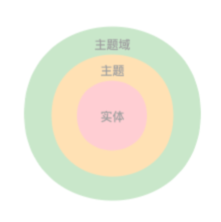

**数据仓库（Data Warehouse, DW）** 是一个**面向分析和决策支持**的数据系统，用来**集中存储、整理和分析来自多个业务系统的历史数据**，帮助企业做 **统计分析、趋势分析、报表和决策**。

> **数据仓库 = 为“分析”和“决策”而设计的数据集合，不是为了做事务处理。**

---

## 1、为什么需要数据仓库？

现实企业中通常存在很多 **业务系统（OLTP）**：

- 订单系统（下单、付款）
- 用户系统（注册、登录）
- 广告系统（曝光、点击）
- 财务系统（结算、账单）

这些系统的特点是：

- **一天写入很多数据**
- **结构各不相同**
- **只关心当前业务，不关心历史全局**

👉 当你想问这种问题时，就麻烦了：

- 去年每个月收入趋势？
- 各地区 Top10 商品？
- 用户 7 日留存率？
- 曝光 → 点击 → 转化的整体漏斗？

**业务数据库不适合干这些事** ，所以才需要 **数据仓库**。

**典型业务系统负载** vs **典型分析系统负载**

| 对比项  | 业务数据库（OLTP） | 数据仓库（OLAP） |
| ---- | ----------- | ---------- |
| 目标   | 支撑业务运行      | 支撑分析、决策    |
| 操作   | 增删改查（频繁）    | 大量查询、统计    |
| 数据   | 当前数据        | 历史数据       |
| 表结构  | 高度规范（3NF）   | 宽表、星型模型    |
| 查询   | 查一条订单       | 扫描亿级数据     |
| 性能重点 | 写入、事务       | 聚合、扫描      |

同时要区分 **数据仓库** 和 **OLAP 数据库**

| 维度       | 数据仓库             | OLAP 数据库     |
| -------- | ---------------- | ------------ |
| 本质       | 一整套分析体系          | 一类数据库 / 计算系统 |
| 关注点      | 数据怎么组织、治理、使用     | 数据怎么算得快      |
| 包含内容     | 数据源、ETL、模型、层次、口径 | 存储引擎、执行引擎    |
| 是否一定是数据库 | ❌ 不一定            | ✅ 一定是        |
| 是否一定做分析  | ✅ 是              | ✅ 是          |
| 两者关系     | **包含关系**         | **被包含**      |

---

## 2、数据仓库的经典定义（Inmon）

数据仓库通常被定义（**数据仓库的 4 个核心特征**）为：

> **面向主题（Subject-Oriented）**  
> **集成的（Integrated）**  
> **相对稳定的（Non-Volatile）**  
> **随时间变化的（Time-Variant）**  
> 用于支持决策的数据集合

### 1️⃣ 面向主题（不是面向业务操作）

- ✅ 主题：**用户、订单、收入、广告、商品**
- ❌ 不是：下单按钮、支付接口、库存锁定

> 数据仓库关心的是“分析对象”，不是“业务操作流程”

---

### 2️⃣ 集成（来自多个系统）

- 订单表来自订单系统
- 用户表来自用户系统
- 曝光/点击来自广告系统
- 成本来自财务系统

👉 在数据仓库中：

- 统一字段含义
- 统一时间
- 统一口径（非常重要）

---

### 3️⃣ 相对稳定（基本不更新）

- ✅ 以 **写入 + 查询** 为主
- ❌ 很少更新、删除
- ❌ 不支持高并发事务

> 数据仓库不是给用户点按钮用的，是给分析师 / BI / 管理层看的

---

### 4️⃣ 随时间变化（历史数据）

- 会保存 **多年的数据**
- 支持：
  - 同比 / 环比
  - 趋势分析
  - 回溯历史

业务库常常只保留“当前状态”，而数据仓库存历史。

---

## 3、Kimball 建模

Kimball 建模是一种以**业务分析为导向的维度建模方法**，它将业务过程抽象为**事实表**，将分析角度抽象为**维度表**，通常采用星型模型设计。  
在企业数仓中，Kimball 模型常用于 DWD / DWS / ADS 层，用于沉淀稳定、可复用的分析指标，支撑 OLAP、BI 和决策分析场景。

🎯 主要目标：

- 让 **业务人员能理解数据**
- 让 **SQL 更简单**
- 让 **指标口径稳定**
- 支撑 **OLAP（切片 / 排序 / 聚合 / 对比）**

👉 这本质上就是 **数据仓库 / OLAP 系统** 的理论基础。

---

### 3.1、Kimball 的核心思想（3 句话）

#### 1️⃣ 以“业务过程”为中心（不是表）

> 不问：这个字段来自哪个系统  
> 只问：这个分析在回答什么业务问题

例如：

- 下单
- 支付
- 浏览
- 发货
- 退款

这些叫 Business Process（业务过程）**。

---

#### 2️⃣ 分析 = 事实 + 维度

这是 Kimball 理论最核心的一句话：

```
分析问题 = 事实（指标） + 维度（分析角度）
```

- 事实：发生了什么？（数量 / 金额 / 次数）
- 维度：从什么角度看？（时间 / 用户 / 地区 / 商品）

---

#### 3️⃣ 用“维度模型”而不是 3NF 范式模型

| 对比   | OLTP  | Kimball |
| ---- | ----- | ------- |
| 目标   | 事务一致性 | 分析效率    |
| 设计   | 3NF   | 反范式     |
| join | 很多    | 很少      |
| 读    | 少量    | 海量      |

---

### 3.2、Kimball 模型的基本结构：事实表+维度表

Kimball 的数据模型只有两个核心对象：**事实表（Fact Table）+ 维度表（Dimension Table）**

| 对比维度    | 事实表（Fact Table）   | 维度表（Dimension Table） |
| ------- | ----------------- | -------------------- |
| 作用      | **记录业务事件本身**      | **描述业务事件的分析角度**      |
| 关注点     | 发生了什么             | 在什么条件下发生             |
| 核心内容    | 指标（度量值）           | 属性（描述信息）             |
| 数据变化    | 高频、持续增长           | 低频变化                 |
| 数据量     | 非常大               | 相对较小                 |
| 粒度      | 极细（单一业务事实）        | 一行一个业务对象             |
| 主键      | 复合外键 +（可选代理键）     | 代理键（dimension key）   |
| 与对方关系   | **多 → 一**         | **一 ← 多**            |
| Join 方式 | 外键引用维度表           | 被事实表引用               |
| 典型操作    | SUM / COUNT / AVG | GROUP BY / WHERE     |
| 位于数仓层   | DWD / DWS         | DIM（或 DWD 中退化维）      |

二者组合起来，则为星型模型（Star Schema），通过Fact事实发散出多个Dimension维度表

```
         dim_time
             |
dim_user — fact_order — dim_product
             |
         dim_region
```

---

### 3.3、星型模型 vs 雪花模型

**星型模型：维度不拆，简单好查**  
**雪花模型：维度拆分，规范省空间**

#### ⭐ 星型模型（Star Schema——Kimball 首选）

```
            dim_time
               |
dim_user — fact_order — dim_product
               |
           dim_region
```

✅ 特点：

- 事实表在中间
- 所有维度表 **直接连到事实表**，存在数据冗余
- 结构像一颗星 ⭐

📌 现实世界：

> **90% 分析型数仓 = 星型模型

```sql
SELECT
    city,
    SUM(pay_amount)
FROM fact_order f
JOIN dim_user u ON f.user_id = u.user_id
GROUP BY city;
```

#### ❄ 雪花模型（Snowflake Schema）

```
                 dim_city
                     |
dim_user —— fact_order —— dim_product —— dim_category
                     |
                 dim_time
```

✅ 特点：

- 维度被进一步 **规范化拆分**，外层通过内层的外键进行连接，没有数据冗余
- 结构像雪花结晶 ❄

```sql
SELECT
    c.city_name,
    SUM(f.pay_amount)
FROM fact_order f
JOIN dim_user u ON f.user_id = u.user_id
JOIN dim_city c ON u.city_id = c.city_id
GROUP BY c.city_name;
```

👉 Join 多 1 层，  
👉 BI 自动生成 SQL 时更复杂、慢

---

#### 二者对比

| 对比项        | 星型模型       | 雪花模型        |
| ---------- | ---------- | ----------- |
| 维度结构       | **宽表（不拆）** | **规范化（拆分）** |
| Join 数量    | 少          | 多           |
| 查询复杂度      | ⭐⭐ 低       | ⭐⭐⭐⭐ 高      |
| 查询性能       | 快          | 较慢          |
| 存储空间       | 较大         | 较小          |
| 模型可读性      | 极强（业务友好）   | 较差          |
| 维护难度       | 低          | 高           |
| BI 工具支持    | 非常好        | 一般          |
| Kimball 推荐 | ✅ 强推荐      | ❌ 不推荐       |
| 企业实践       | ✅ 主流       | ⚠ 少量        |

---

#### 为什么 Kimball 强烈推荐「星型模型」

1. **分析查询是读密集型**
   - Join 是最大性能杀手之一
2. **维度变化频率很低**
   - 冗余一点维度字段成本可接受
3. **业务要“看得懂”模型**
   - 星型模型更接近业务语言
4. **BI 工具天然偏爱星型**

Kimball 的核心目标是：**让分析更快、让业务更容易用 SQL** 📌 所以 Kimball 结论是：

> **牺牲一点存储，换查询效率和认知效率**

#### 为什么还存在雪花模型

1️⃣ 维度层级极深

例如：

- 国家 → 大区 → 省 → 市 → 门店 → 柜台

拆分后有一定价值。必须使用桥接表时才会使用

2️⃣ 维度表特别巨大 & 冗余极高

- 上亿维度行
- 强存储约束（较少见）

3️⃣ 偏模型设计 / 主数据管理（MDM）

- 更像 Inmon / 3NF 思想
- 不以分析性能为第一目标

---

#### 星型在「数仓分层」中的真实应用位置

| 数仓层       | 通常模型       |
| --------- | ---------- |
| ODS       | 3NF / 原始   |
| DWD       | 星型（事实初现）   |
| DWS       | 星型（聚合事实）   |
| ADS       | ✅ 星型 or 宽表 |
| BI / OLAP | ✅ 星型       |

📌 **雪花模型极少直接暴露给 BI**

#### Kimball 的几个关键概念（面试常考）

1️⃣ 维度一致性（Conformed Dimension）

> 不同事实表，使用**同一份维度定义**

例如：

- 订单事实表
- 支付事实表

都用同一个 `dim_user`

✅ 好处：

- 可跨主题分析
- 指标可对齐

---

2️⃣ 渐变维度（SCD，Slowly Changing Dimension）

处理「用户信息会变」的问题。

| 类型   | 含义                           |
| ---- | ---------------------------- |
| SCD1 | 直接覆盖                         |
| SCD2 | 拉链表（加 start_date / end_date） |
| SCD3 | 保留有限历史                       |

📌 实际用最多：**SCD2**

---

3️⃣ 事实表分类

Kimball 把事实表分为：

- **事务事实表**（订单、支付）
- **快照事实表**（每日库存）
- **周期快照事实表**

这在 DWD / DWS 分层中非常常见。

---

### 3.4、维度建模一般过程

> **Kimball 维度建模 = 4 个固定步骤（顺序不能乱）**

- 1️⃣ 选择业务过程（Business Process）

- 2️⃣ 声明粒度（Grain）

- 3️⃣ 识别维度（Dimensions）

- 4️⃣ 识别事实（Facts / Measures）

---

#### 1️⃣ 选择业务过程（Business Process）

✅ 核心问题：**你要分析的“业务行为”是什么？** 确定事实表

✅ 常见业务过程示例

| 类别  | 业务过程     |
| --- | -------- |
| 交易类 | 下单、支付、退款 |
| 行为类 | 浏览、点击、搜索 |
| 运营类 | 登录、活跃    |
| 资源类 | 库存、发货    |

---

#### 2️⃣ 定义粒度（Grain） ⭐⭐⭐（最重要）

✅ 核心问题：**事实表中“一行数据代表什么”？** 事实表的行的内容和含义

✅ 常见粒度示例

| 粒度描述   | 一行代表        |
| ------ | ----------- |
| 订单粒度   | 一笔订单        |
| 订单明细粒度 | 一笔订单中的一个商品  |
| 行为粒度   | 用户一次点击      |
| 日快照    | 某个对象在某一天的状态 |

✅ Kimball 的铁律：**先定粒度，再设计字段**

❌ 错误做法：

- 一行有时是订单，有时是商品
- 想加字段就加，导致语义混乱

---

#### 3️⃣ 识别维度（Dimensions）

✅ 核心问题：**从哪些“角度”分析这个业务过程？** 维度是对度量的上下文和环境的描述

维度用于：

- GROUP BY
- WHERE
- 切片、钻取

✅ 常见维度（通用）

| 维度类型 | 举例           |
| ---- | ------------ |
| 时间维度 | 年 / 月 / 日    |
| 用户维度 | 性别 / 年龄 / 城市 |
| 商品维度 | 类目 / 品牌      |
| 地域维度 | 国家 / 省 / 市   |
| 渠道维度 | APP / Web    |

📌 维度表特点：

- 字段多
- 变化慢
- 面向业务描述（“人话”）

---

#### 4️⃣ 识别事实（Facts / Measures）

✅ 核心问题：**这个业务过程“衡量”的是什么？**

事实 = **可聚合的数值指标**

✅ 常见事实类型

| 类型  | 示例           |
| --- | ------------ |
| 数量  | order_cnt    |
| 金额  | pay_amount   |
| 次数  | click_cnt    |
| 时长  | stay_seconds |

✅ Kimball 对事实的约束

✅ 事实必须：

- 是数值
- 可 SUM / COUNT / AVG
- 与粒度一致

❌ 不应作为事实：

- 名称
- 状态描述
- 文本字段

---

#### ✅ 完整示例：订单明细事实表设计过程

1️⃣ 业务过程

> 用户下单

2️⃣ 粒度

> 一笔订单中的一个商品

3️⃣ 维度

`time_key  、user_key  、product_key  、region_key  `

4️⃣ 事实

order_cnt  、order_amount  、pay_amount  

✅ 结果：星型模型

```
           dim_time
              |
dim_user — fact_order_detail — dim_product
              |
          dim_region
```

---

## 4、 主题域、数据域

> **分层解决的是“数据怎么加工”  
> 域划分解决的是“数据按什么业务组织”**
> 
> 两者**解决的问题维度完全不同，不可互相取代**。

**分层 = 纵向流水线**  
**领域 / 主题域 = 横向业务切片**

### 为什么需要域的概念？

举个例子：
假设一个只有分层、没有域的数据仓库

```
ods_*
dwd_*
dws_*
ads_*
```

- 分层只告诉你「加工阶段」，不告诉你「业务含义」。当看到一张表 `dwd_detail_di` 时不知道这张表在业务上在干嘛（分层无法表达）

- 分层无法承载“复杂业务的解耦”。真实企业里用户、订单、支付、内容、财务复杂程度是指数级增长的，表会极度膨胀、口径边界开始失控、新人完全不知道“该改哪一块”
  
  ```textile
  dwd_user_xxx
  dwd_order_xxx
  dwd_payment_xxx
  dwd_content_xxx
  ```

- 分层解决不了“责任边界”。 如：“订单 GMV 统计错了，找谁？只能定位到 ” 在 DWS 层” 或者“在 ADS 层”。但这在组织管理层面是无解的。

增加域后，相当于在分层的基础上又根据业务进行再次划分，如下：

```txt
           ODS      DWD      DWS      ADS
用户域     ods_*    dwd_*    dws_*    ads_*
订单域     ods_*    dwd_*    dws_*    ads_*
支付域     ods_*    dwd_*    dws_*    ads_*
内容域     ods_*    dwd_*    dws_*    ads_*
```

### 数据域 vs 主题域

在域的基础上根据业务划分的颗粒度大小又可以分为两个层次：数据域（颗粒度较大）、主题域（颗粒度较小）：

- 数据域：按“业务板块”划分（管的是“业务范围”）

- 主题域：按“分析主题/业务过程”划分（管的是“分析对象”）

| 对比项    | 数据域（Data Domain） | 主题域（Subject Area） |
| ------ | ---------------- | ----------------- |
| 划分依据   | **业务板块 / 业务条线**  | **分析主题 / 业务过程**   |
| 抽象层级   | **更高（一级）**       | **更低（二级）**        |
| 关注点    | 这块数据归属哪类业务       | 这块数据在分析什么事        |
| 对应概念   | 企业组织 / 业务模块      | Kimball 的“业务过程”   |
| 稳定性    | ⭐⭐⭐⭐⭐ 极稳定        | ⭐⭐⭐⭐ 稳定           |
| 粒度     | 粗                | 较细                |
| 数量     | 少（5–10 个）        | 多（每个域下若干个）        |
| 与事实表关系 | 不直接对应            | **几乎一一对应**        |
| 与组织关系  | 通常对应业务部门         | 通常对应分析团队          |

### 为什么要分数据域和主题域？

> 为什么不直接用主题域就好？

因为**只有主题域**会出现这些问题：

❌ 1️⃣ 主题域太多 → 找不到入口

电商企业可能有 **30~50 个主题域**，没有数据域，根本组织不起来。

❌ 2️⃣ 主题域之间会有交叉

例如：

- 用户行为
- 用户画像
- 用户基础

它们都属于 **用户域**，但分析对象不同。

数据域提供了**“归类抽屉”**，让分散的主题域有去处。

❌ 3️⃣ 数据治理需要“一级目录”

公司管理者不会关心：

- “订单主题域归谁”

而是：

- “交易域归哪个团队”

👉 **数据域服务“治理”，主题域服务“分析”**

```textile
企业业务
   ↓
数据域（一级业务板块） 
   ↓
主题域（业务过程 / 分析主题） 
   ↓
Kimball 维度建模（事实 + 维度）
   ↓
数仓分层（ODS → DWD → DWS → ADS）
```

### 主题域

联系较为紧密的数据主题的集合。

主题域、主题、实体间的关系：



Kimball，其实就是：**在“主题域”内做维度建模**

对应关系是这样的 👇

| 概念  | 对应              |
| --- | --------------- |
| 数据域 | 多个业务过程          |
| 主题域 | 一个 Kimball 业务过程 |
| 事实表 | 主题域的核心          |
| 维度表 | 跨主题共享           |

### 数据域

数据域时面向业务分析，将业务过程进行抽象的集合。

### 注意事项

- 1、不重不漏，确保每个表都在一个域里，一张表 只能属于一个域（精确定位）
  
  ```textile
  fact_order_detail → 交易域 ✅
  不能同时归到 → 用户域 ❌
  ```

- 2、每个域下都可以根据需要再分子域，不限定层级（保持灵活性）
  
  ```textile
  交易域
   ├── 订单子域
   │    ├── 普通订单
   │    └── 拼团订单
   └── 支付子域
  ```

- 3、如果分子域就不能放表，表只放在最底层的域中（树状目录管理时更方便）
  
  ```textile
  交易域
   ├── 订单子域
   │    └── fact_order
   └── fact_payment   ❌ 表和子域同级
  
  交易域
   ├── 订单子域
   │    └── fact_order
   └── 支付子域
        └── fact_payment   ✅
  ```

- 4、最好保证每个域下的子域数量或表数量在20个左右（太多了不方便记忆管理，太少了没必要划分）
  
  - 一个域下太少（< 5）→ 没必要分
  
  - 一个域下太多（> 30）→ 大脑记不住、找不到

- 5、【其他】很好用，不好划分的都放里面（减少域层级数量有理由理解记忆）
  
  - 防止为了一两个表硬造一个新域
  
  - 防止域结构无限膨胀
  
  - 把“不好分类”的数据集中管理

- 6、数据团队分域可以作为分工的标准（数据不重、分工明确、界限清晰）
  
  ```textile
  数据中台
   ├── 用户数据团队 → 用户域
   ├── 交易数据团队 → 交易域
   ├── 内容数据团队 → 内容域
   └── 平台基础团队 → 公共域 / 工具域
  ```

- 7、数据团队分域后，可以决定域内表的中间命名（分层_业务标识_粒度：看到表名时可以理解更多信息）
  
  - dwd_order_detail_di（交易域 / 订单）
  
  - dws_user_active_day（用户域 / 行为）
  
  - ads_finance_revenue_report（财务域 / 报表）

| 原则        | 核心目的      | 类比       |
| --------- | --------- | -------- |
| 1 不重不漏    | 精确归属      | 一本书一书架   |
| 2 子域无限层   | 灵活适应业务复杂度 | 楼层→区域→书架 |
| 3 子域和表不混放 | 目录整洁      | 文件夹规范    |
| 4 ≈20 个   | 认知友好      | 人脑舒适区    |
| 5 留“其他”域  | 容纳长尾      | 杂物抽屉     |
| 6 分域=分工   | 组织治理      | 团队边界     |
| 7 决定命名    | 表名带语义     | 书脊编号     |

## 5、总线矩阵 Bus Matrix

**总线矩阵（Bus Matrix）** 是 Kimball 维度建模理论里**非常核心的一个工具**，  也是企业级数据仓库做**跨主题域统一建模**时几乎一定会用到的方法。

很多人听过它，但讲不清；下面我用「**是什么 → 为什么要它 → 长什么样 → 怎么用 → 它和你前面学的概念怎么连起来**」把它彻底讲透。

---

### 5.1 是什么

> **总线矩阵 = 一张“业务过程 × 维度”的二维表，  
> 用来规划企业级数仓中“每个事实表用哪些一致性维度”。**

它是 Kimball 提出的：

> **企业级数仓的“顶层设计图”**

不是建模技巧，而是**战略规划工具**。

---

### 5.2 为什么要有总线矩阵？（解决什么问题）

❌ 没有总线矩阵的企业，会出现这些问题：

1. **每个团队各建各的事实表**
   
   - 订单团队建一个 dim_user
   - 支付团队又建一个 dim_user
   - 用户团队再建一个 dim_user
   - 👉 **三个用户维度，口径全不一样**

2. **维度不统一 → 跨主题分析不可能**
   
   - 你想分析“某城市的下单 vs 支付转化率”
   - 因为两个 dim_user 不一致，查不出来

3. **指标对不齐 → 报表打架**
   
   - 一个口径下 GMV = 100W
   - 另一个口径下 GMV = 95W
   - 老板生气

---

✅ 总线矩阵的目的就是：

> **让“维度”在企业级范围内统一定义、跨主题域共享**

这就是 Kimball 提出的核心概念之一：

> **Conformed Dimension（一致性维度）**

总线矩阵就是**一致性维度的“管理工具”**。

---

### 5.3 总线矩阵长什么样？

它就是一张二维表：

| 业务过程 \ 维度 | 时间  | 用户  | 商品  | 渠道  | 地区  | 门店  |
| --------- | --- | --- | --- | --- | --- | --- |
| 下单        | ✅   | ✅   | ✅   | ✅   | ✅   |     |
| 支付        | ✅   | ✅   |     | ✅   | ✅   |     |
| 退款        | ✅   | ✅   | ✅   |     |     |     |
| 浏览        | ✅   | ✅   | ✅   | ✅   |     |     |
| 库存快照      | ✅   |     | ✅   |     |     | ✅   |

✅ 横向（行）：业务过程（= 事实表）

✅ 纵向（列）：一致性维度

✅ 打勾：表示这个事实表用到这个维

#### 1️⃣ 行 = 业务过程（Business Process）

也就是 Kimball 建模四步法里的：

> **第一步：选业务过程**

每个业务过程 → 对应一个事实表

例如：

- 下单 → fact_order
- 支付 → fact_payment
- 退款 → fact_refund

---

#### 2️⃣ 列 = 一致性维度（Conformed Dimension）

“一致性”指的是：

> **多个事实表共享同一份维度定义**

例如：

- dim_user
- dim_time
- dim_product

不允许：

- 用户域有一个 dim_user
- 交易域又有一个 dim_user

---

#### 3️⃣ 单元格 = 关系（Mapping）

打勾 = 这个事实表会用这个维度

不打 = 不需要

> **一张矩阵 = 一张企业级数仓“蓝图”**

---

### 5.4 串联所有知识点

下面这张关系图建议记下来 👇

```
企业业务
    ↓
数据域 / 主题域           ← 业务划分
    ↓
总线矩阵（Bus Matrix）    ← 顶层规划
    ↓
Kimball 维度建模          ← 模型设计
    ↓
事实表 + 维度表（星型）    ← 建模实现
    ↓
数仓分层（ODS/DWD/DWS/ADS）← 工程落地


┌─────────────────────────────────────────────────────────────┐
│                    ① 业务侧（Business）                      │
│                                                             │
│   企业业务全景（内容生产 → 计费 → 财务结算 → 报表分析）            │
└─────────────────────────────────────────────────────────────┘
                              ↓
┌─────────────────────────────────────────────────────────────┐
│            ② 数据治理层：数据域 / 主题域划分                    │
│                                                             │
│   按"业务板块"切：内容域 / 计费域 / 财务域 / 用户域 ...           │
│   按"分析主题"切：内容主题 / 订单主题 / 收入主题 ...              │
└─────────────────────────────────────────────────────────────┘
                              ↓
┌─────────────────────────────────────────────────────────────┐
│        ③ 顶层规划层：总线矩阵（Bus Matrix）                     │
│                                                             │
│   行 = 业务过程（事实表）                                       │
│   列 = 一致性维度（Conformed Dimension）                       │
│   作用：跨主题域统一维度、统一口径                                │
└─────────────────────────────────────────────────────────────┘
                              ↓
┌─────────────────────────────────────────────────────────────┐
│        ④ 模型设计层：Kimball 维度建模                          │
│                                                             │
│   四步法：业务过程 → 粒度 → 维度 → 事实                         │
│   产出：事实表 + 维度表 + 星型模型                              │    
└─────────────────────────────────────────────────────────────┘
                              ↓
┌─────────────────────────────────────────────────────────────┐
│        ⑤ 工程实现层：数仓分层（ODS → DWD → DWS → ADS）          │
│                                                             │
│   ODS：原始数据                                               │
│   DWD：明细事实 + 维度                                         │
│   DWS：聚合事实（公共指标）                                     │
│   ADS：应用层 / 报表层                                         │
└─────────────────────────────────────────────────────────────┘
                              ↓
┌─────────────────────────────────────────────────────────────┐
│        ⑥ 服务层：BI / API / 报表 / 数据产品                    │
│                                                             │
│   PowerBI / Grafana / Cosmos API / 财务报表                  │
└─────────────────────────────────────────────────────────────┘
```

✅ **总线矩阵 = 主题域和 Kimball 建模之间的“桥梁”**

它是一个**企业级视角**的工具，不是单表设计工具。

---

### 5.5 真实电商例子

✅ 业务过程

- 下单
- 支付
- 退款
- 浏览
- 加购

✅ 一致性维度

- 时间
- 用户
- 商品
- 类目
- 渠道
- 地区

✅ 总线矩阵

| 业务过程 | 时间  | 用户  | 商品  | 类目  | 渠道  | 地区  |
| ---- | --- | --- | --- | --- | --- | --- |
| 下单   | ✅   | ✅   | ✅   | ✅   | ✅   | ✅   |
| 支付   | ✅   | ✅   |     |     | ✅   | ✅   |
| 退款   | ✅   | ✅   | ✅   | ✅   |     |     |
| 浏览   | ✅   | ✅   | ✅   | ✅   | ✅   |     |
| 加购   | ✅   | ✅   | ✅   | ✅   |     |     |

✅ 看一眼就知道：

- 哪些维度是企业核心维度（用户、时间、商品）
- 哪些事实表共享同一个维度
- 跨主题分析可行性


