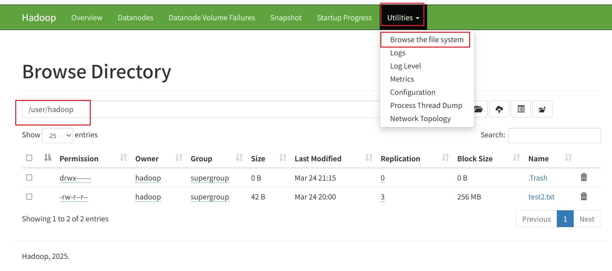

**Hadoop 是一个整体生态 / 框架，HDFS 和 YARN 是它里面两个核心组件：**

- **HDFS = 分布式存储** Hadoop Distributed File System（存数据）
- **YARN = 分布式资源调度** Yet Another Resource Negotiator（管资源、分配算力）
- **MapReduce = 第一代分布式计算引擎**
- **Hadoop = HDFS + YARN + MapReduce + 周边工具**

## Hadoop 安装包目录结构

安装位置：`/export/server/hadoop-3.4.2/`,包含以下文件夹

| 目录    | 说明                                                         |
| ------- | ------------------------------------------------------------ |
| bin     | Hadoop最基本的管理脚本和使用脚本的目录，脚本时sbin目录下管理脚本的基础实现，用户可以使用这些脚本管理和使用Hadoop |
| sbin    | Hadoop管理脚本所在目录，包含HDFS和YARN中各类服务的启动/关闭脚本 |
| etc     | Hadoop配置文件所在目录(/export/server/hadoop-3.4.2/etc/hadoop/)<br />第一类1个：hadoop-env.sh(执行任何Hadoop命令，它都会第一时间自动读取hadoop-env.sh，是启动前必须知道的环境信息)<br/>第二类4个：xxxx-site.xml，site表示的是用户定义的配置，会覆盖default中的默认配置。<br/>core-site.xml 核心模块配置（配置回收站）<br/>hdfs-site.xml hdfs文件系统模块配置<br/>mapred-stie.xml MapReduce模块配置<br/>yarn-site.xml yarn模块配置<br/>第三类1个：workers |
| share   | Hadoop各个模块编译后的jar包所在目录                          |
| include | 对外提供的变成库头文件（具体动态库+静态库在lib目录中）这些头文件均用C++定义，通常用于C++程序访问HDFS或者编写MapReduce程序 |
| lib     | 包含Hadoop对外提供的变成动态\|静态库，与include目录中的头文件结合使用 |
| libexec | 各个服务对应的shell配置文件所在目录，用于配置日志输出、启动参数，如JVM参数等信息 |
| logs    | 日志                                                         |

/data/nn    # NameNode 存储目录

/data/dn    # DataNode 存储目录

## 配置回收站

HDFS 会保证被删除的文件在回收站（`/user/<username>/.Trash/Current`）中至少存放 **1440min=24h**。超过这个时间，系统在下次检查点任务运行时就可以永久删除文件保留。

每 120 分钟（2 小时），HDFS 的 `NameNode`会启动一个后台任务，检查回收站中哪些文件已经超过了 `fs.trash.interval`设置的保留期。对于超期的文件，会将其从 `Current`目录移动到 `Checkpoint`目录，并最终清理掉。

```bash
	<property>
        <name>fs.trash.interval</name>
        <value>1440</value>
    </property>
	<property>
        <name>fs.trash.checkpoint.interval</name>
        <value>120</value>
    </property>
```

回收站位置：

```bash
/usr/hadoop/.Trash
```

在哪个集群配置就在哪里生效，无需重启集群。配置好后删除文件会进入回收站

```bash
[hadoop@node1 ~]$ hdfs dfs -rm test1.txt
2026-03-24 21:15:54,536 INFO fs.TrashPolicyDefault: Moved: 'hdfs://node1:8020/user/hadoop/test1.txt' to trash at: hdfs://node1:8020/user/hadoop/.Trash/Current/user/hadoop/test1.txt
```

恢复回收站文件

```bash
# 列出当前用户回收站根目录的内容
[hadoop@node1 ~]$ hdfs dfs -ls /user/hadoop/.Trash/Current

# 如果文件原来在深层目录，回收站会保留完整路径，可以递归查找
[hadoop@node1 ~]$ hdfs dfs -ls -R /user/hadoop/.Trash/Current | grep "被删文件名"
```

**例如**：

- 您删除了文件：`/test/data/important.log`
- 它在回收站中的路径将变为：`/user/hadoop/.Trash/Current/test/data/important.log`

```bash
hdfs dfs -mv <文件在回收站中的完整路径> <目标恢复路径>
```

## Yarn、HDFS、Hadoop启停命令

“启动 Hadoop” = 启动 HDFS + YARN

启动必须切换为非root用户才行

```bash
[root@node1 ~]# su - hadoop
Last login: Thu Mar 12 21:42:54 CST 2026 on pts/0
[hadoop@node1 ~]$ hdfs namenode -format
# 格式化HDFS（仅首次启动时执行，重复执行会清空数据！）
```

执行原理：执行脚本的机器上，启动SecondaryNameNode-》读取core-site.xml内容，确定NameNode所在机器，启动NameNode-》读取workers内容，确定DataNode所在机器，启动全部DataNode

以下所有命令的文件存储位置均为

```bash
$HADOOP_HOME/sbin/stop-dfs.sh(hadoop-daemon.sh)
```

|            | 手动逐个进程启停(控制所在机器的进程启停)                     | shell脚本一键启停<br />(配置好机器之间的SSH免密登录和workers文件) |
| ---------- | ------------------------------------------------------------ | ------------------------------------------------------------ |
| HDFS集群   | # hadoop2.x版本命令($HADOOP_HOME/sbin/hadoop-daemon.sh)<br />`hadoop-daemon.sh (start|status|stop) (namenode|datanode|secondarynamenode)`<br /># hadoop3.x版本命令($HADOOP_HOME/bin/hdfs)<br />`hdfs --daemon (start|stauts|stop) (namenode|datanode|secondarynamenode)` | `start-dfs.sh`<br />`stop-dfs.sh`                            |
| YARN集群   | # yarn2.x版本命令<br />`yarn-daemon.sh start|stop resourcemanager|nodemanager`<br /># yarn3.x版本命令<br />`yarn--daemon start|stop resourcemanager|nodemanager` | `stop-yarn.sh`<br />`stop-yarn.sh`                           |
| Hadoop集群 |                                                              | `start-all.sh`<br />`stop-all.sh`<br />一个命令代替start-dfs.sh和start-yarn.sh |

- 启动完毕之后可以使用`jps命令`查看进程是否启动成功

  ```bash
  [hadoop@node1 ~]$ jps
  4608 NameNode
  5063 SecondaryNameNode
  5421 NodeManager
  5789 Jps
  5294 ResourceManager
  ```

- Hadoop启动日志路径：`/export/server/hadoop-3.3.0/logs/`

### HDFS集群的Web页面

启动成功后就可以看到hdfs的web：http://node1:9870/

yarn的web：http://node1:8088/

## 操作HDFS

### 命令行操作

https://hadoop.apache.org/docs/r3.3.4/hadoop-project-dist/hadoop-common/FileSystemShell.html

当登录linux的hadoop用户后，默认会进入 /home/hadoop/文件夹

- 当执行`hadoop fs`或者`hdfs dfs`命令时操作的都是**HDFS 分布式文件系统**
- HDFS 的实际数据存储路径由 Hadoop 配置文件指定（和 Linux 本地路径是两回事），默认路径是 `hdfs://node1:9000/user/hadoop/hdfsAddDirTest`（`hadoop` 用户的 HDFS 家目录）；
- 这个目录**不会直接对应 Linux 本地的某个文件夹**，HDFS 的数据是「分块存储」在集群节点的本地磁盘上的，而非单个目录。

HDFS同Linux系统一样均以 / 作为根目录，同一个文件如果同时保存在HDFS、Linux中，此时就无法区分。所以引入协议头的概念(一般会自动识别为file://和hdfs://不用写)

|              | Linux                         | HDFS                                     |
| ------------ | ----------------------------- | ---------------------------------------- |
| 假设文件位置 | /usr/local/hello.txt          | /usr/local/hello.txt                     |
| 协议头       | file://                       | hdfs://namenode:port/                    |
| ＋协议头后   | *file://*/usr/local/hello.txt | *hdfs://node1:8020/*/usr/local/hello.txt |

Hadoop fs [options] `fs` = **File System**（通用文件系统）：是更顶层、通用的命令，支持操作 HDFS、本地文件系统（Linux）、S3 等多种文件系统；

hdfs dfs [options] `dfs` = **Distributed File System**（分布式文件系统）：是专用于 HDFS 的命令，仅针对 HDFS 操作（本质是 `fs` 针对 HDFS 的别名）。

- 早期 Hadoop 只有 HDFS 一种核心文件系统，所以设计了 `hdfs dfs` 专用于 HDFS；
- 后来 Hadoop 支持了更多文件系统（如 S3、本地文件），为了统一入口，推出了 `hadoop fs`，兼容所有文件系统；
- 为了兼容老用户的使用习惯，`hdfs dfs` 被保留，本质上 `hdfs dfs` 就是 `hadoop fs` 针对 HDFS 的 “快捷方式”。

以下为HDFS文件系统和Linux系统文件的交互方式，必须要记住HDFS上的文件是「分块存储」在集群节点的本地磁盘上的，而非单个目录。

|                                | Hadoop                                                       | hdfs                                                         |
| ------------------------------ | ------------------------------------------------------------ | ------------------------------------------------------------ |
| 创建文件夹                     | hadoop fs -mkdir [-p] <path><br />-p：递归创建               | hdfs dfs -mkdir [-p] <path>                                  |
| 查看指定目录下内容             | hadoop fs -ls [-h] [-R] <path>                               | hdfs dfs -ls [-h] [-R] <path>                                |
| 上传Linux文件到HDFS指定目录下  | hadoop fs -put [-f] [-p] <from> <to><br />-f: 覆盖  <br />-p: 保留访问时间 | hdfs dfs -put [-f] [-p] <from> <to><br />-f: 覆盖  <br />-p: 保留访问时间 |
| 查看HDFS文件内容               | hadoop fs -cat <path>                                        | hdfs dfs -cat <path>                                         |
| 下载HDFS文件到Linux指定目录下  | hadoop fs -get [-f] [-p] <from> <to><br />-f: 覆盖  <br />-p: 保留访问时间 | hdfs dfs -get [-f] [-p] <from> <to><br />-f: 覆盖  <br />-p: 保留访问时间 |
| 拷贝HDFS文件到HDFS文件         | hadoop fs -cp [-f] <from> <to><br />-f: 覆盖                 | hdfs dfs -cp [-f] <from> <to><br />-f: 覆盖                  |
| 追加数据到HDFS文件中(无法修改) | hadoop fs -appendToFile <from> <to>                          | hdfs dfs -appendToFile <from> <to>                           |
| HDFS文件移动                   | hadoop fs -mv <from> <to>                                    | hdfs dfs -mv <from> <to>                                     |
| 删除指定HDFS文件/文件夹        | hadoop fs -rm [-r] [-skipTrash] URI<br />-r：删除文件夹时使用<br />-skipTrash： | hdfs dfs -rm [-r] [-skipTrash] URI                           |

举例:上传Linux文件到HDFS指定目录下：

```bash
#上传Linux中/home/hadoop/TestDir/test.txt到hdfs的根目录(写明源为linux)
[hadoop@node1 logs]$ hdfs dfs -put file:///home/hadoop/TestDir/test.txt hdfs://node1:8020/

#查看
[hadoop@node1 logs]$ hdfs dfs -ls / 
#Found 1 items
#-rw-r--r--   3 hadoop supergroup         44 2026-03-22 10:55 /test.txt
```

```bash
[hadoop@node1 ~]$ vim TestDir/test2.txt
#不写明源为linux
[hadoop@node1 ~]$ hdfs dfs -put TestDir/test2.txt /
[hadoop@node1 ~]$ hdfs dfs -ls /
Found 2 items
-rw-r--r--   3 hadoop supergroup         44 2026-03-22 10:55 /test.txt
-rw-r--r--   3 hadoop supergroup         21 2026-03-22 11:02 /test2.txt

```

举例:下载HDFS文件到Linux指定目录下

```bash
[hadoop@node1 ~]$ hdfs dfs -get / ~
[hadoop@node1 ~]$ ll
total 8
-rw-r--r-- 1 hadoop hadoop 21 Mar 22 11:12 test2.txt
-rw-r--r-- 1 hadoop hadoop 44 Mar 22 11:12 test.txt
```

举例:HDFS文件移动(`mv` 命令**不会自动帮你创建不存在的目录**，必须先建目录再移动)

```bash
[hadoop@node1 ~]$ hdfs dfs -mv /test2.txt /TestDir/new.txt
```

bash 会**先把 `~` 替换成你本地 Linux 的家目录**，也就是 `/home/hadoop`，然后才把命令交给 HDFS 执行

本地 Linux 的家目录：/home/hadoop

HDFS 的家目录：/user/hadoop

所以`hdfs dfs -mv /test2.txt ~` 就变成了`hdfs dfs -mv /test2.txt /home/hadoop`。因此hdfs的home路径只能用 `.`

```bash
[hadoop@node1 ~]$ hdfs dfs -mv /test2.txt .
```

### UI操作

hdfs的启动端口保存在`$HADOOP_HOME/etc/hadoop/hdfs-site.xml`中，可以通过命令行查取

```bash
[hadoop@node1 ~]$ grep "dfs.namenode.http-address" $HADOOP_HOME/etc/hadoop/hdfs-site.xml
```

或者使用Hadoop命令直接查询，返回NameNode的HTTP地址和端口

```bash
[hadoop@node1 ~]$ hdfs getconf -confKey dfs.namenode.http-address
```

浏览器进入 node1:9870



但是UI页面中的权限无法创建文件，相当于匿名登录（dr.who登录，具有drwxr-xr-x），使用命令行是最高权限hadoop用户登录

如果需要在页面中具有操作权限，则在core.xml中配置网站的用户，并重启集群

```bash
	<property>
        <name>hadoop.http.staticuser.user</name>
        <value>hadoop</value>
    </property>
```

## HDFS的权限

Linux系统中的超级用户是root，HDFS中的超级用户是**启动namenode的用户**(hadoop)


