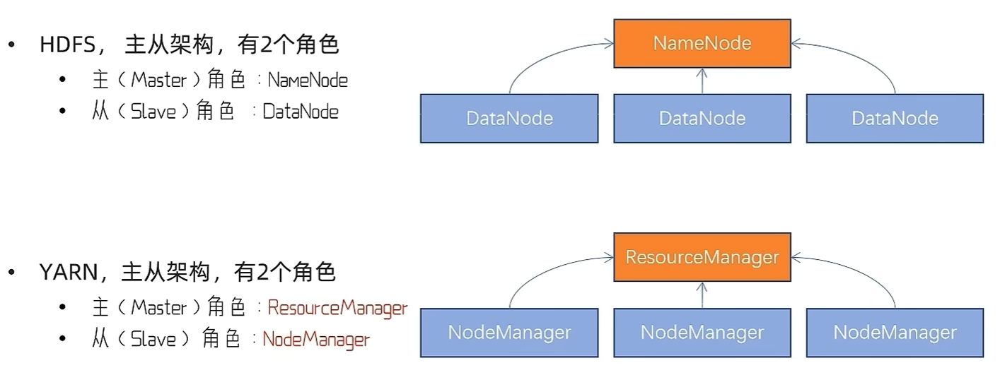

## 一、分布式概述

分布式数据计算分为两种

- 分散->汇总模式 Spark、Flink

  

- 中心调度->步骤执行模式 MapReduce

  

### MapReduce

MapReduce是Hadoop的分布式计算组件（分散->汇总模式），包含两个变成接口

- Map提供分散功能，由服务器分布式对数据进行处理
- Reduce提供汇总功能，将分布式的处理结果汇总

### YARN

YARN是Hadoop内提供的分布式资源调度组件，（资源包括：CPU、内存、硬盘、网络）

服务器会运行多个程序，每个程序对资源（CPU内存等）的使用都不同，程序有多少用多少，没有节制，调度就非常重要了

**架构**



YARN中的核心角色

- ResourceManager：整个集群的资源调度者，负责协调各个程序所需资源
- NodeManager：单个服务器的资源调度者，负责调度单个服务器上的资源给应用程序使用

YARN中的辅助角色（运行更稳定）

- 代理服务器 ProxyServer：Web Application Proxy Web应用程序代理

  减少通过YARN进行基于网络的攻击可能性：警告用户正在访问一个不受信任的站点、剥离用户访问的Cookie等

- 历史服务器 JobHistoryServer：应用程序历史信息记录服务

  程序运行时是在各自的map容器中，对应的日志也产生在那里，当想看某个map的日志需要登录对应的服务器+命令行查看。使用JobHistoryServer就可以将日志统一到HDFS中，在页面中查看

## YARN部署

### MapReduce配置文件

1. 核心配置文件,**hadoop-env.sh** - Java环境配置

```bash
cd /export/server/hadoop-3.4.2/etc/hadoop/
vim mapred-env.sh
```

打开后输入

```bash
# 设置JDK路径
export JAVA_HOME=/export/server/jdk
# 设置 JobHistoryServer进程为1G
export HADOOP_JOB_HISTORYSERVER_HEAPSIZE=1024
# 设置日志级别为INFO
export HADOOP_MAPRED_ROOT_LOGGER=INFO,RFA
```

2. **mapred-site.xml** - MapReduce配置（关键！）

```bash
vim mapred-site.xml
```

打开后输入

```bash
<configuration>
    <property>
        <name>mapreduce.framework.name</name>
        <value>yarn</value>
        <description>指定MapReduce的运行框架为YARN</description>
    </property>
    
    <property>
        <name>mapreduce.jobhistory.address</name>
        <value>node1:10020</value>
        <description>MapReduce历史服务器地址</description>
    </property>

    <property>
        <name>mapreduce.jobhistory.webapp.address</name>
        <value>node1:19888</value>
        <description>MapReduce历史服务器Web UI地址</description>
    </property>
    
    <property>
        <name>mapreduce.jobhistory.intermediate-done-dir</name>
        <value>/data/mr-history/tmp</value>
        <description>历史信息在HDFS的记录临时路径</description>
    </property>
    
    <property>
        <name>mapreduce.jobhistory.done-dir</name>
        <value>/data/mr-history/done</value>
        <description>历史信息在HDFS的记录路径</description>
    </property>
    
    <property>
        <name>yarn.app.mapreduce.am.env</name>
        <value>HADOOP_MAPRED_HOME=$HADOOP_HOME</value>
        <description>MapReduce HOME设置为HADOOP_HOME,作用对象Application Master</description>
    </property>
    <property>
        <name>mapreduce.map.env</name>
        <value>HADOOP_MAPRED_HOME=$HADOOP_HOME</value>
        <description>MapReduce HOME设置为HADOOP_HOME,作用对象Map任务容器</description>
    </property>
    
    <property>
        <name>mapreduce.reduce.env</name>
        <value>HADOOP_MAPRED_HOME=$HADOOP_HOME</value>
        <description>MapReduce HOME设置为HADOOP_HOME,作用对象Reduce任务容器</description>
    </property>
</configuration>
```

3. 在 $HADOOP_HOME/etc/hadoop 文件夹内，修改

yarn-env.sh文件，添加4行环境变量内容

```bash
vim yarn-env.sh
```

```bash
# 设置JDK的环境变量
export JAVA_HOME=/export/server/jdk
# 设置HADOOP_HOME的环境变量
export HADOOP_HOME=/export/server/hadoop
# 设置配置文件路径的环境变量
export HADOOP_CONF_DIR=$HADOOP_HOME/etc/hadoop
# 设置日志文件路径的环境变量
export JAVA_LOG_DIR=$HADOOP_HOME/logs
```

4. yarn-site.xml - YARN资源配置

```bash
vim yarn-site.xml
```

```xml
<configuration>
    <property>
        <name>yarn.resourcemanager.hostname</name>
        <value>node1</value>
        <description>ResourceManager设置在node1节点</description>
    </property>
    
    <property>
        <name>yarn.nodemanager.local-dirs</name>
        <value>/data/nm-local</value>
        <description>NodeManager中间数据本地存储路径</description>
    </property>
    
    <property>
        <name>yarn.nodemanager.log-dirs</name>
        <value>/data/nm-log</value>
        <description>NodeManager数据日志本地存储路径</description>
    </property>
    
    <property>
        <name>yarn.nodemanager.aux-services</name>
        <value>mapreduce_shuffle</value>
        <description>NodeManager上运行的附属服务：开启Shuffle</description>
    </property>
    
    <property>
        <name>yarn.log.server.url</name>
        <value>http://node1:19888/jobhistory/logs</value>
        <description>历史服务器URL</description>
    </property>
    
    <property>
        <name>yarn.web-proxy.address</name>
        <value>node1:8089</value>
        <description>代理服务器主机和端口</description>
    </property>
    
    <property>
        <name>yarn.log-aggregation-enable</name>
        <value>true</value>
        <description>开启日志聚合</description>
    </property>
    
    <property>
        <name>yarn.nodemanagrer.remote-app-log-dir</name>
        <value>/tmp/logs</value>
        <description>程序日志和HDFS的存储路径</description>
    </property>
    
    <property>
        <name>yarn.resourcemanager.scheduler.class</name>
        <value>org.apache.hadoop.yarn.server.resourcemanager.scheduler.fair.FairScheduler</value>
        <description>选择公平调度器</description>
    </property>
</configuration>
```

5. 分发配置文件

```bash
scp mapred-env.sh mapred-site.xml yarn-env.sh yarn-site.xml node2:`pwd`/
scp mapred-env.sh mapred-site.xml yarn-env.sh yarn-site.xml node3:`pwd`/
```

### 启动YARN

|               | 启动                                                         | 关闭                                                         |
| ------------- | ------------------------------------------------------------ | ------------------------------------------------------------ |
| 逐个启停yarn  | $HADOOP_HOME/bin/yarn --daemon start resourcemanager\|nodemanager\|proxyserver | $HADOOP_HOME/bin/yarn --daemon stop resourcemanager\|nodemanager\|proxyserver |
| 一键启停yarn  | $HADOOP_HOME/sbin/start-yarn.sh                              | $HADOOP_HOME/sbin/stop-yarn.sh                               |
| historyserver | $HADOOP_HOME/bin/mapred --daemon start historyserver         | $HADOOP_HOME/bin/mapred --daemon stop historyserver          |

YARN的WEB UI：查看YARN集群的监控页面（ResourceManager的WEB UI）http://node1:8088

HDFS的WEB UI：http://node1:9870


```bash
$HADOOP_HOME/sbin/start-yarn.sh
```

- 从yarn-site.xml中读取配置，确定ResourceManager所在机器，并启动它

- 读取workers文件，确定机器，启动全部的NodeManager

- 当前机器启动ProxySercer（代理服务器）

## 提交MapReduce任务到YARN

Hive底层用的MapReduce,目前很少写MapReduce的程序代码

YARN作为资源调度管控框架，提供资源给很多程序运行

- MapReduce
- Spark
- Flink

Hadoop中内置了一些预置的MapReduce程序代码，无需编程，通过命令即可使用。示例程序代码记录在(Hadoop编译之后的jar包)`$HADOOP_HOME/share/hadoop/mpreduce/hadoop-mapreduce-examples-3.4.2.jar`

- wordcount：单词计数（统计指定文件内各个单词出现的次数）
- pi：求圆周率（通过蒙特卡罗算法，统计模拟法）

语法：`Hadoop jar 程序文件 java类名 [程序参数] ... [程序参数]`


```bash
[hadoop@node1 ~]$ cd /export/server/hadoop/share/hadoop/mapreduce
```

