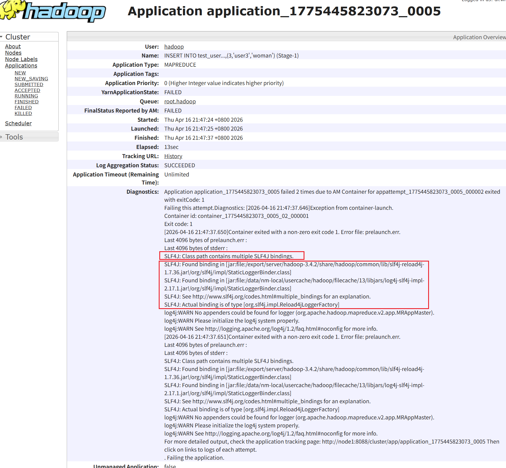
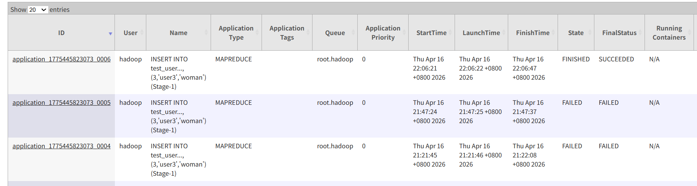
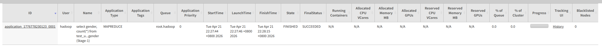

Hive将SQL语句翻译为MapReduce程序运行，提供用户分布式SQL计算的能力

## 4.1、Hive基础架构


## 4.2、Hive部署

Hive是单机工具，只需要部署一台服务器，但是他可以提交分布式运行的MapReduce程序运行

### 4.2.1 元数据管理

Hive需要使用元数据管理，所以将Hive本体和MySQL存储在node1服务器上

```bash
# 更新秘钥
rpm --import https://repo.mysql.com/RPM-GPG-KEY-mysql-2022
# 安装MySQL yum库
rpm -Uvh http://repo.mysql.com//mysql57-community-release-el7-7.noarch.rpm
# yum 安装 MySQL
yum install -y mysql-community-server
# 启动Mysql，设置开机启动
systemctl start mysqld
systemctl enable mysqld
# 检查mysql状态
systemctl status mysqld
# 第一次启动mysql，会在日志文件中生成
[root@node1 ~]# grep 'temporary password' /var/log/mysqld.log
#2026-04-12T09:51:18.241513Z 1 [Note] A temporary password is generated for root@localhost: zqeldpw<U2fh
# 使用密码登录mysql
[root@node1 ~]# mysql -uroot -p
# 如果相设置简单密码，需要降低MySQL的
set global validate_password_policy=LOW;
set global validate_password_length=4;
# 然后就可以使用简单密码，这里是本地环境，Prod最好不要这样
ALTER USER 'root'@'localhost' IDENTIFIED BY '281211';
# root用户从任意地方主机远程登录权限
grant all privileges on *.* to root@"%" identified by '281211' with grant option;
flush privileges;
# ctrl+shift+D 退出
```

### 4.2.2 配置Hadoop

Hive的运行依赖Hadoop（HDFS、MapReduce、YARN），就会涉及到对HDFS文件系统的访问，需要配置Hadoop的代理用户，即设置hadoop允许代理其他用户。

在hadoop的`core-site.xml`配置允许hadoop用户代理任意的主机和群组。

```bash
vim $HADOOP_HOME/etc/hadoop/core-site.xml

```

添加配置

```xml
<property>
    <name>hadoop.proxyuser.hadoop.hosts</name>
    <value>*</value>
    <description>允许hadoop用户代理任意的主机</description>
</property>

<property>    
    <name>hadoop.proxyuser.hadoop.groups</name>    
    <value>*</value>
    <description>允许hadoop用户代理任意的群组</description>
</property>
```

中分发到其他节点，重启HDFS集群

```bash
[root@node1 hadoop]# scp core-site.xml hdfs-site.xml node2:`pwd`
core-site.xml                                                           100% 1731   541.4KB/s   00:00    
hdfs-site.xml                                                           100% 2424     1.8MB/s   00:00    
[root@node1 hadoop]# scp core-site.xml hdfs-site.xml node3:`pwd`
core-site.xml                                                           100% 1731     1.6MB/s   00:00    
hdfs-site.xml 
```

### 4.2.3 下载解压Hive

切换到root，进入目标安装目录，使用wget从华为云镜像下载（国内速度快）

```bash
su - root
cd /export/server/
wget -c https://mirrors.huaweicloud.com/apache/hive/hive-3.1.3/apache-hive-3.1.3-bin.tar.gz
```

解压到当前目录，并进行软链接

```bash
tar -zxvf apache-hive-3.1.3-bin.tar.gz -C /export/server/
ln -s /export/server/apache-hive-3.1.3-bin /export/server/hive
```

修改权限

```bash
sudo chown -R hadoop:hadoop hive  # 如果用户是hadoop
```

下载mysql的驱动包，并将其移至于 hive的lib目录下

```bash
wget https://dev.mysql.com/get/Downloads/Connector-J/mysql-connector-j-8.0.33.tar.gz
tar -xzvf mysql-connector-j-8.0.33.tar.gz 
# 解压出来的文件中包含mysql-connector-j-8.0.33/mysql-connector-j-8.0.33.jar
mv -f mysql-connector-j-8.0.33/mysql-connector-j-8.0.33.jar /export/server/hive/lib/

```

Hive 3.1.3 和 Hadoop 3.4.2 之间的依赖版本冲突,需要添加缺失的jar包

```bash
cd /export/server/apache-hive-3.1.3-bin/lib
wget https://repo1.maven.org/maven2/commons-collections/commons-collections/3.2.2/commons-collections-3.2.2.jar
```

### 4.2.4 配置Hive环境变量

进入Hive的conf目录，新建`hive-env.sh`文件

```bash
cd /export/server/hive/conf/
mv hive-env.sh.template hive-env.sh
vim hive-env.sh
```

填入环境变量内容

```bash
export HADOOP_HOME=/export/server/hadoop
export HIVE_CONF_DIR=/export/server/hive/conf
export HIVE_AUX_JARS_PATH=/export/server/hive/lib
```

在Hive的conf目录，新建`hive-site.xml`文件

```bash
vim /export/server/hive/conf/hive-site.xml
```

添加以下配置（MySQL模式）：

```xml
<configuration>
  <!-- MySQL连接URL -->
  <property>
    <name>javax.jdo.option.ConnectionURL</name>
    <value>jdbc:mysql://node1:3306/hive?createDatabaseIfNotExist=true&amp;useSSL=false&amp;useUnicode=true&amp;characterEncoding=UTF-8</value>
  </property>
  <!-- MySQL连接驱动 -->
  <property>
    <name>javax.jdo.option.ConnectionDriverName</name>
    <value>com.mysql.cj.jdbc.Driver</value>
  </property>
  <!-- MySQL账号名 -->
  <property>
    <name>javax.jdo.option.ConnectionUserName</name>
    <value>root</value>
  </property>
  <!-- MySQL密码 -->
  <property>
    <name>javax.jdo.option.ConnectionPassword</name>
    <value>281211</value>
  </property>
  <!-- server2绑定主机node1 -->
  <property>
    <name>hive.server2.thrift.bind.host</name>
    <value>node1</value>
  </property>
  <!-- 元数据服务node1绑定到9083端口 -->
  <property>
    <name>hive.metastore.uris</name>
    <value>thrift://node1:9083</value>
  </property>
  <!-- 元数据授权认证 -->
  <property>
    <name>hive.metastore.event.db.notification.api.auth</name>
    <value>false</value>
  </property>
  
</configuration>
```

### 4.2.5 HIVE_HOME

切换到root用户

```bash
vim /etc/profile
```

在文件末尾添加

```bash
export HIVE_HOME=/export/server/hive
export PATH=$PATH:$HIVE_HOME/bin
```

### 4.2.6 初始化元数据库

启动Hive前，初始化Hive所需的元数据库，新建数据库Hive

进入mysql

```bash
mysql -uroot -p
```

创建hive数据库

```mysql
CREATE DATABASE hive CHARSET UTF8;
```

Ctrl+shift+D退出mysql，使用`/export/server/hive/bin/schematool`程序初始化刚建的表，完成初始化

```bash
cd /export/server/hive/bin/
./schematool -initSchema -dbType mysql -verbos
```

进入mysql查看是否初始化成功

```bash
mysql -uroot -p
```

看数据库中是否有初始化的74张表

```mysql
mysql> show databases;
+--------------------+
| Database           |
+--------------------+
| information_schema |
| hive               |
| hive_metastore     |
| mysql              |
| performance_schema |
| sys                |
+--------------------+
6 rows in set (0.01 sec)
mysql> use hive
Reading table information for completion of table and column names
You can turn off this feature to get a quicker startup with -A

Database changed
mysql> show tables
    -> ;
+-------------------------------+
| Tables_in_hive                |
+-------------------------------+
| AUX_TABLE                     |
| BUCKETING_COLS                |
| CDS                           |
| COLUMNS_V2                    |
| COMPACTION_QUEUE              |
| COMPLETED_COMPACTIONS         |
| COMPLETED_TXN_COMPONENTS      |
| CTLGS                         |
| DATABASE_PARAMS               |
| DBS                           |
| DB_PRIVS                      |
| DELEGATION_TOKENS             |
| FUNCS                         |
| FUNC_RU                       |
| GLOBAL_PRIVS                  |
| HIVE_LOCKS                    |
| IDXS                          |
| INDEX_PARAMS                  |
| I_SCHEMA                      |
| KEY_CONSTRAINTS               |
| MASTER_KEYS                   |
| MATERIALIZATION_REBUILD_LOCKS |
| METASTORE_DB_PROPERTIES       |
| MIN_HISTORY_LEVEL             |
| MV_CREATION_METADATA          |
| MV_TABLES_USED                |
| NEXT_COMPACTION_QUEUE_ID      |
| NEXT_LOCK_ID                  |
| NEXT_TXN_ID                   |
| NEXT_WRITE_ID                 |
| NOTIFICATION_LOG              |
| NOTIFICATION_SEQUENCE         |
| NUCLEUS_TABLES                |
| PARTITIONS                    |
| PARTITION_EVENTS              |
| PARTITION_KEYS                |
| PARTITION_KEY_VALS            |
| PARTITION_PARAMS              |
| PART_COL_PRIVS                |
| PART_COL_STATS                |
| PART_PRIVS                    |
| REPL_TXN_MAP                  |
| ROLES                         |
| ROLE_MAP                      |
| RUNTIME_STATS                 |
| SCHEMA_VERSION                |
| SDS                           |
| SD_PARAMS                     |
| SEQUENCE_TABLE                |
| SERDES                        |
| SERDE_PARAMS                  |
| SKEWED_COL_NAMES              |
| SKEWED_COL_VALUE_LOC_MAP      |
| SKEWED_STRING_LIST            |
| SKEWED_STRING_LIST_VALUES     |
| SKEWED_VALUES                 |
| SORT_COLS                     |
| TABLE_PARAMS                  |
| TAB_COL_STATS                 |
| TBLS                          |
| TBL_COL_PRIVS                 |
| TBL_PRIVS                     |
| TXNS                          |
| TXN_COMPONENTS                |
| TXN_TO_WRITE_ID               |
| TYPES                         |
| TYPE_FIELDS                   |
| VERSION                       |
| WM_MAPPING                    |
| WM_POOL                       |
| WM_POOL_TO_TRIGGER            |
| WM_RESOURCEPLAN               |
| WM_TRIGGER                    |
| WRITE_SET                     |
+-------------------------------+
74 rows in set (0.00 sec)
```

### 4.2.7 解决 Hive3+Hadoop3执行MapReduce日志刷屏

`shift + C`退出Hive

进入$HIVE_HOME/conf的log4j.properties文件

```bash
cd $HIVE_HOME/conf
vi hive-log4j2.properties
```

使用 `:%d` 清空文件内容后，复制下面内容到文件中

```properties
log4j.rootLogger=WARN, CA
log4j.appender.CA=org.apache.log4j.ConsoleAppender
log4j.appender.CA.layout=org.apache.log4j.PatternLayout
log4j.appender.CA.layout.ConversionPattern=%-4r [%t] %-5p %c %x - %m%n
```

`hive` 进入 hive后测试

```bash
hive> show databases;
OK
default
Time taken: 0.232 seconds, Fetched: 1 row(s)
hive> 
```

## 4.3 Hive启动

确保Hive文件夹属于hadoop用户

```bash
chown -R hadoop:hadoop apache-hive-3.1.3-bin hive
```

切换到hadoop用户，创建hive的日志文件夹

```bash
su - hadoop
cd /export/server/hive/
mkdir logs
```

启动元数据管理服务（不启动无法工作）

### 4.3.1 前台启动

- 终端被进程占用，不能执行其他命令
- 按 `Ctrl+C`/关闭终端窗口 会终止服务
- 输出日志直接显示在终端

```bash
bin/hive --service metastore
```

### 4.3.2 后台启动

- 进程在后台运行，终端可继续使用
- 关闭终端不会影响进程运行
- 输出重定向到日志文件
- 有进程号（PID），可以用 kill PID停止
- 适合生产环境

```bash
nohup bin/hive --service metastore >> logs/metastore.log 2>&1 &
```

查看日志

```bash
cd /export/server/hive/logs
tail -f metastore.log
```

启动客户端（二选一，现在用Hive Shell方式）

- Hive Shell (可以直接写SQL)

```bash
$HIVE_HOME/bin/hive -e "show databases;"
# 成功输出：
# OK
# default
# Time taken: 1.234 seconds, Fetched: 1 row(s)
```

- Hive ThriftServer (不可以直接写SQL，需要外部客户端链接使用)

```bash
bin/hive --service hiveserver2
```

### 4.3.3 验证成功的三种方式

jps后出现RunJar

```bash
[root@node1 ~]# jps
3632 ResourceManager
2913 NameNode
4178 WebAppProxyServer
3043 DataNode
6693 JobHistoryServer
33673 Jps
3385 SecondaryNameNode
3786 NodeManager
28410 RunJar
[root@node1 ~]# netstat -tlnp | grep 9083
tcp6       0      0 :::9083                 :::*                    LISTEN      28410/java          
[root@node1 ~]# ps -ef | grep -i metastore | grep -v grep
hadoop    28410      1  0 16:05 ?        00:00:35 /export/server/jdk/bin/java -Dproc_jar -Dproc_metastore -Dlog4j2.formatMsgNoLookups=true -Dlog4j.configurationFile=hive-log4j2.properties -Djava.util.logging.config.file=/export/server/hive/conf/parquet-logging.properties -Dyarn.log.dir=/export/server/hadoop/logs -Dyarn.log.file=hadoop.log -Dyarn.home.dir=/export/server/hadoop -Dyarn.root.logger=INFO,console -Djava.library.path=/export/server/hadoop/lib/native -Xmx256m -Dhadoop.log.dir=/export/server/hadoop/logs -Dhadoop.log.file=hadoop.log -Dhadoop.home.dir=/export/server/hadoop -Dhadoop.id.str=hadoop -Dhadoop.root.logger=INFO,console -Dhadoop.policy.file=hadoop-policy.xml -Dhadoop.security.logger=INFO,NullAppender -XX:+IgnoreUnrecognizedVMOptions --add-opens=java.base/java.io=ALL-UNNAMED --add-opens=java.base/java.lang=ALL-UNNAMED --add-opens=java.base/java.lang.reflect=ALL-UNNAMED --add-opens=java.base/java.math=ALL-UNNAMED --add-opens=java.base/java.net=ALL-UNNAMED --add-opens=java.base/java.text=ALL-UNNAMED --add-opens=java.base/java.util=ALL-UNNAMED --add-opens=java.base/java.util.concurrent=ALL-UNNAMED --add-opens=java.base/java.util.zip=ALL-UNNAMED --add-opens=java.base/sun.security.util=ALL-UNNAMED --add-opens=java.base/sun.security.x509=ALL-UNNAMED org.apache.hadoop.util.RunJar /export/server/apache-hive-3.1.3-bin/lib/hive-metastore-3.1.3.jar org.apache.hadoop.hive.metastore.HiveMetaStore

```

## 4.4 Hive执行SQL

`bin/hive` 命令可以进入Hive Shell环境中，直接执行SQL语句

创建表

```mysql
CREATE TABLE test_user(id INT,name STRING,gender STRING);
INSERT INTO test_user VALUES(1,'user1','man'),(2,'user2','man'),(3,'user3','woman');
SELECT gender,COUNT(*) AS cnt FROM test GROUP BY gender;
```

### insert 失败处理

hadoop 3.4.2 和Hive3.1.3的SLF4J的包发生了冲突


解决办法：

删除Hive的slf4j/log4j包

```bash
# 进入 Hive 的 lib 目录
cd $HIVE_HOME/lib

# 删除冲突的 slf4j/log4j 包（关键！）
rm -f log4j-slf4j-impl-*.jar
rm -f slf4j-log4j12-*.jar
rm -f slf4j-reload4j-*.jar
```

重启 Hadoop 服务：

```bash
stop-all.sh
start-all.sh
```

再次测试

```bash
INSERT INTO test_user VALUES(1,'user1','man'),(2,'user2','man'),(3,'user3','woman');
```

查看job history发现成功



### 测试查询

```mysql
select * from test_user;
select gender, count(*) from test_user group by gender;
```

输出分别如下：

直接*则不会走mapreduce，但是涉及到group by的计算则会进行mapreduce

验证了Hive写的是SQL，但实际运行的时Mapreduce

```hive
hive> select * from test_user;
199493 [85949d1f-66dc-43ac-8098-ccea1278ad63 main] WARN  org.apache.hadoop.hive.ql.session.SessionState  - METASTORE_FILTER_HOOK will be ignored, since hive.security.authorization.manager is set to instance of HiveAuthorizerFactory.
OK
1	user1	man
2	user2	man
3	user3	woman
Time taken: 0.731 seconds, Fetched: 3 row(s)

hive> select gender, count(*) from test_user group by gender;
302058 [85949d1f-66dc-43ac-8098-ccea1278ad63 main] WARN  org.apache.hadoop.hive.ql.Driver  - Hive-on-MR is deprecated in Hive 2 and may not be available in the future versions. Consider using a different execution engine (i.e. spark, tez) or using Hive 1.X releases.
Query ID = hadoop_20260421222725_3d5082f4-7e62-40f6-8874-318a4bb8dd2f
Total jobs = 1
Launching Job 1 out of 1
Number of reduce tasks not specified. Estimated from input data size: 1
In order to change the average load for a reducer (in bytes):
  set hive.exec.reducers.bytes.per.reducer=<number>
In order to limit the maximum number of reducers:
  set hive.exec.reducers.max=<number>
In order to set a constant number of reducers:
  set mapreduce.job.reduces=<number>
303251 [85949d1f-66dc-43ac-8098-ccea1278ad63 main] WARN  org.apache.hadoop.mapreduce.JobResourceUploader  - Hadoop command-line option parsing not performed. Implement the Tool interface and execute your application with ToolRunner to remedy this.
Starting Job = job_1776778230123_0001, Tracking URL = http://node1:8089/proxy/application_1776778230123_0001/
Kill Command = /export/server/hadoop/bin/mapred job  -kill job_1776778230123_0001
Hadoop job information for Stage-1: number of mappers: 1; number of reducers: 1
331428 [85949d1f-66dc-43ac-8098-ccea1278ad63 main] WARN  mapreduce.Counters  - Group org.apache.hadoop.mapred.Task$Counter is deprecated. Use org.apache.hadoop.mapreduce.TaskCounter instead
2026-04-21 22:27:54,852 Stage-1 map = 0%,  reduce = 0%
2026-04-21 22:28:03,156 Stage-1 map = 100%,  reduce = 0%, Cumulative CPU 1.68 sec
2026-04-21 22:28:16,365 Stage-1 map = 100%,  reduce = 100%, Cumulative CPU 2.86 sec
MapReduce Total cumulative CPU time: 2 seconds 860 msec
Ended Job = job_1776778230123_0001
MapReduce Jobs Launched: 
Stage-Stage-1: Map: 1  Reduce: 1   Cumulative CPU: 2.86 sec   HDFS Read: 12915 HDFS Write: 125 SUCCESS
Total MapReduce CPU Time Spent: 2 seconds 860 msec
OK
man	2
woman	1
Time taken: 52.332 seconds, Fetched: 2 row(s)
hive> 
```

在 `node1:8088` 中可以看到运行过程



### 查看表存储位置

看似是在查询表，但实际是以文件的形式存储在hdfs中，通过mapreduce进行计算后以表格的形式返回

hdfs://node1:8020/user/hive/warehouse/

```bash
[hadoop@node1 conf]$ hdfs dfs -ls /user/hive/warehouse/
Found 1 items
drwxrwxrwx   - hadoop supergroup          0 2026-04-16 22:06 /user/hive/warehouse/test_user
```

查看表的数据（数据之间是不可见的分隔符）

```bash
[hadoop@node1 conf]$ hdfs dfs -cat /user/hive/warehouse/test_user/*
1user1man
2user2man
3user3woman
```

## 4.5 Hive 客户端

有两种方式启动Hive

- 方式1：`bin/hive`（Hive CLI）即Hive的shell客户端，直接运行在你的机器上，并直接连接到Hadoop集群（读取HDFS数据，提交MapReduce/Tez/Spark任务）可以直接写SQL

  - **单用户**：一次只能有一个用户登录使用
  - **直接模式**：没有中间服务层，CLI直接驱动查询执行
  - **学习/调试方便**：适合初学者本地学习和快速执行简单脚本

  ```bash
  $ cd /your-hive-path/bin
  $ ./hive
  hive> show databases;
  hive> select * from my_table limit 10;
  ```

  

- 方式2：`bin/hive --service hiveserver2` (HS2)是大数据架构中的标准组件,是hive内置的ThriftServer服务。一个**长期运行、支持多用户并发访问的Thrift/RPC服务**。它提供端口10000供其他客户端（hive内置的beeline客户端 命令行工具、第三方的图形化SQL工具 DataGrip DBeaver）连接。

  - **远程访问**：用户或应用程序无需登录Hive所在服务器，通过网络即可连接。
  - **多用户并发**：支持多个用户同时提交查询，并提供了基本的权限管理。
  - **多种接口**：支持**JDBC** (Java数据库连接标准) 和 **ODBC**，这使得各种BI工具（如Tableau、FineBI）、编程语言（Java, Python）都可以像连接MySQL一样连接Hive。
  - **更好的安全性**：支持Kerberos认证，并且以提交查询的用户身份去访问HDFS，而不是统一的`hive`用户，更安全。

  启动HS2服务（通常在服务器后台运行）

  ```bash
  $ hive --service hiveserver2 &
  # 或者使用 nohup 让它在后台持续运行
  $ nohup bin/hive --service metastore >> logs/metastore.log 2>&1 & # 先启动metastore，再启动hiveserver2
  $ mkdir -p /logs # 进入￥HIVE_HOME后创建日志目录（如果不存在的话）
  $ nohup bin/hive --service hiveserver2 >> logs/hiveserver2.log 2>&1 &
  ```

  使用客户端连接:Hive提供了专门的Beeline客户端（基于SQLLine）来连接HS2，它比老的Hive CLI更轻量、功能更现代

  ```bash
  $ beeline -u jdbc:hive2://localhost:10000 -n username
  # 连接成功后，就进入了beeline提示符，可以写SQL
  0: jdbc:hive2://localhost:10000> show databases;
  ```

验证是否启动hiveserver2成功

```bash
[hadoop@node1 hive]$ jps
12161 Jps
3074 ResourceManager
3236 NodeManager
2824 SecondaryNameNode
3626 WebAppProxyServer
12010 RunJar
2475 DataNode
4139 JobHistoryServer
2349 NameNode
6847 RunJar
```

会有两个RunJar，其中12010是hiveserver2，6847是metastore

```bash
$ ps -ef|grep 12010
```

结尾输出 zstd

```bash
-shaded-4.4.jar,file:///export/server/hive/lib/xz-1.5.jar,file:///export/server/hive/lib/zookeeper-3.4.6.jar,file:///export/server/hive/lib/zstd-jni-1.3.2-2.jar
hadoop    12217  11799  0 08:08 pts/0    00:00:00 grep --color=auto 12010
```


```bash
$ ps -ef|grep 6847
```

结尾输出 HiveMetaStore

```bash
UNNAMED --add-opens=java.base/sun.security.util=ALL-UNNAMED --add-opens=java.base/sun.security.x509=ALL-UNNAMED org.apache.hadoop.util.RunJar /export/server/hive/lib/hive-metastore-3.1.3.jar org.apache.hadoop.hive.metastore.HiveMetaStore
hadoop    12233  11799  0 08:09 pts/0    00:00:00 grep --color=auto 6847
```


### 4.5.1 HiveServer & Beeline

```text
+-------------------+      Thrift RPC 调用 (基于IDL约定)    +---------------------+
|  你的Python程序    |  ================================>  |    HiveServer2服务   |
|  (使用Thrift生成   |  <================================  | (Java实现，持续运行)   |
|   的Python客户端)  |        返回查询结果/状态           	  |                     |
+-------------------+                                     +---------------------+
         |                                                          |
         | 1. 调用`execute_sql("SELECT ...")`                        | 3. 在Hadoop集群执行查询
         | 2. Thrift库序列化请求，通过TCP发送到10000端口           	   | 4. 获取结果，序列化后返回
         |                                                          |
+-------------------+                                     +---------------------+
|   网络传输层       |                                     |    Hadoop集群        |
|   (TCP/IP)        |                                     |  (HDFS, YARN, etc.) |
+-------------------+                                     +---------------------+
```


| **特性**       | **Hive CLI (`bin/hive`)**                | **HiveServer2 + Beeline**                          |
| :------------- | :--------------------------------------- | :------------------------------------------------- |
| **架构模式**   | 单机直接模式                             | 客户端/服务器 (C/S) 模式                           |
| **用户并发**   | **单用户**                               | **多用户并发**                                     |
| **访问方式**   | 必须登录服务器本地执行                   | **远程网络访问** (JDBC/ODBC)                       |
| **主要客户端** | Hive 自带CLI                             | **Beeline** (官方推荐)、各种JDBC程序               |
| **应用场景**   | 本地测试、简单脚本、学习                 | **生产环境标准**、被调度系统、BI工具、应用程序调用 |
| **安全性**     | 低（以启动CLI的用户身份执行）            | 高（支持用户身份认证和授权）                       |
| **未来发展**   | 已标记为**过时**，在新版本中可能会被移除 | **主流和未来方向**                                 |


### 4.5.2 DataGrip & DBeaver

