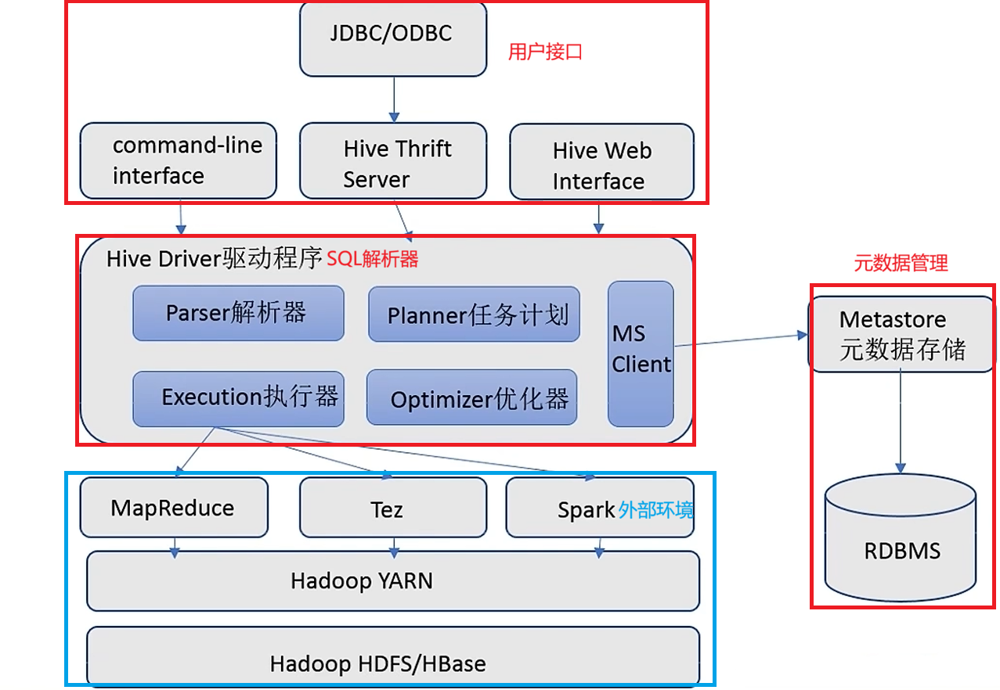

Hive将SQL语句翻译为MapReduce程序运行，提供用户分布式SQL计算的能力

## 4.1、Hive基础架构



## 4.2、Hive部署

Hive是单机工具，只需要部署一台服务器，但是他可以提交分布式运行的MapReduce程序运行

### 4.2.1 元数据管理

Hive需要使用元数据管理，所以将Hive本体和MySQL存储在node1服务器上

```bash
# 更新秘钥
rpm --import https://repo.mysql.com/RPM-GPG-KEY-mysql-2022
# 安装MySQL yum库
rpm -Uvh http://repo.mysql.com//mysql57-community-release-el7-7.noarch.rpm
# yum 安装 MySQL
yum install -y mysql-community-server
# 启动Mysql，设置开机启动
systemctl start mysqld
systemctl enable mysqld
# 检查mysql状态
systemctl status mysqld
# 第一次启动mysql，会在日志文件中生成
[root@node1 ~]# grep 'temporary password' /var/log/mysqld.log
#2026-04-12T09:51:18.241513Z 1 [Note] A temporary password is generated for root@localhost: zqeldpw<U2fh
# 使用密码登录mysql
[root@node1 ~]# mysql -uroot -p
# 如果相设置简单密码，需要降低MySQL的
set global validate_password_policy=LOW;
set global validate_password_length=4;
# 然后就可以使用简单密码，这里是本地环境，Prod最好不要这样
ALTER USER 'root'@'localhost' IDENTIFIED BY '281211';
# root用户从任意地方主机远程登录权限
grant all privileges on *.* to root@"%" identified by '281211' with grant option;
flush privileges;
# ctrl+shift+D 退出
```

### 4.2.2 配置Hadoop

Hive的运行依赖Hadoop（HDFS、MapReduce、YARN），就会涉及到对HDFS文件系统的访问，需要配置Hadoop的代理用户，即设置hadoop允许代理其他用户。

在hadoop的`core-site.xml`配置允许hadoop用户代理任意的主机和群组。

```bash
vim $HADOOP_HOME/etc/hadoop/core-site.xml

```

添加配置

```xml
<property>
    <name>hadoop.proxyuser.hadoop.hosts</name>
    <value>*</value>
    <description>允许hadoop用户代理任意的主机</description>
</property>

<property>    
    <name>hadoop.proxyuser.hadoop.groups</name>    
    <value>*</value>
    <description>允许hadoop用户代理任意的群组</description>
</property>
```

中分发到其他节点，重启HDFS集群

```bash
[root@node1 hadoop]# scp core-site.xml hdfs-site.xml node2:`pwd`
core-site.xml                                                           100% 1731   541.4KB/s   00:00    
hdfs-site.xml                                                           100% 2424     1.8MB/s   00:00    
[root@node1 hadoop]# scp core-site.xml hdfs-site.xml node3:`pwd`
core-site.xml                                                           100% 1731     1.6MB/s   00:00    
hdfs-site.xml 
```

### 4.2.3 下载解压Hive

切换到root，进入目标安装目录，使用wget从华为云镜像下载（国内速度快）

```bash
su - root
cd /export/server/
wget -c https://mirrors.huaweicloud.com/apache/hive/hive-3.1.3/apache-hive-3.1.3-bin.tar.gz
```

解压到当前目录，并进行软链接

```bash
tar -zxvf apache-hive-3.1.3-bin.tar.gz -C /export/server/
ln -s /export/server/apache-hive-3.1.3-bin /export/server/hive
```

修改权限

```bash
sudo chown -R hadoop:hadoop hive  # 如果用户是hadoop
```

下载mysql的驱动包，并将其移至于 hive的lib目录下

```bash
wget https://dev.mysql.com/get/Downloads/Connector-J/mysql-connector-j-8.0.33.tar.gz
tar -xzvf mysql-connector-j-8.0.33.tar.gz 
# 解压出来的文件中包含mysql-connector-j-8.0.33/mysql-connector-j-8.0.33.jar
mv -f mysql-connector-j-8.0.33/mysql-connector-j-8.0.33.jar /export/server/hive/lib/

```

Hive 3.1.3 和 Hadoop 3.4.2 之间的依赖版本冲突,需要添加缺失的jar包

```bash
cd /export/server/apache-hive-3.1.3-bin/lib
wget https://repo1.maven.org/maven2/commons-collections/commons-collections/3.2.2/commons-collections-3.2.2.jar
```

### 4.2.4 配置Hive环境变量

进入Hive的conf目录，新建`hive-env.sh`文件

```bash
cd /export/server/hive/conf/
mv hive-env.sh.template hive-env.sh
vim hive-env.sh
```

填入环境变量内容

```bash
export HADOOP_HOME=/export/server/hadoop
export HIVE_CONF_DIR=/export/server/hive/conf
export HIVE_AUX_JARS_PATH=/export/server/hive/lib
```

在Hive的conf目录，新建`hive-site.xml`文件

```bash
vim /export/server/hive/conf/hive-site.xml
```

添加以下配置（MySQL模式）：

```xml
<configuration>
  <!-- MySQL连接URL -->
  <property>
    <name>javax.jdo.option.ConnectionURL</name>
    <value>jdbc:mysql://node1:3306/hive?createDatabaseIfNotExist=true&amp;useSSL=false&amp;useUnicode=true&amp;characterEncoding=UTF-8</value>
  </property>
  <!-- MySQL连接驱动 -->
  <property>
    <name>javax.jdo.option.ConnectionDriverName</name>
    <value>com.mysql.cj.jdbc.Driver</value>
  </property>
  <!-- MySQL账号名 -->
  <property>
    <name>javax.jdo.option.ConnectionUserName</name>
    <value>root</value>
  </property>
  <!-- MySQL密码 -->
  <property>
    <name>javax.jdo.option.ConnectionPassword</name>
    <value>281211</value>
  </property>
  <!-- server2绑定主机node1 -->
  <property>
    <name>hive.server2.thrift.bind.host</name>
    <value>node1</value>
  </property>
  <!-- 元数据服务node1绑定到9083端口 -->
  <property>
    <name>hive.metastore.uris</name>
    <value>thrift://node1:9083</value>
  </property>
  <!-- 元数据授权认证 -->
  <property>
    <name>hive.metastore.event.db.notification.api.auth</name>
    <value>false</value>
  </property>
  
</configuration>
```

### 4.2.5 初始化元数据库

启动Hive前，初始化Hive所需的元数据库，新建数据库Hive

进入mysql

```bash
mysql -uroot -p
```

创建hive数据库

```mysql
CREATE DATABASE hive CHARSET UTF8;
```

Ctrl+shift+D退出mysql，使用`/export/server/hive/bin/schematool`程序初始化刚建的表，完成初始化

```bash
cd /export/server/hive/bin/
./schematool -initSchema -dbType mysql -verbos
```

进入mysql查看是否初始化成功

```bash
mysql -uroot -p
```

看数据库中是否有初始化的74张表

```mysql
mysql> show databases;
+--------------------+
| Database           |
+--------------------+
| information_schema |
| hive               |
| hive_metastore     |
| mysql              |
| performance_schema |
| sys                |
+--------------------+
6 rows in set (0.01 sec)
mysql> use hive
Reading table information for completion of table and column names
You can turn off this feature to get a quicker startup with -A

Database changed
mysql> show tables
    -> ;
+-------------------------------+
| Tables_in_hive                |
+-------------------------------+
| AUX_TABLE                     |
| BUCKETING_COLS                |
| CDS                           |
| COLUMNS_V2                    |
| COMPACTION_QUEUE              |
| COMPLETED_COMPACTIONS         |
| COMPLETED_TXN_COMPONENTS      |
| CTLGS                         |
| DATABASE_PARAMS               |
| DBS                           |
| DB_PRIVS                      |
| DELEGATION_TOKENS             |
| FUNCS                         |
| FUNC_RU                       |
| GLOBAL_PRIVS                  |
| HIVE_LOCKS                    |
| IDXS                          |
| INDEX_PARAMS                  |
| I_SCHEMA                      |
| KEY_CONSTRAINTS               |
| MASTER_KEYS                   |
| MATERIALIZATION_REBUILD_LOCKS |
| METASTORE_DB_PROPERTIES       |
| MIN_HISTORY_LEVEL             |
| MV_CREATION_METADATA          |
| MV_TABLES_USED                |
| NEXT_COMPACTION_QUEUE_ID      |
| NEXT_LOCK_ID                  |
| NEXT_TXN_ID                   |
| NEXT_WRITE_ID                 |
| NOTIFICATION_LOG              |
| NOTIFICATION_SEQUENCE         |
| NUCLEUS_TABLES                |
| PARTITIONS                    |
| PARTITION_EVENTS              |
| PARTITION_KEYS                |
| PARTITION_KEY_VALS            |
| PARTITION_PARAMS              |
| PART_COL_PRIVS                |
| PART_COL_STATS                |
| PART_PRIVS                    |
| REPL_TXN_MAP                  |
| ROLES                         |
| ROLE_MAP                      |
| RUNTIME_STATS                 |
| SCHEMA_VERSION                |
| SDS                           |
| SD_PARAMS                     |
| SEQUENCE_TABLE                |
| SERDES                        |
| SERDE_PARAMS                  |
| SKEWED_COL_NAMES              |
| SKEWED_COL_VALUE_LOC_MAP      |
| SKEWED_STRING_LIST            |
| SKEWED_STRING_LIST_VALUES     |
| SKEWED_VALUES                 |
| SORT_COLS                     |
| TABLE_PARAMS                  |
| TAB_COL_STATS                 |
| TBLS                          |
| TBL_COL_PRIVS                 |
| TBL_PRIVS                     |
| TXNS                          |
| TXN_COMPONENTS                |
| TXN_TO_WRITE_ID               |
| TYPES                         |
| TYPE_FIELDS                   |
| VERSION                       |
| WM_MAPPING                    |
| WM_POOL                       |
| WM_POOL_TO_TRIGGER            |
| WM_RESOURCEPLAN               |
| WM_TRIGGER                    |
| WRITE_SET                     |
+-------------------------------+
74 rows in set (0.00 sec)

```

## 4.3 Hive启动

确保Hive文件夹属于hadoop用户

```bash
chown -R hadoop:hadoop apache-hive-3.1.3-bin hive
```

切换到hadoop用户，创建hive的日志文件夹

```bash
su - hadoop
cd /export/server/hive/
mkdir logs
```

启动元数据管理服务（不启动无法工作）

前台启动

```bash
bin/hive --service metastore
```

后台启动

```bash
nohup bin/hive --service metastore >> logs/metastore.log 2>&1 &
```

查看日志

```bash
cd /export/server/hive/logs
tail -f metastore.log
```

启动客户端（二选一，现在用Hive Shell方式）

- Hive Shell (可以直接写SQL)

```bash
bin/hive -e "show databases;"
# 成功输出：
# OK
# default
# Time taken: 1.234 seconds, Fetched: 1 row(s)
```

- Hive ThriftServer (不可以直接写SQL，需要外部客户端链接使用)

```bash
bin/hive --service hiveserver2
```

## 4.4 Hive执行SQL

bin/hive 命令可以进入Hive Shell环境中，直接执行SQL语句

创建表

```mysql
CREATE TABLE test_user(id INT,name STRING,gender STRING);
INSERT INTO test_user VALUES(1,'user1','man'),(2,'user2','man'),(3,'user3','woman');
SELECT gender,COUNT(*) AS cnt FROM test GROUP BY gender;
```

