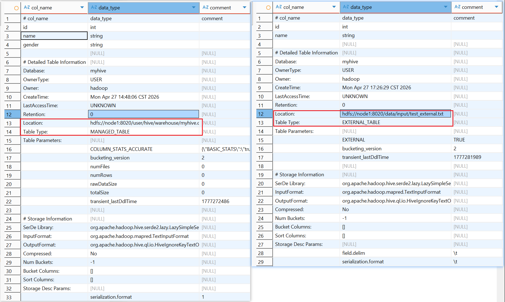
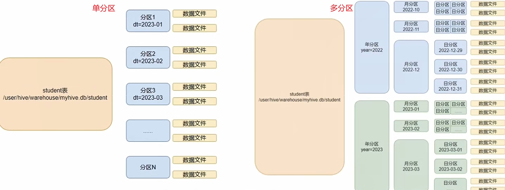

hive leaning in English：https://www.tutorialspoint.com/hive/hive_introduction.htm

在线hive环境：http://demo.gethue.com/hue/home （demo+demo）

## 5.1 数据库操作

启动beeline 

```bash
[hadoop@node1 ~]$ cd $HIVE_HOME
[hadoop@node1 hive]$ bin/beeline
Beeline version 3.1.3 by Apache Hive
```

使用Beeline连接数据库

```bash
!connect jdbc:hive2://node1:10000
```

输入账号hadoop+无密码

```bash
beeline> !connect jdbc:hive2://node1:10000 
Connecting to jdbc:hive2://node1:10000
Enter username for jdbc:hive2://node1:10000: hadoop
Enter password for jdbc:hive2://node1:10000: 
Connected to: Apache Hive (version 3.1.3)
Driver: Hive JDBC (version 3.1.3)
Transaction isolation: TRANSACTION_REPEATABLE_READ
0: jdbc:hive2://node1:10000> 
```

### 5.1.1 创建数据库

```hive
create database [if not exists] 数据库名 [自定义位置];
```

```hive
create database if not exists myhive;
```

效果
```bash
0: jdbc:hive2://node1:10000> show databases;
+----------------+
| database_name  |
+----------------+
| default        |
+----------------+
1 row selected (0.157 seconds)
0: jdbc:hive2://node1:10000> create database if not exists myhive;
No rows affected (0.954 seconds)
0: jdbc:hive2://node1:10000> show databases;
+----------------+
| database_name  |
+----------------+
| default        |
| myhive         |
+----------------+
2 rows selected (0.032 seconds)
```

查看数据库详细信息（在hive中创建的数据库默认的存储位置都为`user/hive/warehouse/`）

```hive
0: jdbc:hive2://node1:10000> use myhive;
No rows affected (0.04 seconds)
0: jdbc:hive2://node1:10000> desc database myhive;
+----------+----------+--------------------------------------------------+-------------+-------------+-------------+
| db_name  | comment  |                     location                     | owner_name  | owner_type  | parameters  |
+----------+----------+--------------------------------------------------+-------------+-------------+-------------+
| myhive   |          | hdfs://node1:8020/user/hive/warehouse/myhive.db  | hadoop      | USER        |             |
+----------+----------+--------------------------------------------------+-------------+-------------+-------------+
1 row selected (0.032 seconds)

```

验证：可以通过hdfs查看新建数据库（文件夹）的位置

```bash
[hadoop@node1 hive]$ hdfs dfs -ls /user/hive/warehouse
Found 2 items
drwxr-xr-x   - hadoop supergroup          0 2026-04-25 11:29 /user/hive/warehouse/myhive.db
drwxrwxrwx   - hadoop supergroup          0 2026-04-16 22:06 /user/hive/warehouse/test_user
```

指定存储位置

```hive
create database myhive_specific_location location '/user/hive/targetLocation';
```

效果

```hive
0: jdbc:hive2://node1:10000> desc database myhive_specific_location;
+---------------------------+----------+---------------------------------------------+-------------+-------------+-------------+
|          db_name          | comment  |                  location                   | owner_name  | owner_type  | parameters  |
+---------------------------+----------+---------------------------------------------+-------------+-------------+-------------+
| myhive_specific_location  |          | hdfs://node1:8020/user/hive/targetLocation  | hadoop      | USER        |             |
+---------------------------+----------+---------------------------------------------+-------------+-------------+-------------+
1 row selected (0.023 seconds)
```

### 5.1.2 删除数据库

删除空数据库（若数据库中包含表则会报错，删除失败）

```hive
drop database myhive2;
```

删除数据库包括下面的表

```hive
drop database myhive2 cascade;
```

效果
```hive
0: jdbc:hive2://node1:10000> drop database myhive2 cascade;
No rows affected (0.239 seconds)
0: jdbc:hive2://node1:10000> show databases;
+---------------------------+
|       database_name       |
+---------------------------+
| default                   |
| myhive                    |
| myhive_specific_location  |
+---------------------------+
3 rows selected (0.018 seconds)
```


## 5.2 数据表的操作

### 5.2.1 数据类型

基本数据类型

| 类别          | 数据类型    | 描述                                    | 示例                        |
| ------------- | ----------- | --------------------------------------- | --------------------------- |
| **数值型**    | `TINYINT`   | 1字节有符号整数，范围：-128 ~ 127       | `1`, `-5`                   |
|               | `SMALLINT`  | 2字节有符号整数，范围：-32,768 ~ 32,767 | `1000`, `-200`              |
|               | `INT`       | 4字节有符号整数，常用整数类型           | `100000`, `-500`            |
|               | `BIGINT`    | 8字节有符号整数                         | `10000000000L`              |
|               | `FLOAT`     | 4字节单精度浮点数                       | `3.14`, `-2.5`              |
|               | `DOUBLE`    | 8字节双精度浮点数                       | `3.1415926`                 |
|               | `DECIMAL`   | 高精度小数，可指定精度                  | `DECIMAL(10,2)`→ `12345.67` |
| **字符型**    | `STRING`    | 字符串，不指定长度                      | `'hello'`, `"大数据"`       |
|               | `VARCHAR`   | 可变长度字符串(1-65535)                 | `VARCHAR(100)`              |
|               | `CHAR`      | 固定长度字符串(1-255)                   | `CHAR(10)`                  |
| **日期/时间** | `DATE`      | 日期，格式：YYYY-MM-DD                  | `'2024-01-15'`              |
|               | `TIMESTAMP` | 时间戳，纳秒精度                        | `'2024-01-15 10:30:45.123'` |
| **布尔型**    | `BOOLEAN`   | 布尔值                                  | `TRUE`, `FALSE`             |
| **二进制**    | `BINARY`    | 字节数组                                | 用于存储图片、文件等        |

复杂数据类型

| 数据类型    | 描述             | 示例                   | 访问方式           |
| ----------- | ---------------- | ---------------------- | ------------------ |
| `ARRAY`     | 同类型元素数组   | `array(1,2,3)`         | `arr[0]`, `arr[1]` |
| `MAP`       | 键值对集合       | `map('a',1,'b',2)`     | `map['a']`→ `1`    |
| `STRUCT`    | 结构体，类似对象 | `struct('Tom', 25)`    | `struct.name`      |
| `UNIONTYPE` | 联合类型(较少用) | 可存储多种类型中的一个 |                    |

### 5.2.2 创建/删除表

指定数据库创建表

```mysql
USE myhive;
CREATE TABLE test_table(
    id INT,
    name STRING,
    gender STRING
);

# 或者是 

CREATE TABLE myhive.test_table(
    id INT,
    name STRING,
    gender STRING
);
```

删除表

```mysql
DROP TABLE myhive.test_table;
```

### 5.2.3 内部表(Managed Table)

Hive中可以创建的表类型

| 表类型     | 存储控制                                    | 数据删除                     | 主要特点                             | 使用场景                                                     |
| ---------- | ------------------------------------------- | ---------------------------- | ------------------------------------ | ------------------------------------------------------------ |
| **内部表** | Hive 管理，默认存储在`/user/hive/warehouse` | 删除表时**同时删除数据**     | 默认表类型，完全由Hive管理           | 中间表、临时表、不需要保留的测试表                           |
| **外部表** | 外部管理,`LOCATION`关键字指定               | 只删除元数据，**不删除数据** | 数据与元数据解耦，数据在HDFS指定位置 | 源数据表、需要多系统共享的数据（Hive、Spark、Impala等）、数仓ODS层原始数据 |
| **分区表** | 按目录分区                                  | 删除表时同内部/外部表        | 按字段值分区存储，提高查询效率       | 时间序列数据、按地区/类别分类的大表                          |
| **分桶表** | 按文件分桶                                  | 删除表时同内部/外部表        | 按字段哈希分桶，便于抽样和JOIN优化   | 大表JOIN优化、数据抽样、数据倾斜优化                         |

**内部表（Managed Table）**：

默认表类型，不加 `EXTERNAL`就是内部表

数据存储在 Hive 默认仓库路径：`/user/hive/warehouse/数据库名/表名`

删除表时：`DROP TABLE student_managed;`会**同时删除元数据和HDFS数据文件** 

```mysql
-- 创建内部表（默认）
CREATE TABLE IF NOT EXISTS student_managed (
    id INT,
    name STRING,
    score DOUBLE
)
ROW FORMAT DELIMITED FIELDS TERMINATED BY ',';
```

元数据可以通过连接hive配置的mysql数据库的`TBLS`表查看

```mysql
select * from hive.TBLS
```

| TBL_ID | CREATE_TIME   | DB_ID | LAST_ACCESS_TIME | OWNER  | OWNER_TYPE | RETENTION | SD_ID | TBL_NAME   | TBL_TYPE      | VIEW_EXPANDED_TEXT | VIEW_ORIGINAL_TEXT | IS_REWRITE_ENABLED |
| ------ | ------------- | ----- | ---------------- | ------ | ---------- | --------- | ----- | ---------- | ------------- | ------------------ | ------------------ | ------------------ |
| 1      | 1,776,345,676 | 1     | 0                | hadoop | USER       | 0         | 1     | test_user  | MANAGED_TABLE |                    |                    | 0                  |
| 6      | 1,777,272,486 | 6     | 0                | hadoop | USER       | 0         | 6     | test_table | MANAGED_TABLE |                    |                    | 0                  |

Hive行格式

自定义列分隔符（默认子段分隔符是`\001`）

```hive
ROW FORMAT DELIMITED
  [FIELDS TERMINATED BY '分隔符']      -- 字段分隔符
  [ESCAPED BY '转义字符']             -- 转义字符
  [COLLECTION ITEMS TERMINATED BY '分隔符']  -- 数组/集合元素分隔符
  [MAP KEYS TERMINATED BY '分隔符']   -- Map键值对分隔符
  [LINES TERMINATED BY '分隔符']      -- 行分隔符（通常不指定，默认\n）
  [NULL DEFINED AS '字符串']          -- NULL值表示
```

### 5.2.4 外部表(External Table)

表必须使用 `EXTERNAL`关键字修饰，并非是hive拥有的表，是临时关联数据去使用

必须指定 `LOCATION`（指向已存在的HDFS路径）

删除表时：`DROP TABLE student_external;`只删除**元数据**，**HDFS数据文件保留**

通常用于ODS层，连接原始数据

```mysql
-- 创建外部表
CREATE EXTERNAL TABLE student_external (
    id INT,
    name STRING,
    score DOUBLE
)
ROW FORMAT DELIMITED FIELDS TERMINATED BY ','
LOCATION '/data/students';  -- 指定数据存储位置
```

- 可以先有表，再把数据移动到表指定的LOCAITON中
- 先有数据，再创建表通过LOCATION指向数据

#### 文件->表

1、linux中创建一个测试文件 `/test_external.txt`

```bash
vim test_external.txt
```

填入（`\t`分隔符）

```text
1	name1
2	name2
3	name3
```

2、将文件传入HDFS指定位置 `/data/input/test_external.txt`

```bash
[hadoop@node1 ~]$ hdfs dfs -put test_external.txt /data/input/test_external.txt
[hadoop@node1 ~]$ hdfs dfs -ls /data/input/
Found 1 items
drwxr-xr-x   - hadoop supergroup          0 2026-04-27 17:28 /data/input/test_external.txt
```

3、根据写入的文件格式，创建外部表（`LOCATION 指向目录`）

```hive
CREATE EXTERNAL TABLE test_external(
	id INT,
    name STRING
)
ROW FORMAT DELIMITED FIELDS TERMINATED BY '\t' 
LOCATION '/data/input/';

select * from test_external;
```

效果：

| id   | name  |
| ---- | ----- |
| 1    | name1 |
| 2    | name2 |
| 3    | name3 |

#### 表->文件

反之一样。先创建表后，当路径LOCATION路径中存在文件则立刻可以在hive中查到

#### 删除 

删除hdfs文件

```bash
[hadoop@node1 ~]$ hdfs dfs -rm -r /data/input/test_external.txt
2026-04-27 18:08:07,243 INFO fs.TrashPolicyDefault: Moved: 'hdfs://node1:8020/data/input/test_external.txt' to trash at: hdfs://node1:8020/user/hadoop/.Trash/Current/data/input/test_external.txt
```

删除hive表

```hive
DROP TABLE test_external;
```

### 5.2.5 内外部表转换

查看表类型

```hive
DESC FORMATTED test_table;
DESC FORMATTED test_external;
```

内外部表的区别：



转换内外部表

内->外

```hive
ALTER TABLE test_table SET TBLPROPERTIES('EXTERNAL'='TRUE');
```

外->内

```hive
ALTER TABLE test_table SET TBLPROPERTIES('EXTERNAL'='FALSE');
```

注意括号内的参数和值是大小写敏感的，必须全部使用大写

## 5.3 Hive数据的数据加载

Hive的LOAD DATA命令默认是移动文件，而不是追加内容

### 5.3.1 导入

#### LOAD DATA

```hive
-- 基本语法
LOAD DATA [LOCAL] INPATH '路径/文件' 
[OVERWRITE] INTO TABLE 表名 
[PARTITION (分区字段='值')];
```

1、从本地加载

准备一个`test_load_local.txt`文件

```bash
vim test_load_local.txt
```

```text
11      name_local1
22      name_local2
33      name_local3
```

创建测试表并将本地文件上传到表中

```hive
-- 创建测试表
CREATE TABLE test_load(
	id INT,
    name STRING
)
ROW FORMAT DELIMITED FIELDS TERMINATED BY '\t' ;

-- 测试导入数据
LOAD DATA LOCAL INPATH '/home/hadoop/test_load_local.txt'
INTO TABLE myhive.test_load;

SELECT * FROM test_load;
```

| id   | name        |
| ---- | ----------- |
| 11   | name_local1 |
| 22   | name_local2 |
| 33   | name_local3 |

2、从HDFS加载

把之前的`test_load_hdfs.txt`文件上传到HDFS中

```bash
[hadoop@node1 ~]$ hdfs dfs -put test_load_local.txt /data/input/test_load_hdfs.txt
[hadoop@node1 ~]$ hdfs dfs -ls /data/input/
Found 2 items
-rw-r--r--   3 hadoop supergroup         25 2026-04-27 18:11 /data/input/test_external.txt
-rw-r--r--   3 hadoop supergroup         45 2026-04-27 20:27 /data/input/test_load_hdfs.txt
```


```hive
-- 测试导入数据
LOAD DATA INPATH '/data/input/test_load_hdfs.txt'
LOAD DATA LOCAL INPATH myhive.test_load;

SELECT * FROM test_load;
```

导入后会直接将hdfs中数据追加到表中，但是里如果使用了 `OVERWRITE` 就会直接覆盖

| id   | name        |
| ---- | ----------- |
| 11   | name_local1 |
| 22   | name_local2 |
| 33   | name_local3 |
| 11   | name_local1 |
| 22   | name_local2 |
| 33   | name_local3 |

**需要注意的是使用hdfs导入数据时，实际上就是将hdfs文件移动到hive表的存储目录，hdfs中的源文件会消失**

**通过命令可以看到两次插入都是将文件移动到Hive表的目录中**

```bash
[hadoop@node1 ~]$ hdfs dfs -ls /user/hive/warehouse/myhive.db/test_load
Found 2 items
-rw-r--r--   3 hadoop supergroup         45 2026-04-27 20:27 /user/hive/warehouse/myhive.db/test_load/test_load_hdfs.txt
-rw-r--r--   3 hadoop supergroup         45 2026-04-27 20:15 /user/hive/warehouse/myhive.db/test_load/test_load_local.txt
```

#### INSERT SELECT

将查询结果追加到当前表

```hive
-- 基本语法
INSERT [OVERWRITE | INTO] TABLE 表名 
[PARTITION (分区字段='值')
	[IF NOT EXISTS]
 	select_statement1 FROM from_statement
];
```

创建一个新表

```hive
CREATE TABLE test_load2(
	id INT,
    name STRING
);

INSERT INTO test_load2 
SELECT * FROM test_load ORDER BY id ASC LIMIT 3;

select * from test_load2;
```

效果如下

| id   | name        |
| ---- | ----------- |
| 11   | name_local1 |
| 11   | name_local1 |
| 22   | name_local2 |

### 5.3.2 导出

#### INSERT OVERWRITE

将select的结果写入到导出的路径中（带local就是导入到Linux，不带local就是导入HDFS）

```hive
-- 基本语法
INSERT OVERWRITE [LOCAL] DIRECTORY '路径' 
ROW FORMAT DELIMITED FIELDS TERMINATED BY '\t'
select_statement1 FROM from_statement;
```

1、测试导出到本地

将`test_load2`结果导出到Linux本地

```hive
INSERT OVERWRITE LOCAL DIRECTORY '/home/hadoop/export_test_load2'
ROW FORMAT DELIMITED FIELDS TERMINATED BY '\t'
SELECT * FROM test_load2;
```

效果

```bash
hadoop@node1 ~]$ cd export_test_load2
[hadoop@node1 export_test_load2]$ ll
total 4
-rw-r--r-- 1 hadoop hadoop 45 Apr 27 21:09 000000_0
[hadoop@node1 export_test_load2]$ cat 000000_0
11	name_local1
11	name_local1
22	name_local2
```

2、测试导出到hdfs

先确定一个导出位置（创建了一个output文件夹）

```bash
[hadoop@node1 export_test_load2]$ hdfs dfs -mkdir /data/output/
[hadoop@node1 export_test_load2]$ hdfs dfs -ls /data/
Found 3 items
drwxr-xr-x   - hadoop supergroup          0 2026-04-27 20:27 /data/input
drwxrwx---   - hadoop supergroup          0 2026-04-02 21:17 /data/mr-history
drwxr-xr-x   - hadoop supergroup          0 2026-04-27 21:12 /data/output
```

导出

```hive
INSERT OVERWRITE DIRECTORY '/data/output/export_test_load2'
ROW FORMAT DELIMITED FIELDS TERMINATED BY '\t'
SELECT * FROM test_load2;
```

效果：

```bash
[hadoop@node1 export_test_load2]$ hdfs dfs -ls /data/output/export_test_load2
Found 1 items
-rw-r--r--   3 hadoop supergroup         45 2026-04-27 21:15 /data/output/export_test_load2/000000_0
[hadoop@node1 export_test_load2]$ hdfs dfs -cat /data/output/export_test_load2/000000_0
11	name_local1
11	name_local1
22	name_local2

```

#### hive shell

1、通过`bin/hive -e`执行sql语句，并将结果作为输入传递到目标文件中

```bash
mkdir -p /home/hadoop/export_tables && bin/hive -e "select * from myhive.test_load2;" > /home/hadoop/export_tables/export_test_load2.txt
```

效果

```bash
[hadoop@node1 hive]$ mkdir -p /home/hadoop/export_tables && bin/hive -e "select * from myhive.test_load2;" > /home/hadoop/export_tables/export_test_load2.txt
which: no hbase in (/usr/local/bin:/bin:/usr/bin:/usr/local/sbin:/usr/sbin:/export/server/jdk/bin:/export/server/hadoop/bin:/export/server/hadoop/sbin:/export/server/hive/bin:/home/hadoop/.local/bin:/home/hadoop/bin)
Hive Session ID = 150406e4-68ad-4ea2-a366-7ac4c729912f

Logging initialized using configuration in file:/export/server/apache-hive-3.1.3-bin/conf/hive-log4j2.properties Async: true
Hive Session ID = 0e94c55f-cc49-447a-ae33-2445fafdc327
OK
Time taken: 1.106 seconds, Fetched: 3 row(s)
[hadoop@node1 hive]$ cat /home/hadoop/export_tables/export_test_load2.txt
0    [main] WARN  org.apache.hadoop.hive.conf.HiveConf  - HiveConf of name hive.root.logger does not exist
459  [main] WARN  org.apache.hadoop.hive.conf.HiveConf  - HiveConf of name hive.root.logger does not exist
926  [150406e4-68ad-4ea2-a366-7ac4c729912f main] WARN  org.apache.hadoop.hive.conf.HiveConf  - HiveConf of name hive.root.logger does not exist
1602 [150406e4-68ad-4ea2-a366-7ac4c729912f main] WARN  org.apache.hadoop.hive.ql.session.SessionState  - METASTORE_FILTER_HOOK will be ignored, since hive.security.authorization.manager is set to instance of HiveAuthorizerFactory.
11	name_local1
11	name_local1
22	name_local2
```

2、通过`bin/hive -f`执行存储sql语句的文件，并将结果作为输入传递到目标文件中

创建一个.sql文件存储 `select * from myhive.test_load2;`

```bash
vim export_test_load2.sql
```

输入

```mysql
select * from myhive.test_load2
```

执行

```bash
bin/hive -f export_test_load2.sql > /home/hadoop/export_tables/export_test_load2_next.txt
```

效果

```bash
[hadoop@node1 hive]$ cat /home/hadoop/export_tables/export_test_load2_next.txt
0    [main] WARN  org.apache.hadoop.hive.conf.HiveConf  - HiveConf of name hive.root.logger does not exist
337  [main] WARN  org.apache.hadoop.hive.conf.HiveConf  - HiveConf of name hive.root.logger does not exist
767  [8fe3b6aa-3795-4b2d-8462-034660cf0f3f main] WARN  org.apache.hadoop.hive.conf.HiveConf  - HiveConf of name hive.root.logger does not exist
1363 [8fe3b6aa-3795-4b2d-8462-034660cf0f3f main] WARN  org.apache.hadoop.hive.ql.session.SessionState  - METASTORE_FILTER_HOOK will be ignored, since hive.security.authorization.manager is set to instance of HiveAuthorizerFactory.
11	name_local1
11	name_local1
22	name_local2
```

## 5.4 Hive 分区表

把大数据按照每天/小时切分成一个个小文件，通过文件夹对彼此进行隔离，这样查询某分区时就不需要对全表进行搜索



```hive
CREATE TABLE 表名(字段...) 
PARTITIONED BY (分区列 列类型,...)
ROW FORMAT DELIMITED FIELDS TERMINATED BY '';
```

