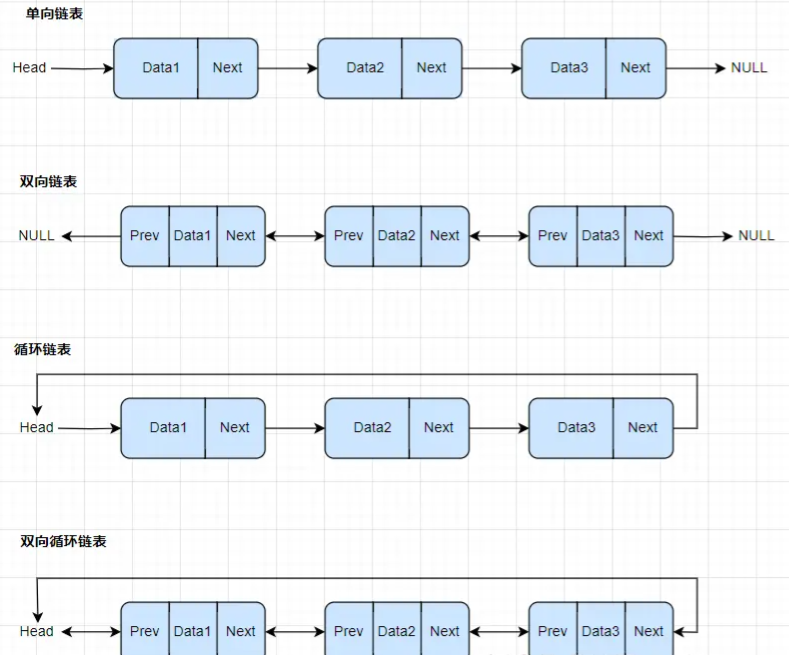

## 一、链表-斜树（Skewed Tree）



#### 应用

1、实现栈和队列

2、哈希表的链地址法解决冲突

3、LRU缓存淘汰算法【不会】

4、多项式表示（每个节点存储系数和指数）【不会】

5、操作系统中的进程调度（就绪队列）

6、图的邻接表表示法 【模糊】

## 二、 二叉树（Binary Tree）

### （一） 完全二叉树

除了最后一层，其他层都是满的；最后一层的节点从左到右连续排列，中间不能断

```
        A
      /   \
     B     C
    / \   /
   D   E F
```

**1、** **实现**

数组存储，无需指针，通过下标点各位父子节点：

| 节点   | 编号   | 条件     |
| ---- | ---- | ------ |
| 根节点  | 1    |        |
| 当前节点 | i    |        |
| 左孩子  | 2i   | 2i<n   |
| 右孩子  | 2i+1 | 2i+1<n |
| 父节点  | i/2  | i>1    |

**2、** **应用**

1）堆Heap数据结构：优先队列、Dijkstra算法等。【模糊】

2）数组表示的二叉树：节省存储空间，快速访问子节点。

3）哈夫曼编码树：构建最优前缀码时使用。【模糊】

### （二） 满二叉树 （ Full Binary Tree ）

除叶子节点外，每个节点都有两个子节点，且所有叶子节点都在同一层。满二叉树 ⊂ 完全二叉树 ⊂ 二叉树

```
        A
      /   \
     B     C
    / \   / \
   D   E F   G
```

**1、** **实现**

数组存储，无需指针，通过下标点各位父子节点（同完全二叉树）

高度为h的满二叉树有2^h - 1个节点

叶子节点数量：总是有2^(h-1)个叶子节点

非叶子节点数量：有2^(h-1) - 1个非叶子节点

| 类型    | 节点数                                    |
| ----- | -------------------------------------- |
| 总节点   | 2^h - 1                                |
| 叶子节点  | 2^(h-1)                                |
| 非叶子节点 | 2^(h-1) - 1 =（2^(h-1) * 2 -1 -2^(h-1)） |
| 高度与节点 | h = log₂(n+1) <=> n=2^h - 1            |

**2、** **应用**

1）表达式树：用于表示数学表达式

2）文件系统索引：某些文件系统使用类似满二叉树的结构进行索引

### （三） 二叉搜索树（BST：Binary Search Tree）

左子树所有节点值 < 根节点值 < 右子树所有节点值。左右子树也必须是二叉搜索树（递归定义）

**中序遍历 = 递增有序（最本质的区别）**

```
        8
      /   \
     3     10
    / \      \
   1   6      14
      / \     /
     4   7   13
```

#### 基本操作：

**查/增**

查找效率取决于“树高”（与二分查找类似）：
理想情况（接近平衡）：O(log n)
极端情况（退化成链表）： O(n)

```
1
 \
  2
   \
    3
     \
      4
```

**删**

分三种情况（复杂度同查）：

✅ 情况 1：删除叶子节点

直接删 ✅

✅ 情况 2：删除只有一个子节点

用子节点替换它 ✅

✅ 情况 3：删除有两个子节点（重点）

做法（任选其一）：

- 用 **右子树最小值**（中序后继）替换
- 或 **左子树最大值**（中序前驱）替换

#### 常见平衡 BST

| 名称       | 特点         |
| -------- | ---------- |
| AVL 树    | 严格平衡，查询快   |
| 红黑树      | 近似平衡，插删快   |
| Treap    | 随机化        |
| B / B+ 树 | 数据库 / 文件系统 |

### （四） 平衡二叉树（AVL得名于其发明者Adelson-Velsky和Landis）、

AVL 树是一种“严格自平衡”的二叉搜索树：对于任意节点：左子树和右子树的高度差 ≤ 1（它满足 BST 的所有性质）。同理得出叶子节点都在同一层。

通过“旋转”操作，在每次插入 / 删除后主动纠正树的形态，保证树高始终是 O(log n)

#### 核心约束

空节点高度：0；叶子节点高度：1

平衡因子（Balance Factor，BF）$BF(node)=height(left)−height(right)$ BF ∈ { -1, 0, +1 }

|BF| >= 2 时树发生旋转：

旋转通常围绕一个“失衡节点” `z`（也叫 pivot）进行，它的较高子树根是 `y`，更深的那个是 `x`：

- `z`：第一个出现 |BF|=2 的节点（从插入点往上回溯）
- `y`：`z` 的较高孩子
- `x`：`y` 的较高孩子

#### 1️⃣ LL 型（左左失衡）

**场景**：  
在某节点的 **左子树的左子树** 插入 5

```
第1层:              30(z)
                   /    
第2层:          20(y)    
               /   \
第3层:      10(x)   25
           /    \
第4层:    5(new)  15
```

这里 z=30 的左子树高度比右子树高 2（右子树为空/很矮），需要右旋（以 z=30 为轴）

<mark>理解</mark>：z此时不符合，则树的高度要降低。已知z时最大的，如果想降低则只能变为右节点，如何变？变为y的右节点就可以了（符合搜索树BST的性质），但是y的右节点已经被占用了，总不能直接覆盖。已知y右>y z>y，根据大小关系把y右插入z下面就可以了。可以得出下面的步骤

- `y = z.left`
- `z.left = y.right`
- `y.right = z` （其余子树保持挂接）

```
第1层:              30(z)                 30(z)                 20(y)                     20(y)
                   /                     /                     /   \                     /    \
第2层:          20(y)                   25          +      10(x)   25       =          10(x)   30(z) 
               /   \                                        /   \                     /   \    /
第3层:      10(x)   25                                     5     15                   5     15 25 
           /    \
第4层:    5(new)  15
```

---

#### 2️⃣ RR 型（右右失衡）

**场景**：  
在某节点的 **右子树的右子树** 插入

在这棵树里，回溯顺序：60 → 50 → 40 → 30 → 20所以 第一个失衡节点是 40（BF=-2）z的右子树高度比左子树高 2，需要左旋（以 z=40 为轴）

<mark>理解：</mark>z此时不符合，则树的高度要降低。已知z时最小的，如果想降低则只能变为左节点，如何变？变为y的左节点就可以了（符合搜索树BST的性质）。

```
                 20(BF=-2)   
               /           \
        10(BF=0)           30(BF=-2)
        /     \              /      \
  5(BF=0)  15(BF=0)     25(BF=0)   40(z,BF=-2) ← 这是失衡节点 z（第一个 |BF|=2）
                                           \
                                          50(y,BF=-1)
                                            \
                                           60(x,BF=0)
```

已知y z<y<x，

- y = z.right

- T2 = y.left（此例 y.left 为空）

- y.left = z

- z.right = T2

```
    50(y,BF=-1)                                     20(BF=-2)  
     /       \                                    /           \
40(z,BF=-2)  60(x,BF=0)                    10(BF=0)           30(BF=-2)
                                            /     \            /      \
                                        5(BF=0)  15(BF=0)   25(BF=0)   50(y,BF=0)
                                                                       /   \
                                                                  40(z,BF=0) 60(x,BF=0)
```

---

#### 3️⃣ LR 型（左右失衡）⚠️（两次旋转）

**场景**：  
在 **左子树的右子树** 插入15，z的左高3右高1.BF=2

```
第1层:                 30(z,BF=+2)   ← 失衡节点 z（回溯遇到的第一个）
                      /        \
第2层:          10(y,BF=-1)     40(BF=0)
                /    \
第3层:      5(BF=0)  20(x.BF=+1)
                     /
第4层:           15(new,BF=0)
```

<mark>理解：</mark>z此时不符合，则树的高度要降低。即降低左树的高度+增加右树高度。为什么二者缺一不可？

答：目前左子树除了叶子节点都是铺满的，也就是说在保持根不变的情况下，左边无论怎么旋转都有3层，右边1层，BF=2。所以需要将旧的根节点旋转到右子树，才可能平衡。

那么设想如果需要将根旋转到右侧，目前40>30是符合BST的，但左子树就要进行旋转了，因为左子树第二层是满的，需要在旧的左子树找到一个新的根，并空出来右侧的位置，不然旧根z也没地方放，所以问题就转为怎么寻找新根。

已知左<新根<30，如果想空出新根的右侧，那么新根必须是最大的，否则右侧空不出来。新插入的位置是左子树的右子树位置，所以根据目前的结构，最大值在左子树的最后一个右边节点，即20。

即对以10为根的子树进行左旋

```
旋转前（y 子树）：
      10
     /  \
    5    20
        /
       15

左旋 y=10 后（得到中间态）：
第1层:                 30(z)
                      /    \
第2层:              20(x)   40
                   /   \
第3层:           10(y)  (空)
                / \
第4层:         5  15
```

然后对30为轴进行右旋

```
第1层:                 20(BF=0)
                      /       \
第2层:          10(BF=0)      30(BF=0)
                /   \            \
第3层:      5(BF=0) 15(BF=0)    40(BF=0)
```

---

#### 4️⃣ RL 型（右左失衡）⚠️（两次旋转）

**场景**：  
在 **右子树的左子树** 插入,【插入：25】(路径：10 → 30 → 20 → right)

```
第1层:                 10(z,BF=-2)   ← 失衡节点 z（回溯遇到的第一个）
                      /        \
第2层:          5(BF=0)        30(y,BF=+1)
                               /    \
第3层:                     20(x,BF=-1) 40(BF=0)
                                  \
第4层:                           25(new.BF=0)
```

<mark>理解：</mark>插入新值后不平衡，同理，需要同时提高左数高度，降低右树高度。即在右子树重新找到一个新的根，将旧根z旋转到左侧，z<新根<右侧，如果想把新根左侧空出来，则新根是右子树中的最小值。已知新插入位置为右子树的左节点，那么最小值为右子树的最后一个左节点，即x。

即先将y为轴右旋，原来x<y，25>x，但不知道y和25的大小，直接将y替换为x的右子树，25追加到y下面

```
旋转前（y 子树）：
       30(y)
      /   \
    20(x)  40
       \
       25

右旋 y=30 后（得到中间态）：
第1层:                 10(z,BF=-2)
                      /        \
第2层:               5         20(x)
                                \
第3层:                            30(y)
                               /    \
第4层:                         25    40
```

新根左侧空出来后，以x为轴左旋，将旧根追加到下面

```
第1层:                 20(BF=-1)
                      /        \
第2层:          10(BF=+1)      30(BF=0)
                /             /    \
第3层:      5(BF=0)       25(BF=0) 40(BF=0)
```

---

#### ✅ 旋转总结口诀（面试救命）

> **左左 → 右旋**  
> **右右 → 左旋**  
> **左右 → 左旋 + 右旋**  
> **右左 → 右旋 + 左旋**

#### AVL 树的时间复杂度

同样高度下：AVL 的节点数介于 “最少节点（最瘦AVL）” 与 “最多节点（满树）” 之间

定义：

- n：AVL 树的节点数

- h：树高（最长路径的边数）

- N(h)：**高度为 h 的 AVL 树至少需要的节点数**

根节点本身占 1 个节点，一棵子树高度为 h−1，另一棵子树高度为 h−2（为了在满足平衡条件下总节点最少）

$N(h)=N(h−1)+N(h−2)+1$ 其中 N(0)=1（仅一个节点时高度为 0），N(1)=2。这完美符合了斐波那契的定义

> 斐波那契数列关系
> 
> 设 F(k)为斐波那契数列（F(0)=0,F(1)=1），则有：
> 
> $N(h)=F(h+3)−1  h≈1.44log_2​n$

| 操作  | 时间复杂度              |
| --- | ------------------ |
| 查找  | `O(log n)`         |
| 插入  | `O(log n)`         |
| 删除  | `O(log n)`（可能多次旋转） |

#### ✅ 优点/缺点

优点：

高度极低，查找速度非常快
比红黑树更“平衡”
适合 读多写少 场景

缺点：

插入和删除操作可能需要多次旋转，开销较大；

相比红黑树，维护平衡的成本更高；

需要存储平衡因子或高度信息，额外空间开销

### （五） 红黑树（Red-Black Tree）

**红黑树（Red‑Black Tree）** 是工程世界真正使用的那一版<mark>“平衡树”</mark> （放松平衡条件的自平衡二叉搜索树）

- ✅ 仍然是 BST（左小右大）

- ✅ 仍然保证 树高是 O(log n)

- ❌ 但 不追求像 AVL 那样“高度差 ≤ 1

#### 红黑树的 5 条性质（核心规则）

红黑树的“平衡”不是靠高度差，而是靠**颜色约束**

- 性质 1：节点要么是红色，要么是黑色

- 性质 2：根节点必须是黑色

- 性质 3：所有叶子节点（NIL / null）都是黑色，这里的叶子是 空节点（null）实际实现中一般不画出来

- 性质 4：红节点不能相邻（不能有红色父子，它限制了“连续红节点”的长度）

- 性质 5（最重要）：从任意节点到其所有后代叶子节点的路径，黑色节点数量（黑高Black Height）相同

<mark>推论1：</mark>因为没有连续红节点，所以在任何一条路径上：**红色节点数量 ≤ 黑色节点数量**

<mark>推论2：</mark>黑高为bh，全黑时节点数最少，为完全二叉树，高度为bh-1，所以 $n≥2^bh−1$所以 红黑树的高度 $bh≤2log_2​(n+1)$

#### 怎么维持平衡？

因为每条路径黑高相同，假设黑高 = bh ，路径长度 = 总节点数（包括黑色和红色）。

从根到叶子的**最短路径**为全是黑节点，即**bh**

从根到叶子的**最长路径**为黑红间隔节点，因为红色不能连续，所以相邻黑色之间最多 1 个红色。黑色序列长度为 bh，则黑色之间有 bh−1个间隔，所以红色节点数最多 bh−1，那么最长路径节点总数 = 黑节点数+红节点数 = bh+(bh−1)=**2bh−1 （最长路径 ≤ 最短路径的 2 倍）**

此时边数为2bh-2，也就是说h≤2bh−2，结合推论2：$h≤2bh<=2log_2​(n+1)$

这种极端情况下根的最长和最短路径之间的差为 2bh−1 - bh= bh - 1。远远大于AVL平衡因子的1。但是反过来也说明了通过此条件限制了树的平衡程度。

#### 复杂度怎么保证 O(log n)？

根据推论2最短路径，得出$bh≤2log_2​(n+1)$

根据最长路径，得出最长路径节点总数 = 2bh−1，此时边数为2bh-2，也就是说h≤2bh−2，结合推论2：$h≤2log_2​(n+1)$

查找：最坏情况为从根节点查到叶子节点才找到，此时遍历了树高个节点，即时间复杂度为log(n)

- ✅ **查找**​ = O(log n) —— 因为树高 O(log n)。

- ✅ **插入**​ = O(log n) —— 查找 O(log n) + 修复 O(log n)。

- ✅ **删除**​ = O(log n) —— 查找 O(log n) + 修复 O(log n)。

红黑树在**动态数据集**（频繁插入删除）中综合性能优秀，因此被广泛应用于各类标准库（C++ STL 的 `map`/`set`，Java 的 `TreeMap`/`TreeSet`）和系统内核中。

 ####  应用场景（重要）

| **特性** | **红黑树**                | **AVL树**        |
| ------ | ---------------------- | --------------- |
| 平衡强度   | 近似平衡、黑高一致（最长路径≤2倍最短路径） | 严格平衡（左右子树高度差≤1） |
| 插入/删除  | 需要较少旋转O(log n)         | 可能频繁旋转O(log n)  |
| 查找效率   | 略低于AVL（因平衡较松）          | 更高（严格平衡）        |
| 适用场景   | 频繁插入删除的场景（如map、set）    | 频繁查找（如数据库索引）    |

#### 插入

红黑树的插入过程和二叉查找树插入过程基本类似，不同的地方在于，红黑树插入新节点后，需要进行调整，以满足红黑树的性质。

在插入新节点时，将节点设置为红色可以保证黑高不变，但由于父子不能连续为红色，所以仍需要调整

## 三、 多叉树（n-ary Tree）

每个节点可以有任意数量（n ≥ 0）的子节点

### （一） **三叉树（Ternary Tree）**

三叉树是一种每个节点最多有三个子节点的树结构，子节点通常称为左子节点（Left）、中间子节点（Middle）和右子节点（Right）

### B树

### B+树

MySQL InnoDB / SQL Server / Oracle：几乎都是 B+ 树

## 问题

[(73 封私信 / 81 条消息) 通俗易懂的图文 红黑树,B树,B+树 本质区别及应用场景 - 知乎](https://zhuanlan.zhihu.com/p/335036067)

文件系统的索引喜欢用B树而不是用红黑树或有序数组？

在内存中红黑树比B树效率高，但涉及到磁盘操作，B树更优

hash比B+树更快为什么，ysql还有用B+树存储索引？


