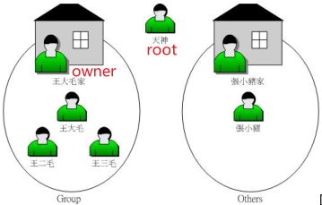

## 5.1、使用者和群组

Linux一般将文件可存取的身份分为三个类别，分别是 owner/group/others，且三种身份各有 read/write/execute 等权限

Linux是个多用户多任务的系统，因此可能常常会有多人同时使用这部主机来进行工作的情况发生

默认的情况下，所有的系统上的帐号与一般身份使用者，还有那个root的相关信息， 都是记录在/etc/passwd这个文件内。个人的密码则是记录在/etc/shadow这个文件下。Linux所有的群组名称都纪录在/etc/group内



## 5.2、文件权限概念

root基本上是不受系统的权限所限制的， 所以无论文件权限为何，默认root都可以存取

| 命令             | 切换用户                              | 是否加载目标用户环境             | 是否需要 root 密码 | 是否需要当前用户在 sudoers | 常用场景                              |
| -------------- | --------------------------------- | ---------------------- | ------------ | ----------------- | --------------------------------- |
| `su`/`su root` | su(默认为root) <br/>su root(指明为root) | **否**（保留当前环境）          | **是**        | 否                 | 临时切换到 root，保留当前环境                 |
| `su -`         | root                              | **是**（完整登录环境）          | **是**        | 否                 | 完全模拟 root 登录，回到root的home目录，exit退出 |
| `sudo`         | 不切换用户（执行命令时临时提权）                  | **是**（执行命令时使用 root 权限） | 否（输入当前用户密码）  | **是**             | 单条命令提权，安全性更高                      |

```bash
root@DESKTOP-I0DQE4R:~# ls -al
total 24
drwx------  4 root root 4096 Sep  4 17:50 .
drwxr-xr-x 22 root root 4096 Nov 24 13:34 ..
-rw-r--r--  1 root root 3106 Apr 22  2024 .bashrc
drwx------  2 root root 4096 Sep  4 17:50 .cache
-rw-r--r--  1 root root    0 Nov 24 13:34 .motd_shown
-rw-r--r--  1 root root  161 Apr 22  2024 .profile
drwx------  2 root root 4096 Jan  7  2025 .ssh
```

文件类型权限，连接数，文件拥有者，文件所属群组，文件大小，文件最后修改时间，文件名

### 5.2.1、文件类型权限

<mark>drwx------</mark> 2 root root 4096 Sep 4 17:50 .cache

- 第一栏：drwxr-xr-x 文件的类型与权限（permission），占10个字符


|     | 1                                                                                     | 2-4                                                                 | 5-7                                                                 | 8-10                                                                |
| --- |:------------------------------------------------------------------------------------- | ------------------------------------------------------------------- | ------------------------------------------------------------------- | ------------------------------------------------------------------- |
| 含义  | 文件类型                                                                                  | 文件的owner权限                                                          | 文件的group权限                                                          | 文件的other权限                                                          |
| 取值  | [ d ]目录<br/>[ - ]文件<br/>[ l ]链接文件（link file）<br/>[ b ]可随机存取设备<br/>[ c ]一次性读取设备（键盘、鼠标） | [ r ]可读（read）<br/>[ w ]可写（write）<br/>[ x ]可执行（execute）<br/>[ - ]无权限 | [ r ]可读（read）<br/>[ w ]可写（write）<br/>[ x ]可执行（execute）<br/>[ - ]无权限 | [ r ]可读（read）<br/>[ w ]可写（write）<br/>[ x ]可执行（execute）<br/>[ - ]无权限 |

drwx------ <mark>2</mark> root root 4096 Sep 4 17:50 .cache

- 第二栏：有多少文件名链接到此节点（i-node）
  
  文件会将他的权限与属性记录到文件系统的i-node中，每个文件名都会对应一个i-node，第二栏记录的是有多少不同的文件名链接到相同的i-node号码

drwx------ 2 <mark>root</mark> root 4096 Sep 4 17:50 .cache

- 第三栏：表示这个文件（或目录）的“拥有者帐号”

drwx------ 2 root <mark>root</mark> 4096 Sep 4 17:50 .cache

- 第四栏：文件的所属群组

drwx------ 2 root root <mark>4096</mark> Sep 4 17:50 .cache

- 第五栏：文件的容量大小，默认单位为Bytes

drwx------ 2 root root 4096 <mark>Sep 4 17:50</mark> .cache

- 第六栏：文件的创建日期或者是最近的修改日期，修改的时间距离现在太久了，那么时间部分会仅显示年份

drwx------ 2 root root 4096 Sep 4 17:50 <mark>.cache</mark>

- 第七栏：文件的文件名，如果文件名之前多一个“ . ”，则代表这个文件为“隐藏文件”

**例题**

```bash
drwxr-xr-- 1 test1 testgroup 5238 Jun 19 10:25 groups/
```

• 文件拥有者test1[rwx]可以在本目录中进行任何工作；
• 而testgroup这个群组[r-x]的帐号，例如test2, test3亦可以进入本目录进行工作，但是不能在本目录下进行写入的动作；
• 至于other的权限中[r--]虽然有r ，但是由于没有x的权限，因此others的使用者，并不能进入此目录！

inux文件的基本权限就有九个（三个三个一组），分别是owner/group/others三种身份各有自己的read/write/execute权限。

- 可以使用数字来代表各个权限：`[-rwxrwx---]`对应的分数为770，具体如下
  owner = rwx = 4+2+1 = 7  | group = rwx = 4+2+1 = 7 | others= --- =0+0+0 = 0

- 借由u, g, o来代表三种身份的权限, a 则代表 all ：具体如下，
  
  设置文件的权限成为“-rwxr-xr-x”：`chmod u=rwx,go=rx .bashrc` 
  
  不知道原先的文件属性，而我只想要增加.bashrc这个文件的每个人均可写入的权限：` chmod a+w .bashrc`

### 5.2.2、改变文件属性和权限

| 关键字   | 含义                             | 语法                                                                                                      | 示例                                                                                                                                | 权限                                        |
| ----- | ------------------------------ | ------------------------------------------------------------------------------------------------------- | --------------------------------------------------------------------------------------------------------------------------------- | ----------------------------------------- |
| chgrp | 改变文件所属群组 change group          | chgrp [-R] dir/filename                                                                                 | 文件组设置为users<br/>`chgrp users initial-setup-ks.cfg`<br/>file2.log的所属组设置为与 file1.log的所属组完全相同`chgrp --reference=file1.log file2.log` | root 用户​或文件的所有者（并且该所有者必须是目标组的成员）才有权更改文件的组 |
| chown | 改变文件拥有者 change owner           | chown [-R] new_owner dir/filename<br/>chown [-R] :new_group dir/filename<br/>chown [-R] 帐号名称:群组名称 文件或目录 | 拥有者改为bin<br/>`chown bin initial-setup-ks.cfg`<br/>更改owner/group/owner+group                                                       | root 用户才有权限更改文件的所有者<br/>普通用户只能将文件的组改为自己组  |
| chmod | 改变文件的权限, SUID, SGID, SBIT等等的特性 | chmod [-R] xyz 文件或目录<br/>chmod \| u g o a \| +（加入） -（除去） =（设置） \| r w x \| 文件或目录                        | 设置文件的权限成为“-rwxr-xr-x”<br/>`chmod u=rwx,go=rx .bashrc`<br/>增加每个人均可写入的权限<br/>`chmod a+w .bashrc`                                    | +/-时没有指定到的项目，则该权限“不会被变动”                  |

**chgrp和chown的使用场景**：由于复制行为（cp）会复制执行者的属性与权限。.bashrc_test还是属于root所拥有， 如此一来，即使你将文件拿给bin这个使用者了，那他仍然无法修改的必须要修改这个文件的拥有者与群组

```bash
[root@study ~]# cp .bashrc .bashrc_test
[root@study ~]# ls -al .bashrc*
-rw-r--r--. 1 root root 176 Dec 29 2013 .bashrc
-rw-r--r--. 1 root root 176 Jun 3 00:04 .bashrc_test <==新文件的
属性没变
```

**chmod的使用场景**：如果要将该文件变成可执行文件，并且不要让其他人修改此一文件的话， 那么就需要-rwxr-xr-x这样的权限，此时就得要下达：`chmod 755 test.sh `

### 5.2.3、目录与文件权限意义

|              | r                    | w                                 | x                               |
| ------------ | -------------------- | --------------------------------- | ------------------------------- |
| 文件<br/>(内容)  | 读取此一文件的实际内容          | 写入/编辑/新增/修改（无删除）                  | Linux的文件是否能被执行由“x”这个权限来决定       |
| 目录<br/>(文件名) | 读取目录结构清单的权限即可以使用`ls` | 异动该目录结构清单的权限<br/>创建/删除/改名/移动文件与目录 | 进入该目录的权限即无法cd进去<br/>具有x权限才能读取文件 |

如果你有目录的r和w权限，无x权限，则仍无法切换到该目录；只有r可以让使用者读取目录的文件名列表，不过详细的信息无x却还是读不到的

如果只有x权限则只能进入该目录，但是无法读取里面的内容（相反，如果想读取目录文件列表详细信息/内容则一定有x权限）

如果A具有对目录的rwx权限，但文件权限为`-rwx------`那么他对于该文件为others，无法修改/读取文件，但是具有删除文件的权力

```bash
# -p(parents)参数用于多级嵌套目录。默认testing的目录权限为 drwxr-xr-x
mkdir -p /tmp/testing/
# testfile的权限为 -rw-r--r--
touch /tmp/testing/testfile
# 将testing目录的权限改为 drwxr--r-- 744
chmod 755 /tmp/testing
# 将testfile文件的权限改为 drw------- 600
chmod 600 /tmp/testing/testfile
```

创建一个新用户(--mode=MODE,在创建目录时直接设置权限模式)

```bash
useradd -m user2
# 切换到user2用户
su - user2
```

查看对新目录和文件的权限

```bash
$ ls -ald testing testing/testfile
ls: cannot access 'testing/testfile': Permission denied
drwxr--r-- 2 root root 4096 Nov 26 09:54 testing
# 进入tmp目录发现无法查看，虽然有告知权限不足，但因为具有 r 的权限可以查询文件名。由于权限不足（没有x），所以会有一堆问号。
$ cd /tmp
$ ls -l testing
ls: cannot access 'testing/testfile': Permission denied
total 0
-????????? ? ? ? ?            ? testfile
# 因为没有x权限，所以无法进入
$ cd testing
-sh: 32: cd: can't cd to testing
```

这也解释了为什么新建的目录默认权限为`drwxr-xr-x`对于froup成员、others来说必须有目录的x权限才能读取目录的文件

### 5.2.4、Linux文件种类与扩展名

| 文件类型 | 缩写               | 细分                                                                                                              |
| ---- | ---------------- | --------------------------------------------------------------------------------------------------------------- |
| -    | regular file普通文件 | 纯文本文件（ASCII）人可直接看的文件，cat命令读取其内容<br/>二进制文件（binary）可执行文件，cat就是一个二进制文件<br/>数据格式文件（data）特定格式的文件，登录的数据就被记录在data类型文件中 |
| b/c  | device设备与设备文件    | dev这个目录之下<br/>区块（block）设备文件，如硬盘与软盘<br/>字符（character）设备文件，如键盘、鼠标                                                 |
| s    | sockets数据接口文件    | /run或/tmp这些个目录下，网络上的数据承接                                                                                        |
| p    | FIFO, pipe数据输送档  | 解决多个程序同时存取一个文件所造成的错误问题                                                                                          |
| d    | directory目录      |                                                                                                                 |
| l    | link链接文件         |                                                                                                                 |

x代表这个文件具有可执行的能力，但是能不能执行成功，当然就得要看该文件的内容

| 拓展名                           | 含义                      |
| ----------------------------- | ----------------------- |
| *.sh                          | 脚本或批处理文件，批处理文件使用shell写成 |
| Z, .tar, .tar.gz, .zip, *.tgz | 经过打包的压缩文件               |
| .html, .php                   | 网页相关文件                  |

早期的 Unix 系统文件名最多允许 14 个字符，新的Linux系统中文件名长度限制255Bytes，ASCII 英文占用一个 Bytes ，则大约可达 255 个字符长度；以每个中文字占用2Bytes ， 大约在 128 个字

## 5.3、Linux目录配置

### 5.3.1、Linux目录配置的依据--FHS

Filesystem Hierarchy Standard，FHS的重点在于规范每个特定的目录下应该要放置什么数据

三层主目录：

• / （root, 根目录）：与开机系统有关；
• /usr （unix software resource）：与软件安装/执行有关；
• /var （variable）：与系统运行过程有关。

FHS目录定义成为四种交互作用的形态：可分享的shareable、不可分享的unshareable、不变的static、可变动的variable

根目录（/）所在分区应该越小越好， 且应用程序所安装的软件最好不要与根目录放在同一个分区内，保持根目录越小越好

| 要求必须要存在的目录                      | 应放置文件内容                                                                     |
| ------------------------------- | --------------------------------------------------------------------------- |
| /bin                            | /bin下面的指令可以被root与一般帐号所使用，主要有：cat, chmod, chown, date, mv, mkdir, cp, bash等等 |
| /boot                           | 放置开机会使用到的文件，包括Linux核心文件以及开机菜单与开机所需配置文件等等                                    |
| /dev                            | 在Linux系统上，任何设备与周边设备都是以文件的型态存在于这个目录当中的                                       |
| /etc                            | 统主要的配置文件几乎都放置在这个目录内，一般用户查root改                                              |
| /lib                            | 在开机时会用到的函数库以及在/bin或/sbin下面的指令会调用的函数库                                        |
| /media                          | 可移除的设备括软盘、光盘、DVD等等                                                          |
| /mnt                            | 暂时挂载某些额外的设备                                                                 |
| /opt                            | 三方软件放置的目录                                                                   |
| /run                            | 开机后所产生的各项信息放到 /run 下面                                                       |
| /sbin                           | 开机过程中所需要的，里面包括了开机、修复、还原系统所需要的指令                                             |
| /srv                            | 是一些网络服务启动之后，                                                                |
| 这些服务所需要取用的数据目录：WWW, FTP等        |                                                                             |
| /tmp                            | 让一般使用者或者是正在执行的程序暂时放置文件的地方                                                   |
| /usr<br/>Unix Software Resource | 可分享的与不可变动的（shareable, static）系统默认的软件都会放置到/usr下                              |
| /var                            |                                                                             |

| 建议可以存在的目录  |                              |
| ---------- | ---------------------------- |
| /home      | 系统默认的使用者主文件夹（home directory） |
| /lib<qual> | 存放与 /lib 不同的格式的二进制函数库        |
| /root      | 系统管理员（root）的主文件夹             |

### 5.3.2、目录树

- 目录树的启始点为根目录 （/, root）

- 每一个文件在此目录树中的文件名（包含完整路径）都是独一无二的

- 每一个目录不止能使用本地端的 partition 的文件系统，也可以使用网络上的 filesystem 。举例来说， 可以利用 Network File System （NFS）服务器挂载某特定目录

### 5.3.2、绝对路径与相对路径

开头不是 / 就属于相对路径的写法，相对路径是以“你当前所在路径的相对位置”来表示的

| 目录符号     | 含义                                   |
| -------- | ------------------------------------ |
| .        | 当前的目录                                |
| ..       | 上一层目录                                |
| -        | 代表前一个工作目录                            |
| ~        | “目前使用者身份”所在的主文件夹                     |
| ~account | 代表 account 这个使用者的主文件夹（account是个帐号名称） |
