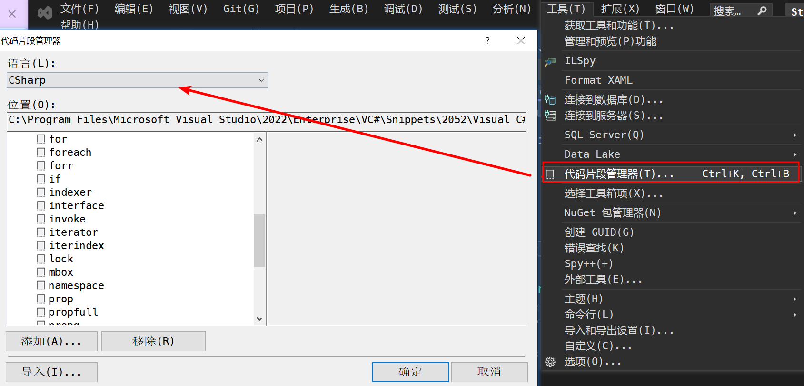

## 1、CodeSnippet

### 1、C#基础

#### 1.1、for 循环

for+Tab

```C#
for (int i = 0; i < length; i++)
{

}
```

#### 1.2、属性声明

简化属性：prop+Tab

```C#
public int MyProperty { get; set; }
```

完整属性：propfull+Tab

```C#
private int myVar;

public int MyProperty
{
    get { return myVar; }
    set { myVar = value; }
}
```

#### 1.3、声明构造函数

声明空构造函数：ctor+Tab

```C#
public LengthValidConverter()
{

}
```

#### 1.3、声明类

cl+Tab+Tab

```C#
class MyClass
{

}
```

### 2、WPF

### 2.1、依赖属性

依赖属性声明：propdp+Tab+Tab

```C#
public int MyProperty
{
    get { return (int)GetValue(MyPropertyProperty); }
    set { SetValue(MyPropertyProperty, value); }
}

// Using a DependencyProperty as the backing store for MyProperty.  This enables animation, styling, binding, etc...
public static readonly DependencyProperty MyPropertyProperty =
    DependencyProperty.Register("MyProperty", typeof(int), typeof(ownerclass), new PropertyMetadata(0));

```

### 3、自定义CodeSnippet




```C#
<?xml version="1.0" encoding="utf-8"?>
<CodeSnippets xmlns="http://schemas.microsoft.com/VisualStudio/2005/CodeSnippet">
	<CodeSnippet Format="1.0.0">
		<Header>
			<Title>propn</Title>
			<Shortcut>propn</Shortcut>
			<Description>NotificationObject属性和支持字段的代码片段</Description>
			<Author>Microsoft Corporation</Author>
			<SnippetTypes>
				<SnippetType>Expansion</SnippetType>
			</SnippetTypes>
		</Header>
		<Snippet>
			<Declarations>
				<Literal>
					<ID>type</ID>
					<ToolTip>属性类型</ToolTip>
					<Default>int</Default>
				</Literal>
				<Literal>
					<ID>property</ID>
					<ToolTip>属性名</ToolTip>
					<Default>MyProperty</Default>
				</Literal>
				<Literal>
					<ID>field</ID>
					<ToolTip>支持此属性的变量</ToolTip>
					<Default>myVar</Default>
				</Literal>
			</Declarations>
			<Code Language="csharp">
        <![CDATA[private $type$ $field$;

	public $type$ $property$
	{
		get { return $field$;}
		set 
    { 
			$field$ = value;
      this.RaisePropertyChanged("$property$");
    }
	}
	$end$]]>
			</Code>
		</Snippet>
	</CodeSnippet>
</CodeSnippets>
```

propn+Tab+Tab就会生成如下代码：

```C#
 private int myVar;

public int MyProperty
{
    get { return myVar; }
    set
    {
        myVar = value;
        this.RaisePropertyChanged("MyProperty");
    }
}
```

## 2、Resharper的使用

https://juejin.cn/post/7227012644508205114

## 3、XAML Styler的使用

https://www.cnblogs.com/dino623/p/XAML_Styler.html

## 4、快捷键

xmal中在当前行开始另起一行换行 alt+shift+enter

C#中在当前行开始另起一行换行 shift+enter
