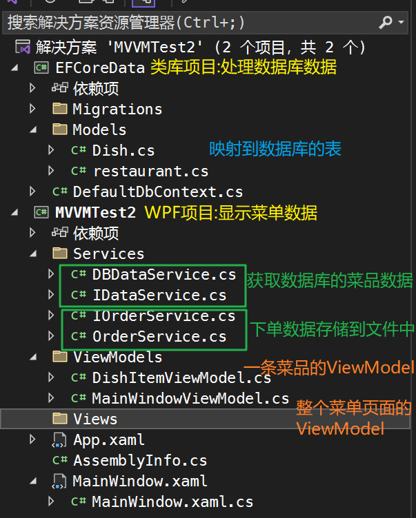
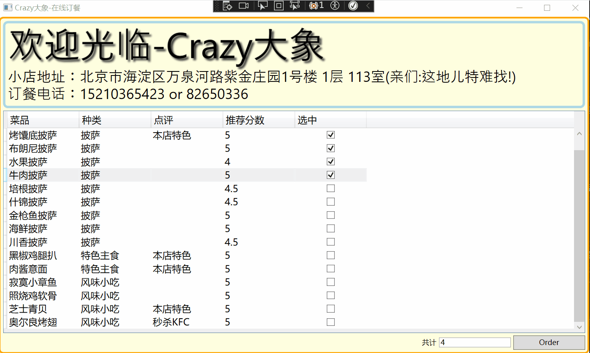

## 0、项目结构

数据存储到sqlserver数据库中



## 1、Database数据准备

首先新建一个类库项目（EFCoreData）作为所有的数据来源，数据库表的相关操作使用EFCore

1）在EFCoreData项目中添加下面的项目依赖（程序包管理器控制台）

```bash
NuGet\Install-Package Microsoft.EntityFrameworkCore -Version 6.0.0
NuGet\Install-Package Microsoft.EntityFrameworkCore.Relational -Version 6.0.0
NuGet\Install-Package Microsoft.EntityFrameworkCore.Design -Version 6.0.0
NuGet\Install-Package Microsoft.EntityFrameworkCore.Tools -Version 6.0.0

NuGet\Install-Package Microsoft.EntityFrameworkCore.SqlServer -Version 6.0.0
```

在启动项MVVMTest2中添加如下项目依赖：

```bash
NuGet\Install-Package Microsoft.EntityFrameworkCore.Design -Version 6.0.0
```

2）Models文件夹下准备要映射到数据库的表对象

```C#
using System;
using System.Collections.Generic;
using System.ComponentModel.DataAnnotations;
using System.ComponentModel.DataAnnotations.Schema;
using System.Linq;
using System.Text;
using System.Threading.Tasks;
using Microsoft.EntityFrameworkCore;

namespace EFCoreData.Models
{
    [Table("T_Dish")]
    public class Dish
    {
        //设置自增主键
        [Key]
        [DatabaseGenerated(DatabaseGeneratedOption.Identity)]
        [Comment("主键")]
        public int Id { get; set; }
        [Comment("菜名")]
        public string Name { get; set; }
        [Comment("类别")]
        public string Category { get; set; }
        [Comment("评论")]
        public string? Comment { get; set; }
        [Comment("评分")]
        public double Score { get; set; }
    }
}
```

```C#
using System;
using System.Collections.Generic;
using System.ComponentModel.DataAnnotations.Schema;
using System.ComponentModel.DataAnnotations;
using System.Linq;
using System.Text;
using System.Threading.Tasks;
using Microsoft.EntityFrameworkCore;

namespace EFCoreData.Models
{
    [Table("T_Restaurant")]
    public class Restaurant
    {
        //设置自增主键
        [Key]
        [DatabaseGenerated(DatabaseGeneratedOption.Identity)]
        [Comment("主键")]
        public int Id { get; set; }
        [Comment("饭店名")]
        public string Name { get; set; }
        [Comment("地址")]
        public string Address { get; set; }
        [Comment("地址")]
        public string PhoneNumber { get; set; }
        
    }
}
```

3）新建一个DefaultDbContext作为数据库上下文

```C#
using EFCoreData.Models;
using Microsoft.EntityFrameworkCore;
using System;

namespace EFCoreData
{
    public class DefaultDbContext : DbContext
    {
        public DbSet<Dish> Dishs { get; set; } //菜品
        public DbSet<Dish> Restaurants { get; set; } //餐馆
        //sqlserver数据库
        protected override void OnConfiguring(DbContextOptionsBuilder optionsBuilder)
        {
            //对数据库连接字符串
            optionsBuilder.UseSqlServer("Server=localhost;Database=test;User Id=sa;Password=root;");
        }
        protected override void OnModelCreating(ModelBuilder modelBuilder)
        {
            base.OnModelCreating(modelBuilder);
        }
    }
}

```

4）运行数据迁移指令，在数据库生成对应的表

```bash
Add-Migration add_table_Dish
预览确认生成无误后 更新数据库表
update-database
```

5）插入测试数据

```sql
INSERT INTO T_Dish (Name,Category,Comment,Score)
VALUES
   ('土豆泥底披萨','披萨','本店特色','4.5'),
   ('烤馕底披萨','披萨','本店特色','5'),
   ('水果披萨','披萨',NULL,'4'),
   ('牛肉披萨','披萨',NULL,'5'),
   ('培根披萨','披萨',NULL,'4.5'),
   ('什锦披萨','披萨',NULL,'4.5'),
   ('金枪鱼披萨','披萨',NULL,'5'), 
   ('海鲜披萨','披萨',NULL,'5'),
   ('川香披萨','披萨',NULL,'4.5'), 
   ('黑椒鸡腿扒','特色主食','本店特色','5'), 
   ('肉酱意面','特色主食','本店特色','5'),
   ('寂寞小章鱼','风味小吃',NULL,'5'),
   ('照烧鸡软骨','风味小吃',NULL,'5'), 
   ('芝士青贝','风味小吃','本店特色','5'), 
   ('奥尔良烤翅','风味小吃','秒杀KFC','5'),
   ('双酱煎泥肠','风味小吃',NULL,'4'),
   ('冰糖洛神','缤纷饮料','清凉解暑','4.5'), 
   ('玫瑰特饮','缤纷饮料','本店特色','5'), 
   ('薄荷汽水','缤纷饮料','清凉解暑','4.5')
```

## 2、service

service文件夹使用接口+实现类的层次，方便后续变更实现类。分别添加四个文件，如下：

订单存储接口：IOrderService

```C#
using System;
using System.Collections.Generic;
using System.Linq;
using System.Text;
using System.Threading.Tasks;

namespace MVVMTest2.Services
{
    public interface IOrderService
    {
        void PlaceOrder(List<string> dishes);
    }
}

```

订单存储实现：OrderService

```C#
using System;
using System.Collections.Generic;
using System.IO;
using System.Linq;
using System.Text;
using System.Threading.Tasks;

namespace MVVMTest2.Services
{
    class OrderService : IOrderService
    {
        public void PlaceOrder(List<string> dishes)
        {
            //存储到项目所在盘的order.txt文件中
            File.WriteAllLines(@"\order.txt",dishes.ToArray());
        }
    }
}

```

数据获取接口：IDataService

```C#
using System;
using System.Collections.Generic;
using System.Linq;
using System.Text;
using System.Threading.Tasks;
using EFCoreData.Models;

namespace MVVMTest2.Services
{
    public interface IDataService
    {
        /// <summary>
        /// 获取所有菜单
        /// </summary>
        /// <returns></returns>
        List<Dish> GetAllDishes();
    }
}

```

数据获取实现类：DBDataService

```C#
using System;
using System.Collections.Generic;
using System.Linq;
using System.Text;
using System.Threading.Tasks;
using EFCoreData;
using System.Windows.Controls;
using System.Xml.Linq;
using EFCoreData.Models;

namespace MVVMTest2.Services
{
    public class DBDataService : IDataService
    {
        public List<Dish> GetAllDishes()
        {
            using var ctx = new DefaultDbContext();
            return ctx.Dishs.ToList();
        }
    }
}

```

## 3、ViewModels

ViewModels中存储的是所有需要显示在界面进行交互的属性，可以拆分为用于显示单个菜品的DishItemViewModel；用于显示整个菜单界面的MainWindowViewModel。

上个单元中为了实现ViewModel和View的交互，我们是手动实现NotificationObject基类（继承自INotifyPropertyChanged接口），原理是ViewModel中的属性发生变化时，通过Binding绑定元素侦听到数据的PropertyChanged变化后的值，进而修改View中Binding的数据。在这里我们安装 Prism.Wpf 依赖包使用它替代我们自定义的NotificationObject。

```bash
NuGet\Install-Package Prism.Wpf -Version 9.0.271-pre
```

DishItemViewModel：列表中每个条目有一个自己的固有属性Dish用来存储菜品信息，除此外还有一个额外属性IsSelected存储该菜品是否被选中。我们希望通过用户对选框的勾选来动态改变View中的显示（触发属性更改通知），所以IsSelected属性要使用 `SetProperty(ref _isSelected, value);`

```C#
using System;
using System.Collections.Generic;
using System.Linq;
using System.Text;
using System.Threading.Tasks;
using EFCoreData.Models;
using Prism.Mvvm;

namespace MVVMTest2.ViewModels
{
    //has a not is a
    class DishItemViewModel : BindableBase
    {
        public Dish DishItem { get; set; }
        private bool _isSelected;
        //是否勾选
        public bool IsSelected
        {
            get { return _isSelected; }
            set
            {
                SetProperty(ref _isSelected, value);
            }
            //set 之前的写法
            //{
                //input1 = value;
                //每次值变化都会触发基类的RaisePropertyChanged方法,同时变化的属性名作为参数传递
                //this.RaisePropertyChanged(nameof(Input1));
            //}
        }
    }
}
```

MainWindowViewModel ：

主窗体中一个有2个命令属性：

- 选中勾框时执行的命令 SelectItemCommand——修改右下角的菜品书
- 下单后执行的命令 PlaceOrderCommand——将下单信息存储到文件中

3个数据属性：

- 右下角下单数 Count
- 表头显示餐馆信息 RestaurantInfo
- 菜单列表 DishList

在构造函数中 初始化餐馆信息、菜单列表、绑定命令执行的操作

```C#
using System;
using System.Collections.Generic;
using System.Linq;
using System.Text;
using System.Threading.Tasks;
using System.Windows;
using EFCoreData.Models;
using MVVMTest2.Services;
using Prism.Commands;
using Prism.Mvvm;

namespace MVVMTest2.ViewModels
{
    class MainWindowViewModel : BindableBase
    {
        //2个命令属性
        public DelegateCommand PlaceOrderCommand { set; get; }
        public DelegateCommand SelectItemCommand { set; get; }
        //3个数据属性
        //1、Count存储菜品数
        private int _count;
        
        public int Count
        {
            get { return _count; }
            set { SetProperty(ref _count, value); }
        }
        //2、RestaurantInfo存储餐馆信息
        private Restaurant _restaurant;

        public Restaurant RestaurantInfo
        {
            get { return _restaurant; }
            set { SetProperty(ref _restaurant, value); }
        }
        //3、DishList存储菜单信息
        private List<DishItemViewModel> _dishList;

        public List<DishItemViewModel> DishList
        {
            get { return _dishList; }
            set { SetProperty(ref _dishList, value); }
        }
        //构造函数中 初始化餐馆信息、菜单列表 绑定命令执行的操作
        public MainWindowViewModel()
        {
            this.LoadMenu();
            this.LoadRestaurant();
            this.PlaceOrderCommand = new DelegateCommand(new Action(this.PlaceOrderCommandExecute));
            this.SelectItemCommand = new DelegateCommand(new Action(this.SelectItemExecute));
        }
        //初始化餐馆信息
        private void LoadRestaurant()
        {
            this.RestaurantInfo = new Restaurant();
            this.RestaurantInfo.Name = "Crazy大象";
            this.RestaurantInfo.Address = "北京市海淀区万泉河路紫金庄园1号楼 1层 113室(亲们:这地儿特难找!)";
            this.RestaurantInfo.PhoneNumber = "15210365423 or 82650336";
        }
        //初始化餐馆信息
        private void LoadMenu()
        {
            DBDataService service = new DBDataService();
            var dishes = service.GetAllDishes();
            this.DishList = new List<DishItemViewModel>();
            foreach (var dish in dishes)
            {
                var dishItemViewModel = new DishItemViewModel();
                dishItemViewModel.DishItem = dish;
                this.DishList.Add(dishItemViewModel);
            }
        }
        //执行保存命令时 获取下单数据并调用orderService
        private void PlaceOrderCommandExecute()
        {
            var selected = this.DishList.Where(x => x.IsSelected == true)
                .Select(x => x.DishItem.Name).ToList();
            IOrderService orderService = new OrderService();
            orderService.PlaceOrder(selected);
            MessageBox.Show("订餐成功");
        }
        //执行勾选命令时 获取下单总数
        private void SelectItemExecute()
        {
            this.Count = this.DishList.Count(x=>x.IsSelected==true);
        }
    }
}

```

## 4、View

在这里就只有一个窗口所以View文件夹中没有放页面，直接在主窗体中修改

```html
<Window x:Class="MVVMTest2.MainWindow" xmlns="http://schemas.microsoft.com/winfx/2006/xaml/presentation"
        xmlns:x="http://schemas.microsoft.com/winfx/2006/xaml" xmlns:d="http://schemas.microsoft.com/expression/blend/2008"
        xmlns:local="clr-namespace:MVVMTest2" xmlns:mc="http://schemas.openxmlformats.org/markup-compatibility/2006"
        Title="{Binding Restaurant.Name, StringFormat=\{0\}-在线订餐}"
        Width="1000" Height="600"
        WindowStartupLocation="CenterScreen" mc:Ignorable="d">
    <Border Background="LightYellow" BorderBrush="Orange"
            BorderThickness="3" CornerRadius="6">
        <!--  Border的内容只能有一个，所以用一个Grid包装起来  -->
        <Grid Name="Root" Margin="4">
            <Grid.RowDefinitions>
                <RowDefinition Height="Auto" />
                <RowDefinition Height="*" />
                <RowDefinition Height="Auto" />
            </Grid.RowDefinitions>
            <!--  上半部分：餐馆介绍  -->
            <Border Padding="4" BorderBrush="LightBlue "
                    BorderThickness="4" CornerRadius="6">
                <StackPanel>
                    <!--  这个StackPanel下所有的字都带有灰色阴影  -->
                    <StackPanel Orientation="Horizontal">
                        <StackPanel.Effect>
                            <DropShadowEffect Color="gray" />
                        </StackPanel.Effect>
                        <TextBlock FontFamily="LiShu" FontSize="60"
                                   Text="欢迎光临-" />
                        <TextBlock FontFamily="LiShu" FontSize="60"
                                   Text="{Binding RestaurantInfo.Name}" />
                    </StackPanel>

                    <StackPanel Orientation="Horizontal">
                        <TextBlock FontFamily="LiShu" FontSize="24"
                                   Text="小店地址：" />
                        <TextBlock FontFamily="LiShu" FontSize="24"
                                   Text="{Binding RestaurantInfo.Address}" />
                    </StackPanel>
                    <StackPanel Orientation="Horizontal">
                        <TextBlock FontFamily="LiShu" FontSize="24"
                                   Text="订餐电话：" />
                        <TextBlock FontFamily="LiShu" FontSize="24"
                                   Text="{Binding RestaurantInfo.PhoneNumber}" />
                    </StackPanel>
                </StackPanel>
            </Border>
            <!--  中间部分：菜单列表  -->
            <DataGrid Grid.Row="1" Margin="0,4"
                      AutoGenerateColumns="False" CanUserAddRows="False"
                      CanUserDeleteRows="False" FontSize="16"
                      GridLinesVisibility="None"
                      ItemsSource="{Binding DishList}">
                <DataGrid.Columns>
                    <!--  静态显示使用DataGridTextColumn  -->
                    <DataGridTextColumn Width="120"
                                        Binding="{Binding DishItem.Name}"
                                        Header="菜品" />
                    <DataGridTextColumn Width="120"
                                        Binding="{Binding DishItem.Category}"
                                        Header="种类" />
                    <DataGridTextColumn Width="120"
                                        Binding="{Binding DishItem.Comment}"
                                        Header="点评" />
                    <DataGridTextColumn Width="120"
                                        Binding="{Binding DishItem.Score}"
                                        Header="推荐分数" />
                    <!--  这里是自定义的列内容  -->
                    <DataGridTemplateColumn Width="120" Header="选中"
                                            SortMemberPath="IsSelected">
                        <DataGridTemplateColumn.CellTemplate>
                            <DataTemplate>
                                <CheckBox HorizontalAlignment="Center" VerticalAlignment="Center"
                                          Command="{Binding Path=DataContext.SelectItemCommand, RelativeSource={RelativeSource Mode=FindAncestor, AncestorType={x:Type DataGrid}}}"
                                          IsChecked="{Binding Path=IsSelected, UpdateSourceTrigger=PropertyChanged}" />
                            </DataTemplate>
                        </DataGridTemplateColumn.CellTemplate>
                    </DataGridTemplateColumn>
                </DataGrid.Columns>
            </DataGrid>
            <!--  下半部分：显示下单数、order按钮  -->
            <StackPanel Grid.Row="2" HorizontalAlignment="Right"
                        Orientation="Horizontal">
                <TextBlock VerticalAlignment="Center" Text="共计" />
                <TextBox Width="120" Margin="4,0"
                         VerticalAlignment="Center" IsReadOnly="True"
                         Text="{Binding Count}" />
                <Button Width="120" Height="24"
                        Command="{Binding PlaceOrderCommand}"
                        Content="Order" />
            </StackPanel>
        </Grid>
    </Border>
</Window>
```

对于这里可能会感到疑惑：

外层的`<DataGrid ItemsSource="{Binding DishList}">`绑定的数据源是DishList，DishList是窗体ViewModel中定义的一个属性具体如下：其类型为`List<DishItemViewModel>`

```C#
 //3、DishList存储菜单信息
 private List<DishItemViewModel> _dishList;

 public List<DishItemViewModel> DishList
 {
     get { return _dishList; }
     set { SetProperty(ref _dishList, value); }
 }
```

DishItemViewModel的定义如下：

```C#
class DishItemViewModel : BindableBase
{
    public Dish DishItem { get; set; }
    private bool _isSelected;
    //是否勾选
    public bool IsSelected
    {
        get { return _isSelected; }
        set
        {
            SetProperty(ref _isSelected, value);
        }
    }
}
```

所以每个条目各列的值都是从 `public Dish DishItem { get; set; }` 中取的，所以绑定代码如下：数据源为 DishItem.Score

```html
<DataGridTextColumn Width="120"
                    Binding="{Binding DishItem.Score}"
                    Header="推荐分数" />
```

但是是否勾选是下面的属性获取的

```C#
 private bool _isSelected;
    //是否勾选
    public bool IsSelected
    {
        get { return _isSelected; }
        set
        {
            SetProperty(ref _isSelected, value);
        }
    }
```

` IsChecked="{Binding Path=IsSelected"` 所以数据源为 IsSelected

此外由于checkbox这里还关联了右下角数值的值，所以额外还需要给Command属性赋值，

```html

<!--  这里是自定义的列内容  -->
<DataGridTemplateColumn Width="120" Header="选中"
                        SortMemberPath="IsSelected">
    <DataGridTemplateColumn.CellTemplate>
        <DataTemplate>
            <CheckBox HorizontalAlignment="Center" VerticalAlignment="Center"
                      Command="{Binding Path=DataContext.SelectItemCommand, RelativeSource={RelativeSource Mode=FindAncestor, AncestorType={x:Type DataGrid}}}"
                      IsChecked="{Binding Path=IsSelected, UpdateSourceTrigger=PropertyChanged}" />
        </DataTemplate>
    </DataGridTemplateColumn.CellTemplate>
</DataGridTemplateColumn>
```

将复选框的命令绑定到位于 `DataGrid` 控件的视图模型中的 `SelectItemCommand` 命令。这意味着当用户在 UI 中勾选或取消勾选复选框时，`SelectItemCommand` 命令会在视图模型中执行相应的逻辑。

当你直接使用 `Command="{Binding Path=DataContext.SelectItemCommand}"` 时，绑定系统会尝试从 `CheckBox` 的上下文中查找 `SelectItemCommand` 属性。但实际上，`SelectItemCommand` 属性是定义在 `DataGrid` 控件的视图模型中的。

为了解决这个问题，我们使用了相对源对象的绑定 (`RelativeSource`) 来告诉绑定系统去查找 `DataGrid` 控件，然后使用它的数据上下文对象，即视图模型，来获取 `SelectItemCommand` 属性。这样就确保了命令绑定是从正确的数据上下文对象中获取的。

上下文实际上是在Windows中定义的，但是绑定到DataGrid中仍可以实现一样的效果，这是因为通过使用 `RelativeSource`，可以指定要查找的元素以及其相对于当前元素的位置关系。在这种情况下，我们使用了 `AncestorType` 模式，指定要查找的是 `DataGrid` 控件，以及它是当前元素的祖先。

```html
Command="{Binding DataContext.SelectItemCommand, RelativeSource={RelativeSource AncestorType={x:Type Window}}}"

Command="{Binding Path=DataContext.SelectItemCommand, RelativeSource={RelativeSource Mode=FindAncestor, AncestorType={x:Type DataGrid}}}"
```


## 5、效果：



