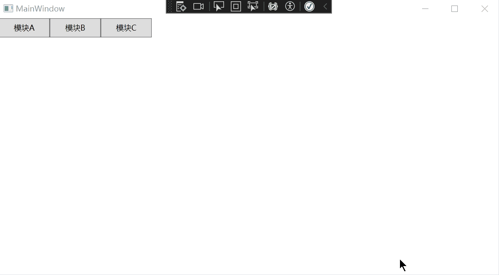
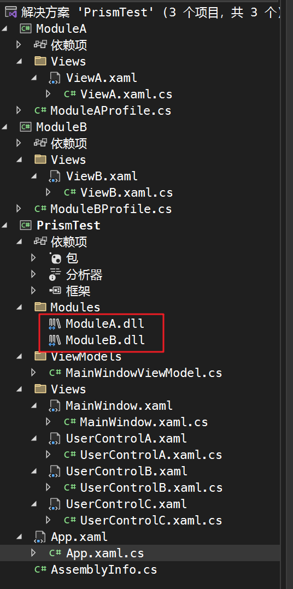
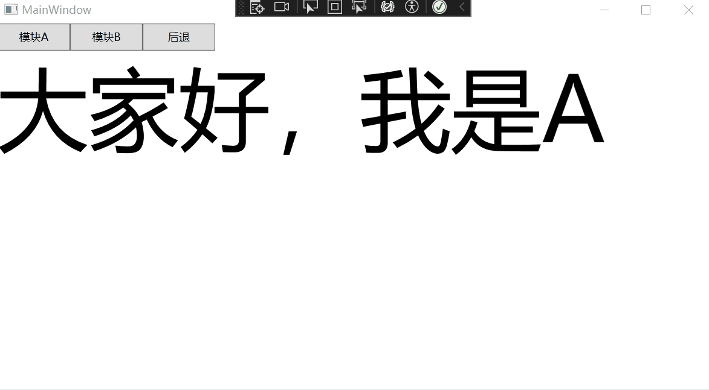
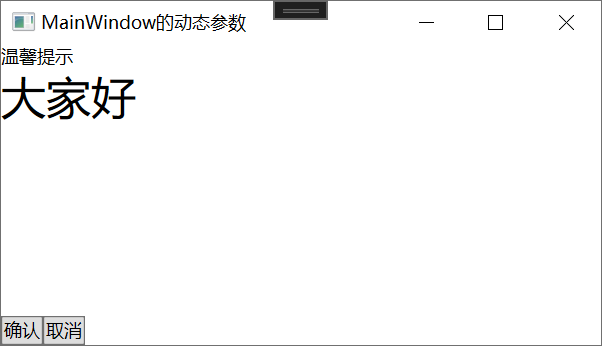
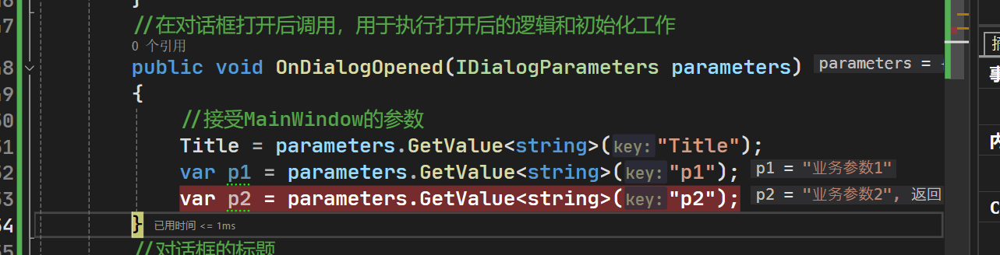
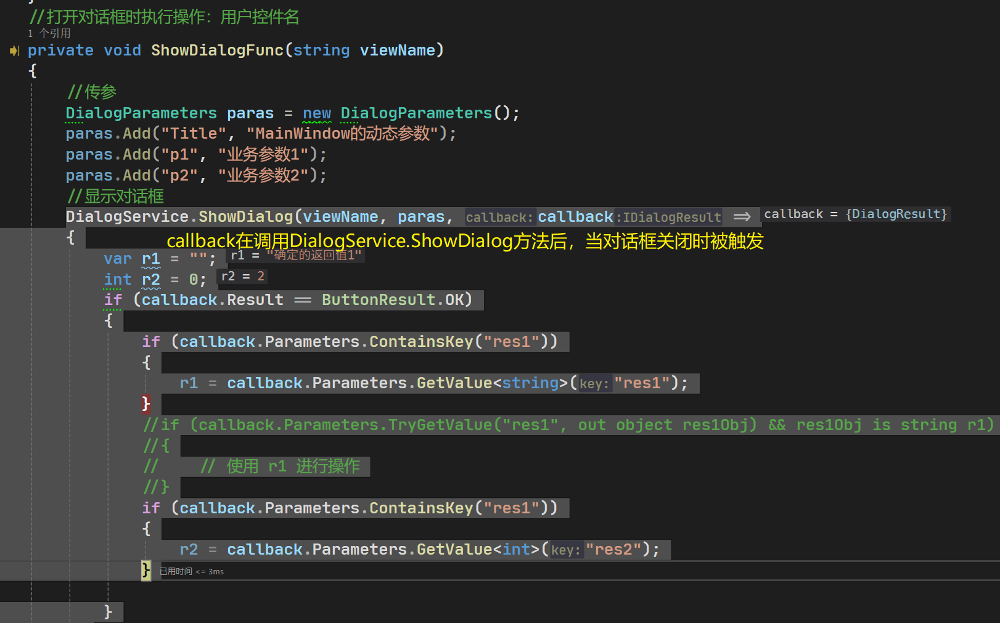

## 1、安装以及简介

```bash
NuGet\Install-Package Prism.DryIoc -Version 8.1.97
```

Prism框架是一个功能强大的MVVM框架，它提供了许多功能来简化和加速WPF应用程序的开发。以下是Prism框架可以实现的一些主要功能：

1. 模块化开发：Prism框架支持将应用程序拆分为多个独立的模块，每个模块可以独立开发、测试和部署。这种模块化的开发方式使得应用程序更易于维护和扩展。
2. 导航管理：Prism框架提供了强大的导航管理功能，可以轻松地实现页面之间的导航和传递参数。它支持多种导航模式，包括区域导航、URL导航等。
3. 事件聚合器：Prism框架提供了一个事件聚合器，用于解耦视图模型之间的通信。通过事件聚合器，一个视图模型可以发布事件，其他视图模型可以订阅这些事件，实现松耦合的通信。
4. 依赖注入：Prism框架内置了一个轻量级的依赖注入容器，可以帮助你解决对象之间的依赖关系。通过依赖注入，可以更好地管理和组织应用程序中的对象，提高代码的可测试性和可扩展性。
5. 异步编程支持：Prism框架提供了对异步编程的良好支持，可以方便地处理异步操作，如网络请求、数据库查询等。它使用了Task-based模型和异步命令模型，使得异步编程变得更加简单和可靠。
6. 命令绑定：PrismApplication支持命令绑定的方式，可以将界面元素与应用程序逻辑进行绑定。这样可以实现用户操作与应用程序行为之间的解耦，提供更好的用户交互体验。

## 2、创建WPF项目

打开app.xmal

```xml
<Application x:Class="PrismTest.App"
                  xmlns="http://schemas.microsoft.com/winfx/2006/xaml/presentation"
                  xmlns:x="http://schemas.microsoft.com/winfx/2006/xaml"
                  xmlns:local="clr-namespace:PrismTest"
                  StartupUri="MainWindow.xaml">
    <Application.Resources>
         
    </Application.Resources>
</Application>
```

在app.xmal中引入prism`xmlns:prism ="http://prismlibrary.com/"`

外层的Application改为 prism:PrismApplication 

去掉StartupUri="MainWindow.xaml" （因为在cs文件中CreateShell方法中设置了启动页，这里不要重复声明）

```xml
<prism:PrismApplication x:Class="PrismTest.App"
                  xmlns="http://schemas.microsoft.com/winfx/2006/xaml/presentation"
                  xmlns:x="http://schemas.microsoft.com/winfx/2006/xaml"
                  xmlns:local="clr-namespace:PrismTest"
                  xmlns:prism ="http://prismlibrary.com/">
    <Application.Resources>
         
    </Application.Resources>
</prism:PrismApplication>
```

在cs文件中继承PrismApplication，重写RegisterTypes、CreateShell

```C#
using System.Configuration;
using System.Data;
using System.Windows;
using Prism.DryIoc;
using Prism.Ioc;

namespace PrismTest
{
    /// <summary>
    /// Interaction logic for App.xaml
    /// </summary>
    public partial class App : PrismApplication
    {
        /// <summary>
        /// 注入服务
        /// </summary>
        /// <param name="containerRegistry"></param>
        /// <exception cref="NotImplementedException"></exception>
        protected override void RegisterTypes(IContainerRegistry containerRegistry)
        {
            //throw new NotImplementedException();
        }
        /// <summary>
        /// 设置启动页
        /// </summary>
        /// <returns></returns>
        /// <exception cref="NotImplementedException"></exception>
        protected override Window CreateShell()
        {
            //将MainWindow设置为启动页
            return Container.Resolve<MainWindow>();
            //throw new NotImplementedException();
        }
    }
}
```

## 3、区域

在Prism框架中，区域是一个可以容纳和管理视图的容器。它允许我们将界面分割成独立的部分，每个部分可以由不同的模块负责，从而实现模块之间的解耦和独立开发。

每个区域都有一个唯一的标识符，通常是一个字符串。我们可以在XAML中使用Prism框架提供的RegionManager类来定义和配置区域。一旦我们定义了区域，就可以在模块中使用RegionManager类来导航和展示视图（在区域中动态加载和卸载不同的视图）实现界面的动态切换和更新。

下面实现一个案例，点击不同的按钮会切换下方的页面实现导航的功能：

在Views文件夹下：

1）先创建导航的单个目标页面UserControlA、UserControlB、UserControlC

```xml
<UserControl x:Class="PrismTest.Views.UserControlA"
             xmlns="http://schemas.microsoft.com/winfx/2006/xaml/presentation"
             xmlns:x="http://schemas.microsoft.com/winfx/2006/xaml"
             xmlns:mc="http://schemas.openxmlformats.org/markup-compatibility/2006" 
             xmlns:d="http://schemas.microsoft.com/expression/blend/2008" 
             xmlns:local="clr-namespace:PrismTest.Views"
             mc:Ignorable="d" a
             d:DesignHeight="450" d:DesignWidth="800">
    <Grid>
            <TextBlock Text="我是A" FontSize="100"></TextBlock>
    </Grid>
</UserControl>
```

```xml
<UserControl x:Class="PrismTest.Views.UserControlB" xmlns="http://schemas.microsoft.com/winfx/2006/xaml/presentation"
             xmlns:x="http://schemas.microsoft.com/winfx/2006/xaml" xmlns:d="http://schemas.microsoft.com/expression/blend/2008"
             xmlns:local="clr-namespace:PrismTest.Views" xmlns:mc="http://schemas.openxmlformats.org/markup-compatibility/2006"
             d:DesignHeight="450" d:DesignWidth="800"
             mc:Ignorable="d">
    <Grid>
        <TextBlock FontSize="100" Text="我是B" />

    </Grid>
</UserControl>
```

```xml
<UserControl x:Class="PrismTest.Views.UserControlC" xmlns="http://schemas.microsoft.com/winfx/2006/xaml/presentation"
             xmlns:x="http://schemas.microsoft.com/winfx/2006/xaml" xmlns:d="http://schemas.microsoft.com/expression/blend/2008"
             xmlns:local="clr-namespace:PrismTest.Views" xmlns:mc="http://schemas.openxmlformats.org/markup-compatibility/2006"
             d:DesignHeight="450" d:DesignWidth="800"
             mc:Ignorable="d">
    <Grid>
        <TextBlock FontSize="100" Text="我是C" />

    </Grid>
</UserControl>
```

2）修改App.xmal.cs文件中将三个UserControl注册为导航页面

Prism框架会自动创建一个新的页面实例，并将其作为导航目标展示给用户。当导航离开该页面时，Prism框架会自动销毁该页面实例，以释放资源并确保页面不再占用内存。

```C#
using System.Configuration;
using System.Data;
using System.Windows;
using System.Windows.Controls;
using DryIoc;
using Prism.DryIoc;
using Prism.Ioc;
using Prism.Regions;
using PrismTest.Views;

namespace PrismTest
{
    /// <summary>
    /// Interaction logic for App.xaml
    /// </summary>
    public partial class App : PrismApplication
    {
        /// <summary>
        /// 注入服务
        /// </summary>
        /// <param name="containerRegistry"></param>
        /// <exception cref="NotImplementedException"></exception>
        protected override void RegisterTypes(IContainerRegistry containerRegistry)
        { // 注册区域
            
            //将三个UserControl注册为导航页面
            containerRegistry.RegisterForNavigation<UserControlA>("A"); //代称A
            containerRegistry.RegisterForNavigation<UserControlB>("B");
            containerRegistry.RegisterForNavigation<UserControlC>("C");
        }
        /// <summary>
        /// 设置启动页
        /// </summary>
        /// <returns></returns>
        /// <exception cref="NotImplementedException"></exception>
        protected override Window CreateShell()
        {
            //将MainWindow设置为启动页
            return Container.Resolve<MainWindow>();
            //throw new NotImplementedException();
        }
    }
}
```

3）在Views文件夹下创建MainWindow（删掉原来的）

`prism:ViewModelLocator.AutoWireViewModel="True"`配置视图模型的自动注入

```xml
<Window x:Class="PrismTest.AreaWindow" 
        xmlns:prism="http://prismlibrary.com/"
        prism:ViewModelLocator.AutoWireViewModel="True">
```

- 当`AutoWireViewModel`属性设置为`True`时，Prism框架会自动根据命名约定绑定视图和视图模型。它会根据视图的名称查找对应的视图模型，并将其自动注入到视图的`DataContext`属性中，从而实现视图和视图模型的绑定。
- 当`AutoWireViewModel`属性设置为`False`时，Prism框架不会自动绑定视图和视图模型。开发者需要手动创建视图模型的实例，并将其赋值给视图的`DataContext`属性。

```xml
<Window x:Class="PrismTest.Views.MainWindow" xmlns="http://schemas.microsoft.com/winfx/2006/xaml/presentation"
        xmlns:x="http://schemas.microsoft.com/winfx/2006/xaml" xmlns:d="http://schemas.microsoft.com/expression/blend/2008"
        xmlns:local="clr-namespace:PrismTest.Views" xmlns:mc="http://schemas.openxmlformats.org/markup-compatibility/2006"
        xmlns:prism="http://prismlibrary.com/" 
        prism:ViewModelLocator.AutoWireViewModel="True"
        Title="MainWindow"
        Width="800" Height="450"
        mc:Ignorable="d">
    <Grid>
        <Grid.RowDefinitions>
            <RowDefinition Height="30" />
            <RowDefinition />
        </Grid.RowDefinitions>
        <StackPanel Orientation="Horizontal">
            <Button Width="80" Height="30"
                    Command="{Binding ShowContentCommand}"
                    CommandParameter="A" Content="模块A" />
            <Button Width="80" Height="30"
                    Command="{Binding ShowContentCommand}"
                    CommandParameter="B" Content="模块B" />
            <Button Width="80" Height="30"
                    Command="{Binding ShowContentCommand}"
                    CommandParameter="C" Content="模块C" />
        </StackPanel>
         <!--< 这里配置区域为ContentRegion />-->
        <ContentControl Grid.Row="1" prism:RegionManager.RegionName="ContentRegion" />
    </Grid>
</Window>
```

4）在ViewModels文件夹下创建MainWindow的ViewModel，名为MainWindowViewModel

命名规范举例如下：如果页面名为MainWindow，那么它对应的视图模型名为MainWindowViewModel

```C#
using System;
using System.Collections.Generic;
using System.Linq;
using System.Text;
using System.Threading.Tasks;
using System.Windows.Controls;
using Prism.Commands;
using Prism.Mvvm;
using Prism.Regions;
using PrismTest.Views;

namespace PrismTest.ViewModels
{
    public class MainWindowViewModel : BindableBase
    {
        // 注入区域管理
        private readonly IRegionManager RegionManager;
        //构造函数中 绑定命令执行的操作
        public MainWindowViewModel(IRegionManager _regionManager)
        {
            RegionManager = _regionManager;
            this.ShowContentCommand = new DelegateCommand<string>(ShowContentMethod);
        }

        /// <summary>
		/// 数据属性 userControl
		/// </summary>
		private UserControl _ShowContent;

        public UserControl ShowContent
        {
            get { return _ShowContent; }
            set { SetProperty(ref _ShowContent, value); }
        }
        //命令属性:切换Control
        public DelegateCommand<string> ShowContentCommand { get; set; }
        //切换Control时执行操作：将userControl赋值为对应的UserControl
        private void ShowContentMethod(string viewName)
        {
            RegionManager.Regions["ContentRegion"].RequestNavigate(viewName);
        }
    }
}
```

效果：



## 4、模块化

在主项目中使用其他项目作为模块，有两种方法：


1）在刚刚解决方案里添加两个WPF项目ModuleA、ModuleB，并通过 项目——属性——应用程序——常规——输出类型——》类库的方式将输出改为类库项目，分别新建ViewA、ViewB文件夹在其中添加两个UserControl，xmal代码如下：

```xml
<UserControl x:Class="ModuleA.Views.ViewA" xmlns="http://schemas.microsoft.com/winfx/2006/xaml/presentation"
             xmlns:x="http://schemas.microsoft.com/winfx/2006/xaml" xmlns:d="http://schemas.microsoft.com/expression/blend/2008"
             xmlns:local="clr-namespace:ModuleA.Views" xmlns:mc="http://schemas.openxmlformats.org/markup-compatibility/2006"
             d:DesignHeight="450" d:DesignWidth="800"
             mc:Ignorable="d">
    <Grid>
        <TextBlock Text="我是模块A" FontSize="100"/>
    </Grid>
</UserControl>

```

```xml
<UserControl x:Class="ModuleB.Views.ViewB" xmlns="http://schemas.microsoft.com/winfx/2006/xaml/presentation"
             xmlns:x="http://schemas.microsoft.com/winfx/2006/xaml" xmlns:d="http://schemas.microsoft.com/expression/blend/2008"
             xmlns:local="clr-namespace:ModuleB.Views" xmlns:mc="http://schemas.openxmlformats.org/markup-compatibility/2006"
             d:DesignHeight="450" d:DesignWidth="800"
             mc:Ignorable="d">
    <Grid>
        <TextBlock Text="我是模块B" FontSize="100"/>
    </Grid>
</UserControl>

```

2）在ModuleA、ModuleB下分别新建一个ModuleAProfile，用于注册两个窗口的的目录页

```C#
using System;
using System.Collections.Generic;
using System.Linq;
using System.Text;
using System.Threading.Tasks;
using ModuleA.Views;
using Prism.Ioc;
using Prism.Modularity;

namespace ModuleA
{
    public class ModuleAProfile : IModule
    {
        //依赖注入将ViewA的UserControl注册为导航页面
        public void RegisterTypes(IContainerRegistry containerRegistry)
        {
            containerRegistry.RegisterForNavigation<ViewA>();
        }

        public void OnInitialized(IContainerProvider containerProvider)
        {
        }
    }
}
```

```C#
using System;
using System.Collections.Generic;
using System.Linq;
using System.Text;
using System.Threading.Tasks;
using ModuleB.Views;
using Prism.Ioc;
using Prism.Modularity;

namespace ModuleB
{
    public class ModuleBProfile :IModule
    {
        public void RegisterTypes(IContainerRegistry containerRegistry)
        {
            containerRegistry.RegisterForNavigation<ViewB>();
        }

        public void OnInitialized(IContainerProvider containerProvider)
        {
        }
    }
}
```

### 第一种：添加项目引用+ConfigureModuleCatalog

3）主项目引用上面的ModuleA、ModuleB项目，app.xmal.cs中注释掉原来的RegisterTypes内部内容，重写ConfigureModuleCatalog方法来添加或定义模块，告诉Prism框架应用程序中哪些模块可用

```C#
using System.Configuration;
using System.Data;
using System.Windows;
using System.Windows.Controls;
using DryIoc;
using Prism.DryIoc;
using Prism.Ioc;
using Prism.Modularity;
using Prism.Regions;
using PrismTest.Views;
using ModuleA;
using ModuleB;

namespace PrismTest
{
    /// <summary>
    /// Interaction logic for App.xaml
    /// </summary>
    public partial class App : PrismApplication
    {
        /// <summary>
        /// 注入服务
        /// </summary>
        /// <param name="containerRegistry"></param>
        /// <exception cref="NotImplementedException"></exception>
        protected override void RegisterTypes(IContainerRegistry containerRegistry)
        { // 注册区域
            
            //将三个UserControl注册为导航页面
            //Prism框架会自动创建一个新的页面实例，并将其作为导航目标展示给用户。当导航离开该页面时，Prism框架会自动销毁该页面实例，以释放资源并确保页面不再占用内存。
            //containerRegistry.RegisterForNavigation<UserControlA>("A");
            //containerRegistry.RegisterForNavigation<UserControlB>("B");
            //containerRegistry.RegisterForNavigation<UserControlC>("C");
        }
        //来添加或定义模块，告诉Prism框架应用程序中哪些模块可用
        protected override void ConfigureModuleCatalog(IModuleCatalog moduleCatalog)
        {
            moduleCatalog.AddModule<ModuleAProfile>();
            moduleCatalog.AddModule<ModuleBProfile>();
            base.ConfigureModuleCatalog(moduleCatalog);
        }

        /// <summary>
        /// 设置启动页
        /// </summary>
        /// <returns></returns>
        /// <exception cref="NotImplementedException"></exception>
        protected override Window CreateShell()
        {
            //将MainWindow设置为启动页
            return Container.Resolve<MainWindow>();
            //throw new NotImplementedException();
        }
    }
}
```

4）MainWindow中的`CommandParameter="A"`改为`CommandParameter="ViewA"`

此种方式子模块和主应用之间耦合度较高，当模块增加时需要重新添加应用，且需要在app.xmal.cs的ConfigureModuleCatalog方法中加代码。

### 第二种：引用dll文件+CreateModuleCatalog

1）在主应用下建一个名为Modules的文件夹，其中添加模块A、模块B UserControl的生成的dll文件即：PrismTest\ModuleA\bin\Debug\net6.0-windows\ModuleA.dll、PrismTest\ModuleA\bin\Debug\net6.0-windows\ModuleB.dll

2）在app.xmal.cs的ConfigureModuleCatalog方法中重写`CreateModuleCatalog`

```C#
using System.Configuration;
using System.Data;
using System.Windows;
using System.Windows.Controls;
using DryIoc;
using Prism.DryIoc;
using Prism.Ioc;
using Prism.Modularity;
using Prism.Regions;
using PrismTest.Views;
//using ModuleA;
//using ModuleB;

namespace PrismTest
{
    /// <summary>
    /// Interaction logic for App.xaml
    /// </summary>
    public partial class App : PrismApplication
    {
        /// <summary>
        /// 注入服务
        /// </summary>
        /// <param name="containerRegistry"></param>
        /// <exception cref="NotImplementedException"></exception>
        protected override void RegisterTypes(IContainerRegistry containerRegistry)
        { // 注册区域
            
            //将三个UserControl注册为导航页面
            //Prism框架会自动创建一个新的页面实例，并将其作为导航目标展示给用户。当导航离开该页面时，Prism框架会自动销毁该页面实例，以释放资源并确保页面不再占用内存。
            //containerRegistry.RegisterForNavigation<UserControlA>("A");
            //containerRegistry.RegisterForNavigation<UserControlB>("B");
            //containerRegistry.RegisterForNavigation<UserControlC>("C");
        }
        //来添加或定义模块，告诉Prism框架应用程序中哪些模块可用
        //protected override void ConfigureModuleCatalog(IModuleCatalog moduleCatalog)
        //{
        //    moduleCatalog.AddModule<ModuleAProfile>();
        //    moduleCatalog.AddModule<ModuleBProfile>();
        //    base.ConfigureModuleCatalog(moduleCatalog);
        //}

        protected override IModuleCatalog CreateModuleCatalog()
        {
            return new DirectoryModuleCatalog() { ModulePath = @".\Modules" };
        }

        /// <summary>
        /// 设置启动页
        /// </summary>
        /// <returns></returns>
        /// <exception cref="NotImplementedException"></exception>
        protected override Window CreateShell()
        {
            //将MainWindow设置为启动页
            return Container.Resolve<MainWindow>();
            //throw new NotImplementedException();
        }
    }
}
```

两种方式在性能上也有区别，第一种方式由于添加了项目引用，所以在项目启动时会将该模块所有部分都进行加载；第二种只有在需要显示ModuleA时才会去加载dll文件，最后补充项目目录：



## 5、导航

通过MainWindow传递的参数动态修改ModuleA页面显示内容，在AB之间切换之前增加确认弹框，同时增加一个回退功能

1）添加ViewA的ViewModel的数据属性Msg

```xml
<UserControl x:Class="ModuleA.Views.ViewA" xmlns="http://schemas.microsoft.com/winfx/2006/xaml/presentation"
             xmlns:x="http://schemas.microsoft.com/winfx/2006/xaml" xmlns:d="http://schemas.microsoft.com/expression/blend/2008"
             xmlns:local="clr-namespace:ModuleA.Views" xmlns:mc="http://schemas.openxmlformats.org/markup-compatibility/2006"
             d:DesignHeight="450" d:DesignWidth="800"
             mc:Ignorable="d">
    <Grid>
        <TextBlock FontSize="100" Text="{Binding Msg}" />
    </Grid>
</UserControl>
```

2）修改ViewAViewModel页面

```C#
using System;
using System.Collections.Generic;
using System.Linq;
using System.Text;
using System.Threading.Tasks;
using System.Windows;
using Prism.Mvvm;
using Prism.Regions;

namespace ModuleA.ViewModels
{
    public class ViewAViewModel:BindableBase,IConfirmNavigationRequest
    {
        //数据属性：增加绑定的内容
        private string _msg;

        public string Msg
        {
            get { return _msg; }
            set {  SetProperty(ref _msg, value); }
        }
        //INavigationAware的OnNavigatedTo 在导航目标之前调用，用于做准备工作
        //如：导航参数、更新界面状态、加载数据
        //此处接收MainWindow的MsgA参数
        public void OnNavigatedTo(NavigationContext navigationContext)
        { 
            //内部获取
            //判断是否存在名为MsgA的导航参数，若存在则将参数值赋值给Msg字段
            if (navigationContext.Parameters.ContainsKey("MsgA"))
                Msg = navigationContext.Parameters.GetValue<string>("MsgA");
        }
        //INavigationAware的IsNavigationTarget判断是否是有效的导航目标，是则返回true否则返回false
        public bool IsNavigationTarget(NavigationContext navigationContext)
        {
            return true;
        }
        //INavigationAware的OnNavigatedFrom在导航离开当前页面或视图时调用，用于清理和处理操作
        //如：保存页面状态、清理资源、取消订阅事件等
        public void OnNavigatedFrom(NavigationContext navigationContext)
        {
        }
        //IConfirmNavigationRequest的ConfirmNavigationRequest方法在导航请求时确认是否允许导航。
        public void ConfirmNavigationRequest(NavigationContext navigationContext, Action<bool> continuationCallback)
        {
            bool res = MessageBox.Show("确定切换吗？", "温馨提示", MessageBoxButton.YesNo) == MessageBoxResult.Yes;
            //Invoke 方法用于执行委托所引用的方法，根据委托的签名和参数进行方法的调用
            continuationCallback?.Invoke(res);
            // 调用 continuationCallback(true) 表示允许导航
    		// 调用 continuationCallback(false) 表示取消导航
        }
    }
}

```

注意：IConfirmNavigationRequest继承了INavigationAware

3）绑定View和ViewModel的关系

之前都是通过在标签中增加如下代码让prism根据命名规范自动绑定View和ViewModel的关系

```xml
xmlns:prism="http://prismlibrary.com/"
prism:ViewModelLocator.AutoWireViewModel="True"
```

现在在配置启动页处就可以直接配置`containerRegistry.RegisterForNavigation<ViewA,ViewAViewModel>();`

```C#
using System;
using System.Collections.Generic;
using System.Linq;
using System.Text;
using System.Threading.Tasks;
using ModuleA.ViewModels;
using ModuleA.Views;
using Prism.Ioc;
using Prism.Modularity;

namespace ModuleA
{
    public class ModuleAProfile : IModule
    {
        //依赖注入将ViewA的UserControl注册为导航页面
        public void RegisterTypes(IContainerRegistry containerRegistry)
        {
            //指定视图对应的视图模型
            containerRegistry.RegisterForNavigation<ViewA,ViewAViewModel>();
        }

        public void OnInitialized(IContainerProvider containerProvider)
        {
        }
    }
}
```

4）MainWindow中增加一个回退按钮，绑定BackCommand命令

```xml
<Window x:Class="PrismTest.Views.MainWindow" xmlns="http://schemas.microsoft.com/winfx/2006/xaml/presentation"
        xmlns:x="http://schemas.microsoft.com/winfx/2006/xaml" xmlns:d="http://schemas.microsoft.com/expression/blend/2008"
        xmlns:local="clr-namespace:PrismTest.Views" xmlns:mc="http://schemas.openxmlformats.org/markup-compatibility/2006"
        xmlns:prism="http://prismlibrary.com/" Title="MainWindow"
        Width="800" Height="450"
        prism:ViewModelLocator.AutoWireViewModel="True" mc:Ignorable="d">
    <Grid>
        <Grid.RowDefinitions>
            <RowDefinition Height="30" />
            <RowDefinition />
        </Grid.RowDefinitions>
        <StackPanel Orientation="Horizontal">
            <Button Width="80" Height="30"
                    Command="{Binding ShowContentCommand}"
                    CommandParameter="ViewA" Content="模块A" />
            <Button Width="80" Height="30"
                    Command="{Binding ShowContentCommand}"
                    CommandParameter="ViewB" Content="模块B" />
            <Button Width="80" Height="30"
                    Command="{Binding BackCommand}"
                    Content="后退" />
        </StackPanel>
        <ContentControl Grid.Row="1" prism:RegionManager.RegionName="xx" />
        <!--<ContentControl Grid.Row="1" Content="{Binding ShowContent}" />-->
    </Grid>
</Window>
```

4）修改MainWindowViewModel，增加BackCommand回退命令，以及回退执行Back方法（回退需要知道导航上下文的导航日志，`private IRegionNavigationJournal? JournalInfo;`），修改原来的ShowContentMethod方法，在增加NavigationParameters

```C#
using System;
using System.Collections.Generic;
using System.Linq;
using System.Text;
using System.Threading.Tasks;
using System.Windows.Controls;
using Prism.Commands;
using Prism.Mvvm;
using Prism.Regions;
using PrismTest.Views;

namespace PrismTest.ViewModels
{
    public class MainWindowViewModel : BindableBase
    {
        // 注入区域管理
        private readonly IRegionManager RegionManager;
        //导航日志接口
        private IRegionNavigationJournal? JournalInfo;
        //命令属性:切换Control
        public DelegateCommand<string> ShowContentCommand { get; set; }
        //命令属性:后退
        public DelegateCommand BackCommand { get; set; }


        //构造函数中 绑定命令执行的操作
        public MainWindowViewModel(IRegionManager _regionManager)
        {
            RegionManager = _regionManager;
            this.ShowContentCommand = new DelegateCommand<string>(ShowContentMethod);
            this.BackCommand = new DelegateCommand(Back);
        }

        /// <summary>
		/// 数据属性 userControl
		/// </summary>
		private UserControl _ShowContent;

        public UserControl ShowContent
        {
            get { return _ShowContent; }
            set { SetProperty(ref _ShowContent, value); }
        }

        //切换Control时执行操作：将userControl赋值为对应的UserControl
        private void ShowContentMethod(string viewName)
        {
            //增加导航参数
            NavigationParameters paras = new NavigationParameters();
            paras.Add("MsgA", "大家好，我是A");
            //在xx区域发起导航请求
            RegionManager.Regions["xx"].RequestNavigate(viewName, callback =>
            {
                //导航请求完成后执行：获取导航服务的导航日志
                JournalInfo = callback.Context.NavigationService.Journal;
            }, paras);
            //RegionManager.RequestNavigate("ContentRegion", viewName);
        }

        //后退执行操作：
        private void Back()
        {
            if (JournalInfo is { CanGoBack: true })
                //if (JournalInfo != null && JournalInfo.CanGoBack)
                JournalInfo.GoBack();
        }
    }
}
```

当使用Prism框架开发WPF应用程序时，`IRegionNavigationJournal` 接口是Prism提供的一个用于导航日志（Navigation Journal）的接口。

导航日志是一个记录应用程序中各个页面或视图导航历史的机制。`IRegionNavigationJournal` 接口定义了一组方法和属性，用于管理和操作导航历史。

以下是 `IRegionNavigationJournal` 接口的一些重要成员：

1. `CanGoBack` 属性：获取一个布尔值，表示是否可以返回到上一个导航目标。
2. `CanGoForward` 属性：获取一个布尔值，表示是否可以前进到下一个导航目标。
3. `GoBack` 方法：导航到上一个导航目标。
4. `GoForward` 方法：导航到下一个导航目标。
5. `Clear` 方法：清除导航历史。

5）效果：



## 6、对话服务

prism可以方便地处理对话框之间的参数传递，此处在MainWindow中新增一个弹窗按钮，点击后携带参数执行弹窗命令，在弹出ViewC的UserControl中设计确定+取消按钮，点击取消关闭弹窗/点击确定则携带参数返回给MainWindow

1）设计一个ViewC作为弹窗中的显示内容，设计弹窗高度为40*200，确认按钮绑定ConfirmCommand命令，确认按钮绑定ConfirmCommand命令

```xml
<UserControl x:Class="ModuleA.Views.ViewC" xmlns="http://schemas.microsoft.com/winfx/2006/xaml/presentation"
             xmlns:x="http://schemas.microsoft.com/winfx/2006/xaml" xmlns:d="http://schemas.microsoft.com/expression/blend/2008"
             xmlns:local="clr-namespace:ModuleA.Views" xmlns:mc="http://schemas.openxmlformats.org/markup-compatibility/2006"
             Width="400" Height="200"
             mc:Ignorable="d">
    <Grid>
        <Grid.RowDefinitions>
            <RowDefinition Height="Auto" />
            <!--默认高度为*<RowDefinition Height="*"/>-->
            <RowDefinition />
            <RowDefinition Height="Auto" />
        </Grid.RowDefinitions>
        <TextBlock Text="温馨提示" />
        <TextBlock Grid.Row="1" FontSize="30"
                   Text="大家好" />
        <StackPanel Grid.Row="2" Orientation="Horizontal">
            <Button Command="{Binding ConfirmCommand}" Content="确认" />
            <Button Command="{Binding CancelCommand}" Content="取消" />
        </StackPanel>
    </Grid>
</UserControl>

```

2）由于ViewC需要绑定命令属性，所以要设计一个ViewC的ViewCViewModel，由于ViewC是作为弹窗出现的，要想具备弹窗确认/关闭/取消/Title等方法则ViewCViewModel需要继承IDialogAware接口，实现如下方法：

- 能否关闭弹窗：` public bool CanCloseDialog()`  此处直接返回true
- 弹窗关闭时执行的操作：` public void OnDialogClosed()`  点击x号，返回委托实例RequestClose（关闭时执行的操作），此处是返回`new DialogResult(ButtonResult.No)`
- 弹窗打开时执行的操作：`public void OnDialogOpened(IDialogParameters parameters)`，接受MainWindow的参数，并将其作为弹窗的Title

```C#
using System;
using System.Collections.Generic;
using System.Linq;
using System.Text;
using System.Threading.Tasks;
using Prism.Commands;
using Prism.Services.Dialogs;

namespace ModuleA.ViewModels
{
    public class ViewCViewModel:IDialogAware
    {
        //构造函数中绑定命令属性
        public ViewCViewModel()
        {
            ConfirmCommand = new DelegateCommand(ConfirmFunc);
            CancelCommand = new DelegateCommand(CancelFunc);
        }
        //命令属性：确定、取消命令
        public DelegateCommand ConfirmCommand { get; set; }
        public DelegateCommand CancelCommand { get; set; }
        //确定、取消执行的操作
        private void ConfirmFunc()
        {
            DialogParameters paras = new DialogParameters();
            paras.Add("res1", "确定的返回值1");
            paras.Add("res2", 2);
            RequestClose?.Invoke(new DialogResult(ButtonResult.OK, paras));
           
        }
        private void CancelFunc()
        {
            
            RequestClose?.Invoke(new DialogResult(ButtonResult.No));

        }
        //在尝试关闭对话框时是否允许关闭
        public bool CanCloseDialog()
        {
            return true;
        }
        //在对话框关闭后调用，用于执行关闭后的逻辑和清理工作
        public void OnDialogClosed()
        {
           
            RequestClose?.Invoke(new DialogResult(ButtonResult.No));
        }
        //在对话框打开后调用，用于执行打开后的逻辑和初始化工作
        public void OnDialogOpened(IDialogParameters parameters)
        {
            //接受MainWindow的参数
            Title = parameters.GetValue<string>("Title");
            var p1 = parameters.GetValue<string>("p1");
            var p2 = parameters.GetValue<string>("p2");
        }
        //对话框的标题
        public string Title { get; set; } = "对话框标题";
        public event Action<IDialogResult>? RequestClose;
    }
}

```

3）将ViewC与ViewCViewModel绑定，并户注册到容器中（修改ModuleAProfile）

```C#
using System;
using System.Collections.Generic;
using System.Linq;
using System.Text;
using System.Threading.Tasks;
using ModuleA.ViewModels;
using ModuleA.Views;
using Prism.Ioc;
using Prism.Modularity;

namespace ModuleA
{
    public class ModuleAProfile : IModule
    {
        //依赖注入将ViewA的UserControl注册为导航页面
        public void RegisterTypes(IContainerRegistry containerRegistry)
        {
            //注入导航指定视图对应的视图模型
            containerRegistry.RegisterForNavigation<ViewA,ViewAViewModel>();
            //注入对话框服务
            containerRegistry.RegisterForNavigation<ViewC>();
        }

        public void OnInitialized(IContainerProvider containerProvider)
        {
        }
    }
}

```

4）在MainWindow中增加弹窗按钮

```xml
  <Button Width="80" Height="30"
          Command="{Binding ShowDialogCommand}"
          CommandParameter="ViewC" Content="打开对话框" />
```

5）在MainWindowViewModel 新增打开弹窗的命令属性、命令执行的具体操作，构造器中绑定命令

MainWindow设计一个打开对话框功能

```C#
 //命令属性:打开对话框
 public DelegateCommand<string> ShowDialogCommand { get; set; }

 //打开对话框时执行操作：用户控件名
 private void ShowDialogFunc(string viewName)
 {
     //传参
     DialogParameters paras = new DialogParameters();
     paras.Add("Title", "MainWindow的动态参数");
     paras.Add("p1", "业务参数1");
     paras.Add("p2", "业务参数2");
     //显示对话框
     DialogService.ShowDialog(viewName, paras, callback =>
     {
         if (callback.Result == ButtonResult.OK)
         {
             if (callback.Parameters.ContainsKey("res1"))
             {
                 var r1 = callback.Parameters.GetValue<string>("res1");
             }
             //if (callback.Parameters.TryGetValue("res1", out object res1Obj) && res1Obj is string r1)
             //{
             //    // 使用 r1 进行操作
             //}
             if (callback.Parameters.ContainsKey("res1"))
             {
                 var r2 = callback.Parameters.GetValue<int>("res2");
             }

         }
     });
 }
//构造函数中 绑定命令执行的操作
public MainWindowViewModel(IRegionManager _regionManager, IDialogService _dialogService)
{
    RegionManager = _regionManager;
    DialogService = _dialogService;
    this.ShowContentCommand = new DelegateCommand<string>(ShowContentMethod);
    this.BackCommand = new DelegateCommand(Back);
    this.ShowDialogCommand = new DelegateCommand<string>(ShowDialogFunc);
}
```

6）效果：



在弹窗打开后，ViewCViewModel的OnDialogOpened方法能够获取到MainWindow传过来的参数



弹窗关闭后在DialogService.ShowDialog的回调中也能获取到ViewCViewModel传递过来的参数


