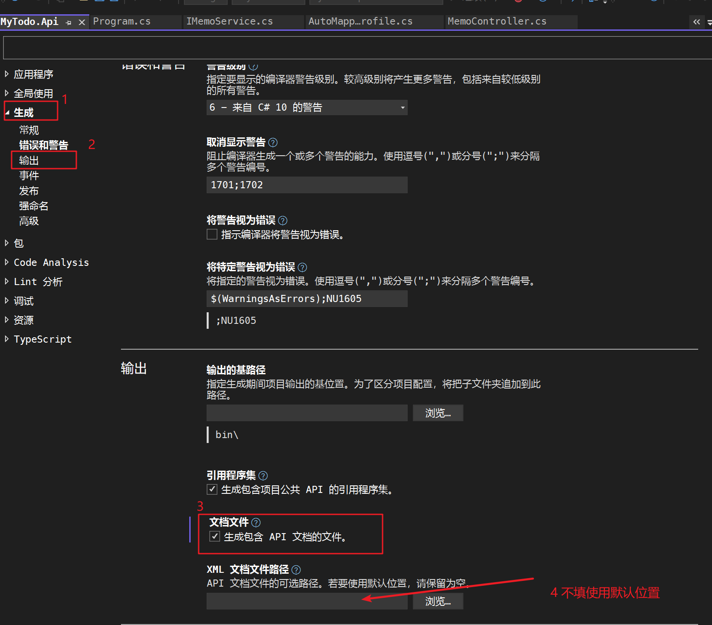
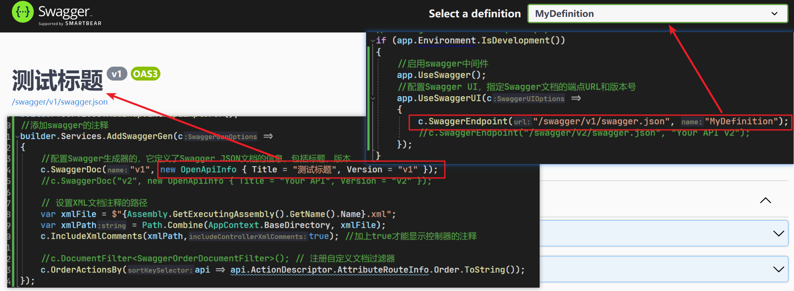

## 1、数据库环境初始化

### 1）实体类

Entities文件夹下添加实体类：

父类

```C#
using Microsoft.EntityFrameworkCore;
using System.ComponentModel.DataAnnotations.Schema;
using System.ComponentModel.DataAnnotations;

namespace MyTodo.Api.Entities
{
    public class BaseEntity
    {
        //设置自增主键
        [Key]
        [DatabaseGenerated(DatabaseGeneratedOption.Identity)]
        [Comment("主键")]
        public int Id { get; set; }
        [Comment("创建时间")]
        public DateTime CreateTime { get; set; }
        [Comment("更新时间")]
        public DateTime UpdateTime { get; set; }

    }
}
```

备忘录Memo

```C#
using System.ComponentModel.DataAnnotations.Schema;
using System.ComponentModel.DataAnnotations;
using Microsoft.EntityFrameworkCore;

namespace MyTodo.Api.Entities
{
    [Table("T_Memo")]
    public class Memo : BaseEntity
    {
      
        [Comment("标题"),Required]
        public string Title { get; set; }
        [Comment("内容"), Required]
        public string Content { get; set; }

    }
}
```

待办Todo

```C#
using System.ComponentModel.DataAnnotations;
using System.ComponentModel.DataAnnotations.Schema;

namespace MyTodo.Api.Entities
{
    [Table("T_Todo")]
    public class Todo : BaseEntity
    {
        public string Title { get; set; }
        public string Content { get; set; }
        public string Status { get; set; }
    }
}
```

用户User

```C#
using Microsoft.EntityFrameworkCore;
using System.ComponentModel.DataAnnotations.Schema;
using System.ComponentModel.DataAnnotations;

namespace MyTodo.Api.Entities
{
    [Table("T_User")]
    public class User : BaseEntity
    {
        [Comment("标题"), Required]
        public string Account { get; set; }
        public string UserName { get; set; }

        [Comment("内容"), Required]
        public string Password { get; set; }

    }
}
```

### 2）配置数据库

项目中添加EFcore相关依赖包

```bash
NuGet\Install-Package Microsoft.EntityFrameworkCore -Version 6.0.0
NuGet\Install-Package Microsoft.EntityFrameworkCore.Relational -Version 6.0.0
NuGet\Install-Package Microsoft.EntityFrameworkCore.Design -Version 6.0.0
NuGet\Install-Package Microsoft.EntityFrameworkCore.Tools -Version 6.0.0

NuGet\Install-Package Microsoft.EntityFrameworkCore.SqlServer -Version 6.0.0
```

appsettings中增加数据库连接字符串

```json
{
  "ConnectionStrings": {
    "TodoConn": "Server=localhost;Database=test;User Id=sa;Password=root;"

  },
  "Logging": {
    "LogLevel": {
      "Default": "Information",
      "Microsoft.AspNetCore": "Warning"
    }
  },
  "AllowedHosts": "*"
}
```

新建一个DefaultDbContext作为数据库上下文

```C#
using System.Data.Common;
using Microsoft.EntityFrameworkCore;
using Microsoft.Extensions.Configuration;
using MyTodo.Api.Entities;

namespace MyTodo.Api.Contexts
{
    public class MyTodoContext : DbContext
    {
        public DbSet<User> Users { get; set; }
        public DbSet<Memo> Memos { get; set; }
        public DbSet<Todo> Todos { get; set; }

        protected override void OnConfiguring(DbContextOptionsBuilder optionsBuilder)
        {
            //var connectionString = _configuration.GetConnectionString("TodoConn");

            //optionsBuilder.UseSqlServer(connectionString);
            ////对数据库连接字符串
            //optionsBuilder.UseSqlServer("Server=localhost;Database=test;User Id=sa;Password=root;");
        }
        protected override void OnModelCreating(ModelBuilder modelBuilder)
        {
            base.OnModelCreating(modelBuilder);
        }

        public MyTodoContext(DbContextOptions<MyTodoContext> options) : base(options)
        {
            
        }
    }
}
```

当数据库连接字符串需要动态变化时在OnConfiguring中进行配置，初始化的数据库连接配置在program文件中依赖注入MyTodoContext时使用重写的构造函数`public MyTodoContext(DbContextOptions<MyTodoContext> options) : base(options)`

进行配置，所以program.cs中注入生命周期为Scoped的上下文实例

```C#
// 读取 appsettings.json 配置文件
builder.Configuration.AddJsonFile("appsettings.json", optional: false, reloadOnChange: true);

// 获取连接字符串
builder.Services.AddDbContext<MyTodoContext>(options =>
{
    var todoConnString = builder.Configuration.GetConnectionString("TodoConn");
    options.UseSqlServer(todoConnString);
    //options.UseSqlServer(builder.Configuration["ConnectionStrings:TodoConn"]);
},ServiceLifetime.Scoped);

```

运行数据迁移指令，在数据库生成对应的表

```bash
Add-Migration add_table_student
预览确认生成无误后 更新数据库表
update-database
```

## 2、添加UnitOfWork

如果想在多个仓储之间共享context，需要用到UnitOfWork，拷贝项目后将UnitOfWork文件夹拖入webapi项目中

```bash
git clone https://github.com/arch/UnitOfWork.git
```

安装UnitOfWork相关的依赖包

```bash
NuGet\Install-Package Microsoft.EntityFrameworkCore.AutoHistory -Version 6.0.0
```

建一个Repository文件夹，放入需要共享一个context的所有repository，并继承`UnitOfWork`的`Repository<T>`，实现`IRepository<T>`接口

MemoRepository

```C#
using Arch.EntityFrameworkCore.UnitOfWork;
using Microsoft.EntityFrameworkCore;
using MyTodo.Api.Contexts;
using MyTodo.Api.Entities;

namespace MyTodo.Api.Repository
{
    public class MemoRepository : Repository<Memo>, IRepository<Memo>
    {
        public MemoRepository(MyTodoContext dbContext) : base(dbContext)
        {
        }
    }
}
```

TodoRepository

```C#
using Arch.EntityFrameworkCore.UnitOfWork;
using Microsoft.EntityFrameworkCore;
using MyTodo.Api.Contexts;
using MyTodo.Api.Entities;

namespace MyTodo.Api.Repository
{
    /// <summary>
    /// 
    /// </summary>
    public class TodoRepository : Repository<Todo>, IRepository<Todo>
    {
        public TodoRepository(MyTodoContext dbContext) : base(dbContext)
        {
        }
    }
}
```

UserRepository

```C#
using Arch.EntityFrameworkCore.UnitOfWork;
using Microsoft.EntityFrameworkCore;
using MyTodo.Api.Contexts;
using MyTodo.Api.Entities;

namespace MyTodo.Api.Repository
{
    /// <summary>
    /// 
    /// </summary>
    public class UserRepository : Repository<User>, IRepository<User>
    {
        public UserRepository(MyTodoContext dbContext) : base(dbContext)
        {
        }
    }
}
```

program中注入repository

```C#
// 获取连接字符串
builder.Services.AddDbContext<MyTodoContext>(options =>
{
    var todoConnString = builder.Configuration.GetConnectionString("TodoConn");
    options.UseSqlServer(todoConnString);
    //options.UseSqlServer(builder.Configuration["ConnectionStrings:TodoConn"]);
},ServiceLifetime.Scoped)
    //注入AddUnitOfWork
    .AddUnitOfWork<MyTodoContext>()
    .AddCustomRepository<Todo,TodoRepository>()
    .AddCustomRepository<Memo, MemoRepository>()
    .AddCustomRepository<User, UserRepository>()
    ;

```

## 3、TodoController

### 1）Service文件夹

添加响应的返回值类

```C#
namespace MyTodo.Api.Services
{
    public class ApiResponse
    {
        public ApiResponse(string message, bool isSuccess, object result)
        {
            Message = message;
            IsSuccess = isSuccess;
            Result = result;
        }

        public ApiResponse(string message, bool isSuccess)
        {
            Message = message;
            IsSuccess = isSuccess;
        }

        public ApiResponse(bool isSuccess, object result)
        {
            IsSuccess = isSuccess;
            Result = result;
        }

        /// <summary>
        /// 接口返回信息
        /// </summary>
        public string Message { get; set; }
        /// <summary>
        /// 接口返回是否成功
        /// </summary>
        public bool IsSuccess { get; set; }
        /// <summary>
        /// 返回结果
        /// </summary>
        public object Result { get; set; }
    }
}
```

IBaseService是所有service的父类

```C#
namespace MyTodo.Api.Services
{
    public interface IBaseService<T>
    {
        Task<ApiResponse> GetAllAsync();
        Task<ApiResponse> GetByIdAsync(int id);
        Task<ApiResponse> AddAsync(T model);
        Task<ApiResponse> UpdateAsync(T model);
        Task<ApiResponse> DeleteAsync(int id);
    }
}

```

ITodoService继承IBaseService接口

```C#
using MyTodo.Api.Entities;

namespace MyTodo.Api.Services
{
    public interface ITodoService : IBaseService<Todo>
    {
    }
}
```

TodoService实现ITodoService接口，实现具体的增删改查操作

```C#
using System.Collections.Generic;
using Arch.EntityFrameworkCore.UnitOfWork;
using MyTodo.Api.Entities;

namespace MyTodo.Api.Services
{
    /// <summary>
    /// 待办事项实现
    /// </summary>
    public class TodoService : ITodoService
    {
        private readonly IUnitOfWork _work;
        private IRepository<Todo> _repository;

        public TodoService(IUnitOfWork unitOfWork)
        {
            _work = unitOfWork;
            _repository = _work.GetRepository<Todo>();
        }

        public async Task<ApiResponse> GetAllAsync()
        {
            try
            {
                var todos = await _repository.GetAllAsync();
                return new ApiResponse("获取数据成功", true, todos);
            }
            catch (Exception ex)
            {
                return new ApiResponse(false, ex.Message);
            }
        }

        public async Task<ApiResponse> GetByIdAsync(int id)
        {
            try
            {
                var todo = await _repository.GetFirstOrDefaultAsync(predicate: x => x.Id.Equals(id));

                return todo == null ?
                    new ApiResponse($"{id}不存在", false) :
                    new ApiResponse("获取数据成功", true, todo);
            }
            catch (Exception ex)
            {
                return new ApiResponse(false, ex.Message);
            }
        }

        public async Task<ApiResponse> AddAsync(Todo model)
        {
            try
            {
                await _repository.InsertAsync(model);
                if (await _work.SaveChangesAsync() > 0)

                    return new ApiResponse("添加数据成功", true, model);
                else
                    return new ApiResponse("添加数据失败", false);
            }
            catch (Exception ex)
            {
                return new ApiResponse(false, ex.Message);
            }
        }

        public async Task<ApiResponse> UpdateAsync(Todo model)
        {
            try
            {
                var todo = _repository.GetFirstOrDefault(predicate: x => x.Id.Equals(model.Id));
                todo.Title = model.Title;
                todo.Content = model.Content;
                todo.Status = model.Status;
                todo.UpdateTime = DateTime.Now;
                _repository.Update(todo);
                if (await _work.SaveChangesAsync() > 0)
                    return new ApiResponse("更新数据成功", true,todo);
                else
                    return new ApiResponse("更新数据失败", false);
            }
            catch (Exception ex)
            {
                return new ApiResponse(false, ex.Message);
            }
        }

        public async Task<ApiResponse> DeleteAsync(int id)
        {
            try
            {
                var todo = _repository.GetFirstOrDefault(predicate: x => x.Id.Equals(id));
                _repository.Delete(todo);
                if (await _work.SaveChangesAsync() > 0)

                    return new ApiResponse("删除数据成功", true);
                else
                    return new ApiResponse("删除数据失败", false);
            }
            catch (Exception ex)
            {
                return new ApiResponse(false, ex.Message);
            }
        }
    }
}
```

### 2）Dto中间实体

创建中间实体的父类BaseDto，实现INotifyPropertyChanged接口，让继承BaseDto的派生类各个属性变化被监听到

```C#
using System;
using System.Collections.Generic;
using System.ComponentModel;
using System.Linq;
using System.Runtime.CompilerServices;
using System.Text;
using System.Threading.Tasks;

namespace MyTodo.Shared.Dtos
{
    public class BaseDto : INotifyPropertyChanged
    {
        public int Id { get; set; }
        public event PropertyChangedEventHandler? PropertyChanged;
        /// <summary>
        /// 实现通知更新
        /// </summary>
        /// <param name="propertyName"></param>
        protected virtual void OnPropertyChanged([CallerMemberName] string? propertyName = null)
        {
            PropertyChanged?.Invoke(this, new PropertyChangedEventArgs(propertyName));
        }

        protected bool SetField<T>(ref T field, T value, [CallerMemberName] string? propertyName = null)
        {
            if (EqualityComparer<T>.Default.Equals(field, value)) return false;
            field = value;
            OnPropertyChanged(propertyName);
            return true;
        }
    }
}

```

TodoDto中间实体：将数据库实体与接口实体分离开，这里只保留接口需要的属性

```C#
using System;
using System.Collections.Generic;
using System.ComponentModel;
using System.Linq;
using System.Text;
using System.Threading.Tasks;

namespace MyTodo.Shared.Dtos
{
    /// <summary>
    /// 待办事项Dto
    /// </summary>
    public class TodoDto : BaseDto
    {
        private string title;
        private string content;
        private int status;

        public string Title
        {
            get { return title; }
            set
            {
                title = value;
                OnPropertyChanged();
            }
        }

        public string Content
        {
            get { return content; }
            set
            {
                content = value;
                OnPropertyChanged();
            }
        }

        public int Status
        {
            get { return status; }
            set
            {
                status = value;
                OnPropertyChanged();
            }
        }
    }
}
```

### 3）分页

分页查询参数

```C#
using System;
using System.Collections.Generic;
using System.Linq;
using System.Text;
using System.Threading.Tasks;

namespace MyTodo.Shared.Parameters
{
    /// <summary>
    /// 备忘录查询接口请求参数
    /// </summary>
    public class MemoQueryInput : Pagination
    {
        public string? Search { get; set; }
    }
    public class QueryParameter
    {
        public int PageIndex { get; set; } = 0;
        public int PageSize { get; set; } = 10;
        public string? Search { get; set; }
    }
}

```

修改IBaseService中的GetAllAsync的定义

```C#
using MyTodo.Shared.Parameters;

namespace MyTodo.Api.Services
{
    public interface IBaseService<T>
    {
        Task<ApiResponse> GetAllAsync(QueryParameter query);
        Task<ApiResponse> GetByIdAsync(int id);
        Task<ApiResponse> AddAsync(T model);
        Task<ApiResponse> UpdateAsync(T model);
        Task<ApiResponse> DeleteAsync(int id);
    }
}

```

修改Service中的GetAllAsync方法

```C#
        public async Task<ApiResponse> GetAllAsync(QueryParameter query)
        {
            try
            {
                var todos = await _repository.GetPagedListAsync(predicate: x => string.IsNullOrWhiteSpace(query.Search) ? true : x.Title.Equals(query.Search),
                    pageIndex: query.PageIndex,
                    pageSize: query.PageSize,
                    orderBy: x => x.OrderByDescending(t => t.CreateTime)
                );
                return new ApiResponse("获取数据成功", true, todos);
            }
            catch (Exception ex)
            {
                return new ApiResponse(false, ex.Message);
            }
        }
```

修改Controller中的GetAll

```C#
/// <summary>
/// 获取所有备忘录实例
/// </summary>
/// <returns></returns>
[HttpGet("GetAll")]

public async Task<ApiResponse> GetAll([FromQuery] QueryParameter query) => await _memoService.GetAllAsync(query);
```

### 4）AutoMapper

安装AutoMapper，用于TodoDto到Todo实体的映射

```bash
NuGet\Install-Package AutoMapper -Version 13.0.1
```

并新建Extensions文件夹处理所有新增的依赖拓展，在其中新建AutoMapperProfile类用于配置映射关系，继承AutoMapper的Profile类，构造函数中初始化源对象Todo到目标对象TodoDto的映射

```C#
using AutoMapper;
using MyTodo.Api.Entities;
using MyTodo.Shared.Dtos;

namespace MyTodo.Api.Extensions
{
    /// <summary>
    /// 映射配置
    /// </summary>
    public class AutoMapperProfile : Profile
    {
        public AutoMapperProfile()
        {
            //定义了源对象Todo到目标对象TodoDto的映射
            CreateMap<TodoDto, Todo>().ReverseMap();
        }
    }
}
```

program中添加AutoMapper的服务依赖

```C#
//配置添加automapper
var autoMapperConfig = new MapperConfiguration(config =>
{
    config.AddProfile(new AutoMapperProfile());
});
builder.Services.AddSingleton(autoMapperConfig.CreateMapper());
```

使用AutoMapper优化TodoService的Add和Update方法

```C#
using System.Collections.Generic;
using Arch.EntityFrameworkCore.UnitOfWork;
using AutoMapper;
using MyTodo.Api.Entities;
using MyTodo.Shared.Dtos;

namespace MyTodo.Api.Services
{
    /// <summary>
    /// 待办事项实现
    /// </summary>
    public class TodoService : ITodoService
    {
        private readonly IUnitOfWork _work;
        private readonly IMapper _mapper;
        private IRepository<Todo> _repository;

        public TodoService(IUnitOfWork unitOfWork, IMapper mapper)
        {
            _work = unitOfWork;
            _mapper = mapper;
            _repository = _work.GetRepository<Todo>();
        }

       ...
        public async Task<ApiResponse> AddAsync(TodoDto model)
        {
            try
            {
                var todo = _mapper.Map<Todo>(model);
                await _repository.InsertAsync(todo);
                if (await _work.SaveChangesAsync() > 0)

                    return new ApiResponse("添加数据成功", true, model);
                else
                    return new ApiResponse("添加数据失败", false);
            }
            catch (Exception ex)
            {
                return new ApiResponse(false, ex.Message);
            }
        }

        
        public async Task<ApiResponse> UpdateAsync(TodoDto model)
        {
            try
            {
                var newTodo = _mapper.Map<Todo>(model);
                var todo = _repository.GetFirstOrDefault(predicate: x => x.Id.Equals(newTodo.Id));
                //todo.Title = model.Title;
                //todo.Content = model.Content;
                //todo.Status = model.Status;
                newTodo.UpdateTime = DateTime.Now;
                newTodo.Id = todo.Id; //将原todo的Id给新的
                _repository.Update(newTodo);
                if (await _work.SaveChangesAsync() > 0)
                    return new ApiResponse("更新数据成功", true, newTodo);
                else
                    return new ApiResponse("更新数据失败", false);
            }
            catch (Exception ex)
            {
                return new ApiResponse(false, ex.Message);
            }
        }
       ...
    }
}
```

### 5） Newtonsoft.Json

在.NET 6中，ASP.NET Core已经从Newtonsoft.Json更改为System.Text.Json作为默认的JSON序列化程序。然而，Swagger仍然使用Newtonsoft.Json来处理注释中的JSON数据。将此依赖包添加到项目中，并使用`AddNewtonsoftJson`方法将其配置为JSON序列化程序，可以确保Swagger正确处理控制器和方法中的注释中的JSON数据。

```json
NuGet\Install-Package Newtonsoft.Json -Version 13.0.3
NuGet\Install-Package Swashbuckle.AspNetCore.Annotations -Version 6.6.2
```

安装后需要配置xml生成路径



```C#
//添加swagger的注释 
builder.Services.AddSwaggerGen(c =>
{
    c.SwaggerDoc("test", new OpenApiInfo { Title = "test标题", Version = "v2" });
    //配置Swagger生成器：Swagger JSON文件的名称：v1，包括标题、版本
    c.SwaggerDoc("todo", new OpenApiInfo { Title = "Todo标题", Version = "v1" });
    

    // 设置XML文档注释的路径
    var xmlFile = $"{Assembly.GetExecutingAssembly().GetName().Name}.xml";
    var xmlPath = Path.Combine(AppContext.BaseDirectory, xmlFile);
    c.IncludeXmlComments(xmlPath,true); //加上true才能显示控制器的注释

    //Route Order
    c.OrderActionsBy((apiDesc) =>
    {
        //{apiDesc.ActionDescriptor.RouteValues["controller"]} Controller名字 Memo
        //{apiDesc.HttpMethod} 请求类型 GET
        //{apiDesc.RelativePath 请求类型 api/Memo/Get
        var x = $"{apiDesc.GroupName}_{apiDesc.ActionDescriptor.AttributeRouteInfo?.Order.ToString()}";
        Console.WriteLine($"Controller:{ apiDesc.ActionDescriptor.RouteValues["controller"]} x:{x}");
        return x;
    });
});

// Configure the HTTP request pipeline.
if (app.Environment.IsDevelopment())
{
    //启用swagger中间件
    app.UseSwagger();
    //配置Swagger UI，指定Swagger文档的端点URL和版本号
    app.UseSwaggerUI(c =>
    {
        //todo指定了第一个文档Json文件的名称为todo/swagger.json、"Todo分组"就是UI中显示的分组名称
        c.SwaggerEndpoint("/swagger/todo/swagger.json", "Todo分组");

        c.SwaggerEndpoint("/swagger/test/swagger.json", "分组测试");

    });
}
```

配置分组和标题后的效果



在Controller中配置分组，以及方法的排序规则

TestController

```C#
using Microsoft.AspNetCore.Mvc;
using MyTodo.Api.Extensions;
using Swashbuckle.AspNetCore.Annotations;

namespace MyTodo.Api.Controllers
{
    [ApiController]
    [Route("api/[controller]", Name = "TestControllerOrder", Order = 2)]
    [ApiExplorerSettings(GroupName = "test")]
    public class TestController : ControllerBase
    {
        [HttpPost("about")]
        public IActionResult About()
        {
            return Ok("About");
        }

        [HttpGet("index")]
        public IActionResult Index()
        {
            return Ok("Index");
        }
    }

    [ApiController]
    [Route("api/[controller]" ,Name = "TestControllerOrder", Order = 1)]

    [ApiExplorerSettings(GroupName = "test")]

    public class AccountController : ControllerBase
    {
        [HttpGet("about")]

        public IActionResult About()
        {
            return Ok("About");
        }


        [HttpGet("index")]

        public IActionResult Index()
        {
            return Ok("Index");
        }

        [HttpGet("login")]
        public IActionResult Login()
        {
            return Ok("Login");
        }
    }
}
```

更多详见：https://learn.microsoft.com/zh-cn/aspnet/core/tutorials/getting-started-with-swashbuckle?view=aspnetcore-8.0&tabs=visual-studio

### 6）TodoController

```C#
using System.Text.Json.Serialization;
using System.Xml.Linq;
using AutoMapper;
using Microsoft.AspNetCore.Mvc;
using MyTodo.Api.Extensions;
using MyTodo.Api.Services;
using MyTodo.Shared.Dtos;
using Swashbuckle.AspNetCore.Annotations;

namespace MyTodo.Api.Controllers
{
    /// <summary>
    /// 待办事项控制器
    /// </summary>
    [ApiController]
    [Route("api/[controller]", Order = 1)] //配合program中的OrderActionsBy对方法显示排序
    [ApiExplorerSettings(GroupName = "todo")]
    public class TodoController : ControllerBase
    {
        private readonly ITodoService _todoService;

        public TodoController(ITodoService todoService, IMapper mapper)
        {
            _todoService = todoService;
        }
        /// <summary>
        /// 根据Id获取待办实例
        /// </summary>
        /// <param name="id"></param>
        /// <returns></returns>
        [HttpGet("Get")]
        public async Task<ApiResponse> Get(int id) => await _todoService.GetByIdAsync(id);
        /// <summary>
        /// 获取所有待办实例
        /// </summary>
        /// <returns></returns>
        [HttpGet("GetAll")]
        public async Task<ApiResponse> GetAll() => await _todoService.GetAllAsync();
        /// <summary>
        /// 添加待办
        /// </summary>
        /// <param name="model"></param>
        /// <returns></returns>
        [HttpPost("Add")]
        public async Task<ApiResponse> Add(TodoDto model) => await _todoService.AddAsync(model);
        /// <summary>
        /// 更新待办
        /// </summary>
        /// <param name="model"></param>
        /// <returns></returns>
        [HttpPost("Update")]
        public async Task<ApiResponse> Update (TodoDto model) => await _todoService.UpdateAsync(model);
        /// <summary>
        /// 根据Id删除待办
        /// </summary>
        /// <param name="id"></param>
        /// <returns></returns>
        [HttpDelete("Delete")]
        public async Task<ApiResponse> Delete(int id) => await _todoService.DeleteAsync(id);
    }
}
```

## 4、MemoController

### 1）MemoDto

```C#
using System;
using System.Collections.Generic;
using System.ComponentModel;
using System.Linq;
using System.Text;
using System.Threading.Tasks;

namespace MyTodo.Shared.Dtos
{
    /// <summary>
    /// 待办事项Dto
    /// </summary>
    public class MemoDto : BaseDto
    {
        private string title;
        private string content;

        public string Title
        {
            get { return title; }
            set
            {
                title = value;
                OnPropertyChanged();
            }
        }

        public string Content
        {
            get { return content; }
            set
            {
                content = value;
                OnPropertyChanged();
            }
        }
    }
}
```

### 2）MemoService

IMemoService

```C#
using MyTodo.Api.Entities;
using MyTodo.Shared.Dtos;

namespace MyTodo.Api.Services
{
    public interface IMemoService : IBaseService<MemoDto>
    {
    }
}
```

MemoService

```C#
using System.Collections.Generic;
using Arch.EntityFrameworkCore.UnitOfWork;
using AutoMapper;
using MyTodo.Api.Entities;
using MyTodo.Shared.Dtos;
using MyTodo.Shared.Parameters;

namespace MyTodo.Api.Services
{
    /// <summary>
    /// 待办事项实现
    /// </summary>
    public class MemoService : IMemoService
    {
        private readonly IUnitOfWork _work;
        private readonly IMapper _mapper;
        private IRepository<Memo> _repository;


        public MemoService(IUnitOfWork unitOfWork, IMapper mapper)
        {
            _work = unitOfWork;
            _mapper = mapper;
            _repository = _work.GetRepository<Memo>();
        }

        public async Task<ApiResponse> GetAllAsync(QueryParameter parameter)
        {
            try
            {
                var todos = await _repository.GetPagedListAsync(predicate:
                    x => string.IsNullOrWhiteSpace(parameter.Search) ? true : x.Title.Contains(parameter.Search),
                    pageIndex: parameter.PageIndex,
                    pageSize: parameter.PageSize,
                    orderBy: source => source.OrderByDescending(t => t.CreateTime));
                return new ApiResponse(true, todos);
            }
            catch (Exception ex)
            {
                return new ApiResponse(false, ex.Message);
            }
        }


        public async Task<ApiResponse> GetByIdAsync(int id)
        {
            try
            {
                var memo = await _repository.GetFirstOrDefaultAsync(predicate: x => x.Id.Equals(id));

                return memo == null ?
                    new ApiResponse($"{id}不存在", false) :
                    new ApiResponse("获取数据成功", true, memo);
            }
            catch (Exception ex)
            {
                return new ApiResponse(false, ex.Message);
            }
        }

        public async Task<ApiResponse> AddAsync(MemoDto model)
        {
            try
            {
                var memo = _mapper.Map<Memo>(model);
                await _repository.InsertAsync(memo);
                if (await _work.SaveChangesAsync() > 0)

                    return new ApiResponse("添加数据成功", true, model);
                else
                    return new ApiResponse("添加数据失败", false);
            }
            catch (Exception ex)
            {
                return new ApiResponse(false, ex.Message);
            }
        }

        public async Task<ApiResponse> UpdateAsync(MemoDto model)
        {
            try
            {
                var newMemo = _mapper.Map<Memo>(model);
                var memo = _repository.GetFirstOrDefault(predicate: x => x.Id.Equals(newMemo.Id));
                newMemo.UpdateTime = DateTime.Now;
                newMemo.Id = memo.Id;
                _repository.Update(newMemo);
                if (await _work.SaveChangesAsync() > 0)
                    return new ApiResponse("更新数据成功", true, newMemo);
                else
                    return new ApiResponse("更新数据失败", false);
            }
            catch (Exception ex)
            {
                return new ApiResponse(false, ex.Message);
            }
        }

        public async Task<ApiResponse> DeleteAsync(int id)
        {
            try
            {
                var memo = _repository.GetFirstOrDefault(predicate: x => x.Id.Equals(id));
                _repository.Delete(memo);
                if (await _work.SaveChangesAsync() > 0)

                    return new ApiResponse("删除数据成功", true);
                else
                    return new ApiResponse("删除数据失败", false);
            }
            catch (Exception ex)
            {
                return new ApiResponse(false, ex.Message);
            }
        }
    }
}

```

3）配置AutoMapper、program.cs

```C#
using AutoMapper;
using MyTodo.Api.Entities;
using MyTodo.Shared.Dtos;

namespace MyTodo.Api.Extensions
{
    /// <summary>
    /// 映射配置
    /// </summary>
    public class AutoMapperProfile : Profile
    {
        public AutoMapperProfile()
        {
            //定义了源对象Todo到目标对象TodoDto的映射
            CreateMap<TodoDto, Todo>().ReverseMap();
            CreateMap<MemoDto, Memo>().ReverseMap();
        }
    }
}
```

program.cs

```C#
// 添加service实例的依赖注入
builder.Services.AddScoped<ITodoService, TodoService>();
builder.Services.AddScoped<IMemoService, MemoService>();
```

### 3）MemoController

```C#
using AutoMapper;
using Microsoft.AspNetCore.Mvc;
using MyTodo.Api.Extensions;
using MyTodo.Api.Services;
using MyTodo.Shared.Dtos;

namespace MyTodo.Api.Controllers
{
    /// <summary>
    /// 备忘录控制器
    /// </summary>
    [ApiController]
    [Route("api/[controller]",Order = 5)]
    [ApiExplorerSettings(GroupName = "todo")]
    public class MemoController : ControllerBase
    {
        private readonly IMemoService _memoService;

        public MemoController(IMemoService memoService)
        {
            _memoService = memoService;
        }

        /// <summary>
        /// 根据Id获取备忘录实例
        /// </summary>
        /// <param name="id"></param>
        /// <returns></returns>
        [HttpGet("Get")]
        public async Task<ApiResponse> Get(int id) => await _memoService.GetByIdAsync(id);

        /// <summary>
        /// 获取所有备忘录实例
        /// </summary>
        /// <returns></returns>
        [HttpGet("GetAll")]

        public async Task<ApiResponse> GetAll() => await _memoService.GetAllAsync();

        /// <summary>
        /// 添加备忘录
        /// </summary>
        /// <param name="model"></param>
        /// <returns></returns>
        [HttpPost("Add")]

        public async Task<ApiResponse> Add(MemoDto model) => await _memoService.AddAsync(model);

        /// <summary>
        /// 更新备忘录
        /// </summary>
        /// <param name="model"></param>
        /// <returns></returns>
        [HttpPost("Update")]

        public async Task<ApiResponse> Update(MemoDto model) => await _memoService.UpdateAsync(model);

        /// <summary>
        /// 根据Id删除备忘录
        /// </summary>
        /// <param name="id"></param>
        /// <returns></returns>
        [HttpDelete("Delete")]

        public async Task<ApiResponse> Delete(int id) => await _memoService.DeleteAsync(id);
    }
}

```

