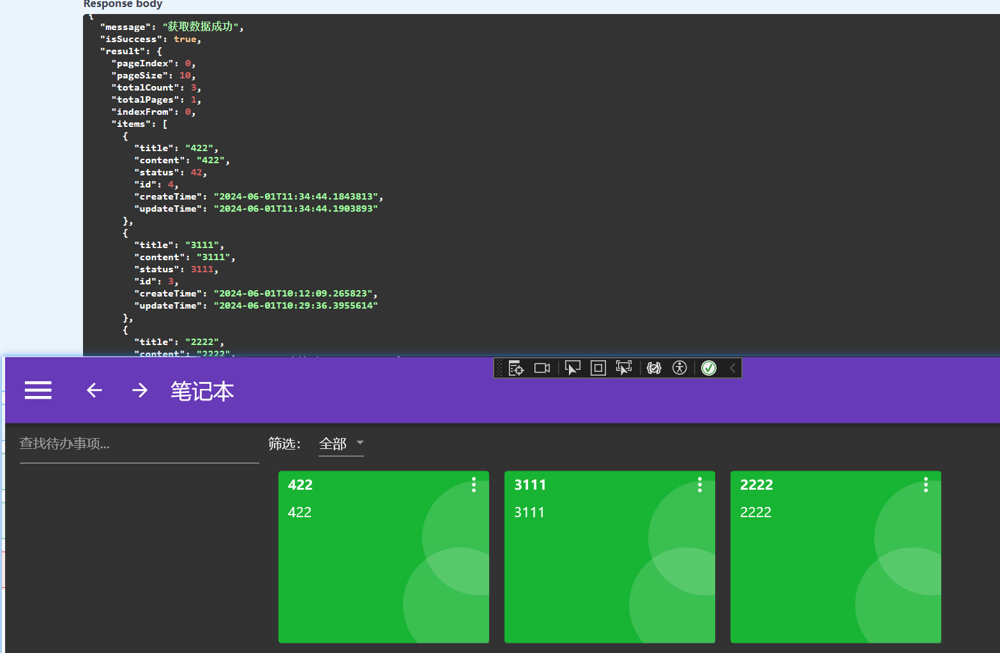

## 1、让WPF发起Http请求

### 1）RestSharp简介

在完成webapi代码后，使用apipost可以测试接口，点击生成代码可以看到apipost是如何发起请求的：


对于C#来说，有两种方式可以发起http请求：HttpClient和RestSharp，二者的区别如下：

RestSharp:

- RestSharp 是一个用于 .NET 的轻量级 REST 客户端库。它可以很方便地发起 REST 请求,摒弃了许多 HTTP 细节,让开发变得简单明了。
- 使用 RestSharp 时,我们只需定义一个请求对象,然后执行它。RestSharp 会自动处理请求参数的序列化和响应的反序列化。
- 它还内置了JSON和XML格式的支持,状态码检查,认证机制等实用功能。

HttpClient:

- HttpClient 是 .NET 中微软推荐的通用 HTTP 客户端库。它提供了灵活的同步和异步 HTTP 请求接口。
- 相比 RestSharp,HttpClient 并没有那么多封装,我们需要自己构建请求并处理响应等Details。但它本身更轻量级。
- 关键优点包括支持同步和异步调用、请求对象可以复用、自动处理HTTP消息等。

总的来说:

- RestSharp 对常见的CRUD请求更友好简单
- HttpClient 给了我们更多控制能力,但代码复杂度也相对更高

### 2）构造通用的HttpRestClient执行方法

添加RestSharp依赖包

```bash
NuGet\Install-Package RestSharp -Version 111.2.0
```

RestSharp的使用文档：https://restsharp.dev/docs/usage/

Service文件夹下添加HttpRestClient类

```C#
using System;
using System.Collections.Generic;
using System.Linq;
using System.Text;
using System.Threading.Tasks;
using MyTodo.Shared;
using Newtonsoft.Json;
using RestSharp;

namespace MyTodo.Service
{
    public class HttpRestClient
    {
        private readonly string _apiUrl;
        private readonly RestClient _client;
        public HttpRestClient(string apiUrl)
        {
            _apiUrl = apiUrl; //依赖注入apiUrl= http://localhost:7147/
            //使用_apiUrl构造RestClient实例
            _client = new RestClient(new RestClientOptions(_apiUrl)) ;
        }
        /// <summary>
        /// 非泛型执行请求
        /// </summary>
        /// <param name="baseRequest"></param>
        /// <returns></returns>
        public async Task<ApiResponse> ExecuteAsync(BaseRequest baseRequest)
        {
            //初始化请求，标记请求类型
            var request = new RestRequest(baseRequest.Route,baseRequest.Method);
            //添加请求头
            request.AddHeader("Content-Type", baseRequest.ContentType);
            if (baseRequest.Parameter != null)
            {
                //添加请求参数
                request.AddParameter("param", JsonConvert.SerializeObject(baseRequest.Parameter), ParameterType.RequestBody);
            }
            //获取请求返回值
            var response = await _client.ExecuteAsync(request);
            var res = JsonConvert.DeserializeObject<ApiResponse>(response.Content);
            return res;
        }
        public async Task<ApiResponse<T>> ExecuteAsync<T>(BaseRequest baseRequest)
        {
            //初始化请求的方法名，标记请求类型
            var request = new RestRequest(baseRequest.Route, baseRequest.Method);
            //添加请求头
            request.AddHeader("Content-Type", baseRequest.ContentType);
            if (baseRequest.Parameter != null)
            {
                //添加请求参数
                request.AddParameter("param", JsonConvert.SerializeObject(baseRequest.Parameter), ParameterType.RequestBody);
            }
            //获取请求返回值
            var response = await _client.ExecuteAsync(request);
            if (response.StatusCode == System.Net.HttpStatusCode.OK)
            {
                var res = JsonConvert.DeserializeObject<ApiResponse<T>>(response.Content);
                return res;
            }
            else
            {
                return new ApiResponse<T>()
                {
                    IsSuccess = false,
                    Message = response.ErrorMessage
                };
            }
        }
    }
}
```

这里的构造函数使用到了_apiUrl，需要在app.xaml.cs中进行注入

```C#
using System.Configuration;
using System.Data;
using System.Windows;
using System.Windows.Controls;
using DryIoc;
using MyTodo.Service;
using MyTodo.ViewModels;
using MyTodo.Views;
using Prism.DryIoc;
using Prism.Ioc;
using RestSharp;

namespace MyTodo
{
    /// <summary>
    /// Interaction logic for App.xaml
    /// </summary>
    public partial class App : PrismApplication
    {
        protected override void RegisterTypes(IContainerRegistry containerRegistry)
        {
            //注册主页的导航页面(导航页面不依赖服务,所以不需要直接操作容器实例)
            containerRegistry.RegisterForNavigation<IndexView,IndexViewModel>();
            containerRegistry.RegisterForNavigation<MemoView, MemoViewModel>();
            containerRegistry.RegisterForNavigation<SettingsView, SettingsViewModel>();
            containerRegistry.RegisterForNavigation<TodoView, TodoViewModel>();
            //注册设置页的导航页面
            containerRegistry.RegisterForNavigation<SkinView, SkinViewModel>();
            containerRegistry.RegisterForNavigation<AboutView, AboutViewModel>();

            //https://localhost:7147/swagger/index.html
            //获取容器注册器实例
            var container = containerRegistry.GetContainer();
            //注册"webUrl"这个服务标识对应的实例
            container.RegisterInstance(@"https://localhost:7147/", serviceKey: "webUrl");
            //然后注册依赖这个实例的HttpRestClient服务
            container.Register<HttpRestClient>(made: Parameters.Of.Type<string>(serviceKey: "webUrl"));
        }

        protected override Window CreateShell()
        {
            return Container.Resolve<MainView>();
        }
    }
}

```

需要注意的是注入的时候不能像导航页面一样直接注入，要先获取到容器实例`container`，再将`ip:port`部分标记为serviceKey="webUrl"的值，最后注册依赖webUrl实例的HttpRestClient服务。

> 服务标识(Service Key)是一个很重要的概念,它在.NET Core依赖注入容器中的作用如下:
>
> - 服务标识是唯一识别一个注册服务的字符串。
> - 当向容器注册服务时,我们需要指定一个标识。例如上面代码注册"webUrl"字符串实例就是指定了"webUrl"作为标识。
> - 其他服务如果需要使用这个服务,就需要通过相同的标识来解决依赖。
> - 举个简单的例子,如果我们有一个UserService依赖一个数据库服务,在注册时可能是:
>
> ```C#
> services.AddTransient<UserService>();
> services.AddScoped<IDatabase, SqlDatabase>("database");
> ```
>
> 这里IDatabase实现指定了"database"作为标识。
>
> UserService在构造函数中注入时就可以写为:
>
> ```c#
> public UserService(IDatabase database) 
> ```
>
> 而容器会自动用"database"标识找到对应的SqlDatabase来满足依赖。
>
> 所以从技术角度来说,服务标识就相当于一个唯一名称,它使得依赖关系在代码和配置文件中实现了松耦合。

### 3）构造通用BaseService执行泛型方法

IBaseService接口就对应了webapi中各个方法

```C#
using System;
using System.Collections.Generic;
using System.Linq;
using System.Text;
using System.Threading.Tasks;
using MyTodo.Shared;
using MyTodo.Shared.Collections;
using MyTodo.Shared.Parameters;

namespace MyTodo.Service
{
    /// <summary>
    /// 约束TEntity必须是引用类型(class)
    /// </summary>
    /// <typeparam name="TEntity"></typeparam>
    public interface IBaseService<TEntity> where TEntity : class
    {
        Task<ApiResponse<TEntity>> AddAsync(TEntity entity);
        Task<ApiResponse<TEntity>> UpdateAsync(TEntity entity);
        Task<ApiResponse> DeleteAsync(int id);
        Task<ApiResponse<TEntity>> GetFirstOrDefaultAsync(int id);
        Task<ApiResponse<PagedList<TEntity>>> GetAllAsync(QueryParameter parameter);

    }
}
```

首先new一个类BaseRequest作为请求方法的参数类

```C#
using System;
using System.Collections.Generic;
using System.Linq;
using System.Text;
using System.Threading.Tasks;
using RestSharp;

namespace MyTodo.Service
{
    public class BaseRequest
    {
        public Method Method { get; set; }
        public string Route { get; set; }
        public string ContentType { get; set; } = "application/json";
        public object? Parameter { get; set; }
    }
}
```

BaseService实现IBaseService

```C#
using System;
using System.Collections.Generic;
using System.Linq;
using System.Reflection.Metadata;
using System.Text;
using System.Threading.Tasks;
using MyTodo.Shared;
using MyTodo.Shared.Collections;
using RestSharp;
using QueryParameter = MyTodo.Shared.Parameters.QueryParameter;

namespace MyTodo.Service
{
    public  class BaseService<TEntity> : IBaseService<TEntity> where TEntity : class
    {
        private readonly HttpRestClient _client;
        private readonly string _serviceName;
        public BaseService(HttpRestClient client, string serviceName)
        {
            _client = client;
            this._serviceName = serviceName;
        }

        public async Task<ApiResponse<TEntity>> AddAsync(TEntity entity)
        {
            BaseRequest request = new BaseRequest();
            request.Method = RestSharp.Method.Post;
            request.Route = $"api/{_serviceName}/Add";
            request.Parameter = entity;
            return await _client.ExecuteAsync<TEntity>(request); 
        }

        public async Task<ApiResponse<TEntity>> UpdateAsync(TEntity entity)
        {
            BaseRequest request = new BaseRequest();
            request.Method = RestSharp.Method.Post;
            request.Route = $"api/{_serviceName}/Update";
            request.Parameter = entity;
            return await _client.ExecuteAsync<TEntity>(request);
        }

        public async Task<ApiResponse> DeleteAsync(int id)
        {
            BaseRequest request = new BaseRequest();
            request.Method = RestSharp.Method.Delete;
            request.Route = $"api/{_serviceName}/Delete?id={id}";
            return await _client.ExecuteAsync(request);
        }

        public async Task<ApiResponse<TEntity>> GetFirstOrDefaultAsync(int id)
        {
            BaseRequest request = new BaseRequest();
            request.Method = RestSharp.Method.Get;
            request.Route = $"api/{_serviceName}/Get?id={id}";
            return await _client.ExecuteAsync<TEntity>(request);
        }

        public async Task<ApiResponse<PagedList<TEntity>>> GetAllAsync(QueryParameter parameter)
        {
            BaseRequest request = new BaseRequest();
            request.Method = RestSharp.Method.Get;
            request.Route = $"api/{_serviceName}/GetAll?pageIndex={parameter.PageIndex}&pageSize={parameter.PageSize}&search={parameter.Search}";
            //request.Method = RestSharp.Method.Post;
            //request.Route = $"api/{_serviceName}/GetAll";
            //request.Parameter = parameter;
            return await _client.ExecuteAsync<PagedList<TEntity>>(request);
        }
    }
}
```

### 4）TodoService

ITodoService接口继承IBaseService

```C#
using System;
using System.Collections.Generic;
using System.Linq;
using System.Text;
using System.Threading.Tasks;
using MyTodo.Common.Models;
using MyTodo.Shared;
using MyTodo.Shared.Collections;
using MyTodo.Shared.Parameters;

namespace MyTodo.Service
{
    public interface ITodoService : IBaseService<TodoDto>
    {
     
    }
}
```

`TodoService`继承`BaseService<TodoDto>`，由于BaseService的构造函数中需要传入serviceName`  public BaseService(HttpRestClient client, string serviceName)`作为请求url的部分，这里就可以直接写成"Todo"

```C#
using System;
using System.Collections.Generic;
using System.Linq;
using System.Text;
using System.Threading.Tasks;
using MyTodo.Common.Models;
using MyTodo.Shared;
using MyTodo.Shared.Collections;
using MyTodo.Shared.Parameters;

namespace MyTodo.Service
{
    public class TodoService : BaseService<TodoDto>, ITodoService
    {
        public TodoService(HttpRestClient client) : base(client, "Todo")
        {

        }
    } 
}
```

同时在app.xaml.cs中添加ITodoService与TodoService的注入

```C#
using System.Configuration;
using System.Data;
using System.Windows;
using System.Windows.Controls;
using DryIoc;
using MyTodo.Service;
using MyTodo.ViewModels;
using MyTodo.Views;
using Prism.DryIoc;
using Prism.Ioc;
using RestSharp;

namespace MyTodo
{
    /// <summary>
    /// Interaction logic for App.xaml
    /// </summary>
    public partial class App : PrismApplication
    {
        protected override void RegisterTypes(IContainerRegistry containerRegistry)
        {
            //注册主页的导航页面(导航页面不依赖服务,所以不需要直接操作容器实例)
            containerRegistry.RegisterForNavigation<IndexView,IndexViewModel>();
            containerRegistry.RegisterForNavigation<MemoView, MemoViewModel>();
            containerRegistry.RegisterForNavigation<SettingsView, SettingsViewModel>();
            containerRegistry.RegisterForNavigation<TodoView, TodoViewModel>();
            //注册设置页的导航页面
            containerRegistry.RegisterForNavigation<SkinView, SkinViewModel>();
            containerRegistry.RegisterForNavigation<AboutView, AboutViewModel>();

            //https://localhost:7147/swagger/index.html
            //获取容器注册器实例
            var container = containerRegistry.GetContainer();
            //注册"webUrl"这个服务标识对应的实例
            container.RegisterInstance(@"https://localhost:7147/", serviceKey: "webUrl");
            //然后注册依赖这个实例的HttpRestClient服务
            container.Register<HttpRestClient>(made: Parameters.Of.Type<string>(serviceKey: "webUrl"));
            //添加服务的注入
            containerRegistry.Register<ITodoService, TodoService>();

        }

        protected override Window CreateShell()
        {
            return Container.Resolve<MainView>();
        }
    }
}

```

### 5）修改TodoViewModel的初始化数据方法

```C#
using System;
using System.Collections.Generic;
using System.Collections.ObjectModel;
using System.Linq;
using System.Text;
using System.Threading.Tasks;
using MyTodo.Common.Models;
using MyTodo.Service;
using MyTodo.Shared.Parameters;
using Prism.Commands;
using Prism.Mvvm;

namespace MyTodo.ViewModels
{
    public class TodoViewModel : BindableBase
    {
        private readonly ITodoService _todoService;
        /// <summary>
        /// 按钮绑定的添加待办命令
        /// </summary>
        public DelegateCommand TodoAddCommand { get; set; }
        public TodoViewModel(ITodoService todoService)
        {
            _todoService = todoService;
            TodoList = new ObservableCollection<TodoDto>();
            InitialTodoList();
            TodoAddCommand = new DelegateCommand(AddTodoAction);
        }
        private ObservableCollection<TodoDto> todoList;

        public ObservableCollection<TodoDto> TodoList
        {
            get { return todoList; }
            set { todoList = value; RaisePropertyChanged(); }
        }
        private bool isRightDrawerOpen;
        /// <summary>
        /// 右侧抽屉是否展开
        /// </summary>
        public bool IsRightDrawerOpen
        {
            get { return isRightDrawerOpen; }
            //set { isRightDrawerOpen = value; RaisePropertyChanged(); }
            set { SetProperty(ref isRightDrawerOpen, value); }
        }

        private async void InitialTodoList()
        {
            var res = await _todoService.GetAllAsync(new QueryParameter()
            {
                PageSize = 100,PageIndex = 0
            });
            if (res.IsSuccess)
            {
                TodoList.Clear();
                foreach (var item in res.Result.Items)
                {
                    TodoList.Add(item);
                }
            }
            //for (int i = 0; i < 20; i++)
            //{
            //    var todo = new TodoDto()
            //    {
            //        Id = i,
            //        CreateTime = DateTime.Now,
            //        Content = "测试数据",
            //        Title = "标题" + i,
            //        Status = 1,
            //        UpdateTime = DateTime.Now
            //    };
            //    todoList.Add(todo);
            //}
        }
        //TodoAddCommand命令执行的方法
        private void AddTodoAction()
        {
            IsRightDrawerOpen = true;
        }
    }
}
```

### 6）配置启动项与效果


启动后先用api测试请求url是否正确

```text
https://localhost:7147/api/Todo/GetAll?PageIndex=0&PageSize=100
```

在wpf中打开待办页可以看到之前在数据库中添加的数据


