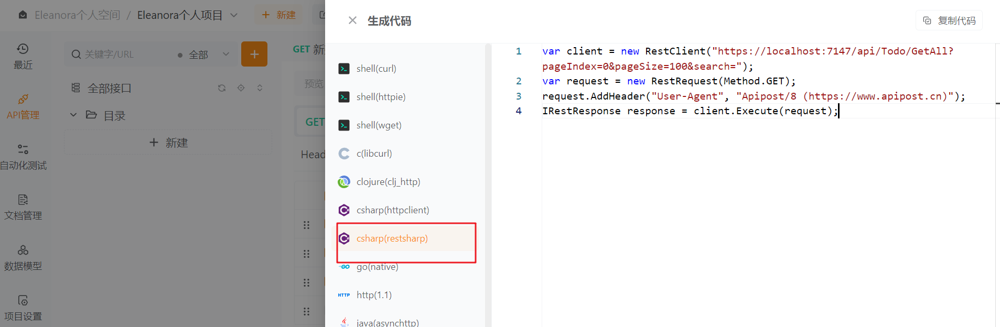

由于在wpf项目中需要使用到分页返回类型和Dto，所以这里需要：

1）将webapi项目的UnitOfWork文件夹中的`IPagedList和PagedList`移动到MyTodo.Shared项目的Collections文件夹（需要修改webapi中的引用，IPagedList中部分方法改为public）

2）将MyTodo项目Common.Models文件夹中的Dto注释掉，引用MyTodo.Shared项目Dtos文件夹中的Dto类

MemoDto

```C#
using System;
using System.Collections.Generic;
using System.ComponentModel;
using System.Linq;
using System.Text;
using System.Threading.Tasks;

namespace MyTodo.Shared.Dtos
{
    /// <summary>
    /// 备忘录事项Dto
    /// </summary>
    public class MemoDto : BaseDto
    {
        private string title;
        private string content;
        private int status;

        public string Title
        {
            get { return title; }
            set
            { title = value; OnPropertyChanged(); }
        }

        public string Content
        {
            get { return content; }
            set
            { content = value; OnPropertyChanged(); }
        }
        /// <summary>
        /// 当前状态
        /// </summary>
        public int Status
        {
            get { return status; }
            set { status = value; OnPropertyChanged(); }
        }
    }
}
```

TodoDto

```C#
using System;
using System.Collections.Generic;
using System.ComponentModel;
using System.Linq;
using System.Text;
using System.Threading.Tasks;

namespace MyTodo.Shared.Dtos
{
    /// <summary>
    /// 待办事项Dto
    /// </summary>
    public class TodoDto : BaseDto
    {
        private string title;
        private string content;
        private int status;

        public string Title
        {
            get { return title; }
            set { title = value; OnPropertyChanged(); }
        }

        public string Content
        {
            get { return content; }
            set { content = value; OnPropertyChanged(); }

        }

        public int Status
        {
            get { return status; }
            set { status = value; OnPropertyChanged(); }
        }
    }
}
```

BaseDto

```C#
using System;
using System.Collections.Generic;
using System.ComponentModel;
using System.Linq;
using System.Runtime.CompilerServices;
using System.Text;
using System.Threading.Tasks;

namespace MyTodo.Shared.Dtos
{
    public class BaseDto : INotifyPropertyChanged
    {
        public int Id { get; set; }
        public event PropertyChangedEventHandler? PropertyChanged;
        /// <summary>
        /// 实现通知更新
        /// </summary>
        /// <param name="propertyName"></param>
        protected virtual void OnPropertyChanged([CallerMemberName] string? propertyName = null)
        {
            PropertyChanged?.Invoke(this, new PropertyChangedEventArgs(propertyName));
        }

        protected bool SetField<T>(ref T field, T value, [CallerMemberName] string? propertyName = null)
        {
            if (EqualityComparer<T>.Default.Equals(field, value)) return false;
            field = value;
            OnPropertyChanged(propertyName);
            return true;
        }
    }
}
```

## 1、让WPF发起Http请求

### 1）RestSharp简介

在完成webapi代码后，使用apipost可以测试接口，点击生成代码可以看到apipost是如何发起请求的：



对于C#来说，有两种方式可以发起http请求：HttpClient和RestSharp，二者的区别如下：

RestSharp:

- RestSharp 是一个用于 .NET 的轻量级 REST 客户端库。它可以很方便地发起 REST 请求,摒弃了许多 HTTP 细节,让开发变得简单明了。
- 使用 RestSharp 时,我们只需定义一个请求对象,然后执行它。RestSharp 会自动处理请求参数的序列化和响应的反序列化。
- 它还内置了JSON和XML格式的支持,状态码检查,认证机制等实用功能。

HttpClient:

- HttpClient 是 .NET 中微软推荐的通用 HTTP 客户端库。它提供了灵活的同步和异步 HTTP 请求接口。
- 相比 RestSharp,HttpClient 并没有那么多封装,我们需要自己构建请求并处理响应等Details。但它本身更轻量级。
- 关键优点包括支持同步和异步调用、请求对象可以复用、自动处理HTTP消息等。

总的来说:

- RestSharp 对常见的CRUD请求更友好简单
- HttpClient 给了我们更多控制能力,但代码复杂度也相对更高

### 2）构造通用的HttpRestClient执行方法

添加RestSharp依赖包

```bash
NuGet\Install-Package RestSharp -Version 111.2.0
```

RestSharp的使用文档：https://restsharp.dev/docs/usage/

Service文件夹下添加HttpRestClient类

```C#
using System;
using System.Collections.Generic;
using System.Linq;
using System.Text;
using System.Threading.Tasks;
using MyTodo.Shared;
using Newtonsoft.Json;
using RestSharp;

namespace MyTodo.Service
{
    public class HttpRestClient
    {
        private readonly string _apiUrl;
        private readonly RestClient _client;
        public HttpRestClient(string apiUrl)
        {
            _apiUrl = apiUrl; //依赖注入apiUrl= http://localhost:7147/
            //使用_apiUrl构造RestClient实例
            _client = new RestClient(new RestClientOptions(_apiUrl)) ;
        }
        /// <summary>
        /// 非泛型执行请求
        /// </summary>
        /// <param name="baseRequest"></param>
        /// <returns></returns>
        public async Task<ApiResponse> ExecuteAsync(BaseRequest baseRequest)
        {
            //初始化请求，标记请求类型
            var request = new RestRequest(baseRequest.Route,baseRequest.Method);
            //添加请求头
            request.AddHeader("Content-Type", baseRequest.ContentType);
            if (baseRequest.Parameter != null)
            {
                //添加请求参数
                request.AddParameter("param", JsonConvert.SerializeObject(baseRequest.Parameter), ParameterType.RequestBody);
            }
            //获取请求返回值
            var response = await _client.ExecuteAsync(request);
            var res = JsonConvert.DeserializeObject<ApiResponse>(response.Content);
            return res;
        }
        public async Task<ApiResponse<T>> ExecuteAsync<T>(BaseRequest baseRequest)
        {
            //初始化请求的方法名，标记请求类型
            var request = new RestRequest(baseRequest.Route, baseRequest.Method);
            //添加请求头
            request.AddHeader("Content-Type", baseRequest.ContentType);
            if (baseRequest.Parameter != null)
            {
                //添加请求参数:RESTful API标准中,Content-Type为application/json表示参数为Json字符串
                request.AddParameter("application/json", JsonConvert.SerializeObject(baseRequest.Parameter), ParameterType.RequestBody);
            }
            //获取请求返回值
            var response = await _client.ExecuteAsync(request);
            if (response.StatusCode == System.Net.HttpStatusCode.OK)
            {
                var res = JsonConvert.DeserializeObject<ApiResponse<T>>(response.Content);
                return res;
            }
            else
            {
                return new ApiResponse<T>()
                {
                    IsSuccess = false,
                    Message = response.ErrorMessage
                };
            }
        }
    }
}
```

这里的构造函数使用到了_apiUrl，需要在app.xaml.cs中进行注入

```C#
using System.Configuration;
using System.Data;
using System.Windows;
using System.Windows.Controls;
using DryIoc;
using MyTodo.Service;
using MyTodo.ViewModels;
using MyTodo.Views;
using Prism.DryIoc;
using Prism.Ioc;
using RestSharp;

namespace MyTodo
{
    /// <summary>
    /// Interaction logic for App.xaml
    /// </summary>
    public partial class App : PrismApplication
    {
        protected override void RegisterTypes(IContainerRegistry containerRegistry)
        {
            //注册主页的导航页面(导航页面不依赖服务,所以不需要直接操作容器实例)
            containerRegistry.RegisterForNavigation<IndexView,IndexViewModel>();
            containerRegistry.RegisterForNavigation<MemoView, MemoViewModel>();
            containerRegistry.RegisterForNavigation<SettingsView, SettingsViewModel>();
            containerRegistry.RegisterForNavigation<TodoView, TodoViewModel>();
            //注册设置页的导航页面
            containerRegistry.RegisterForNavigation<SkinView, SkinViewModel>();
            containerRegistry.RegisterForNavigation<AboutView, AboutViewModel>();

            //https://localhost:7147/swagger/index.html
            //获取容器注册器实例
            var container = containerRegistry.GetContainer();
            //注册"webUrl"这个服务标识对应的实例
            container.RegisterInstance(@"https://localhost:7147/", serviceKey: "webUrl");
            //然后注册依赖这个实例的HttpRestClient服务
            container.Register<HttpRestClient>(made: Parameters.Of.Type<string>(serviceKey: "webUrl"));
        }

        protected override Window CreateShell()
        {
            return Container.Resolve<MainView>();
        }
    }
}

```

需要注意的是注入的时候不能像导航页面一样直接注入，要先获取到容器实例`container`，再将`ip:port`部分标记为serviceKey="webUrl"的值，最后注册依赖webUrl实例的HttpRestClient服务。

> 服务标识(Service Key)是一个很重要的概念,它在.NET Core依赖注入容器中的作用如下:
>
> - 服务标识是唯一识别一个注册服务的字符串。
> - 当向容器注册服务时,我们需要指定一个标识。例如上面代码注册"webUrl"字符串实例就是指定了"webUrl"作为标识。
> - 其他服务如果需要使用这个服务,就需要通过相同的标识来解决依赖。
> - 举个简单的例子,如果我们有一个UserService依赖一个数据库服务,在注册时可能是:
>
> ```C#
> services.AddTransient<UserService>();
> services.AddScoped<IDatabase, SqlDatabase>("database");
> ```
>
> 这里IDatabase实现指定了"database"作为标识。
>
> UserService在构造函数中注入时就可以写为:
>
> ```c#
> public UserService(IDatabase database) 
> ```
>
> 而容器会自动用"database"标识找到对应的SqlDatabase来满足依赖。
>
> 所以从技术角度来说,服务标识就相当于一个唯一名称,它使得依赖关系在代码和配置文件中实现了松耦合。

### 3）构造通用BaseService执行泛型方法

IBaseService接口就对应了webapi中各个方法

```C#
using System;
using System.Collections.Generic;
using System.Linq;
using System.Text;
using System.Threading.Tasks;
using MyTodo.Shared;
using MyTodo.Shared.Collections;
using MyTodo.Shared.Parameters;

namespace MyTodo.Service
{
    /// <summary>
    /// 约束TEntity必须是引用类型(class)
    /// </summary>
    /// <typeparam name="TEntity"></typeparam>
    public interface IBaseService<TEntity> where TEntity : class
    {
        Task<ApiResponse<TEntity>> AddAsync(TEntity entity);
        Task<ApiResponse<TEntity>> UpdateAsync(TEntity entity);
        Task<ApiResponse> DeleteAsync(int id);
        Task<ApiResponse<TEntity>> GetFirstOrDefaultAsync(int id);
        Task<ApiResponse<PagedList<TEntity>>> GetAllAsync(QueryParameter parameter);

    }
}
```

首先new一个类BaseRequest作为请求方法的参数类

```C#
using System;
using System.Collections.Generic;
using System.Linq;
using System.Text;
using System.Threading.Tasks;
using RestSharp;

namespace MyTodo.Service
{
    public class BaseRequest
    {
        public Method Method { get; set; }
        public string Route { get; set; }
        public string ContentType { get; set; } = "application/json";
        public object? Parameter { get; set; }
    }
}
```

BaseService实现IBaseService

```C#
using System;
using System.Collections.Generic;
using System.Linq;
using System.Reflection.Metadata;
using System.Text;
using System.Threading.Tasks;
using MyTodo.Shared;
using MyTodo.Shared.Collections;
using RestSharp;
using QueryParameter = MyTodo.Shared.Parameters.QueryParameter;

namespace MyTodo.Service
{
    public  class BaseService<TEntity> : IBaseService<TEntity> where TEntity : class
    {
        private readonly HttpRestClient _client;
        private readonly string _serviceName;
        public BaseService(HttpRestClient client, string serviceName)
        {
            _client = client;
            this._serviceName = serviceName;
        }

        public async Task<ApiResponse<TEntity>> AddAsync(TEntity entity)
        {
            BaseRequest request = new BaseRequest();
            request.Method = RestSharp.Method.Post;
            request.Route = $"api/{_serviceName}/Add";
            request.Parameter = entity;
            return await _client.ExecuteAsync<TEntity>(request); 
        }

        public async Task<ApiResponse<TEntity>> UpdateAsync(TEntity entity)
        {
            BaseRequest request = new BaseRequest();
            request.Method = RestSharp.Method.Post;
            request.Route = $"api/{_serviceName}/Update";
            request.Parameter = entity;
            return await _client.ExecuteAsync<TEntity>(request);
        }

        public async Task<ApiResponse> DeleteAsync(int id)
        {
            BaseRequest request = new BaseRequest();
            request.Method = RestSharp.Method.Delete;
            request.Route = $"api/{_serviceName}/Delete?id={id}";
            return await _client.ExecuteAsync(request);
        }

        public async Task<ApiResponse<TEntity>> GetFirstOrDefaultAsync(int id)
        {
            BaseRequest request = new BaseRequest();
            request.Method = RestSharp.Method.Get;
            request.Route = $"api/{_serviceName}/Get?id={id}";
            return await _client.ExecuteAsync<TEntity>(request);
        }

        public async Task<ApiResponse<PagedList<TEntity>>> GetAllAsync(QueryParameter parameter)
        {
            BaseRequest request = new BaseRequest();
            request.Method = RestSharp.Method.Get;
            request.Route = $"api/{_serviceName}/GetAll?pageIndex={parameter.PageIndex}&pageSize={parameter.PageSize}&search={parameter.Search}";
            //request.Method = RestSharp.Method.Post;
            //request.Route = $"api/{_serviceName}/GetAll";
            //request.Parameter = parameter;
            return await _client.ExecuteAsync<PagedList<TEntity>>(request);
        }
    }
}
```

### 4）TodoService

ITodoService接口继承IBaseService

```C#
using System;
using System.Collections.Generic;
using System.Linq;
using System.Text;
using System.Threading.Tasks;
using MyTodo.Common.Models;
using MyTodo.Shared;
using MyTodo.Shared.Collections;
using MyTodo.Shared.Parameters;

namespace MyTodo.Service
{
    public interface ITodoService : IBaseService<TodoDto>
    {
     
    }
}
```

`TodoService`继承`BaseService<TodoDto>`，由于BaseService的构造函数中需要传入serviceName`  public BaseService(HttpRestClient client, string serviceName)`作为请求url的部分，这里就可以直接写成"Todo"

```C#
using System;
using System.Collections.Generic;
using System.Linq;
using System.Text;
using System.Threading.Tasks;
using MyTodo.Common.Models;
using MyTodo.Shared;
using MyTodo.Shared.Collections;
using MyTodo.Shared.Parameters;

namespace MyTodo.Service
{
    public class TodoService : BaseService<TodoDto>, ITodoService
    {
        public TodoService(HttpRestClient client) : base(client, "Todo")
        {

        }
    } 
}
```

同时在app.xaml.cs中添加ITodoService与TodoService的注入

```C#
using System.Configuration;
using System.Data;
using System.Windows;
using System.Windows.Controls;
using DryIoc;
using MyTodo.Service;
using MyTodo.ViewModels;
using MyTodo.Views;
using Prism.DryIoc;
using Prism.Ioc;
using RestSharp;

namespace MyTodo
{
    /// <summary>
    /// Interaction logic for App.xaml
    /// </summary>
    public partial class App : PrismApplication
    {
        protected override void RegisterTypes(IContainerRegistry containerRegistry)
        {
            //注册主页的导航页面(导航页面不依赖服务,所以不需要直接操作容器实例)
            containerRegistry.RegisterForNavigation<IndexView,IndexViewModel>();
            containerRegistry.RegisterForNavigation<MemoView, MemoViewModel>();
            containerRegistry.RegisterForNavigation<SettingsView, SettingsViewModel>();
            containerRegistry.RegisterForNavigation<TodoView, TodoViewModel>();
            //注册设置页的导航页面
            containerRegistry.RegisterForNavigation<SkinView, SkinViewModel>();
            containerRegistry.RegisterForNavigation<AboutView, AboutViewModel>();

            //https://localhost:7147/swagger/index.html
            //获取容器注册器实例
            var container = containerRegistry.GetContainer();
            //注册"webUrl"这个服务标识对应的实例
            container.RegisterInstance(@"https://localhost:7147/", serviceKey: "webUrl");
            //然后注册依赖这个实例的HttpRestClient服务
            container.Register<HttpRestClient>(made: Parameters.Of.Type<string>(serviceKey: "webUrl"));
            //添加服务的注入
            containerRegistry.Register<ITodoService, TodoService>();

        }

        protected override Window CreateShell()
        {
            return Container.Resolve<MainView>();
        }
    }
}

```

### 5）修改TodoViewModel的初始化数据方法

```C#
using System;
using System.Collections.Generic;
using System.Collections.ObjectModel;
using System.Linq;
using System.Text;
using System.Threading.Tasks;
using MyTodo.Common.Models;
using MyTodo.Service;
using MyTodo.Shared.Parameters;
using Prism.Commands;
using Prism.Mvvm;

namespace MyTodo.ViewModels
{
    public class TodoViewModel : BindableBase
    {
        private readonly ITodoService _todoService;
        /// <summary>
        /// 按钮绑定的添加待办命令
        /// </summary>
        public DelegateCommand TodoAddCommand { get; set; }
        public TodoViewModel(ITodoService todoService)
        {
            _todoService = todoService;
            TodoList = new ObservableCollection<TodoDto>();
            InitialTodoList();
            TodoAddCommand = new DelegateCommand(AddTodoAction);
        }
        private ObservableCollection<TodoDto> todoList;

        public ObservableCollection<TodoDto> TodoList
        {
            get { return todoList; }
            set { todoList = value; RaisePropertyChanged(); }
        }
        private bool isRightDrawerOpen;
        /// <summary>
        /// 右侧抽屉是否展开
        /// </summary>
        public bool IsRightDrawerOpen
        {
            get { return isRightDrawerOpen; }
            //set { isRightDrawerOpen = value; RaisePropertyChanged(); }
            set { SetProperty(ref isRightDrawerOpen, value); }
        }

        private async void InitialTodoList()
        {
            var res = await _todoService.GetAllAsync(new QueryParameter()
            {
                PageSize = 100,PageIndex = 0
            });
            if (res.IsSuccess)
            {
                TodoList.Clear();
                foreach (var item in res.Result.Items)
                {
                    TodoList.Add(item);
                }
            }
            //for (int i = 0; i < 20; i++)
            //{
            //    var todo = new TodoDto()
            //    {
            //        Id = i,
            //        CreateTime = DateTime.Now,
            //        Content = "测试数据",
            //        Title = "标题" + i,
            //        Status = 1,
            //        UpdateTime = DateTime.Now
            //    };
            //    todoList.Add(todo);
            //}
        }
        //TodoAddCommand命令执行的方法
        private void AddTodoAction()
        {
            IsRightDrawerOpen = true;
        }
    }
}
```

### 6）配置启动项与效果


启动后先用api测试请求url是否正确

```text
https://localhost:7147/api/Todo/GetAll?PageIndex=0&PageSize=100
```

在wpf中打开待办页可以看到之前在数据库中添加的数据


## 2、TodoView

### 1）点击事项弹出右侧抽屉

TodoViewModel中增加一个点击后触发的命令`SelectedCommand`，以及触发执行的方法`SelectedAction`，在构造函数中实现命令与方法的绑定

```C#
public DelegateCommand<TodoDto> SelectedCommand { get; set; }
private TodoDto currTodoDto;
/// <summary>
/// 编辑选中/新增TodoDto对象
/// </summary>
public TodoDto CurrTodoDto
{
    get { return currTodoDto; }
    //set { isRightDrawerOpen = value; RaisePropertyChanged(); }
    set { SetProperty(ref currTodoDto, value); }
}
/// <summary>
/// 选中执行的方法
/// </summary>
/// <param name="obj"></param>
private async void SelectedAction(TodoDto obj)
{
    try
    {
        UpdateLoading(true);
        var todoFromDBRes = await _todoService.GetFirstOrDefaultAsync(obj.Id);
        if (todoFromDBRes.IsSuccess)
        {
            CurrTodoDto = todoFromDBRes.Result;
            IsRightDrawerOpen = true;
        }
    }
    catch (Exception ex)
    {

    }
    finally
    {
        UpdateLoading(false);
    }
}
```

在TodoView中增加对应的触发：

可以观察到这个列表是我们自定义的Grid，如果想使用触发事件需要引用`xmlns:i="http://schemas.microsoft.com/xaml/behaviors"` ，而且数据源TodoList是Grid外面的ItemsControl绑定的，我们使用的`SelectedCommand`与`TodoList`是同级的，但在xml逻辑树上是内部嵌套的，这里就需要使用到`RelativeSource`

```xml
 <Grid Width="220" MinHeight="180"
       MaxHeight="250" Margin="8">
     <i:Interaction.Triggers>
         <i:EventTrigger EventName="MouseLeftButtonUp">
             <i:InvokeCommandAction Command="{Binding DataContext.SelectedCommand, RelativeSource={RelativeSource Mode=FindAncestor, AncestorType=ItemsControl}}" CommandParameter="{Binding}" />
         </i:EventTrigger>
     </i:Interaction.Triggers>
	...
 </Grid>
```

### 2）编辑弹框中显示被选中的列表数据

将ViewModel中的CurrTodoDto.Status 、CurrTodoDto.Title、CurrTodoDto.Content绑定到对应位置

```xml
<!--  右侧弹出的抽屉样式  -->
<md:DrawerHost.RightDrawerContent>
    <DockPanel Width="300" LastChildFill="False">
        <!--  添加待办  -->
        <TextBlock Padding="20,10" DockPanel.Dock="Top"
                   FontSize="20" FontWeight="Bold"
                   Text="添加待办" />
        <!--  状态  -->
        <StackPanel Margin="20" DockPanel.Dock="Top"
                    Orientation="Horizontal">
            <TextBlock VerticalAlignment="Center" Text="状态：" />
            <ComboBox SelectedIndex="{Binding CurrTodoDto.Status}">
                <ComboBoxItem>待办</ComboBoxItem>
                <ComboBoxItem>已完成</ComboBoxItem>
            </ComboBox>
        </StackPanel>
        <!--  待办概要  -->
        <TextBox Margin="20,0" md:HintAssist.Hint="请输入待办概要"
                 DockPanel.Dock="Top"
                 Text="{Binding CurrTodoDto.Title}" />
        <!--  待办内容  -->
        <TextBox MinHeight="100" Margin="20"
                 md:HintAssist.Hint="请输入待办事项内容" DockPanel.Dock="Top"
                 Text="{Binding CurrTodoDto.Content}" />
        <Button Margin="20,0"
                Command="{Binding ExcuteCommand}"
                CommandParameter="Save" Content="添加到待办"
                DockPanel.Dock="Top" />
    </DockPanel>
</md:DrawerHost.RightDrawerContent>
```

### 3）优化AddCommand为ExcuteCommand

去掉AddCommand，改为通过`ExcuteAction(string option)`执行 `AddTodoAction();`

搜索框可以增加一个Search绑定到搜索框的值后，再直接使用 `InitialTodoList()`，更新TodoList

```C#
private string? search;
/// <summary>
/// 搜索框信息
/// </summary>
public string? Search
{
    get { return search; }
    set { search = value; RaisePropertyChanged(); }
}
// <summary>
/// 执行命令的简单工厂
/// </summary>
public DelegateCommand<string> ExcuteCommand { get; set; }     
private void ExcuteAction(string option)
{
    switch (option)
    {
        case "Add":
            AddTodoAction();
            break;
        case "Search":
            InitialTodoList();
            break;
        case "Save":
            SaveNewTodo();
            break;
    }
}
//TodoAddCommand 命令执行的方法
private void AddTodoAction()
{
    CurrTodoDto = new TodoDto();
    IsRightDrawerOpen = true;
} 
/// <summary>
/// 获取数据
/// </summary>
private async void InitialTodoList()
{
    UpdateLoading(true); //加载开始
    var res = await _todoService.GetAllAsync(new QueryParameter()
                                             {
                                                 PageSize = 100,
                                                 PageIndex = 0,Search = Search
                                             });
    if (res.IsSuccess)
    {
        TodoList.Clear();
        //TodoList = new ObservableCollection<TodoDto>();
        foreach (var item in res.Result.Items)
        {
            TodoList.Add(item);
        }
    }
    UpdateLoading(false); //加载结束
}
```

原来的AddCommand绑定改为如下：

```xml
<!--  +添加待办  -->
<Button Grid.Row="0" Margin="10,5"
        HorizontalAlignment="Right"
        Command="{Binding ExcuteCommand}"
        CommandParameter="Add" Content="+ 添加待办" />
```

搜索框添加回车的触发命令绑定：

```xml
<TextBox Width="250" VerticalContentAlignment="Center"
         md:HintAssist.Hint="查找待办事项..." md:TextFieldAssist.HasClearButton="True"
         Text="{Binding Search, UpdateSourceTrigger=PropertyChanged, Mode=TwoWay}">
    <TextBox.InputBindings>
        <KeyBinding Key="Enter"
                    Command="{Binding ExcuteCommand}"
                    CommandParameter="Search" />
    </TextBox.InputBindings>
</TextBox>
```

### 4）编辑/新增成功后保存

这里同样可以使用简单工厂`ExcuteAction`，执行的方法`SaveNewTodo`通过`CurrTodoDto.Id > 0`来判断新增或编辑。这里新增或编辑后要修改TodoList，这样在抽屉关闭时可以看到变更后的效果

```C#
/// <summary>
/// 保存执行的方法
/// </summary>
/// <returns></returns>
private async Task SaveNewTodo()
{
    if (string.IsNullOrWhiteSpace(CurrTodoDto.Title) || string.IsNullOrWhiteSpace(CurrTodoDto.Content)) return;
    UpdateLoading(true);
    try
    {
        if (CurrTodoDto.Id > 0) //编辑
        {
            var updateRes = await _todoService.UpdateAsync(CurrTodoDto);
            //编辑成功则更新列表中此项的显示
            if (updateRes.IsSuccess)
            {
                var oldTodo = TodoList.FirstOrDefault(x => x.Id == CurrTodoDto.Id);
                if (oldTodo != null)
                {
                    oldTodo.Title = CurrTodoDto.Title;
                    oldTodo.Content = CurrTodoDto.Content;
                    oldTodo.Status = CurrTodoDto.Status;
                }
                //IsRightDrawerOpen = false;
            }
        }
        else //新增
        {
            var addRes = await _todoService.AddAsync(CurrTodoDto);
            if (addRes.IsSuccess)
            {
                TodoList.Add(addRes.Result);
                //IsRightDrawerOpen = false;
            }
        }
    }
    catch (Exception ex)
    {

    }
    finally
    {
        UpdateLoading(false);
        IsRightDrawerOpen = false;
    }
}
```

抽屉中添加到待办的绑定：

```xml
<Button Margin="20,0"
        Command="{Binding ExcuteCommand}"
        CommandParameter="Save" Content="添加到待办"
        DockPanel.Dock="Top" />
```

### 5）根据Status变化卡片颜色

Status的值为0则为待办，显示以为绿色；Status的值为1则为待办，显示以为蓝色

```xml
<!--  圆角边框  -->
<Border Grid.RowSpan="2" CornerRadius="3">
    <Border.Style>
        <Style TargetType="Border">
            <Style.Triggers>
                <DataTrigger Binding="{Binding Status}" Value="0">
                    <Setter Property="Background" Value="#1E90FF" />
                </DataTrigger>
                <DataTrigger Binding="{Binding Status}" Value="1">
                    <Setter Property="Background" Value="#3CB371" />
                </DataTrigger>
            </Style.Triggers>
        </Style>
    </Border.Style>
</Border>
```

### 6）数据为空时显示为空提示图片

首先将图片添加到项目中，并配置属性-生成-资源，这样才能正常显示图片。

当数据为空这个条件可以通过`TodoList.Count()`的值判断，但`StackPanel`是否显示的属性`Visibility`接收的是一个枚举类型的值，所以需要手撸一个Int到Visibility枚举类的`IntToVisibilityConverter`

```C#
using System;
using System.Collections.Generic;
using System.Globalization;
using System.Linq;
using System.Text;
using System.Threading.Tasks;
using System.Windows;
using System.Windows.Data;

namespace MyTodo.Common.Converters
{
    public class IntToVisibilityConverter : IValueConverter
    {
        public object Convert(object value, Type targetType, object parameter, CultureInfo culture)
        {
            if (value != null && int.TryParse(value.ToString(),out int result))
            {
                if (result == 0) return Visibility.Visible;
            }
            return Visibility.Hidden;
        }

        public object ConvertBack(object value, Type targetType, object parameter, CultureInfo culture)
        {
            throw new NotImplementedException();
        }
    }
}
```

我们想要在第一行筛选条件的下面显示一个空图片以及一行提示文字，所以这里使用垂直排列的StackPanel。将`IntToVisibilityConverter`声明为静态资源

```xml
<UserControl x:Class="MyTodo.Views.TodoView" 
             ...
             xmlns:cv="clr-namespace:MyTodo.Common.Converters">
    <UserControl.Resources>
        <cv:IntToVisibilityConverter x:Key="IntToVisibility" />
    </UserControl.Resources>
<StackPanel Grid.Row="1" VerticalAlignment="Center"
            Visibility="{Binding TodoList.Count, Converter={StaticResource IntToVisibility}}">
    <Image Width="120" Height="120"
           Source="/Images/wind.png" />

    <TextBlock Margin="0,10" HorizontalAlignment="Center"
               FontSize="18" Text="尝试添加一些待办事项，以便在此处查看它们。" />
</StackPanel>
</UserControl>
```

### 7）右上角删除的绑定

```xml
 <!--  每个卡片右上角的三个点(Grid是Panel的子类)  -->
 <md:PopupBox HorizontalAlignment="Right" Panel.ZIndex="1">
     <Button Command="{Binding DataContext.DeleteCommand, RelativeSource={RelativeSource Mode=FindAncestor, AncestorType=ItemsControl}}"
             CommandParameter="{Binding}"
             Content="删除" />
 </md:PopupBox>
```


```C#
using System;
using System.Collections.Generic;
using System.Collections.ObjectModel;
using System.Linq;
using System.Text;
using System.Threading.Tasks;
using MyTodo.Common.Models;
using MyTodo.Service;
using MyTodo.Shared.Dtos;
using MyTodo.Shared.Parameters;
using Prism.Commands;
using Prism.Events;
using Prism.Ioc;
using Prism.Mvvm;
using Prism.Regions;

namespace MyTodo.ViewModels
{
    public class TodoViewModel : NavigationViewModel
    {
        private readonly ITodoService _todoService;
        //dryIoc中的容器
        private readonly IContainerProvider _containerProvider;

        /// <summary>
        /// 按钮绑定的添加待办命令
        /// </summary>
        public DelegateCommand<string> ExcuteCommand { get; set; }
        public DelegateCommand<TodoDto> SelectedCommand { get; set; }
        public DelegateCommand<TodoDto> DeleteCommand { get; set; }

        public TodoViewModel(ITodoService todoService, IContainerProvider containerProvider) : base(containerProvider)
        {
            _containerProvider = containerProvider;
            _todoService = todoService;
            TodoList = new ObservableCollection<TodoDto>();
            //InitialTodoList();
            ExcuteCommand = new DelegateCommand<string>(ExcuteAction);
            SelectedCommand = new DelegateCommand<TodoDto>(SelectedAction);
            //新增删除命令绑定
            DeleteCommand = new DelegateCommand<TodoDto>(DeleteAction);
        }

        /// <summary>
        /// 删除执行的方法
        /// </summary>
        /// <param name="obj"></param>
        private async void DeleteAction(TodoDto obj)
        {
            try
            {
                UpdateLoading(true);
                var deleteRes = await _todoService.DeleteAsync(obj.Id);
                if (deleteRes.IsSuccess)
                {
                    var oldTodo = TodoList.FirstOrDefault(x => x.Id == obj.Id);
                    if (oldTodo != null)
                    {
                        TodoList.Remove(oldTodo);
                    }
                }
            }
            catch (Exception ex)
            {

            }
            finally
            {
                UpdateLoading(false);
                IsRightDrawerOpen = false;
            }
        }
    }
}
```

### 8）增加下拉(全部、待办、已办)筛选框的绑定

大致思路：将下拉框的值绑定到SelectedIndex，并在ViewModel中将其转换为Status值，将其应用到接口的请求参数中

首先需要在webapi项目中增加一个接口来对应Todo模块特殊的筛选（对继承了BaseService的TodoService进行扩展）在ITodoService中增加`GetAllTodoAsync`方法

```C#
using MyTodo.Api.Entities;
using MyTodo.Shared;
using MyTodo.Shared.Dtos;
using MyTodo.Shared.Parameters;

namespace MyTodo.Api.Services
{
    public interface ITodoService : IBaseService<TodoDto>
    {
        Task<ApiResponse> GetAllTodoAsync(TodoQueryParameter query);
    }
}
```

TodoService中增加`GetAllTodoAsync`方法的实现

```C#
using System.Collections.Generic;
using Arch.EntityFrameworkCore.UnitOfWork;
using AutoMapper;
using Microsoft.AspNetCore.Mvc;
using MyTodo.Api.Entities;
using MyTodo.Shared;
using MyTodo.Shared.Dtos;
using MyTodo.Shared.Parameters;
using static Microsoft.EntityFrameworkCore.DbLoggerCategory;

namespace MyTodo.Api.Services
{
    /// <summary>
    /// 待办事项实现
    /// </summary>
    public class TodoService : ITodoService
    {
        private readonly IUnitOfWork _work;
        private readonly IMapper _mapper;
        private IRepository<Todo> _repository;


        public TodoService(IUnitOfWork unitOfWork, IMapper mapper)
        {
            _work = unitOfWork;
            _mapper = mapper;
            _repository = _work.GetRepository<Todo>();
        }
        ...
        public async Task<ApiResponse> GetAllTodoAsync(TodoQueryParameter query)
        {
            try
            {
                var todos = await _repository.GetPagedListAsync(predicate: x => (string.IsNullOrWhiteSpace(query.Search) ? true : x.Title.Contains(query.Search)) && ((query.Status==null) ? true : x.Status.Equals(query.Status)),
                    pageIndex: query.PageIndex,
                    pageSize: query.PageSize,
                    orderBy: x => x.OrderByDescending(t => t.CreateTime)
                );
                return new ApiResponse(true, "获取数据成功", todos);
            }
            catch (Exception ex)
            {
                return new ApiResponse(false, ex.Message);
            }
        }
    }
}

```

对应WPF项目中发起的请求也要进行拓展，增加`GetAllTodoAsync`抽象方法

```C#
using System;
using System.Collections.Generic;
using System.Linq;
using System.Text;
using System.Threading.Tasks;
using MyTodo.Common.Models;
using MyTodo.Shared;
using MyTodo.Shared.Collections;
using MyTodo.Shared.Dtos;
using MyTodo.Shared.Parameters;

namespace MyTodo.Service
{
    public interface ITodoService : IBaseService<TodoDto>
    {
        Task<ApiResponse<PagedList<TodoDto>>> GetAllTodoAsync(TodoQueryParameter parameter);
    }
}

```

其实现中主要注意的是`request.Route`的值要使用新的webapi接口

```C#
using System;
using System.Collections.Generic;
using System.Linq;
using System.Text;
using System.Threading.Tasks;
using MyTodo.Common.Models;
using MyTodo.Shared;
using MyTodo.Shared.Collections;
using MyTodo.Shared.Dtos;
using MyTodo.Shared.Parameters;

namespace MyTodo.Service
{
    public class TodoService : BaseService<TodoDto>, ITodoService
    {
        private readonly HttpRestClient _client;
        public TodoService(HttpRestClient client) : base(client, "Todo")
        {
            this._client = client;
        }
        public async Task<ApiResponse<PagedList<TodoDto>>> GetAllTodoAsync(TodoQueryParameter parameter)
        {
            BaseRequest request = new BaseRequest();
            request.Method = RestSharp.Method.Get;
            request.Route = $"api/Todo/GetAllTodo?pageIndex={parameter.PageIndex}&pageSize={parameter.PageSize}&search={parameter.Search}&status={parameter.Status}";

            return await _client.ExecuteAsync<PagedList<TodoDto>>(request);
        }
    } 
}

```

基本信息已经准备完毕，现在在View中增加数据属性SelectedIndex，并在ViewModel中将其转换为Status值，将其应用到接口的请求参数中

```xml
 <TextBlock Margin="10,0" VerticalAlignment="Center"
            Text="筛选：" />
 <ComboBox SelectedIndex="{Binding SelectedIndex}">
     <ComboBoxItem>全部</ComboBoxItem>
     <ComboBoxItem>待办</ComboBoxItem>
     <ComboBoxItem>已完成</ComboBoxItem>
 </ComboBox>
```

ViewModel

```C#
private int selectedIndex;       
/// <summary>
/// 下拉列表选中状态值
/// </summary>
public int SelectedIndex
{
    get { return selectedIndex; }
    set { selectedIndex = value; RaisePropertyChanged(); }
} 
/// <summary>
 /// 获取数据
 /// </summary>
 private async void InitialTodoList()
 {
     UpdateLoading(true); //加载开始
     //变更访问的webapi接口
     var res = await _todoService.GetAllTodoAsync(new TodoQueryParameter()
     {
         PageSize = 100,
         PageIndex = 0,
         Search = Search,
         Status = SelectedIndex == 0 ? null : SelectedIndex - 1 //增加参数
     });
     if (res.IsSuccess)
     {
         TodoList.Clear();
         //TodoList = new ObservableCollection<TodoDto>();
         foreach (var item in res.Result.Items)
         {
             TodoList.Add(item);
         }
     }
     UpdateLoading(false); //加载结束
 }
```

效果：


### 9）TodoViewModel完整代码

```C#
using System;
using System.Collections.Generic;
using System.Collections.ObjectModel;
using System.Linq;
using System.Text;
using System.Threading.Tasks;
using MyTodo.Common.Models;
using MyTodo.Service;
using MyTodo.Shared.Dtos;
using MyTodo.Shared.Parameters;
using Prism.Commands;
using Prism.Events;
using Prism.Ioc;
using Prism.Mvvm;
using Prism.Regions;

namespace MyTodo.ViewModels
{
    public class TodoViewModel : NavigationViewModel
    {
        private readonly ITodoService _todoService;
        //dryIoc中的容器
        private readonly IContainerProvider _containerProvider;

        /// <summary>
        /// 按钮绑定的添加待办命令
        /// </summary>
        public DelegateCommand<string> ExcuteCommand { get; set; }
        public DelegateCommand<TodoDto> SelectedCommand { get; set; }
        public DelegateCommand<TodoDto> DeleteCommand { get; set; }

        public TodoViewModel(ITodoService todoService, IContainerProvider containerProvider) : base(containerProvider)
        {
            _containerProvider = containerProvider;
            _todoService = todoService;
            TodoList = new ObservableCollection<TodoDto>();
            //InitialTodoList();
            ExcuteCommand = new DelegateCommand<string>(ExcuteAction);
            SelectedCommand = new DelegateCommand<TodoDto>(SelectedAction);
            DeleteCommand = new DelegateCommand<TodoDto>(DeleteAction);
        }


        private ObservableCollection<TodoDto> todoList;
        private bool isRightDrawerOpen;
        private TodoDto currTodoDto;
        private string? search;
        private int selectedIndex;
        private void ExcuteAction(string option)
        {
            switch (option)
            {
                case "Add":
                    AddTodoAction();
                    break;
                case "Search":
                    InitialTodoList();
                    break;
                case "Save":
                    SaveNewTodo();
                    break;
            }
        }


        public ObservableCollection<TodoDto> TodoList
        {
            get { return todoList; }
            set { todoList = value; RaisePropertyChanged(); }
        }

        /// <summary>
        /// 右侧抽屉是否展开
        /// </summary>
        public bool IsRightDrawerOpen
        {
            get { return isRightDrawerOpen; }
            //set { isRightDrawerOpen = value; RaisePropertyChanged(); }
            set { SetProperty(ref isRightDrawerOpen, value); }
        }
        /// <summary>
        /// 编辑选中/新增TodoDto对象
        /// </summary>
        public TodoDto CurrTodoDto
        {
            get { return currTodoDto; }
            //set { isRightDrawerOpen = value; RaisePropertyChanged(); }
            set { SetProperty(ref currTodoDto, value); }
        }

        /// <summary>
        /// 搜索框信息
        /// </summary>
        public string? Search
        {
            get { return search; }
            set { search = value; RaisePropertyChanged(); }
        }
        /// <summary>
        /// 下拉列表选中状态值
        /// </summary>
        public int SelectedIndex
        {
            get { return selectedIndex; }
            set { selectedIndex = value; RaisePropertyChanged(); }
        }
        /// <summary>
        /// 获取数据
        /// </summary>
        private async void InitialTodoList()
        {
            UpdateLoading(true); //加载开始
            var res = await _todoService.GetAllTodoAsync(new TodoQueryParameter()
            {
                PageSize = 100,
                PageIndex = 0,
                Search = Search,
                Status = SelectedIndex == 0 ? null : SelectedIndex - 1
            });
            if (res.IsSuccess)
            {
                TodoList.Clear();
                //TodoList = new ObservableCollection<TodoDto>();
                foreach (var item in res.Result.Items)
                {
                    TodoList.Add(item);
                }
            }
            UpdateLoading(false); //加载结束
        }

        public override void OnNavigatedTo(NavigationContext navigationContext)
        {
            base.OnNavigatedTo(navigationContext);
            InitialTodoList();
        }

        //TodoAddCommand 命令执行的方法
        private void AddTodoAction()
        {
            CurrTodoDto = new TodoDto();
            IsRightDrawerOpen = true;
        }
        /// <summary>
        /// 选中执行的方法
        /// </summary>
        /// <param name="obj"></param>
        private async void SelectedAction(TodoDto obj)
        {
            try
            {
                UpdateLoading(true);
                var todoFromDBRes = await _todoService.GetFirstOrDefaultAsync(obj.Id);
                if (todoFromDBRes.IsSuccess)
                {
                    CurrTodoDto = todoFromDBRes.Result;
                    IsRightDrawerOpen = true;
                }
            }
            catch (Exception ex)
            {

            }
            finally
            {
                UpdateLoading(false);
            }
        }
        /// <summary>
        /// 选中执行的方法
        /// </summary>
        /// <param name="obj"></param>
        private async void DeleteAction(TodoDto obj)
        {
            try
            {
                UpdateLoading(true);
                var deleteRes = await _todoService.DeleteAsync(obj.Id);
                if (deleteRes.IsSuccess)
                {
                    var oldTodo = TodoList.FirstOrDefault(x => x.Id == obj.Id);
                    if (oldTodo != null)
                    {
                        TodoList.Remove(oldTodo);
                    }
                }
            }
            catch (Exception ex)
            {

            }
            finally
            {
                UpdateLoading(false);
                IsRightDrawerOpen = false;
            }
        }
        /// <summary>
        /// 保存执行的方法
        /// </summary>
        /// <returns></returns>
        private async Task SaveNewTodo()
        {
            if (string.IsNullOrWhiteSpace(CurrTodoDto.Title) || string.IsNullOrWhiteSpace(CurrTodoDto.Content)) return;
            UpdateLoading(true);
            try
            {
                if (CurrTodoDto.Id > 0) //编辑
                {
                    var updateRes = await _todoService.UpdateAsync(CurrTodoDto);
                    //编辑成功则更新列表中此项的显示
                    if (updateRes.IsSuccess)
                    {
                        var oldTodo = TodoList.FirstOrDefault(x => x.Id == CurrTodoDto.Id);
                        if (oldTodo != null)
                        {
                            oldTodo.Title = CurrTodoDto.Title;
                            oldTodo.Content = CurrTodoDto.Content;
                            oldTodo.Status = CurrTodoDto.Status;
                        }
                        //IsRightDrawerOpen = false;
                    }
                }
                else //新增
                {
                    var addRes = await _todoService.AddAsync(CurrTodoDto);
                    if (addRes.IsSuccess)
                    {
                        TodoList.Add(addRes.Result);
                        //IsRightDrawerOpen = false;
                    }
                }
            }
            catch (Exception ex)
            {

            }
            finally
            {
                UpdateLoading(false);
                IsRightDrawerOpen = false;
            }
        }
    }
}
```


## 3、MemoService

### 1）MemoView

```xml
<UserControl x:Class="MyTodo.Views.MemoView" xmlns="http://schemas.microsoft.com/winfx/2006/xaml/presentation"
             xmlns:x="http://schemas.microsoft.com/winfx/2006/xaml" xmlns:cv="clr-namespace:MyTodo.Common.Converters"
             xmlns:d="http://schemas.microsoft.com/expression/blend/2008" xmlns:i="http://schemas.microsoft.com/xaml/behaviors"
             xmlns:mc="http://schemas.openxmlformats.org/markup-compatibility/2006" xmlns:md="http://materialdesigninxaml.net/winfx/xaml/themes"
             d:DesignHeight="450" d:DesignWidth="800"
             mc:Ignorable="d">
    <UserControl.Resources>
        <cv:IntToVisibilityConverter x:Key="IntToVisibility" />
    </UserControl.Resources>
    <md:DialogHost>
        <md:DrawerHost IsRightDrawerOpen="{Binding IsRightDrawerOpen}">
            <md:DrawerHost.RightDrawerContent>
                <DockPanel Width="300" LastChildFill="False">
                    <TextBlock Padding="20,10" DockPanel.Dock="Top"
                               FontSize="20" FontWeight="Bold"
                               Text="添加备忘录" />
                    <TextBox Margin="20,0" md:HintAssist.Hint="请输入备忘录概要"
                             DockPanel.Dock="Top"
                             Text="{Binding CurrMemoDto.Title}" />
                    <TextBox Margin="20" md:HintAssist.Hint="请输入备忘录内容"
                             DockPanel.Dock="Top"
                             Text="{Binding CurrMemoDto.Content}" />
                    <Button Margin="20,0"
                            Command="{Binding ExcuteCommand}"
                            CommandParameter="Save" Content="添加到备忘录"
                            DockPanel.Dock="Top" />
                </DockPanel>
            </md:DrawerHost.RightDrawerContent>
            <Grid>
                <Grid.RowDefinitions>
                    <RowDefinition Height="Auto" />
                    <RowDefinition Height="*" />
                </Grid.RowDefinitions>
                <!--  第一行  -->
                <DockPanel Grid.Row="0" LastChildFill="False">
                    <!--  查找  -->
                    <TextBox Width="200" Margin="15,0,0,0"
                             md:HintAssist.Hint="查找备忘事项" DockPanel.Dock="Left"
                             Text="{Binding Search, UpdateSourceTrigger=PropertyChanged, Mode=TwoWay}">
                        <TextBox.InputBindings>
                            <KeyBinding Key="Enter"
                                        Command="{Binding ExcuteCommand}"
                                        CommandParameter="Search" />
                        </TextBox.InputBindings>
                    </TextBox>
                    <Button Margin="10"
                            Command="{Binding ExcuteCommand}"
                            CommandParameter="Add" Content="+ 添加备忘录"
                            DockPanel.Dock="Right" />
                </DockPanel>
                <!--  第二行、添加滚动条  -->
                <StackPanel Grid.Row="1" VerticalAlignment="Center"
                            Visibility="{Binding MemoList.Count, Converter={StaticResource IntToVisibility}}">
                    <Image Width="120" Height="120"
                           Source="/Images/wind.png" />

                    <TextBlock Margin="0,10" HorizontalAlignment="Center"
                               FontSize="18" Text="尝试添加一些待办事项，以便在此处查看它们。" />
                </StackPanel>
                <ScrollViewer Grid.Row="1">
                    <ItemsControl HorizontalAlignment="Center" ItemsSource="{Binding MemoList}">
                        <!--  设置ItemsControl的布局  -->
                        <ItemsControl.ItemsPanel>
                            <ItemsPanelTemplate>
                                <WrapPanel />
                            </ItemsPanelTemplate>
                        </ItemsControl.ItemsPanel>
                        <!--  设置ItemsControl的数据显示模板  -->
                        <ItemsControl.ItemTemplate>
                            <DataTemplate>
                                <!--  设置列表的动态渐入动画  -->
                                <md:TransitioningContent OpeningEffect="{md:TransitionEffect Kind=ExpandIn}">
                                    <!--  MainWindow中Width="1280" Height="768"，如果想一行显示5个卡片，一个宽度256  -->
                                    <Grid Width="220" MinHeight="180"
                                          MaxHeight="250" Margin="8">
                                        <Grid.RowDefinitions>
                                            <RowDefinition Height="Auto" />
                                            <RowDefinition />
                                        </Grid.RowDefinitions>
                                        <!--  鼠标点击列表项时弹出编辑框  -->
                                        <i:Interaction.Triggers>
                                            <i:EventTrigger EventName="MouseLeftButtonUp">
                                                <i:InvokeCommandAction Command="{Binding DataContext.SelectedCommand, RelativeSource={RelativeSource Mode=FindAncestor, AncestorType=ItemsControl}}" CommandParameter="{Binding}" />
                                            </i:EventTrigger>
                                        </i:Interaction.Triggers>
                                        <Border Grid.RowSpan="2" Background="#009dfc"
                                                CornerRadius="3" />

                                        <md:PopupBox HorizontalAlignment="Right" Panel.ZIndex="1">
                                            <Button Command="{Binding DataContext.DeleteCommand, RelativeSource={RelativeSource Mode=FindAncestor, AncestorType=ItemsControl}}"
                                                    CommandParameter="{Binding}"
                                                    Content="删除" />
                                        </md:PopupBox>
                                        <TextBlock Padding="10,5" FontSize="22"
                                                   FontWeight="Bold"
                                                   Text="{Binding Title}" />
                                        <TextBlock Grid.Row="1" Padding="10,5"
                                                   Text="{Binding Content}" />
                                        <Canvas Grid.RowSpan="2" ClipToBounds="True">
                                            <Border Canvas.Top="10" Canvas.Right="-50"
                                                    Width="120" Height="120"
                                                    Panel.ZIndex="1" Background="#ffffff"
                                                    CornerRadius="100" Opacity="0.15" />
                                            <Border Canvas.Top="80" Canvas.Right="-30"
                                                    Width="120" Height="120"
                                                    Panel.ZIndex="1" Background="#ffffff"
                                                    CornerRadius="100" Opacity="0.15" />
                                        </Canvas>
                                    </Grid>
                                </md:TransitioningContent>

                            </DataTemplate>
                        </ItemsControl.ItemTemplate>
                    </ItemsControl>
                </ScrollViewer>
            </Grid>
        </md:DrawerHost>
    </md:DialogHost>
</UserControl>
```

### 2）MemoViewModel

```C#
using System;
using System.Collections.Generic;
using System.Collections.ObjectModel;
using System.Linq;
using System.Text;
using System.Threading.Tasks;
using MyTodo.Service;
using MyTodo.Shared.Dtos;
using MyTodo.Shared.Parameters;
using MyTodo.ViewModels;
using Prism.Commands;
using Prism.Ioc;
using Prism.Regions;

namespace MyMemo.ViewModels
{
    public class MemoViewModel : NavigationViewModel
    {
        private readonly IMemoService _MemoService;
        //dryIoc中的容器
        private readonly IContainerProvider _containerProvider;

        /// <summary>
        /// 按钮绑定的添加待办命令
        /// </summary>
        public DelegateCommand<string> ExcuteCommand { get; set; }
        public DelegateCommand<MemoDto> SelectedCommand { get; set; }
        public DelegateCommand<MemoDto> DeleteCommand { get; set; }

        public MemoViewModel(IMemoService MemoService, IContainerProvider containerProvider) : base(containerProvider)
        {
            _containerProvider = containerProvider;
            _MemoService = MemoService;
            MemoList = new ObservableCollection<MemoDto>();
            //InitialMemoList();
            ExcuteCommand = new DelegateCommand<string>(ExcuteAction);
            SelectedCommand = new DelegateCommand<MemoDto>(SelectedAction);
            DeleteCommand = new DelegateCommand<MemoDto>(DeleteAction);
        }


        private ObservableCollection<MemoDto> memoList;
        private bool isRightDrawerOpen;
        private MemoDto currMemoDto;
        private string? search;
        private int selectedIndex;
        private void ExcuteAction(string option)
        {
            switch (option)
            {
                case "Add":
                    AddMemoAction();
                    break;
                case "Search":
                    InitialMemoList();
                    break;
                case "Save":
                    SaveNewMemo();
                    break;
            }
        }


        public ObservableCollection<MemoDto> MemoList
        {
            get { return memoList; }
            set { memoList = value; RaisePropertyChanged(); }
        }

        /// <summary>
        /// 右侧抽屉是否展开
        /// </summary>
        public bool IsRightDrawerOpen
        {
            get { return isRightDrawerOpen; }
            //set { isRightDrawerOpen = value; RaisePropertyChanged(); }
            set { SetProperty(ref isRightDrawerOpen, value); }
        }
        /// <summary>
        /// 编辑选中/新增MemoDto对象
        /// </summary>
        public MemoDto CurrMemoDto
        {
            get { return currMemoDto; }
            //set { isRightDrawerOpen = value; RaisePropertyChanged(); }
            set { SetProperty(ref currMemoDto, value); }
        }

        /// <summary>
        /// 搜索框信息
        /// </summary>
        public string? Search
        {
            get { return search; }
            set { search = value; RaisePropertyChanged(); }
        }
        /// <summary>
        /// 下拉列表选中状态值
        /// </summary>
        public int SelectedIndex
        {
            get { return selectedIndex; }
            set { selectedIndex = value; RaisePropertyChanged(); }
        }
        /// <summary>
        /// 获取数据
        /// </summary>
        private async void InitialMemoList()
        {
            UpdateLoading(true); //加载开始
            var res = await _MemoService.GetAllAsync(new QueryParameter()
            {
                PageSize = 100,
                PageIndex = 0,
                Search = Search
            });
            if (res.IsSuccess)
            {
                MemoList.Clear();
                //MemoList = new ObservableCollection<MemoDto>();
                foreach (var item in res.Result.Items)
                {
                    MemoList.Add(item);
                }
            }
            UpdateLoading(false); //加载结束
        }

        public override void OnNavigatedTo(NavigationContext navigationContext)
        {
            base.OnNavigatedTo(navigationContext);
            InitialMemoList();
        }

        //MemoAddCommand 命令执行的方法
        private void AddMemoAction()
        {
            CurrMemoDto = new MemoDto();
            IsRightDrawerOpen = true;
        }
        /// <summary>
        /// 选中执行的方法
        /// </summary>
        /// <param name="obj"></param>
        private async void SelectedAction(MemoDto obj)
        {
            try
            {
                UpdateLoading(true);
                var MemoFromDBRes = await _MemoService.GetFirstOrDefaultAsync(obj.Id);
                if (MemoFromDBRes.IsSuccess)
                {
                    CurrMemoDto = MemoFromDBRes.Result;
                    IsRightDrawerOpen = true;
                }
            }
            catch (Exception ex)
            {

            }
            finally
            {
                UpdateLoading(false);
            }
        }
        /// <summary>
        /// 选中执行的方法
        /// </summary>
        /// <param name="obj"></param>
        private async void DeleteAction(MemoDto obj)
        {
            try
            {
                UpdateLoading(true);
                var deleteRes = await _MemoService.DeleteAsync(obj.Id);
                if (deleteRes.IsSuccess)
                {
                    var oldMemo = MemoList.FirstOrDefault(x => x.Id == obj.Id);
                    if (oldMemo != null)
                    {
                        MemoList.Remove(oldMemo);
                    }
                }
            }
            catch (Exception ex)
            {

            }
            finally
            {
                UpdateLoading(false);
                IsRightDrawerOpen = false;
            }
        }
        /// <summary>
        /// 保存执行的方法
        /// </summary>
        /// <returns></returns>
        private async Task SaveNewMemo()
        {
            if (string.IsNullOrWhiteSpace(CurrMemoDto.Title) || string.IsNullOrWhiteSpace(CurrMemoDto.Content)) return;
            UpdateLoading(true);
            try
            {
                if (CurrMemoDto.Id > 0) //编辑
                {
                    var updateRes = await _MemoService.UpdateAsync(CurrMemoDto);
                    //编辑成功则更新列表中此项的显示
                    if (updateRes.IsSuccess)
                    {
                        var oldMemo = MemoList.FirstOrDefault(x => x.Id == CurrMemoDto.Id);
                        if (oldMemo != null)
                        {
                            oldMemo.Title = CurrMemoDto.Title;
                            oldMemo.Content = CurrMemoDto.Content;
                            oldMemo.Status = CurrMemoDto.Status;
                        }
                        //IsRightDrawerOpen = false;
                    }
                }
                else //新增
                {
                    var addRes = await _MemoService.AddAsync(CurrMemoDto);
                    if (addRes.IsSuccess)
                    {
                        MemoList.Add(addRes.Result);
                        //IsRightDrawerOpen = false;
                    }
                }
            }
            catch (Exception ex)
            {

            }
            finally
            {
                UpdateLoading(false);
                IsRightDrawerOpen = false;
            }
        }
    }
}

```

在app.xaml.cs文件中添加IMemoService与MemoService的服务注入

```C#
containerRegistry.Register<IMemoService, MemoService>();
```

## 4、Loading的加载动画

Loading的原理是通过MainView订阅参数为UpdateModel（属性IsOpen）的委托，进入TodoView时，其构造方法中发布类型UpdateModel的事件，当消息监听到事件后委托中`MainDialogHost.DialogContent = new LoadingView()`显示Loading页面，当数据加载完成则再次触发事件，关闭Loading页面。

其中UpdateModel为消息类型，UpdateLoadingEvent为订阅的事件

```C#
using System;
using System.Collections.Generic;
using System.Linq;
using System.Text;
using System.Threading.Tasks;
using Prism.Events;

namespace MyTodo.Common.Events
{
    public class UpdateModel
    {
        public bool IsOpen { get; set; }

        public UpdateModel(bool isOpen)
        {
            IsOpen = isOpen;
        }

        public UpdateModel()
        {
        }
    }
    /// <summary>
    /// 被订阅的事件(消息类型:UpdateModel)需要继承PubSubEvent类
    /// </summary>
    public class UpdateLoadingEvent : PubSubEvent<UpdateModel>
    {
    }
}
```

MainView.cs中订阅事件

```C#
using System;
using System.Collections.Generic;
using System.Linq;
using System.Text;
using System.Threading.Tasks;
using System.Windows;
using System.Windows.Controls;
using System.Windows.Data;
using System.Windows.Documents;
using System.Windows.Input;
using System.Windows.Media;
using System.Windows.Media.Imaging;
using System.Windows.Shapes;
using MyTodo.Extensions;
using Prism.Events;

namespace MyTodo.Views
{
    /// <summary>
    /// MainView.xaml 的交互逻辑
    /// </summary>
    public partial class MainView : Window
    {
        public MainView(IEventAggregator aggregator)
        {
            InitializeComponent();
            //订阅参数为UpdateModel的委托，当消息发布后委托执行如下方法：
            aggregator.Register(arg =>
            {
                MainDialogHost.IsOpen = arg.IsOpen;
                if (MainDialogHost.IsOpen)
                {
                    //如果主页面打开，则显示LoadingView
                    MainDialogHost.DialogContent = new LoadingView();
                }
            });
            //最小化、最大化、关闭触发事件
			...
            //鼠标长摁实现拖动
            ...
            //鼠标双击顶部的bar实现放大缩小的切换
           ...
            //鼠标点击切换左侧抽屉导航时，关闭抽屉
          ...
        }

        private void Button_Click(object sender, RoutedEventArgs e)
        {

        }
    }
}

```

其中的`aggregator.Register`是针对`IEventAggregator`类型的拓展方法：

```C#
using System;
using System.Collections.Generic;
using System.Linq;
using System.Text;
using System.Threading.Tasks;
using ImTools;
using MyTodo.Common.Events;
using Prism.Events;

namespace MyTodo.Extensions
{
    /// <summary>
    /// IEventAggregator 类型实例的拓展方法
    /// </summary>
    public static class DialogExtension
    {
        /// <summary>
        /// 发布消息为类型UpdateModel的事件
        /// </summary>
        /// <param name="aggregator"></param>
        /// <param name="model">被发布的消息</param>
        public static void UpdateLoading(this IEventAggregator aggregator, UpdateModel model)
        {
            aggregator.GetEvent<UpdateLoadingEvent>().Publish(model);
        }
        /// <summary>
        /// 订阅参数为UpdateModel的委托action，委托指向要执行的事件
        /// </summary>
        /// <param name="aggregator"></param>
        /// <param name="action">被订阅的事件</param>
        public static void Register(this IEventAggregator aggregator, Action<UpdateModel> action)
        {
            aggregator.GetEvent<UpdateLoadingEvent>().Subscribe(action);
        }
    }
}

```

触发事件后显示的页面`LoadingView`如下：

```xml
<UserControl x:Class="MyTodo.Views.LoadingView" xmlns="http://schemas.microsoft.com/winfx/2006/xaml/presentation"
             xmlns:x="http://schemas.microsoft.com/winfx/2006/xaml" xmlns:d="http://schemas.microsoft.com/expression/blend/2008"
             xmlns:local="clr-namespace:MyTodo.Views" xmlns:mc="http://schemas.openxmlformats.org/markup-compatibility/2006"
             d:DesignHeight="450" d:DesignWidth="800"
             mc:Ignorable="d">
    <Grid>
        <StackPanel Width="100">
            <ProgressBar Width="40" Height="40"
                         Margin="20" IsIndeterminate="True"
                         Style="{StaticResource MaterialDesignCircularProgressBar}" />
        </StackPanel>
    </Grid>
</UserControl>

```

`TodoViewModel`中发起事件，这里需要引入`NavigationViewModel`类继承`BindableBase`（因为TodoViewModel原继承自BindableBase），实现`INavigationAware`（处理路由导航的生命周期事件，当`MainView`导航到`TodoView`时调用`OnNavigatedTo()`方法）

```C#
using System;
using System.Collections.Generic;
using System.Linq;
using System.Text;
using System.Threading.Tasks;
using MyTodo.Common.Events;
using MyTodo.Extensions;
using Prism.Events;
using Prism.Ioc;
using Prism.Mvvm;
using Prism.Regions;

namespace MyTodo.ViewModels
{
    public class NavigationViewModel :BindableBase, INavigationAware
    {
        //dryIoc中的容器
        private readonly IContainerProvider _containerProvider;
        public readonly IEventAggregator _aggregator;
        public NavigationViewModel(IContainerProvider containerProvider)
        {
            _containerProvider = containerProvider;
            _aggregator = containerProvider.Resolve<IEventAggregator>();
        }

        /// <summary>
        /// 导航到该组件时调用
        /// </summary>
        /// <param name="navigationContext"></param>
        public virtual void OnNavigatedTo(NavigationContext navigationContext)
        {

        }
        /// <summary>
        /// 导航离开该组件时调用
        /// </summary>
        /// <param name="navigationContext"></param>
        /// <returns></returns>
        public virtual bool IsNavigationTarget(NavigationContext navigationContext)
        {
            return true;
        }
        /// <summary>
        /// 当组件即将被导航到时调用
        /// </summary>
        /// <param name="navigationContext"></param>
        public virtual void OnNavigatedFrom(NavigationContext navigationContext)
        {

        }
		//发布消息为类型UpdateModel的事件(给子类调用)
        public void UpdateLoading(bool IsOpen)
        {
            _aggregator.UpdateLoading(new UpdateModel(IsOpen));
        }
    }
}

```

`TodoViewModel`继承`NavigationViewModel`，使用`UpdateLoading(true); `发起事件，最终被MainView监听到后执行对应的方法。

```C#
using System;
using System.Collections.Generic;
using System.Collections.ObjectModel;
using System.Linq;
using System.Text;
using System.Threading.Tasks;
using MyTodo.Common.Models;
using MyTodo.Service;
using MyTodo.Shared.Dtos;
using MyTodo.Shared.Parameters;
using Prism.Commands;
using Prism.Events;
using Prism.Ioc;
using Prism.Mvvm;
using Prism.Regions;

namespace MyTodo.ViewModels
{
    public class TodoViewModel : NavigationViewModel
    {
        private readonly ITodoService _todoService;
        //dryIoc中的容器
        private readonly IContainerProvider _containerProvider;

        /// <summary>
        /// 按钮绑定的添加待办命令
        /// </summary>
        public DelegateCommand TodoAddCommand { get; set; }
        public TodoViewModel(ITodoService todoService,IContainerProvider containerProvider) : base(containerProvider)
        {
            _containerProvider = containerProvider;
            _todoService = todoService;
            TodoList = new ObservableCollection<TodoDto>();
            //InitialTodoList();
            TodoAddCommand = new DelegateCommand(AddTodoAction);
        }

       ...
        /// <summary>
        /// 获取数据
        /// </summary>
        private async void InitialTodoList()
        {
           //发布消息为类型UpdateModel的事件
            UpdateLoading(true); //加载开始
            var res = await _todoService.GetAllAsync(new QueryParameter()
            {
                PageSize = 100,PageIndex = 0
            });
            if (res.IsSuccess)
            {
                TodoList.Clear();
                //TodoList = new ObservableCollection<TodoDto>();
                foreach (var item in res.Result.Items)
                {
                    TodoList.Add(item);
                }
            }
            UpdateLoading(false); //加载结束
        }
        /// <summary>
        /// 导航到当前组件时执行初始化数据的方法
        /// </summary>
        public override void OnNavigatedTo(NavigationContext navigationContext)
        {
            base.OnNavigatedTo(navigationContext);
            InitialTodoList();
        }

        //TodoAddCommand命令执行的方法
        ...
    }
}
```

效果：


## 5、配置默认首页

在Common文件夹下新建IConfigureService接口，用于规范MainWindow需要实现的初始化方法

```C#
using System;
using System.Collections.Generic;
using System.Linq;
using System.Text;
using System.Threading.Tasks;

namespace MyTodo.Common
{
    /// <summary>
    /// 用于规范MainWindow需要实现的初始化方法
    /// </summary>
    public interface IConfigureService
    {
        void Configure();
    }
}
```

现在默认的首页是MainView，MainView中写了上方固定的功能条以及左侧的抽屉弹窗，以及中间动态根据导航变化的UserControl（抽屉的Item中设置了命令绑定进而可以执行ViewModel的导航命令），而想在初始化MainView时就将UserControl的默认值赋值为IndexView，需要在App初始化的时候做一些手脚。

首先我们在MainViewModel中实现`Configure`方法，让其导航的目标地址为IndexView，并将菜单的初始化也移动到此方法中。

```C#
using System;
using System.Collections.Generic;
using System.Collections.ObjectModel;
using System.Linq;
using System.Text;
using System.Threading.Tasks;
using MyTodo.Common;
using MyTodo.Common.Models;
using MyTodo.Extensions;
using Prism.Commands;
using Prism.Mvvm;
using Prism.Regions;

namespace MyTodo.ViewModels
{
    public class MainViewModel : BindableBase, IConfigureService
    {
        //依赖注入_regionManager
        private readonly IRegionManager _regionManager;

        //构造函数中初始化列表
        public MainViewModel(IRegionManager regionManager)
        {
            //依赖注入_regionManager
            _regionManager = regionManager;
           ...
        }
		...
        /// <summary>
        /// 项目启动时执行Configure，初始化左侧菜单，并配置首页为IndexView
        /// </summary>
        public void Configure()
        {
            InitialMenuBar(); //初始化左侧菜单
            _regionManager.Regions[PrismManager.MainViewRegionName].RequestNavigate("IndexView");
        }
    }
}
```

下一步就是修改App.xaml.cs文件，重写`OnInitialized`方法。当MainView初始化完成后获取MainViewModel实例，调用其中的Configure方法

```C#
using System.Configuration;
using System.Data;
using System.Windows;
using System.Windows.Controls;
using DryIoc;
using MyMemo.ViewModels;
using MyTodo.Common;
using MyTodo.Service;
using MyTodo.ViewModels;
using MyTodo.Views;
using Prism.DryIoc;
using Prism.Ioc;
using RestSharp;

namespace MyTodo
{
    /// <summary>
    /// Interaction logic for App.xaml
    /// </summary>
    public partial class App : PrismApplication
    {
        //初始化Shell时默认的MainWindow为MainView
        protected override Window CreateShell()
        {
            var mainwindow = Container.Resolve<MainView>();
            return mainwindow;
        }
        //当MainView初始化完成后获取MainViewModel实例，调用其中的Configure方法
        protected override void OnInitialized()
        {
            base.OnInitialized();
            //获取MainWindowView，并转为IConfigureService以使用其Configure()方法
            var currentMainWindow = App.Current.MainWindow.DataContext as IConfigureService;
            currentMainWindow?.Configure();
        }
     
        ...
    }
}
```

效果：


## 6、IndexView中添加按钮弹窗


首先设计一下两个弹窗（AddTodoView、AddMemoView）放入Views-Dialogs文件夹下，其样式如下：

AddTodoView

```xml
<UserControl x:Class="MyTodo.Views.Dialogs.AddTodoView" xmlns="http://schemas.microsoft.com/winfx/2006/xaml/presentation"
             xmlns:x="http://schemas.microsoft.com/winfx/2006/xaml" xmlns:d="http://schemas.microsoft.com/expression/blend/2008"
             xmlns:mc="http://schemas.openxmlformats.org/markup-compatibility/2006" xmlns:md="http://materialdesigninxaml.net/winfx/xaml/themes"
             Width="350" Height="280"
             mc:Ignorable="d">
    <Grid>
        <Grid.RowDefinitions>
            <RowDefinition Height="Auto" />
            <RowDefinition Height="*" />
            <RowDefinition Height="Auto" />
        </Grid.RowDefinitions>
        <TextBlock Padding="20,10" FontSize="20"
                   FontWeight="Bold" Text="添加待办" />
        <DockPanel Grid.Row="1" LastChildFill="False">
            <!--  状态  -->
            <StackPanel Margin="20,10" DockPanel.Dock="Top"
                        Orientation="Horizontal">
                <TextBlock VerticalAlignment="Center" Text="状态：" />
                <ComboBox Margin="10,0,0,0" SelectedIndex="0">
                    <ComboBoxItem>待办</ComboBoxItem>
                    <ComboBoxItem>已办</ComboBoxItem>
                </ComboBox>
            </StackPanel>
            <TextBox Margin="20,10" md:HintAssist.Hint="请输入待办概要"
                     DockPanel.Dock="Top" />
            <TextBox MinHeight="100" Margin="20,10"
                     md:HintAssist.Hint="请输入待办概要" DockPanel.Dock="Top" />
        </DockPanel>
        <StackPanel Grid.Row="2" Margin="10"
                    HorizontalAlignment="Right" Orientation="Horizontal">
            <Button Margin="0,0,10,0" Content="取消"
                    Style="{StaticResource MaterialDesignOutlinedButton}" />
            <Button Content="确定" />
        </StackPanel>
    </Grid>
</UserControl>
```

ViewModels-Dialogs文件夹下新建`AddTodoViewModel`继承`IDialogAware`接口

```C#
using System;
using System.Collections.Generic;
using System.Linq;
using System.Text;
using System.Threading.Tasks;
using Prism.Services.Dialogs;

namespace MyTodo.ViewModels.Dialogs
{
    public class AddTodoViewModel : IDialogAware
    {
        public bool CanCloseDialog()
        {
            return true;
        }

        public void OnDialogClosed()
        {
            
        }

        public void OnDialogOpened(IDialogParameters parameters)
        {
            
        }

        public string Title { get; }
        public event Action<IDialogResult>? RequestClose;
    }
}
```

AddMemoView

```xml
<UserControl x:Class="MyTodo.Views.Dialogs.AddMemoView" xmlns="http://schemas.microsoft.com/winfx/2006/xaml/presentation"
             xmlns:x="http://schemas.microsoft.com/winfx/2006/xaml" xmlns:d="http://schemas.microsoft.com/expression/blend/2008"
             xmlns:local="clr-namespace:MyTodo.Views.Dialogs" xmlns:materialDesign="http://materialdesigninxaml.net/winfx/xaml/themes"
             xmlns:mc="http://schemas.openxmlformats.org/markup-compatibility/2006" Width="350"
             Height="280">
    <Grid>
        <Grid.RowDefinitions>
            <RowDefinition Height="Auto" />
            <RowDefinition Height="*" />
            <RowDefinition Height="Auto" />
        </Grid.RowDefinitions>
        <TextBlock Padding="20,10" FontSize="20"
                   FontWeight="Bold" Text="添加备忘录" />
        <DockPanel Grid.Row="1" LastChildFill="False">

            <TextBox Margin="20,10" materialDesign:HintAssist.Hint="请输入备忘录概要"
                     DockPanel.Dock="Top" />
            <TextBox MinHeight="100" Margin="20,10"
                     materialDesign:HintAssist.Hint="请输入备忘录内容" DockPanel.Dock="Top" />
        </DockPanel>
        <StackPanel Grid.Row="2" Margin="10"
                    HorizontalAlignment="Right" Orientation="Horizontal">
            <Button Margin="0,0,10,0" Content="取消"
                    Style="{StaticResource MaterialDesignOutlinedButton}" />
            <Button Content="确定" />
        </StackPanel>
    </Grid>
</UserControl>
```

ViewModels-Dialogs文件夹下新建`AddMemoViewModel`继承`IDialogAware`接口

```C#
using System;
using System.Collections.Generic;
using System.Linq;
using System.Text;
using System.Threading.Tasks;
using Prism.Services.Dialogs;

namespace MyTodo.ViewModels.Dialogs
{
    public class AddMemoViewModel : IDialogAware
    {
        public bool CanCloseDialog()
        {
            return true;
        }

        public void OnDialogClosed()
        {

        }

        public void OnDialogOpened(IDialogParameters parameters)
        {

        }

        public string Title { get; }
        public event Action<IDialogResult>? RequestClose;
    }
}
```

IndexView中需要绑定按钮事件，出发对话显示的操作

```xml
<Button Width="30" Height="30"
        VerticalAlignment="Top"
        Command="{Binding ExcuteCommand}"
        CommandParameter="AddTodo" DockPanel.Dock="Right"
        Style="{StaticResource MaterialDesignFloatingActionButton}">
    <materialDesign:PackIcon Kind="Add" />
</Button>

<Button Width="30" Height="30"
        VerticalAlignment="Top"
        Command="{Binding ExcuteCommand}"
        CommandParameter="AddMemo" DockPanel.Dock="Right"
        Style="{StaticResource MaterialDesignFloatingActionButton}">
    <materialDesign:PackIcon Kind="Add" />
</Button>
```

IndexViewModel增加ExcuteCommand命令，根据参数执行

```C#
using System;
using System.Collections.Generic;
using System.Collections.ObjectModel;
using System.Linq;
using System.Text;
using System.Threading.Tasks;
using MyTodo.Common;
using MyTodo.Common.Models;
using MyTodo.Service;
using MyTodo.Shared.Dtos;
using MyTodo.Shared.Parameters;
using Prism.Commands;
using Prism.Mvvm;
using Prism.Services.Dialogs;

namespace MyTodo.ViewModels
{
    public class IndexViewModel : BindableBase
    {
      	...
        private readonly IDialogService _dialog;
        public IndexViewModel(IMemoService memoService, ITodoService todoService, IDialogService dialog)
        {
            ...
            _dialog = dialog;
            ExcuteCommand = new DelegateCommand<string>(ExcuteAction);
          	...
        }


        //命令属性
        public DelegateCommand<string> ExcuteCommand { get; set; }
        //数据属性
        ...
        
        /// <summary>
        /// 跳转卡片数据初始化
        /// </summary>
        ...
        /// <summary>
        /// 从数据库取Todo、Memo表数据
        /// </summary>
		...
        //ExcuteCommand执行的具体方法
        private void ExcuteAction(string obj)
        {
            switch (obj)
            {
                case "AddTodo":
                    AddTodoAction();
                    break;
                case "AddMemo":
                    AddMemoAction();
                    break;
            }
        }

        private void AddMemoAction()
        {
            _dialog.Show("AddMemoView");
        }

        private void AddTodoAction()
        {
            _dialog.Show("AddTodoView");
        }
        #region 属性
        ...
        #endregion
    }
}
```

效果：


但是使用IDialogService的Show()或者ShowDialog()会在任务栏中新建一个任务窗口，所以这里要模仿IDialogService的ShowDialog()，让在不新增窗口的情况下新增MainView的子窗口

## 7、改建IndexView中的按钮弹窗

### 1）自定义IDialogHostService

其方法的定义是参考IDialogService的ShowDialog

```C#
using System;
using System.Collections.Generic;
using System.Linq;
using System.Text;
using System.Threading.Tasks;
using Prism.Services.Dialogs;

namespace MyTodo.Common
{
    public  interface IDialogHostService : IDialogService
    {
        Task<IDialogResult> ShowDialog(string name, IDialogParameters parameters, string dialogHostName = "Root");
    }
}
```

类似的编写出DialogHostService实现IDialogService，同时我们只是在DialogService基础上做拓展，所以DialogHostService直接继承DialogService，能少写累赘代码

```C#
using System;
using System.Collections.Generic;
using System.Linq;
using System.Text;
using System.Threading.Tasks;
using MaterialDesignThemes.Wpf;
using System.Windows;
using Prism.Ioc;
using Prism.Mvvm;
using Prism.Services.Dialogs;
using Prism.Common;

namespace MyTodo.Common
{
    /// <summary>
    /// 自定义的对话主机服务
    /// </summary>
    public class DialogHostService : DialogService, IDialogHostService
    {
        private readonly IContainerExtension containerExtension;

        public DialogHostService(IContainerExtension containerExtension) : base(containerExtension)
        {
            this.containerExtension = containerExtension;
        }

        public async Task<IDialogResult> ShowDialog(string name, IDialogParameters parameters, string dialogHostName = "Root")
        {
            if (parameters == null)
                parameters = new DialogParameters();

            //通过对话框名称从依赖注入容器中解析对话框内容对象
            var content = containerExtension.Resolve<object>(name);

            //验证实例的有效性 
            if (!(content is FrameworkElement dialogContent))
                throw new NullReferenceException("A dialog's content must be a FrameworkElement");
            //将内容对象的视图模型自动与其绑定
            if (dialogContent is FrameworkElement view && view.DataContext is null && ViewModelLocator.GetAutoWireViewModel(view) is null)
                ViewModelLocator.SetAutoWireViewModel(view, true);

            //IDialogHostAware是自定义的继承自IDialogAware
            if (!(dialogContent.DataContext is IDialogHostAware viewModel))
                throw new NullReferenceException("A dialog's ViewModel must implement the IDialogHostAware interface");
            //窗口名称为dialogHostName
            viewModel.DialogHostName = dialogHostName;
            //窗口打开时执行的事件
            DialogOpenedEventHandler eventHandler = (sender, eventArgs) =>
            {
                if (viewModel is IDialogHostAware aware)
                {
                    aware.OnDialogOpened(parameters);
                }
                eventArgs.Session.UpdateContent(content);
            };

            return (IDialogResult) await DialogHost.Show(dialogContent, viewModel.DialogHostName, eventHandler);
        }
       
    }
}
```

其中涉及到的IDialogHostAware，我们用自定义的IDialogHostAware替代

```C#
using System;
using System.Collections.Generic;
using System.Linq;
using System.Text;
using System.Threading.Tasks;
using Prism.Commands;
using Prism.Services.Dialogs;

namespace MyTodo.Common
{
    public interface IDialogHostAware
    {
        /// <summary>
        /// DialogHost名称
        /// </summary>
        string DialogHostName { get; set; }

        /// <summary>
        /// 打开过程中执行
        /// </summary>
        /// <param name="parameters"></param>
        void OnDialogOpened(IDialogParameters parameters);

        /// <summary>
        /// 确定
        /// </summary>
        DelegateCommand SaveCommand { get; set; }

        /// <summary>
        /// 取消
        /// </summary>
        DelegateCommand CancelCommand { get; set; }
    }
}
```

> DialogSession表示一次对话过程,它维护了此次对话相关的所有上下文信息。
>
> 主要特点和作用如下:
>
> 1. DialogSession由IDialogService管理,每次调用ShowDialog/Show时都会创建一个新的DialogSession实例。
> 2. DialogSession会将对话框窗口、参数、回调函数等信息保存起来,并在整个对话过程中一直存在。
> 3. 当对话框打开时,DialogSession会调用显示窗口的OnOpened接口,结束时调用OnClosed接口。
> 4. 实现IDialogAware接口的ViewModel能够通过session获取参数和窗口实例。
> 5. DialogSession也可以用于存储任何对话相关的临时数据。
> 6. 在对话结束后,DialogSession会被销毁回收资源。
> 7. 以Session的形式管理对话,避免了使用静态信息的问题。
>
> 总之,DialogSession可以理解为一次对话的上下文环境。它不仅管理窗口等信息,也是ViewModel与对话框交互的桥梁。正是通过Session机制,Prism实现了完整的对话流程管理。

2）修改IndexViewModel中_dialog的定义为新建的IDialogHostService

```C#
using System;
using System.Collections.Generic;
using System.Collections.ObjectModel;
using System.Linq;
using System.Text;
using System.Threading.Tasks;
using MyTodo.Common;
using MyTodo.Common.Models;
using MyTodo.Service;
using MyTodo.Shared.Dtos;
using MyTodo.Shared.Parameters;
using Prism.Commands;
using Prism.Mvvm;
using Prism.Services.Dialogs;

namespace MyTodo.ViewModels
{
    public class IndexViewModel : BindableBase
    {
      	...
        private readonly IDialogService _dialog;
        public IndexViewModel(IMemoService memoService, ITodoService todoService, IDialogHostService dialog)
        {
            ...
            _dialog = dialog;
            ExcuteCommand = new DelegateCommand<string>(ExcuteAction);
          	...
        }


        //命令属性
        public DelegateCommand<string> ExcuteCommand { get; set; }
        //数据属性
        ...
        
        /// <summary>
        /// 跳转卡片数据初始化
        /// </summary>
        ...
        /// <summary>
        /// 从数据库取Todo、Memo表数据
        /// </summary>
		...
        //ExcuteCommand执行的具体方法
        private void ExcuteAction(string obj)
        {
            switch (obj)
            {
                case "AddTodo":
                    AddTodoAction();
                    break;
                case "AddMemo":
                    AddMemoAction();
                    break;
            }
        }

        private void AddMemoAction()
        {
            _dialog.ShowDialog("AddMemoView",null);
        }

        private void AddTodoAction()
        {
            _dialog.ShowDialog("AddTodoView", null);
        }
        #region 属性
        ...
        #endregion
    }
}
```


