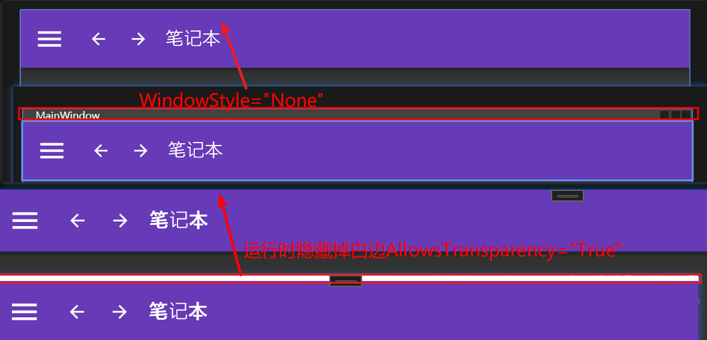
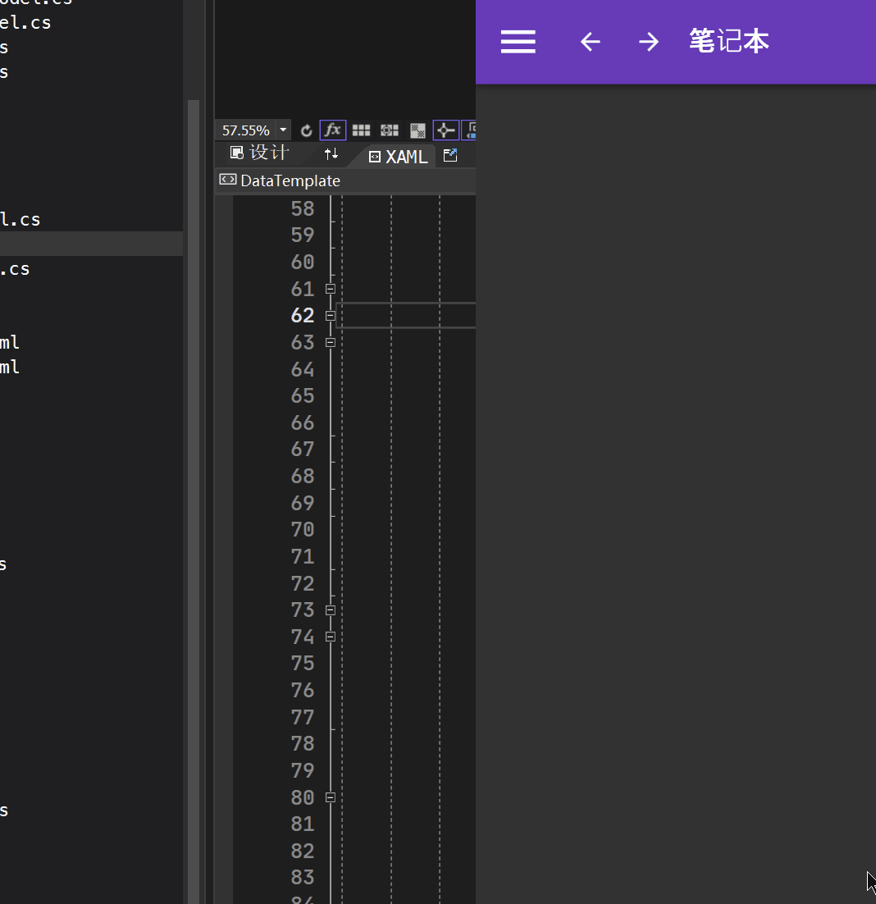
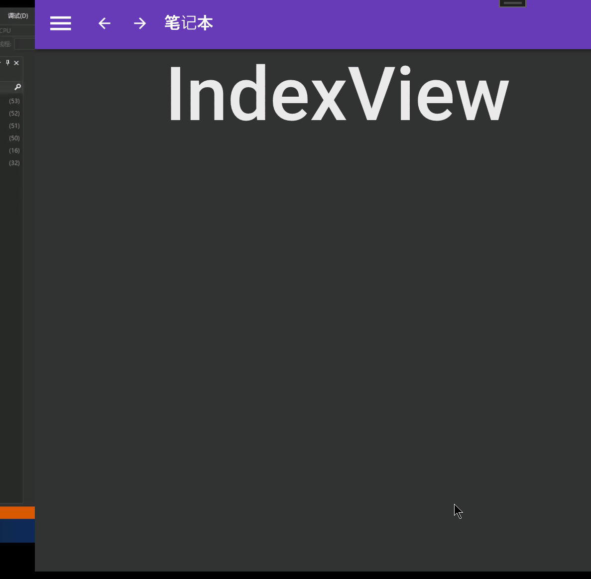
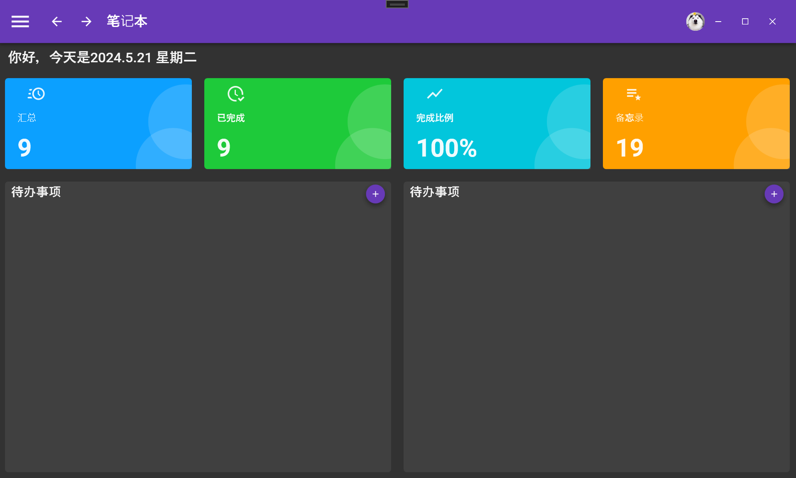
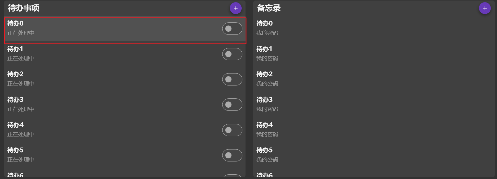
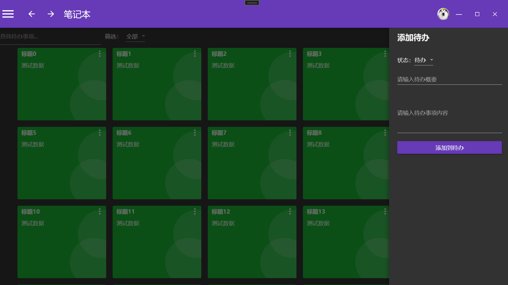

## 1、依赖安装

1）安装prism

```bash
NuGet\Install-Package Prism.DryIoc -Version 8.1.97
```

2）删除原来的MainWindow，将MainWindow移到Views文件夹下，MainWindow的页面代码如下：

```xml
<Window x:Class="LoginTest.Views.MainWindow"
        xmlns="http://schemas.microsoft.com/winfx/2006/xaml/presentation"
        xmlns:x="http://schemas.microsoft.com/winfx/2006/xaml"
        xmlns:d="http://schemas.microsoft.com/expression/blend/2008"
        xmlns:mc="http://schemas.openxmlformats.org/markup-compatibility/2006"
        xmlns:local="clr-namespace:LoginTest.Views"
        xmlns:prism="http://prismlibrary.com/"
        prism:ViewModelLocator.AutoWireViewModel="True"
        mc:Ignorable="d"
        Title="MainWindow" Height="700" Width="1200">
    <Grid>
        <TextBlock Text="这是登录成功后的界面" FontSize="40"></TextBlock>
    </Grid>
</Window>
```

3）引用prism，修改app.xaml

```xml
<prism:PrismApplication x:Class="LoginTest.App" xmlns="http://schemas.microsoft.com/winfx/2006/xaml/presentation"
                        xmlns:x="http://schemas.microsoft.com/winfx/2006/xaml" xmlns:local="clr-namespace:LoginTest"
                        xmlns:materialDesign="http://materialdesigninxaml.net/winfx/xaml/themes" xmlns:prism="http://prismlibrary.com/">
    <Application.Resources>
        <ResourceDictionary>
            <ResourceDictionary.MergedDictionaries>
                <materialDesign:BundledTheme BaseTheme="Dark" PrimaryColor="DeepPurple"
                                             SecondaryColor="Lime" />
                <ResourceDictionary Source="pack://application:,,,/MaterialDesignThemes.Wpf;component/Themes/MaterialDesign3.Defaults.xaml" />
            </ResourceDictionary.MergedDictionaries>
        </ResourceDictionary>
    </Application.Resources>
</prism:PrismApplication>
```

4）修改app.xmal.cs

```c#
using System.Configuration;
using System.Data;
using System.Windows;
using LoginTest.ViewModels;
using LoginTest.Views;
using Prism.DryIoc;
using Prism.Ioc;
using Prism.Services.Dialogs;

namespace LoginTest
{
    /// <summary>
    /// Interaction logic for App.xaml
    /// </summary>
    public partial class App : PrismApplication
    {
        /// <summary>
        /// 注册服务
        /// </summary>
        /// <param name="containerRegistry"></param>
        protected override void RegisterTypes(IContainerRegistry containerRegistry)
        {
           
            
        }
        /// <summary>
        /// 设置启动窗口
        /// </summary>
        /// <returns></returns>
        protected override Window CreateShell()
        {
            return Container.Resolve<MainWindow>();
        }
    }
}
```

5）下载MaterialDesignThemes组件

```bash
NuGet\Install-Package MaterialDesignThemes -Version 5.0.1-ci633
```

使用说明：

https://github.com/MaterialDesignInXAML/MaterialDesignInXamlToolkit/wiki/Getting-Started

MaterialDesignThemes是一个针对WPF应用程序的开源UI框架，它提供了一套现代化的、基于Google Material Design风格的控件和样式。提供了丰富的控件和样式，包括按钮、文本框、下拉框、卡片、对话框等。这些控件都遵循Material Design的设计原则，具有醒目的颜色、扁平化的外观和动感的交互效果。

除了控件和样式，MaterialDesignThemes还提供了一些附加功能，如主题管理、阴影效果、图标集等。它还包含了一些实用的工具和扩展，帮助开发人员更轻松地使用和定制Material Design风格的界面。

使用MaterialDesignThemes框架，开发人员可以快速构建具有现代化外观和动态效果的WPF应用程序。通过简单的XAML标记，开发人员可以应用预定义的样式和主题，或者根据自己的需求进行自定义。

6）在app.xaml中引用组件，使用其中的资源

```xml
<prism:PrismApplication x:Class="LoginTest.App" xmlns="http://schemas.microsoft.com/winfx/2006/xaml/presentation"
                        xmlns:x="http://schemas.microsoft.com/winfx/2006/xaml" xmlns:local="clr-namespace:LoginTest"
                        xmlns:materialDesign="http://materialdesigninxaml.net/winfx/xaml/themes" xmlns:prism="http://prismlibrary.com/">
    <Application.Resources>
        <ResourceDictionary>
            <ResourceDictionary.MergedDictionaries>
                <materialDesign:BundledTheme BaseTheme="Dark" PrimaryColor="DeepPurple"
                                             SecondaryColor="Lime" />
                <ResourceDictionary Source="pack://application:,,,/MaterialDesignThemes.Wpf;component/Themes/MaterialDesign3.Defaults.xaml" />
            </ResourceDictionary.MergedDictionaries>
        </ResourceDictionary>
    </Application.Resources>
</prism:PrismApplication>
```

7）设置主窗口的字体

这些将确保窗口使用 Material Design 颜色，与 Toolkit 的样式和组件很好地融合在一起。但是，为了获得完整的 Material Design 体验，您应该按如下方式设置字体：

```xml
<Window [...]
        xmlns:materialDesign="http://materialdesigninxaml.net/winfx/xaml/themes"
        TextElement.Foreground="{DynamicResource MaterialDesign.Brush.Foreground}"
        Background="{DynamicResource MaterialDesign.Brush.Background}"
        TextElement.FontWeight="Medium"
        TextElement.FontSize="14"
        FontFamily="{materialDesign:MaterialDesignFont}"
        [...] >
```

如果想拉取源码并运行Demo样例，则需要按照下面的说明配置具体的环境

https://github.com/MaterialDesignInXAML/MaterialDesignInXamlToolkit/wiki/Compiling-From-Source


## 2、设计登录后主窗体的导航栏

```xml
<Window x:Class="MyTodo.MainWindow" xmlns="http://schemas.microsoft.com/winfx/2006/xaml/presentation"
        xmlns:x="http://schemas.microsoft.com/winfx/2006/xaml" xmlns:d="http://schemas.microsoft.com/expression/blend/2008"
        xmlns:local="clr-namespace:MyTodo" xmlns:materialDesign="http://materialdesigninxaml.net/winfx/xaml/themes"
        xmlns:mc="http://schemas.openxmlformats.org/markup-compatibility/2006" xmlns:wpf="http://materialdesigninxaml.net/winfx/xaml/themes"
        Title="MainWindow" Width="1280"
        Height="768" AllowsTransparency="True"
        Background="{DynamicResource MaterialDesign.Brush.Background}"
        FontFamily="{wpf:MaterialDesignFont}"
        TextElement.FontSize="14" TextElement.FontWeight="Medium"
        TextElement.Foreground="{DynamicResource MaterialDesign.Brush.Foreground}"
        WindowStartupLocation="CenterScreen" WindowStyle="None"
        mc:Ignorable="d">
    <materialDesign:DialogHost DialogTheme="Inherit" Identifier="RootDialog"
                               SnackbarMessageQueue="{Binding ElementName=MainSnackbar, Path=MessageQueue}">

        <materialDesign:DrawerHost IsLeftDrawerOpen="{Binding ElementName=MenuToggleButton, Path=IsChecked}">
            <!--  左侧的抽屉  -->
            <materialDesign:DrawerHost.LeftDrawerContent>
                <DockPanel MinWidth="220" />
            </materialDesign:DrawerHost.LeftDrawerContent>

            <DockPanel>
                <materialDesign:ColorZone x:Name="ColorZone" Padding="16"
                                          materialDesign:ElevationAssist.Elevation="Dp4" DockPanel.Dock="Top"
                                          Mode="PrimaryMid">
                    <!--  左侧功能按钮  -->
                    <DockPanel LastChildFill="False">
                        <StackPanel Orientation="Horizontal">
                            <!--  菜单  -->
                            <ToggleButton x:Name="MenuToggleButton" AutomationProperties.Name="HamburgerToggleButton"
                                          IsChecked="False"
                                          Style="{StaticResource MaterialDesignHamburgerToggleButton}" />
                            <!--  回退  -->
                            <Button Margin="24,0,0,0"
                                    materialDesign:RippleAssist.Feedback="{Binding RelativeSource={RelativeSource Self}, Path=Foreground, Converter={StaticResource BrushRoundConverter}}"
                                    Command="{Binding MovePrevCommand}"
                                    Content="{materialDesign:PackIcon Kind=ArrowLeft,
                                                                      Size=24}"
                                    Foreground="{Binding RelativeSource={RelativeSource AncestorType={x:Type FrameworkElement}}, Path=(TextElement.Foreground)}"
                                    Style="{StaticResource MaterialDesignToolButton}"
                                    ToolTip="Previous Item" />
                            <!--  前进  -->
                            <Button Margin="16,0,0,0"
                                    materialDesign:RippleAssist.Feedback="{Binding RelativeSource={RelativeSource Self}, Path=Foreground, Converter={StaticResource BrushRoundConverter}}"
                                    Command="{Binding MoveNextCommand}"
                                    Content="{materialDesign:PackIcon Kind=ArrowRight,
                                                                      Size=24}"
                                    Foreground="{Binding RelativeSource={RelativeSource AncestorType={x:Type FrameworkElement}}, Path=(TextElement.Foreground)}"
                                    Style="{StaticResource MaterialDesignToolButton}"
                                    ToolTip="Next Item" />
                            <!--  标题  -->
                            <TextBlock Margin="16,0" HorizontalAlignment="Center"
                                       VerticalAlignment="Center" AutomationProperties.Name="Material Design In XAML Toolkit"
                                       FontSize="22" Text="笔记本" />
                        </StackPanel>
                        <!--  右侧功能按钮  -->
                        <StackPanel DockPanel.Dock="Right" Orientation="Horizontal">
                            <!--  头像  -->
                            <Image Width="25" Height="25"
                                   Source="/Images/Husky.jpg">
                                <!--  图片将只显示在椭圆形状的区域内，其余部分将被剪裁掉  -->
                                <Image.Clip>
                                    <!--使用<Image.Clip>属性来定义剪裁区域-->
                                    <EllipseGeometry Center="12.5,12.5" RadiusX="12.5"
                                                     RadiusY="12.5" />
                                </Image.Clip>
                            </Image>
                            <Button x:Name="btnMin" Content="—"
                                    Style="{StaticResource MaterialDesignFlatMidBgButton}" />
                            <Button x:Name="btnMax" Content="☐"
                                    Style="{StaticResource MaterialDesignFlatMidBgButton}" />
                            <Button x:Name="btnClose" Content="✕"
                                    Style="{StaticResource MaterialDesignFlatMidBgButton}" />
                        </StackPanel>
                    </DockPanel>
                </materialDesign:ColorZone>

            </DockPanel>
        </materialDesign:DrawerHost>
    </materialDesign:DialogHost>
</Window>

```

1）设置主窗口的样式

这些属性设置了窗口的标题、宽度、高度、是否允许透明度、启动位置和窗口样式。

- `Title` 设置窗口的标题为 "MainWindow"。
- `Width` 和 `Height` 分别设置窗口的宽度和高度为 1280 和 768 像素。
- `AllowsTransparency` 设置窗口是否允许透明度，为 `True` 表示允许透明度。
- `WindowStartupLocation` 设置窗口启动位置为屏幕中央。
- `WindowStyle` 设置窗口样式为无边框。

```xml
<Window [...]
        xmlns:wpf="http://materialdesigninxaml.net/winfx/xaml/themes"
        Title="MainWindow" Width="1280"
        Height="768" AllowsTransparency="True"
        WindowStartupLocation="CenterScreen" WindowStyle="None"
        [...] >
```



由于右侧的 缩小、放大、关闭按钮没有绑定ViewModel的需求，所以直接设计三个click事件进行处理，在MainView.xaml.cs中

```C#
using System;
using System.Collections.Generic;
using System.Linq;
using System.Text;
using System.Threading.Tasks;
using System.Windows;
using System.Windows.Controls;
using System.Windows.Data;
using System.Windows.Documents;
using System.Windows.Input;
using System.Windows.Media;
using System.Windows.Media.Imaging;
using System.Windows.Shapes;

namespace MyTodo.Views
{
    /// <summary>
    /// MainView.xaml 的交互逻辑
    /// </summary>
    public partial class MainView : Window
    {
        public MainView()
        {
            InitializeComponent();
            btnMin.Click += (s, e) =>
            {
                this.WindowState = WindowState.Minimized;
            };
            btnMax.Click += (s, e) =>
            {
                if (this.WindowState == WindowState.Maximized)
                    this.WindowState = WindowState.Normal;
                else
                    this.WindowState = WindowState.Maximized;

            };
            btnClose.Click += (s, e) =>
            {
                this.Close();
            };
            ColorZone.MouseMove += (s, e) =>
            {
                if (e.LeftButton == MouseButtonState.Pressed)
                {
                    this.DragMove();
                }
            };
            ColorZone.MouseDoubleClick += (s, e) =>
            {
                if (this.WindowState == WindowState.Maximized)
                    this.WindowState = WindowState.Normal;
                else
                    this.WindowState = WindowState.Maximized;
            }; ;
        }
        
    }
}
```

## 3、设置左侧菜单的弹出

1）将MainWindow删除，在Views文件夹下新建MainView，将代码迁移过去

2）在主页面中设计左侧抽屉的样式

```xml
 <!--  左侧的抽屉  -->
            <materialDesign:DrawerHost.LeftDrawerContent>
                <DockPanel MinWidth="220" />
            </materialDesign:DrawerHost.LeftDrawerContent>
```

改为

```xml
    <!--  左侧的抽屉  -->
<materialDesign:DrawerHost.LeftDrawerContent>
    <DockPanel MinWidth="220">
        <!--  顶部的头像+昵称  -->
        <StackPanel Margin="0,20" DockPanel.Dock="Top">

            <Image Width="50" Height="50"
                   Source="/Images/Husky.jpg">
                <!--  图片将只显示在椭圆形状的区域内，其余部分将被剪裁掉  -->
                <Image.Clip>
                    <!--使用<Image.Clip>属性来定义剪裁区域-->
                    <EllipseGeometry Center="25,25" RadiusX="25"
                                     RadiusY="25" />
                </Image.Clip>
            </Image>
            <TextBlock Margin="0,10" HorizontalAlignment="Center"
                       Text="Eleanora" />
        </StackPanel>
        <!--  菜单列表  -->
        <ListBox ItemContainerStyle="{StaticResource MyListBoxItemStyle}" ItemsSource="{Binding MenuBars}">
            <ListBox.ItemTemplate>
                <DataTemplate>
                    <StackPanel Background="Transparent" Orientation="Horizontal">
                        <materialDesign:PackIcon Margin="10,0" Kind="{Binding Icon}" />
                        <TextBlock Margin="10,0" Text="{Binding Title}" />
                    </StackPanel>
                </DataTemplate>
            </ListBox.ItemTemplate>
        </ListBox>
    </DockPanel>
</materialDesign:DrawerHost.LeftDrawerContent>
```

注意要将文件夹下的图片属性改为资源

3）在App.xaml中添加ListBoxItem的样式，使得点击的时候左侧显示高亮条，同时背景色也变化

```xml
  <!--  设置ListBoxItem的样式  -->
  <Style x:Key="MyListBoxItemStyle" TargetType="ListBoxItem">
      <Setter Property="MinHeight" Value="40" />
      <!--  设计ControlTemplate控件模版的算法逻辑  -->
      <Setter Property="Template">
          <Setter.Value>
              <ControlTemplate TargetType="{x:Type ListBoxItem}">
                  <Grid>
                      <Border x:Name="borderHeader" />
                      <Border x:Name="border" />
                      <!--  显示ListBoxItem的内容：水平对齐垂直对齐方式同ListBoxItem  -->
                      <ContentPresenter HorizontalAlignment="{TemplateBinding HorizontalAlignment}" VerticalAlignment="{TemplateBinding VerticalContentAlignment}" />
                  </Grid>
                  <ControlTemplate.Triggers>
                      <!--  选中列表项时左侧边框厚度为4，边框颜色随系统颜色；背景色设置透明度为0.2，颜色随系统变化  -->
                      <Trigger Property="IsSelected" Value="True">
                          <Setter TargetName="borderHeader" Property="BorderThickness" Value="4,0,0,0" />
                          <Setter TargetName="borderHeader" Property="BorderBrush" Value="{DynamicResource MaterialDesign.Brush.Primary.Light}" />
                          <Setter TargetName="border" Property="Background" Value="{DynamicResource MaterialDesign.Brush.Primary.Light}" />
                          <Setter TargetName="border" Property="Opacity" Value="0.2" />
                      </Trigger>
                      <Trigger Property="IsMouseOver" Value="True">
                          <Setter TargetName="border" Property="Background" Value="{DynamicResource MaterialDesign.Brush.Primary.Light}" />
                          <Setter TargetName="border" Property="Opacity" Value="0.2" />
                      </Trigger>
                  </ControlTemplate.Triggers>
              </ControlTemplate>
          </Setter.Value>
      </Setter>
  </Style>
```

4）新建一个类MenuBar作为数据源格式来存储列表项，新建一个Common文件夹，在其中新建一个Models文件夹，新建MenuBar类

```C#
using System;
using System.Collections.Generic;
using System.Linq;
using System.Text;
using System.Threading.Tasks;
using Prism.Mvvm;

namespace MyTodo.Common.Models
{
	
	/// <summary>
	/// 系统导航菜单实体类
	/// </summary>
    public class MenuBar:BindableBase
    {
		private string icon;
		/// <summary>
		/// 菜单图标
		/// </summary>
		public string Icon
		{
			get { return icon; }
			set { icon = value; }
		}
		private string title;
		/// <summary>
		/// 菜单名称
		/// </summary>
		public string Title
		{
			get { return title; }
			set { title = value; }
		}
		/// <summary>
		/// 菜单命名空间
		/// </summary>
		private string nameSpace;

		public string NameSpace
		{
			get { return nameSpace; }
			set { nameSpace = value; }
		}

	}
}
```

5）绑定的MainView的ViewModel即MainViewModel

```C#
using System;
using System.Collections.Generic;
using System.Collections.ObjectModel;
using System.Linq;
using System.Text;
using System.Threading.Tasks;
using MyTodo.Common.Models;
using Prism.Mvvm;

namespace MyTodo.ViewModels
{
    public class MainViewModel : BindableBase
    {
        //构造函数中初始化列表
        public MainViewModel()
        {
            MenuBars = new ObservableCollection<MenuBar>();
            CreateMenuBar();
        }
        //数据属性：ListBox的数据源
        private ObservableCollection<MenuBar> menuBars;

        public ObservableCollection<MenuBar> MenuBars
        {
            get { return menuBars; }
            set { menuBars = value; RaisePropertyChanged(); }
        }
        //初始化数据的方法
        void CreateMenuBar()
        {
            MenuBars.Add(new MenuBar() { Icon = "Home", Title = "首页", NameSpace = "IndexView" });
            MenuBars.Add(new MenuBar() { Icon = "NotebookOutline", Title = "待办事项", NameSpace = "TodoView" });
            MenuBars.Add(new MenuBar() { Icon = "NotebookPlus", Title = "备忘录", NameSpace = "MemoView" });
            MenuBars.Add(new MenuBar() { Icon = "Cog", Title = "设置", NameSpace = "SettingsView" });
        }
    }
}
```

- `ObservableCollection` 是 `List` 的一个特殊化版本，实现了 `INotifyCollectionChanged` 接口。这意味着 `ObservableCollection` 可以在集合发生变化时自动通知绑定到它的界面元素进行更新。当集合中的元素发生添加、删除或重新排序时，界面会自动更新以反映这些变化。

效果：



## 4、左侧抽屉列表绑定页面的导航

现在实现左侧抽屉切换导航时，主窗口页面的切换


1）搞四个UserControl（IndexView、TodoView、MemoView、SettingsView）放到Views文件夹下，作为之前初始化菜单绑定的NameSpace

```C#
void CreateMenuBar()
{
    MenuBars.Add(new MenuBar() { Icon = "Home", Title = "首页", NameSpace = "IndexView" });
    MenuBars.Add(new MenuBar() { Icon = "NotebookOutline", Title = "待办事项", NameSpace = "TodoView" });
    MenuBars.Add(new MenuBar() { Icon = "NotebookPlus", Title = "备忘录", NameSpace = "MemoView" });
    MenuBars.Add(new MenuBar() { Icon = "Cog", Title = "设置", NameSpace = "SettingsView" });
}
```

以IndexView为例，添加一个TextBlock方便区分这个四个页面

```xml
<UserControl x:Class="MyTodo.Views.IndexView" xmlns="http://schemas.microsoft.com/winfx/2006/xaml/presentation"
             xmlns:x="http://schemas.microsoft.com/winfx/2006/xaml" xmlns:d="http://schemas.microsoft.com/expression/blend/2008"
             xmlns:local="clr-namespace:MyTodo.Views" xmlns:mc="http://schemas.openxmlformats.org/markup-compatibility/2006"
             d:DesignHeight="450" d:DesignWidth="800"
             mc:Ignorable="d">
    <Grid>
        <TextBlock FontSize="100" Text="       IndexView" />

    </Grid>
</UserControl>
```

2）同理，在ViewModels文件夹下，添加四个ViewModel（IndexViewModel、TodoViewModel、MemoViewModel、SettingsViewModel）

3）app.xaml.cs中的依赖注入中，将这四个页面都注册为导航页面

```C#
using System.Configuration;
using System.Data;
using System.Windows;
using MyTodo.ViewModels;
using MyTodo.Views;
using Prism.DryIoc;
using Prism.Ioc;

namespace MyTodo
{
    /// <summary>
    /// Interaction logic for App.xaml
    /// </summary>
    public partial class App : PrismApplication
    {
        protected override void RegisterTypes(IContainerRegistry containerRegistry)
        {
            //注册导航目录
            containerRegistry.RegisterForNavigation<IndexView,IndexViewModel>();
            containerRegistry.RegisterForNavigation<MemoView, MemoViewModel>();
            containerRegistry.RegisterForNavigation<SettingsView, SettingsViewModel>();
            containerRegistry.RegisterForNavigation<TodoView, TodoViewModel>();
        }

        protected override Window CreateShell()
        {
            return Container.Resolve<MainView>();
        }
    }
}
```

4）在MainViewModel中增加3个命令属性

- NavigateCommand 驱动导航（绑定参数为MenuBar的NavigateAction方法）
- GoBackCommand 后退（构造函数中使用匿名方法）
- GoForwardCommand 前进（构造函数中使用匿名方法）

NavigateCommand 中需要 使用IRegionManager 找到导航的目标区域，所以这里要在构造函数中增加_regionManager的依赖注入。

前进后退需要NavigateJournal记录导航日志，所以在每次导航成功，都需要重新更新NavigateJournal

```C#
using System;
using System.Collections.Generic;
using System.Collections.ObjectModel;
using System.Linq;
using System.Text;
using System.Threading.Tasks;
using MyTodo.Common.Models;
using MyTodo.Extensions;
using Prism.Commands;
using Prism.Mvvm;
using Prism.Regions;

namespace MyTodo.ViewModels
{
    public class MainViewModel : BindableBase
    {
        //依赖注入_regionManager
        private readonly IRegionManager _regionManager;

        //构造函数中初始化列表
        public MainViewModel(IRegionManager regionManager)
        {
            //依赖注入_regionManager
            _regionManager = regionManager;
            //初始化左侧抽屉菜单
            MenuBars = new ObservableCollection<MenuBar>();
            InitialMenuBar();
            //绑定前进后退命令执行的方法
            NavigateCommand = new DelegateCommand<MenuBar>(NavigateAction);
            //绑定前进后退命令执行的方法/操作
            GoBackCommand = new DelegateCommand(() =>
            {
                if (NavigateJournal != null && NavigateJournal.CanGoBack) NavigateJournal.GoBack();
            });
            GoForwardCommand = new DelegateCommand(() =>
            {
                if (NavigateJournal != null && NavigateJournal.CanGoForward) NavigateJournal.GoForward();
            });
        }


        //命令属性：驱动导航
        public DelegateCommand<MenuBar> NavigateCommand { get; set; }
        //命令属性：后退
        public DelegateCommand GoBackCommand { get; set; }
        //命令属性：前进
        public DelegateCommand GoForwardCommand { get; set; }
        //数据属性：ListBox的数据源
        private ObservableCollection<MenuBar> menuBars;
        // 普通成员变量
        private IRegionNavigationJournal NavigateJournal;

        public ObservableCollection<MenuBar> MenuBars
        {
            get { return menuBars; }
            set { menuBars = value; RaisePropertyChanged(); }
        }
        //初始化数据的方法
        void InitialMenuBar()
        {
            MenuBars.Add(new MenuBar() { Icon = "Home", Title = "首页", NameSpace = "IndexView" });
            MenuBars.Add(new MenuBar() { Icon = "NotebookOutline", Title = "待办事项", NameSpace = "TodoView" });
            MenuBars.Add(new MenuBar() { Icon = "NotebookPlus", Title = "备忘录", NameSpace = "MemoView" });
            MenuBars.Add(new MenuBar() { Icon = "Cog", Title = "设置", NameSpace = "SettingsView" });
        }
        //导航命令执行的具体操作
        private void NavigateAction(MenuBar obj)
        {
            if (obj == null || string.IsNullOrWhiteSpace(obj.NameSpace))
                return;
            _regionManager.Regions[PrismManager.MainViewRegionName].RequestNavigate(obj.NameSpace, back =>
            {
                NavigateJournal = back.Context.NavigationService.Journal;
            });

        }
    }
}
```

5）将命令属性绑定到页面

```xml
<!--  回退  -->
<Button [...]
        Command="{Binding GoBackCommand}"
        [...]/>
<!--  前进  -->
<Button [...]
        Command="{Binding GoForwardCommand}"
        [...]/>
<!--  菜单列表  -->
<ListBox x:Name="menuBar"
         ItemContainerStyle="{StaticResource MyListBoxItemStyle}"
         ItemsSource="{Binding MenuBars}">
    <!--设置触发-->
    <i:Interaction.Triggers>
        <i:EventTrigger EventName="SelectionChanged">
            <!--将menuBar作为参数，传给NavigateCommand命令-->
            <i:InvokeCommandAction Command="{Binding NavigateCommand}" CommandParameter="{Binding ElementName=menuBar, Path=SelectedItem}" />
        </i:EventTrigger>
    </i:Interaction.Triggers>
  	...
</ListBox>
```

6）当列表选中项变化时，关闭左侧抽屉。`x:Name="drawerHost"`

```xml
<materialDesign:DrawerHost x:Name="drawerHost" IsLeftDrawerOpen="{Binding ElementName=MenuToggleButton, Path=IsChecked}">
    <materialDesign:DrawerHost.LeftDrawerContent>
```

在MainView.cs中绑定触发事件

```C#
using System;
using System.Collections.Generic;
using System.Linq;
using System.Text;
using System.Threading.Tasks;
using System.Windows;
using System.Windows.Controls;
using System.Windows.Data;
using System.Windows.Documents;
using System.Windows.Input;
using System.Windows.Media;
using System.Windows.Media.Imaging;
using System.Windows.Shapes;

namespace MyTodo.Views
{
    /// <summary>
    /// MainView.xaml 的交互逻辑
    /// </summary>
    public partial class MainView : Window
    {
        public MainView()
        {
            InitializeComponent();
            ...
            //鼠标点击切换左侧抽屉导航时，关闭抽屉
            menuBar.SelectionChanged += (s, e) =>
            {
                drawerHost.IsLeftDrawerOpen = false;
            };
        }
        
    }
}

```

7）效果：



## 5、IndexView首页布局设计

1）分析下图效果图的布局，可以大致分为第0行的文字列、第1行快捷目录、第2行的卡片列表



```xml
<UserControl x:Class="MyTodo.Views.IndexView" xmlns="http://schemas.microsoft.com/winfx/2006/xaml/presentation"
             xmlns:x="http://schemas.microsoft.com/winfx/2006/xaml" xmlns:d="http://schemas.microsoft.com/expression/blend/2008"
             xmlns:local="clr-namespace:MyTodo.Views" xmlns:materialDesign="http://materialdesigninxaml.net/winfx/xaml/themes"
             xmlns:mc="http://schemas.openxmlformats.org/markup-compatibility/2006" d:DesignHeight="450"
             d:DesignWidth="800" mc:Ignorable="d">
    <Grid>
        <!--  初始化布局为三行  -->
        <Grid.RowDefinitions>
            <RowDefinition Height="Auto" />
            <RowDefinition Height="Auto" />
            <RowDefinition />
        </Grid.RowDefinitions>
        <!--  第0行的文字行  -->
        <TextBlock Margin="15,10" FontSize="22"
                   Text="你好，今天是2024.5.21 星期二" />
       <!--  第1行的文字行  -->
       <!--  第2行的文字行  -->
    </Grid>
</UserControl>
```

2）第1行是四个结构类似的部分，所以将这个部分单独拿出来分析，将卡片的内容抽象为类`TaskBar`，属性包括图标、标题、数字、背景色、点击后跳转的目标导航，如下：

```C#
using System;
using System.Collections.Generic;
using System.Linq;
using System.Text;
using System.Threading.Tasks;

namespace MyTodo.Common.Models
{
    /// <summary>
    /// 任务栏
    /// </summary>
    public class TaskBar
    {
        private string icon;
        private string title;
        private string content;
        private string color;
        private string target;
        /// <summary>
        /// 图标
        /// </summary>
        public string Icon
        {
            get { return icon; }
            set { icon = value; }
        }
        /// <summary>
        /// 标题
        /// </summary>
        public string Title
        {
            get { return title; }
            set { title = value; }
        }
        /// <summary>
        /// 内容
        /// </summary>
        public string Content
        {
            get { return content; }
            set { content = value; }
        }
        /// <summary>
        /// 颜色
        /// </summary>
        public string Color
        {
            get { return color; }
            set { color = value; }
        }
        /// <summary>
        /// 触发目标
        /// </summary>
        public string Target
        {
            get { return target; }
            set { target = value; }
        }
    }
}
```

3）在IndexViewModel中初始化此处显示的集合对象

```C#
using System;
using System.Collections.Generic;
using System.Collections.ObjectModel;
using System.Linq;
using System.Text;
using System.Threading.Tasks;
using MyTodo.Common.Models;
using Prism.Mvvm;

namespace MyTodo.ViewModels
{
    public class IndexViewModel : BindableBase
    {
        public IndexViewModel()
        {
            //初始化构造函数时，初始化数据属性taskBars
            TaskBars = new ObservableCollection<TaskBar>();  
            InitialTaskBars();
        }
        //新增数据属性taskBars
        private ObservableCollection<TaskBar> taskBars;

        public ObservableCollection<TaskBar> TaskBars
        {
            get { return taskBars; }
            set { taskBars = value; RaisePropertyChanged();}
        }
		//初始化快捷卡片
        void InitialTaskBars()
        {
            TaskBars.Add(new TaskBar(){Icon = "ClockFast",Title = "汇总",Content = "9",Color= "#FF0CA0FF",Target = ""});
            TaskBars.Add(new TaskBar(){Icon = "ClockCheckOutline",Title = "已完成",Content = "9", Color = "#FF1ECA3A", Target = ""});
            TaskBars.Add(new TaskBar(){Icon = "ChartLineVariant",Title = "完成比例",Content = "100%", Color = "#FF02C6DC", Target = ""});
            TaskBars.Add(new TaskBar(){Icon = "PlaylistStar",Title = "备忘录",Content = "19", Color = "#FFFFA000", Target = ""});
        }
    }
}

```

4）设计具体的xaml页面，四个相同的Item，可以使用自定义集合控件ItemsControl实现

`ItemsControl` 是一个在 WPF 和 UWP 中常用的控件，它用于显示一个集合中的项。`ItemsControl` 是一个抽象类，它提供了用于呈现和布局项的基本功能，但本身不能直接实例化。

`ItemsControl` 提供了以下主要属性和功能：

1. `ItemsSource`：用于设置 `ItemsControl` 的数据源，可以是实现了 `IEnumerable` 接口的集合对象，如 `List`、`ObservableCollection` 等。
2. `ItemTemplate`：用于定义每个项如何显示的数据模板。可以使用 `DataTemplate` 类来创建自定义的项模板。
3. `ItemContainerStyle`：用于设置每个项的样式。
4. `ItemContainerStyleSelector`：用于根据项的属性选择不同的样式。
5. `ItemsPanel`：用于定义项的布局面板。可以使用 `ItemsPanelTemplate` 类来创建自定义的布局面板，如 `StackPanel`、`Grid` 等。
6. `ItemsPanelTemplate`：用于创建自定义的布局面板模板。
7. `ItemStringFormat`：用于指定项的字符串格式化方式。

每个卡片用Border设置背景色

```xml
<!--  第0行的文字行，四列卡片的快捷跳转  -->
<ItemsControl Grid.Row="1" ItemsSource="{Binding TaskBars}">
    <!--  集合中有四列  -->
    <ItemsControl.ItemsPanel>
        <ItemsPanelTemplate>
            <UniformGrid Columns="4" />
        </ItemsPanelTemplate>
    </ItemsControl.ItemsPanel>
    <!--  设计数据样式  -->
    <ItemsControl.ItemTemplate>
        <DataTemplate>
            <Border Margin="10"
                    Background="{Binding Color}"
                    CornerRadius="5">
                <!--设置鼠标悬浮的样式-->
                <Border.Style>
                    <Style TargetType="Border">
                        <Style.Triggers>
                            <Trigger Property="IsMouseOver" Value="True">
                                <Setter Property="Effect">
                                    <Setter.Value>
                                        <DropShadowEffect BlurRadius="10" 
                                                          ShadowDepth="1"
                                                          Color="#DDDDDD" />
                                    </Setter.Value>
                                </Setter>
                            </Trigger>
                        </Style.Triggers>
                    </Style>
                </Border.Style>
                <!--  Border的Content只能放一个，所以套一层Grid  -->
                <Grid>
                    <!--  每个卡片构成  -->
                    <StackPanel Margin="20,10">
                        <materialDesign:PackIcon Width="30" Height="30"
                                                 Kind="{Binding Icon}" />
                        <TextBlock Margin="0,15" FontSize="15"
                                   Text="{Binding Title}" />
                        <TextBlock FontSize="40" FontWeight="Bold"
                                   Text="{Binding Content}" />
                    </StackPanel>
                    <!--  画出卡片右下角的水印圈圈  -->
                    <Canvas ClipToBounds="True">
                        <Border Canvas.Top="10" Canvas.Right="-50"
                                Width="120" Height="120"
                                Background="#ffffff" CornerRadius="100"
                                Opacity="0.15" />
                        <Border Canvas.Top="80" Canvas.Right="-30"
                                Width="120" Height="120"
                                Background="#ffffff" CornerRadius="100"
                                Opacity="0.15" />
                    </Canvas>
                </Grid>
            </Border>
        </DataTemplate>
    </ItemsControl.ItemTemplate>
</ItemsControl>
```

5）第2行是两个大卡片，设计完第一个copy出第二个

```xml
<Grid Grid.Row="2" Margin="0,10">
    <Grid.ColumnDefinitions>
        <ColumnDefinition />
        <ColumnDefinition />
    </Grid.ColumnDefinitions>
    <Border Margin="10,0" Background="#BEBEBE"
            CornerRadius="5" Opacity="0.1" />
    <DockPanel Margin="10,0">
        <!--  第一行的卡片标题和按钮  -->
        <DockPanel Margin="10,5" DockPanel.Dock="Top"
                   LastChildFill="False">
            <TextBlock FontSize="20" FontWeight="Bold"
                       Text="待办事项" />
            <Button Width="30" Height="30"
                    VerticalAlignment="Top" DockPanel.Dock="Right"
                    Style="{StaticResource MaterialDesignFloatingActionButton}">
                <materialDesign:PackIcon Kind="Add" />
            </Button>
        </DockPanel>
        <!--  卡片列表  -->
        <ListBox />
    </DockPanel>
    <Border Grid.Column="1" Margin="10,0"
            Background="#BEBEBE" CornerRadius="5"
            Opacity="0.1" />
    <DockPanel Grid.Column="1" Margin="10,0">
        <!--  第一行的卡片标题和按钮  -->
        <DockPanel Margin="10,5" DockPanel.Dock="Top"
                   LastChildFill="False">
            <TextBlock FontSize="20" FontWeight="Bold"
                       Text="待办事项" />
            <Button Width="30" Height="30"
                    VerticalAlignment="Top" DockPanel.Dock="Right"
                    Style="{StaticResource MaterialDesignFloatingActionButton}">
                <materialDesign:PackIcon Kind="Add" />
            </Button>
        </DockPanel>
        <!--  卡片列表  -->
        <ListBox />
    </DockPanel>
</Grid>
```

## 6、IndexView首页下方待办事项、备忘录卡片内部设计

上面已经实现了待办事项卡片的第一行，由TextBlock+Icon组成

剩下的就是一个ListBox，并重写设计ListBoxItem的Datatemplate，图片可只左边为两行字，右边为一个ToggleButton，左右布局使用DockPanel。最晚层就是DockPanel，左边部分又是一个Stackpanel，其中每一个项由一个类对象组成。



1）xaml代码如下：

```xml
<!--  卡片列表  -->
<ListBox ItemsSource="{Binding TodoList}" ScrollViewer.VerticalScrollBarVisibility="Hidden"
         HorizontalContentAlignment="Stretch">
    <!--重新设计ListBoxItem的显示模版-->
    <ListBox.ItemTemplate>
        <DataTemplate>
            <!--左右布局，左边对象，右边按钮-->
            <DockPanel MaxHeight="80" LastChildFill="False">
                <ToggleButton DockPanel.Dock="Right"></ToggleButton>
                <StackPanel >
                    <TextBlock FontSize="16" FontWeight="Bold"
                               Text="{Binding Title}" />
                    <TextBlock Margin="0,5" Opacity="0.5"
                               Text="{Binding Content}" />
                </StackPanel>
            </DockPanel>
        </DataTemplate>
    </ListBox.ItemTemplate>
</ListBox>
```

2）现在设计左边类对象

BaseDto作为临时数据的基类

```C#
using System;
using System.Collections.Generic;
using System.Linq;
using System.Text;
using System.Threading.Tasks;

namespace MyTodo.Common.Models
{
    public class BaseDto
    {
        private int id;
        public int Id
        {
            get { return id; }
            set { id = value; }
        }
        private DateTime createTime;

        public DateTime CreateTime
        {
            get { return createTime; }
            set { createTime = value; }
        }
        private DateTime updateTime;

        public DateTime UpdateTime
        {
            get { return updateTime; }
            set { updateTime = value; }
        }
    }
}
```

待办事项TodoDto、备忘录MemoDto继承BaseDto

```C#
using System;
using System.Collections.Generic;
using System.Linq;
using System.Text;
using System.Threading.Tasks;

namespace MyTodo.Common.Models
{
	/// <summary>
	/// 待办实体
	/// </summary>
    public class TodoDto: BaseDto
    {
        private string title; 
        private string content;
        private int status;
		/// <summary>
		/// 标题
		/// </summary>
		public string Title
		{
			get { return title; }
			set { title = value; }
		}
        /// <summary>
		/// 内容
		/// </summary>
		public string Content
		{
			get { return content; }
			set { content = value; }
		}
		/// <summary>
		/// 当前状态
		/// </summary>
		public int Status
		{
			get { return status; }
			set { status = value; }
		}
	}
    /// <summary>
    /// 备忘录
    /// </summary>
    public class MemoDto : BaseDto
    {
        private string title;
        private string content;
        private int status;
        /// <summary>
        /// 标题
        /// </summary>
        public string Title
        {
            get { return title; }
            set { title = value; }
        }
        /// <summary>
        /// 内容
        /// </summary>
        public string Content
        {
            get { return content; }
            set { content = value; }
        }
        /// <summary>
        /// 当前状态
        /// </summary>
        public int Status
        {
            get { return status; }
            set { status = value; }
        }
    }
}
```

3）在IndexViewModel中初始化测试用数据，并在构造函数中调用初始化方法

```C#
using System;
using System.Collections.Generic;
using System.Collections.ObjectModel;
using System.Linq;
using System.Text;
using System.Threading.Tasks;
using MyTodo.Common.Models;
using Prism.Mvvm;

namespace MyTodo.ViewModels
{
    public class IndexViewModel : BindableBase
    {
        public IndexViewModel()
        {
            TaskBars = new ObservableCollection<TaskBar>();
            InitialTaskBars();
            InitialTestData();
        }
        private ObservableCollection<TaskBar> taskBars;

        public ObservableCollection<TaskBar> TaskBars
        {
            get { return taskBars; }
            set { taskBars = value; RaisePropertyChanged(); }
        }

        void InitialTaskBars()
        {
            TaskBars.Add(new TaskBar() { Icon = "ClockFast", Title = "汇总", Content = "9", Color = "#FF0CA0FF", Target = "" });
            TaskBars.Add(new TaskBar() { Icon = "ClockCheckOutline", Title = "已完成", Content = "9", Color = "#FF1ECA3A", Target = "" });
            TaskBars.Add(new TaskBar() { Icon = "ChartLineVariant", Title = "完成比例", Content = "100%", Color = "#FF02C6DC", Target = "" });
            TaskBars.Add(new TaskBar() { Icon = "PlaylistStar", Title = "备忘录", Content = "19", Color = "#FFFFA000", Target = "" });
        }

        private ObservableCollection<TodoDto> todoList;

        public ObservableCollection<TodoDto> TodoList
        {
            get { return todoList; }
            set
            {
                todoList = value;
                RaisePropertyChanged();
            }
        }

        private ObservableCollection<MemoDto> memoList;

        public ObservableCollection<MemoDto> MemoList
        {
            get { return memoList; }
            set
            {
                memoList = value;
                RaisePropertyChanged();
            }
        }

        void InitialTestData()
        {
            TodoList = new ObservableCollection<TodoDto>();
            MemoList = new ObservableCollection<MemoDto>();
            for (int i = 0; i < 10; i++)
            {
                var todo = new TodoDto()
                {
                    Id = i,
                    CreateTime = DateTime.Now,
                    Content = "正在处理中",
                    Title = "待办"+i,
                    Status = 1,
                    UpdateTime = DateTime.Now
                };
                var memo = new MemoDto()
                {
                    Id = i,
                    CreateTime = DateTime.Now,
                    Content = "我的密码",
                    Title = "待办" + i,
                    Status = 1,
                    UpdateTime = DateTime.Now
                };
                todoList.Add(todo);
                MemoList.Add(memo);
            }
        } 
    }
}
```

4）在app.xaml的ResourceDictionary中设置全局的Textblock显示的字体

```xml
 <!--  设置全局的字体  -->
 <Style TargetType="TextBlock">
     <Setter Property="FontFamily" Value="微软雅黑" />
     <!--  可以添加其他字体属性  -->
 </Style>
```

5）绑定数据属性到ListBox中，目前IndexView的所有xaml代码如下：

```xml
<UserControl x:Class="MyTodo.Views.IndexView" xmlns="http://schemas.microsoft.com/winfx/2006/xaml/presentation"
             xmlns:x="http://schemas.microsoft.com/winfx/2006/xaml" xmlns:d="http://schemas.microsoft.com/expression/blend/2008"
             xmlns:local="clr-namespace:MyTodo.Views" xmlns:materialDesign="http://materialdesigninxaml.net/winfx/xaml/themes"
             xmlns:mc="http://schemas.openxmlformats.org/markup-compatibility/2006" d:DesignHeight="450"
             d:DesignWidth="800" mc:Ignorable="d">
    <Grid>
        <!--  初始化布局为三行  -->
        <Grid.RowDefinitions>
            <RowDefinition Height="Auto" />
            <RowDefinition Height="Auto" />
            <RowDefinition />
        </Grid.RowDefinitions>
        <!--  第0行的文字行  -->
        <TextBlock Margin="15,10" FontSize="22"
                   Text="你好，今天是2024.5.21 星期二" />
        <!--  第0行的文字行，四列卡片的快捷跳转  -->
        <ItemsControl Grid.Row="1" ItemsSource="{Binding TaskBars}">
            <!--  集合中有四列  -->
            <ItemsControl.ItemsPanel>
                <ItemsPanelTemplate>
                    <UniformGrid Columns="4" />
                </ItemsPanelTemplate>
            </ItemsControl.ItemsPanel>
            <!--  设计数据样式  -->
            <ItemsControl.ItemTemplate>
                <DataTemplate>
                    <Border Margin="10"
                            Background="{Binding Color}"
                            CornerRadius="5">
                        <!--设置鼠标悬浮的样式-->
                        <Border.Style>
                            <Style TargetType="Border">
                                <Style.Triggers>
                                    <Trigger Property="IsMouseOver" Value="True">
                                        <Setter Property="Effect">
                                            <Setter.Value>
                                                <DropShadowEffect BlurRadius="10" ShadowDepth="1"
                                                                  Color="#DDDDDD" />
                                            </Setter.Value>
                                        </Setter>
                                    </Trigger>
                                </Style.Triggers>
                            </Style>
                        </Border.Style>
                        <!--  Border的Content只能放一个，所以套一层Grid  -->
                        <Grid>
                            <!--  每个卡片构成  -->
                            <StackPanel Margin="20,10">
                                <materialDesign:PackIcon Width="30" Height="30"
                                                         Kind="{Binding Icon}" />
                                <TextBlock Margin="0,15" FontSize="15"
                                           Text="{Binding Title}" />
                                <TextBlock FontSize="40" FontWeight="Bold"
                                           Text="{Binding Content}" />
                            </StackPanel>
                            <!--  画出卡片右下角的水印圈圈  -->
                            <Canvas ClipToBounds="True">
                                <Border Canvas.Top="10" Canvas.Right="-50"
                                        Width="120" Height="120"
                                        Background="#ffffff" CornerRadius="100"
                                        Opacity="0.15" />
                                <Border Canvas.Top="80" Canvas.Right="-30"
                                        Width="120" Height="120"
                                        Background="#ffffff" CornerRadius="100"
                                        Opacity="0.15" />
                            </Canvas>
                        </Grid>
                    </Border>
                </DataTemplate>
            </ItemsControl.ItemTemplate>
        </ItemsControl>

        <Grid Grid.Row="2" Margin="0,10">
            <Grid.ColumnDefinitions>
                <ColumnDefinition />
                <ColumnDefinition />
            </Grid.ColumnDefinitions>
            <Border Margin="10,0" Background="#BEBEBE"
                    CornerRadius="5" Opacity="0.1" />
            <DockPanel Margin="10,0">
                <!--  第一行的卡片标题和按钮  -->
                <DockPanel Margin="10,5" DockPanel.Dock="Top"
                           LastChildFill="False">
                    <TextBlock FontSize="20" FontWeight="Bold"
                               Text="待办事项" />
                    <Button Width="30" Height="30"
                            VerticalAlignment="Top" DockPanel.Dock="Right"
                            Style="{StaticResource MaterialDesignFloatingActionButton}">
                        <materialDesign:PackIcon Kind="Add" />
                    </Button>
                </DockPanel>
                <!--  卡片列表  -->
                <ListBox ItemsSource="{Binding TodoList}" ScrollViewer.VerticalScrollBarVisibility="Hidden"
                         HorizontalContentAlignment="Stretch">
                    <!--重新设计ListBoxItem的显示模版-->
                    <ListBox.ItemTemplate>
                        <DataTemplate>
                            <!--左右布局，左边对象，右边按钮-->
                            <DockPanel MaxHeight="80" LastChildFill="False">
                                <ToggleButton DockPanel.Dock="Right"></ToggleButton>
                                <StackPanel >
                                    <TextBlock FontSize="16" FontWeight="Bold"
                                               Text="{Binding Title}" />
                                    <TextBlock Margin="0,5" Opacity="0.5"
                                               Text="{Binding Content}" />
                                </StackPanel>
                            </DockPanel>
                        </DataTemplate>
                    </ListBox.ItemTemplate>
                </ListBox>
            </DockPanel>
            <Border Grid.Column="1" Margin="10,0"
                    Background="#BEBEBE" CornerRadius="5"
                    Opacity="0.1" />
            <DockPanel Grid.Column="1" Margin="10,0">
                <!--  第一行的卡片标题和按钮  -->
                <DockPanel Margin="10,5" DockPanel.Dock="Top"
                           LastChildFill="False">
                    <TextBlock FontSize="20" FontWeight="Bold"
                               Text="备忘录" />
                    <Button Width="30" Height="30"
                            VerticalAlignment="Top" DockPanel.Dock="Right"
                            Style="{StaticResource MaterialDesignFloatingActionButton}">
                        <materialDesign:PackIcon Kind="Add" />
                    </Button>
                </DockPanel>
                <!--  卡片列表  -->
                <ListBox ItemsSource="{Binding MemoList}" ScrollViewer.VerticalScrollBarVisibility="Hidden">
                    <ListBox.ItemTemplate>
                        <DataTemplate>
                            <StackPanel MaxHeight="80">
                                <TextBlock FontSize="16" FontWeight="Bold"
                                           Text="{Binding Title}" />
                                <TextBlock Margin="0,5" Opacity="0.5"
                                           Text="{Binding Content}" />
                            </StackPanel>
                        </DataTemplate>
                    </ListBox.ItemTemplate>
                </ListBox>
            </DockPanel>
        </Grid>
    </Grid>
</UserControl>
```

## 7、TodoView页面设计



1）简单分析下TodoView的主页面：

第一行：搜索框、筛选框、新增按钮

第二行：一个水平放5个（自动换行）的卡片列表

右侧：弹框【添加待办标题、三个输入项：状态、待办概要、待办内容】

主页面的布局可以使用Grid来设计，卡片列表用自定义的ItemControl来设计

2）第一行搜索框、筛选框、新增按钮

```xml
<Grid>
    <!--  新建两行  -->
    <Grid.RowDefinitions>
        <RowDefinition Height="Auto" />
        <RowDefinition Height="*" />
    </Grid.RowDefinitions>
    <!--  第一行  -->
    <StackPanel Margin="15,0,0,0" Orientation="Horizontal">
        <TextBox Width="250" VerticalContentAlignment="Center"
                 md:HintAssist.Hint="查找待办事项..." md:TextFieldAssist.HasClearButton="True" />
        <TextBlock Margin="10,0" VerticalAlignment="Center"
                   Text="筛选：" />
        <ComboBox SelectedIndex="0">
            <ComboBoxItem>全部</ComboBoxItem>
            <ComboBoxItem>待办</ComboBoxItem>
            <ComboBoxItem>已完成</ComboBoxItem>
        </ComboBox>
    </StackPanel>
    <!--  +添加待办  -->
    <Button Grid.Row="0" Margin="10,5"
            HorizontalAlignment="Right"
            Command="{Binding TodoAddCommand}"
            Content="+ 添加待办" />

</Grid>
```

3）第二行自定义ItemControl，在Grid内部增加

```xml
 <!--  第二行  -->
<ItemsControl Grid.Row="1" HorizontalAlignment="Center"
              ItemsSource="{Binding TodoList}">
    <!--  创建自定义的布局面板模板  -->
    <ItemsControl.ItemsPanel>
        <ItemsPanelTemplate>
            <!--  自动换行面板  -->
            <WrapPanel />
        </ItemsPanelTemplate>
    </ItemsControl.ItemsPanel>
    <!--  定义每个项如何显示的数据模板  -->
    <ItemsControl.ItemTemplate>
        <DataTemplate>
            <Grid Width="220" MinHeight="180"
                  MaxHeight="250" Margin="8">
                <!--  卡片内部有两行  -->
                <Grid.RowDefinitions>
                    <RowDefinition Height="auto" />
                    <RowDefinition />
                </Grid.RowDefinitions>
                <!--  每个卡片右上角的三个点(Grid是Panel的子类)，z轴值为1，覆盖显示  -->
                <md:PopupBox HorizontalAlignment="Right" Panel.ZIndex="1">
                    <Button Content="删除" />
                </md:PopupBox>
                <!--  圆角带颜色边框  -->
                <Border Grid.RowSpan="2" Background="#18b433"
                        CornerRadius="3" />
                <!--  标题+内容  -->
                <TextBlock Padding="10,5" FontWeight="Bold"
                           Text="{Binding Title}" />
                <TextBlock Grid.Row="1" Padding="10,5"
                           Text="{Binding Content}" />

                <!--  画出卡片右下角的水印圈圈  -->
                <Canvas Grid.RowSpan="2" ClipToBounds="True">
                    <Border Canvas.Top="10" Canvas.Right="-50"
                            Width="120" Height="120"
                            Background="#ffffff" CornerRadius="100"
                            Opacity="0.15" />
                    <Border Canvas.Top="80" Canvas.Right="-30"
                            Width="120" Height="120"
                            Background="#ffffff" CornerRadius="100"
                            Opacity="0.15" />
                </Canvas>
            </Grid>
        </DataTemplate>
    </ItemsControl.ItemTemplate>
</ItemsControl>
```

除了常见的 Panel、StackPanel、Grid 和 Canvas 外，WPF 还提供了其他一些面板控件，可以根据不同的布局需求来选择使用。

1. DockPanel（停靠面板）：DockPanel 在容器中的子元素根据指定的方向停靠。可以通过设置 DockPanel.Dock 属性来控制子元素的停靠方向。
2. WrapPanel（自动换行面板）：WrapPanel 将子元素按行或列进行自动换行布局。可以在 XAML 中设置 Orientation 属性来决定是水平换行还是垂直换行。
3. UniformGrid（统一网格）：UniformGrid 将子元素按照指定的行数和列数进行等分布局。可以通过 Rows 和 Columns 属性来设置行数和列数。
4. StackPanel（堆叠面板）：我们已经提到过 StackPanel，它按照指定的方向（水平或垂直）堆叠子元素。

4）弹窗内部的界面设计

```xml
<DockPanel Width="300" LastChildFill="False">
    <!--  添加待办  -->
    <TextBlock Padding="20,10" DockPanel.Dock="Top"
               FontSize="20" FontWeight="Bold"
               Text="添加待办" />
    <!--  状态  -->
    <StackPanel Margin="20" DockPanel.Dock="Top"
                Orientation="Horizontal">
        <TextBlock VerticalAlignment="Center" Text="状态：" />
        <ComboBox SelectedIndex="0">
            <ComboBoxItem>待办</ComboBoxItem>
            <ComboBoxItem>已完成</ComboBoxItem>
        </ComboBox>
    </StackPanel>
    <!--  待办概要  -->
    <TextBox Margin="20,0" md:HintAssist.Hint="请输入待办概要"
             DockPanel.Dock="Top" />
    <!--  待办内容  -->
    <TextBox MinHeight="100" Margin="20"
             md:HintAssist.Hint="请输入待办事项内容" DockPanel.Dock="Top" />
    <Button Margin="20,0" Content="添加到待办"
            DockPanel.Dock="Top" />
</DockPanel>
```

`Padding`是指控件内部内容与其边框之间的空间。通过设置`Padding`属性，可以在控件的内部内容周围创建额外的空白区域。这个空白区域可以用来调整控件内部元素的位置和间距，但不会影响控件本身的大小。

`Margin`是指控件与其周围元素之间的空间。通过设置`Margin`属性，可以在控件周围创建额外的空白区域。这个空白区域可以用来调整控件与其他元素之间的距离和对齐方式，同时也会影响控件本身的大小。

简而言之，`Padding`用于控制控件内部元素的位置和间距，而`Margin`用于控制控件与其周围元素之间的距离和对齐方式。

5）组合上DialogHost、DrawerHost的最终xaml代码：

```xml
<UserControl x:Class="MyTodo.Views.TodoView" xmlns="http://schemas.microsoft.com/winfx/2006/xaml/presentation"
             xmlns:x="http://schemas.microsoft.com/winfx/2006/xaml" xmlns:d="http://schemas.microsoft.com/expression/blend/2008"
             xmlns:local="clr-namespace:MyTodo.Views" xmlns:mc="http://schemas.openxmlformats.org/markup-compatibility/2006"
             xmlns:md="http://materialdesigninxaml.net/winfx/xaml/themes" d:DesignHeight="450"
             d:DesignWidth="800" mc:Ignorable="d">
    <md:DialogHost>
        <md:DrawerHost IsRightDrawerOpen="{Binding IsRightDrawerOpen}">
            <!--  右侧弹出的抽屉样式  -->
            <md:DrawerHost.RightDrawerContent>
                <DockPanel Width="300" LastChildFill="False">
                    <!--  添加待办  -->
                    <TextBlock Padding="20,10" DockPanel.Dock="Top"
                               FontSize="20" FontWeight="Bold"
                               Text="添加待办" />
                    <!--  状态  -->
                    <StackPanel Margin="20" DockPanel.Dock="Top"
                                Orientation="Horizontal">
                        <TextBlock VerticalAlignment="Center" Text="状态：" />
                        <ComboBox SelectedIndex="0">
                            <ComboBoxItem>待办</ComboBoxItem>
                            <ComboBoxItem>已完成</ComboBoxItem>
                        </ComboBox>
                    </StackPanel>
                    <!--  待办概要  -->
                    <TextBox Margin="20,0" md:HintAssist.Hint="请输入待办概要"
                             DockPanel.Dock="Top" />
                    <!--  待办内容  -->
                    <TextBox MinHeight="100" Margin="20"
                             md:HintAssist.Hint="请输入待办事项内容" DockPanel.Dock="Top" />
                    <Button Margin="20,0" Content="添加到待办"
                            DockPanel.Dock="Top" />
                </DockPanel>
            </md:DrawerHost.RightDrawerContent>
            <Grid>
                <!--  新建两行  -->
                <Grid.RowDefinitions>
                    <RowDefinition Height="Auto" />
                    <RowDefinition Height="*" />
                </Grid.RowDefinitions>
                <!--  第一行  -->
                <StackPanel Margin="15,0,0,0" Orientation="Horizontal">
                    <TextBox Width="250" VerticalContentAlignment="Center"
                             md:HintAssist.Hint="查找待办事项..." md:TextFieldAssist.HasClearButton="True" />
                    <TextBlock Margin="10,0" VerticalAlignment="Center"
                               Text="筛选：" />
                    <ComboBox SelectedIndex="0">
                        <ComboBoxItem>全部</ComboBoxItem>
                        <ComboBoxItem>待办</ComboBoxItem>
                        <ComboBoxItem>已完成</ComboBoxItem>
                    </ComboBox>
                </StackPanel>
                <!--  +添加待办  -->
                <Button Grid.Row="0" Margin="10,5"
                        HorizontalAlignment="Right"
                        Command="{Binding TodoAddCommand}"
                        Content="+ 添加待办" />
                <!--  第二行  -->
                <ItemsControl Grid.Row="1" HorizontalAlignment="Center"
                              ItemsSource="{Binding TodoList}">
                    <!--  创建自定义的布局面板模板  -->
                    <ItemsControl.ItemsPanel>
                        <ItemsPanelTemplate>
                            <!--  自动换行面板  -->
                            <WrapPanel />
                        </ItemsPanelTemplate>
                    </ItemsControl.ItemsPanel>
                    <!--  定义每个项如何显示的数据模板  -->
                    <ItemsControl.ItemTemplate>
                        <DataTemplate>
                            <Grid Width="220" MinHeight="180"
                                  MaxHeight="250" Margin="8">
                                <Grid.RowDefinitions>
                                    <RowDefinition Height="auto" />
                                    <RowDefinition />
                                </Grid.RowDefinitions>
                                <!--  每个卡片右上角的三个点(Grid是Panel的子类)  -->
                                <md:PopupBox HorizontalAlignment="Right" Panel.ZIndex="1">
                                    <Button Content="删除" />
                                </md:PopupBox>
                                <!--  圆角边框  -->
                                <Border Grid.RowSpan="2" Background="#18b433"
                                        CornerRadius="3" />
                                <!--  标题+内容  -->
                                <TextBlock Padding="10,5" FontWeight="Bold"
                                           Text="{Binding Title}" />
                                <TextBlock Grid.Row="1" Padding="10,5"
                                           Text="{Binding Content}" />

                                <!--  画出卡片右下角的水印圈圈  -->
                                <Canvas Grid.RowSpan="2" ClipToBounds="True">
                                    <Border Canvas.Top="10" Canvas.Right="-50"
                                            Width="120" Height="120"
                                            Background="#ffffff" CornerRadius="100"
                                            Opacity="0.15" />
                                    <Border Canvas.Top="80" Canvas.Right="-30"
                                            Width="120" Height="120"
                                            Background="#ffffff" CornerRadius="100"
                                            Opacity="0.15" />
                                </Canvas>
                            </Grid>
                        </DataTemplate>
                    </ItemsControl.ItemTemplate>
                    <!--  定义每个项如何显示的数据模板  -->
                </ItemsControl>
            </Grid>
        </md:DrawerHost>

    </md:DialogHost>
</UserControl>
```

6）点击新增待办按钮后打开弹窗，所以按钮绑定命令` <Button Command="{Binding TodoAddCommand}" />`来操作弹窗的显示的数据属性IsRightDrawerOpen

` <md:DrawerHost IsRightDrawerOpen="{Binding IsRightDrawerOpen}">`

ViewModel代码如下

```C#
using System;
using System.Collections.Generic;
using System.Collections.ObjectModel;
using System.Linq;
using System.Text;
using System.Threading.Tasks;
using MyTodo.Common.Models;
using Prism.Commands;
using Prism.Mvvm;

namespace MyTodo.ViewModels
{
    public class TodoViewModel : BindableBase
    {
        /// <summary>
        /// 按钮绑定的添加待办命令
        /// </summary>
        public DelegateCommand TodoAddCommand { get; set; }
        public TodoViewModel()
        {
            todoList = new ObservableCollection<TodoDto>();
            TodoAddCommand = new DelegateCommand(AddTodoAction);
            InitialTodoList();
        }
        private ObservableCollection<TodoDto> todoList;

        public ObservableCollection<TodoDto> TodoList
        {
            get { return todoList; }
            set { todoList = value; RaisePropertyChanged(); }
        }
        private bool isRightDrawerOpen;
        /// <summary>
        /// 右侧抽屉是否展开
        /// </summary>
        public bool IsRightDrawerOpen
        {
            get { return isRightDrawerOpen; }
            //set { isRightDrawerOpen = value; RaisePropertyChanged(); }
            set { SetProperty(ref isRightDrawerOpen, value); }
        }

        private void InitialTodoList()
        {
            TodoList = new ObservableCollection<TodoDto>();

            for (int i = 0; i < 20; i++)
            {
                var todo = new TodoDto()
                {
                    Id = i,
                    CreateTime = DateTime.Now,
                    Content = "测试数据",
                    Title = "标题" + i,
                    Status = 1,
                    UpdateTime = DateTime.Now
                };
                todoList.Add(todo);
            }
        }
        //TodoAddCommand命令执行的方法
        private void AddTodoAction()
        {
            IsRightDrawerOpen = true;
        }
    }
}
```

