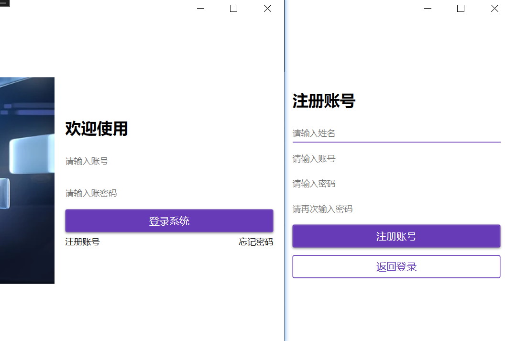
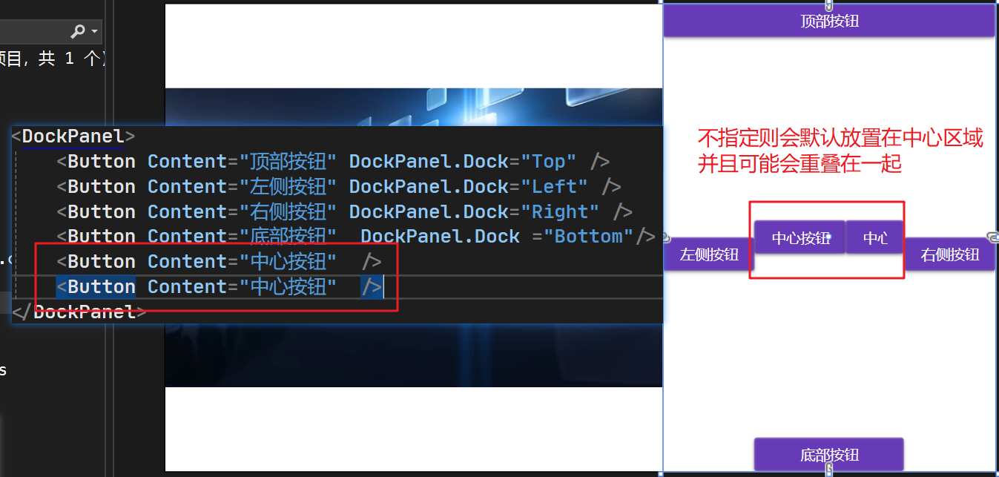

## 1、模拟登录界面的跳转

1）安装prism

```bash
NuGet\Install-Package Prism.DryIoc -Version 8.1.97
```

2）删除原来的MainWindow，将MainWindow移到Views文件夹下，MainWindow的页面代码如下：

```xml
<Window x:Class="LoginTest.Views.MainWindow"
        xmlns="http://schemas.microsoft.com/winfx/2006/xaml/presentation"
        xmlns:x="http://schemas.microsoft.com/winfx/2006/xaml"
        xmlns:d="http://schemas.microsoft.com/expression/blend/2008"
        xmlns:mc="http://schemas.openxmlformats.org/markup-compatibility/2006"
        xmlns:local="clr-namespace:LoginTest.Views"
        xmlns:prism="http://prismlibrary.com/"
        prism:ViewModelLocator.AutoWireViewModel="True"
        mc:Ignorable="d"
        Title="MainWindow" Height="700" Width="1200">
    <Grid>
        <TextBlock Text="这是登录成功后的界面" FontSize="40"></TextBlock>
    </Grid>
</Window>
```

3）引用prism，修改app.xaml

```xml
<prism:PrismApplication x:Class="LoginTest.App" xmlns="http://schemas.microsoft.com/winfx/2006/xaml/presentation"
                        xmlns:x="http://schemas.microsoft.com/winfx/2006/xaml" xmlns:local="clr-namespace:LoginTest"
                        xmlns:materialDesign="http://materialdesigninxaml.net/winfx/xaml/themes" xmlns:prism="http://prismlibrary.com/">
    <Application.Resources>
        <ResourceDictionary>
            <ResourceDictionary.MergedDictionaries>
                <materialDesign:BundledTheme BaseTheme="Dark" PrimaryColor="DeepPurple"
                                             SecondaryColor="Lime" />
                <ResourceDictionary Source="pack://application:,,,/MaterialDesignThemes.Wpf;component/Themes/MaterialDesign3.Defaults.xaml" />
            </ResourceDictionary.MergedDictionaries>
        </ResourceDictionary>
    </Application.Resources>
</prism:PrismApplication>
```

4）修改app.xmal.cs

```c#
using System.Configuration;
using System.Data;
using System.Windows;
using LoginTest.ViewModels;
using LoginTest.Views;
using Prism.DryIoc;
using Prism.Ioc;
using Prism.Services.Dialogs;

namespace LoginTest
{
    /// <summary>
    /// Interaction logic for App.xaml
    /// </summary>
    public partial class App : PrismApplication
    {
        /// <summary>
        /// 注册服务
        /// </summary>
        /// <param name="containerRegistry"></param>
        protected override void RegisterTypes(IContainerRegistry containerRegistry)
        {
           
            
        }
        /// <summary>
        /// 设置启动窗口
        /// </summary>
        /// <returns></returns>
        protected override Window CreateShell()
        {
            return Container.Resolve<MainWindow>();
        }
    }
}
```

5）在Views文件夹下增加一个用户控件LoginUC作为登录页，当点击登录后先默认登陆成功（绑定LoginCommand命令，在其中模拟登陆成功）

```xml
<UserControl x:Class="LoginTest.Views.LoginUC" xmlns="http://schemas.microsoft.com/winfx/2006/xaml/presentation"
             xmlns:x="http://schemas.microsoft.com/winfx/2006/xaml" xmlns:d="http://schemas.microsoft.com/expression/blend/2008"
             xmlns:local="clr-namespace:LoginTest.Views" xmlns:mc="http://schemas.openxmlformats.org/markup-compatibility/2006"
             Width="800" Height="450"
             mc:Ignorable="d">
    <Grid Background="White">
        <TextBlock FontSize="40" Text="登录界面" />
        <Button Width="90" Height="50"
                Command="{Binding LoginCommand}"
                Content="登录" />
    </Grid>
</UserControl>

```

6）在ViewModels文件夹下增加LoginUCViewModel，由于我们在登录页面跳转后要重新打开MainWindow，所以可以利用prism的对话服务，继承IDialogAware接口，实现其中的方法。除此以外，还要添加`LoginCommand`命令属性，以及命令执行的具体方法`LoginAction`，在LoginAction中，我们直接在窗口关闭时返回给MainWindow一个ButtonResult.OK模拟登录成功

```C#
using System;
using System.Collections.Generic;
using System.Linq;
using System.Text;
using System.Threading.Tasks;
using Prism.Commands;
using Prism.Services.Dialogs;

namespace LoginTest.ViewModels
{
    public class LoginUCViewModel : IDialogAware
    {
        //命令属性：登录命令
        public DelegateCommand LoginCommand { get; set; }

        public LoginUCViewModel()
        {
            LoginCommand = new DelegateCommand(LoginAction);
        }

        private void LoginAction()
        {
            //假设登录成功
            if (RequestClose != null)
            {
                RequestClose(new DialogResult(ButtonResult.OK));
            }
        }
        public bool CanCloseDialog()
        {
            return true;
        }

        public void OnDialogClosed()
        {

        }

        public void OnDialogOpened(IDialogParameters parameters)
        {

        }

        public string Title { get; set; } = "我的日常"; //修改标题
        public event Action<IDialogResult>? RequestClose;
    }
}
```

7）在app.xmal.cs中手动配置View和ViewModel之间的关联，同时重写`OnInitialized`方法，让程序启动时先执行初始化方法，在其中我们先打开`LoginUC`界面，当界面关闭则会调用callback的内容，如果返回结果不是`ButtonResult.OK`则退出程序。

```C#
using System.Configuration;
using System.Data;
using System.Windows;
using LoginTest.ViewModels;
using LoginTest.Views;
using Prism.DryIoc;
using Prism.Ioc;
using Prism.Services.Dialogs;

namespace LoginTest
{
    /// <summary>
    /// Interaction logic for App.xaml
    /// </summary>
    public partial class App : PrismApplication
    {
        /// <summary>
        /// 注册服务
        /// </summary>
        /// <param name="containerRegistry"></param>
        protected override void RegisterTypes(IContainerRegistry containerRegistry)
        {
            //手动配置View和ViewModel之间的关联
            containerRegistry.RegisterDialog<LoginUC, LoginUCViewModel>();
        }
        /// <summary>
        /// 设置启动窗口
        /// </summary>
        /// <returns></returns>
        protected override Window CreateShell()
        {
            return Container.Resolve<MainWindow>();
        }
        /// <summary>
        /// 初始化方法
        /// </summary>
        protected override void OnInitialized()
        {
            var dialog = Container.Resolve<IDialogService>();
            dialog.Show("LoginUC", callback =>
            {
                if (callback.Result != ButtonResult.OK)
                {
                    Environment.Exit(0);
                    return;
                }
                base.OnInitialized();
            });
            
        }
    }
}
```

8）修改窗口的左上角图标

将目标图标 favicon.ico拖入项目中，项目-》属性-》应用程序-》win32资源-》图标-》浏览选中图片即可

9）效果：


## 2、设计具体的登录界面

1）将需要的图片放入images文件夹，并将图片的属性都设置为【资源】

2）下载MaterialDesignThemes组件

```bash
NuGet\Install-Package MaterialDesignThemes -Version 5.0.1-ci633
```

使用说明：

https://github.com/MaterialDesignInXAML/MaterialDesignInXamlToolkit/wiki/Getting-Started

MaterialDesignThemes是一个针对WPF应用程序的开源UI框架，它提供了一套现代化的、基于Google Material Design风格的控件和样式。提供了丰富的控件和样式，包括按钮、文本框、下拉框、卡片、对话框等。这些控件都遵循Material Design的设计原则，具有醒目的颜色、扁平化的外观和动感的交互效果。

除了控件和样式，MaterialDesignThemes还提供了一些附加功能，如主题管理、阴影效果、图标集等。它还包含了一些实用的工具和扩展，帮助开发人员更轻松地使用和定制Material Design风格的界面。

使用MaterialDesignThemes框架，开发人员可以快速构建具有现代化外观和动态效果的WPF应用程序。通过简单的XAML标记，开发人员可以应用预定义的样式和主题，或者根据自己的需求进行自定义。

3）在app.xaml中引用组件，使用其中的资源

```xml
<prism:PrismApplication x:Class="LoginTest.App" xmlns="http://schemas.microsoft.com/winfx/2006/xaml/presentation"
                        xmlns:x="http://schemas.microsoft.com/winfx/2006/xaml" xmlns:local="clr-namespace:LoginTest"
                        xmlns:materialDesign="http://materialdesigninxaml.net/winfx/xaml/themes" xmlns:prism="http://prismlibrary.com/">
    <Application.Resources>
        <ResourceDictionary>
            <ResourceDictionary.MergedDictionaries>
                <materialDesign:BundledTheme BaseTheme="Dark" PrimaryColor="DeepPurple"
                                             SecondaryColor="Lime" />
                <ResourceDictionary Source="pack://application:,,,/MaterialDesignThemes.Wpf;component/Themes/MaterialDesign3.Defaults.xaml" />
            </ResourceDictionary.MergedDictionaries>
        </ResourceDictionary>
    </Application.Resources>
</prism:PrismApplication>
```

4）将右边分为容器的两个页面，一个用于显示注册，一个用于显示登录，这个容器就是Transitioner，容器内的每一项用`  <md:TransitionerSlide>`包裹。

Transitioner控件可以包含多个子元素，每个子元素代表一个内容项。通过使用Transitioner，可以在这些内容项之间进行平滑的切换，例如从一个页面过渡到另一个页面，或者在同一个页面中切换不同的视图。

按照下图的样式设计登录和注册页面：



```xml
<UserControl x:Class="LoginTest.Views.LoginUC" xmlns="http://schemas.microsoft.com/winfx/2006/xaml/presentation"
             xmlns:x="http://schemas.microsoft.com/winfx/2006/xaml" xmlns:d="http://schemas.microsoft.com/expression/blend/2008"
             xmlns:i="http://schemas.microsoft.com/xaml/behaviors" xmlns:local="clr-namespace:LoginTest.Views"
             xmlns:mc="http://schemas.openxmlformats.org/markup-compatibility/2006" xmlns:md="http://materialdesigninxaml.net/winfx/xaml/themes"
             Width="800" Height="450"
             mc:Ignorable="d">
    <Grid Background="White">
        <!--<TextBlock FontSize="40" Text="登录界面" />
        <Button Width="90" Height="50"
                Command="{Binding LoginCommand}"
                Content="登录" />-->
        <Grid.ColumnDefinitions>
            <!--  第一列的宽度是第二列宽度的1.5倍  -->
            <ColumnDefinition Width="1.5*" />
            <ColumnDefinition />
        </Grid.ColumnDefinitions>
        <Image Source="/images/login.png" />
        <!--  默认展示第一个页面  -->
        <md:Transitioner Grid.Column="1" SelectedIndex="0">
            <!--  登录  -->
            <md:TransitionerSlide>
                <DockPanel Margin="15" VerticalAlignment="Center">
                    <TextBlock Margin="0,10" DockPanel.Dock="Top"
                               FontSize="22" FontWeight="Bold"
                               Text="欢迎使用" />
                    <TextBox Margin="0,10" md:HintAssist.Hint="请输入账号"
                             DockPanel.Dock="Top" />
                    <PasswordBox Margin="0,10" md:HintAssist.Hint="请输入账密码"
                                 DockPanel.Dock="Top" />
                    <Button Content="登录系统" DockPanel.Dock="Top" />
                    <!--  LastChildFill 默认是True仅适用于DockPanel中的最后一个子元素  -->
                    <DockPanel Margin="0,5" LastChildFill="false">
                        <TextBlock DockPanel.Dock="Left" Text="注册账号">
                            <i:Interaction.Triggers>
                                <i:EventTrigger EventName="MouseLeftButtonDown">
                                    <i:InvokeCommandAction />
                                </i:EventTrigger>
                            </i:Interaction.Triggers>
                        </TextBlock>
                        <TextBlock DockPanel.Dock="Right" Text="忘记密码">
                            <i:Interaction.Triggers>
                                <i:EventTrigger EventName="MouseLeftButtonDown">
                                    <i:InvokeCommandAction />
                                </i:EventTrigger>
                            </i:Interaction.Triggers>
                        </TextBlock>
                    </DockPanel>
                </DockPanel>

            </md:TransitionerSlide>
            <!--  注册  -->
            <md:TransitionerSlide>
                <DockPanel Margin="15" VerticalAlignment="Center">
                    <TextBlock Margin="0,10" DockPanel.Dock="Top"
                               FontSize="22" FontWeight="Bold"
                               Text="注册账号" />
                    <TextBox Margin="0,10" md:HintAssist.Hint="请输入姓名"
                             DockPanel.Dock="Top" />
                    <TextBox md:HintAssist.Hint="请输入账号" DockPanel.Dock="Top" />
                    <TextBox Margin="0,10" md:HintAssist.Hint="请输入密码"
                             DockPanel.Dock="Top" />
                    <PasswordBox md:HintAssist.Hint="请再次输入密码" DockPanel.Dock="Top" />
                    <StackPanel>
                        <Button Margin="0,10" Content="注册账号"
                                DockPanel.Dock="Top" />
                        <Button Content="返回登录" DockPanel.Dock="Top"
                                Style="{StaticResource MaterialDesignOutlinedButton}" />
                    </StackPanel>
                </DockPanel>
            </md:TransitionerSlide>
        </md:Transitioner>
    </Grid>
</UserControl>

```

为了让列表每一项之间都有一定的距离，可以使用DockPanel，`<DockPanel Margin="15" VerticalAlignment="Center">`可以让右侧列表的各条统一均匀地分布在中间，DockPanel内部放一行一行的控件，控件中使用附件属性`DockPanel.Dock="Top"`可以修改排列的布局，测试样例如下：



登录页面最后一行的【注册账号、忘记密码】使用的是TextBlock，当点击TextBlock时会触发事件。

`i:Interaction.Triggers`和按钮的Click事件有一些区别和不同的用途。

1. **Click事件是按钮的内置事件**：按钮是一个UI元素，它具有内置的Click事件，用于响应用户点击按钮的操作。当按钮被点击时，会触发Click事件，并执行相应的事件处理程序。
2. **`i:Interaction.Triggers`是一个更通用的机制**：`i:Interaction.Triggers`是一种更通用的机制，它允许你为任何UI元素定义触发器，并与各种不同的事件、行为和操作进行关联。除了Click事件外，你还可以使用`i:Interaction.Triggers`来响应其他事件，如MouseEnter、MouseLeave、KeyDown等。
3. **`i:Interaction.Triggers`可以实现更复杂的交互行为**：通过使用`i:Interaction.Triggers`，你可以定义多个触发器，并与不同的行为和操作进行关联。这使得你可以实现更复杂的交互行为，例如根据鼠标位置显示不同的提示信息，或者根据键盘按键执行不同的操作。
4. **`i:Interaction.Triggers`可以与命令模式结合使用**：与按钮的Click事件不同，`i:Interaction.Triggers`可以与命令模式结合使用。通过使用`i:InvokeCommandAction`，你可以将触发器与命令进行绑定，从而实现更灵活的命令处理和交互逻辑。

所以这里引入behaviors命名空间

`  xmlns:i="http://schemas.microsoft.com/xaml/behaviors"`，behaviors命名空间通常用于使用Microsoft提供的XAML行为库，它包含了一些附加功能和交互行为

```xml
 <DockPanel Margin="0,5" LastChildFill="false">
     <TextBlock DockPanel.Dock="Left" Text="注册账号">
         <i:Interaction.Triggers>
             <i:EventTrigger EventName="MouseLeftButtonDown">
                 <i:InvokeCommandAction />
             </i:EventTrigger>
         </i:Interaction.Triggers>
     </TextBlock>
     <TextBlock DockPanel.Dock="Right" Text="忘记密码">
         <i:Interaction.Triggers>
             <i:EventTrigger EventName="MouseLeftButtonDown">
                 <i:InvokeCommandAction />
             </i:EventTrigger>
         </i:Interaction.Triggers>
     </TextBlock>
</DockPanel>
```

## 3、实现界面注册和返回的跳转

也就是绑定注册账号和返回登录上绑定命令，这里需要操作`<md:Transitioner Grid.Column="1" SelectedIndex="0">`的`SelectedIndex`属性值，为0则进入登录页，为1则进入注册页，所以这里可以合并为一个命令`LoginRegisterCommand`。在LoginUCViewModel中增加如下代码：

```C#
 //命令属性：登录注册切换命令
 public DelegateCommand<string> LoginRegisterCommand { get; set; }
 // 登录注册切换时执行的方法
 private void LoginRegisterChange(string target)
 {
     int intTarget = 0;
     if (int.TryParse(target, out intTarget))
     {
         TransitionSelected = intTarget;
     }
 }
//构造函数
public LoginUCViewModel()
{
    //登录命令
    LoginCommand = new DelegateCommand(LoginAction);
    // 注册登录切换显示
    LoginRegisterCommand = new DelegateCommand<string>(LoginRegisterChange);
}
```

xaml代码如下：

```xml
<UserControl x:Class="LoginTest.Views.LoginUC" xmlns="http://schemas.microsoft.com/winfx/2006/xaml/presentation"
             xmlns:x="http://schemas.microsoft.com/winfx/2006/xaml" xmlns:d="http://schemas.microsoft.com/expression/blend/2008"
             xmlns:i="http://schemas.microsoft.com/xaml/behaviors" xmlns:local="clr-namespace:LoginTest.Views"
             xmlns:mc="http://schemas.openxmlformats.org/markup-compatibility/2006" xmlns:md="http://materialdesigninxaml.net/winfx/xaml/themes"
             xmlns:prism="http://prismlibrary.com/" Width="800"
             Height="450" mc:Ignorable="d">
    <!--  使用 Prism 库定义的特殊标记，用于设置对话框窗口的样式  -->
    <prism:Dialog.WindowStyle>
        <Style TargetType="Window">
            <Setter Property="Width" Value="600" />
            <Setter Property="Height" Value="350" />
            <!--  设置窗口的内容大小自适应为宽度和高度  -->
            <Setter Property="SizeToContent" Value="WidthAndHeight" />
            <!--  设置窗口的调整大小模式为不可调整。这表示用户无法调整窗口的大小  -->
            <Setter Property="ResizeMode" Value="NoResize" />
            <!--  设置窗口的启动位置为屏幕中央  -->
            <Setter Property="prism:Dialog.WindowStartupLocation" Value="CenterScreen" />
        </Style>
    </prism:Dialog.WindowStyle>
    <Grid Background="White">
        <Grid.ColumnDefinitions>
            <!--  第一列的宽度是第二列宽度的1.5倍  -->
            <ColumnDefinition Width="1.5*" />
            <ColumnDefinition />
        </Grid.ColumnDefinitions>
        <Image Source="/images/login.png" />
        <!--  默认展示第一个页面  -->
        <md:Transitioner Grid.Column="1" SelectedIndex="{Binding Path=TransitionSelected, FallbackValue=0}">
            <!--  登录  -->
            <md:TransitionerSlide>
                <DockPanel Margin="15" VerticalAlignment="Center">
                    <TextBlock Margin="0,10" DockPanel.Dock="Top"
                               FontSize="22" FontWeight="Bold"
                               Text="欢迎使用" />
                    <TextBox Margin="0,10" md:HintAssist.Hint="请输入账号"
                             DockPanel.Dock="Top" />
                    <PasswordBox Margin="0,10" md:HintAssist.Hint="请输入账密码"
                                 DockPanel.Dock="Top" />
                    <Button Content="登录系统" DockPanel.Dock="Top" />
                    <!--  LastChildFill 默认是True仅适用于DockPanel中的最后一个子元素  -->
                    <DockPanel Margin="0,5" LastChildFill="false">
                        <TextBlock DockPanel.Dock="Left" Text="注册账号">
                            <i:Interaction.Triggers>
                                <i:EventTrigger EventName="MouseLeftButtonDown">
                                    <i:InvokeCommandAction Command="{Binding LoginRegisterCommand}" CommandParameter="1" />
                                </i:EventTrigger>
                            </i:Interaction.Triggers>
                        </TextBlock>
                        <TextBlock DockPanel.Dock="Right" Text="忘记密码">
                            <i:Interaction.Triggers>
                                <i:EventTrigger EventName="MouseLeftButtonDown">
                                    <i:InvokeCommandAction Command="{Binding LoginRegisterCommand}" CommandParameter="1" />
                                </i:EventTrigger>
                            </i:Interaction.Triggers>
                        </TextBlock>
                    </DockPanel>
                </DockPanel>
            </md:TransitionerSlide>
            <!--  注册  -->
            <md:TransitionerSlide Height="450" VerticalAlignment="Top">
                <DockPanel Margin="15" VerticalAlignment="Center">
                    <TextBlock Margin="0,10" DockPanel.Dock="Top"
                               FontSize="22" FontWeight="Bold"
                               Text="注册账号" />
                    <TextBox Margin="0,10" md:HintAssist.Hint="请输入姓名"
                             DockPanel.Dock="Top" />
                    <TextBox md:HintAssist.Hint="请输入账号" DockPanel.Dock="Top" />
                    <TextBox Margin="0,10" md:HintAssist.Hint="请输入密码"
                             DockPanel.Dock="Top" />
                    <PasswordBox md:HintAssist.Hint="请再次输入密码" DockPanel.Dock="Top" />
                    <StackPanel>
                        <Button Margin="0,10" Content="注册账号"
                                DockPanel.Dock="Top" />
                        <Button Command="{Binding LoginRegisterCommand}"
                                CommandParameter="0" Content="返回登录"
                                DockPanel.Dock="Top"
                                Style="{StaticResource MaterialDesignOutlinedButton}" />
                    </StackPanel>
                </DockPanel>
            </md:TransitionerSlide>
        </md:Transitioner>
    </Grid>
</UserControl>
```


