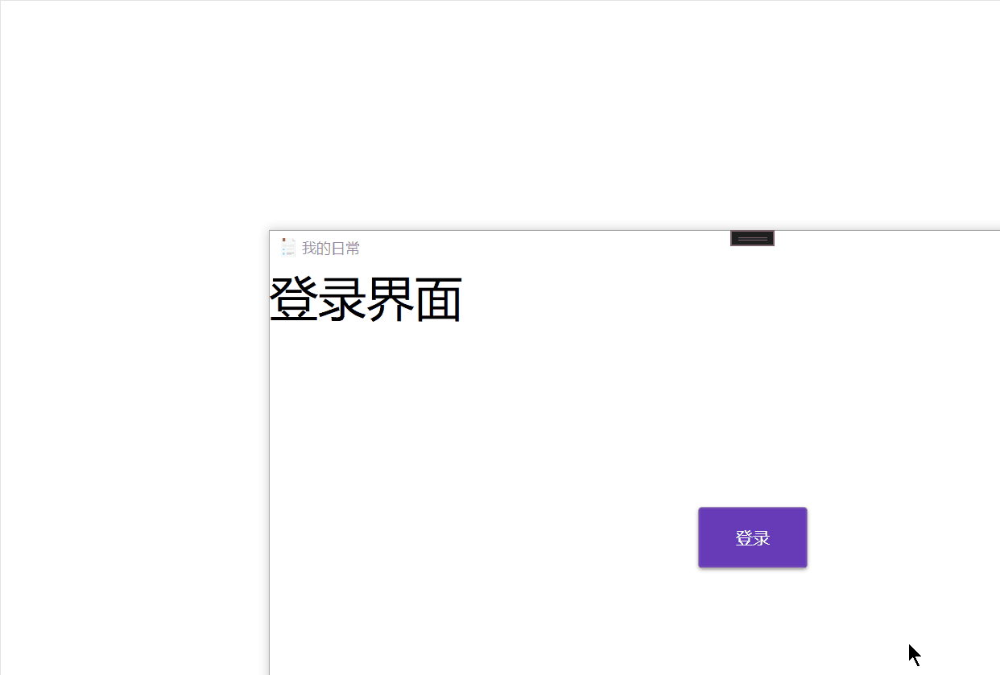

## 1、模拟登录界面的跳转

1）安装prism

```bash
NuGet\Install-Package Prism.DryIoc -Version 8.1.97
```

2）删除原来的MainWindow，将MainWindow移到Views文件夹下，MainWindow的页面代码如下：

```xml
<Window x:Class="LoginTest.Views.MainWindow"
        xmlns="http://schemas.microsoft.com/winfx/2006/xaml/presentation"
        xmlns:x="http://schemas.microsoft.com/winfx/2006/xaml"
        xmlns:d="http://schemas.microsoft.com/expression/blend/2008"
        xmlns:mc="http://schemas.openxmlformats.org/markup-compatibility/2006"
        xmlns:local="clr-namespace:LoginTest.Views"
        xmlns:prism="http://prismlibrary.com/"
        prism:ViewModelLocator.AutoWireViewModel="True"
        mc:Ignorable="d"
        Title="MainWindow" Height="700" Width="1200">
    <Grid>
        <TextBlock Text="这是登录成功后的界面" FontSize="40"></TextBlock>
    </Grid>
</Window>
```

3）引用prism，修改app.xaml

```xml
<prism:PrismApplication x:Class="LoginTest.App" xmlns="http://schemas.microsoft.com/winfx/2006/xaml/presentation"
                        xmlns:x="http://schemas.microsoft.com/winfx/2006/xaml" xmlns:local="clr-namespace:LoginTest"
                        xmlns:materialDesign="http://materialdesigninxaml.net/winfx/xaml/themes" xmlns:prism="http://prismlibrary.com/">
    <Application.Resources>
        <ResourceDictionary>
            <ResourceDictionary.MergedDictionaries>
                <materialDesign:BundledTheme BaseTheme="Dark" PrimaryColor="DeepPurple"
                                             SecondaryColor="Lime" />
                <ResourceDictionary Source="pack://application:,,,/MaterialDesignThemes.Wpf;component/Themes/MaterialDesign3.Defaults.xaml" />
            </ResourceDictionary.MergedDictionaries>
        </ResourceDictionary>
    </Application.Resources>
</prism:PrismApplication>
```

4）修改app.xmal.cs

```c#
using System.Configuration;
using System.Data;
using System.Windows;
using LoginTest.ViewModels;
using LoginTest.Views;
using Prism.DryIoc;
using Prism.Ioc;
using Prism.Services.Dialogs;

namespace LoginTest
{
    /// <summary>
    /// Interaction logic for App.xaml
    /// </summary>
    public partial class App : PrismApplication
    {
        /// <summary>
        /// 注册服务
        /// </summary>
        /// <param name="containerRegistry"></param>
        protected override void RegisterTypes(IContainerRegistry containerRegistry)
        {
           
            
        }
        /// <summary>
        /// 设置启动窗口
        /// </summary>
        /// <returns></returns>
        protected override Window CreateShell()
        {
            return Container.Resolve<MainWindow>();
        }
    }
}
```

5）在Views文件夹下增加一个用户控件LoginUC作为登录页，当点击登录后先默认登陆成功（绑定LoginCommand命令，在其中模拟登陆成功）

```xml
<UserControl x:Class="LoginTest.Views.LoginUC" xmlns="http://schemas.microsoft.com/winfx/2006/xaml/presentation"
             xmlns:x="http://schemas.microsoft.com/winfx/2006/xaml" xmlns:d="http://schemas.microsoft.com/expression/blend/2008"
             xmlns:local="clr-namespace:LoginTest.Views" xmlns:mc="http://schemas.openxmlformats.org/markup-compatibility/2006"
             Width="800" Height="450"
             mc:Ignorable="d">
    <Grid Background="White">
        <TextBlock FontSize="40" Text="登录界面" />
        <Button Width="90" Height="50"
                Command="{Binding LoginCommand}"
                Content="登录" />
    </Grid>
</UserControl>

```

6）在ViewModels文件夹下增加LoginUCViewModel，由于我们在登录页面跳转后要重新打开MainWindow，所以可以利用prism的对话服务，继承IDialogAware接口，实现其中的方法。除此以外，还要添加`LoginCommand`命令属性，以及命令执行的具体方法`LoginAction`，在LoginAction中，我们直接在窗口关闭时返回给MainWindow一个ButtonResult.OK模拟登录成功

```C#
using System;
using System.Collections.Generic;
using System.Linq;
using System.Text;
using System.Threading.Tasks;
using Prism.Commands;
using Prism.Services.Dialogs;

namespace LoginTest.ViewModels
{
    public class LoginUCViewModel : IDialogAware
    {
        //命令属性：登录命令
        public DelegateCommand LoginCommand { get; set; }

        public LoginUCViewModel()
        {
            LoginCommand = new DelegateCommand(LoginAction);
        }

        private void LoginAction()
        {
            //假设登录成功
            if (RequestClose != null)
            {
                RequestClose(new DialogResult(ButtonResult.OK));
            }
        }
        public bool CanCloseDialog()
        {
            return true;
        }

        public void OnDialogClosed()
        {

        }

        public void OnDialogOpened(IDialogParameters parameters)
        {

        }

        public string Title { get; set; } = "我的日常"; //修改标题
        public event Action<IDialogResult>? RequestClose;
    }
}
```

7）在app.xmal.cs中手动配置View和ViewModel之间的关联，同时重写`OnInitialized`方法，让程序启动时先执行初始化方法，在其中我们先打开`LoginUC`界面，当界面关闭则会调用callback的内容，如果返回结果不是`ButtonResult.OK`则退出程序。

```C#
using System.Configuration;
using System.Data;
using System.Windows;
using LoginTest.ViewModels;
using LoginTest.Views;
using Prism.DryIoc;
using Prism.Ioc;
using Prism.Services.Dialogs;

namespace LoginTest
{
    /// <summary>
    /// Interaction logic for App.xaml
    /// </summary>
    public partial class App : PrismApplication
    {
        /// <summary>
        /// 注册服务
        /// </summary>
        /// <param name="containerRegistry"></param>
        protected override void RegisterTypes(IContainerRegistry containerRegistry)
        {
            //手动配置View和ViewModel之间的关联
            containerRegistry.RegisterDialog<LoginUC, LoginUCViewModel>();
        }
        /// <summary>
        /// 设置启动窗口
        /// </summary>
        /// <returns></returns>
        protected override Window CreateShell()
        {
            return Container.Resolve<MainWindow>();
        }
        /// <summary>
        /// 初始化方法
        /// </summary>
        protected override void OnInitialized()
        {
            var dialog = Container.Resolve<IDialogService>();
            dialog.Show("LoginUC", callback =>
            {
                if (callback.Result != ButtonResult.OK)
                {
                    Environment.Exit(0);
                    return;
                }
                base.OnInitialized();
            });
            
        }
    }
}
```

8）效果：



## 2、实现具体的登录界面

```bash
NuGet\Install-Package MaterialDesignThemes -Version 5.0.1-ci633
```

使用说明：

https://github.com/MaterialDesignInXAML/MaterialDesignInXamlToolkit/wiki/Getting-Started