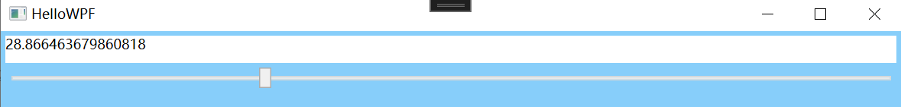

## 1、WPF项目类型

控制台应用程序：使用 /t:exe 编译成 控制台应用程序(Console Application)、用 /t:winexe 编译成 windows应用程序(GUI Application)、用 /t:library 编译成 类库(Dynamic Link Library DDL)

## 2、xmal 简介

xaml = Extensible app markup language 可拓展应用程序标记语言（WPF中专门用于设计UI的语言）

Properties 分支:里面的主要内容是程序要用到的一些资源(如图标、图片、静态的字符串)和配置信息。

References分支:标记了当前这个项目需要引用哪些其他的项目。目前里面列出来的条目都是.NETFramework中的类库,有时候还要添加其他,NETFramework类库或其他程序员编写的项目及类库。

App.xaml分支:程序的主体。大家知道，在Windows系统里，一个程序就是一个进程(Process)。Windows还规定，一个GUI进程需要有一个窗体(Window)作为“主窗体”。


XAML中引用外来程序集和其中,NET名称空间的语法与C#是不一样的。

在C#中，如果想使用 System.Windows.Controls 名称空间里的 Button类，1)把包含 System,Windows.Controls 名称空间的程序集 PresentationFramework.dll通过添加引用的方式引用到项目 2)在C#代码的顶部写上一句 using System.Windows.Controls;

在XAML, 也需要1)先添加对程序集的引用，2)在根元素的起始标签中写上一句

```xaml
xmlns:c="clr-namespace:System.Windows.Controls;assembly=PresentationFramework"
```

c是映射前缀，换成其他的字符串(如control)也可以。因为Button 来自前缀c对应的名称空间，所以在使用 Button的时候就要写成<c:Button>...</c:Button>。

命名空间虽然像网址，但这只是XAML解析器的一个硬性编码(hard-coding)，只要见到这些固定的字符串，就会把一系列必要的程序集(Assembly)和程序集中包含的.NET名称空间引用进来。

```xmal
<Window x:Class="HelloWPF.MainWindow"
        xmlns="http://schemas.microsoft.com/winfx/2006/xaml/presentation"
        xmlns:x="http://schemas.microsoft.com/winfx/2006/xaml"
</Window>
```

默认引用进来的命名空间很重要

第一个 http://schemas.microsoft.com/winfx/2006/xaml/presentation与绘制UI相关的程序集,是表示(Presentation)层面上的东西 对应:

- System.Windows
- System.Windows.AutomationSystem.Windows.Controls
- System.Windows.Controls.Primitives
- System.Windows.Data
- System.Windows.Documents
- System.Windows.Forms.IntegrationSystem.Windows.Ink
- System.Windows.Input
- System.Windows.Media
- System.Windows.Media.AnimationSystem.Windows.Media.Effects

- System.Windows
- System.Windows.AutomationSystem.Windows.Controls
- System.Windows.Controls.Primitives
- System.Windows.Data
- System.Windows.Documents
- System.Windows.Forms.IntegrationSystem.Windows.Ink
- System.Windows.Input
- System.Windows.Media
- System.Windows.Media.AnimationSystem.Windows.Media.Effects
- System.Windows.Media.Imaging
- System.Windows.Media.Media3D
- System.Windows.Media.TextFormatting
- System.Windows.Navigation
- System.Windows.Shapes

第二个 http://schemas.microsoft.com/winfx/2006/xaml XAML语言解析处理相关的程序集，是语言层面上的东西

HelloWPF.xaml.cs中HelloWPF类在声明时使用了partial这个关键字

```xmal
<Window x:Class="HelloWPF.MainWindow"
</Window>
```

```C#
namespace HelloWPF
{
    /// <summary>
    /// Interaction logic for MainWindow.xaml
    /// </summary>
    public partial class MainWindow : Window
    {
        public MainWindow()
        {
            InitializeComponent();
        }
    }
}
```

partial可以把一个类分拆在多处定义，只要各部分代码不冲突即可。显然，由XAML解析器生成的 Window1 类在声明时也使用了 partial 关键字，这样，由XAML 解析成的类和 C#文件里定义的部分就合二为一。正是由于这种 partial 机制，我们可以把类的逻辑代码留在.cs 文件里，用C#语言来实现，而把那些与声明及布局元素相关的代码分离出去，实现UI与逻辑分离。并且用于绘制UI的代码(如声明控件类型的字段、设置它们的外观和布局等)也不必再使用C#语言，使用 XAML和 XAML编辑工具就能轻松搞定!

## 3、xmal 为对象属性赋值

### 3.1 通过 Attribute=Vleue

```html
<Window x:Class="HelloWPF.MainWindow"
        xmlns="http://schemas.microsoft.com/winfx/2006/xaml/presentation"
        xmlns:x="http://schemas.microsoft.com/winfx/2006/xaml"
        xmlns:d="http://schemas.microsoft.com/expression/blend/2008"
        xmlns:mc="http://schemas.openxmlformats.org/markup-compatibility/2006"
        xmlns:local="clr-namespace:HelloWPF"
        mc:Ignorable="d"
        Title="MainWindow" Height="450" Width="800">
    <Grid>
        <Path Data="M 0,0 L 200,100 L100,200 Z" Stroke="Black" Fill="Red"/>
        <Rectangle Height="100" Width="120" Stroke="Black" Fill="Blue" RadiusX="10" RadiusY="10"/>
    </Grid>
</Window>
```

需要注意的是，通过这种 Attribute=Value 语法赋值时，由于XAML,的语法限制，Value 只可能是一个字符串值。这就引出了两个问题:
如果一个类能使用 XAML语言进行声明,并允许它的Property与XAML 标签的 Attribute互相映射，那就需要为这些 Property准备适当的转换机制。由于 Value 是个字符串，所以其格式复杂程度有限，尽管可以在转换机制里包含一定的按格式解析字符串的功能以便转换成较复杂的目标对象，但这会让最终的XAML 使用者头疼不已。因为他们不得不在没有编码辅助的情况下手写一个格式复杂的字符串以满足赋值要求。

第一个问题的解决方案是使用TypeConverter类的派生类,在派生类里重写TypeConverter 的一些方法，第二个问题的解决办法就是使用属性元素(PropertyElement)。


```html
<Window x:Class="HelloWPF.MainWindow"
        xmlns="http://schemas.microsoft.com/winfx/2006/xaml/presentation"
        xmlns:x="http://schemas.microsoft.com/winfx/2006/xaml"
        xmlns:d="http://schemas.microsoft.com/expression/blend/2008"
        xmlns:mc="http://schemas.openxmlformats.org/markup-compatibility/2006"
        xmlns:local="clr-namespace:HelloWPF"
        mc:Ignorable="d"
        Title="MainWindow" Height="450" Width="800">
    <Window.Resources>
    <-- 这里使用child="TimChild" 直接将字符串转为Human对象 -->
        <local:Human x:Key="human1" Name="Tim" Child="TimChild"/>
    </Window.Resources>
    
    <Grid>
        <Path Data="M 0,0 L 200,100 L100,200 Z" Stroke="Black" Fill="Red"/>
        <Rectangle Height="100" Width="120" Stroke="Black" Fill="Blue" RadiusX="10" RadiusY="10"/>
        <Button Content="测试按钮" Height="40" Width="120" Click="Button_Click"/>
    </Grid>
</Window>

```

声明变量的方式：

```xmal
<local:类名 x:Key="对象名" 属性1="" 属性2=""/>
```

.cs中

```C#
using System;
using System.Collections.Generic;
using System.ComponentModel;
using System.Globalization;
using System.Linq;
using System.Text;
using System.Threading.Tasks;
using System.Windows;
using System.Windows.Controls;
using System.Windows.Data;
using System.Windows.Documents;
using System.Windows.Input;
using System.Windows.Media;
using System.Windows.Media.Imaging;
using System.Windows.Navigation;
using System.Windows.Shapes;

namespace HelloWPF
{
    /// <summary>
    /// Interaction logic for MainWindow.xaml
    /// </summary>
    public partial class MainWindow : Window
    {
        public MainWindow()
        {
            InitializeComponent();
        }

        private void Button_Click(object sender, RoutedEventArgs e)
        {
            Human human = this.FindResource("human1") as Human;
            if(human != null)
            {
                MessageBox.Show($"父{human.Name} 子{human.Child.Name}");
            }
        }
    }
    //[TypeConverterAttribute(typeof(NameToHumanTypeConverter))]（TypeConverterAttribute 的 Attribute 可以省略） 
    [TypeConverter(typeof(NameToHumanTypeConverter))]
    public class Human
    {
        public string Name { get; set; }    
        public Human Child { get; set; }
    }
    public class NameToHumanTypeConverter : TypeConverter
    {
        public override object? ConvertFrom(ITypeDescriptorContext? context, CultureInfo? culture, object value)
        {
            var child = new Human();
            child.Name = value.ToString();
            return child;
        }
    }
}

```

因为特征类在使用的时候可以省略 Attribute 这个词，所以TypeConverterAttribute也可以写成TypeConverter:

效果：


### 3.2 通过属性标签

在 XAML 中，非空标签均具有自己的内容(Content)。标签的内容指的就是夹在起始标签和结束标签之间的一些子级标签，每个子级标签都是父级标签内容的一个元素(Element)，简称为父级标签的一个元素。

顾名思义，属性元素指的是某个标签的一个元素对应这个标签的一个属性，即以元素的形式来表达一个实例的属性。代码描述为:

```html
<Button Width="120" Height="30">
       <Button.Content>
            <Rectangle Width="20" Height="20" Stroke="DarkGreen" Fill="LawnGreen"/>
       </Button.Content>
</Button>
```

LinearGradientBrush的GradientStops属性是一个GradientStop对象的集合(GradientStopCollection)即一系列的矢量渐变填充点。在这些填充点之间，系统会自动进行插值运算、计算出过渡色彩。填充矢量的方向是 StartPoint和 EndPoint 两个属性(类型为Point)的连线方向，矩形的左上角为 0,0，矩形的右下角为 1, 1针对这三个属性都使用了属性标签式赋值方法。

画一个渐变填充的方形代码：

```html

        <Rectangle Width="200" Height="160" Stroke="LightBlue">
            <Rectangle.Fill>
                <LinearGradientBrush>
                    <LinearGradientBrush.StartPoint>
                        <Point X="0" Y="0"/>
                    </LinearGradientBrush.StartPoint>
                    <LinearGradientBrush.EndPoint>
                        <Point X="1" Y="1"/>
                    </LinearGradientBrush.EndPoint>
                    <LinearGradientBrush.GradientStops>
                        <GradientStopCollection>
                            <GradientStop Offset="0.2" Color="AliceBlue"/>
                            <GradientStop Offset="0.7" Color="LightBlue"/>
                            <GradientStop Offset="1" Color="LightSkyBlue"/>
                        </GradientStopCollection>
                    </LinearGradientBrush.GradientStops>
                </LinearGradientBrush>
            </Rectangle.Fill>
        </Rectangle>
可以简化为
     <Rectangle Width="200" Height="160" Stroke="LightBlue">
            <Rectangle.Fill>
                <LinearGradientBrush>
                    <LinearGradientBrush.GradientStops>
                        <GradientStop Offset="0.2" Color="AliceBlue"/>
                        <GradientStop Offset="0.7" Color="LightBlue"/>
                        <GradientStop Offset="1" Color="LightSkyBlue"/>
                    </LinearGradientBrush.GradientStops>
                </LinearGradientBrush>
            </Rectangle.Fill>
        </Rectangle>
```

效果：


### 3.3 通过标签扩展

所谓标记扩展，实际上是一种特殊的 Altribute=Value语法，其特殊的地方在于 Value 字符串是由一对花括号及其括起来的内容组成，XAMML编译器会对这样的内容做出解析、生成相应的对象。

```xmal
<Window x:Class="HelloWPF.MainWindow"
        xmlns="http://schemas.microsoft.com/winfx/2006/xaml/presentation"
        xmlns:x="http://schemas.microsoft.com/winfx/2006/xaml"
        xmlns:d="http://schemas.microsoft.com/expression/blend/2008"
        xmlns:mc="http://schemas.openxmlformats.org/markup-compatibility/2006"
        xmlns:local="clr-namespace:HelloWPF"
        xmlns:sys="clr-namespace:System;assembly=mscorlib"
        mc:Ignorable="d"
        Title="MainWindow" Height="450" Width="800">
        <!-- 声明一个资源变量 -->
    <Window.Resources>
        <sys:String x:Key="str">Hello WPF!</sys:String>
    </Window.Resources>
    <Grid>
    <!-- Text的值为资源变量的值 -->
        <TextBlock Height="24" Width="120" Background="LightBlue" Text="{StaticResource ResourceKey=str}"/>
    </Grid>
</Window>

```

复杂事例

```xmal
<Window x:Class="HelloWPF.MainWindow"
        xmlns="http://schemas.microsoft.com/winfx/2006/xaml/presentation"
        xmlns:x="http://schemas.microsoft.com/winfx/2006/xaml"
        xmlns:d="http://schemas.microsoft.com/expression/blend/2008"
        xmlns:mc="http://schemas.openxmlformats.org/markup-compatibility/2006"
        xmlns:local="clr-namespace:HelloWPF"
        xmlns:sys="clr-namespace:System;assembly=mscorlib"
        mc:Ignorable="d"
        Title="MainWindow" Height="450" Width="800"
        Background="LightSkyBlue">
    <Grid Margin="4">
        <Grid.RowDefinitions>
            <RowDefinition Height="24"/>
            <RowDefinition Height="4"/>
            <RowDefinition Height="24"/>
        </Grid.RowDefinitions>
        <TextBlock x:Name="tb" Text="{Binding ElementName=sld,Path=Value}" Background="White"/>
        <Slider x:Name="sld" Grid.Row="2" Value="50" Maximum="100" Minimum="0"/>
    </Grid>
</Window>
```

拖动滑动条可以显示进度条的占比



{}括起来的是一个对象，类似于构造函数式赋值

```xmal
Text="{Binding ElementName=sld,Path=Value}" 

Binding binding = new Binding() { ElementName = sld, Path = Value };
```

尽管标记扩展的语法简洁方便，但并不是所有对象都能用标记扩展的语法来书写，只有MarkupExtension类的派生类(直接或间接均可)才能使用标记扩展语法来创建对象。

MarkupExtension的直接派生类并不多，它们是:

- System.Windows.ColorConvertedBitmapExtension
- System.Windows.Data.BindingBase
- System.Windows.Data.RelativeSource
- System.Windows.DynamicResourceExtension
- System.Windows.Markup.ArrayExtension
- System.Windows.Markup.NullExtension
- System.Windows.MMarkup.StaticExtension
- System.Windows.Markup.TypeExtension
- System.Windows.ResourceKey
- System.Windows.StaticResourceExtension
- System.Windows.TemplateBindingExtension
- System.Windows.ThemeDictionaryExtension

最后，使用标记扩展时还需要注意以下几点:

- 标记扩展是可以嵌套的，例如```Text="(Binding Soce={StaticResource myDataSource),Path=PersonName)"```是正确的语法。
- 标记扩展具有一些简写语法，例如"{Binding Value,….),"与"{Binding Path=Value,….)"是等价的、"({StaticResourcemyString.…)"与"{StaticResource ResourceKey=myString,.)"是等价的。两种写法中，前者称为固定位置参数(Posilional Parameter)，后者称为具名参数(Named Parameters)。固定位置参数实际上就是标记扩展类构造器的参数，其位置由构造器参数列表决定。
- 标记扩展类的类名均以单词 Extension 为后级，在XAML,使用它们的时候 Extension 后级可以省略不写，比如写Text="{x:Static.."与写Text="{x:StaticExtension..."是等价的。

## 4、XMAL的注释

注释 Ctrl+e+c  解注释 Ctrl+e+u

注释 Ctrl+k+c  解注释 Ctrl+k+u