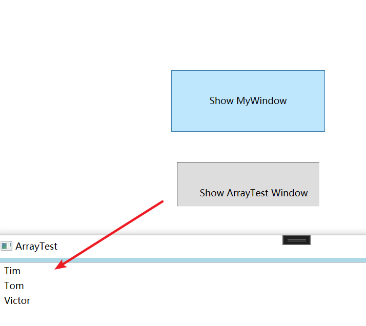

##  1、x 名称空间简介

x名称空间映射的是http://schemas.microsoft.com/winfx/2006/xaml，x名称空间里的成员(如 x:Class、x:Name)它包含的类均与解析 XAML语言相关，所以亦可称之为“XAML名称空间”，用来引导XAML 编译器把 XAML 代码编译成CLR代码的(所以这个x不是为了酷，而是XAML的首字母)。


与C#语言一样，XAML也有自己的编译器。XAML，语言会被解析并编译，最终形成微软中间语言存储在程序集中。在解析和编译XAML语言的过程中，我们经常需要告诉编译器一些重要的信息，比如 XAML代码的编译结果应该与哪个C#代码的编译结果合并、使用 XAML 声明的元素是public 还是 private访问级别等等。这些让程序员能够与XAML编译器沟通的工具就存放在x名称空间中。我们注意到，它们可以分为 Attribute、标记扩展和 XAML 指令元素三类，如：

|                 |               |
| --------------- | ------------- |
| x:Array         | 标签扩展      |
| x:Class         | Attribute     |
| x:ClassModifier | Attribute     |
| x:Code          | XAML 指令元素 |
| x:FieldModifier | Attribute     |
| x:Key           | Attribute     |
| x:Name          | Attribute     |
| x:Null          | 标签扩展      |
| x:Shared        | Attribute     |
| x:Static        | 标签扩展      |
| x:Subclass      | Attribute     |
| x:Type          | 标签扩展      |
| x:TypeArguments | Attribute     |
| x:Uid           | Attribute     |
| x:XData         | XAML 指令元素 |

我们已经知道，Attribute与Property 是两个层面的东西。Atribute 是语言层面的东西、是给编译器看的，Property 是面向对象层面的东西、是给编程逻辑用的，而且一个XAML 标签的Atribute 里大部分都对应着对象的 Property。

在使用 XAML编程的时候，如果你想给它加上一些特殊的标记从而影响 XAML编译器对它的解析，这时候就需要额外为它添加一些 Attribute 了。比如，你想告诉XAML编译器将编译结果与哪个C#编译的类合并，这时候就必须为这个标签添加x:Class="目标类名"这样一个 Attribute 以告知 XAML编译器。x:Class这个 Atribute 并不是对象的成员，而是我们把它从x名称空间里拿出来硬贴上去的。

## 2、x命名空间中的Attribute

### 2.1、x:Class

这个Atribute的作用是告诉XAML编译器将XAML标签的编译结果与后台代码中指定的类合并。在使用x:Class 时必须遵循以下要求:

- 这个 Attribute 只能用于根结点。
- 使用 **x:Class 的根结点的类型要与 x:Class 的值所指示的类型保持一致**。
- x:Class 的值所指示的类型在声明时必须使用partial关键字。

### 2.2、x:ClassModifier

这个 Attribute 的作用是告诉 XAML编译由标签编译生成的类具有怎样的访问控制级别。使用这个 Attribute 时需要注意:

- 标签必须具有x:Class Attribute.
- x:ClassModifer的值必须与x:Class所指示类的**访问控制级别一致**
- ClassModifier的值随后台代码的编译语言不同而有所不同，参见TvpeAttributes枚举类型

访问控制级别如下：

1. **public：** 公共成员可以在类的内部、外部以及其他程序集中访问。这意味着任何地方都可以访问该成员。
2. **private：** 私有成员只能在其所属的类内部访问。外部类或其他类无法直接访问私有成员。
3. **protected：** 受保护成员可以在其所属类以及派生类中访问。它不能在同一程序集中的其他类中访问。
4. **internal：** 内部成员可以在同一程序集中的任何位置访问。换句话说，它对同一程序集内的其他类是可见的，但对于其他程序集是不可见的。
5. **protected internal：** 受保护的内部成员可以在同一程序集中的任何位置访问，以及在派生类中访问，无论它们是否位于同一程序集中。这种访问级别是 `protected` 和 `internal` 的结合。

### 2.3、x:Name

我们已经多次提到XAML是一种声明式语言，一个XAML标签会对应着一个对象，这个对象一般是一个控件类的实例。在.NET平台上，类是引用类型，引用类型的实例在使用时一般是以“引用者一实例”的形式成对出现的，而且我们只能通过引用者来访问实例。当一个实例不再被任何引用者所引用时，它就会被当作内存垃圾而被销毁。

常见的引用者是引用变量，但这并不是唯一的。比如下面这段XAML代码:

```html
<Window x:Class="HelloWPF2.MainWindow"
        xmlns="http://schemas.microsoft.com/winfx/2006/xaml/presentation"
        xmlns:x="http://schemas.microsoft.com/winfx/2006/xaml"
        xmlns:d="http://schemas.microsoft.com/expression/blend/2008"
        xmlns:mc="http://schemas.openxmlformats.org/markup-compatibility/2006"
        xmlns:local="clr-namespace:HelloWPF2"
        xmlns:t="http://schemas.telerik.com/2008/xmal.presentation"
        mc:Ignorable="d"
        Title="MainWindow" Height="450" Width="800">
    <Grid>
        <TextBox Margin="5"></TextBox>
        <Button Content="OK" Height="80" Width="120" Click="Button_Click"></Button>
    </Grid>
</Window>

```

这段代码中通篇没有出现一个名字，但我们却可以通过引用者的层级关系来找到我们最终想要的控件。下面是Button的Click事件处理器：

.cs文件

```C#
using System;
using System.Collections.Generic;
using System.Linq;
using System.Text;
using System.Threading.Tasks;
using System.Windows;
using System.Windows.Controls;
using System.Windows.Data;
using System.Windows.Documents;
using System.Windows.Input;
using System.Windows.Media;
using System.Windows.Media.Imaging;
using System.Windows.Navigation;
using System.Windows.Shapes;

namespace HelloWPF2
{
    /// <summary>
    /// Interaction logic for MainWindow.xaml
    /// </summary>
    public partial class MainWindow : Window
    {
        public MainWindow()
        {
            InitializeComponent();
        }
        private void Button_Click(object sender， RoutedEventArgs e)
        {
            Grid stackPanel = this.Content as Grid;
            TextBox textBox  = stackPanel.Children[0] as TextBox;
            if (string.IsNullOrEmpty(textBox.Name))
            {
                textBox.Text = "No Name";            }
            else
            {
                textBox.Text = textBox.Name;
            }
        }
    }
}

```

XAML 这种对象声明语言只负责声明对象而不负责为这些对象声明引用变量。如果我们需要为对象准备一个引用变量以便在C#代码中直接访问就必须显式地告诉XAML编译器——为这个对象声明引用变量，这时x:Name 就派上用场了。

x:Name的作用有两个：

1. 生成一个 button1 的引用变量 指向 实例对象
2. 将name属性设置为 button1，并将这个值注册到UI树上，方便查找

```xmal
 <TextBox Margin="5" x:Name="textBox1"></TextBox>
```

.cs文件如下：

```C#
using System;
using System.Collections.Generic;
using System.Linq;
using System.Text;
using System.Threading.Tasks;
using System.Windows;
using System.Windows.Controls;
using System.Windows.Data;
using System.Windows.Documents;
using System.Windows.Input;
using System.Windows.Media;
using System.Windows.Media.Imaging;
using System.Windows.Navigation;
using System.Windows.Shapes;

namespace HelloWPF2
{
    /// <summary>
    /// Interaction logic for MainWindow.xaml
    /// </summary>
    public partial class MainWindow : Window
    {
        public MainWindow()
        {
            InitializeComponent();
        }
        private void Button_Click(object sender， RoutedEventArgs e)
        {
            //Grid stackPanel = this.Content as Grid;
            //TextBox textBox  = stackPanel.Children[0] as TextBox;
            if (string.IsNullOrEmpty(textBox1.Name))
            {
                textBox1.Text = "No Name";            }
            else
            {
                textBox1.Text = textBox1.Name;
            }
        }
    }
}

```

在XAML代码中是应该使用Name呢，还是x:Name?

Name属性定义在FrameworkElement 类中，这个类是 WPF 控件的基类，所以所有 WPF 控件都具有 Name 这个属性。

当一个元素具有 Name 属性时，你使用 Name 或 x:Name 效果是一样的。比如<Button x:Name="btn"/>和<Button Name="btn"/>，XAML编译器的动作都是声明名为btn的 Button 类型变量并引用一个Button 类型实例，而且此实例的name 属性值亦为 btn。此时 Name 和 x:Name 是可以互换的，只是不能同时出现在一个元素中。对于那些没有Name属性的元素，为了在XAML声明时也创建引用变量以便在 C#代码中访问，我们就只能使用x:Name。因为x:Name的功能涵盖了Name 属性的功能，所以全部使用x:Name以增强代码的统一性和可读性。

### 2.4、x:FieldModifier

使用 x:Name后，XAML标签对应的实例就具有了自己的引用变量，而且这些引用变量都是类的字段。既然是类的字段就免不了要关注一下它们的访问级别。默认情况下，这些字段的访问级别按照面向对象的封装原则被设置成了 interal。在编程的时候，有时候我们需要从一个程序集访问另一个程序集中窗体的元素，这时候就需要把被访问控件的引用变量改为public级别，x:FieldModifier就是用来在XAML里改变引用变量访问级别的。

### 2.5、x:Key

在XAML文件中，我们可以把很多需要多次使用的内容提取出来放在资源字典(ResourceDictionary)里，需要使用这个资源的时候就用它的 Key 把它检索出来。

x:Key的作用就是为资源贴上用于检索的索引。在WPF中,几乎每个元素都有自己的Resources属性，这个属性是个“Key-Value”式的集合，只要把元素放进这个集合，这个元素就成为资源字典中的一个条目，当然，为了能够检索到这个条件，就必须为它添加x:Key。资源(Resources)在WPF中非常重要，需要重复使用的XAML内容，如Style、各种Template 和动画等都需要放在资源里。

在这里，我们使用一个例子简单地说明x:Key的用法。我们先在 Window1 的资源字典里添加一个条目，这个条目是一个字符串，我们将在XAML和C#中多次使用这个字符串。

```html
<Window x:Class="HelloWPF2.MainWindow"
        xmlns="http://schemas.microsoft.com/winfx/2006/xaml/presentation"
        xmlns:x="http://schemas.microsoft.com/winfx/2006/xaml"
        xmlns:d="http://schemas.microsoft.com/expression/blend/2008"
        xmlns:sys="clr-namespace:System;assembly=mscorlib"
        xmlns:mc="http://schemas.openxmlformats.org/markup-compatibility/2006"
        xmlns:local="clr-namespace:HelloWPF2"
        xmlns:t="http://schemas.telerik.com/2008/xmal.presentation"
        mc:Ignorable="d"
        Title="MainWindow" Height="450" Width="800">
    <Window.Resources>
        <sys:String x:Key="myString">Hello WPF Resource!</sys:String>
    </Window.Resources>
    <Grid Background="LightBlue">
        <Button Content="This is a button" Click="Button_Click" Margin="328,198,328,198"/>
        <TextBox HorizontalAlignment="Center" Margin="0,74,0,0" TextWrapping="Wrap"   VerticalAlignment="Top" Width="280" Height="39"
                 Text="{StaticResource ResourceKey=myString}"/>
        <TextBox HorizontalAlignment="Center" Margin="0,128,0,0" TextWrapping="Wrap" Text="" VerticalAlignment="Top" Width="280" Height="39"
                 x:Name="textBox1" />
    </Grid>
</Window>

```

sys命名空间下能够找到string类型，```Text="{StaticResource ResourceKey=myString}"``` 中使用了资源中的key=myString的字符串。

资源可以在XAML中访问，也在C#中访问 ```this.FindResource("myString") as string;```

```C#
using System;
using System.Collections.Generic;
using System.Linq;
using System.Text;
using System.Threading.Tasks;
using System.Windows;
using System.Windows.Controls;
using System.Windows.Data;
using System.Windows.Documents;
using System.Windows.Input;
using System.Windows.Media;
using System.Windows.Media.Imaging;
using System.Windows.Navigation;
using System.Windows.Shapes;

namespace HelloWPF2
{
    /// <summary>
    /// Interaction logic for MainWindow.xaml
    /// </summary>
    public partial class MainWindow : Window
    {
        public MainWindow()
        {
            InitializeComponent();
        }
        private void Button_Click(object sender, RoutedEventArgs e)
        {
            string str = this.FindResource("myString") as string;
            this.textBox1.Text = str;
        }
    }
}
```


### 2.6、x:Shared

在学习 x:Key 时我们已经知道,一旦我们把某些对象当作资源放进资源字典里后就可以把它们检索出来重复使用。那么，每当它们检索到一个对象时，我们得到的究竟是同一个对象呢，还是这个对象的多个副本呢?这就要看我们给x:Shared 赋什么值了。

x:Shared 一定要与 x:Key 配合使用，如果 x:Shared 的值为 true，那么每次检索到这个对象时，我们得到的都是同一个对象，否则如果x:Shared 的值为 false，每次我们检索到这个对象时,我们得到的都是这个对象的一个新副本。

默认情况下我们得到的都是同一个对象，XAML编译器会为资源隐藏地添加 x:Shared="true"

## 3、x命名空间中的标记拓展

从前面的章节我们已经知道，标记扩展(MarkupExtension)实际上就是一些MarkupExtension类的直接或间接派生类。x名称空间中就包含有一些这样的类，所以常称它们为x名称空间内的标记扩展。

### 3.1、x:Type

x:Type的值应该是一个数据类型的名称。一般情况下，我们在编程中操作的是数据类型的实例或者是实例的引用，但有时候我们也会用到数据类型本身。在这个层面上，我们把类称为数据类型(Type)，以此类推，结构、枚举等也都是数据类型。

同时，为了能让程序员在编程层面上自由地操作这些数据类型，比如在不知道具体数据类型的情况下创建这个类型的实例并尝试调用它的方法，NETFramework中还包含了名为 Type 的类作为所有数据类型在编程层面上的抽象。

当我们在 XAML中想表达某个数据类型时就需要使用 x:Type 标记扩展。比如某个类的一个属性，它的值要求是一种数据类型，当我们在XAML为这个属性赋值时就要使用x:Type。

如下：创建了一个 Button 的派生类

```C#
using System;
using System.Collections.Generic;
using System.Linq;
using System.Text;
using System.Threading.Tasks;
using System.Windows;
using System.Windows.Controls;

namespace HelloWPF2.Entities
{
    public class MyButton : Button
    {
        public Type UserWindowType { get; set; } //把一种数据类型当作值赋给UserWindowType
        //重写了基类的OnClick方法
        protected override void OnClick()
        {
            base.OnClick();
            //使用 UserWindowType 所存储的类型创建一个实例
            Window win = Activator.CreateInstance(this.UserWindowType) as Window;
            if(win != null) //如果实例是Window类(或其派生类)的实例，则就把这个窗体显示出来
            {
                win.ShowDialog();
            }
        }
    }
}
```

在项目里添加了一个名为MyWindow的 Window 派生类它的UI包含三个 TextBox 和 一个Button

```html
<Window x:Class="HelloWPF2.MyWindow"
             xmlns="http://schemas.microsoft.com/winfx/2006/xaml/presentation"
             xmlns:x="http://schemas.microsoft.com/winfx/2006/xaml"
             xmlns:mc="http://schemas.openxmlformats.org/markup-compatibility/2006" 
             xmlns:d="http://schemas.microsoft.com/expression/blend/2008" 
       
             mc:Ignorable="d" 
             d:DesignHeight="200" d:DesignWidth="200">
    <Grid>
        <TextBox HorizontalAlignment="Center" Margin="0,25,0,0" TextWrapping="Wrap" Text="TextBox" VerticalAlignment="Top" Width="120"/>
        <TextBox HorizontalAlignment="Center" Margin="0,58,0,0" TextWrapping="Wrap" Text="TextBox" VerticalAlignment="Top" Width="120"/>
        <TextBox HorizontalAlignment="Center" Margin="0,94,0,0" TextWrapping="Wrap" Text="TextBox" VerticalAlignment="Top" Width="120"/>
        <Button Content="OK" HorizontalAlignment="Center" Margin="0,137,0,0" VerticalAlignment="Top" />
    </Grid>
</Window>

```


最后，把自定义按钮添加到主窗口的界面上，并把MyWindow作为一种数据类型赋值给MyButton.UserWindowType 属性:

```xmal
 <local:MyButton Height="80" Width="100" Content="Show" UserWindowType="{x:Type TypeName=local:MyWindow}"/>
```

编译并运行程序，单击主窗体上的按钮，自定义窗体就会显示出来。

### 3.2、x:Null

把一个 Style 放在了 Window 的资源里并把它TargetType 设置成了Button 类型，这样所有 Button 控件都会默认地被套用这个 Style，除了最后一个 Button，因为它显式地把 Style 设置为了 x:Null。

```html
<Window x:Class="HelloWPF2.NullTest"
        xmlns="http://schemas.microsoft.com/winfx/2006/xaml/presentation"
        xmlns:x="http://schemas.microsoft.com/winfx/2006/xaml"
        xmlns:d="http://schemas.microsoft.com/expression/blend/2008"
        xmlns:mc="http://schemas.openxmlformats.org/markup-compatibility/2006"
        xmlns:local="clr-namespace:HelloWPF2"
        mc:Ignorable="d"
        Title="Window1" Height="450" Width="800">
    <Window.Resources>
        <!--TargetType:将Button类型的样式都设置为60*36 x:Key="{x:Type Button}" -->
        <Style TargetType="{x:Type Button}">
            <Setter Property="Width" Value="60"/>
            <Setter Property="Height" Value="36"/>
            <Setter Property="Margin" Value="5"/>
        </Style>
    </Window.Resources>
    <StackPanel>
        <Button Content="OK"/>
        <Button Content="OK"/>
        <Button Content="OK"/>
        <Button Content="OK" Style="{x:Null}"/>
    </StackPanel>
</Window>
```

### 3.3、标记扩展实例的两种声明语法

前面我们已经认识了 x:Type 和 x:Null 两个标记扩展，并使用了它们的转义字符串式声明(即使用花括号括起来的字符串作为值赋给标签 Attribute 的形式)。

```html
<local:MyButton Height="80" Width="100" Content="Show" UserWindowType="{x:Type TypeName=local:MyWindow}"/>

<Button Content="OK" Style="{x:Null}"/>
```

因为标记扩展也是标准的.NET类，所以，我们也可以使用 XAML标签来声明标记扩展的实例。拿上面x:Null的例子来说，最后一个Button的代码完全可以写成这样：

```html
        <Button Content="OK" Style="{x:Null}"/>
        改为 标签式声明
        <Button Content="OK2">
            <Button.Style>
                <x:Null/>
            </Button.Style>
        </Button>
```

### 3.4、x:Array

如果想在XAML 文档里声明一个包含数据的 x:Array 实例，必须使用标签式声明才行。

x:Array的作用就是通过它的Items属性向使用者暴露一个类型已知的 ArayList实例，ArrayList内成员的类型由x:Array的Type指明。下面这个例子是把一个 x:Aray 当作数据源向一个 ListBox提供数据。

在 WPF 中把包含数据的对象称为数据源(DataSource)。如果想把一个x:Array的实例作为数据源提供给一个 ListBox的话，代码是这样:

新建一个窗口ArrayTest：

```html
<Window x:Class="HelloWPF2.ArrayTest"
        xmlns="http://schemas.microsoft.com/winfx/2006/xaml/presentation"
        xmlns:x="http://schemas.microsoft.com/winfx/2006/xaml"
        xmlns:d="http://schemas.microsoft.com/expression/blend/2008"
        xmlns:mc="http://schemas.openxmlformats.org/markup-compatibility/2006"
        xmlns:sys="clr-namespace:System;assembly=mscorlib"
        xmlns:local="clr-namespace:HelloWPF2"
        mc:Ignorable="d"
        Title="ArrayTest" Height="450" Width="800">
    <Grid Background="LightBlue">
        <!--<ListBox Margin="5" ItemsSource="x:Array Type=sys:String}"/>-->
        <ListBox Margin="5">
            <ListBox.ItemsSource>
                <x:Array Type="sys:String">
                    <sys:String>Tim</sys:String>
                    <sys:String>Tom</sys:String>
                    <sys:String>Victor</sys:String>
                </x:Array>
            </ListBox.ItemsSource>
        </ListBox>
    </Grid>
</Window>

```

在主窗口中新增一个按钮，点击后可以弹出ArrayTest窗口，xmal代码如下：

```xmal
 <Button Margin="300,286,300,69" Height="80" Width="200" Content="Show ArrayTest Window" x:Name="btn1" Click="btn1_Click"/>
```

对应.cs文件如下：

```C#
using System;
using System.Collections.Generic;
using System.Linq;
using System.Text;
using System.Threading.Tasks;
using System.Windows;
using System.Windows.Controls;
using System.Windows.Data;
using System.Windows.Documents;
using System.Windows.Input;
using System.Windows.Media;
using System.Windows.Media.Imaging;
using System.Windows.Navigation;
using System.Windows.Shapes;

namespace HelloWPF2
{
    /// <summary>
    /// Interaction logic for MainWindow.xaml
    /// </summary>
    public partial class MainWindow : Window
    {
        public MainWindow()
        {
            InitializeComponent();
        }

        private void btn1_Click(object sender, RoutedEventArgs e)
        {
            // 创建并显示自定义窗口
            ArrayTest customWindow = new ArrayTest();
            customWindow.Show();
        }
    }
}
```

效果：



### 3.5、x:Static

x:Static 是一个很常用的标记扩展，它的功能是在 XAM 文档中使用数据类型的 static 成员。因为 XAML,不能编写逻辑代码，所以使用 x:Static 访问的 static 成员一定是数据类型的属性或字段。我们看一个例子:

在cs文件中

```C#
using System;
using System.Collections.Generic;
using System.Linq;
using System.Text;
using System.Threading.Tasks;
using System.Windows;
using System.Windows.Controls;
using System.Windows.Data;
using System.Windows.Documents;
using System.Windows.Input;
using System.Windows.Media;
using System.Windows.Media.Imaging;
using System.Windows.Shapes;

namespace HelloWPF2
{
    
    /// <summary>
    /// StaticTest.xaml 的交互逻辑
    /// </summary>
    public partial class StaticTest : Window
    {
        public static string WindowTitle = "山高月小";
        public static string ShowText  { get{ return "水落石出"; } }
        public StaticTest()
        {
            InitializeComponent();
        }
    }
}

```

xmal文件中

```html
<Window x:Class="HelloWPF2.StaticTest"
        xmlns="http://schemas.microsoft.com/winfx/2006/xaml/presentation"
        xmlns:x="http://schemas.microsoft.com/winfx/2006/xaml"
        xmlns:d="http://schemas.microsoft.com/expression/blend/2008"
        xmlns:mc="http://schemas.openxmlformats.org/markup-compatibility/2006"
        xmlns:local="clr-namespace:HelloWPF2"
        mc:Ignorable="d"
        Title="{x:Static local:StaticTest.WindowTitle}" Height="450" Width="800">
    <StackPanel>
        <TextBlock FontSize="32" Text="{x:Static local:StaticTest.ShowText}"/>
    </StackPanel>
</Window>
```

效果：


如果一个程序需要国际化支持，一般会把需要显示的字符串保存在一个资源类的 staic 属性中，所以支持国际化的程序Ul中对x:Static的使用非常频繁。

## 4、xmal指令元素


### 4.1、x:Code

它的作用就是可以包含一些本应放置在后置代码中的 C#代码。这样做的好处是不用把XAML代码和 C#代码分置在两个文件中，但若不是遇到某些极端环境我想应该没人这么干，这样做最大的问题就代码不好维护、不易调试。

### 4.1、x:Data

x:XData 标签是一个专用标签。WPF 中把包含数据的对象称为数据源,用于把数据源中的数据提供给数据使用者的对象被称为数据提供者(DataProvider)。WPF类库中包含多种数据提供者，其中有一个类叫 XmIDataProvider，专门用于提供 XML,化的数据。如果想在 XAML,里声明一个带有数据的 XmiDataProvider 实例，那么 XmlDataProvider 实例的数据就要放在 x:XData 标签的内容里。示例如下:

```html
<Window x:Class="HelloWPF2.DataTest"
        xmlns="http://schemas.microsoft.com/winfx/2006/xaml/presentation"
        xmlns:x="http://schemas.microsoft.com/winfx/2006/xaml"
        xmlns:d="http://schemas.microsoft.com/expression/blend/2008"
        xmlns:mc="http://schemas.openxmlformats.org/markup-compatibility/2006"
        xmlns:local="clr-namespace:HelloWPF2"
        mc:Ignorable="d"
        Title="DataTest" Height="450" Width="800">
    <Window.Resources>
        <XmlDataProvider x:Key="InventoryData" XPath="Inventory/Books">
            <x:XData>
                <Supermarket xmlns="">
                    <Fruits>
                        <Fruit Name="Peach"/>
                        <Fruit Name="Banana"/>
                        <Fruit Name="Orange"/>
                    </Fruits>
                    <Drinks>
                        <Drink Name="Coca Cola"/>
                        <Drink Name="PEPSI Cola"/>
                    </Drinks>
                </Supermarket>
            </x:XData>
        </XmlDataProvider>
    </Window.Resources>
    <Grid>
        
    </Grid>
</Window>

```

