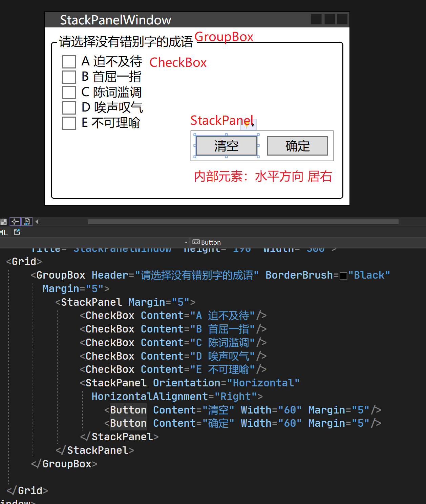

## 1、控件

WPF把那些能够展示数据、响应用户操作的UI元素称为控件(Control)。控件所展示的数据，我们称之为控件的“数据内容”;控件在响应用户的操作后会执行自己的一些方法或以事件(Event)的形式通知应用程序(程序员可以决定如何处理这些事件)，我们称之为控件的“行为”或“算法内容”。可见，WPF中的控件扮演着双重角色——Control是数据和行为的载体。

常用控件有6类：

1. 布局控件：可以容纳多个控件或嵌套其他布局控件，用于在 UI上组织和排列控件。Grid、StackPanel、DockPanel 等控件都属此类，它们拥有共同的父类Panel。
2. 内容控件：只能容纳一个其他控件或布局控件作为它的内容。Window、Button等控件属于此类，因为只能容纳一个控件作为其内容，所以经常需要借助布局控件来规划其内容。它们的共同父类是 ContentControl。
3. 带标题内容控件：相当于一个内容控件，但可以加一个标题(Header)，标题部分亦可容纳一个控件或布局。GroupBox、Tabltem等是这类控件的典型代表。它们的共同父类是 HeaderedContentControl
4. 条目控件：可以显示一列数据，一般情况下这列数据的类型相同。此类控件包括 ListBoxComboBox等。它们的共同基类是 ItemsControl。此类控件在显示集合类型数据方面功能非常强大。
5. 带标题条目控件：相当于一个条目控件加上一个标题显示区。TreeViewItem、Menultem 都属于此类控件。这类控件往往用于显示层级关系数据，结点显示在其Header 区域，子级结点则显示在其条目控件区域。此类控件的共同基类是HeaderedItemsControl。
6. 特殊内容控件：比如 TextBox容纳的是字符串、TextBlock 可以容纳可自由控制格式的文本、Image 容纳图片类型数据，这类控件相对比较独立。

## 2、WPF内容模型

WPF的UI会形成一个树形结构，如果不考虑控件内部的组成结构，只观察由**控件组成的“树”，那么这棵树称为逻辑树(LogicalTree)**；WPF控件往往是由更基本的控件构成的，即控件本身就是一棵树，如果**连控件本身的树也考虑在内**，则这棵比逻辑树更“繁茂”的树称为**可视元素树(VisualTree)**

控件是内存中的对象，控件的内容也是内存中的对象。控件通过自己的某个属性引用着作为其内容的对象，这个属性称为**内容属性(ContentProperty)**。“内容属性”是个统称，具体到每种控件上，内容属性都有自己确切的名字--有的直接就叫Content，有的叫Child；有些控件的内容可以是集合，其内容属性有叫Items或Children的。
控件的内容属性与XAML标签的内容存在一定的对应关系，下面稍做解释。

## 3、各类内容模型详解

大图查看

[空间所属关系]:./xmind/ControlOwnershipRelationship.xmind


### 3.1、ContentControl族

单一内容控件，本族元素的特点如下:

- 均派生自ContentControl类
- 它们都是控件(Control)。
- 内容属性的名称为 Content。
- 只能由单一元素充当其内容。

```html
<Window x:Class="HelloWPF2.ContentControl"
        xmlns="http://schemas.microsoft.com/winfx/2006/xaml/presentation"
        xmlns:x="http://schemas.microsoft.com/winfx/2006/xaml"
        xmlns:d="http://schemas.microsoft.com/expression/blend/2008"
        xmlns:mc="http://schemas.openxmlformats.org/markup-compatibility/2006"
        xmlns:local="clr-namespace:HelloWPF2"
        mc:Ignorable="d"
        Title="ContentControl" Height="450" Width="800">
    <StackPanel>
        <Button Margin="5">
            <TextBlock Text="Hello"/>
        </Button>
        <Button Margin="5">
            <Image Source=".\imgs\green.jpg" Width="30" Height="30"/>
        </Button>
        <GroupBox Margin="10" BorderBrush="Gray">
            <GroupBox.Header>
                <Image Source=".\imgs\yellowcar.jpg" Width="30" Height="30"/>
            </GroupBox.Header>
            <TextBlock TextWrapping="WrapWithOverflow" Margin="10" Text="一棵树、一匹马、一头大象和一只鸡打在一起，打一种日常品"/>
        </GroupBox>
    </StackPanel>
</Window>

```


### 3.2、HeaderdContentControl族

带标题的单一内容控件

```html
<Window x:Class="HelloWPF2.ContentControl"
        xmlns="http://schemas.microsoft.com/winfx/2006/xaml/presentation"
        xmlns:x="http://schemas.microsoft.com/winfx/2006/xaml"
        xmlns:d="http://schemas.microsoft.com/expression/blend/2008"
        xmlns:mc="http://schemas.openxmlformats.org/markup-compatibility/2006"
        xmlns:local="clr-namespace:HelloWPF2"
        mc:Ignorable="d"
        Title="ContentControl" Height="450" Width="800">
    <StackPanel>
        <GroupBox Margin="10" BorderBrush="Gray">
            <GroupBox.Header>
                <Image Source=".\imgs\yellowcar.jpg" Width="30" Height="30"/>
            </GroupBox.Header>
            <TextBlock TextWrapping="WrapWithOverflow" Margin="10" Text="一棵树、一匹马、一头大象和一只鸡打在一起，打一种日常品"/>
        </GroupBox>
    </StackPanel>
</Window>

```


### 3.3、ItemsControl族

以条目集合为内容的控件，本族元素的特点如下:

- 均派生自 ItemsControl类。
- 它们都是控件，用于显示列表化的数据。
- 内容属性为Items或ItemsSource
- 每种 ItemsControl都对应有自己的条目容器(Item Container)。

WPF的U是树形结构，```VisualTreeHelper``` 类就是帮助我们在这棵由可视化元素构成的树上进行导航的辅助类。我们沿着被单击的 Button 一层一层向上找，找到第三层发现它是一个 ListBoxltem。ListBoxltem 就是ListBox对应的 Item Container，也就是说，无论你把什么样的数据集合交给ListBox，它都会以这种方式进行自动包装。

```html
<Window x:Class="HelloWPF2.ItemControl"
        xmlns="http://schemas.microsoft.com/winfx/2006/xaml/presentation"
        xmlns:x="http://schemas.microsoft.com/winfx/2006/xaml"
        xmlns:d="http://schemas.microsoft.com/expression/blend/2008"
        xmlns:mc="http://schemas.openxmlformats.org/markup-compatibility/2006"
        xmlns:local="clr-namespace:HelloWPF2"
        mc:Ignorable="d"
        Title="ItemControl" Height="450" Width="800">
    <Grid>
        <ListBox Margin="5">
            <CheckBox x:Name="checkBoxTim" Content="Tim"/>
            <CheckBox x:Name="checkBoxTom" Content="Tom"/>
            <CheckBox x:Name="checkBoxBruce" Content="Bruce"/>
            <Button x:Name="buttonMess" Content="Mess"/>
            <Button x:Name="buttonOwen" Content="Owen"/>
            <Button x:Name="buttonVictor" Content="Victor" Click="buttonVictor_Click"/>
        </ListBox>
    </Grid>
</Window>

```

.cs文件

```C#
using System;
using System.Collections.Generic;
using System.Linq;
using System.Text;
using System.Threading.Tasks;
using System.Windows;
using System.Windows.Controls;
using System.Windows.Data;
using System.Windows.Documents;
using System.Windows.Input;
using System.Windows.Media;
using System.Windows.Media.Imaging;
using System.Windows.Shapes;

namespace HelloWPF2
{
    /// <summary>
    /// ItemControl.xaml 的交互逻辑
    /// </summary>
    public partial class ItemControl : Window
    {
        public ItemControl()
        {
            InitializeComponent();
        }

        private void buttonVictor_Click(object sender, RoutedEventArgs e)
        {
            Button vic = sender as Button; //VisualTreeHelper可视化元素构成的树上进行导航
            DependencyObject l1 = VisualTreeHelper.GetParent(vic);
            DependencyObject l2 = VisualTreeHelper.GetParent(l1);
            DependencyObject l3 = VisualTreeHelper.GetParent(l2);
            MessageBox.Show(l3.GetType().ToString());
        }
    }
}

```


上面这个例子是单纯地为了说明ItemsControl能够使用对应的Item Container 自动包装数据。

实际工作中，除非列表里的元素自始至终都是固定的我们才使用这种直接把U元素作为ItemsControl 内容的方法，比如一年有十二个月、一周有七天等。大多数情况下，UI上的列表会用于显示动态的后台数据，这时候我们交给ItemsControl的就是程序逻辑中的数据而非控件了。

定义列表中的显示的对象类Employee

```C#
using System;
using System.Collections.Generic;
using System.Linq;
using System.Text;
using System.Threading.Tasks;

namespace HelloWPF2.Entities
{
    public class Employee
    {
        public int Id { get; set; }
        public string Name { get; set; }
        public int Age { get; set; }

        public Employee(int id, string name, int age)
        {
            Id = id;
            Name = name;
            Age = age;
        }
    }
}
```

xmal设计：

```xmal
<ListBox Margin="0,5,10,5" Grid.Column="1" x:Name="EmployeeListBox"/>
```

.cs文件 中绑定xmal中的ListBox，设置其数据源

```C#
using System;
using System.Collections.Generic;
using System.Linq;
using System.Text;
using System.Threading.Tasks;
using System.Windows;
using System.Windows.Controls;
using System.Windows.Data;
using System.Windows.Documents;
using System.Windows.Input;
using System.Windows.Media;
using System.Windows.Media.Imaging;
using System.Windows.Shapes;
using HelloWPF2.Entities;

namespace HelloWPF2
{
    /// <summary>
    /// ItemControl.xaml 的交互逻辑
    /// </summary>
    public partial class ItemControl : Window
    {
        List<Employee> employees = new List<Employee>()
        {
            new Employee(1,"Tim",22) , new Employee(2,"Tom",22) , 
            new Employee(3,"Owen",22) ,new Employee(4,"Victor",22) ,
            new Employee(5,"Liu",22) ,new Employee(6,"Hu",22) 
        };
        public ItemControl()
        {
            InitializeComponent();
            //DisplayMemberPath告诉ListBox显示每条数据的哪个属性
            //调用这个属性值的 ToString()方法，把得到的字符串放入一个TextBlock(最简单的文本控件)，然后再把TextBlock包装进一个ListBoxltem里
            this.EmployeeListBox.DisplayMemberPath = "Name";
            this.EmployeeListBox.SelectedValuePath = "Id";
            this.EmployeeListBox.ItemsSource = employees;
        }
    }
}

```

效果：


```DisplayMemberPath```告诉ListBox显示每条数据的哪个属性，调用这个属性值的 ToString()方法，把得到的字符串放入一个TextBlock(最简单的文本控件)，然后再把TextBlock包装进一个ListBoxltem里

```SelectedValuePath```与```SelectedValue```配合使用：当调用SelectedValue属性时，ListBox先找到选中的Item所对应的数据对象，然后把SelectedValuePath的值当作数据对象的属性名称并把这个属性的值取出来。

DisplayMemberPath 和 SelectedValuePath 是两个相当简化的属性。**DisplayMemberPath 只能显示简单的字符串，想用更加复杂的形式显示数据需要使用 DataTemplate**，我们在后面的章节详细讨论：**SelectedValuePath 也只能返回单一的值**，如果想进行一些复杂的操作，不妨直接使用ListBox的Selectedltem 和 Selectedltems属性，这两个属性返回的就是数据集合中的对象，得到原始的数据对象后就任由程序员操作了。

### 3.4、HeaderItemControl族

带标题的以条目集合为内容的控件，顾名思义，本族控件除了具有ItemsControl的特性外，还具显示标题的能力。本族元素的特点如下:

- 均派生自 HeaderedItemsControl 类。

- 它们都是控件，用于显示列表化的数据，同时可以显示一个标题
- 内容属性为Items、ItemsSource 和 Header

本族控件只有3个:Menultem、TreeViewltem、ToolBar.

### 3.5、Decorator族

控件装饰元素，本族中的元素是在 UI上起装饰效果的。如可以使用 Border 元素为一些组织在一起的内容加个边框。如果需要组织在一起的内容能够自由缩放，则可使用 ViewBox元素。本族元素的特点如下:

- 均派生自 Decorator 类。
- 起 UI 装饰作用。
- 内容属性为Child。
- 只能由单一元素充当内容。


### 3.6、TextBlock和TextBox

文本输入框，静态文字 这两个控件最主要的功能是显示文本。

|          | TextBlock 静态文本                           | TextBox 文本输入框 |
| -------- | -------------------------------------------- | ------------------ |
| 能否编辑 | 不能编辑                                     | 能编辑             |
| 排版     | 丰富的印刷级的格式控制标记显示专业的排版效果 | 简单的字符串       |
| 内容属性 | Inlines(印刷中的“行”) + Text                 | Text               |

### 3.7、Shape族元素

图形元素

友好的用户界面离不开各种图形的搭配，Shape族元素(它们只是简单的视觉元素，不是控件)就是专门用来在 UI 上绘制图形的一类元素。这类元素没有自己的内容，我们可以使用 Fill 属性为它们设置填充效果，还可以使用Stroke属性为它们设置边线的效果。本族元素的特点如下:

- 均派生自 Shape 类
- 用于 2D 图形绘制。
- 无内容属性。
- 使用Fill 属性设置填充，使用Stroke属性设置边线。

### 3.8、Panel族元素

所有用于U布局的元素都属于这一族，本族元素的特点如下:

- 均派生自 Panel 抽象类。
- 主要功能是控制 U布局。
- 内容属性为Children。内容可以是多个元素，Panel元素将控制它们的布局。

对比 ItemsControl和 Panel 元素，虽然内容都可以是多个元素，但ItemsControl 强调以列表的形式来展现数据而Panel则强调对包含的元素进行布局,所以ItemsControl的内容属性是 Items和ItemsSource而Panel的内容属性名为Children。

Adorner 文字点缀元素

## 4、UI布局 Layout

### 4.1布局元素

传统的 Windows Form或ASP.NET 开发中，一般是把窗体或页面当作一个以左上角为原点的坐标系。窗体或页面上的控件依靠这个坐标系来布局，布局的办法就是调整控件在这个坐标系中的横纵坐标值。这样一来，控件与控件之间的关系要么就是相邻要么就是叠压。

WPF的控件有了Content的概念，所以控件与控件之间又多出一种关系--包含。也正是这种以窗体为根的包含关系，整个 WPF的U才形成树形结构，我们称之为可视化树(Visual Tree)，WPF中的布局元素如下：

- Grid网格：可以自定义行和列并通过行列的数量、行高和列宽来调整控件的布局。近似于 HTML 中的 Table。
- StackPanel栈式面板：可将包含的元素在竖直或水平方向上排成一条直线，当移除一个元素后，后面的元素会自动向前移动以填充空缺。
- Canvas:画布。内部元素可以使用以像素为单位的绝对坐标进行定位，类似于WindowsForm 编程的布局方式。
- DockPanel泊靠式面板：内部元素可以选择泊靠方向，类似于在Windows Form 编程中设置控件的 Dock 属性。
- WrapPanel自动折行面板：内部元素在排满一行后能够自动折行，类似于 HTML 中的流式布局。

### 4.2、Grid

顾名思义，Grid 元素会以网格的形式对内容元素们(即它的Children)进行布局。Grid 的特点如下:

- 可以定义任意数量的行和列，非常灵活。
- 行的高度和列的宽度可以使用绝对数值、相对比例或自动调整的方式进行精确设定，并可设置最大和最小值。
- 内部元素可以设置自己的所在的行和列，还可以设置自己纵向跨几行、横向跨几列。可以设置 Children元素的对齐方向。

基于这些特点，Grid适用的场合有:

1. UI布局的大框架设计。
2. 大量 UI 元素需要成行或者成列对齐的情况。
3. UI整体尺寸改变时，元素需要保持固有的高度和宽度比例。
4. UI后期可能有较大变更或扩展。

#### 4.2.1、设置3行4列

通过xmal布局设置：

```html
<Grid x:Name="grideMain" Loaded="grideMain_Loaded">
        <Grid.ColumnDefinitions>
            <ColumnDefinition/>
            <ColumnDefinition/>
            <ColumnDefinition/>
            <ColumnDefinition/>
        </Grid.ColumnDefinitions>
        <Grid.RowDefinitions>
            <RowDefinition/>
            <RowDefinition/>
            <RowDefinition/>
        </Grid.RowDefinitions>
</Grid>
```

通过代码动态设置：

```C#
using System;
using System.Collections.Generic;
using System.Linq;
using System.Text;
using System.Threading.Tasks;
using System.Windows;
using System.Windows.Controls;
using System.Windows.Data;
using System.Windows.Documents;
using System.Windows.Input;
using System.Windows.Media;
using System.Windows.Media.Imaging;
using System.Windows.Shapes;

namespace WPFUI
{
    /// <summary>
    /// Grid.xaml 的交互逻辑
    /// </summary>
    public partial class GridWindow : Window
    {
        public GridWindow()
        {
            InitializeComponent();
        }

        private void grideMain_Loaded(object sender, RoutedEventArgs e)
        {
            this.grideMain.ColumnDefinitions.Add(new ColumnDefinition());
            this.grideMain.ColumnDefinitions.Add(new ColumnDefinition());
            this.grideMain.ColumnDefinitions.Add(new ColumnDefinition());
            this.grideMain.ColumnDefinitions.Add(new ColumnDefinition());

            this.grideMain.RowDefinitions.Add(new RowDefinition());
            this.grideMain.RowDefinitions.Add(new RowDefinition());
            this.grideMain.RowDefinitions.Add(new RowDefinition());

            this.grideMain.ShowGridLines = true;
        }
    }
}

```

如果两边都对同一个组件进行了设置，那么效果会叠加。xmal中设置2行3列，C#代码中设置1行2列，最终会变成3行5列。

#### 4.2.2、设置行高度和列宽度

计算机图形设计的标准单位是像素(Pixel)，所以Grid的宽度和高度单位就是像素。除了可以使用像素作为单位外，Grid 还接受英寸(Inch)、厘米(Centimeter)和点(Point)作为单位，单位换算如下：

| 英文       | 中文 | 简写               | 换算              |
| ---------- | ---- | ------------------ | ----------------- |
| Pixel      | 像素 | px(默认值，可省略) |                   |
| Inch       | 英寸 | in                 | 1 in= 96 px       |
| Centimeter | 厘米 | cm                 | 1 cm = 96/2.54 px |
| Point      | 点   | pt                 | 1 pt = 96/72 px   |

接下来回答第二个问题。对于 Grid 的行高和列宽，我们可以设置三类值：

- 绝对值：double数值加单位后缀。
- 比例值：double 数值后加一个星号(“*”)。使用了 `Width="1*"` 的列会占据剩余空间的一部分，并且根据比例进行分配。
- 自动值：字符串 Auto。使用了 `Width="Auto"` 的列的宽度将根据其内容自动调整，不占据剩余空间，而是根据内容的大小进行调整。

行高和列宽的默认形式就是比例值，所以如果没有显式指定行高或列宽时，默认值就是```1*```，```1*```又可以简写为```*```。

样例：

```html
<Window x:Class="WPFUI.GridWindow"
        xmlns="http://schemas.microsoft.com/winfx/2006/xaml/presentation"
        xmlns:x="http://schemas.microsoft.com/winfx/2006/xaml"
        xmlns:d="http://schemas.microsoft.com/expression/blend/2008"
        xmlns:mc="http://schemas.openxmlformats.org/markup-compatibility/2006"
        xmlns:local="clr-namespace:WPFUI"
        mc:Ignorable="d"
        Title="留言板" Height="240" Width="400"
        MinHeight="200" MinWidth="340" MaxHeight="400" MaxWidth="600">
    <Grid Margin="10">
        <Grid.RowDefinitions>
            <RowDefinition Height="25"/>
            <RowDefinition Height="4"/>
            <RowDefinition Height="*"/>
            <RowDefinition Height="4"/>
            <RowDefinition Height="25"/>
        </Grid.RowDefinitions>
        <Grid.ColumnDefinitions>
            <ColumnDefinition Width="Auto"/>
            <ColumnDefinition Width="*"/>
            <ColumnDefinition Width="80"/>
            <ColumnDefinition Width="4"/>
            <ColumnDefinition Width="80"/>
        </Grid.ColumnDefinitions>
        <TextBlock Text="请选择你的部门并留言：" Grid.Row="0" Grid.Column="0"  VerticalAlignment="Center"/>
        <ComboBox Grid.Row="0" Grid.Column="1" Grid.ColumnSpan="4"/>
        <TextBox Grid.Row="2" Grid.Column="0" Grid.ColumnSpan="5" BorderBrush="Black"/>
        <Button Content="提交" Grid.Row="4" Grid.Column="2"/>
        <Button Content="清除" Grid.Row="4" Grid.Column="4"/>
    </Grid>
</Window>
```

指定一个控件在某行某列，就为这个控件的标签添加 ```Grid.Row="行编号"  Grid.Column="列编号"```这样的 Attribute，若行编号为0或列编号为0(即控件处于首行首列)则可省略这个 Attribute。
若控件需要跨多个行或列，使用 ```Grid.RowSpan="行数"  Grid.ColumnSpan="列数"```两个 Attribute。

效果：


如果把两个元素放在 Grid 的同一个单元格内，则代码中后书写的元素将盖在先书写的元素之上，如果想让盖在后面的元素显示出来，可以把上面元素的 Visibility设置为 HHidden或 Collapsed，也可以把上面元素的 Opacity 属性设置为 0。

### 4.3、StackPanel

面板类元素StackPanel 可以把内部元素在纵向或横向上紧凑排列、形成栈式布局，通俗地讲就是把内部元素像垒积木一样“撂起来”。垒积木大家都玩过，当把排在前面的积木块抽掉之后排在它后面的元素会整体向前移动、补占原有元素的空间。基于这个特点，StackPanel适合的场合有：

1. 同类元素需要紧凑排列(如制作菜单或者列表)。
2. 移除其中的元素后能够自动补缺的布局或者动画。

StackPanel 使用3个属性来控制内部元素的布局，它们是 Orientation、HorizontalAlignment 和VerticalAlignment

| 属性名称            | 数据类型                 | 可取值                       | 描述                               |
| ------------------- | ------------------------ | ---------------------------- | ---------------------------------- |
| Orientation         | Orientation 枚举         | Horizontal<br />Vertical     | 决定内部是横向累积还是纵向累积     |
| HorizontalAlignment | HorizontalAlignment 枚举 | Left、Center、Right、Stretch | 决定内部元素是水平方向上的对齐方式 |
| VerticalAlignment   | VerticalAlignment 枚举   | Top、Center、Bottom、Stretch | 决定内部元素竖直方向上的对齐方式   |

举个例子:如果我需要一个菜单,这个菜单里的每个条目被单击后就会脱离原来的位置并在主显示区域展开成-张地图，其他排在它后面的条目会自动向前移动、补占原来条目的位置，这时候就应该选用StackPanel。因为 StackPanel 会自动把后面的条目向前移动而无需我们自己动手写代码。如果你选Grid，那么你就需要写一个算法把后面的条目向前移动。


```html
<Window x:Class="WPFUI.StackPanelWindow"
        xmlns="http://schemas.microsoft.com/winfx/2006/xaml/presentation"
        xmlns:x="http://schemas.microsoft.com/winfx/2006/xaml"
        xmlns:d="http://schemas.microsoft.com/expression/blend/2008"
        xmlns:mc="http://schemas.openxmlformats.org/markup-compatibility/2006"
        xmlns:local="clr-namespace:WPFUI"
        mc:Ignorable="d"
        Title="StackPanelWindow" Height="190" Width="300">
    <Grid>
        <GroupBox Header="请选择没有错别字的成语" BorderBrush="Black" Margin="5">
            <StackPanel Margin="5">
                <CheckBox Content="A 迫不及待"/>
                <CheckBox Content="B 首屈一指"/>
                <CheckBox Content="C 陈词滥调"/>
                <CheckBox Content="D 唉声叹气"/>
                <CheckBox Content="E 不可理喻"/>
                <StackPanel Orientation="Horizontal" HorizontalAlignment="Right">
                    <Button Content="清空" Width="60" Margin="5"/>
                    <Button Content="确定" Width="60" Margin="5"/>
                </StackPanel>
            </StackPanel>
        </GroupBox>
       
    </Grid>
</Window>
```



### 4.4、Canvas

Canvas 译成中文就是“画布”，显然，在 Canvas 里布局就像在画布上画控件一样。使用 Canvas布局与在 Windows Form 窗体上布局基本上是一样的，只是在 Windows Form 开发时我们通过设置控件的Le 和 Top等属性来确定控件在窗体上的位置,而 WPF 的控件没有 Left 和 Top 等属性，就像把控件放在 Grid 里时会被附加上 Grid.Column 和 Grid.Row 属性一样，当控件被放置在 Canvas里时就会被附加上Canvas.X和Canvas.Y 属性。
Canvas适用的场合包括:

1. 一经设计基本上不会再有改动的小型布局(如图标)。
2. 艺术性比较强的布局。
3. 需要大量使用横纵坐标进行绝对点定位的布局。
4. 依赖于横纵坐标的动画。

下面的代码是一个使用 Canvas 代替 Grid 设计的登录窗口，除非你确定这个窗口的布局以后不会改变而且窗体尺寸固定，不然还是用 Grid 进行布局弹性会更好。

```html
<Window x:Class="WPFUI.CanvasWindow"
        xmlns="http://schemas.microsoft.com/winfx/2006/xaml/presentation"
        xmlns:x="http://schemas.microsoft.com/winfx/2006/xaml"
        xmlns:d="http://schemas.microsoft.com/expression/blend/2008"
        xmlns:mc="http://schemas.openxmlformats.org/markup-compatibility/2006"
        xmlns:local="clr-namespace:WPFUI"
        mc:Ignorable="d"
        Title="CanvasWindow" Height="140" Width="300">
    <Canvas>
        <TextBlock Text="用户名" Canvas.Left="12" Canvas.Top="12"/>
        <TextBox Height="23" Width="200" BorderBrush="Black" Canvas.Left="66" Canvas.Top="9"/>
        <TextBlock Text="密码" Canvas.Left="16" Canvas.Top="36"/>
        <TextBox Height="23" Width="200" BorderBrush="Black" Canvas.Left="66" Canvas.Top="38"/>
        <Button Content="确定" Width="80" Height="22" Canvas.Left="100" Canvas.Top="67"/>
        <Button Content="清除" Width="80" Height="22" Canvas.Left="186" Canvas.Top="67"/>
    </Canvas>
</Window>

```


### 4.5、DockPanel

1. **分割区域/停靠位置：**DockPanel内的元素会被附加上 DockPanel.Dock 这个属性，并根据Dock属性值（Top、Bottom、Left、Right）让这些区域根据指定的方向沿着容器的边界停靠。
2. **填充：** DockPanel的LastChildFill（bool类型），它的默认值是True。当LastChildFill属性的值为 True 时，DockPanel 内最后一个元素的 DockPanel.Dock 属性值会被忽略，这个元素会把 DockPanel 内部所有剩余空间充满。--这也正好解释了为什么 Dock枚举类型没有 Fill 这个值。
3. **相对位置：** 子元素可以相对于其他停靠在 DockPanel 上的子元素进行布局。例如，如果一个子元素停靠在 DockPanel 的顶部，另一个子元素可以停靠在该子元素的下方

下面是一个 DockPanel 的简单示例:

```html
<Window x:Class="WPFUI.DockPanelWindow"
        xmlns="http://schemas.microsoft.com/winfx/2006/xaml/presentation"
        xmlns:x="http://schemas.microsoft.com/winfx/2006/xaml"
        xmlns:d="http://schemas.microsoft.com/expression/blend/2008"
        xmlns:mc="http://schemas.openxmlformats.org/markup-compatibility/2006"
        xmlns:local="clr-namespace:WPFUI"
        mc:Ignorable="d"
        Title="DockPanelWindow" Height="300" Width="400">
    <Grid>
        <DockPanel>
            <TextBox DockPanel.Dock="Top" Height="25" Text="Top" BorderBrush="Black"/>
            <TextBox DockPanel.Dock="Left" Width="150" Text="Left" BorderBrush="Black"/>
            <TextBox Text="None" BorderBrush="Black"/>
        </DockPanel>
    </Grid>
</Window>
```

效果：


如果想将下面两个TextBox做成可以来回拉伸的分隔栏来调整TextBox的宽度，只能用Grid和GridSplitter实现，实现代码如下：

```xmal
<Window x:Class="WPFUI.GridSplitterWindow"
        xmlns="http://schemas.microsoft.com/winfx/2006/xaml/presentation"
        xmlns:x="http://schemas.microsoft.com/winfx/2006/xaml"
        xmlns:d="http://schemas.microsoft.com/expression/blend/2008"
        xmlns:mc="http://schemas.openxmlformats.org/markup-compatibility/2006"
        xmlns:local="clr-namespace:WPFUI"
        mc:Ignorable="d"
        Title="GridSplitterWindow" Height="450" Width="800">
    <Grid>
        <Grid.RowDefinitions>
            <RowDefinition Height="25"/>
            <RowDefinition/>
        </Grid.RowDefinitions>
        <Grid.ColumnDefinitions>
            <ColumnDefinition Width="150"/>
            <ColumnDefinition Width="Auto"/>
            <ColumnDefinition/>
        </Grid.ColumnDefinitions>
        <TextBox Grid.ColumnSpan="3" BorderBrush="Black" Background="LightBlue"/>
        <TextBox Grid.Row="1" BorderBrush="Black" Background="DodgerBlue"/>
        <GridSplitter Grid.Row="1" Grid.Column="1"
                      VerticalAlignment="Stretch"
                      HorizontalAlignment="Center"
                      Width="5" Background="Gray"
                      ShowsPreview="True"/>
        <TextBox Grid.Row="1" Grid.Column="2" BorderBrush="Black" Background="CadetBlue"/>
    </Grid>
</Window>
```

定义两行，三列：一行为上面的固定行，第二行做分割行

0列为蓝色的TextBox，1列为灰色的分隔条GridSplitter，2列为绿色的TextBox

效果：


### 4.6、WrapPanel

WrapPanel内部采用的是流式布局。WrapPanel 使用 Orientation 属性来控制流延伸的方向，使用 HorizontalAlignment 和 VerticalAlignment 两个属性控制内部控件的对齐。在流延伸的方向上，WrapPanel会排列尽可能多的控件，排不下的控件将会新起一行或一列继续排列。

如：在WrapPanel中写8个button，运行后伸缩窗体，按钮会根据每行的宽度自动排列

```html
<Window x:Class="WPFUI.WrapPanelWindow"
        xmlns="http://schemas.microsoft.com/winfx/2006/xaml/presentation"
        xmlns:x="http://schemas.microsoft.com/winfx/2006/xaml"
        xmlns:d="http://schemas.microsoft.com/expression/blend/2008"
        xmlns:mc="http://schemas.openxmlformats.org/markup-compatibility/2006"
        xmlns:local="clr-namespace:WPFUI"
        mc:Ignorable="d"
        Title="WrapPanelWindow" Height="300" Width="400">
    <WrapPanel>
        <Button Width="50" Height="50" Content="OK"/>
        <Button Width="50" Height="50" Content="OK"/>
        <Button Width="50" Height="50" Content="OK"/>
        <Button Width="50" Height="50" Content="OK"/>
        <Button Width="50" Height="50" Content="OK"/>
        <Button Width="50" Height="50" Content="OK"/>
        <Button Width="50" Height="50" Content="OK"/>
        <Button Width="50" Height="50" Content="OK"/>
    </WrapPanel>
</Window>
```

效果：


