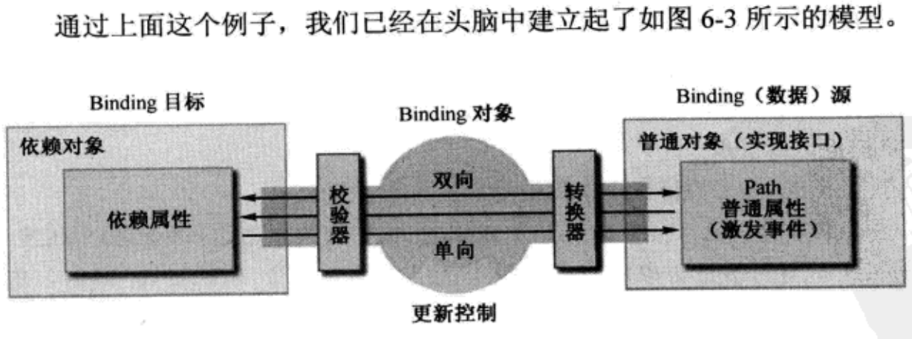
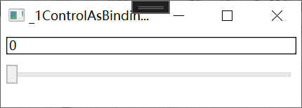
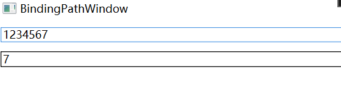
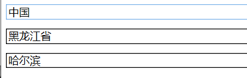
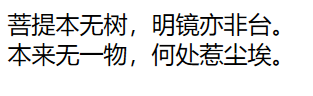

让我们回归程序的本质。程序的本质是数据加算法，用户给进一个输入，经过算法的处理程序会反馈一个输出。这里，数据处于程序的核心地位。反过头来再看“UI驱动程序”，数据处于被动地位，总是在等待程序接收来自UI的消息/事件后被处理或者算法完成处理后被显示。**如何在 GUI编程时把数据的地位由被动变主动、让数据回归程序的核心呢?这就是本章要详细讲述的 Data Binding.** 逻辑层、让展示层永远处于逻辑层的从属地位。WPF具有这种能力的关键是它引入了Data BindingProperty系统和DataTemplate概念以及与之配套的 Dependency。

## 1、DataBinding 基础

Binding是架在源Source和目标Target中间的桥梁，一般情况下，Binding源是逻辑层的对象，Binding目标是UI层的控件对象，这样数据就会源源不断通过 Binding 送达 UI 层、被 UI层展现，也就完成了数据驱动 UI 的过程。

UI上的元素关心的是哪**个属性值的变化**，这个属性就称为 Binding的路径(**Path**)。但光有属性还不行--Binding 是一种自动机制，当值变化后属性要有能力通知 Binding，让 Binding 把变化传递给 UI 元素。怎样才能让一个属性具备这种通知 Binding 值已经变化的能力呢?方法是在属性的set语句中激发一个 PropertyChanged 事件。这个事件不需要我们自己声明，我们要做的是让作为数据源的类实现 System.ComponentModel名称空间中的 INotifyPropertyChanged 接口。当为 Binding 设置了数据源后，Binding 就会自动侦听来自这个接口的 PropertyChanged 事件。

样例：

声明一个Student类

```C#
using System;
using System.Collections.Generic;
using System.ComponentModel;
using System.Linq;
using System.Text;
using System.Threading.Tasks;

namespace WPFBinding.Entity
{
    public class Student : INotifyPropertyChanged
    {
        public event PropertyChangedEventHandler? PropertyChanged;
        private string name;

        public string StudentName
        {
            get
            {
                return name;
            }
            set
            {
                name = value;
                if (PropertyChanged != null) PropertyChanged(this, new PropertyChangedEventArgs("StudentName"));
            }
        }
    }
}

```

设计一个窗口，点击按钮后通过binding的值修改textbox的显示内容

```xmal
<Window x:Class="WPFBinding.SimpleBindingWindow"
        xmlns="http://schemas.microsoft.com/winfx/2006/xaml/presentation"
        xmlns:x="http://schemas.microsoft.com/winfx/2006/xaml"
        xmlns:d="http://schemas.microsoft.com/expression/blend/2008"
        xmlns:mc="http://schemas.openxmlformats.org/markup-compatibility/2006"
        xmlns:local="clr-namespace:WPFBinding"
        mc:Ignorable="d"
        Title="SimpleBindingWindow" Height="110" Width="300">
    <StackPanel>
        <TextBox x:Name="textBox1" BorderBrush="Black" Margin="5"/>
        <Button Content="Add Age" Margin="5" Click="Button_Click"/>
    </StackPanel>
</Window>
```

在 .cs 文件中添加目标TextBox与源StudentName的绑定

```C#
using System;
using System.Collections.Generic;
using System.Linq;
using System.Text;
using System.Threading.Tasks;
using System.Windows;
using System.Windows.Controls;
using System.Windows.Data;
using System.Windows.Documents;
using System.Windows.Input;
using System.Windows.Media;
using System.Windows.Media.Imaging;
using System.Windows.Shapes;
using WPFBinding.Entity;

namespace WPFBinding
{
    /// <summary>
    /// SimpleBindingWindow.xaml 的交互逻辑
    /// </summary>
    public partial class SimpleBindingWindow : Window
    {
        Student stu;
        public SimpleBindingWindow()
        {
            InitializeComponent();
            //准备数据源
            stu = new Student();
            //准备Binding
            Binding binding = new Binding();
            binding.Source = stu;
            binding.Path = new PropertyPath("StudnetName");//为binding指定访问路径
            //使用Binding连接数据源与Binding目标
            BindingOperations.SetBinding(this.textBox1,TextBox.TextProperty, binding);
        }

        private void Button_Click(object sender, RoutedEventArgs e)
        {
            stu.StudnetName += "Name";
        }
    }
}
```

实际工作中，实施 Binding 的代码可能与上面看到的不太一样，原因是 TextBox 这类 UI元素的基类 FrameworkElement 对 BindingOperations.SetBinding(...)方法进行了封装，封装的结果也叫SetBinding，只是参数列表发生了变化。代码如下:

```C#
this.textBox1.SetBinding(TextBox.TextProperty, new Binding("StudentName") { Source = stu = new Student() });
```



## 2、Binding 的源与路径

Binding的源也就是数据的源头。Binding 对源的要求并不苛刻--只要它是一个对象，并且通过属性公开自己的数据，它就能作为 Binding的源。

### 2.1、把控件作为Binding 源与Binding标记扩展

前面提过，大多数情况下 Binding 的源是逻辑层的对象，但有时候为了让 UI 元素产生一些联动效果也会使用 Binding 在控件间建立关联。

下面的代码是把一个 TextBox的 Text 属性关联在了Slider的Value属性上。

```xmal
<Window x:Class="WPFBinding._1ControlAsBindingWindow"
        xmlns="http://schemas.microsoft.com/winfx/2006/xaml/presentation"
        xmlns:x="http://schemas.microsoft.com/winfx/2006/xaml"
        xmlns:d="http://schemas.microsoft.com/expression/blend/2008"
        xmlns:mc="http://schemas.openxmlformats.org/markup-compatibility/2006"
        xmlns:local="clr-namespace:WPFBinding"
        mc:Ignorable="d"
        Title="_1ControlAsBindingWindow" Height="110" Width="300">
    <StackPanel>
        <TextBox x:Name="textBox1" Text="{Binding Path=Value,ElementName=slider1}" BorderBrush="Black" Margin="5"/>
        <Slider x:Name="slider1" Maximum="100" Minimum="0" Margin="5"/>
    </StackPanel>
</Window>
```

效果：



```xmal
 <TextBox x:Name="textBox1" Text="{Binding Path=Value,ElementName=slider1}" BorderBrush="Black" Margin="5"/>
```

等价于

```C#
this.textBox1.SetBinding(TextBox.TextProperty,new Binding("Value") { ElementName = "slider1" })
```

Binding 的标记扩展语法，初看起来平淡无奇甚至有些别扭，但细品起来就会发现它的精巧之处。说它“别扭”是因为我们已经习惯了 Text="Hello World"这种“键一值”式的赋值方式，而且认为值与属性的数据类型一定要一致--大脑很快会质询 Text-"{Binding Value,ElementName=sliderl}"的字面意思--Text 的类型是 string,为什么要赋一个 Binding 类型的值呢?

其实，我们并不是为 Text 属性“赋了一个 Binding 类型的值”，为了消除这个误会，你可以把这句代码读作“为Text 属性设置 Binding 为……”"。再想深一步，在编程时我们不是经常把函数视为一个值吗?只是这个值需要在函数执行结束后才能得到。同理，我们也可以把{Binding)视为一个值，只是这个值并非像"Hello World"字符串一样直接和固定。也就是说，我们可以把 Binding 视为一种间接的、不固定的赋值方式--Binding 标记扩展很恰当地表示了这个含义。

### 2.2、控制Binding方面及数据更新

Binding 在源与目标之间架起了沟通的桥梁，默认情况下数据既能够通过 Binding 送达目标，也能够从目标返回源(收集用户对数据的修改)。有时候数据只需要展示给用户、不允许用户修改，这时候可以把 Binding 模式更改为从源向目标的单向沟通。Binding 还支持从目标向源的单向沟通以及只在 Binding 关系确立时读取一次数据，这需要我们根据实际情况去选择。

控制 Binding 数据流向的属性是 Mode，它的类型是 BindingMode 枚举。BindingMode 可取值为**TwoWay、OneWay、OnTime、OneWayToSource 和 Default**。这里的 Default 值是指 Binding 的模式会根据目标的实际情况来确定，比如若是可编辑的(如TextBox.Text属性)，Default 就采用双向模式;若是只读的(如TextBlock.Text)则采用单向模式。

```xmal
 <TextBox x:Name="textBox1" Text="{Binding Path=Value,ElementName=slider1}" BorderBrush="Black" Margin="5"/>
```

Binding的基础上增加 UpdateSourceTrigger=PropertyChanged，则可以通过TextBox修改slider的拖动条位置

```xmal
<TextBox x:Name="textBox1" Text="{Binding ElementName=slider1, Path=Value,
           UpdateSourceTrigger=PropertyChanged}" BorderBrush="Black" Margin="5"/>
```

UpdateSourceTrigger，它的类型是UpdateSourceTrigger枚举，可取值为**PropertyChanged、LostFocus、Explicit 和 Default**。显然，对于 TextBox 默认值 Default 的行为与LostFocus 一致，我们只需要把这个属性改为 PropertyChanged，则 Slider 的手柄就会随着我们在 TextBox 里的输入而改变位置。

顺便提一句，Binding还具有 NotifyOnSourceUpdated和 NolifyOnTargetUpdated两个bool类型的属性，如果设为 true,则当源或目标被更新后 Binding会激发相应的 SourceUpdated事件和 TargetUpdated事件。实际工作中，我们可以通过监听这两个事件来找出有哪些数据或控件被更新了。

### 2.3、Binding的路径 path

作为 Binding 源的对象可能有很多属性，通过这些属性 Binding 源可以把数据暴露给外界。那么，Binding到底需要关注哪个属性的值呢?这就需要由 Binding的Path 属性来指定了。

例如前面这个例子，我们是把 Slider 控件对象当作源、把它的 Value 属性作为路径。尽管在 XAML 代码中或者 Binding 类的构造器参数列表中我们以一个字符串来表示 Path，但Path 的实际类型是 PropertyPath。

下面让我们看看如何创建 Path 来应对各种情况(我将使用 XAMI和 C#两种语言描述)。

最简单的情况就是直接把Binding关联在 Binding 源的属性上，前面的例子就是这样。语法如下:

```xmal
 <TextBox x:Name="textBox1" Text="{Binding Path=Value,ElementName=slider1}"/>
```

等价于

```xmal
 <TextBox x:Name="textBox2"/>
```

组合C#代码：

```C#
 Binding binding = new Binding()
 {
     Path = new PropertyPath("Value"),
     Source = this.slider1
 };
this.textBox2.SetBinding(TextBox.TextProperty, binding);
```

其中C# 的Binding 对象利用第二个参数的构造方法，还可以简写为

```C#
        //
        // 摘要:
        //     Initializes a new instance of the System.Windows.Data.Binding class.
        public Binding();
        //
        // 摘要:
        //     Initializes a new instance of the System.Windows.Data.Binding class with an initial
        //     path.
        //
        // 参数:
        //   path:
        //     The initial System.Windows.Data.Binding.Path for the binding.
        public Binding(string path);
```

可以简写为

```C#
Binding binding = new Binding("Value")
{                
    Source = this.slider1
};
this.textBox2.SetBinding(TextBox.TextProperty, binding);
```

样例：让一个TextBox显示另外一个TextBox的文本长度

```xmal
<Window x:Class="WPFBinding._3BindingPathWindow"
        xmlns="http://schemas.microsoft.com/winfx/2006/xaml/presentation"
        xmlns:x="http://schemas.microsoft.com/winfx/2006/xaml"
        xmlns:d="http://schemas.microsoft.com/expression/blend/2008"
        xmlns:mc="http://schemas.openxmlformats.org/markup-compatibility/2006"
        xmlns:local="clr-namespace:WPFBinding"
        mc:Ignorable="d"
        Title="BindingPathWindow" Height="450" Width="800">
    <StackPanel>
        <TextBox x:Name="textbox1" BorderBrush="Black" Margin="5"/>
        <TextBox x:Name="textbox2" BorderBrush="Black" Margin="5" Text="{Binding Path=Text.Length,ElementName=textbox1,Mode=OneWay}"/>
    </StackPanel>
</Window>
```

效果：



当使用一个集合或DataView作为Bindind源时，如果我们想把它的默认元素当做Path使用，则需要使用这样的语法：

```xmal
<TextBox x:Name="textbox3" BorderBrush="Black" Margin="5"/>
<TextBox x:Name="textbox4" BorderBrush="Black" Margin="5"/>
<TextBox x:Name="textbox5" BorderBrush="Black" Margin="5"/>
```

对应CS文件

```C#
List<string> strList = new List<string>() { "Tim", "Tom", "Blog" };
this.textbox3.SetBinding(TextBox.TextProperty,new Binding("/") { Source = strList });
this.textbox4.SetBinding(TextBox.TextProperty, new Binding("/Length") { Source = strList ,Mode = BindingMode.OneWay});
this.textbox5.SetBinding(TextBox.TextProperty, new Binding("/[2]") { Source = strList, Mode = BindingMode.OneWay });
```

效果：


`BindingMode` 枚举定义了绑定的方向，指定了数据如何在目标对象和源对象之间进行传输。`BindingMode` 枚举包括以下几个值：

1. **OneWay**：数据从源对象传输到目标对象，但不会反向传输。这意味着当源对象的值发生变化时，目标对象会更新，但是目标对象的变化不会影响源对象。
2. **TwoWay**：数据可以在源对象和目标对象之间双向传输。当源对象的值发生变化时，目标对象会更新，同时当目标对象的值发生变化时，也会更新源对象。
3. **OneTime**：数据只在初始化绑定时从源对象传输到目标对象，之后不再更新。这意味着一旦绑定建立，源对象的变化不会影响目标对象，也不会反向传输。
4. **OneWayToSource**：与 OneWay 相反，数据从目标对象传输到源对象，但不会反向传输。这意味着当目标对象的值发生变化时，源对象会更新，但是源对象的变化不会影响目标对象。
5. **Default**：指定使用默认的绑定模式。通常情况下，`Default` 和 `TwoWay` 是一样的，但具体取决于绑定的目标对象。

如果集合元素的属性仍然还是一个集合，我们想把子级集合中的元素当作Path，则可以使用多级斜线的语法(即一路“斜线”下去)，例如:

定义一个多层结构的类：

```C#
using System;
using System.Collections.Generic;
using System.Linq;
using System.Text;
using System.Threading.Tasks;

namespace WPFBinding.Entity
{
    public class City
    {
        /// <summary>
        /// 城市名
        /// </summary>
        public string CityName { get; set; }

        public City(string cityName)
        {
            CityName = cityName;
        }
    }
    public class Province
    {
        /// <summary>
        /// 省名
        /// </summary>
        public string ProvinceName { get; set;}
        /// <summary>
        /// 省下的城市List
        /// </summary>
        public List<City> CityList { get; set;}

        public Province(string provinceName, List<City> cityList)
        {
            ProvinceName = provinceName;
            CityList = cityList;
        }
    }
    public class Country
    {
        /// <summary>
        /// 国家名
        /// </summary>
        public string CountryName { get; set;}
        /// <summary>
        /// 国家下的省List
        /// </summary>
        public List<Province> ProvinceList { get; set;}

        public Country(string countryName, List<Province> provinceList)
        {
            CountryName = countryName;
            ProvinceList = provinceList;
        }
    }
}
```

xmal代码

```xmal
<!--测试多级集合的值作为数据源-->
<TextBox x:Name="textbox6" BorderBrush="Black" Margin="5"/>
<TextBox x:Name="textbox7" BorderBrush="Black" Margin="5"/>
<TextBox x:Name="textbox8" BorderBrush="Black" Margin="5"/>
```

.cs代码：

```C#
 //测试多级集合的值作为数据源
List<City> cityList = new List<City>()
{
    new City("哈尔滨"), new City("齐齐哈尔"), new City("双鸭山")
};
List<Province> provinceList = new List<Province>() { new Province("黑龙江省", cityList) };
List<Country> countryList = new List<Country>(){new Country("中国",provinceList)};
this.textbox6.SetBinding(TextBox.TextProperty, new Binding("CountryName") { Source = countryList });
this.textbox7.SetBinding(TextBox.TextProperty, new Binding("ProvinceList[0].ProvinceName") { Source = countryList });
this.textbox8.SetBinding(TextBox.TextProperty, new Binding("ProvinceList[0].CityList[0].CityName") { Source = countryList });
```

效果：



### 2.4、没有Path的Binding

有的时候我们会在代码中看到一些 Path是一个“.”或者干脆没有Path的Binding，着实让人摸不着头脑。原来，这是一种比较特殊的情况--Binding 源本身就是数据且不需要 Path 来指明。典型的，string、int 等基本类型就是这样，他们的实例本身就是数据，我们无法指出通过它的哪个属性来访问这个数据，这时我们只需将Path 的值设置为```“.”```就可以了。在 XAML 代码里这个“.”可以省略不写，```但在C#代码里却不能省略```。请看下面的代码：

```xmal
<Window x:Class="WPFBinding._3BindingPathWindow"
        xmlns="http://schemas.microsoft.com/winfx/2006/xaml/presentation"
        xmlns:x="http://schemas.microsoft.com/winfx/2006/xaml"
        xmlns:d="http://schemas.microsoft.com/expression/blend/2008"
        xmlns:mc="http://schemas.openxmlformats.org/markup-compatibility/2006"
        xmlns:local="clr-namespace:WPFBinding" 
        xmlns:sys="clr-namespace:System;assembly=System.Runtime"
        mc:Ignorable="d"
        Title="BindingPathWindow" Height="450" Width="800">
    <StackPanel>
        <StackPanel.Resources>
            <sys:String x:Key="str">
                菩提本无树，明镜亦非台。
                本来无一物，何处惹尘埃。
            </sys:String>
        </StackPanel.Resources>
        <TextBlock x:Name="TextBlock1" Margin="5" TextWrapping="Wrap" FontSize="16"
                   Text="{Binding Path=., Source={StaticResource ResourceKey=str}}"/>
    </StackPanel>
</Window>
```

效果：



```xmal
<TextBlock x:Name="TextBlock1" Margin="5" TextWrapping="Wrap" FontSize="16"
                   Text="{Binding Path=., Source={StaticResource ResourceKey=str}}"/>
由于Binding类有一个参数为Path的构造函数，所以Path=可以省略
<TextBlock x:Name="TextBlock1" Margin="5" TextWrapping="Wrap" FontSize="16"
                   Text="{Binding ., Source={StaticResource ResourceKey=str}}"/>
又因为在 XAML代码里这个“.”可以省略不写，所以可以完全去掉Path           
<TextBlock x:Name="TextBlock1" Margin="5" TextWrapping="Wrap" FontSize="16"
                   Text="{Binding Source={StaticResource ResourceKey=str}}"/>
```

### 2.5、为Binding指定源Source的方法

### 2.6、没有Source的Binding——使用DataContext作为Binding的源

### 2.7、使用集合对象作为列表控件的ItemsSource

### 2.8、使用ADO.NET作为Binding的源

### 2.9、使用XML作为Binding的源

### 2.10、使用LINQ检索结果作为Binding的源

### 2.11、使用ObjectDataProvider对象作为Binding的源

### 2.12、使用Binding的RelativeSource

## 3、Binding 对数据的转换与校验

NuGet\Install-Package Prism.Wpf -Version 8.1.97