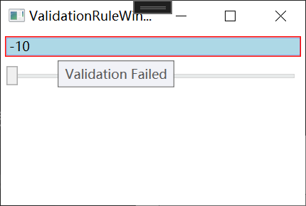

DataContext

让我们回归程序的本质。程序的本质是数据加算法，用户给进一个输入，经过算法的处理程序会反馈一个输出。这里，数据处于程序的核心地位。反过头来再看“UI驱动程序”，数据处于被动地位，总是在等待程序接收来自UI的消息/事件后被处理或者算法完成处理后被显示。**如何在 GUI编程时把数据的地位由被动变主动、让数据回归程序的核心呢?这就是本章要详细讲述的 Data Binding.** 逻辑层、让展示层永远处于逻辑层的从属地位。WPF具有这种能力的关键是它引入了Data BindingProperty系统和DataTemplate概念以及与之配套的 Dependency。

## 1、DataBinding 基础

Binding是架在源Source和目标Target中间的桥梁，一般情况下，Binding源是逻辑层的对象，Binding目标是UI层的控件对象，这样数据就会源源不断通过 Binding 送达 UI 层、被 UI层展现，也就完成了数据驱动 UI 的过程。

UI上的元素关心的是哪**个属性值的变化**，这个属性就称为 Binding的路径(**Path**)。但光有属性还不行--Binding 是一种自动机制，当值变化后属性要有能力通知 Binding，让 Binding 把变化传递给 UI 元素。怎样才能让一个属性具备这种通知 Binding 值已经变化的能力呢?方法是在属性的set语句中激发一个 PropertyChanged 事件。这个事件不需要我们自己声明，我们要做的是让作为数据源的类实现 System.ComponentModel名称空间中的 INotifyPropertyChanged 接口。当为 Binding 设置了数据源后，Binding 就会自动侦听来自这个接口的 PropertyChanged 事件。

样例：

声明一个Student类

```C#
using System;
using System.Collections.Generic;
using System.ComponentModel;
using System.Linq;
using System.Text;
using System.Threading.Tasks;

namespace WPFBinding.Entity
{
    public class Student : INotifyPropertyChanged
    {
        public event PropertyChangedEventHandler? PropertyChanged;
        private string name;

        public string StudentName
        {
            get
            {
                return name;
            }
            set
            {
                name = value;
                if (PropertyChanged != null) PropertyChanged(this, new PropertyChangedEventArgs("StudentName"));
            }
        }
    }
}

```

设计一个窗口，点击按钮后通过binding的值修改textbox的显示内容

```html
<Window x:Class="WPFBinding.SimpleBindingWindow"
        xmlns="http://schemas.microsoft.com/winfx/2006/xaml/presentation"
        xmlns:x="http://schemas.microsoft.com/winfx/2006/xaml"
        xmlns:d="http://schemas.microsoft.com/expression/blend/2008"
        xmlns:mc="http://schemas.openxmlformats.org/markup-compatibility/2006"
        xmlns:local="clr-namespace:WPFBinding"
        mc:Ignorable="d"
        Title="SimpleBindingWindow" Height="110" Width="300">
    <StackPanel>
        <TextBox x:Name="textBox1" BorderBrush="Black" Margin="5"/>
        <Button Content="Add Age" Margin="5" Click="Button_Click"/>
    </StackPanel>
</Window>
```

在 .cs 文件中添加目标TextBox与源StudentName的绑定

```C#
using System;
using System.Collections.Generic;
using System.Linq;
using System.Text;
using System.Threading.Tasks;
using System.Windows;
using System.Windows.Controls;
using System.Windows.Data;
using System.Windows.Documents;
using System.Windows.Input;
using System.Windows.Media;
using System.Windows.Media.Imaging;
using System.Windows.Shapes;
using WPFBinding.Entity;

namespace WPFBinding
{
    /// <summary>
    /// SimpleBindingWindow.xaml 的交互逻辑
    /// </summary>
    public partial class SimpleBindingWindow : Window
    {
        Student stu;
        public SimpleBindingWindow()
        {
            InitializeComponent();
            //准备数据源
            stu = new Student();
            //准备Binding
            Binding binding = new Binding();
            binding.Source = stu;
            binding.Path = new PropertyPath("StudnetName");//为binding指定访问路径
            //使用Binding连接数据源与Binding目标
            BindingOperations.SetBinding(this.textBox1,TextBox.TextProperty, binding);
        }

        private void Button_Click(object sender, RoutedEventArgs e)
        {
            stu.StudnetName += "Name";
        }
    }
}
```

实际工作中，实施 Binding 的代码可能与上面看到的不太一样，原因是 TextBox 这类 UI元素的基类 FrameworkElement 对 BindingOperations.SetBinding(...)方法进行了封装，封装的结果也叫SetBinding，只是参数列表发生了变化。代码如下:

```C#
this.textBox1.SetBinding(TextBox.TextProperty, new Binding("StudentName") { Source = stu = new Student() });
```


## 2、Binding 的路径 Path

Binding的源也就是数据的源头。Binding 对源的要求并不苛刻--只要它是一个对象，并且通过属性公开自己的数据，它就能作为 Binding的源。

### 2.1、把控件作为Binding 源与Binding标记扩展

前面提过，大多数情况下 Binding 的源是逻辑层的对象，但有时候为了让 UI 元素产生一些联动效果也会使用 Binding 在控件间建立关联。

下面的代码是把一个 TextBox的 Text 属性关联在了Slider的Value属性上。

```html
<Window x:Class="WPFBinding._1ControlAsBindingWindow"
        xmlns="http://schemas.microsoft.com/winfx/2006/xaml/presentation"
        xmlns:x="http://schemas.microsoft.com/winfx/2006/xaml"
        xmlns:d="http://schemas.microsoft.com/expression/blend/2008"
        xmlns:mc="http://schemas.openxmlformats.org/markup-compatibility/2006"
        xmlns:local="clr-namespace:WPFBinding"
        mc:Ignorable="d"
        Title="_1ControlAsBindingWindow" Height="110" Width="300">
    <StackPanel>
        <TextBox x:Name="textBox1" Text="{Binding Path=Value,ElementName=slider1}" BorderBrush="Black" Margin="5"/>
        <Slider x:Name="slider1" Maximum="100" Minimum="0" Margin="5"/>
    </StackPanel>
</Window>
```

效果：


```html
 <TextBox x:Name="textBox1" Text="{Binding Path=Value,ElementName=slider1}" BorderBrush="Black" Margin="5"/>
```

等价于

```C#
this.textBox1.SetBinding(TextBox.TextProperty,new Binding("Value") { ElementName = "slider1" })
```

Binding 的标记扩展语法，初看起来平淡无奇甚至有些别扭，但细品起来就会发现它的精巧之处。说它“别扭”是因为我们已经习惯了 Text="Hello World"这种“键一值”式的赋值方式，而且认为值与属性的数据类型一定要一致--大脑很快会质询 Text-"{Binding Value,ElementName=sliderl}"的字面意思--Text 的类型是 string,为什么要赋一个 Binding 类型的值呢?

其实，我们并不是为 Text 属性“赋了一个 Binding 类型的值”，为了消除这个误会，你可以把这句代码读作“为Text 属性设置 Binding 为……”"。再想深一步，在编程时我们不是经常把函数视为一个值吗?只是这个值需要在函数执行结束后才能得到。同理，我们也可以把{Binding)视为一个值，只是这个值并非像"Hello World"字符串一样直接和固定。也就是说，我们可以把 Binding 视为一种间接的、不固定的赋值方式--Binding 标记扩展很恰当地表示了这个含义。

### 2.2、控制Binding方面及数据更新

Binding 在源与目标之间架起了沟通的桥梁，默认情况下数据既能够通过 Binding 送达目标，也能够从目标返回源(收集用户对数据的修改)。有时候数据只需要展示给用户、不允许用户修改，这时候可以把 Binding 模式更改为从源向目标的单向沟通。Binding 还支持从目标向源的单向沟通以及只在 Binding 关系确立时读取一次数据，这需要我们根据实际情况去选择。

控制 Binding 数据流向的属性是 Mode，它的类型是 BindingMode 枚举。BindingMode 可取值为**TwoWay、OneWay、OnTime、OneWayToSource 和 Default**。这里的 Default 值是指 Binding 的模式会根据目标的实际情况来确定，比如若是可编辑的(如TextBox.Text属性)，Default 就采用双向模式;若是只读的(如TextBlock.Text)则采用单向模式。

```html
 <TextBox x:Name="textBox1" Text="{Binding Path=Value,ElementName=slider1}" BorderBrush="Black" Margin="5"/>
```

Binding的基础上增加 UpdateSourceTrigger=PropertyChanged，则可以通过TextBox修改slider的拖动条位置

```html
<TextBox x:Name="textBox1" Text="{Binding ElementName=slider1, Path=Value,
           UpdateSourceTrigger=PropertyChanged}" BorderBrush="Black" Margin="5"/>
```

UpdateSourceTrigger，它的类型是UpdateSourceTrigger枚举，可取值为**PropertyChanged、LostFocus、Explicit 和 Default**。显然，对于 TextBox 默认值 Default 的行为与LostFocus 一致，我们只需要把这个属性改为 PropertyChanged，则 Slider 的手柄就会随着我们在 TextBox 里的输入而改变位置。

顺便提一句，Binding还具有 NotifyOnSourceUpdated和 NolifyOnTargetUpdated两个bool类型的属性，如果设为 true,则当源或目标被更新后 Binding会激发相应的 SourceUpdated事件和 TargetUpdated事件。实际工作中，我们可以通过监听这两个事件来找出有哪些数据或控件被更新了。

### 2.3、Binding的路径 path

作为 Binding 源的对象可能有很多属性，通过这些属性 Binding 源可以把数据暴露给外界。那么，Binding到底需要关注哪个属性的值呢?这就需要由 Binding的Path 属性来指定了。

例如前面这个例子，我们是把 Slider 控件对象当作源、把它的 Value 属性作为路径。尽管在 XAML 代码中或者 Binding 类的构造器参数列表中我们以一个字符串来表示 Path，但Path 的实际类型是 PropertyPath。

下面让我们看看如何创建 Path 来应对各种情况(我将使用 XAMI和 C#两种语言描述)。

最简单的情况就是直接把Binding关联在 Binding 源的属性上，前面的例子就是这样。语法如下:

```html
 <TextBox x:Name="textBox1" Text="{Binding Path=Value,ElementName=slider1}"/>
```

等价于

```html
 <TextBox x:Name="textBox2"/>
```

组合C#代码：

```C#
 Binding binding = new Binding()
 {
     Path = new PropertyPath("Value"),
     Source = this.slider1
 };
this.textBox2.SetBinding(TextBox.TextProperty, binding);
```

其中C# 的Binding 对象利用第二个参数的构造方法，还可以简写为

```C#
        //
        // 摘要:
        //     Initializes a new instance of the System.Windows.Data.Binding class.
        public Binding();
        //
        // 摘要:
        //     Initializes a new instance of the System.Windows.Data.Binding class with an initial
        //     path.
        //
        // 参数:
        //   path:
        //     The initial System.Windows.Data.Binding.Path for the binding.
        public Binding(string path);
```

可以简写为

```C#
Binding binding = new Binding("Value")
{                
    Source = this.slider1
};
this.textBox2.SetBinding(TextBox.TextProperty, binding);
```

样例：让一个TextBox显示另外一个TextBox的文本长度

```html
<Window x:Class="WPFBinding._3BindingPathWindow"
        xmlns="http://schemas.microsoft.com/winfx/2006/xaml/presentation"
        xmlns:x="http://schemas.microsoft.com/winfx/2006/xaml"
        xmlns:d="http://schemas.microsoft.com/expression/blend/2008"
        xmlns:mc="http://schemas.openxmlformats.org/markup-compatibility/2006"
        xmlns:local="clr-namespace:WPFBinding"
        mc:Ignorable="d"
        Title="BindingPathWindow" Height="450" Width="800">
    <StackPanel>
        <TextBox x:Name="textbox1" BorderBrush="Black" Margin="5"/>
        <TextBox x:Name="textbox2" BorderBrush="Black" Margin="5" Text="{Binding Path=Text.Length,ElementName=textbox1,Mode=OneWay}"/>
    </StackPanel>
</Window>
```

效果：


当使用一个集合或DataView作为Bindind源时，如果我们想把它的默认元素当做Path使用，则需要使用这样的语法：

```html
<TextBox x:Name="textbox3" BorderBrush="Black" Margin="5"/>
<TextBox x:Name="textbox4" BorderBrush="Black" Margin="5"/>
<TextBox x:Name="textbox5" BorderBrush="Black" Margin="5"/>
```

对应CS文件

```C#
List<string> strList = new List<string>() { "Tim", "Tom", "Blog" };
this.textbox3.SetBinding(TextBox.TextProperty,new Binding("/") { Source = strList });
this.textbox4.SetBinding(TextBox.TextProperty, new Binding("/Length") { Source = strList ,Mode = BindingMode.OneWay});
this.textbox5.SetBinding(TextBox.TextProperty, new Binding("/[2]") { Source = strList, Mode = BindingMode.OneWay });
```

效果：


`BindingMode` 枚举定义了绑定的方向，指定了数据如何在目标对象和源对象之间进行传输。`BindingMode` 枚举包括以下几个值：

1. **OneWay**：数据从源对象传输到目标对象，但不会反向传输。这意味着当源对象的值发生变化时，目标对象会更新，但是目标对象的变化不会影响源对象。
2. **TwoWay**：数据可以在源对象和目标对象之间双向传输。当源对象的值发生变化时，目标对象会更新，同时当目标对象的值发生变化时，也会更新源对象。
3. **OneTime**：数据只在初始化绑定时从源对象传输到目标对象，之后不再更新。这意味着一旦绑定建立，源对象的变化不会影响目标对象，也不会反向传输。
4. **OneWayToSource**：与 OneWay 相反，数据从目标对象传输到源对象，但不会反向传输。这意味着当目标对象的值发生变化时，源对象会更新，但是源对象的变化不会影响目标对象。
5. **Default**：指定使用默认的绑定模式。通常情况下，`Default` 和 `TwoWay` 是一样的，但具体取决于绑定的目标对象。

如果集合元素的属性仍然还是一个集合，我们想把子级集合中的元素当作Path，则可以使用多级斜线的语法(即一路“斜线”下去)，例如:

定义一个多层结构的类：

```C#
using System;
using System.Collections.Generic;
using System.Linq;
using System.Text;
using System.Threading.Tasks;

namespace WPFBinding.Entity
{
    public class City
    {
        /// <summary>
        /// 城市名
        /// </summary>
        public string CityName { get; set; }

        public City(string cityName)
        {
            CityName = cityName;
        }
    }
    public class Province
    {
        /// <summary>
        /// 省名
        /// </summary>
        public string ProvinceName { get; set;}
        /// <summary>
        /// 省下的城市List
        /// </summary>
        public List<City> CityList { get; set;}

        public Province(string provinceName, List<City> cityList)
        {
            ProvinceName = provinceName;
            CityList = cityList;
        }
    }
    public class Country
    {
        /// <summary>
        /// 国家名
        /// </summary>
        public string CountryName { get; set;}
        /// <summary>
        /// 国家下的省List
        /// </summary>
        public List<Province> ProvinceList { get; set;}

        public Country(string countryName, List<Province> provinceList)
        {
            CountryName = countryName;
            ProvinceList = provinceList;
        }
    }
}
```

xmal代码

```html
<!--测试多级集合的值作为数据源-->
<TextBox x:Name="textbox6" BorderBrush="Black" Margin="5"/>
<TextBox x:Name="textbox7" BorderBrush="Black" Margin="5"/>
<TextBox x:Name="textbox8" BorderBrush="Black" Margin="5"/>
```

.cs代码：

```C#
 //测试多级集合的值作为数据源
List<City> cityList = new List<City>()
{
    new City("哈尔滨"), new City("齐齐哈尔"), new City("双鸭山")
};
List<Province> provinceList = new List<Province>() { new Province("黑龙江省", cityList) };
List<Country> countryList = new List<Country>(){new Country("中国",provinceList)};
this.textbox6.SetBinding(TextBox.TextProperty, new Binding("CountryName") { Source = countryList });
this.textbox7.SetBinding(TextBox.TextProperty, new Binding("ProvinceList[0].ProvinceName") { Source = countryList });
this.textbox8.SetBinding(TextBox.TextProperty, new Binding("ProvinceList[0].CityList[0].CityName") { Source = countryList });
```

效果：


### 2.4、没有Path的Binding

有的时候我们会在代码中看到一些 Path是一个“.”或者干脆没有Path的Binding，着实让人摸不着头脑。原来，这是一种比较特殊的情况--Binding 源本身就是数据且不需要 Path 来指明。典型的，string、int 等基本类型就是这样，他们的实例本身就是数据，我们无法指出通过它的哪个属性来访问这个数据，这时我们只需将Path 的值设置为```“.”```就可以了。在 XAML 代码里这个“.”可以省略不写，```但在C#代码里却不能省略```。请看下面的代码：

```html
<Window x:Class="WPFBinding._3BindingPathWindow"
        xmlns="http://schemas.microsoft.com/winfx/2006/xaml/presentation"
        xmlns:x="http://schemas.microsoft.com/winfx/2006/xaml"
        xmlns:d="http://schemas.microsoft.com/expression/blend/2008"
        xmlns:mc="http://schemas.openxmlformats.org/markup-compatibility/2006"
        xmlns:local="clr-namespace:WPFBinding" 
        xmlns:sys="clr-namespace:System;assembly=System.Runtime"
        mc:Ignorable="d"
        Title="BindingPathWindow" Height="450" Width="800">
    <StackPanel>
        <StackPanel.Resources>
            <sys:String x:Key="str">
                菩提本无树，明镜亦非台。
                本来无一物，何处惹尘埃。
            </sys:String>
        </StackPanel.Resources>
        <TextBlock x:Name="TextBlock1" Margin="5" TextWrapping="Wrap" FontSize="16"
                   Text="{Binding Path=., Source={StaticResource ResourceKey=str}}"/>
    </StackPanel>
</Window>
```

效果：


```html
<TextBlock x:Name="TextBlock1" Margin="5" TextWrapping="Wrap" FontSize="16"
                   Text="{Binding Path=., Source={StaticResource ResourceKey=str}}"/>
由于Binding类有一个参数为Path的构造函数，所以Path=可以省略
<TextBlock x:Name="TextBlock1" Margin="5" TextWrapping="Wrap" FontSize="16"
                   Text="{Binding ., Source={StaticResource ResourceKey=str}}"/>
又因为在 XAML代码里这个“.”可以省略不写，所以可以完全去掉Path           
<TextBlock x:Name="TextBlock1" Margin="5" TextWrapping="Wrap" FontSize="16"
                   Text="{Binding Source={StaticResource ResourceKey=str}}"/>
```

## 3、Binding 指定源 Source的方法

Binding的源是数据的来源，所以，只要一个对象包含数据并能通过属性把数据暴露出来，它就能当作 Binding 的源来使用。包含数据的对象比比皆是，但必须为 Binding的 Source 指定合适的对象，Binding才能正确工作，常见的办法有：

1. 把普通 CLR 类型```单个对象```指定为Source：包括.NETFramework自带类型的对象和用户自定义类型的对象。如果类型实现了INotifyPropertyChanged 接口，则可通过在属性的set语句里激发 PropertyChanged 事件来通知 Binding 数据已被更新。
2. 把容器的```DataContext ```指定为 Source(WPF Data Binding 的默认行为)：有时候我们会遇到这样的情况--我们明确知道将从哪个属性获取数据，但具体把哪个对象作为 Binding源还不能确定。这时候，我们只能先建立一个 Binding 只给它设置Path 而不设置 Source，让这个 Binding 自己去寻找 Source。这时候 Binding 会自动把控件的 DataContext 当作自己的 Source(它会沿着控件树一层一层向外找，直到找到带有 Path 指定属性的对象为止)。
3. 把普通 CLR ```集合```类型对象指定为Source：包括数组、List<T>、ObservableCollection<T>等集合类型。实际工作中，我们经常需要把一个集合作为ItemsControl派生类的数据源来使用，一般是把控件的ItemsSource 属性使用 Binding关联到一个集合对象上。
4. 把 ```ADO.NET```数据对象指定为Source：包括DataTable 和 DataView等对象。
5. 使用 XmlDataProvider 把```XML数据```指定为Source：XML 作为标准的数据存储和传输格式几乎无处不在，我们可以用它表示单个数据对象或者集合；一些WPF控件是级联式的(如 TreeView 和 Menu)，我们可以把树状结构的 XML 数据作为源指定给与之关联的Binding。
6. 把```依赖对象(DependencyObject)```指定为Source：依赖对象不仅可以作为 Binding的目标，同时也可以作为 Binding的源。这样就有可能形成 Binding链。依赖对象中的依赖属性可以作为 Binding 的 Path.
7. 通过 ```ElementName```指定Source：在C#代码里可以直接把对象作为 Source 赋值给 Binding，但 XAML无法访问对象，所以只能使用对象的Name 属性来找到对象。
8. 通过 Binding 的``` RelativeSource 属性```相对地指定Source：当控件需要关注自己的、自己容器的或者自己内部元素的某个值就需要使用这种办法。
9. 把 ```ObjectDataProvider 对象```指定为 Source：当数据源的数据不是通过属性而是通过方法暴露给外界的时候，我们可以使用这两种对象来包装数据源再把它们指定为Source。
10. 把使用 ```LINQ 检索得到的数据对象```作为Binding的源

### 3.1、使用单个对象作为Binding的源

把单个CLR类型对象指定为Binding的Source，方法有两种：

把对象赋值给 Binding.Source 属性：

```html

<StackPanel.Resources>
    <sys:String x:Key="str">
        菩提本无树，明镜亦非台。
        本来无一物，何处惹尘埃。
    </sys:String>
</StackPanel.Resources>
<TextBlock x:Name="TextBlock1" Margin="5" TextWrapping="Wrap" FontSize="16" Text="{Binding Path=., Source={StaticResource ResourceKey=str}}"/>

```

把对象的 Name 赋值给 Binding.ElementName：

```html
<TextBox x:Name="textBox1" Text="{Binding ElementName=slider1, Path=Value,
               UpdateSourceTrigger=PropertyChanged}" BorderBrush="Black" Margin="5"/>
<Slider x:Name="slider1" Maximum="100" Minimum="0" Margin="5"/>
```

### 3.2、没有Source的Binding——使用DataContext作为Binding的源

DataContext 属性被定义在FrameworkElement 类里，这个类是 WPF 控件的基类，这意味着所有WPF控件(包括容器控件)都具备这个属性。如前所述，WPF的UI布局是树形结构，这棵树的每个结点都是控件，由此我们推出另一个结论——**在UI元素树的每个结点都有DataContext**。

这一点非常重要，因为当一个Binding **只知道自己的 Path 而不知道自己的 Soruce 时**，它会沿着 UI元素树一路向树的根部找，过去每路过一个结点就要看看这个结点的DataContext是否具有Path所指定的属性。如果有，那就把这个对象作为自己的Source；如果没有，那就继续找下去；如果到了树的根部还没有找到，那这个Binding就没有Source，因而也不会得到数据。让我们看下面的例子:

```html
<Window x:Class="WPFBinding.DataContextBinding"
        xmlns="http://schemas.microsoft.com/winfx/2006/xaml/presentation"
        xmlns:x="http://schemas.microsoft.com/winfx/2006/xaml"
        xmlns:d="http://schemas.microsoft.com/expression/blend/2008"
        xmlns:mc="http://schemas.openxmlformats.org/markup-compatibility/2006"
        xmlns:local="clr-namespace:WPFBinding.Entity"
        mc:Ignorable="d"
        Title="DataContextBinding" Height="135" Width="300">
    <StackPanel Background="LightBlue">
        <StackPanel.DataContext>
            <local:Person Id="9" Age="23" Name="Tim"/>
        </StackPanel.DataContext>
        <Grid>
            <StackPanel>
                <TextBox Text="{Binding Path=Id}" Margin="5"/>
                <TextBox Text="{Binding Path=Name}" Margin="5"/>
                <TextBox Text="{Binding Path=Age}" Margin="5"/>
            </StackPanel>
        </Grid>
    </StackPanel>
</Window>
```

这个例子中，三个TextBox的Binding中只指定了Path的值，但最终却能显示Person对象的值，是因为他们沿着UI元素树向上找到了Path指定的元素对应的值。（简单点理解一下，类似子类继承父类，如果子类中没有声明父类的属性，当子类的实例中使用父类的属性时，就会根据继承关系一层一层向上找，直至找到此属性值，若没有找到则返回null）


由于Binding类有以Path为参数的构造函数，所以还可以简写为

```html
<TextBox Text="{Binding Id}" Margin="5"/>
<TextBox Text="{Binding Name}" Margin="5"/>
<TextBox Text="{Binding Age}" Margin="5"/>
```

根据 2.4 没有Path的Binding 所示，当Binding的Source本身就是数据源、不需要属性暴露数据时（Binding 的 Source 为 基本数据类型时）Path可以设置为 ```.```，或不写。结合Source为DataContext的情况，可以写一个下面的样例：

```html
<Window x:Class="WPFBinding.DataContextBinding"
        xmlns="http://schemas.microsoft.com/winfx/2006/xaml/presentation"
        xmlns:x="http://schemas.microsoft.com/winfx/2006/xaml"
        xmlns:d="http://schemas.microsoft.com/expression/blend/2008"
        xmlns:mc="http://schemas.openxmlformats.org/markup-compatibility/2006"
        xmlns:local="clr-namespace:WPFBinding.Entity" 
        xmlns:sys="clr-namespace:System;assembly=mscorlib"
        mc:Ignorable="d"
        Title="DataContextBinding" Height="135" Width="400">
    <StackPanel Background="LightBlue">
        <StackPanel.DataContext>
            <local:Person Id="9" Age="23" Name="Tim"/>
        </StackPanel.DataContext>
        <Grid>
            <Grid.DataContext>
                <sys:String>Hello DataContext!</sys:String>
            </Grid.DataContext>
            <TextBox Text="{Binding  Mode=OneWay}" Margin="5" Background="LightGreen"/>
        </Grid>
        <Grid>
            <StackPanel>
                <TextBox Text="{Binding Path=Id}" Margin="5"/>
                <TextBox Text="{Binding Path=Name}" Margin="5"/>
                <TextBox Text="{Binding Path=Age}" Margin="5"/>
            </StackPanel>
        </Grid>
    </StackPanel>
</Window>
```

效果：


需要注意一点： DataContext 属性是继承的，子控件会继承其父控件的 DataContext。下面3个TextBox的上一层为StackPanel，继承自最上面层的StackPanel的DataContext，所以获取到的是<StackPanel.DataContext>的Person。

每个控件只能有一个 DataContext，因为 DataContext 用于设置该控件及其子控件的数据源，这种绑定关系是一对一的。

在实际工作中 DataContext的用法是非常灵活的。比如:

(1)当U上的多个控件都使用 Binding 关注同一个对象时，不妨使用 DataContext。

(2)当作为Source的对象不能被直接访问的时候--比如B窗体内的控件想把A窗体内的控件当作自己的 Binding 源时，但A窗体内的控件是 private 访问级别，这时候就可以把这个控件(或者控件的值)作为窗体A的DataContext(这个属性是public访问级别的)从而暴露数据。形象地说，这时候外层容器的 DataContext 就相当于一个数据的“制高点”，只要把数据放上去，别的元素就都能看见。另外，DataContext本身也是一个依赖属性，我们可以使用Binding把它关联到一个数据源上。

### 3.3、使用集合对象作为列表控件的ItemsSource

```html
<Window x:Class="WPFBinding.ItemsSourceBinding"
        xmlns="http://schemas.microsoft.com/winfx/2006/xaml/presentation"
        xmlns:x="http://schemas.microsoft.com/winfx/2006/xaml"
        xmlns:d="http://schemas.microsoft.com/expression/blend/2008"
        xmlns:mc="http://schemas.openxmlformats.org/markup-compatibility/2006"
        xmlns:local="clr-namespace:WPFBinding"
        mc:Ignorable="d"
        Title="ItemsSourceBinding" Height="240" Width="300">
    <StackPanel x:Name="stackPanel" Background="LightBlue">
        <TextBlock Text="Student ID:" FontWeight="Bold" Margin="5"/>
        <TextBox x:Name="textBoxId" Margin="5"/>
        <TextBlock Text="Student List:" FontWeight="Bold" Margin="5"/>
        <ListBox x:Name="listBoxStudent" Height="110" Margin="5"/>
    </StackPanel>
</Window>

```

.cs文件

```C#
using System;
using System.Collections.Generic;
using System.Linq;
using System.Text;
using System.Threading.Tasks;
using System.Windows;
using System.Windows.Controls;
using System.Windows.Data;
using System.Windows.Documents;
using System.Windows.Input;
using System.Windows.Media;
using System.Windows.Media.Imaging;
using System.Windows.Shapes;
using WPFBinding.Entity;

namespace WPFBinding
{
    /// <summary>
    /// ItemsSourceBinding.xaml 的交互逻辑
    /// </summary>
    public partial class ItemsSourceBinding : Window
    {
        public ItemsSourceBinding()
        {
            InitializeComponent();
            //准备数据源
            List<Person> people = new List<Person>();
            people.Add(new Person(0, "Tim", 23));
            people.Add(new Person(1, "Tom", 25));
            people.Add(new Person(2, "Tony", 22));
            people.Add(new Person(3, "Vina", 28));
            people.Add(new Person(4, "Mike", 23));
            people.Add(new Person(5, "Kyle", 21));
            //ListBox设置Binding
            this.listBoxStudent.ItemsSource = people;
            this.listBoxStudent.DisplayMemberPath = "Name";
            //textBox设置binding
            Binding binding = new Binding("SelectedItem.Id") { Source=this.listBoxStudent};
            this.textBoxId.SetBinding(TextBox.TextProperty, binding);
        }
    }
}
```

效果：勾选列表的选项，textbox中显示id


```this.listBoxStudent.DisplayMemberPath = "Name";```当 DisplayMemberPath属性被赋值后，ListBox在获得 ItemsSource的时候就会创建等量的 ListBoxltem 并以 DisplayMemberPath 属性值为 Path 创建 Binding，Binding的目标是 ListBoxItem的内容插件。

当注释掉这句话时，xmal代码将变为：

```html
<!--<ListBox x:Name="listBoxStudent" Height="110" Margin="5"/>-->
        <ListBox x:Name="listBoxStudent" Height="110" Margin="5">
            <ListBox.ItemTemplate>
                <DataTemplate>
                    <StackPanel Orientation="Horizontal">
                        <TextBlock Text="{Binding Path=Id}" Width="30"/>
                        <TextBlock Text="{Binding Path=Name}" Width="30"/>
                        <TextBlock Text="{Binding Path=Age}" Width="30"/>
                    </StackPanel>
                </DataTemplate>
            </ListBox.ItemTemplate>
        </ListBox>
```

最后特别提醒大家一点:在使用集合类型作为列表控件的ItemsSource 时一般会考虑使用```ObservableCollection<T>代替List<T>```，因为 ObservableCollection<T>类实现了 ```INotifyCollectionChanged 和INotifyPropertyChanged 接口```，能把集合的变化立刻通知显示它的列表控件，改变会立刻显现出来。

### 3.4、使用ADO.NET作为Binding的源

首先使用EFCore连接sqlserver数据库添加点数据：

1）在WPFBinding项目中添加下面的项目依赖

```bash
NuGet\Install-Package Microsoft.EntityFrameworkCore -Version 6.0.0
NuGet\Install-Package Microsoft.EntityFrameworkCore.Relational -Version 6.0.0
NuGet\Install-Package Microsoft.EntityFrameworkCore.Design -Version 6.0.0
NuGet\Install-Package Microsoft.EntityFrameworkCore.Tools -Version 6.0.0

NuGet\Install-Package Microsoft.EntityFrameworkCore.SqlServer -Version 6.0.0
```

2）准备要映射到数据库的表对象

```C#
using System;
using System.Collections.Generic;
using System.ComponentModel.DataAnnotations;
using System.ComponentModel.DataAnnotations.Schema;
using System.Linq;
using System.Text;
using System.Threading.Tasks;

namespace WPFBinding.Entity
{
    [Table("T_Person")]
    public class Person
    {
        //设置自增主键
        [Key]
        [DatabaseGenerated(DatabaseGeneratedOption.Identity)]
        public int Id { get; set; }
        public string Name { get; set; }       
        public int Age { get; set; }

        public Person(int id, string name, int age)
        {
            Id = id;
            Name = name;
            Age = age;
        }

        public Person()
        {
        }

        public Person(string name, int age)
        {
            Name = name;
            Age = age;
        }
    }
}
```

3）新建一个DefaultDbContext作为数据库上下文

```C#
using System;
using System.Collections.Generic;
using System.Linq;
using System.Text;
using System.Threading.Tasks;
using Microsoft.EntityFrameworkCore;
using WPFBinding.Entity;

namespace WPFBinding.DBContexts
{
    public class DefaultDbContext : DbContext
    {
        public DbSet<Person> People { get; set; }
        protected override void OnConfiguring(DbContextOptionsBuilder optionsBuilder) 
        {
            //对数据库连接字符串
            optionsBuilder.UseSqlServer("Server=localhost;Database=test;User Id=sa;Password=root;"); 
        }
        protected override void OnModelCreating(ModelBuilder modelBuilder)
        {
            base.OnModelCreating(modelBuilder);
        }
    }
}
```

4）运行数据迁移指令，在数据库生成对应的表

```bash
Add-Migration add_table_student
预览确认生成无误后 更新数据库表
update-database
```

5）新建一个窗口用于新增Person表数据

```html
<Window x:Class="WPFBinding.PersonWindow"
        xmlns="http://schemas.microsoft.com/winfx/2006/xaml/presentation"
        xmlns:x="http://schemas.microsoft.com/winfx/2006/xaml"
        xmlns:d="http://schemas.microsoft.com/expression/blend/2008"
        xmlns:mc="http://schemas.openxmlformats.org/markup-compatibility/2006"
        xmlns:local="clr-namespace:WPFBinding"
        mc:Ignorable="d"
        Title="PersonWindow" Height="300" Width="300">
    <StackPanel>
        <TextBlock Text="Student Name:" FontWeight="Bold" Margin="5"/>
        <TextBox x:Name="stuName" Margin="5"/>
        <TextBlock Text="Student Age:" FontWeight="Bold" Margin="5"/>
        <TextBox x:Name="stuAge" Margin="5"/>
        <Button Content="submit" Click="Button_Click" HorizontalAlignment="Center" Background="LightBlue"/>
    </StackPanel>
</Window>
```

.cs文件

```C#
using System;
using System.Collections.Generic;
using System.Data;
using System.Linq;
using System.Text;
using System.Threading.Tasks;
using System.Windows;
using System.Windows.Controls;
using System.Windows.Data;
using System.Windows.Documents;
using System.Windows.Input;
using System.Windows.Media;
using System.Windows.Media.Imaging;
using System.Windows.Shapes;
using WPFBinding.DBContexts;
using WPFBinding.Entity;
using WPFBinding.Util;

namespace WPFBinding
{
    /// <summary>
    /// PersonWindow.xaml 的交互逻辑
    /// </summary>
    public partial class PersonWindow : Window
    {
        public PersonWindow()
        {
            InitializeComponent();
        }

        private void Button_Click(object sender, RoutedEventArgs e)
        {
            var name = this.stuName.Text;
            var age = this.stuAge.Text;
            using (var ctx = new DefaultDbContext())
            {
                //将文字的年龄转为数字
                int ageNum = 0;
                int.TryParse(age,out ageNum);
                ctx.People.Add(new Person(name, ageNum));
                //更新成功后才清除文字显示
                if (ctx.SaveChanges() != 0)
                {
                    this.stuName.Text = "";
                    this.stuAge.Text = "";
                }
            }
            
        }
    }
}
```

效果：


然后编写一个IEnumerable<T>转为DataSet的帮助类，模拟获取到的DataSet

```C#
using System;
using System.Collections;
using System.Collections.Generic;
using System.Data;
using System.Linq;
using System.Reflection;
using System.Text;
using System.Threading.Tasks;

namespace WPFBinding.Util
{
    public static class DataSetHelper
    {
        public static DataTable ToDataTable<T>(IEnumerable<T> collection)
        {
            var props = typeof(T).GetProperties();
            var dt = new DataTable();
            dt.Columns.AddRange(props.Select(p => new DataColumn(p.Name, p.PropertyType)).ToArray());
            if (collection.Count() > 0)
            {
                for (int i = 0; i < collection.Count(); i++)
                {
                    ArrayList tempList = new ArrayList();
                    foreach (PropertyInfo pi in props)
                    {
                        object obj = pi.GetValue(collection.ElementAt(i), null);
                        tempList.Add(obj);
                    }
                    object[] array = tempList.ToArray();
                    dt.LoadDataRow(array, true);
                }
            }
            return dt;
        }
    }
}
```


```html
<Window x:Class="WPFBinding.ADONETBinding"
        xmlns="http://schemas.microsoft.com/winfx/2006/xaml/presentation"
        xmlns:x="http://schemas.microsoft.com/winfx/2006/xaml"
        xmlns:d="http://schemas.microsoft.com/expression/blend/2008"
        xmlns:mc="http://schemas.openxmlformats.org/markup-compatibility/2006"
        xmlns:local="clr-namespace:WPFBinding"
        mc:Ignorable="d"
        Title="ADONETBinding" Height="260" Width="250">
    <StackPanel Background="LightBlue">
        <ListBox x:Name="listBoxStudent" Height="130" Margin="5"/>
        <Button Content="Load" Height="25" Margin="5,0" Click="Button_Click"/>
    </StackPanel>
</Window>
```

.cs文件

```C#
using System;
using System.Collections.Generic;
using System.Data;
using System.Linq;
using System.Text;
using System.Threading.Tasks;
using System.Windows;
using System.Windows.Controls;
using System.Windows.Data;
using System.Windows.Documents;
using System.Windows.Input;
using System.Windows.Media;
using System.Windows.Media.Imaging;
using System.Windows.Shapes;
using WPFBinding.DBContexts;
using WPFBinding.Entity;
using WPFBinding.Util;

namespace WPFBinding
{
    /// <summary>
    /// ADONETBinding.xaml 的交互逻辑
    /// </summary>
    public partial class ADONETBinding : Window
    {
        public ADONETBinding()
        {
            InitializeComponent();
            
        }

        private void Button_Click(object sender, RoutedEventArgs e)
        {
            DataTable dt = null;
            //读取数据库数据，并转为DataTable
            using (var ctx = new DefaultDbContext())
            {
                var peopleList = ctx.People.ToList();
                dt = DataSetHelper.ToDataTable<Person>(peopleList);
            }
            //标识哪列显示在列表中
            this.listBoxStudent.DisplayMemberPath = "Name";
            this.listBoxStudent.ItemsSource = dt.DefaultView;
        }
    }
}
```

效果：


```this.listBoxStudents.1temsSource= dt.DefaultView;``` DataTable 的DefaultView 属性是一个 DataView类型的对象，DataView类实现了IEnumerable 接口，所以可以被赋值给 ListBox.ItemsSource 属性。

ListBox 显示的每个项目通常只包含一个文本字符串，ListView 每列可以包含不同类型的内容，如文本、图像、复选框等，多数情况下我们会选择 ListView 控件来显示一个 DataTable

```html
<Window x:Class="WPFBinding.ADONETBinding"
        xmlns="http://schemas.microsoft.com/winfx/2006/xaml/presentation"
        xmlns:x="http://schemas.microsoft.com/winfx/2006/xaml"
        xmlns:d="http://schemas.microsoft.com/expression/blend/2008"
        xmlns:mc="http://schemas.openxmlformats.org/markup-compatibility/2006"
        xmlns:local="clr-namespace:WPFBinding"
        mc:Ignorable="d"
        Title="ADONETBinding" Height="260" Width="250">
    <StackPanel Background="LightBlue">
        <!--<ListBox x:Name="listBoxStudent" Height="130" Margin="5"/>
        <Button Content="Load" Height="25" Margin="5,0" Click="Button_Click"/>-->
        <ListView x:Name="ListViewPeople" Height="130" Margin="5">
            <ListView.View>
                <GridView>
                    <GridViewColumn Header="Id" Width="60" DisplayMemberBinding="{Binding Id}"/>
                    <GridViewColumn Header="Name" Width="60" DisplayMemberBinding="{Binding Name}"/>
                    <GridViewColumn Header="Age" Width="60" DisplayMemberBinding="{Binding Age}"/>
                </GridView>
            </ListView.View>
        </ListView>
        <Button Content="Load" Height="25" Margin="5,0" Click="Button_Click"/> 
    </StackPanel>
</Window>
```

首先，从字面上理解 ListView和 GridView应该是同一级别的控件，实际上远非这样！ListView是ListBox 的派生类而GridView是 ViewBase 的派生类，ListView的 View 属性是一个 ViewBase 类型的对象，所以，GridView 可以作为 ListView的 View 来使用而不能当作独立的控件来使用。这里使用的理念是组合模式，即 ListView“有一个”View，至于这个 View是 GridView还是其他什么类型的 View则由程序员自由选择。

其次，GirdView 的内容属性是 Columns，这个属性是 GridViewColumnCollection类型对象，因为 XAML 支持对内容属性的简写，所以省略了```<GridView.Columns>.. </GridView.Columns>```这层标签，直接在<GridView>的内容部分定义了三个GridViewColumn 对象。

GridViewColumn对象最重要的一个属性是 DisplayMemberBinding(类型为 BindingBase)，使用这个属性可以指定这一列使用什么样的 Binding去关联数据--这与ListBox有点不同，ListBox使用的是DisplayMemberPath 属性(类型为string),如果想用更复杂的结构来表示这一列的标题( Header)或数据，则可为GridViewColumn设置HeaderTemplate和CellTemplate属性，它们的类型都是DataTemplate.

.cs文件

```C#
using System;
using System.Collections.Generic;
using System.Data;
using System.Linq;
using System.Text;
using System.Threading.Tasks;
using System.Windows;
using System.Windows.Controls;
using System.Windows.Data;
using System.Windows.Documents;
using System.Windows.Input;
using System.Windows.Media;
using System.Windows.Media.Imaging;
using System.Windows.Shapes;
using WPFBinding.DBContexts;
using WPFBinding.Entity;
using WPFBinding.Util;

namespace WPFBinding
{
    /// <summary>
    /// ADONETBinding.xaml 的交互逻辑
    /// </summary>
    public partial class ADONETBinding : Window
    {
        public ADONETBinding()
        {
            InitializeComponent();
            
        }

        private void Button_Click(object sender, RoutedEventArgs e)
        {
            DataTable dt = null;
            using (var ctx = new DefaultDbContext())
            {
                var peopleList = ctx.People.ToList();
                dt = DataSetHelper.ToDataTable<Person>(peopleList);
            }
            //this.listBoxStudent.DisplayMemberPath = "Name";
            //this.listBoxStudent.ItemsSource = dt.DefaultView;
            this.ListViewPeople.ItemsSource = dt.DefaultView;
        }
    }
}
```


当你把 DataTable 对象放在一个对象的 DataContext属性里，并把 ItemsSource 与一个既没有指定 Source 又没有指定 Path 的 Binding关联起来时，Binding却能自动找到它的DefaultView 并当作自己的 Source 来使用：

```C#
this.ListViewPeople.ItemsSource = dt.DefaultView;
//可以写为：
this.ListViewPeople.DataContext = dt;
this.ListViewPeople.SetBinding(ListView.ItemsSourceProperty,new Binding());
```

### 3.5、使用XML作为Binding的源

感觉不重要，先不学

### 3.6、使用LINQ检索结果作为Binding的源

xmal代码同 3.4、使用ADO.NET作为Binding的源

```C#
using System;
using System.Collections.Generic;
using System.Data;
using System.Linq;
using System.Text;
using System.Threading.Tasks;
using System.Windows;
using System.Windows.Controls;
using System.Windows.Data;
using System.Windows.Documents;
using System.Windows.Input;
using System.Windows.Media;
using System.Windows.Media.Imaging;
using System.Windows.Shapes;
using WPFBinding.DBContexts;
using WPFBinding.Entity;
using WPFBinding.Util;

namespace WPFBinding
{
    /// <summary>
    /// LINQBinding.xaml 的交互逻辑
    /// </summary>
    public partial class LINQBinding : Window
    {
        public LINQBinding()
        {
            InitializeComponent();
        }

        private void Button_Click(object sender, RoutedEventArgs e)
        {
            List<Person> peopleList = null;
            using (var ctx = new DefaultDbContext())
            {
                peopleList = ctx.People.ToList();
            }
            //直接将ItemsSource的值赋为List即可
            this.listViewPeople.ItemsSource = peopleList;
        }
    }
}

```

### 3.6、使用ObjectDataProvider对象作为Binding的源

理想的情况下，上游程序员把类设计好、使用属性把数据暴露出来，下游程序员把这些类的实例作为 Binding的 Source、把属性作为 Binding的Path 来消费这些类。但很难保证一个类的所有数据都使用属性暴露出来，比如我们需要的数据可能是方法的返回值。而重新设计底层类的风险和成本会比较高，况且黑盒引用类库的情况下我们也不可能更改已经编译好的类。

这时候就需要使用ObjectDataProvider 来包装作为 Binding 源的数据对象了。ObjectDataProvider类的作用是用来包装一个以方法暴露数据的对象，并将其作为数据源提供给Binding。前面还提到过XmlDataProvider，也就是把XML 数据作为数据源提供给Binding。这两个类的父类都是DataSourceProvider 抽象类。

首先介绍一下ObjectDataProvider的使用：建一个类Calculator实现Add方法

```C#
using System;
using System.Collections.Generic;
using System.Linq;
using System.Text;
using System.Threading.Tasks;

namespace WPFBinding.Entity
{
    public class Calculator
    {
        public string Add(string arg1,string arg2)
        {
            double x = 0;
            double y = 0;
            double z = 0;
            if(double.TryParse(arg1,out x) && double.TryParse(arg2,out y))
            {
                z = x + y;
                return z.ToString();
            }
            return "Input Error!";
        }
    }
}
```

xmal中设置一个按钮

```html
<Window x:Class="WPFBinding.ObjectDataProviderWindow"
        xmlns="http://schemas.microsoft.com/winfx/2006/xaml/presentation"
        xmlns:x="http://schemas.microsoft.com/winfx/2006/xaml"
        xmlns:d="http://schemas.microsoft.com/expression/blend/2008"
        xmlns:mc="http://schemas.openxmlformats.org/markup-compatibility/2006"
        xmlns:local="clr-namespace:WPFBinding"
        mc:Ignorable="d"
        Title="ObjectDataProviderWindow" Height="450" Width="800">
    <StackPanel Background="LightBlue">
        <Button Content="测试" Click="Button_Click"/>
    </StackPanel>
</Window>

```

点击后触发实践，计算两数之和

```C#
using System;
using System.Collections.Generic;
using System.Linq;
using System.Text;
using System.Threading.Tasks;
using System.Windows;
using System.Windows.Controls;
using System.Windows.Data;
using System.Windows.Documents;
using System.Windows.Input;
using System.Windows.Media;
using System.Windows.Media.Imaging;
using System.Windows.Shapes;
using WPFBinding.Entity;

namespace WPFBinding
{
    /// <summary>
    /// ObjectDataProviderWindow.xaml 的交互逻辑
    /// </summary>
    public partial class ObjectDataProviderWindow : Window
    {
        public ObjectDataProviderWindow()
        {
            InitializeComponent();
        }

        private void Button_Click(object sender, RoutedEventArgs e)
        {
            ObjectDataProvider odp = new ObjectDataProvider();
            odp.ObjectInstance = new Calculator();
            odp.MethodName = "Add";
            odp.MethodParameters.Add("100");
            odp.MethodParameters.Add("200");
            MessageBox.Show(odp.Data.ToString());
        }
    }
}
```

现在实现一个功能：在两个TextBox输入数字后，第三个TextBox能实时显示数字的和：

```html
<Window x:Class="WPFBinding.ObjectDataProviderWindow"
        xmlns="http://schemas.microsoft.com/winfx/2006/xaml/presentation"
        xmlns:x="http://schemas.microsoft.com/winfx/2006/xaml"
        xmlns:d="http://schemas.microsoft.com/expression/blend/2008"
        xmlns:mc="http://schemas.openxmlformats.org/markup-compatibility/2006"
        xmlns:local="clr-namespace:WPFBinding"
        mc:Ignorable="d"
        Title="ObjectDataProviderWindow" Height="135" Width="300">
    <StackPanel Background="LightBlue">
        <Button Content="测试" Click="Button_Click"/>
        <TextBox x:Name="arg1" Margin="5"/>
        <TextBox x:Name="arg2" Margin="5"/>
        <TextBox x:Name="res" Margin="5"/>
    </StackPanel>
</Window>
```

```C#
using System;
using System.Collections.Generic;
using System.Linq;
using System.Text;
using System.Threading.Tasks;
using System.Windows;
using System.Windows.Controls;
using System.Windows.Data;
using System.Windows.Documents;
using System.Windows.Input;
using System.Windows.Media;
using System.Windows.Media.Imaging;
using System.Windows.Shapes;
using WPFBinding.Entity;

namespace WPFBinding
{
    /// <summary>
    /// ObjectDataProviderWindow.xaml 的交互逻辑
    /// </summary>
    public partial class ObjectDataProviderWindow : Window
    {
        public ObjectDataProviderWindow()
        {
            InitializeComponent();
            this.SetBinding();
        }

        private void Button_Click(object sender, RoutedEventArgs e)
        {
            ObjectDataProvider odp = new ObjectDataProvider();
            odp.ObjectInstance = new Calculator();
            odp.MethodName = "Add";
            odp.MethodParameters.Add("100");
            odp.MethodParameters.Add("200");
            MessageBox.Show(odp.Data.ToString());
        }
        private void SetBinding()
        {
            //创建并配置 ObjectDataProvider 对象
            ObjectDataProvider odp = new ObjectDataProvider();
            odp.ObjectInstance = new Calculator(); // 把一个Calculator对象包装在ObjectDataProvider对象中
            //odp.ObjectType = typeof(Calculator);
            odp.MethodName = "Add"; //指定调用Calculator对象中的方法名
            odp.MethodParameters.Add("0"); //告诉ObjectDataProvider对象调用具有两个string参数的Add方法
            odp.MethodParameters.Add("0");

            //以ObjectDataProvider 对象为Source创建Binding
            Binding bingToArg1 = new Binding("MethodParameters[0]")
            {
                Source = odp,
                //只负责从UI元素收集到的数据写入Source即odp，而不是内部包装的Calculator对象
                BindsDirectlyToSource = true,
                //一有更新立刻将值传回Source
                UpdateSourceTrigger = UpdateSourceTrigger.PropertyChanged
            };
            Binding bingToArg2 = new Binding("MethodParameters[1]")
            {
                Source = odp,
                BindsDirectlyToSource = true,
                UpdateSourceTrigger = UpdateSourceTrigger.PropertyChanged
            };
            // 数据源本身作为Source
            Binding bindingToResult = new Binding(".") { Source = odp };

            //将Binding关联到UI元素上
            this.arg1.SetBinding(TextBox.TextProperty, bingToArg1);
            this.arg2.SetBinding(TextBox.TextProperty, bingToArg2);
            this.res.SetBinding(TextBox.TextProperty, bindingToResult);
        }
    }
}
```

效果：


### 3.7、使用Binding的RelativeSource

当一个 Binding 有明确的数据来源时我们可以通过为**Source或ElementName** 赋值的办法让Bindng 与之关联。有些时候我们**不能确定作为 Source 的对象叫什么名字**，但知道它与作为 Binding目标的对象在 UI 布局上有相对关系，比如控件自己关联自己的某个数据、关联自己某级容器的数据。这时候我们就要使用 Binding的 RelativeSource 属性。

```html
<Window x:Class="WPFBinding.RelativeSourceWindow"
        xmlns="http://schemas.microsoft.com/winfx/2006/xaml/presentation"
        xmlns:x="http://schemas.microsoft.com/winfx/2006/xaml"
        xmlns:d="http://schemas.microsoft.com/expression/blend/2008"
        xmlns:mc="http://schemas.openxmlformats.org/markup-compatibility/2006"
        xmlns:local="clr-namespace:WPFBinding"
        mc:Ignorable="d"
        Title="RelativeSource" Height="210" Width="210">
    <Grid x:Name="g1" Background="Red" Margin="10">
        <DockPanel x:Name="d1" Background="Orange" Margin="10">
            <Grid x:Name="g2" Background="Yellow" Margin="10">
                <DockPanel x:Name="d2" Background="LawnGreen" Margin="10">
                    <TextBox x:Name="textBox1" FontSize="24" Margin="10"/>
                </DockPanel>
            </Grid>
        </DockPanel>
    </Grid>
</Window>
```

```C#
using System;
using System.Collections.Generic;
using System.Linq;
using System.Text;
using System.Threading.Tasks;
using System.Windows;
using System.Windows.Controls;
using System.Windows.Data;
using System.Windows.Documents;
using System.Windows.Input;
using System.Windows.Media;
using System.Windows.Media.Imaging;
using System.Windows.Shapes;

namespace WPFBinding
{
    /// <summary>
    /// RelativeSource.xaml 的交互逻辑
    /// </summary>
    public partial class RelativeSourceWindow : Window
    {
        public RelativeSourceWindow()
        {
            InitializeComponent();

            RelativeSource rs = new RelativeSource(RelativeSourceMode.FindAncestor);
            //目标控件为起点的层级偏移量
            rs.AncestorLevel = 1;
            //找到这个类型的对象
            rs.AncestorType = typeof(Grid);
            Binding binding = new Binding("Name") { RelativeSource = rs };
            this.textBox1.SetBinding(TextBox.TextProperty, binding);
        }
    }
}
```

这段C#代码和下面的C#代码是等价的

```html
<TextBox x:Name="textBox1" FontSize="24" Margin="10" Text="{Binding RelativeSource=
               {RelativeSource Mode=FindAncestor,
               AncestorType={x:Type Grid},
               AncestorLevel=1}
               ,Path=Name}"/>
```

```C#
//关联自身的Name属性
RelativeSource rs2 = new RelativeSource(RelativeSourceMode.Self);
Binding binding2 = new Binding("Name") { RelativeSource = rs };
this.textBox1.SetBinding(TextBox.TextProperty, binding);
```

效果：

****

## 4、Binding 对数据的转换与校验

Binding这座桥上可以设置关卡对数据的有效性进行检验（它的 ```ValidationRules``` 属性），不仅如此，当 Binding两端要求使用不同的数据类型时，我们还可以为数据设置转换器（它的```Converter```属性）。

### 4.1 Binding 的数据校验

Binding 进行校验时的默认行为是认为来自 Source 的数据总是正确的，只有来自 Target 的数据（因为 Target 多为 UI 控件，所以等价于用户输入的数据）才有可能有问题，为了不让有问题的数据污染 Source 所以需要校验。

以slider为源，TextBox为目标

```html
<Window x:Class="WPFBinding.ValidationRuleWindow"
        xmlns="http://schemas.microsoft.com/winfx/2006/xaml/presentation"
        xmlns:x="http://schemas.microsoft.com/winfx/2006/xaml"
        xmlns:d="http://schemas.microsoft.com/expression/blend/2008"
        xmlns:mc="http://schemas.openxmlformats.org/markup-compatibility/2006"
        xmlns:local="clr-namespace:WPFBinding"
        mc:Ignorable="d"
        Title="ValidationRuleWindow" Height="200" Width="300">
    <StackPanel>
        <TextBox x:Name="textbox1" Background="LightBlue" Margin="5"/>
        <Slider x:Name="slider1" Maximum="100" Minimum="0" Margin="5"/>
    </StackPanel>
</Window>
```

```C#
using System;
using System.Collections.Generic;
using System.Globalization;
using System.Linq;
using System.Text;
using System.Threading.Tasks;
using System.Windows;
using System.Windows.Controls;
using System.Windows.Data;
using System.Windows.Documents;
using System.Windows.Input;
using System.Windows.Media;
using System.Windows.Media.Imaging;
using System.Windows.Shapes;

namespace WPFBinding
{
    /// <summary>
    /// ValidationRuleWindow.xaml 的交互逻辑
    /// </summary>
    public partial class ValidationRuleWindow : Window
    {
        public ValidationRuleWindow()
        {
            InitializeComponent();
			//将slider1的value作为数据源
            Binding binding = new Binding("Value") { Source = this.slider1};
            //属性值变化时，修改binding绑定的值
            binding.UpdateSourceTrigger = UpdateSourceTrigger.PropertyChanged;
            //新建一个自定义的校验类对象，添加到binding中
            RangeValidationRule rule = new RangeValidationRule();
            binding.ValidationRules.Add(rule);
            //将binding设置到textbox1的Text值
            this.textbox1.SetBinding(TextBox.TextProperty, binding);
        }
    }
    public class RangeValidationRule : ValidationRule
    {
        //实现 抽象类ValidationRule 的方法
        public override ValidationResult Validate(object value, CultureInfo cultureInfo)
        {
            double d = 0;
            if(double.TryParse(value.ToString(), out d))
            {
                if (d >= 0 && d <= 100) return new ValidationResult(true, null);
            }
            return new ValidationResult(false, "Validation Failed");
        }
    }
}
```

```Binding binding = new Binding("Value") { Source = this.slider1};```默认是使用twoway双向的绑定，所以slider可以操作textbox的值，textbox的值也可以操作slider。当输入0到100之间的值时程序正常显示，但输入这个区间之外的值或不能被解析的值时 TextBox 会显示红色边框，表示值是错误的，不能把它传递给 Source。

Binding 只在 Target 被外部方法更新时校验数据，而来自Binding的 Source 数据更新 Target 时是不会进行校验的。如果想改变这种行为，或者说当**来自 Source的数据也有可能出问题时**，我们就需要将校验条件的 ```ValidatesOnTargetUpdated``` 属性设为 true。

现在模拟一下来自 Source的数据也有可能出问题情况：将slider的数据源范围改为

```html
<Slider x:Name="slider1" Minimum="-10" Maximum="110" Margin="5"/>
```

```C#
 Binding binding = new Binding("Value") { Source = this.slider1};
binding.UpdateSourceTrigger = UpdateSourceTrigger.PropertyChanged;
RangeValidationRule rule = new RangeValidationRule();
rule.ValidatesOnTargetUpdated = true; //增加这句
binding.ValidationRules.Add(rule);
this.textbox1.SetBinding(TextBox.TextProperty, binding);
```

效果：


如果想讲校验错误时显示 ValidationResult 对象的错误信息，需要用到路由事件 Routed Event。

首先，在创建 Binding 时要把 Binding 对象的 NotifyOnValidationError 属性设为true，这样，当数据校验失败的时候 Binding 会像报警器一样发出一个信号，这个信号会以 Binding 对象的 Target为起点在 UI元素树上传播。信号每到达一个结点，如果这个结点上设置有对这种信号的侦听器(事件处理器)，那么这个侦听器就会被触发用以处理这个信号。信号处理完后，程序员还可以选择是让信号继续向下传播还是就此终止——这就是路由事件，信号在UI 元素树上的传递过程就称为路由(Route)。

```C#
using System;
using System.Collections.Generic;
using System.Globalization;
using System.Linq;
using System.Text;
using System.Threading.Tasks;
using System.Windows;
using System.Windows.Controls;
using System.Windows.Data;
using System.Windows.Documents;
using System.Windows.Input;
using System.Windows.Media;
using System.Windows.Media.Imaging;
using System.Windows.Shapes;

namespace WPFBinding
{
    /// <summary>
    /// ValidationRuleWindow.xaml 的交互逻辑
    /// </summary>
    public partial class ValidationRuleWindow : Window
    {
        public ValidationRuleWindow()
        {
            InitializeComponent();

            Binding binding = new Binding("Value") { Source = this.slider1};
            binding.UpdateSourceTrigger = UpdateSourceTrigger.PropertyChanged;
            RangeValidationRule rule = new RangeValidationRule();
            rule.ValidatesOnTargetUpdated = true;
            binding.ValidationRules.Add(rule);
            //1、当校验失败时发出信号，并以textbox1为起点传播
            binding.NotifyOnValidationError = true; 
            this.textbox1.SetBinding(TextBox.TextProperty, binding);
            //2、添加路由事件，当发现校验失败则调用自定义的事件处理器
            this.textbox1.AddHandler(Validation.ErrorEvent, new RoutedEventHandler(this.MyValidationError));
        }
        //3、自定义侦听校验失败时的事件处理器
        void MyValidationError(object sender, RoutedEventArgs e)
        {
            if (Validation.GetErrors(this.textbox1).Count > 0)
            {
                this.textbox1.ToolTip = Validation.GetErrors(this.textbox1)[0].ErrorContent.ToString();
                
            }
         
        }
    }
    //自定义的校验规则类
    public class RangeValidationRule : ValidationRule
    {
        //实现 抽象类的 方法
        public override ValidationResult Validate(object value, CultureInfo cultureInfo)
        {
            double d = 0;
            if(double.TryParse(value.ToString(), out d))
            {
                if (d >= 0 && d <= 100) return new ValidationResult(true, null);
            }
            return new ValidationResult(false, "Validation Failed");
        }
    }
    
}
```

C# 代码中增加自定义侦听校验失败时的事件处理器 MyValidationError  以及如下代码：

```C#
//1、当校验失败时发出信号，并以textbox1为起点传播
binding.NotifyOnValidationError = true; 
//2、添加路由事件，当发现校验失败则调用自定义的事件处理器
this.textbox1.AddHandler(Validation.ErrorEvent, new RoutedEventHandler(this.MyValidationError));
```

当校验失败时，鼠标悬停则会显示错误信息



### 4.2 Binding 的数据转换

前面的很多例子中我们都使用 Binding 在 Slider 控件与 TextBox 控件之间建立关联--Slider控件作为Source(Path是Value 属性)，TextBox控件作为 Target(目标属性为 Text)。不知道大家有没有注意到，Slider 的Value 属性是 double类型值、TextBox的 Text 属性是 string 类型值，在 C#这种强类型(strong-typed)语言中却可以往来自如，这是怎么回事呢?

原来，Binding还有另外一种机制称为数据转换(```DataConvert```)，当Source 端 Path 所关联的数据与 Target 端目标属性数据类型不一致时，我们可以添加数据转换器(DataConverter)。上面提到的问题实际上是 double 类型与 string 类型互相转换的问题，因为处理起来比较简单，所以 WPF 类库就自动替我们做了。但有些类型之间的转换就不是 WPF 能替我们做的了，例如下面这些情况:

1. Source 里的数据是 Y、N 和X三个值(可能是 char 类型、string 类型或自定义枚举类型)，UI上对应的是CheckBox控件，需要把这三个值映射为它的IsChecked属性值(bool?类型)。
2. 当 TextBox 里已经输入了文字时用于登录的 Button才会出现，这是string 类型与 Visibility枚举类型或 bool类型之间的转换(Binding的Mode 将是 OneWay)。
3. Source里的数据可能是Male或Female(string或枚举)，UI上对应的是用于显示头像的Image 控件，这时候需要把 Source 里的值转换成对应的头像图片URI(亦是 OneWay)。

当遇到这些情况时，我们只能自己动手写Converter，方法是创建一个类并让这个类实现IValueConverter接口。IValueConverter接口定义如下：

```C#
namespace System.Windows.Data
{
    public interface IValueConverter
    {
        object Convert(object value, Type targetType, object parameter, CultureInfo culture);
        object ConvertBack(object value, Type targetType, object parameter, CultureInfo culture);
    }
```


当数据从 Binding的```Source 流向 Target 时，Convert 方法将被调用``` ；反之，```ConvertBack 方法将被调用```。

这两个方法的参数列表一模一样：

- 第一个参数为object，最大限度地保证了Converter的重用性(可以在方法体内对实际类型进行判断)
- 第二个参数用于确定方法的返回类型(个人认为形参名字叫 outputType 比 targetType 要好，可以避免与 Binding 的 Target 混淆)
- 第三个参数用于把额外的信息传入方法，若需要传递多个信息则可把信息放入一个集合对象来传入方法。

Binding对象的 Mode 属性会影响到这两个方法的调用：

- 如果Mode为TwoWay 或 Default 行为与TwoWay一致则两个方法都有可能被调用
- 如果Mode为OneWay或 Default 行为与 OneWay一致则只有 Convert 方法会被调用

## 5、MultiBinding（多路Binding）


