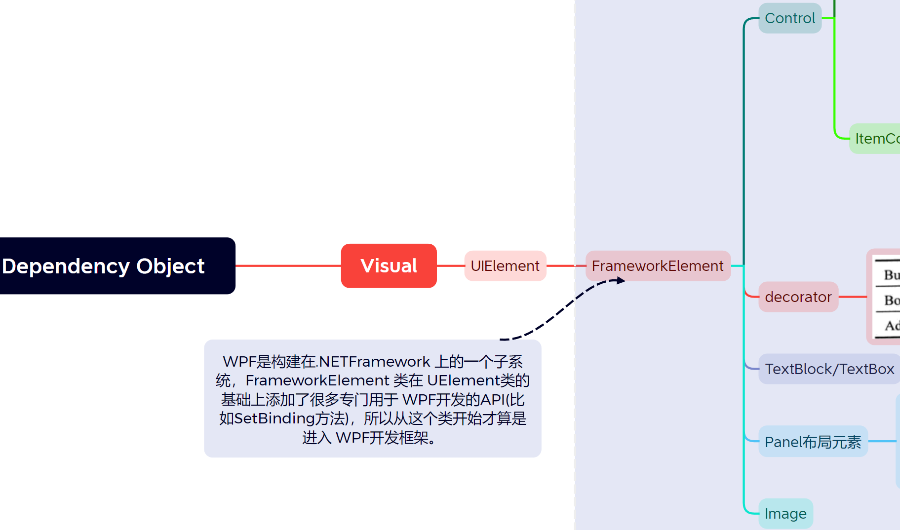
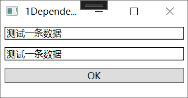

# 1、属性

通过前面的学习，我们已经知道 Data Binding是 WPF“数据驱动 U”理念的基础。上一章我们把精力放在了 Binding 的数据源这一端，研究了Binding的Source与Path，本章我们将把目光移向 Binding 的目标端，研究一下什么样的对象才能作为 Binding的 Target 以及 Binding 将把数据送往何处。

## 1.1、属性的来龙去脉

程序的本质就是“数据+算法”，或者说是用算法来处理数据以期得到输出结果。

在程序中，`数据表现为各种各样的变量，算法则表现为各种各样的函数`（操作符是函数的简记法）。即使是到了面向对象时代有了类等数据结构的出现，这一本质仍然没有改变——类的作用只是把散落在程序中的变量和函数进行归档封装并控制对它们的访问而已。

被封装在类里的变量称为字段（Field），它表示的是类或实例的状态；被封装在类里的函数称为方法（Method），它表示类或实例的功能（即能做什么）。字段和方法构成了最原始的面向对象封装，这时候的面向对象概念中还不包含事件、属性等概念。我们可以使用诸如 private、public 等修饰符来控制字段或方法的可访问性。为了让程序满足语义要求，C#语言规定：

1. 对类有意义的字段和方法使用 static 关键字修饰、称为静态成员，通过类名加访问操作符（即“”操作符）可以访问它们；
2. 对类的实例有意义的字段和方法不加 static 关键字，称为非静态成员或实例成员

从语义方面来看，静态成员与非静态成员有着很好的对称性，但从程序在内存中的结构来看这种对称就被打破了。`静态字段在内存中只有一个拷贝，非静态字段则是每个实例拥有一个拷贝`（无论方法是否为静态的，在内存中只会有一份拷贝），区别只是你能通过类名来访问存放指令的内存还是通过实例名来访问存放指令的内存。

------

现在看下字段是如何演变为属性的：

1. 字段被封装在实例里，要么能被外界访问（非private修饰）、要么不能（使用 private 修饰）这种直接把数据暴露给外界的作法很不安全，很容易就会把错误的值写入字段。

2. 在每次写入数据的时候都先判断一下值的有效性又会增加冗余的代码并且违反面向对象要求“高内聚”的原则，我们希望对象自己有能力判断将被写入的值是否正确。于是，程序员仍然把字段标记为private但使用一对非 private 的方法来包装它。在这对方法中，一个以 Set 为前缀且负责判断数据的有效性并写入数据，另一个以Get为前缀且负责把字段里的数据读取出来。**我们称这对 Get/Set 方法为 private 字段的安全包装。**

   ```C#
   class Human
   {
       private int age; // private修饰字段
       public void SetAge(int value)// public方法包装方法操作private字段
       {
           if (value >= 0 && value <= 100)
           {
               this.age = value;
           }
           else
           {
               throw new OverflowException("Age overflow.");
           }
       }
       public int GetAge()
       {
           return this.age;
       }
   }
   ```

3. 用的时候又要在自动提示里上下翻动。于是，当.NETFramework 推出时，微软更进一步把 Get/Set这对方法合并成了属性(Property)。使用属性时，格式上很像使用非private 字段，保证了语义上的顺畅，同时又不失 Get/set 方法的安全性，代码变得更加紧凑，自动提示菜单也短了许多，可谓一举多得。使用属性，Human类可以改写成如下样子，这种**.NET Framework中的属性又称为CLR属性**

   ```C#
   class Human2
   {
       private int age;
       public int Age
       {
           get { return this.age; }
           set
           {
               if (value >= 0 && value <= 100)
               {
                   this.age = value;
               }
               else
               {
                   throw new OverflowException("Age overflow.");
               }
           }
       }
   }
   ```

上文中提到`静态字段在内存中只有一个拷贝，非静态字段则是每个实例拥有一个拷贝`，实例的每个private 字段都会占用一定的内存，现在字段被属性包装了起来，每个实例看上去都带有相同的属性，那么是不是每个实例的CLR属性也会多占一点内存呢？原来C#代码中的属性的编译结果是两个方法！前面已经说过，再多实例方法也只有个拷贝，所以，`CLR属性并不会增加内存的负担。同时也说明，属性仅仅是个语法糖衣(SyntaxSugar)`。

## 1.2、依赖属性

在 WPF 中，微软将属性这个概念又向前推进了一步，推出了“依赖属性”这个新概念。简言之，依赖属性就是一种可以自己没有值，并能通过使用 Binding 从数据源获得值(依赖在别人身上)的属性。拥有依赖属性的对象被称为“依赖对象”。与传统的CLR属性和面向对象思想相比依赖属性有很多新颖之处，其中包括:

1. 节省实例对内存的开销。
2. 属性值可以通过 Binding 依赖在其他对象上。

### 1.1.1 依赖属性对内存的使用方式

依赖属性较之 CLR属性在内存使用方面迴然不同。前面已经说过，实例的每个CLR属性都包装着一个非静态的字段(或者说由一个非静态的字段在后台支持)，思考这样一个问题：TextBox有138个属性，假设每个CLR属性都包装着一个4字节的字段，如果程序运行的时候创建了10列1000行的一个TextBox列表，那么这些字段将占用4*138*10*1000~5.26M内存！在这一百多个属性中，最常用的也就是 Text属性，这就意味着大多数内存都会被浪费掉。

传统的.NET开发中，一个对象所占用的内存空间在调用 new 操作符进行实例化的时候就已经决定了，而 `WPF 允许对象在被创建的时候并不包含用于存储数据的空间(即字段所占用的空间)、只保留在需要用到数据时能够获得默认值、借用其他对象数据或实时分配空间的能力`

这种对象就称为依赖对象（`DependencyObiect`）而它这种实时获取数据的能力则依靠依赖属性（`DependencyProperty`）来实现。WPF开发中，必须使用依赖对象作为依赖属性的宿主，使二者结合起来，才能形成完整的Binding目标被数据所驱动。

在WPF系统中，依赖对象的概念被DependencyObiect类所实现，依赖属性的概念则由DependencyProperty 类所实现。DependencyObject具有GetValue 和 SetValue 两个方法如下。

```C#
public class DependencyObject : DispatcherObject{
    public object GetValue(DependencyProperty dp){
        // .. 
    }
    public void SetValue(DependencyProperty dp,object value){
        // .. 
    }
}
```

这两个方法都以 DependencyProperty 对象为参数，GetValue 方法通过 DependencyProperty 对象获取数据;SetValue 通过 DependencyProperty 对象存储值——正是这两个方法把 DependencyObject
和 DependencyProperty 紧密结合在一起。

DependencyObject是 WPF 系统中相当底层的一个基类，如下：



从这棵继承树上可以看出，WPF的所有UI 控件都是依赖对象。WPF的类库在设计时充分利用了依赖属性的优势，UI 控件的绝大多数属性都已经依赖化了。

### 1.1.2 声明和使用依赖属性

1）体现依赖属性作为属性的功能：

新建一个类Student，在其中声明一个依赖属性StudnetNameProperty，其包装器为"StudnetName"（用于暴露属性给外部），包装器的类型为String，依赖属性的宿主为Student

```C#
namespace PropertyLearning.Entity
{
    public class Student : DependencyObject
    {
        /// <summary>
        /// 声明一个依赖属性StudnetNameProperty
        /// </summary>
        public static readonly DependencyProperty StudnetNameProperty =
            DependencyProperty.Register("StudnetName", typeof(string), typeof(Student));
    }
}
```

xmal中写两个textbox，实现效果：textbox1的值在点击OK后会显示在textbox2中

```html
<Window x:Class="PropertyLearning._1DependencyProperty"
        xmlns="http://schemas.microsoft.com/winfx/2006/xaml/presentation"
        xmlns:x="http://schemas.microsoft.com/winfx/2006/xaml"
        xmlns:d="http://schemas.microsoft.com/expression/blend/2008"
        xmlns:mc="http://schemas.openxmlformats.org/markup-compatibility/2006"
        xmlns:local="clr-namespace:PropertyLearning"
        mc:Ignorable="d"
        Title="_1DependencyProperty" Height="135" Width="260">
    <StackPanel>
        <TextBox x:Name="textbox1" BorderBrush="Black" Margin="5"/>
        <TextBox x:Name="textbox2" BorderBrush="Black" Margin="5"/>
        <Button Content="OK" Margin="5" Click="Button_Click"/>
    </StackPanel>
</Window>
```

再点击事件中给StudnetNameProperty依赖属性赋值为this.textbox1.Text，同时将依赖属性的值再赋值给textbox2.Text

```C#
namespace PropertyLearning
{
    /// <summary>
    /// _1_DependencyProperty.xaml 的交互逻辑
    /// </summary>
    public partial class _1DependencyProperty : Window
    {
        public _1DependencyProperty()
        {
            InitializeComponent();
        }

        private void Button_Click(object sender, RoutedEventArgs e)
        {
            Student stu = new Student();
            stu.SetValue(Student.StudnetNameProperty, this.textbox1.Text);
            textbox2.Text = (string) stu.GetValue(Student.StudnetNameProperty);
        }
    }
}
```

效果：



2）体现依赖属性的“依赖性”：

一般情况下，数据的来源是业务逻辑层的对象而目标是 UI 层的控件，在下面这个例子中，我们暂且倒过来，让textBox1作为数据来源,把 Student实例作为数据的目标让 Student 实例依赖在textBox1上。注意：这里仅仅是为了展示依赖属性的“依赖”功能，现实工作中几乎从来不这么做。

xmal代码不变的情况下修改C#代码如下：

```C#
namespace PropertyLearning
{
    /// <summary>
    /// _1_DependencyProperty.xaml 的交互逻辑
    /// </summary>
    public partial class _1DependencyProperty : Window
    {
        Student stu;
        public _1DependencyProperty()
        {
            InitializeComponent();
            stu = new Student();
            //创建一个源为textbox1的 Text 属性的binding
            Binding binding = new Binding("Text") { Source = textbox1};
            //将 textbox1的Text值绑定到textbox2的Text属性上
            //textbox2.SetBinding(TextBox.TextProperty, binding);
            //设置绑定的目标为stu实例 的 StudnetNameProperty
            BindingOperations.SetBinding(stu,Student.StudnetNameProperty,binding);
        }
        // 点击按钮后获取stu实例的值，并在messagebox 中显示
        private void Button_Click(object sender, RoutedEventArgs e)
        {
            MessageBox.Show(stu.GetValue(Student.StudnetNameProperty).ToString());
        }
    }
}
```

效果：


说实话，这个有点“学院派”的例子并不怎么实用，但通过它我们要认清一个事实，那就是依赖属性即使没有CLR属性作为其外包装也可以很好地工作。

已知继承关系如下：DependencyObject——》Viusal——》UIElement——》FrameworkElement——》具体布局控件

Student 继承自 DependencyObject，DependencyObject的实例对象中没有SetBinding方法，要到FrameworkElement这层的实例对象才能使用SetBinding方法。这时可以使用静态类BindingOperations.SetBinding方法，此方法可以对DependencyObject对象设置数据绑定。

这侧面传递了一个思想，微软希望SetBinding的的目标对象是UI元素。

FrameworkElement这层的SetBinding实际上是对BindingOperation类的的SetBinding做了封装。

现在我们使用的依赖属性依靠 `SetValue 和 GetValue 两个方法进行对外界的暴露`，而且在使用 GetValue 的时候还需要进行一次数据类型的转换，因此，大多数情况下我们会为依赖属性添加一个CRL属性外包装（将DependencyObject的GetValue、SetValue方法封装在属性值的get、set方法中）

```C#
namespace PropertyLearning.Entity
{
    public class Student : DependencyObject
    {
        public string StudentName //CLR属性包装器
        {
            get
            {
                return (string)GetValue(StudnetNameProperty);
            }
            set 
            { 
                SetValue(StudnetNameProperty, value);
            }
        }
        /// <summary>
        /// 声明一个依赖属性StudnetNameProperty
        /// </summary>
        public static readonly DependencyProperty StudnetNameProperty =
            DependencyProperty.Register("StudnetName", typeof(string), typeof(Student));
    }
}
```

这样取值、赋值的时候代码就可以简化为如下形式，CLR依赖属性的使用就和一般的属性一样了

```C#
stu.SetValue(Student.StudnetNameProperty, this.textbox1.Text);
textbox2.Text = (string)stu.GetValue(Student.StudnetNameProperty);
//变为
stu.StudentName = this.textbox1.Text;
textbox2.Text = stu.StudentName;
```

我们知道，依赖对象可以通过 Binding依赖在其他对象上，即`依赖对象是作为数据的目标`而存在的。现在，我们为依赖对象的依赖属性添加了CLR属性包装，有了这个包装，就相当于为依赖对象准备了用于暴露数据的 BindingPath，也就是说，现在的依赖对象已经具备了扮演数据源和数据目标双重角色的能力。值得注意的是，`尽管Student类没有实现INotifyPropertyChanged 接口，当属性的值发生改变时与之关联的 Binding对象依然可以得到通知，依赖属性默认带有这样的功能`，天生就是合格的数据源。


```C#
namespace PropertyLearning.Entity
{
    public class Student : DependencyObject
    {
        /// <summary>
        /// CLR依赖属性包装器，融合DependencyObject的GetValue、SetValue方法
        /// </summary>
        public string StudentName
        {
            get
            {
                return (string)GetValue(StudentNameProperty);
            }
            set 
            { 
                SetValue(StudentNameProperty, value);
            }
        }
        /// <summary>
        /// 声明一个依赖属性StudentNameProperty
        /// </summary>
        public static readonly DependencyProperty StudentNameProperty =
            DependencyProperty.Register("StudentName", typeof(string), typeof(Student));
        /// <summary>
        /// 抄一下FameworkElement类的SetBinding方法构造，用BindingOperations.SetBinding实现
        /// </summary>
        /// <param name="dp"></param>
        /// <param name="binding"></param>
        /// <returns></returns>
        public BindingExpressionBase SetBinding(DependencyProperty dp, BindingBase binding)
        {
            return BindingOperations.SetBinding(this, dp, binding);
        }
    }
}
```

修改 .cs 文件的绑定关系（依赖属性StudentName既做Target又做Source），使得在textbox1中的数据能够同时在textbox2中显示：

```C#
namespace PropertyLearning
{
    /// <summary>
    /// _1_DependencyProperty.xaml 的交互逻辑
    /// </summary>
    public partial class _1DependencyProperty : Window
    {
        Student stu;
        public _1DependencyProperty()
        {
            InitializeComponent();
            stu = new Student();
            //stu的依赖属性StudentName的值为Target，textbox1的Text属性为Source
            stu.SetBinding(Student.StudentNameProperty, new Binding("Text") { Source = textbox1 });
            //textbox2的Text值为Target，stu的依赖属性StudentName属性为Source
            textbox2.SetBinding(TextBox.TextProperty, new Binding("StudentName") { Source = stu });
        }
        // 点击按钮后获取stu实例的值，并在messagebox 中显示
        private void Button_Click(object sender, RoutedEventArgs e)
        {
            //MessageBox.Show(stu.GetValue(Student.StudnetNameProperty).ToString());
        }
    }
}

```


### 1.1.3 属性依赖值存取的秘密

## 1.3、附加属性


NuGet\Install-Package Prism.Wpf -Version 8.1.97


这段代码中的TextBox为什么获取不到StackPanel.DataContext中的String

# 2、事件

## 2.1、WPF的树形结构


## 2.2、事件的来龙去脉


## 2.3、路由事件

### 2.3.1、使用WPF内置路由事件

### 2.3.1、自定义路由事件

### 2.3.1、RoutedEventArgs的Source与OriginalSource

### 2.3.1、附加事件