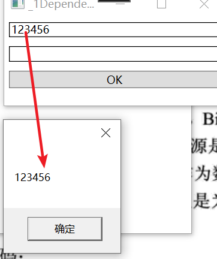
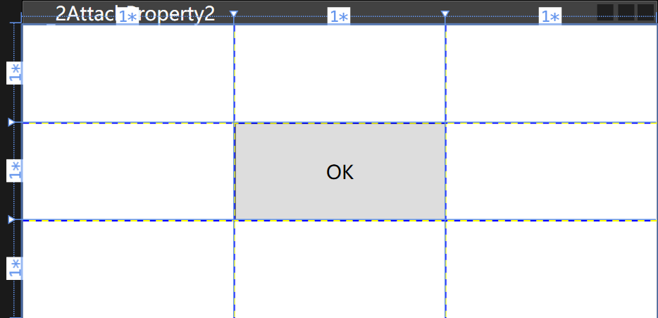

# 1、属性

通过前面的学习，我们已经知道 Data Binding是 WPF“数据驱动 U”理念的基础。上一章我们把精力放在了 Binding 的数据源这一端，研究了Binding的Source与Path，本章我们将把目光移向 Binding 的目标端，研究一下什么样的对象才能作为 Binding的 Target 以及 Binding 将把数据送往何处。

## 1.1、属性的来龙去脉

程序的本质就是“数据+算法”，或者说是用算法来处理数据以期得到输出结果。

在程序中，`数据表现为各种各样的变量，算法则表现为各种各样的函数`（操作符是函数的简记法）。即使是到了面向对象时代有了类等数据结构的出现，这一本质仍然没有改变——类的作用只是把散落在程序中的变量和函数进行归档封装并控制对它们的访问而已。

被封装在类里的变量称为字段（Field），它表示的是类或实例的状态；被封装在类里的函数称为方法（Method），它表示类或实例的功能（即能做什么）。字段和方法构成了最原始的面向对象封装，这时候的面向对象概念中还不包含事件、属性等概念。我们可以使用诸如 private、public 等修饰符来控制字段或方法的可访问性。为了让程序满足语义要求，C#语言规定：

1. 对类有意义的字段和方法使用 static 关键字修饰、称为静态成员，通过类名加访问操作符（即“”操作符）可以访问它们；
2. 对类的实例有意义的字段和方法不加 static 关键字，称为非静态成员或实例成员

从语义方面来看，静态成员与非静态成员有着很好的对称性，但从程序在内存中的结构来看这种对称就被打破了。`静态字段在内存中只有一个拷贝，非静态字段则是每个实例拥有一个拷贝`（无论方法是否为静态的，在内存中只会有一份拷贝），区别只是你能通过类名来访问存放指令的内存还是通过实例名来访问存放指令的内存。

------

现在看下字段是如何演变为属性的：

1. 字段被封装在实例里，要么能被外界访问（非private修饰）、要么不能（使用 private 修饰）这种直接把数据暴露给外界的作法很不安全，很容易就会把错误的值写入字段。

2. 在每次写入数据的时候都先判断一下值的有效性又会增加冗余的代码并且违反面向对象要求“高内聚”的原则，我们希望对象自己有能力判断将被写入的值是否正确。于是，程序员仍然把字段标记为private但使用一对非 private 的方法来包装它。在这对方法中，一个以 Set 为前缀且负责判断数据的有效性并写入数据，另一个以Get为前缀且负责把字段里的数据读取出来。**我们称这对 Get/Set 方法为 private 字段的安全包装。**

   ```C#
   class Human
   {
       private int age; // private修饰字段
       public void SetAge(int value)// public方法包装方法操作private字段
       {
           if (value >= 0 && value <= 100)
           {
               this.age = value;
           }
           else
           {
               throw new OverflowException("Age overflow.");
           }
       }
       public int GetAge()
       {
           return this.age;
       }
   }
   ```

3. 用的时候又要在自动提示里上下翻动。于是，当.NETFramework 推出时，微软更进一步把 Get/Set这对方法合并成了属性(Property)。使用属性时，格式上很像使用非private 字段，保证了语义上的顺畅，同时又不失 Get/set 方法的安全性，代码变得更加紧凑，自动提示菜单也短了许多，可谓一举多得。使用属性，Human类可以改写成如下样子，这种**.NET Framework中的属性又称为CLR属性**

   ```C#
   class Human2
   {
       private int age;
       public int Age
       {
           get { return this.age; }
           set
           {
               if (value >= 0 && value <= 100)
               {
                   this.age = value;
               }
               else
               {
                   throw new OverflowException("Age overflow.");
               }
           }
       }
   }
   ```

上文中提到`静态字段在内存中只有一个拷贝，非静态字段则是每个实例拥有一个拷贝`，实例的每个private 字段都会占用一定的内存，现在字段被属性包装了起来，每个实例看上去都带有相同的属性，那么是不是每个实例的CLR属性也会多占一点内存呢？原来C#代码中的属性的编译结果是两个方法！前面已经说过，再多实例方法也只有个拷贝，所以，`CLR属性并不会增加内存的负担。同时也说明，属性仅仅是个语法糖衣(SyntaxSugar)`。

## 1.2、依赖属性

在 WPF 中，微软将属性这个概念又向前推进了一步，推出了“依赖属性”这个新概念。简言之，依赖属性就是一种可以自己没有值，并能通过使用 Binding 从数据源获得值(依赖在别人身上)的属性。拥有依赖属性的对象被称为“依赖对象”。与传统的CLR属性和面向对象思想相比依赖属性有很多新颖之处，其中包括:

1. 节省实例对内存的开销。
2. 属性值可以通过 Binding 依赖在其他对象上。

### 1.2.1 依赖属性对内存的使用方式

依赖属性较之 CLR属性在内存使用方面迴然不同。前面已经说过，实例的每个CLR属性都包装着一个非静态的字段(或者说由一个非静态的字段在后台支持)，思考这样一个问题：TextBox有138个属性，假设每个CLR属性都包装着一个4字节的字段，如果程序运行的时候创建了10列1000行的一个TextBox列表，那么这些字段将占用4*138*10*1000~5.26M内存！在这一百多个属性中，最常用的也就是 Text属性，这就意味着大多数内存都会被浪费掉。

传统的.NET开发中，一个对象所占用的内存空间在调用 new 操作符进行实例化的时候就已经决定了，而 `WPF 允许对象在被创建的时候并不包含用于存储数据的空间(即字段所占用的空间)、只保留在需要用到数据时能够获得默认值、借用其他对象数据或实时分配空间的能力`

这种对象就称为依赖对象（`DependencyObiect`）而它这种实时获取数据的能力则依靠依赖属性（`DependencyProperty`）来实现。WPF开发中，必须使用依赖对象作为依赖属性的宿主，使二者结合起来，才能形成完整的Binding目标被数据所驱动。

在WPF系统中，依赖对象的概念被DependencyObiect类所实现，依赖属性的概念则由DependencyProperty 类所实现。DependencyObject具有GetValue 和 SetValue 两个方法如下。

```C#
public class DependencyObject : DispatcherObject{
    public object GetValue(DependencyProperty dp){
        // .. 
    }
    public void SetValue(DependencyProperty dp,object value){
        // .. 
    }
}
```

这两个方法都以 DependencyProperty 对象为参数，GetValue 方法通过 DependencyProperty 对象获取数据;SetValue 通过 DependencyProperty 对象存储值——正是这两个方法把 DependencyObject
和 DependencyProperty 紧密结合在一起。

DependencyObject是 WPF 系统中相当底层的一个基类，如下：


从这棵继承树上可以看出，WPF的所有UI 控件都是依赖对象。WPF的类库在设计时充分利用了依赖属性的优势，UI 控件的绝大多数属性都已经依赖化了。

### 1.2.2 声明和使用依赖属性

1）体现依赖属性作为属性的功能：

新建一个类Student，在其中声明一个依赖属性StudnetNameProperty，其包装器为"StudnetName"（用于暴露属性给外部），包装器的类型为String，依赖属性的宿主为Student

```C#
namespace PropertyLearning.Entity
{
    public class Student : DependencyObject
    {
        /// <summary>
        /// 声明一个依赖属性StudnetNameProperty
        /// </summary>
        public static readonly DependencyProperty StudentNameProperty =
            DependencyProperty.Register("StudentName", typeof(string), typeof(Student));
    }
}
```

xmal中写两个textbox，实现效果：textbox1的值在点击OK后会显示在textbox2中

```html
<Window x:Class="PropertyLearning._1DependencyProperty"
        xmlns="http://schemas.microsoft.com/winfx/2006/xaml/presentation"
        xmlns:x="http://schemas.microsoft.com/winfx/2006/xaml"
        xmlns:d="http://schemas.microsoft.com/expression/blend/2008"
        xmlns:mc="http://schemas.openxmlformats.org/markup-compatibility/2006"
        xmlns:local="clr-namespace:PropertyLearning"
        mc:Ignorable="d"
        Title="_1DependencyProperty" Height="135" Width="260">
    <StackPanel>
        <TextBox x:Name="textbox1" BorderBrush="Black" Margin="5"/>
        <TextBox x:Name="textbox2" BorderBrush="Black" Margin="5"/>
        <Button Content="OK" Margin="5" Click="Button_Click"/>
    </StackPanel>
</Window>
```

再点击事件中给StudnetNameProperty依赖属性赋值为this.textbox1.Text，同时将依赖属性的值再赋值给textbox2.Text

```C#
namespace PropertyLearning
{
    /// <summary>
    /// _1_DependencyProperty.xaml 的交互逻辑
    /// </summary>
    public partial class _1DependencyProperty : Window
    {
        public _1DependencyProperty()
        {
            InitializeComponent();
        }

        private void Button_Click(object sender, RoutedEventArgs e)
        {
            Student stu = new Student();
            stu.SetValue(Student.StudentNameProperty, this.textbox1.Text);
            textbox2.Text = (string) stu.GetValue(Student.StudentNameProperty);
        }
    }
}
```

效果：


2）体现依赖属性的“依赖性”：

一般情况下，数据的来源是业务逻辑层的对象而目标是 UI 层的控件，在下面这个例子中，我们暂且倒过来，让textBox1作为数据来源,把 Student实例作为数据的目标让 Student 实例依赖在textBox1上。注意：这里仅仅是为了展示依赖属性的“依赖”功能，现实工作中几乎从来不这么做。

xmal代码不变的情况下修改C#代码如下：

```C#
namespace PropertyLearning
{
    /// <summary>
    /// _1_DependencyProperty.xaml 的交互逻辑
    /// </summary>
    public partial class _1DependencyProperty : Window
    {
        Student stu;
        public _1DependencyProperty()
        {
            InitializeComponent();
            stu = new Student();
            //创建一个源为textbox1的 Text 属性的binding
            Binding binding = new Binding("Text") { Source = textbox1};
            //将 textbox1的Text值绑定到textbox2的Text属性上
            //textbox2.SetBinding(TextBox.TextProperty, binding);
            //设置绑定的目标为stu实例 的 StudnetNameProperty
            BindingOperations.SetBinding(stu,Student.StudentNameProperty,binding);
        }
        // 点击按钮后获取stu实例的值，并在messagebox 中显示
        private void Button_Click(object sender, RoutedEventArgs e)
        {
            MessageBox.Show(stu.GetValue(Student.StudentNameProperty).ToString());
        }
    }
}
```

效果：



说实话，这个有点“学院派”的例子并不怎么实用，但通过它我们要认清一个事实，那就是依赖属性即使没有CLR属性作为其外包装也可以很好地工作。

已知继承关系如下：DependencyObject——》Viusal——》UIElement——》FrameworkElement——》具体布局控件

Student 继承自 DependencyObject，DependencyObject的实例对象中没有SetBinding方法，要到FrameworkElement这层的实例对象才能使用SetBinding方法。这时Student可以使用静态类BindingOperations.SetBinding方法，此方法可以对DependencyObject对象设置数据绑定。

这侧面传递了一个思想，微软希望SetBinding的的目标对象是UI元素。

FrameworkElement这层的SetBinding实际上是对BindingOperation类的静态方法SetBinding做了封装。

现在我们使用的依赖属性依靠 `SetValue 和 GetValue 两个方法进行对外界的暴露`，而且在使用 GetValue 的时候还需要进行一次数据类型的转换（比较麻烦），因此，大多数情况下我们会为依赖属性添加一个CRL属性外包装（将DependencyObject的GetValue、SetValue方法封装在属性值的get、set方法中）

```C#
namespace PropertyLearning.Entity
{
    public class Student : DependencyObject
    {
        public string StudentName //CLR属性包装器
        {
            get
            {
                return (string)GetValue(StudentNameProperty);
            }
            set 
            { 
                SetValue(StudentNameProperty, value);
            }
        }
        /// <summary>
        /// 声明一个依赖属性StudnetNameProperty
        /// </summary>
        public static readonly DependencyProperty StudentNameProperty =
            DependencyProperty.Register("StudentName", typeof(string), typeof(Student));
    }
}
```

这样取值、赋值的时候代码就可以简化为如下形式，CLR依赖属性的使用就和一般的属性一样了

```C#
stu.SetValue(Student.StudentNameProperty, this.textbox1.Text);
textbox2.Text = (string)stu.GetValue(Student.StudentNameProperty);
//变为
stu.StudentName = this.textbox1.Text;
textbox2.Text = stu.StudentName;
```

我们知道，依赖对象可以通过 Binding依赖在其他对象上，即`依赖对象是作为数据的目标`而存在的。现在，我们为依赖对象的依赖属性添加了CLR属性包装，有了这个包装，就相当于为依赖对象准备了用于暴露数据的 BindingPath，也就是说，现在的依赖对象已经具备了扮演数据源和数据目标双重角色的能力。值得注意的是，`尽管Student类没有实现INotifyPropertyChanged 接口，当属性的值发生改变时与之关联的 Binding对象依然可以得到通知，依赖属性默认带有这样的功能`，天生就是合格的数据源。

下面的例子就实现了依赖属性StudentName既做Target又做Source的效果，将textbox1的值绑定到依赖属性StudentName中，依赖属性StudentName又作为源绑定到textbox2的Target上

```C#
namespace PropertyLearning.Entity
{
    public class Student : DependencyObject
    {
        /// <summary>
        /// CLR依赖属性包装器，融合DependencyObject的GetValue、SetValue方法
        /// </summary>
        public string StudentName
        {
            get
            {
                return (string)GetValue(StudentNameProperty);
            }
            set 
            { 
                SetValue(StudentNameProperty, value);
            }
        }
        /// <summary>
        /// 声明一个依赖属性StudentNameProperty
        /// </summary>
        public static readonly DependencyProperty StudentNameProperty =
            DependencyProperty.Register("StudentName", typeof(string), typeof(Student));
        /// <summary>
        /// 抄一下FameworkElement类的SetBinding方法构造，用BindingOperations.SetBinding实现
        /// </summary>
        /// <param name="dp"></param>
        /// <param name="binding"></param>
        /// <returns></returns>
        public BindingExpressionBase SetBinding(DependencyProperty dp, BindingBase binding)
        {
            return BindingOperations.SetBinding(this, dp, binding);
        }
    }
}
```

修改 .cs 文件的绑定关系（依赖属性StudentName既做Target又做Source），使得在textbox1中的数据能够同时在textbox2中显示：

```C#
namespace PropertyLearning
{
    /// <summary>
    /// _1_DependencyProperty.xaml 的交互逻辑
    /// </summary>
    public partial class _1DependencyProperty : Window
    {
        Student stu;
        public _1DependencyProperty()
        {
            InitializeComponent();
            stu = new Student();
            //stu的依赖属性StudentName的值为Target，textbox1的Text属性为Source
            stu.SetBinding(Student.StudentNameProperty, new Binding("Text") { Source = textbox1 });
            //textbox2的Text值为Target，stu的依赖属性StudentName属性为Source
            textbox2.SetBinding(TextBox.TextProperty, new Binding("StudentName") { Source = stu });
        }
        // 点击按钮后获取stu实例的值，并在messagebox 中显示
        private void Button_Click(object sender, RoutedEventArgs e)
        {
            //MessageBox.Show(stu.GetValue(Student.StudnetNameProperty).ToString());
        }
    }
}

```


这里有个小技巧：

当输入`propdp（全称 Property Dependency）`后 两下Tab就会提示出生成的依赖属性的声明如下：

```c#
public int MyProperty
{
    get { return (int)GetValue(MyPropertyProperty); }
    set { SetValue(MyPropertyProperty, value); }
}

// Using a DependencyProperty as the backing store for MyProperty.  This enables animation, styling, binding, etc...
public static readonly DependencyProperty MyPropertyProperty =
    DependencyProperty.Register("MyProperty", typeof(int), typeof(ownerclass), new PropertyMetadata(0));
```

由snippet 自动生成的代码中，DependencyProperty.Register 使用的是带4个参数的重载，前3个参数与我们前面介绍的一致，第4个参数的类型是PropertyMetadata类。第4个参数的作用是给依赖属性的 DefaultMetadata 属性赋值。顾名思义，DefaultMetadata的作用是向依赖属性的调用者提供一些基本信息，这些信息包括:

- CoerceValueCallback：依赖属性值被强制改变时此委托会被调用，此委托可关联一个影响函数。
- DefaultValue：依赖属性未被显式赋值时，若读取之则获得此默认值，不设此值会抛出异常
- IsSealed：控制 PropertyMetadata的属性值是否可以更改，默认值为true。
- PropertyChangedCallback:依赖属性的值被改变之后此委托会被调用，此委托可关联一个影响函数。

需要注意的是，依赖属性的 DefaultMetadaa 只能通过 Register 方法的第 4个参数进行赋值，而且一旦赋值就不能改变(DefaultMetadata 是个只读属性)。如果想用新的 PropcrtyMctadata 替换这个默认的 Metadata，需要使用DependencyProperty.OverrideMetadata方法.

### 1.2.3 属性依赖值存取的秘密

#### 1) DependencyProperty.Register 源码分析

DependencyProperty的源码：https://referencesource.microsoft.com/#WindowsBase/Base/System/Windows/DependencyProperty.cs,4a20845df0b86ddd

DependencyProperty类的源码如下：

```C#
private static Hashtable PropertyFromName = new Hashtable();
/// <summary>
///     Register a Dependency Property
/// </summary>
/// <param name="name">Name of property</param>
/// <param name="propertyType">Type of the property</param>
/// <param name="ownerType">Type that is registering the property</param>
/// <returns>Dependency Property</returns>
public static DependencyProperty Register(string name, Type propertyType, Type ownerType)
{
    // Forwarding
    return Register(name, propertyType, ownerType, null, null);
}
```

`Register(name, propertyType, ownerType, null, null); ` 调用了下面的方法

```C#
/// <summary>
///     Register a Dependency Property
/// </summary>
/// <param name="name">Name of property</param>
/// <param name="propertyType">Type of the property</param>
/// <param name="ownerType">Type that is registering the property</param>
/// <param name="typeMetadata">Metadata to use if current type doesn't specify type-specific metadata</param>
/// <param name="validateValueCallback">Provides additional value validation outside automatic type validation</param>
/// <returns>Dependency Property</returns>
public static DependencyProperty Register(string name, Type propertyType, Type ownerType, PropertyMetadata typeMetadata, ValidateValueCallback validateValueCallback)
{
    //检验参数是否为空
    RegisterParameterValidation(name, propertyType, ownerType);

    // Register an attached property
    PropertyMetadata defaultMetadata = null;
    if (typeMetadata != null && typeMetadata.DefaultValueWasSet())
    {
        defaultMetadata = new PropertyMetadata(typeMetadata.DefaultValue);
    }

    DependencyProperty property = RegisterCommon(name, propertyType, ownerType, defaultMetadata, validateValueCallback);

    if (typeMetadata != null)
    {
        // Apply type-specific metadata to owner type only
        property.OverrideMetadata(ownerType, typeMetadata);
    }

    return property;
}
```

`DependencyProperty property = RegisterCommon(name, propertyType, ownerType, defaultMetadata, validateValueCallback);` 这句又调用了下面的方法

```C#
private static DependencyProperty RegisterCommon(string name, Type propertyType, Type ownerType, PropertyMetadata defaultMetadata, ValidateValueCallback validateValueCallback)
{
    FromNameKey key = new FromNameKey(name, ownerType);
    lock (Synchronized)
    {
        if (PropertyFromName.Contains(key))
        {
            throw new ArgumentException(SR.Get(SRID.PropertyAlreadyRegistered, name, ownerType.Name));
        }
    }

    // Establish default metadata for all types, if none is provided
    if (defaultMetadata == null)
    {
        defaultMetadata = AutoGeneratePropertyMetadata( propertyType, validateValueCallback, name, ownerType );
    }
    else // Metadata object is provided.
    {
        // If the defaultValue wasn't specified auto generate one
        if (!defaultMetadata.DefaultValueWasSet())
        {
            defaultMetadata.DefaultValue = AutoGenerateDefaultValue(propertyType);
        }

        ValidateMetadataDefaultValue( defaultMetadata, propertyType, name, validateValueCallback );
    }

    // Create property
    DependencyProperty dp = new DependencyProperty(name, propertyType, ownerType, defaultMetadata, validateValueCallback);

    // Seal (null means being used for default metadata, calls OnApply)
    defaultMetadata.Seal(dp, null);

    if (defaultMetadata.IsInherited)
    {
        dp._packedData |= Flags.IsPotentiallyInherited;
    }

    if (defaultMetadata.UsingDefaultValueFactory)
    {
        dp._packedData |= Flags.IsPotentiallyUsingDefaultValueFactory;
    }


    // Map owner type to this property
    // Build key
    lock (Synchronized)
    {
        PropertyFromName[key] = dp;
    }


    if( TraceDependencyProperty.IsEnabled )
    {
        TraceDependencyProperty.TraceActivityItem(
            TraceDependencyProperty.Register,
            dp,
            dp.OwnerType );
    }


    return dp;
}
```

RegisterCommon方法的第一句就是`FromNameKey key = new FromNameKey(name, ownerType);` FromNameKey 的构造方法如下：除了传入的参数name和ownerType外，还使用了name作为参数override了GetHashCode方法：

```C#

public FromNameKey(string name, Type ownerType)
{
    _name = name;
    _ownerType = ownerType;

    _hashCode = _name.GetHashCode() ^ _ownerType.GetHashCode();
}
```

也就是说register中的参数name、ownerType在`FromNameKey key = new FromNameKey(name, ownerType);` 后经历了hash code的异或运算，存入了key中

阅读下面 RegisterCommon 的关键语句，可以得出这么个过程：

1. 当尝试使用同一个CLR属性名字(name)和同一个宿主类型(ownerType)进行注册，`if (PropertyFromName.Contains(key))`就会检测到，同时抛出异常。
2. 检查是否提供了PropertyMetadate参数，没有则new一个
3. new 一个 DependencyProperty 对象 dp
4. ` PropertyFromName[key] = dp;` 注册到HashTable中（Hashtable会自动调用key的GetHashcode方法获取其hashcode）

```C#
//检查是否使用同一个CLR属性名字(name)和同一个宿主类型(ownerType)进行注册
if (PropertyFromName.Contains(key))
{
    throw new ArgumentException(SR.Get(SRID.PropertyAlreadyRegistered, name, ownerType.Name));
}
// 检查是否提供了PropertyMetadate，没有则new一个
//使用new来创建一个DependencyProperty
DependencyProperty dp = new DependencyProperty(name, propertyType, ownerType, defaultMetadata, validateValueCallback)
// Map owner type to this property
// Build key
lock (Synchronized)
{
    PropertyFromName[key] = dp;
}
```

读到这里，我们可以用一句话概括DependencyProperty对象的创建与注册，那就是：

创建一个DependencyProperty 实例并用它的CLR属性名和宿主类型名生成 hashcode，最后把 hash code 和DependencyProperty 实例作为Key-Value 对存入全局的、名为PropertyFromName 的 Hashtable中。这样，WFP属性系统通过CLR属性名和宿主类型名就可以从这个全局的 Hashtable 中检索出对应的DependencyProperty 实例。最后，生成的DependencyProperty实例被当作返回值交还。

有一点需要注意：把 DependencyPropery 实例注册进全局 Hashtable 时使用的 key由 CLR属性名哈希值和宿主类型哈希值经过运算得到，`但这并不是 DependencyPropery 实例的哈希值`，每个 DependencyPropery 实例都具有一个名为 Globalndex 的int 类型属性，Globallndex的值是经过一些算法处理得到的，确保了每个 Dependencypropery实例的 Globallndex 是唯一的。

```C#
public int GlobalIndex
{
    get { return (int) (_packedData & Flags.GlobalIndexMask); }
}
```

Dependencypropery的GetHashCode也被重写了，其值就是GlobalIndex，所以通过GlobalIndex这个值就可以直接检索到某个 DependencyProperty 实例。

```C#
public override int GetHashCode()
{
    return GlobalIndex;
}
```

#### 2) DependencyObject.GetValue源码分析

至此，一个 DependencyProperty 实例已经被创建并注册进一个全局的Hashtable 中，下面就要使用 DependencyObject的 SetValue和 GetValue借助这个DependencyProperty 实例保存和读取值了。

DependencyObject源码地址：https://referencesource.microsoft.com/#WindowsBase/Base/System/Windows/DependencyObject.cs,3ce192f6633decc8


```C#
/// <summary>
///     Retrieve the value of a property
/// </summary>
/// <param name="dp">Dependency property</param>
/// <returns>The computed value</returns>
public object GetValue(DependencyProperty dp)
{
    // Do not allow foreign threads access.
    // (This is a noop if this object is not assigned to a Dispatcher.)
    //
    this.VerifyAccess(); //验证参数的有效性

    if (dp == null)
    {
        throw new ArgumentNullException("dp");
    }

    // Call Forwarded
    return GetValueEntry( //这里才是核心代码
        LookupEntry(dp.GlobalIndex), //验证Globallndex的唯一性
        dp,
        null,
        RequestFlags.FullyResolved).Value;
}
```

核心代码的意思：GetValueEntry的第1个参数为 `LookupEntry(dp.GlobalIndex)`，第2个参数为`dp`，第3个参数为`null`，第4个参数为`RequestFlags.FullyResolved`，最后返回`GetValueEntry`方法返回值（EffectiveValueEntry  entry）的Value属性值

WPF 的依赖属性系统在存放值的时候会把每个有效值存放在一个“小房间”里，每个“小房间”都有自己的入口——检索算法只要找到这个入口、走进入口就能拿到依赖属性的值。这里说的“小房间”实际上就是EffectiveValueEntry类的实例。EfectiveValueEntry的所有构造器都包含一个DependencyProperty 类型的参数，换句话说，`每个EiectiveValueEntry都关联着一个DependencyProperty`。`EfectiveValueEntry类具有一个名为PropertyIndex的属性，这个属性的值实际上就是与之关联的DependencyProperty的Globallndex属性值`(这个值的由来我们在前面已经详细讨论过)。

在DependencyObiect类的源码中可以找到这样一个成员变量：

```C#
// The cache of effective values for this DependencyObject
// This is an array sorted by DP.GlobalIndex.  This ordering is
// maintained via an insertion sort algorithm.
private EffectiveValueEntry[] _effectiveValues;
```

这个数组依每个成员的 PropertyIndex属性值进行排序，对这个数组的操作（如插入、删除和排序等）由专门的算法来完成。正是这个数组向我们提示了依赖属性存储值的秘密——每个DependencyObject实例都自带一个 EfectiveValueEntry类型数组（你可以把它理解为一排可以随时扩建的“小房间”），当某个依赖属性的值要被读取时，算法就会从这个数组中去检索值，如果数组中没有包含这个值，算法会返回依赖属性的默认值（这个值由依赖属性的 DefaultMetadata 来提供）。

至此，我们明白了一件事情，那就是被 static 关键字所修饰的依赖属性对象其作用是用来检索真正的属性值而不是存储值（我理解的是，传入的是生成key的参数，用key在EfectiveValueEntry数组中查Value）；被用做检索键值的实际上是依赖属性的GlobalIndex属性（本质是其 hashcode，而 hash code 又由其 CLR包装器名和宿主类型名共同决定)，为了保证 GlobalIindex 属性值的稳定性，我们声明的时候又使用了readonly 关键字进行修饰。

实际工作中，依赖属性的值除了可能存储在 EfectiveValueEntry数组或由默认值提供外，还有很多途径可以获得，可能来自于元素的 Style 或 Theme，也可能由上层元素继承而来，还可能是在某个动画过程的控制下不断变化而来。我们怎么知道获取的值来自于哪里呢？原来，WPF 对依赖属性值的读取是有优先级控制的，由先到后依次是：

1. WPF属性系统强制值。
2. 由动画过程控制的值。
3. 本地变量值(存储在EectiveValueEntry数组中)。
4. 由上级元素的 Template 设置的值。
5. 由隐式样式(Implicit Style)设置的值。
6. 由样式之触发器(StyleTrigger)设置的值。
7. 由模板之触发器(Template Trigger)设置的值。
8. 由样式之设置器(StyleSetter)设置的值。
9. 由默认样式(Default Style)设置的值，默认模式其实就是由主题(Theme)指定的模式。
10. 由上级元素继承而来的值。
11. 默认值，来源于依赖属性的元数据(metadata)。

理解了 GetValue 方法，SetValue 方法也不再神秘。

#### 3) DependencyObject.SetValue源码分析

```C#
/// <summary>
///     Sets the local value of a property
/// </summary>
/// <param name="dp">Dependency property</param>
/// <param name="value">New local value</param>
public void SetValue(DependencyProperty dp, object value)
{
    // Do not allow foreign threads access.
    // (This is a noop if this object is not assigned to a Dispatcher.)
    //
    this.VerifyAccess();

    // Cache the metadata object this method needed to get anyway.
    PropertyMetadata metadata = SetupPropertyChange(dp);

    // Do standard property set
    SetValueCommon(dp, value, metadata, false /* coerceWithDeferredReference */, false /* coerceWithCurrentValue */, OperationType.Unknown, false /* isInternal */);
}
```

进入这个方法后，首先验证依赖属性的值是否可以被改变，如果不能则抛出异常，如果可以就进入后面的赋值流程。赋值流程也很简单，SetValueCommon内部主要有这样几个操作:

- 检查值是不是 DependencyProperty.UnsetValue，如果是，说明调用者的意图是清空现有的值。此时程序会调用ClearValueCommon方法来清空现有的值。
- 检查 EfectiveValueEntry 数组中是否已经存在相应依赖属性的位置,如果有则把旧值改写为新值，如果没有则新建 EfectiveValueEntry对象并存储新值。这样，只有被用到的值才会被放进这个列表，借此，WPF系统用算法(时间)换取了对内存(空间)的节省。
- 调用 UpdateEfectiveValue 对新值做一些相应处理。

DependencyObject和DependencyProperty两个类是 WPF属性系统的核心，本小节的设立是为了帮助大家理解它们之间的关系以及依赖属性值设置、读取的简要流程。通过这一小节的描述，希望大家能理解 WPF 系统的设计理念,即以public static 类型的变量作为标记并以这个标记为索引进行对象的存储、访问、修改、删除等操作。这样的理念在传统的.NET开发体系中(如 Windows Forms、ASPNET等)是不曾出现的，它是WPF体系的创新并且广泛应用(后面的路由事件、命令系统等都会用到这样的理念)。同时，我们也可以理解为什么WPF 在性能上还不尽如人意，微软也在不停地完善这个机制，使它的效率进一步提升。

## 1.3、附加属性

理解了依赖属性后，再来讨论一下附加属性。顾名思义，附加属性是说一个属性本来不属于某个对象,但由于某种需求而被后来附加上。也就是把对象放入一个特定环境后对象才具有的属性（·表现出来就是被环境赋予的属性）就称为附加属性(AtachedProperties)。

作为 TextBox 控件的设计者，他不可能知道控件发布后程序员是把它放在Grid里还是Canvas里(甚至是以后版本将推出的新布局里)，所以他也不可能为TextBox准备诸如Column、Row 或者 Left、Top这类属性，那么干脆让`布局来决定一个 TextBox用什么属性来设置它的位置`！

- 放在Grid 里就让 Grid 为它附加上 Column 和 Row 属性
- 放在 Canvas 里就让 Canvas 为它附加上 Top、Left 等属性
- 放在DockPanel里就让 DockPanel为它附加Dock属性。

可见，附加属性的作用就是将属性与数据类型(宿主)解耦，让数据类型的设计更加灵活。

理解了附加属性的含义，我们开始研究附加属性的声明、注册和使用。附加属性的本质就是依赖属性，二者仅在注册和包装器上有一点区别。前面说过，VisualStudio2008用于快速创建依赖属性的 snippet是propdp，现在我们要使用另一个snippet是propa，这个snippet用于快速创建附加属性。

### 1.3.1 附加属性的使用方式

以人在学校里会获得年级和班级两个属性为例，我们来体验自定义附加属性。人放在学校里会获得年级和班级两个属性说明年级和班级两个属性是由学校附加给人的，因此，这两个属性的真实所有者(宿主)应该是学校。我们准备一个名为`School`的类，一个名为`Teenager`的类，并让它们继承DependencyObject类，然后把光标定位于类体中(花括号之间)，输入propa连按两下 Tab键，一个附加属性的框架就准备好了。继续按动 Tab 键可以在几个空缺间轮换并修改，直至按下Enter键。

```C#
namespace PropertyLearning.Entity
{
    public class School : DependencyObject
    {
        public static int GetGrade(DependencyObject obj)
        {
            return (int)obj.GetValue(GradeProperty);
        }

        public static void SetGrade(DependencyObject obj, int value)
        {
            obj.SetValue(GradeProperty, value);
        }

        // Using a DependencyProperty as the backing store for MyGrade.  This enables animation, styling, binding, etc...
        public static readonly DependencyProperty GradeProperty =
            DependencyProperty.RegisterAttached("MyGrade", typeof(int), typeof(School), new PropertyMetadata(0));
    }
    public class Teenager : DependencyObject
    {
        
    }
}
```

唯一的不同就是注册附加属性使用的是名为RegisterAttached的方法，但参数却与使用Register 方法无异。xmal代码如下：

```html
<Window x:Class="PropertyLearning._2AttachProperty"
        xmlns="http://schemas.microsoft.com/winfx/2006/xaml/presentation"
        xmlns:x="http://schemas.microsoft.com/winfx/2006/xaml"
        xmlns:d="http://schemas.microsoft.com/expression/blend/2008"
        xmlns:mc="http://schemas.openxmlformats.org/markup-compatibility/2006"
        xmlns:local="clr-namespace:PropertyLearning"
        mc:Ignorable="d"
        Title="_2AttachProperty" Height="250" Width="300">
    <StackPanel>
        <Button x:Name="button1" Content="Grade" Click="button1_Click" Margin="5"/>
    </StackPanel>
</Window>
```

效果：


### 1.3.2 grid表格：xmal和C#代码实现相同的效果



```html
<Window x:Class="PropertyLearning._2AttachProperty2"
        xmlns="http://schemas.microsoft.com/winfx/2006/xaml/presentation"
        xmlns:x="http://schemas.microsoft.com/winfx/2006/xaml"
        xmlns:d="http://schemas.microsoft.com/expression/blend/2008"
        xmlns:mc="http://schemas.openxmlformats.org/markup-compatibility/2006"
        xmlns:local="clr-namespace:PropertyLearning"
        mc:Ignorable="d"
        Title="_2AttachProperty2" Height="200" Width="400">
    <Grid ShowGridLines="True">
        <Grid.RowDefinitions>
            <RowDefinition/>
            <RowDefinition/>
            <RowDefinition/>
        </Grid.RowDefinitions>
        <Grid.ColumnDefinitions>
            <ColumnDefinition/>
            <ColumnDefinition/>
            <ColumnDefinition/>
        </Grid.ColumnDefinitions>
        <Button Content="OK" Grid.Row="1" Grid.Column="1"/>
    </Grid>
</Window>
```

与之等效的C#代码如下：

xmal：

```html
<Window x:Class="PropertyLearning._3GridTable"
        xmlns="http://schemas.microsoft.com/winfx/2006/xaml/presentation"
        xmlns:x="http://schemas.microsoft.com/winfx/2006/xaml"
        xmlns:d="http://schemas.microsoft.com/expression/blend/2008"
        xmlns:mc="http://schemas.openxmlformats.org/markup-compatibility/2006"
        xmlns:local="clr-namespace:PropertyLearning"
        mc:Ignorable="d"
        Title="_3GridTable" Height="200" Width="400">
   
</Window>
```

+C#代码：

```C#
namespace PropertyLearning
{
    /// <summary>
    /// _2AttachProperty2.xaml 的交互逻辑
    /// </summary>
    public partial class _3GridTable : Window
    {
        public _3GridTable()
        {
            InitializeComponent();
            Grid grid = new Grid();
            //增加三行
            for (int i = 0; i < 3; i++)
            {
                grid.RowDefinitions.Add(new RowDefinition());
            }
            //增加三列
            for (int i = 0; i < 3; i++)
            {
                grid.ColumnDefinitions.Add(new ColumnDefinition());
            }
            //设置按钮在1行1列
            Button button = new Button() { Content = "OK" };
            Grid.SetRow(button, 1);
            Grid.SetColumn(button, 1);
            //将按钮放在grid的下一层
            grid.Children.Add(button);
            //最外层是grid
            this.Content = grid;
        }
    }
}
```

### 1.3.3 附件属性的Binding使用方式

现在我们已经知道如何在 XAML和 C#代码中直接为附加属性赋值，不过别忘了，附加属性的本质是依赖属性——附加属性也可以使用 Binding 依赖在其他对象的数据上。

请看下面这个例子：窗体使用Canvas布局，两个Slider 用来 控制矩形在 Canvas 中的横纵坐标

```html
<Window x:Class="PropertyLearning._4AttachPropertyBinding"
        xmlns="http://schemas.microsoft.com/winfx/2006/xaml/presentation"
        xmlns:x="http://schemas.microsoft.com/winfx/2006/xaml"
        xmlns:d="http://schemas.microsoft.com/expression/blend/2008"
        xmlns:mc="http://schemas.openxmlformats.org/markup-compatibility/2006"
        xmlns:local="clr-namespace:PropertyLearning"
        mc:Ignorable="d"
        Title="_4AttachPropertyBinding" Height="300" Width="300">
    <Canvas>
        <Slider x:Name="sliderX" Canvas.Top="10" Canvas.Left="10" Width="260" Minimum="10" Maximum="230"/>
        <Slider x:Name="sliderY" Canvas.Top="40" Canvas.Left="10" Width="260" Minimum="70" Maximum="200"/>
        <Rectangle x:Name="rec" Fill="LightSkyBlue" Width="30" Height="30"
                   Canvas.Left="{Binding  ElementName=sliderX,Path=Value}"
                   Canvas.Top="{Binding ElementName=sliderY,Path=Value}"/>
    </Canvas>
</Window>
```

与之等效的C#代码如下：

xmal：

```html
<Window x:Class="PropertyLearning._4AttachPropertyBinding"
        xmlns="http://schemas.microsoft.com/winfx/2006/xaml/presentation"
        xmlns:x="http://schemas.microsoft.com/winfx/2006/xaml"
        xmlns:d="http://schemas.microsoft.com/expression/blend/2008"
        xmlns:mc="http://schemas.openxmlformats.org/markup-compatibility/2006"
        xmlns:local="clr-namespace:PropertyLearning"
        mc:Ignorable="d"
        Title="_4AttachPropertyBinding" Height="300" Width="300">
    <Canvas>
        <Slider x:Name="sliderX" Canvas.Top="10" Canvas.Left="10" Width="260" Minimum="10" Maximum="230"/>
        <Slider x:Name="sliderY" Canvas.Top="40" Canvas.Left="10" Width="260" Minimum="70" Maximum="200"/>
        <Rectangle x:Name="rec" Fill="LightSkyBlue" Width="30" Height="30"/>
    </Canvas>
</Window>
```

+C#代码：

```c#
namespace PropertyLearning
{
    /// <summary>
    /// _4AttachPropertyBinding.xaml 的交互逻辑
    /// </summary>
    public partial class _4AttachPropertyBinding : Window
    {
        public _4AttachPropertyBinding()
        {
            InitializeComponent();
            this.rec.SetBinding(Canvas.LeftProperty, new Binding("Value") { Source = sliderX });
            this.rec.SetBinding(Canvas.LeftProperty, new Binding("Value") { Source = sliderX });
        }
    }
}
```

效果：


由此可见，在使用 Binding时除了宿主类型稍有不同外没有任何区别。

# 2、事件

就像属性系统在WPF中得到升级、进化为依赖属性一样，事件系统在WPF中也被升级进化成为路由事件(RoutedEvent)，并在其基础上衍生出命令传递机制。这些机制在很大程度上减少了对程序员的束缚，让程序的设计和实现更加灵活，模块之间的耦合度也进一步降低。本章就让我们一起来领略这些新消息机制的风采。

## 2.1、WPF的树形结构

WPF中有两种“树”：

1. 一种叫逻辑树（Logical Tree）它完全由布局组件和控件构成(包括列表类控件中的条目元素)，换句话说就是它的每个结点不是布局组件就是控件。
2. 一种叫可视元素树（VisualTree）每个WPF控件本身也是一棵由更细微级别的组件（它们不是控件，而是一些可视化组件，派生自 Visual类）组成的树。

如果想在 Logical Tree 上导航或查找元素，可以借助LogicalTreeHelper 类的 static 方法来实现:

- BringlntoView：把选定元素带进用户可视区域，经常用于可滚动的视图。
- FindLogicalNode：按给定名称(Name属性值)查找元素，包括子级树上的元素。
- GetChildren：获取所有直接子级元素。
- GetParent：获取直接父级元素。

现在我们已经知道，WPF的UI 可以表示为Logical Tree和 Visual Tree，那么当一个路由事件被激发后是沿着Logical Tree 传递还是沿着 VisualTree 传递呢？答案是 Visual Tree——只有这样，“藏”在 Template 里的控件才能把消息送出来。

## 2.2、事件的来龙去脉

- 事件的拥有者：即消息的发送者。事件的宿主可以在某些条件下激发它拥有的事件，即事件被触发。事件被触发则消息被发送。
- 事件的响应者：即消息的接收者、处理者。事件接收者使用其事件处理器(Event Handler)对事件做出响应。
- 事件的订阅关系：事件的拥有者可以随时激发事件，但事件发生后会不会得到响应要看有没有事件的响应者，或者说要看这个事件是否被关注。如果对象A关注对象B的某个事件是否发生，则称A订阅了B的事件。更进一步讲，事件实际上是一个使用event关键字修饰的委托(Delegate)类型成员变量，事件处理器则是一个函数，说A订阅了B的事件，本质上就是让 B.Event与A.EventHandler 关联起来。所谓事件激发就是 B.Event被调用，这时，与其关联的 A.EventHandler就会被调用。事件模型可以用如图 8-3所示的模型作为简要说明:

在这种模型里，事件的响应者通过订阅关系直接关联在事件拥有者的事件上，为了与WPF的路由事件模型区分开，我把这种事件模型称为直接事件模型或者 CLR事件模型。因为CLR事件本质上是一个用 event 关键字修饰的委托实例，我们暂且模仿 CLR 属性的说法，把 CLR 事件定义为一个委托类型实例的包装器或者说有一个委托类型实例在支持(backing)一个CLR事件。

直接事件模型是传统.NET开发中对象间相互协同、沟通信息的主要手段，它在很大程度上简化了程序的开发。然而直接事件模型并不完美，它的不完美之处就在于事件的响应者与事件拥有者之间必须建立时间订阅这个“专线连接”，这样至少有两个弊端：

1. 每对消息是“发送一响应”关系，必须建立显式的点对点订阅关系。
2. 事件的宿主必须能够直接访问事件的响应者，不然无法建立订阅关系。

直接事件模型的弱点会在下面两种情况中显露出来:

1. 程序运行期在容器中动态生成一组相同控件，每个控件的同一个事件都使用同一个事件处理器来响应。面对这种情况，我们在动态生成控件的同时就需要显式书写事件订阅代码。
2. 用户控件的内部事件不能被外界所订阅，必须为用户控件定义新的事件用以向外界暴露内部事件。当模块划分很细的时候，U】组件的层级会很多，如果想让很外层的容器订阅深层控件的某个事件就需要为每一层组件定义用于暴露内部事件的事件、形成事件链。

路由事件的出现很好地解决了上述两种情况中出现的问题,下一节我们就来研究路由事件的使用。

## 2.3、路由事件

路由事件与直接事件的区别在于：

- 直接事件激发时，发送者直接将消息通过`事件订阅`交送给事件响应者，事件响应者使用其事件处理器方法对事件的发生做出响应、驱动程序逻辑按客户需求运行
- 路由事件的事件拥有者和事件响应者之间则`没有直接显式的订阅关系`，事件的拥有者只负责激发事件，事件将由谁响应它并不知道，`事件的响应者则安装有事件侦听器`，针对某类事件进行侦听，当有此类事件传递至此时，事件响应者就使用事件处理器来响应事件，并决定事件是否可以继续传递。

### 2.3.1、使用WPF内置路由事件

当点击两边的按钮时，就会沿着右图的路径向上传送事件


```html
<Window x:Class="EventHandlerTest.RoutedEventWindow"
        xmlns="http://schemas.microsoft.com/winfx/2006/xaml/presentation"
        xmlns:x="http://schemas.microsoft.com/winfx/2006/xaml"
        xmlns:d="http://schemas.microsoft.com/expression/blend/2008"
        xmlns:mc="http://schemas.openxmlformats.org/markup-compatibility/2006"
        xmlns:local="clr-namespace:EventHandlerTest"
        mc:Ignorable="d"
        Title="RoutedEventWindow" Height="200" Width="200">
    <Grid x:Name="gridRoot" Background="LightGreen">
        <Grid x:Name="gridA" Margin="10" Background="LightBlue">
            <Grid.ColumnDefinitions>
                <ColumnDefinition/>
                <ColumnDefinition/>
            </Grid.ColumnDefinitions>
            <Canvas x:Name="canvasLeft" Grid.Column="0" Background="LightPink" Margin="10">
                <Button x:Name="buttonLeft" Content="Left" Width="40" Height="100" Margin="10"/>
            </Canvas>
            <Canvas x:Name="canvasRight" Grid.Column="1" Background="LightSalmon" Margin="10">
                <Button x:Name="buttonRight" Content="Right" Width="40" Height="100" Margin="10"/>
            </Canvas>
        </Grid>
    </Grid>
</Window>
```

.cs文件：实现功能：当点击按钮时事件向上传递，在gridRoot中进行相应处理

```C#
namespace EventHandlerTest
{
    /// <summary>
    /// RoutedEventWindow.xaml 的交互逻辑
    /// </summary>
    public partial class RoutedEventWindow : Window
    {
        public RoutedEventWindow()
        {
            InitializeComponent();
            this.gridRoot.AddHandler(Button.ClickEvent, new RoutedEventHandler(this.ButtonClicked));
        }
        //这里的sender实际上是gridRoot而不是Button，使用e.OriginalSource获取发起源(object)
        //as FrameworkElement可以将object转为FrameworkElement
        //再.Name就可以取到按钮的Name
        private void ButtonClicked(object sender,RoutedEventArgs e)
        {
            MessageBox.Show((e.OriginalSource as FrameworkElement).Name);
        }
    }
}
```

AddHandler参数传入路由事件、响应处理器

```C#
public void AddHandler(RoutedEvent routedEvent, Delegate handler);
//调用：
this.gridRoot.AddHandler(Button.ClickEvent, 
                         new RoutedEventHandler (this.ButtonClicked));
```

第一个参数不是 `Button.Click` 而是静态变量 `Button.CkickEvent`，这里利用了和CLR依赖属性类似的`静态字段-》包装器`的策略。第二个参数响应处理器使我们自己定义的 `ButtonClicked` 弹出MessageBox中显示按钮的Name。

```C#
this.gridRoot.AddHandler(Button.ClickEvent, 
                         new RoutedEventHandler(this.ButtonClicked));
```

这句C#代码也可以在xmal中实现：

```html
<Grid x:Name="gridRoot" Background="LightGreen" Button.Click ="ButtonClicked">
</Grid>  
```

### 2.3.1、自定义路由事件

创建自定义路由事件大体可以分为三个步骤：

1. 声明并注册路由事件。
2. 为路由事件添加CLR事件包装。
3. 创建可以激发路由事件的方法。


### 2.3.1、RoutedEventArgs的Source与OriginalSource

### 2.3.1、附加事件

NuGet\Install-Package Prism.Wpf -Version 8.1.97