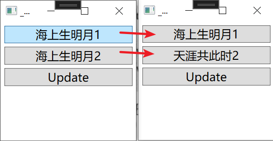
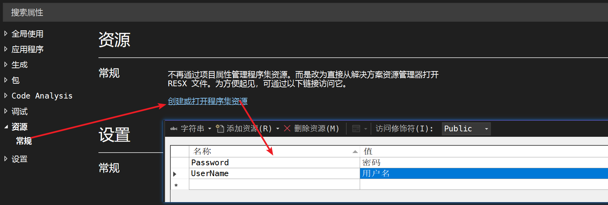
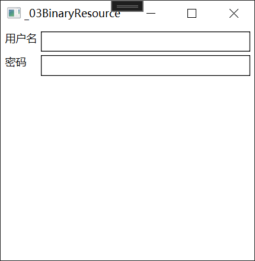
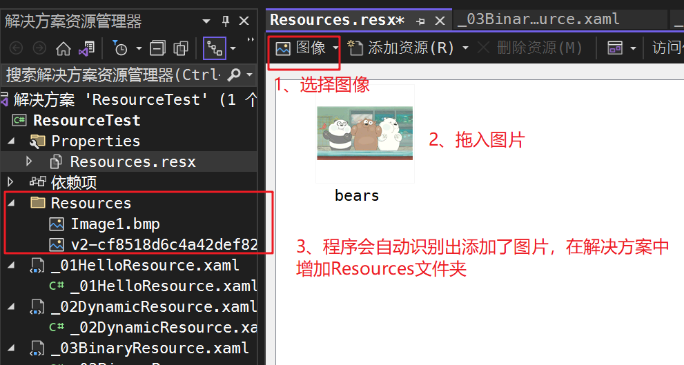
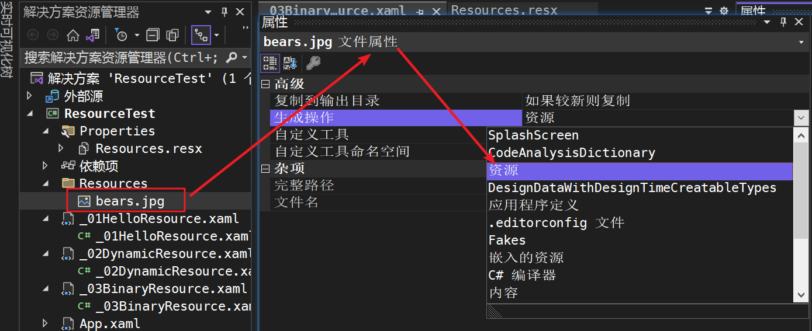
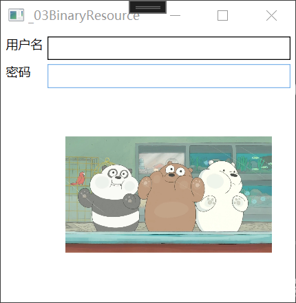

# 1、Command

你可能会问：“有了路由事件为什么还需要命令系统呢?”事件的作用是发布、传播一些消息，消息送达接收者，事件的使命也就完成了，至于如何响应事件送来的消息事件并不做规定，每个接收者可以使用自己的行为来响应事件。也就是说，事件不具有约束力。`命令与事件的区别就在于命令是具有约束力`。战场上，将军一声令下：“前进!"无论是步兵还是装甲兵都会执行同一个行为MoveForward()(而这个方法很可能定义在 BatleUnitBase 这个步兵和装甲兵共同的基类里)；同样当你在 Visual Studio菜单栏上单击皇图标或按下 Ctrl+Shif+s 时，所有打开的文档窗口都会执行SaveO方法--不能执行统一的行为，还能叫“命令”吗?

的确，实际编程工作中就算只使用事件、不使用命令，程序的逻辑也一样可以被驱动得很好，但我们不能阻止程序员按自己的习惯去编写代码。比如保存事件的处理器，程序员们可以写 SaveO)、SaveHandlerO)、SaveDocument0……这些都符合代码规范，但迟早有一天整个项目会变得无法被读懂，新来的程序员或修改 bug的程序员会很抓狂。如果使用命令，情况会好很多--当 Save 命令到达某个组件时，命令会主动去调用组件的Save()方法，而这个方法可能被定义在基类或者接口里(即保证了这个方法一定是存在的)，这就在代码结构和命名上做了约束。不但如此，命令还可控制接收者“先做校验、再保存、然后关闭”，也就是说，`命令除了可以约束代码，还可以约束步骤逻辑`，这让新来的程序员想犯错都难，也让修改bug的程序员很快能找到规律、容易上手。

## 1.1、命令系统的基本元素与关系

### 1.1.1 命令系统的基本元素

- 命令(Command)：WPF的命令实际上就是实现了ICommand接口的类，平时使用最多的是 RoutedCommand类。我们还会学习使用自定义命令。
- 命令源(Command Source)：即命令的发送者，是实现了ICommandSource接口的类。很多界面元素都实现了这个接口，其中包括 Button、Menultem、ListBoxltem 等。
- 命令目标(CommandTarget)：即命令将发送给谁，或者说命令将作用在谁身上。命令目标必须是实现了 InputElement 接口的类。
- 命令关联(Command Binding)：负责把一些外围逻辑与命令关联起来，比如执行之前对命令是否可以执行进行判断、命令执行之后还有哪些后续工作等。

### 1.1.2 基本元素之间的关系

命令的使用分为以下几步：

1. 创建命令类：即获得一个实现ICommand接口的类，如果命令与具体业务逻辑无关则使用WPF类库中的RoutedCommand类即可。如果想得到与业务逻辑相关的专有命令，则需创建RoutedCommand（或者ICommand接口）的派生类。
2. 声明命令实例：使用命令时需要创建命令类的实例。这里有个技巧，一般情况下程序中某种操作只需要一个命令实例与之对应即可。比如对应“保存”这个操作，你可以拿同一个实例去命令每个组件执行其保存功能，因此程序中的命令多使用单件模式(SingletonePattern)以减少代
   码的复杂度。
3. 指定命令的源：即指定由谁来发送这个命令。如果把命令看作炮弹，那么命令源就相当于火炮。同一个命令可以有多个源。比如保存命令，既可以由菜单中的保存项来发送，也可以由工具栏中的保存图标来发送。需要注意的是，一旦把命令指派给命令源，那么命令源就会受命令的影响，当命令不能被执行的时候作为命令源的控件将处在不可用状态。看来命令这种炮弹很智能，当不满足发射条件时还会给用来发射它的火炮上一道保险、避免走火。还需要注意，各种控件发送命令的方法不尽相同，比如 Button和 Menultem是在单击时发送命令，而 ListBoxltme 单击时表示被选中所以双击时才发送命令。
4. 指定命令目标：命令目标并不是命令的属性而是命令源的属性，指定命令目标是告诉命令源向哪个组件发送命令，无论这个组件是否拥有焦点它都会收到这个命令。如果没有为命令源指定命令目标，则WPF系统认为当前拥有焦点的对象就是命令目标。这个步骤有点像为火炮指定目标。
5. 设置命令关联：炮兵是不能单独战斗的，就像炮兵需要侦查兵在射击前观察敌情、判断发射时机，在射击后观测射击效果、帮助修正一样，WPF命令需要 CommandBinding 在执行前来帮助判断是不是可以执行、在执行后做一些事件来“打扫战场”。

在命令目标和命令关联之间还有一个微妙的关系。无论命令目标是由程序员指定还是由WPE系统根据焦点所在地判断出来的，一旦某个U组件被命令源“瞄上”，命令源就会不停地向命令目标“投石问路”，命令目标就会不停地发送出可路由的PreviewCanExecute和CanExecute 附加事件，事件会沿着 UI元素树向上传递并被命令关联所捕捉，命令关联捕捉到这些事件后会把命令能不能发送实时报告给命令。类似的，如果命令被发送出来并到达命令目标，命令目标就会发送PreviewExecuted 和 Executed 两个附加事件,这两个事件也会沿着U元素树向上传递并被命令关联所捕捉，命令关联会完成一些后续的任务。别小看是“后续任务”，对于那些与业务逻辑无关的通用命令，这些后续任务才是最重要的。

基本元素之间的关系如下：


### 1.1.3 小试命令

说起来很热闹，现在让我们动手实践一下。实现这样一个需求:定义一个命令，使用Button来发送这个命令，当命令送达TextBox时 TextBox会被清空(如果 TextBox中没有文字则命令不可被发送)。

```html
<Window x:Class="CommandTest.HelloWindow"
        xmlns="http://schemas.microsoft.com/winfx/2006/xaml/presentation"
        xmlns:x="http://schemas.microsoft.com/winfx/2006/xaml"
        xmlns:d="http://schemas.microsoft.com/expression/blend/2008"
        xmlns:mc="http://schemas.openxmlformats.org/markup-compatibility/2006"
        xmlns:local="clr-namespace:CommandTest"
        mc:Ignorable="d"
        Title="HelloWindow" Height="175" Width="260">
    <StackPanel x:Name="stackpanel1">
        <Button x:Name="button1" Content="Send Command" Margin="5"/>
        <TextBox x:Name="textBox1" Margin="5,0" Height="100"/>

    </StackPanel>
</Window>
```


```C#
using System;
using System.Collections.Generic;
using System.Linq;
using System.Text;
using System.Threading.Tasks;
using System.Windows;
using System.Windows.Controls;
using System.Windows.Data;
using System.Windows.Documents;
using System.Windows.Input;
using System.Windows.Media;
using System.Windows.Media.Imaging;
using System.Windows.Shapes;
using System.Xml.Serialization;

namespace CommandTest
{
    /// <summary>
    /// HelloWindow.xaml 的交互逻辑
    /// </summary>
    public partial class HelloWindow : Window
    {
        public HelloWindow()
        {
            InitializeComponent();
            InitializeCommand();
        }
        //1、声明命令实例
        private RoutedCommand clearCmd = new RoutedCommand("Clear", typeof(HelloWindow));

        private void InitializeCommand()
        {
            //2、把命令赋值给命令源(发送者)
            this.button1.Command = this.clearCmd;
            //并指定快捷键
            this.clearCmd.InputGestures.Add(new KeyGesture(Key.C, ModifierKeys.Alt));

            //3、指定命令目标
            this.button1.CommandTarget = this.textBox1;

            //4、创建命令关联
            CommandBinding cb = new CommandBinding();
            cb.Command = this.clearCmd; //只关注与clearCmd相关的事件
            cb.CanExecute += new CanExecuteRoutedEventHandler(cb_CanExcuted);
            cb.Executed += new ExecutedRoutedEventHandler(cb_Excuted);

            //命令关联安置在外围控件上
            this.stackpanel1.CommandBindings.Add(cb);
         }
        //探知命令是否可以执行，调用此方法
        void cb_CanExcuted(Object sender, CanExecuteRoutedEventArgs e)
        {
            if(string.IsNullOrEmpty(this.textBox1.Text)) //textbox为空则可以使用此命令
            {
                e.CanExecute = false;
            }
            else
            {
                e.CanExecute = true;
            }
            //避免向上传降低性能
            e.Handled = true;
        }
        //命令到达目标后，调用此方法
        void cb_Excuted(Object sender, ExecutedRoutedEventArgs e)
        {
            this.textBox1.Clear(); 
            //避免向上传降低性能
            e.Handled = true;
        }
    }
}
```

效果：


这里看到的可能有点蒙，我简单解释下自己的理解：

- 在WPF中，按钮是一个命令源（Command Source）。当按钮被点击时，WPF会查找与按钮关联的命令并尝试执行该命令。在这个示例中` this.button1.Command = this.clearCmd;`赋值后，我们将按钮 `button1` 的 `Command` 属性设置为 `clearCmd` 命令，因此当按钮被点击时，就会触发 `clearCmd` 命令的执行。
- 具体`clearCmd` 命令会执行什么操作这件事是通过命令关联明确的，`cb.Command = this.clearCmd;` ，命令关联就会将clearCmd绑定到cb，`cb.CanExecute += new CanExecuteRoutedEventHandler(cb_CanExcuted);`将自定义的`cb_CanExcuted `作为执行的前的哨兵操作，`cb.Executed`作为执行的具体操作。
- `cb_CanExcuted cb.Executed ` 中设置了`e.Handled = true;`就会停止事件向上传递，这意味着其他控件不会再收到这个事件，从而避免不必要的性能开销
- 最后代码中设置了 `this.stackpanel1.CommandBindings.Add(cb);`因为命令是在 Visual Tree 中向上传递的，所以将命令关联设置在 `stackpanel1` 上，可以确保整个 `HelloWindow` 窗口的控件都能够接收到该命令并进行处理。（如果你只想让 `textbox1` 接收命令，而不需要其他控件接收命令，那么将命令关联直接设置在 `textbox1` 上也是可以的）

下面是书中原文：

- 第一，使用命令可以避免自己写代码判断Button是否可用以及添加快捷键，
- 第二，RoutedCommand是一个与业务逻辑无关的类，只负责在程序中“跑腿”而并不对命令目标做任何操作，TextBOX并不是由它清空的。那么对 TexBox 的清空操作是谁做的呢?答案是 CommandBinding.因为无论是探测命令是否执行还是命令送达目标，都会激发命令目标发送路由事件，这些路由事件会沿着元素树向上传递并最终被CommandBinding所捕捉。
- 本例中 CommandBinding被安装在外围的StackPanel上，CommandBinding“站在高处”起一个侦听器的作用，而且专门针对 clearCmd 命令捕捉与其相关的路由事件。本例中，当CommandBinding 捕捉到 CanExecute 事件就会调用cb CanExecule方法(判断命令执行的条件是否满足，并反馈给命令供其影响命令源的状态);当捕捉到的是 Execuied 事件(表示命令的 Execute方法已经执行了，或说命令已经作用在了命令目标上，RoutedCommand的 Execuie 方法不包含业务逻辑、只负责让命令目标激发Executed)，则调用cbExecuted 方法。
- 第三，因为CanExecute 事件的激发频率比较高，为了避免降低性能，在处理完后建议把e.Handled 设为 true.
- 第四，CommandBinding一定要设置在命令目标的外围控件上，不然无法捕捉到CanExecute和Executed 等路由事件。

### 1.1.4 WPF的命令库

命令具有“一处声明、处处使用”的特点，比如Save命令，在程序的任何地方它都表示要求命令目标保存数据。因此，微软在 WPF类库里准备了一些便捷的命令库，这些命令库包括:

1. ApplicationCommands
2. ComponentCommands
3. NavigationCommands
4. MediaCommands
5. EditingCommands

它们都是静态类，而命令就是用这些类的静态只读属性以单件模式暴露出来的。例如：ApplicationCommands 类就包含了CancelPrint、Close、ContextMenu、Copy、CorrectionList、Cut、Delete、Find、Help、New、NotACommand、Open、Paste、Print、PrintPreview、Properties、Redo、Replace、Save、SaveAs、SelectA1l、Stop、Undo 这些命令。

其他几个命令库也与之类似。如果你的程序中需要诸如Open、Save、Play、Stop等标准命令那就没必要自己声明了，直接拿命令库来用就好了。

### 1.1.5 命令参数

前面提到命令库里有很多 WPF 预制的命令，如New、Open、Copy、Cut、Paste 等。这些命令都是 ApplicationCommands 类的静态属性，所以它们的实例永远只有一个，这就引出一个问题：如果界面上有两个按钮，一个用来新建 Teacher 的档案，另一个用来新建 Student 的档案，都使用 New命令的话，程序应该如何区别新建的是什么档案呢？

答案是使用CommandPrameter。命令源一定是实现了ICommandSource 接口的对象，而ICommandSource 有一个属性就是 CommandPrameter，如果把命令看作飞向目标的炮弹，那么CommandPrameter 就相当于装载在炮弹肚子里的“消息”。

下例中，通过两个按钮 分别可以增加一条 teacher student 实例到 listbox 中

```html
<Window x:Class="CommandTest.CommandPropWindow"
        xmlns="http://schemas.microsoft.com/winfx/2006/xaml/presentation"
        xmlns:x="http://schemas.microsoft.com/winfx/2006/xaml"
        xmlns:d="http://schemas.microsoft.com/expression/blend/2008"
        xmlns:mc="http://schemas.openxmlformats.org/markup-compatibility/2006"
        xmlns:local="clr-namespace:CommandTest"
        mc:Ignorable="d"
        Title="CommandPropWindow" Height="240" Width="360">
    <Grid Margin="6">
        <Grid.RowDefinitions>
            <RowDefinition Height="24"/>
            <RowDefinition Height="4"/>
            <RowDefinition Height="24"/>
            <RowDefinition Height="4"/>
            <RowDefinition Height="24"/>
            <RowDefinition Height="4"/>
            <RowDefinition Height="*"/>
        </Grid.RowDefinitions>
        <!--命令和命令参数-->
        <TextBlock Text="Name:" VerticalAlignment="Center" HorizontalAlignment="Left" Grid.Row="0"/>
        <TextBox x:Name="nameTextBox" Margin="60,0,0,0" Grid.Row="0"/>
        <Button Content="New Teacher" Command ="New" CommandParameter="Teacher" Grid.Row="2"/>
        <Button Content="New Student" Command ="New" CommandParameter="Student" Grid.Row="4"/>
        <ListBox x:Name="listBoxNewItems" Grid.Row="6"/>
    </Grid>
    <!--命令和命令关联写在xmal中-->
    <Window.CommandBindings>
        <CommandBinding Command="New" CanExecute="New_CanExecute" Executed="New_Executed"/>
    </Window.CommandBindings>
</Window>
```


```C#
namespace CommandTest
{
    /// <summary>
    /// CommandPropWindow.xaml 的交互逻辑
    /// </summary>
    public partial class CommandPropWindow : Window
    {
        public CommandPropWindow()
        {
            InitializeComponent();
        }
		// 当 nameTextBox 不为空时 才能执行命令
        private void New_CanExecute(object sender, CanExecuteRoutedEventArgs e)
        {
            if(string.IsNullOrEmpty(this.nameTextBox.Text))
            {
                e.CanExecute = false;
            }
            else
            {
                e.CanExecute = true;
            }
        }
		//根据参数在listbox中增加记录
        private void New_Executed(object sender, ExecutedRoutedEventArgs e)
        {
            string name = this.nameTextBox.Text;
            if(e.Parameter.ToString() == "Teacher") 
            {
                this.listBoxNewItems.Items.Add($"New Teacher: {name} ");
            }
            else if (e.Parameter.ToString() == "Student")
            {
                this.listBoxNewItems.Items.Add($"New Student: {name}");
            }
        }
    }
}
```

效果：


### 1.1.6 命令与Binding结合

初试命令，你可能会想到这样一个问题：控件有很多事件，可以让我们进行各种各样不同的操作，可控件只有一个 Command 属性、而命令库中却有数十种命令，这样怎么可能使用这个唯一的Command 属性来调用那么多种命令呢？答案是：使用 Binding。

前面已经说过，Binding 作为一种间接的、不固定的赋值手段，可以让你有机会选择在某个条件下为目标赋特定的值（有时候需要借助Converter）。
例如，如果一个 Button 所关联命令有可能根据某些条件而改变，我们可以把代码写成这样：

```C#
<Button x:Name="dynamicCmdBtn" Command="Binding Path=pp,Source=ss" Content="Command"/>
```

不过话说回来，因为大多数命令按钮都有相对应的图标来表示固定的含义，所以日常工作中一个控件的命令一经确定就很少改变。

## 1.2、近观命令

一般情况下，程序中使用与逻辑无关的 RoutedCommand 来跑跑龙套就足够了，但为了使程序的结构更加简洁（比如去掉外围的CommandBinding 和与之相关的事件处理器），我们常需要定义自己的命令。本节中我们走近 WPF命令，先由剖析 RoutedCommand 入手，再创建自己的命令。

### 1.2.1 ICommand 接口与 Routed

WPF 的命令是实现了ICommand 接口的类。ICommand 接口非常简单，只包含两个方法和一个事件：

- Execute 方法：命令执行，或者说命令作用于命令目标之上。需要注意的是，现实世界中的命令是不会自己“执行”的，它只能“被执行”，而在这里，执行变成了命令的方法，颇有点儿拟人化的味道。
- CanExecute 方法：在执行之前用来探知命令是否可被执行。
- CanExecuteChanged 事件：当命令可执行状态发生改变时,可激发此事件来通知其他对象

RoutedCommand 就是这样一个实现了ICommand 接口的类。`RoutedCommand 在实现ICommand 接口时，并未向Execute和 CanExecute 方法中添加任何逻辑`，也就是说，它是通用的、与具体业务逻辑无关的。怎么理解这个“``与具体业务逻辑无关的`”呢？让我们从外部和内部两方面来理解。

从外部来看，让我们回顾一下 ApplicationCommands 命令库里的命令们：

```C#
namespace System.Windows.Input
{
    //
    // 摘要:
    //     Provides a standard set of application related commands.
    public static class ApplicationCommands
    {
        public static RoutedUICommand CancelPrint { get; }
        public static RoutedUICommand SelectAll { get; }
        public static RoutedUICommand SaveAs { get; }
        public static RoutedUICommand Save { get; }
        public static RoutedUICommand Replace { get; }
        public static RoutedUICommand Redo { get; }
        public static RoutedUICommand Properties { get; }
        public static RoutedUICommand PrintPreview { get; }
        public static RoutedUICommand Print { get; }
        public static RoutedUICommand Paste { get; }
        public static RoutedUICommand Stop { get; }
        public static RoutedUICommand Open { get; }
        public static RoutedUICommand New { get; }
        public static RoutedUICommand Help { get; }
        public static RoutedUICommand Find { get; }
        public static RoutedUICommand Delete { get; }
        public static RoutedUICommand Cut { get; }
        public static RoutedUICommand CorrectionList { get; }
        public static RoutedUICommand Copy { get; }
        public static RoutedUICommand ContextMenu { get; }
        public static RoutedUICommand Close { get; }
        public static RoutedUICommand NotACommand { get; }
        public static RoutedUICommand Undo { get; }
    }
}
```

虽然他们都有自己的名字（如Copy、Paste、Cut），但它们都是普普通通的RoutedUICommand 类实例。也就是说，当一个命令到达命令目标后，具体是执行 Copy 还是 Cut（即业务逻辑）不是由命令决定的，而是外围的CommandBinding 捕获到命令目标受命令激发而发送的路由事件后，在其Executed 事件处理器中完成。换句话说，`就算你的CommandBinding 在捕捉到Copy 命令后执行的是清除操作也与命令无关`。从内部分析，我们就要读读 RoutedCommand的源码了。在线源码地址：https://referencesource.microsoft.com/#PresentationCore/Core/CSharp/System/Windows/Input/Command/RoutedCommand.cs,0fa9f656274de394

RoutedCommand 类与命令执行相关的代码简化如下：

```C#
public class RoutedCommand : ICommand
{
    //1、由 ICommand 继承而来，类内部使用
    void ICommand.Execute(object parameter)
    {
        Execute(parameter, FilterInputElement(Keyboard.FocusedElement));
    }
    //2、可由外部调用
    public void Execute(object parameter, IInputElement target)
    {
        // We only support UIElement, ContentElement and UIElement3D
        if ((target != null) && !InputElement.IsValid(target))
        {
            throw new InvalidOperationException(SR.Get(SRID.Invalid_IInputElement, target.GetType()));
        }
        // 命令目标为空，选定当前具有焦点的控件作为目标
        if (target == null)
        {
            target = FilterInputElement(Keyboard.FocusedElement);
        }
        //真正执行命令的逻辑
        ExecuteImpl(parameter, target, false);
    }
    //2.2、另一个调用 ExecuteImpl 方法的函数，依序集级别可用
    internal bool ExecuteCore(object parameter, IInputElement target, bool userInitiated)
    {
        if (target == null)
        {
            target = FilterInputElement(Keyboard.FocusedElement);
        }

        return ExecuteImpl(parameter, target, userInitiated);
    }
    //3、真正执行命令的逻辑，仅供内部使用
    private bool ExecuteImpl(object parameter, IInputElement target, bool userInitiated)
    {
        // If blocked by rights-management fall through and return false
        if ((target != null) && !IsBlockedByRM)
        {
            UIElement targetUIElement = target as UIElement;
            ContentElement targetAsContentElement = null;
            UIElement3D targetAsUIElement3D = null;

            // Raise the Preview Event and check for Handled value, and
            // Raise the regular ExecuteEvent.
            ExecutedRoutedEventArgs args = new ExecutedRoutedEventArgs(this, parameter);
            args.RoutedEvent = CommandManager.PreviewExecutedEvent;

            if (targetUIElement != null)
            {
                targetUIElement.RaiseEvent(args, userInitiated);
            }
            else
            {
                targetAsContentElement = target as ContentElement;
                if (targetAsContentElement != null)
                {
                    targetAsContentElement.RaiseEvent(args, userInitiated);
                }
                else
                {
                    targetAsUIElement3D = target as UIElement3D;
                    if (targetAsUIElement3D != null)
                    {
                        targetAsUIElement3D.RaiseEvent(args, userInitiated);
                    }
                }
            }

            if (!args.Handled)
            {
                args.RoutedEvent = CommandManager.ExecutedEvent;
                if (targetUIElement != null)
                {
                    targetUIElement.RaiseEvent(args, userInitiated);
                }
                else if (targetAsContentElement != null)
                {
                    targetAsContentElement.RaiseEvent(args, userInitiated);
                }
                else if (targetAsUIElement3D != null)
                {
                    targetAsUIElement3D.RaiseEvent(args, userInitiated);
                }
            }

            return args.Handled;
        }

        return false;
    }

}
```

阅读代码我们可以发现，从ICommand接口继承来的Execute并没有被公开（甚至可以说是废弃不用了），仅仅是调用新声明的带两个参数的 Execute 方法。

新声明的带两个参数的 Execute 方法是对外公开的

```C#
public void Execute(object parameter, IInputElement target)
```

可以使用第一个参数向命令传递一些数据，第二个参数是命令的目标，如果目标为null，Execute 方法就把当前拥有焦点的控件作为命令的目标。新的 Execute 方法会调用命令执行逻辑的核心——`ExecuteImpl`方法(ExecuteImpl是Execute Implement 的缩写)，而这个方法内部并没有什么神秘的东西，简要而言就是“借用”命令目标的RaiseEvent把RoutedEvent 发送出去。显然,这个事件会被外围的 CommandBinding 捕获到然后执行程序员预设的与业务相关的逻辑。

最后，我们以 ButtonBase 为例看看UI控件是如何发送命令的。ButtonBase是在Click事件发生时发送命令的，而Click事件的激发是放在OnClick方法里。ButtonBase 的源码 https://referencesource.microsoft.com/#PresentationFramework/src/Framework/System/Windows/Controls/Primitives/ButtonBase.cs,1001a15c43ab91f9

 OnClick方法如下:

```C#
/// <summary>
/// This virtual method is called when button is clicked and it raises the Click event
/// </summary>
protected virtual void OnClick()
{
    //激发路由事件，发送命令
    RoutedEventArgs newEvent = new RoutedEventArgs(ButtonBase.ClickEvent, this);
    RaiseEvent(newEvent);
	//调用内部类CommandHelpers的ExecuteCommandSource
    MS.Internal.Commands.CommandHelpers.ExecuteCommandSource(this);
}
```

ExecuteCommandSource 的定义：ExecuteCommandSource 内部调用了CriticalExecuteCommandSource

```C#
internal static void ExecuteCommandSource(ICommandSource commandSource)
{
    CriticalExecuteCommandSource(commandSource, false);
}
/// <summary>
///     Executes the command on the given command source.
/// </summary>
/// <SecurityNote>
/// Critical - sets the user initiated bit on a command, which is used
///            for security purposes later. It is important to validate 
///            the callers of this, and the implementation to make sure
///            that we only call MarkAsUserInitiated in the correct cases.
/// </SecurityNote>
[SecurityCritical]
internal static void CriticalExecuteCommandSource(ICommandSource commandSource, bool userInitiated)
{
    ICommand command = commandSource.Command;
    if (command != null)
    {
        //将参数的命令源 commandSource 拆为 parameter和target
        object parameter = commandSource.CommandParameter;
        IInputElement target = commandSource.CommandTarget;

        RoutedCommand routed = command as RoutedCommand;
        if (routed != null)
        {
            if (target == null)
            {
                target = commandSource as IInputElement;
            }
            if (routed.CanExecute(parameter, target))
            {
                //调用命令源的 ExecuteCore方法（也就是内部的 ExecuteImpl方法 ）
                //获取命令源的 CommandTarget 属性值(命令目标)并使命令作用于命令目标之上。
                routed.ExecuteCore(parameter, target, userInitiated); 
            }
        }
        else if (command.CanExecute(parameter))
        {
            command.Execute(parameter);
        }
    }
}
```

个人理解总结：ButtonBase的Click 就是 通过命令源获取CmmandTarget属性(命令目标) 并使命令作用于命令目标。

### 1.2.2 自定义Command

自定义命令有两个层次：

1、自定义RoutedCommand实例，这只是对RoutedCommand的使用

2、实现IConmmand接口，同时将业务逻辑包含在命令中。但是棘手的是WPF命令系统中 命令源、RoutedCommand、CommandBinding三者依赖的相当紧密。切命令相关的方法没有声明为Virtual 以供重写。

换句话说，WPF自带的命令源和CommandBinding就是专门为RoutedCommand 而编写的，如果我们想使用自己的ICommand 派生类就必须连命令源一起实现(即实现ICommandSource接口)。因此，为了简便地使用WPF这套成熟的体系，为了更高效率地“从零开始”打造自己的命令系统，需要我们根据项目的实际情况进行权衡。

前面已经多次提到，RoutedCommand与业务逻辑无关，业务逻辑要依靠外围的CommandBinding来实现。这样一来，如果对 CommandBinding 管理不善就有可能造成代码杂乱无章，毕竟一个CommandBinding要牵扯到谁是它的宿主以及它的两个事件处理器。

为了简化使用 CommandBinding来处理业务逻辑的程序结构,我们可能会希望把业务逻辑移入命令的 Execute 方法内。比如，我们可以自定义一个名为Save 的命令，当命令到达命令目标的时候先通过命令目标的IsChanged 属性判断命令目标的内容是否已经被改变，如果已经改变则命令可以执行，命令的执行会直接调用命令目标的 Save 方法、驱动命令目标以自己的方式保存数据。很显然，这回是命令直接在命令目标上起作用了，而不像RoutedCommand 那样先在命令目标上激发出路由事件等外围控件捕捉到事件后再“翻过头来”对命令目标加以处理。你可能会问：“如果命令目标不包含IsChanged和Save方法怎么办?”这就要靠接口来约束了，如果我在程序中定义这样一个接口：

```C#
public interface IView{
    //属性
	bool lsChanged { get, set;}
	//方法
	void SetBinding(),
	void Refresh();
	void Clear();
	void Save();
}
```

并且要求每个需要接受命令的组件都必须实现这个接口,这样就确保了命令可以成功地对它们执行作。接下来，我们实现ICommand 接口，创建一个专门作用于IView 派生类的命令。

新建一个userControl（名为selfCommandTestView），设计一个页面 其中包含四个textBox

```html
<UserControl x:Class="CommandTest.selfCommandTestView"
             xmlns="http://schemas.microsoft.com/winfx/2006/xaml/presentation"
             xmlns:x="http://schemas.microsoft.com/winfx/2006/xaml"
             xmlns:d="http://schemas.microsoft.com/expression/blend/2008"
             xmlns:mc="http://schemas.openxmlformats.org/markup-compatibility/2006"
             xmlns:local="clr-namespace:CommandTest"
             mc:Ignorable="d"
             Height="114" Width="200">
    <StackPanel>
        <TextBox x:Name="textBox1" Margin="5"/>
        <TextBox x:Name="textBox2" Margin="5,0"/>
        <TextBox x:Name="textBox3" Margin="5"/>
        <TextBox x:Name="textBox4" Margin="5,0"/>
    </StackPanel>
</UserControl>
```

在其cs文件中设计：

- 一个IMyView接口规范新建的selfCommandTestView组件必须实现接口的方法
- 自定义命令（继承自ICommand），专门用于IMyView接口，如果命令的目标为IMyView的实现则调用其Clear方法
- 自定义命令源（继承自 UserControl, 实现 ICommandSource）， 专门用于设置命令的命令源，继承UserControl的原因：组件被单击时执行操作 OnMouseLeftButtonDown(重写UserControl的)；实现ICommandSource的原因：继承其属性 Command、CommandParameter、CommandTarget 当命令目标不为空时，将命令作用于命令目标

```C#
namespace CommandTest
{
    /// <summary>
    /// 4、selfCommandTestView作为接受命令的组件必须继承自IMyView
    /// </summary>
    public partial class selfCommandTestView : UserControl,IMyView
    {
        public selfCommandTestView()
        {
            InitializeComponent();
        }
        //用于清除内容的业务逻辑
        public void Clear()
        {
            this.textBox1.Clear(); //this.textBox1.Text=""多了处理文本框的样式、光标位置
            this.textBox2.Clear();
            this.textBox3.Clear();
            this.textBox4.Clear();
        }
        //继承自IMyView的成员
        public bool IsChanged { get => throw new NotImplementedException(); set => throw new NotImplementedException(); }

        public void Refresh()
        {
            throw new NotImplementedException();
        }

        public void Save()
        {
            throw new NotImplementedException();
        }

        public void SetBinding()
        {
            throw new NotImplementedException();
        }
    }
    //1、靠接口来约束命令目标：一定包含IsChanged和Save方法（要求每个需要接受命令的组件都必须实现这个接口）
    public interface IMyView
    {
        //属性
        bool IsChanged { set; get; }
        //方法
        void SetBinding();
        void Refresh();
        void Clear();
        void Save();
    }
    //2、自定义命令,专门用于IMyView接口
    public class ClearCommand : ICommand
    {
        //当命令可执行状态发生改变时，被激发
        public event EventHandler? CanExecuteChanged;

        //用于判断命令是否可执行（暂不实现）
        public bool CanExecute(object? parameter)
        {
            throw new NotImplementedException();
        }
        //只用到了命令行执行，带有业务逻辑的Clear
        public void Execute(object? parameter)
        {
            //parameter参数为命令目标，如果目标能够转为IMyView则调用其Clear方法
            IMyView view = parameter as IMyView;
            if (view != null)
            {
                view.Clear();
            }
            //throw new NotImplementedException();
        }
    }
    //3、自定义命令源
    public class MyCommandSource : UserControl, ICommandSource
    {
        //继承自ICommandSource的三个属性
        // Gets the command that will be executed when the command source is invoked
        public ICommand Command { set; get; }
        //Represents a user defined data value that can be passed to the command when it
        //     is executed.
        public object CommandParameter { set; get; }
        //The object that the command is being executed on.
        public IInputElement CommandTarget { set; get; }

        //组件被单击时执行命令
        protected override void OnMouseLeftButtonDown(MouseButtonEventArgs e)
        {
            base.OnMouseLeftButtonDown(e);

            //当命令目标不为空时，将命令作用于命令目标
            if (this.CommandTarget != null)
            {
                this.Command.Execute(this.CommandTarget);
            }
        }
    }
}
```

`OnMouseLeftButtonDown`方法实际上不是`UserControl`类的方法，要追溯到其祖祖祖父`UIElement`类，类之间的继承关系如下：

```text
MyCommandSource —》UserControl —》ContentControl —》Control —》FrameworkElement —》UIElement（OnMouseLeftButtonDown）
```

目前准备就绪的有：

1. 接收命令的组件 `selfCommandTestView`
2. 自定义的命令 `ClearCommand`
3. 自定义的命令源 `MyCommandSource`

还缺少发起命令的触发事件，所以新建一个window（名为`SelfDesignCommandWindow`），内部放置一个按钮，套在自定义命令源 `MyCommandSource` 里面就可以作为发起（触发）命令的组件。引入上面继承自`IMyView`接口的自定义的用于接受命令组件 `selfCommandTestView`

```html
<Window x:Class="CommandTest.SelfDesignCommandWindow"
        xmlns="http://schemas.microsoft.com/winfx/2006/xaml/presentation"
        xmlns:x="http://schemas.microsoft.com/winfx/2006/xaml"
        xmlns:d="http://schemas.microsoft.com/expression/blend/2008"
        xmlns:mc="http://schemas.openxmlformats.org/markup-compatibility/2006"
        xmlns:local="clr-namespace:CommandTest"
        mc:Ignorable="d"
        Title="SelfDesignCommandWindow" Height="205" Width="250">
    <StackPanel>
        <local:MyCommandSource x:Name="myCommandSource" Margin="10">
            <TextBlock Text="清除" FontSize="16" TextAlignment="Center"
                       Background="LightBlue" Width="80"/>
        </local:MyCommandSource>
        <local:selfCommandTestView x:Name="miniView"/>
    </StackPanel>
</Window>
```

在`SelfDesignCommandWindow`的cs文件初始化时：将自定义命令`ClearCommand`绑定到自定义命令源`myCommandSource`上，设置命令接受者为自定义的接受命令组件 `selfCommandTestView`的实例。

```C#
namespace CommandTest
{
    /// <summary>
    /// SelfDesignCommandWindow.xaml 的交互逻辑
    /// </summary>
    public partial class SelfDesignCommandWindow : Window
    {
        public SelfDesignCommandWindow()
        {
            InitializeComponent();

            //声明命令并使命令源和目标关联
            this.myCommandSource.Command = new ClearCommand();
            this.myCommandSource.CommandTarget = this.miniView;
        }
    }
}
```

效果：


效果实现过程：

- 当鼠标点击清除时，就会触发外层的`MyCommandSource`中的`OnMouseLeftButtonDown方法`
- 此时由于`myCommandSource命令源实例`已经在初始化时绑定了`命令ClearCommand()+命令目标this.miniView`，`OnMouseLeftButtonDown方法`中判断到命令目标不为空，则执行将命令作用于命令目标的操作（命令为ClearCommand()，命令目标为this.miniView）
- `ClearCommand()方法`中判断`miniView`属于我们自定义的`selfCommandTestView类`，即触发`selfCommandTestView类`的`Clear()方法`
- `selfCommandTestView类`的`Clear()方法`中清空了我们自定义的userControl中所有的textbox

至此，一个简单的自定义命令就完成 了。若想通过Command的 CanExecute 方法返回值来影响命令源的状态，还需要使用ICommand和ICommandSource 接口的成员组成更复杂的逻辑，介于篇幅原因不再赘述。（挖坑待填）

# 2、Resource

我们把有用的东西称为资源。“兵马未动，粮草先行”——程序中的各种数据就是算法的原料和粮草。程序中可以存放数据的地方有很多，可以放在数据库里、可以存储在变量里。

界于数据库存储和变量存储之间，我们还可以把数据存储在程序主体之外的文件里。外部文件与程序主体分离，这就有可能丢失或损坏，为了避免丢失或损坏，编译器允许我们把外部文件编译进程序主体，成为程序主体不可分割的一部分，这就是传统意义上的程序资源(也称为二进制资源)。

WPF不但支持程序级的传统资源，同时还推出了独具特色的对象级资源，每个界面元素都可以携带自己的资源并可被自己的子级元素共享。比如后面章节要讲到的各种模板、程序样式和主题就经常放在对象级资源里。这样一来，在WPF程序中数据就分为四个等级存储了：

1. 数据库里的数据相当于存放在仓库里
2. 资源文件里的数据相当于放在旅行箱里
3. WPF对象资源里的数据相当于放在随身携带的背包里
4. 变量中的数据相当于拿在手里。

本章先来学习WPF对象级资源，然后回顾传统资源在WPF中的使用

## 2.1、WPF对象级资源的定义与查找

每个 WPF的界面元素都具有一个名为`Resources`的属性，这个属性继承自`FrameworkElement类`，其类型为 `ResourceDictionary`。ResourceDictionary 能够以“键一值”对的形式存储资源，当需要使用某个资源时，使用“键一值”对可以索引到资源对象。

在保存资源时，ResourceDictionary视资源对象为obiect 类型，所以在使用资源时先要对资源对象进行类型转换，XAML 编译器能够根据标签的 Attribute自动识别资源类型，如果类型不对就会抛出异常，但在C#代码里检索到资源对象后，类型转换的事情就只能由我们自己来做了。ResourceDictionary可以存储任意类型的对象。

在XAML代码中向 Resources 添加资源时需要把正确的名称空间引入到XAML代码中。让我们看一个例子：

```html
<Window x:Class="ResourceTest._01HelloResource"
        xmlns="http://schemas.microsoft.com/winfx/2006/xaml/presentation"
        xmlns:x="http://schemas.microsoft.com/winfx/2006/xaml"
        xmlns:d="http://schemas.microsoft.com/expression/blend/2008"
        xmlns:mc="http://schemas.openxmlformats.org/markup-compatibility/2006"
        xmlns:local="clr-namespace:ResourceTest"
        xmlns:sys="clr-namespace:System;assembly=mscorlib"
        mc:Ignorable="d"
        Title="_01HelloResource" FontSize="14" Width="320" Height="100">
    <Window.Resources>
        <ResourceDictionary>
            <sys:String x:Key="str">
                沉舟侧畔千帆过，病树前头万木春
            </sys:String>
            <sys:Double x:Key="db1">3.1415926</sys:Double>
        </ResourceDictionary>
    </Window.Resources>
    <StackPanel>
        <TextBlock Text="{StaticResource ResourceKey=str}" Margin="5"/>
        <TextBlock Text="{StaticResource str}" Margin="5,0"/>
        <!--TextBlock的Text属性只能接收string类型，double类型会因为数据类型不匹配抛异常-->
        <!--<TextBlock Text="{StaticResource ResourceKey=db1}" Margin="5,0"/>-->
    </StackPanel>
</Window>
```

在检索资源时，先查找控件自己的Resources属性，如果没有这个资源程序会沿着逻辑树向上一级控件查找，如果连最顶层容器都没有这个资源，程序就会去查找 Application.Resources（也就是程序的顶级资源），如果还没找到，那就只好抛出异常了。

在cs文件中找资源：

```C#
//当不知道这个key对应的资源在哪个层的控件中时
string text = (string)this.FindResource("str");
//当知道这个key对应的资源在哪个层的控件中时
string text1 = (string)this.Resources["str"];
```

## 2.2、且“静”且“动”用资源

当资源被存储进资源词典后，我们可以通过两种方式来使用这些资源——静态方式和动态方式。Static和 Dynamic两个词是我们的老朋友了，当这对词一同出现的时候 `Static 指的是程序的非执行状态而 Dynamic 指的是程序运行状态`。对于资源的使用，Static 和 Dynamic 也是这个意思。

- 静态资源使用(StaticResource)指的是在程序载入内存时对资源的一次性使用，之后就不再去访问这个资源了
- 动态资源使用(DyamicResource)使用指的是在程序运行过程中仍然会去访问资源。

显然，如果你确定某些资源只在程序初始化的时候使用一次、之后不会再改变，就应该使用StaticResource，而程序运行过程中还有可能改变的资源应该以DynamicResource 形式使用。拿程序的主题来举例，如果程序皮肤的颜色在运行中始终不变，以StaticResource 方式来使用资源就可以了;如果程序运行过程中允许用户更改程序皮肤的配色方案则必须以 DynamicResource 方式来使用资源。

下面的案例就是分别声明了StaticResource、DyamicResource，在点击按钮时只有绑定了DyamicResource的textblock才能修改显示的值

```html
<Window x:Class="ResourceTest._02DynamicResource"
        xmlns="http://schemas.microsoft.com/winfx/2006/xaml/presentation"
        xmlns:x="http://schemas.microsoft.com/winfx/2006/xaml"
        xmlns:d="http://schemas.microsoft.com/expression/blend/2008"
        xmlns:mc="http://schemas.openxmlformats.org/markup-compatibility/2006"
        xmlns:local="clr-namespace:ResourceTest"
        mc:Ignorable="d"
        Title="_02DynamicResource" FontSize="16" Height="200" Width="200">
    <Window.Resources>
        <TextBlock x:Key="res1" Text="海上生明月1"/>
        <TextBlock x:Key="res2" Text="海上生明月2"/>
    </Window.Resources>
    <StackPanel>
        <Button Margin="5,5,5,0" Content="{StaticResource res1}"/>
        <Button Margin="5,5,5,0" Content="{DynamicResource res2}"/>
        <Button Margin="5,5,5,0" Content="Update" Click="Button_Click"/>
    </StackPanel>
</Window>
```

```C#
namespace ResourceTest
{
    /// <summary>
    /// _02DynamicResource.xaml 的交互逻辑
    /// </summary>
    public partial class _02DynamicResource : Window
    {
        public _02DynamicResource()
        {
            InitializeComponent();
        }

        private void Button_Click(object sender, RoutedEventArgs e)
        {
            this.Resources["res1"] = new TextBlock() { Text = "天涯共此时1" };
            this.Resources["res2"] = new TextBlock() { Text = "天涯共此时2" };
        }
    }
}
```

效果：



## 2.3、向程序添加二进制资源

Windows应用程序资源的道理与 WinZip或 WinRAR 压缩包的道理差不多，实际上是把一些应用程序必须使用的资源与应用程序自身打包在一起，这样资源就不会意外丢失了(负作用就是应用程序体积会变大)。常见的应用程序资源有图标、图片、文本、音频、视频等，各种编程语言的编译器或资源编译器都有能力把这些文件编译进目标文件(最终的.exe 或.dll文件)，资源文件在目标文件里以二进制数据的形式存在、形成目标文件的资源段(ResourceSection)，使用时数据会被提取出来。

为了不把资源词典里的资源和应用程序内嵌的资源搞混，我们明确地称呼资源词典里的资源为“WPF资源”或“对象资源”，称呼应用程序的内嵌资源为“程序集资源”或“二进制资源”。特别提醒一点，WPF 程序中写在`<Application,Resources>..</ApplicationResources>`标签内的资源仍然
是WPF资源而非二进制资源。

打开资源文件的方法：

项目(右键) —》属性 —》资源 —》创建或打开程序集资源，添加两个资源变量



在资源中添加后在xaml中使用`{x:Static prop:Resources.UserName}`

```html
<Window x:Class="ResourceTest._03BinaryResource"
        xmlns="http://schemas.microsoft.com/winfx/2006/xaml/presentation"
        xmlns:x="http://schemas.microsoft.com/winfx/2006/xaml"
        xmlns:d="http://schemas.microsoft.com/expression/blend/2008"
        xmlns:mc="http://schemas.openxmlformats.org/markup-compatibility/2006"
        xmlns:local="clr-namespace:ResourceTest"
        mc:Ignorable="d"
        xmlns:prop="clr-namespace:ResourceTest.Properties"
        Title="_03BinaryResource" Height="300" Width="300">
    <Grid Margin="5">
        <Grid.RowDefinitions>
            <RowDefinition Height="23"/>
            <RowDefinition Height="4"/>
            <RowDefinition Height="23"/>
        </Grid.RowDefinitions>
        <Grid.ColumnDefinitions>
            <ColumnDefinition Width="Auto"/>
            <ColumnDefinition Width="4"/>
            <ColumnDefinition Width="*"/>
        </Grid.ColumnDefinitions>
        <TextBlock Text="{x:Static prop:Resources.UserName}"/>
        <TextBlock x:Name="textBloxPassword" Grid.Row="2"/>
        <TextBox Grid.Column="2" BorderBrush="Black"/>
        <TextBox Grid.Row="2" Grid.Column="2" BorderBrush="Black"/>
    </Grid>
</Window>
```

注意xmal中要引用 Properties 命名空间

```html
xmlns:prop="clr-namespace:ResourceTest.Properties"
```

在cs文件中也可以使用Password资源

```C#
namespace ResourceTest
{
    /// <summary>
    /// _03BinaryResource.xaml 的交互逻辑
    /// </summary>
    public partial class _03BinaryResource : Window
    {
        public _03BinaryResource()
        {
            InitializeComponent();
            this.textBloxPassword.Text = Properties.Resources.Password;
        }
    }
}
```

效果：



使用 Resources.resx最大的好处就是便于程序的国际化、本地化。如果我想把界面改为英文版只需要把资源的值改为相应的英文即可。

如果需要添加的资源不是字符串而是图标、图片、音频或视频,方法就不是使用 Resources.resx了，WPF不支持这样做。在WPF中使用外部文件作为资源，仅需简单地将其加入项目即可。方法如下：需要注意在拖入前就将文件的名字改好，拖进来之后再改会导致在Resources.resx和Resource文件夹下的名字对不上（因为不知道为啥这么不智能）



在上一个案例的基础上直接增加一个显示二进制图片资源的代码，使用 `BitmapImage` 作为图像的源，指定了资源的绝对路径

```html
<Window x:Class="ResourceTest._03BinaryResource"
        xmlns="http://schemas.microsoft.com/winfx/2006/xaml/presentation"
        xmlns:x="http://schemas.microsoft.com/winfx/2006/xaml"
        xmlns:d="http://schemas.microsoft.com/expression/blend/2008"
        xmlns:mc="http://schemas.openxmlformats.org/markup-compatibility/2006"
        xmlns:local="clr-namespace:ResourceTest"
        mc:Ignorable="d"
        xmlns:prop="clr-namespace:ResourceTest.Properties"
        Title="_03BinaryResource" Height="300" Width="300">
    <Grid Margin="5">
        <Grid.RowDefinitions>
            <RowDefinition Height="23"/>
            <RowDefinition Height="4"/>
            <RowDefinition Height="23"/>
            <RowDefinition Height="4"/>
            <RowDefinition Height="*"/>
        </Grid.RowDefinitions>
        <Grid.ColumnDefinitions>
            <ColumnDefinition Width="Auto"/>
            <ColumnDefinition Width="4"/>
            <ColumnDefinition Width="*"/>
        </Grid.ColumnDefinitions>
        <TextBlock Text="{x:Static prop:Resources.UserName}"/>
        <TextBlock x:Name="textBloxPassword" Grid.Row="2"/>
        <TextBox Grid.Column="2" BorderBrush="Black"/>
        <TextBox Grid.Row="2" Grid.Column="2" BorderBrush="Black"/>
        <Image Grid.Row="4" Grid.Column="2" Width="200" Height="200" Stretch="Uniform">
            <Image.Source>
                <BitmapImage UriSource="/ResourceTest;component/Resources/bears.jpg" />
            </Image.Source>
        </Image>
    </Grid>
</Window>

```

如果在预览中能够看到图片，但是运行后就看不到了，是因为没有设置图片的生成操作，要改为【资源】，注意改为嵌入的资源也不能正常显示！

原因：想让外部文件编译进目标成为二进制资源，必须在属性窗口中把文件的 BuildAction属性值设为Resource。并不是每种文件都会自动设为Rcsource，比如图片文件会，mp3 文件就不会

一般情况下如果 Build Action属性被设为 Resource，则 Copy to Output Directory属性就设为 Do Not Copy；如果不希望以资源的形式使用外部文件，可以把 Build Action 设为 None，而把 Copy to Output Directory设为 Copy always。另外，Build Action属性的下拉列表里有一个颇具迷惑性的值Embedded Resource，不要选择这个值。



效果：



## 2.4、使用Pack URI 路径访问二进制资源

好了！二进制资源已经被添加进我们的程序，怎样才能访问到它们呢?
WPF对二进制资源的访问有自己的一套方法，称为PackURI路径。有时候死记硬背既能帮助读者快速学习又能帮助作者偷点小懒，比如 WPF的PackURI路径，你只需要记住这样的格式即可：

```html
pack://application,,,[/程序集名称][可选版本号][文件夹名称/]文件名称
```

又因为 `pack://application,,,`可以省略，所以简化为

```html
[文件夹名称/]文件名称
```

下面两种写法等价的（上面使用了 `BitmapImage` 作为图像的源，指定了资源的绝对路径；下面的写法是使用`Source` 属性来指定资源的相对路径）

```htlm
<Image Grid.Row="4" Grid.Column="2" Width="200" Height="200" Stretch="Uniform"
               x:Name="img" Source="Resources/bears.jpg"/>
<Image Grid.Row="4" Grid.Column="2" Width="200" Height="200" Stretch="Uniform"
               x:Name="img2" Source="pack://application:,,,/Resources/bears.jpg"/>
```

在cs文件中同样可以实现此效果：

```C#
this.img.Source = new BitmapImage(new Uri(@"Resources/bears.jpg",UriKind.Relative));
```

在使用Pack URI路径时有几点需要注意：

- Pack URl使用从右向左的正斜线(/)表示路径.
- 使用缩略写法意味着是相对路径，C#代码中的 UriKind必须为 Relative 而且代表根目录的/可以省略
- 使用完整写法时是绝对路径，C#代码中的UriKind 必须为 Absolute 并且代表根目录的/不能省略。
- 使用相对路径时可以借助类似 DOS的语法进行导航，比如./代表同级目录、../代表父级目录。


