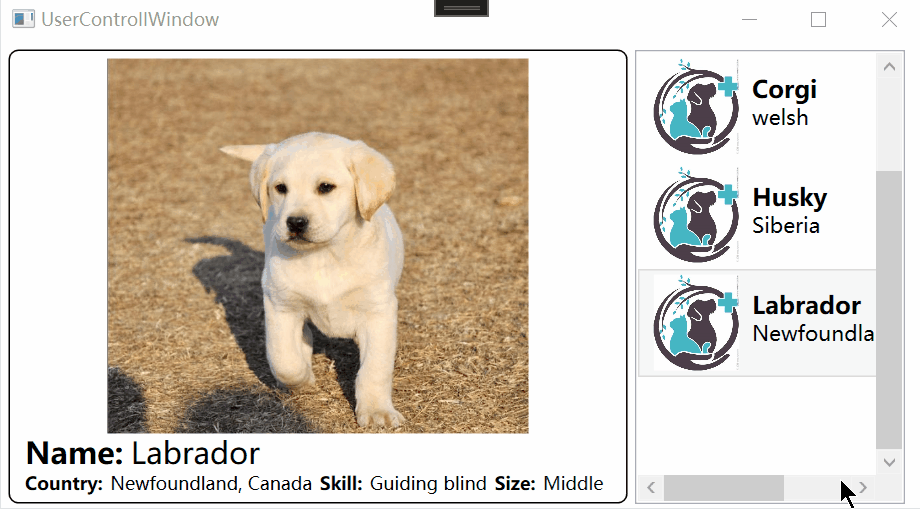
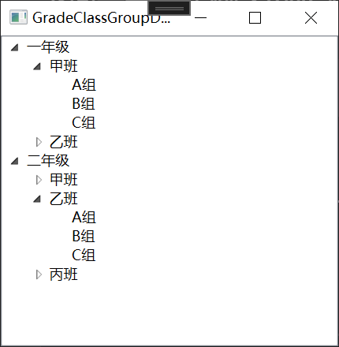
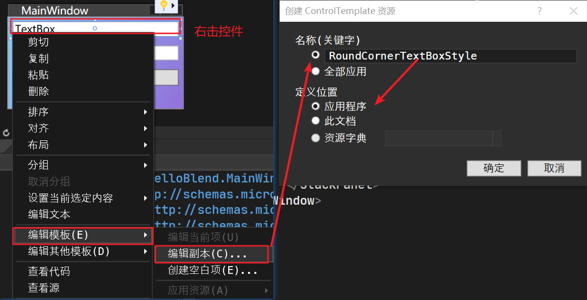
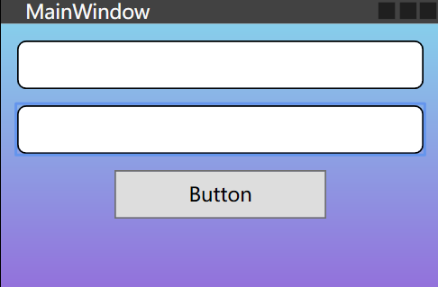
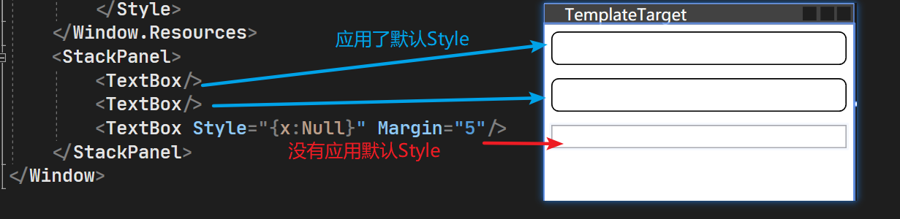
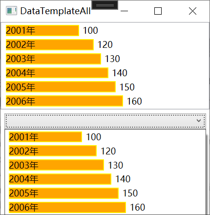
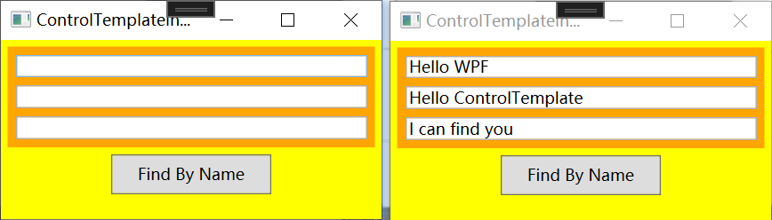
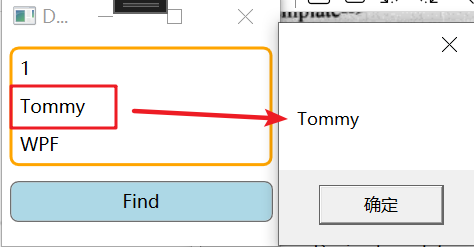
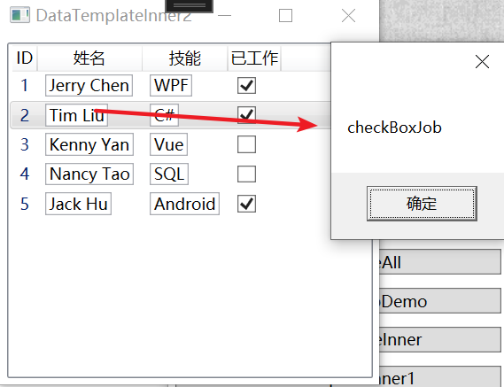

## 1、模板的内涵

Binding 和基于Binding的数据驱动界面是WPF的核心部分，WPF内部系统与程序内容(业务逻辑)的边界是Binding，Binding 把数据源源不断地从程序内部送出来、交由界面元素来显示，又把从界面元素收集来的数据传送回程序内部。界面元素间的沟通则依靠路由事件来完成，有时候路由事件和附加事件也会参与到数据的传输中。

让我们思考一个问题：WPF作为Windows程序的表示方式，它究竟在表示什么？换句话说，WPF作为一种“形式”，它要表现的“内容”究竟是什么？答案是：程序的数据和算法——Binding 传递的是数据，事件参数携带的也是数据；方法和委托的调用是算法，事件传递消息也是算法……数据在内存里就是一串串数字或字符，算法是一组组看不见摸不着的抽象逻辑，如何恰如其分地把它们展现给用户呢？——控件(Control)，是数据内容表现形式和算法内容表现形式的双重载体。换句话说，控件既是数据的表现形式让用户可以直观地看到数据，又是算法的表现形式让用户方便地操作逻辑。

作为“表现形式”，每个控件都是为了实现某种用户操作算法和直观显示某种数据而生，一个控件看上去是什么样子由它的“算法内容”和“数据内容”决定，这就是内容决定形式。这里，我们引入两个概念:

1. 控件的“算法内容”`ControlTemplate`：指控件能展示哪些数据、具有哪些方法、能响应哪些操作、能激发什么事件，简而言之就是控件的功能，它们是一组相关的算法逻辑。
2. 控件的“数据内容”`DataTemplate `：控件所展示的具体数据是什么。

以往的 GUI开发技术(如 WindowsForms和 ASP.NET)中，控件内部的逻辑和数据是固定的程序员不能改变；对于控件的外观，程序员能做的改变也非常有限，一般也就是设置控件的属性，想改变控件的内部结构是不可能的。如果想扩展一个控件的功能或者更改其外观让其更适应业务逻辑，哪怕只有一丁点改变，也经常需要创建控件的子类或者创建用户控件(UserControl)。造成这个局面的根本原因就是数据和算法的“形式”与“内容”耦合的太紧了。

在 WPF中，通过引入模板(Template)微软将数据和算法的“内容”与“形式”解耦了。WPF中的 Template 分为两大类：

- `ControlTemplate`是算法内容的表现形式，一个控件怎样组织其内部结构才能让它更符合业务逻辑、让用户操作起来更舒服就是由它来控制的。它决定了控件“长成什么样子”并让程序员有机会在控件原有的内部逻辑基础上扩展自己的逻辑。
- `DataTemplate `是数据内容的表现形式，一条数据显示成什么样子，是简单的文本还是直观的图形动画就由它来决定。

Template就是“外衣”——`ControlTemplate是控件的外衣，DataTemplate 是数据的外衣`

## 2、数据的外衣 DataTemplate(Content/Item/Cell Template)

一样的内容可以用不同的形式来展现，软件设计称之为“数据—视图”(Data-View)模式。以往的开发技术，如MFC、Windows Forms、ASP.NET等，视图要靠 UserControl来实现，WPF不但支持 UserControl 还支持用 DataTemplate 为数据形成视图。

DataTemplate常用的地方有3处，分别是:

- `ContentControl 的 ContentTemplate 属性`，相当于给 ContentControl 的内容穿衣服
- `ItemsControl 的 ItemTemplate 属性`，相当于给 ItemsControl 的数据条目穿衣服。
- `GridViewColumn 的 CellTemplate 属性`，相当于给 GridViewColumn 单元格里的数据穿衣服。

需要提一嘴：Template和ContentTemplate的区别：

- `ContentTemplate` 属性用于定义控件内部内容的外观，通常用于 `ContentControl` 或者类似的控件，用来定义控件内部显示的内容的外观。
- `Template` 属性用于定义控件的整体外观，包括控件的背景、边框、内容等。通常用于自定义控件的外观，或者对已有控件进行样式修改

ContentTemplate样例：

```html
<Window.Resources>
    <!--将DogDetailControl中代码拷过来作为dogDetailTemplate-->
    <DataTemplate x:Key="dogDetailTemplate">
        <Border BorderBrush="Black" BorderThickness="1" CornerRadius="6">
            <StackPanel Margin="5">
                <Image Source="{Binding Name,Converter={StaticResource nameCon}}" Width="400" Height="250"/>
                <StackPanel Orientation="Horizontal" Margin="5,0">
                    <TextBlock Text="Name:" FontWeight="Bold" FontSize="20"/>
                    <TextBlock Text="{Binding Name}" FontSize="20" Margin="5,0"/>
                </StackPanel>
                <StackPanel Orientation="Horizontal" Margin="5,0">
                    <TextBlock Text="Country:" FontWeight="Bold"/>
                    <TextBlock Text="{Binding Country}" Margin="5,0"/>
                    <TextBlock Text="Skill:" FontWeight="Bold"/>
                    <TextBlock Text="{Binding Skill}" Margin="5,0"/>
                    <TextBlock Text="Size:" FontWeight="Bold"/>
                    <TextBlock Text="{Binding Size}" Margin="5,0"/>
                </StackPanel>
            </StackPanel>
        </Border>
    </DataTemplate>
</Window.Resources>
<UserControl ContentTemplate="{StaticResource dogDetailTemplate}"
                     Content="{Binding SelectedItem,ElementName=listBoxDogs}"/>
```

Template样例

```html
<Window.Resources>
    <ControlTemplate x:Key="cTmp">
        <StackPanel Background="Orange">
            <TextBox x:Name="textBox1" Margin="6"/>
            <TextBox x:Name="textBox2" Margin="6,0"/>
            <TextBox x:Name="textBox3" Margin="6"/>
        </StackPanel>
    </ControlTemplate>
</Window.Resources>
<StackPanel Background="Yellow">
    <UserControl x:Name="uc" Template="{StaticResource ResourceKey=cTmp}" Margin="5"/>
    <Button Content="Find By Name" Width="120" Height="30" Click="Button_Click"/>
</StackPanel>
```


### 2.1 UserControl实现DataTemplate功能

让我们用一个例子对比 UserControl与DataTemplate的使用。例子实现的需求是这样的：

有一列狗狗的数据（犬种、发源地、技能、体型大小），这列数据显示在一个ListBox里，要求ListBox的条目只需要显示狗狗的简要参数（犬种、发源地），单击某个条目后在窗体的详细内容区域显示狗狗的照片和详细参数。效果如下：




首先添加要显示的图片资源：图片位置如下，注意在代码中要将图片属性中的生成操作设置为资源，否则无法显示图片（这里方便图片的显示，将实体的品种名设置为图片的名了）


设计要显示的Dog类：

```C#
namespace TemplateTest.Entity
{
    public class Dog
    {
        /// <summary>
        /// 品种名
        /// </summary>
        public string Name { get; set; }
        /// <summary>
        /// 来自哪个国家
        /// </summary>
        public string Country{ get; set; }
        /// <summary>
        /// 技能
        /// </summary>
        public string Skill { get; set; }
        /// <summary>
        /// 大型/中型/小型
        /// </summary>
        public string Size { get; set; }

        public Dog(string name, string country, string skill, string size)
        {
            Name = name;
            Country = country;
            Skill = skill;
            Size = size;
        }

        public Dog()
        {
        }
    }
}
```

设计一个UserControl（DogItemControl.xaml）作为列表：列表分为两部分，左边放狗狗的图片使用`Image`标签；右边放狗狗的简要信息如：品种、发源地，使用`StackPanel内部嵌套两个TextBlock`；左右两部分的布局可以使用`<StackPanel Orientation="Horizontal">`

```html
<UserControl x:Class="TemplateTest.DogItemControl"
             xmlns="http://schemas.microsoft.com/winfx/2006/xaml/presentation"
             xmlns:x="http://schemas.microsoft.com/winfx/2006/xaml"
             xmlns:mc="http://schemas.openxmlformats.org/markup-compatibility/2006"
             xmlns:d="http://schemas.microsoft.com/expression/blend/2008"
             xmlns:local="clr-namespace:TemplateTest"
             mc:Ignorable="d" >
    <Grid Margin="2">
        <StackPanel Orientation="Horizontal" x:Name="stackPanel1">
            <Image x:Name="imageLogo" Grid.RowSpan="3" Width="64" Height="64"/>
            <StackPanel Margin="5,10" x:Name="stackPanel2">
                <TextBlock x:Name="textBoxName" FontSize="16" FontWeight="Bold"/>
                <TextBlock x:Name="textBoxCountry" FontSize="14"/>
            </StackPanel>
        </StackPanel>
    </Grid>
</UserControl>
```

.cs文件：列表中的值是最后在主窗体中定义的，列表中每个Item（DogItemControl）就是整个DogItemControl中要显示的内容，所以要在cs文件中绑定控件的值：

```C#
namespace TemplateTest
{
    /// <summary>
    /// DogItemControl.xaml 的交互逻辑
    /// </summary>
    public partial class DogItemControl : UserControl
    {
        private Dog dog;
        public Dog DogItem 
        {
            
            get { return dog; }
            set
            {
                dog = value;
                this.textBoxName.Text = dog.Name;
                this.textBoxCountry.Text = dog.Country;
                string uriStr = $@"/Resources/Logos/Logo.jpg";
                this.imageLogo.Source = new BitmapImage(new Uri(uriStr, UriKind.Relative));
            }
        }
        public DogItemControl()
        {
            InitializeComponent();
        }
    }
}
```

设计一个UserControl（DogDetailControl.xaml）作为左半部分的详情：

详情使用垂直布局的 StackPanel，第一行显示图片；第二行显示犬种；第三行显示详细信息（发源地、技能、体型）

```html
<UserControl x:Class="TemplateTest.DogDetailControl"
             xmlns="http://schemas.microsoft.com/winfx/2006/xaml/presentation"
             xmlns:x="http://schemas.microsoft.com/winfx/2006/xaml"
             xmlns:mc="http://schemas.openxmlformats.org/markup-compatibility/2006"
             xmlns:d="http://schemas.microsoft.com/expression/blend/2008"
             xmlns:local="clr-namespace:TemplateTest"
             mc:Ignorable="d" >
    <Border BorderBrush="Black" BorderThickness="1" CornerRadius="6">
        <StackPanel Margin="5">
            <!--Source="Resources/Images/BorderCollie.jpg"-->
            <Image x:Name="imagePhoto" Width="400" Height="250"/>
            <StackPanel Orientation="Horizontal" Margin="5,0">
                <TextBlock Text="Name:" FontWeight="Bold" FontSize="20"/>
                <TextBlock x:Name="textBlockName" FontSize="20" Margin="5,0"/>
            </StackPanel>
            <StackPanel Orientation="Horizontal" Margin="5,0">
                <TextBlock Text="Country:" FontWeight="Bold"/>
                <TextBlock x:Name="textBlockCountry" Margin="5,0"/>
                <TextBlock Text="Skill:" FontWeight="Bold"/>
                <TextBlock x:Name="textBlockSkill" Margin="5,0"/>
                <TextBlock Text="Size:" FontWeight="Bold"/>
                <TextBlock x:Name="textBlockSize" Margin="5,0"/>
            </StackPanel>
        </StackPanel>
    </Border>
</UserControl>
```

在.cs文件中绑定控件的值

```C#
namespace TemplateTest
{
    /// <summary>
    /// DogDetailControl.xaml 的交互逻辑
    /// </summary>
    public partial class DogDetailControl : UserControl
    {
        private Dog dog;
        public Dog DogDetail
        {
            get { return dog; }
            set
            {
                dog = value;
                this.textBlockName.Text = dog.Name;
                this.textBlockCountry.Text = dog.Country;
                this.textBlockSkill.Text = dog.Skill;
                this.textBlockSize.Text = dog.Size;
                string uriStr = $@"Resources/Images/{dog.Name}.jpg";
                this.imagePhoto.Source = new BitmapImage(new Uri(uriStr, UriKind.Relative));
                //new BitmapImage(new Uri(@"Resources/bears.jpg", UriKind.Relative));
            }
        }
        public DogDetailControl()
        {
            InitializeComponent();
        }
    }
}
```

最后在窗体中使用刚定义详情控件：，当ListBox触发选框变化事件时要更新DogDetailControl的数据源

```html
<Window x:Class="TemplateTest.UserControllWindow"
        xmlns="http://schemas.microsoft.com/winfx/2006/xaml/presentation"
        xmlns:x="http://schemas.microsoft.com/winfx/2006/xaml"
        xmlns:d="http://schemas.microsoft.com/expression/blend/2008"
        xmlns:mc="http://schemas.openxmlformats.org/markup-compatibility/2006"
        xmlns:local="clr-namespace:TemplateTest"
        mc:Ignorable="d"
        Title="UserControllWindow" Height="350" Width="630">
    <StackPanel Orientation="Horizontal" Margin="5">
        <local:DogDetailControl x:Name="detailView"/>
        <ListBox x:Name="listBoxDogs" Width="180" Margin="5,0"
                 SelectionChanged="listBoxDogs_SelectionChanged"/>
    </StackPanel>
</Window>
```

.cs

```C#
namespace TemplateTest
{
    /// <summary>
    /// UserControllWindow.xaml 的交互逻辑
    /// </summary>
    public partial class UserControllWindow : Window
    {
        public UserControllWindow()
        {
            InitializeComponent();
            InitialDogList(); //初始化列表
        }
        private void InitialDogList()
        {
            List<Dog> dogs = new List<Dog>() //设置四个狗狗实体，Name与照片名相同
            {
                new Dog("BorderCollie","England","shepherd","Middle"),
                new Dog("Corgi","welsh","shepherd","Small"),
                new Dog("Husky","Siberia","sledding","Middle"),
                new Dog("Labrador","Newfoundland, Canada","Guiding blind","Middle"),
            };

            foreach(Dog dog in dogs) //初始化列表，将每个狗狗实体作为DogItemControl视图添加到this.listBoxDogs.Items
            {
                DogItemControl view = new DogItemControl();
                view.DogItem = dog;
                this.listBoxDogs.Items.Add(view);
            }
        }
        //选项变化事件处理器
        private void listBoxDogs_SelectionChanged(object sender, SelectionChangedEventArgs e)
        {
            DogItemControl view = e.AddedItems[0] as DogItemControl;
            if(view != null) 
            {
                this.detailView.DogDetail = view.DogItem;
            }
        }
    }
}
```

很难说这样做是错的，但在 WPF 里如此实现需求真是浪费了数据驱动界面这一重要功能。我们常说的“把 WPF当作 Windows Forms来用”指的就是这种实现方法。这种方法对 WPF 最大的曲解在于没有借助 Binding实现数据驱动界面，并且认为 ListBox.Items属性里放置的是控件——这种曲解迫使数据在界面元素间交换并且程序员只能使用事件驱动方式来实现逻辑——程序员必须借助处理ListBox的SelectionChanged事件来推动 DetailView 来显示数据，而数据又是由DogDetailControl控件转交给 DetailView控件的,之间还做了一次类型转换。

显然，事件驱动是控件和控件之间的沟通，数据驱动则是数据与控件之间的沟通，是内容决定形式。使用 DataTemplate 就可以很方便地把事件驱动模式升级为数据驱动模式。90%的代码可以原样拷贝，另10%可以放心删除，再做一点点改动就可以了。

### 2.2 ContentTemplate/ItemTemplate=DataTemplate实现相同功能

有些属性的值不能直接拿来用，比如汽车的厂商和名称不能直接拿来作为图片的路径，这时就要使用Converter。有两种办法可以在XAML代码中使用Converter：

- 把Converter以资源的形式放在资源词典里(本例使用的方法)。
- 为Converter 准备一个静态属性，形成单件模式，在XAML代码里使用{x:Static)标签扩展来访问。

这里在Entity文件夹下新建一个类专门用于Name到图片路径的转换

```C#
namespace TemplateTest.Entity
{
    //狗狗品种名到图片地址的转换
    public class NamePathConventor : IValueConverter
    {
        public object Convert(object value, Type targetType, object parameter, CultureInfo culture)
        {
            string uriStr = $@"Resources/Images/{(string)value}.jpg";
            return new BitmapImage(new Uri(uriStr, UriKind.Relative));
            //throw new NotImplementedException();
        }
        //反向转换（暂未用到）
        public object ConvertBack(object value, Type targetType, object parameter, CultureInfo culture)
        {
            throw new NotImplementedException();
        }
    }
}
```

让我们开始吧！首先把两个 UserControl 的“芯”剪切出来，用<DataTemplate>标签包装，再放进主窗体的资源词典里。最重要的一点是为 DataTemplate 里的每个控件设置 Binding，告诉各个控件应该关注数据的哪个属性。因为使用 Binding 在控件与数据间建立关联，免去了在C#代码中访问界面元素，所以 XAML 代码中的大多数 x:Name 都可以去掉，代码看上去地简洁不少。

```html
<Window x:Class="TemplateTest.TemplateWindow"
        xmlns="http://schemas.microsoft.com/winfx/2006/xaml/presentation"
        xmlns:x="http://schemas.microsoft.com/winfx/2006/xaml"
        xmlns:d="http://schemas.microsoft.com/expression/blend/2008"
        xmlns:mc="http://schemas.openxmlformats.org/markup-compatibility/2006"
        xmlns:local="clr-namespace:TemplateTest"
        xmlns:entity="clr-namespace:TemplateTest.Entity"
        mc:Ignorable="d"
        Title="TemplateWindow" Height="350" Width="630">
    <Window.Resources>
        <!--资源中添加图片转化器-->
        <!--<entity:LogoPathConventer x:Key="logoCon"/>-->
        <entity:NamePathConventor x:Key="nameCon"/>
        <!--将DogItemControl中代码拷过来作为dogDetailTemplate，x:Name去掉改为Binding-->
        <DataTemplate x:Key="dogItemTemplate">
            <Grid Margin="2">
                <StackPanel Orientation="Horizontal">
                    <Image Source="/Resources/Logos/Logo.jpg" Grid.RowSpan="3" Width="64" Height="64"/>
                    <StackPanel Margin="5,10">
                        <TextBlock Text="{Binding Name}" FontSize="16" FontWeight="Bold"/>
                        <TextBlock Text="{Binding Country}" FontSize="14"/>
                    </StackPanel>
                </StackPanel>
            </Grid>
        </DataTemplate>
        <!--将DogDetailControl中代码拷过来作为dogDetailTemplate-->
        <DataTemplate x:Key="dogDetailTemplate">
            <Border BorderBrush="Black" BorderThickness="1" CornerRadius="6">
                <StackPanel Margin="5">
                    <Image Source="{Binding Name,Converter={StaticResource nameCon}}" Width="400" Height="250"/>
                    <StackPanel Orientation="Horizontal" Margin="5,0">
                        <TextBlock Text="Name:" FontWeight="Bold" FontSize="20"/>
                        <TextBlock Text="{Binding Name}" FontSize="20" Margin="5,0"/>
                    </StackPanel>
                    <StackPanel Orientation="Horizontal" Margin="5,0">
                        <TextBlock Text="Country:" FontWeight="Bold"/>
                        <TextBlock Text="{Binding Country}" Margin="5,0"/>
                        <TextBlock Text="Skill:" FontWeight="Bold"/>
                        <TextBlock Text="{Binding Skill}" Margin="5,0"/>
                        <TextBlock Text="Size:" FontWeight="Bold"/>
                        <TextBlock Text="{Binding Size}" Margin="5,0"/>
                    </StackPanel>
                </StackPanel>
            </Border>
        </DataTemplate>
    </Window.Resources>
    <!--窗体内容-->
    <StackPanel Orientation="Horizontal" Margin="5">
        <!--<local:DogDetailControl x:Name="detailView"/>-->
        <UserControl ContentTemplate="{StaticResource dogDetailTemplate}"
                     Content="{Binding SelectedItem,ElementName=listBoxDogs}"/>
        <!--SelectionChanged改为 ItemTemplate -->
        <ListBox x:Name="listBoxDogs" Width="180" Margin="5,0"
                 ItemTemplate="{StaticResource dogItemTemplate}"/>
    </StackPanel>
</Window>
```

.cs文件中填充数据源

```C#
namespace TemplateTest
{
    /// <summary>
    /// TemplateWindow.xaml 的交互逻辑
    /// </summary>
    public partial class TemplateWindow : Window
    {
        public TemplateWindow()
        {
            InitializeComponent();
            InitialGogList();
        }
        private void InitialGogList()
        {
            List<Dog> dogs = new List<Dog>()
            {
                new Dog("BorderCollie","England","shepherd","Middle"),
                new Dog("Corgi","welsh","shepherd","Small"),
                new Dog("Husky","Siberia","sledding","Middle"),
                new Dog("Labrador","Newfoundland, Canada","Guiding blind","Middle"),
            };
            //填充数据源
            this.listBoxDogs.ItemsSource = dogs;
        }
    }
}
```

### 2.3、ItemControl的ItemTemplate

`ItemTemplate` 是 `ItemsControl` 类的属性，它定义了每个数据项的数据模板，用于指定数据项如何在控件中显示。下面是一个树形结构的Demo展示了ItemTemplate的用法

`HierarchicalDataTemplate` 是 WPF 中用于在树状结构控件（例如 TreeView）中定义数据项的数据模板。它允许你定义一个数据模板，用于显示每个数据项及其子项的外观和布局。

```html
<Window x:Class="HelloBlend.GradeClassGroupDemo"
        xmlns="http://schemas.microsoft.com/winfx/2006/xaml/presentation"
        xmlns:x="http://schemas.microsoft.com/winfx/2006/xaml"
        xmlns:d="http://schemas.microsoft.com/expression/blend/2008"
        xmlns:mc="http://schemas.openxmlformats.org/markup-compatibility/2006"
        xmlns:local="clr-namespace:HelloBlend"
        xmlns:entity="clr-namespace:HelloBlend.Entity"
        mc:Ignorable="d"
        Title="GradeClassGroupDemo" Height="300" Width="300">
    <Grid>
        <TreeView x:Name="treeView" >
            <!--定义TreeView的数据模板-->
            <TreeView.ItemTemplate>
                <!--1层：显示GradeName，其子项是Classes-->
                <HierarchicalDataTemplate ItemsSource="{Binding Classes}">
                    <TextBlock Text="{Binding GradeName}"/>
                    <!--定义1层子项的数据模板 班级层次的样式-->
                    <HierarchicalDataTemplate.ItemTemplate>
                        <!--2层：显示ClassName，其子项是Groups-->
                        <HierarchicalDataTemplate ItemsSource="{Binding Groups}">
                            <TextBlock Text="{Binding ClassName}"/>
                            <!--定义2层子项的数据模板 小组层次的样式-->
                            <HierarchicalDataTemplate.ItemTemplate>
                                <DataTemplate>
                                    <!--3层：显示GroupName-->
                                    <TextBlock Text="{Binding GroupName}"/>
                                </DataTemplate>
                            </HierarchicalDataTemplate.ItemTemplate>
                        </HierarchicalDataTemplate>
                    </HierarchicalDataTemplate.ItemTemplate>
                </HierarchicalDataTemplate>
            </TreeView.ItemTemplate>
        </TreeView>
    </Grid>
</Window>
```

.cs中构造数据源

```C#
namespace HelloBlend
{
    /// <summary>
    /// GradeClassGroupDemo.xaml 的交互逻辑
    /// </summary>
    public partial class GradeClassGroupDemo : Window
    {
        public GradeClassGroupDemo()
        {
            InitializeComponent();
            //添加小组
            List<MyGroup> groups = new List<MyGroup>()
            {
                new MyGroup() {GroupName="A组"},
                new MyGroup() {GroupName="B组"},
                new MyGroup() {GroupName="C组"},
            };
            //添加年级
            List<Grade> list = new List<Grade>()
            {
                new Grade(){GradeName="一年级",
                            Classes= new List<MyClass>()
                                    {
                                        new MyClass(){ClassName="甲班",Groups=groups},
                                        new MyClass(){ClassName="乙班",Groups=groups}
                                    },
                            },
                 new Grade(){GradeName="二年级",
                             Classes= new List<MyClass>()
                                    {
                                        new MyClass(){ClassName="甲班",Groups=groups},
                                        new MyClass(){ClassName="乙班",Groups=groups},
                                        new MyClass(){ClassName="丙班",Groups=groups},
                                    },
                             }
            };
            //年级数据绑定到treeView的ItemsSource属性
            this.treeView.ItemsSource = list;
        }
    }
}
```

效果：



## 3、控件的外衣 ControlTemplate

控件也有自己的行为，比如显示数据、执行方法、激发事件等。控件的行为要靠编程逻辑来实现，所以也可把控件的行为称为控件的算法内容。举个例子：WPF中的 CheckBox与其基类ToggleButton在功能上几乎完全一样，但外观上区别却非常大，这就是更换ControlTemplate 的结果。经过更换ControlTemplate，我们不但可以制作出披着CheckBox外衣的ToggleButton，还能制作出披着温度计外衣的ProgressBar 控件。

### 3.1、庖丁解牛看控件

想知道一个控件的内部结构就必须把控件“打碎”了看一看。用于打碎控件、查看内部结构的工具就是Microsoft Expression套装中的 Blend。对于程序员来说，完全可以把 Blend 理解为一个功能更强大的窗体设计器，而对于设计师来说，可以把 Blend 理解为会写XAML代码的 Photoshop或Fireworks。

首先看下TextBox和Button的内部结构，设计如下的xmal代码，并用Blend打开

```html
<Window x:Class="HelloBlend.MainWindow"
        xmlns="http://schemas.microsoft.com/winfx/2006/xaml/presentation"
        xmlns:x="http://schemas.microsoft.com/winfx/2006/xaml"
        xmlns:d="http://schemas.microsoft.com/expression/blend/2008"
        xmlns:mc="http://schemas.openxmlformats.org/markup-compatibility/2006"
        xmlns:local="clr-namespace:HelloBlend"
        mc:Ignorable="d"
        Title="MainWindow" Height="180" Width="270">
    <StackPanel>
        <!--设置渐变色背景-->
        <StackPanel.Background>
            <!--不填则默认StartPoint="0,0" EndPoint="1,1"-->
            <LinearGradientBrush StartPoint="0.5,0" EndPoint="0.5,1">
                <!--不填则默认Offset="0"-->
                <GradientStop Color="SkyBlue"/>
                <GradientStop Color="MediumPurple" Offset="1"/>
            </LinearGradientBrush>
        </StackPanel.Background>
        <TextBox Margin="10" Height="30" BorderBrush="Black"/>
        <TextBox Margin="10,0" Height="30" BorderBrush="Black"/>
        <Button Width="130" Height="30" Content="Button" Margin="10"/>
    </StackPanel>
</Window>
```



找到border的代码如下：

```html
<Setter Property="Template">
    <Setter.Value>
        <ControlTemplate TargetType="{x:Type TextBox}">
            <Border x:Name="border" Background="{TemplateBinding Background}" BorderBrush="{TemplateBinding BorderBrush}"
                    BorderThickness="{TemplateBinding BorderThickness}" SnapsToDevicePixels="True"
                    CornerRadius="5">
                <ScrollViewer x:Name="PART_ContentHost" Focusable="false" HorizontalScrollBarVisibility="Hidden" VerticalScrollBarVisibility="Hidden"/>
            </Border>
            <ControlTemplate.Triggers>
                <Trigger Property="IsEnabled" Value="false">
                    <Setter Property="Opacity" TargetName="border" Value="0.56"/>
                </Trigger>
                <Trigger Property="IsMouseOver" Value="true">
                    <Setter Property="BorderBrush" TargetName="border" Value="{StaticResource TextBox.MouseOver.Border}"/>
                </Trigger>
                <Trigger Property="IsKeyboardFocused" Value="true">
                    <Setter Property="BorderBrush" TargetName="border" Value="{StaticResource TextBox.Focus.Border}"/>
                </Trigger>
            </ControlTemplate.Triggers>
        </ControlTemplate>
    </Setter.Value>
</Setter>
```

添加` CornerRadius="5"`

```html
<Border x:Name="border" Background="{TemplateBinding Background}" BorderBrush="{TemplateBinding BorderBrush}"
        BorderThickness="{TemplateBinding BorderThickness}" SnapsToDevicePixels="True"
        CornerRadius="5">
    <ScrollViewer x:Name="PART_ContentHost" Focusable="false" HorizontalScrollBarVisibility="Hidden" VerticalScrollBarVisibility="Hidden"/>
</Border>
```

将刚才修改的RoundCornerTextBoxStyle应用到两个TextBox上

```html
<TextBox Style="{DynamicResource RoundCornerTextBoxStyle}" Margin="10" Height="30"
                 BorderBrush="Black"/>
<TextBox Style="{DynamicResource RoundCornerTextBoxStyle}" Margin="10,0" Height="30"
                 BorderBrush="Black"/>
```

效果：



不知大家意识到没有，其实每个控件本身就是一棵UI 元素树。WPF的UI元素可以看作两棵树——LogicalTree 和 VisualTree，这两棵树的交点就是 ControlTemplate。如果把界面上的控件元素看作是一个结点，那元素们构成的就是LogicalTree，如果把控件内部由ControlTemplate 生成的控件也算上，那构成的就是VisualTree。换句话说，在LogicalTree上导航不会进入到控件内部，而在VisualTree 上导航则可检索到控件内部由 ControlTemplate 生成的子级控件。

### 3.2、ItemControl的PanelTemplate

ListBox默认是垂直排列的结构

```html
<Grid Margin="6">
    <ListBox>
        <TextBlock Text="Tim"/>
        <TextBlock Text="Tom"/>
        <TextBlock Text="Jerry"/>
        <TextBlock Text="Nancy"/>
    </ListBox>
</Grid>
```

但是修改ListBox.ItemsPanel属性值，将条目包装(ItemsPanelTemplate)在水平排列的 StackPanel中就实现ListBox的水平排列

```html
<Grid Margin="6">
    <ListBox>
        <ListBox.ItemsPanel>
            <ItemsPanelTemplate>
                <StackPanel Orientation="Horizontal"/>
            </ItemsPanelTemplate>
        </ListBox.ItemsPanel>
        <TextBlock Text="Tim"/>
        <TextBlock Text="Tom"/>
        <TextBlock Text="Jerry"/>
        <TextBlock Text="Nancy"/>
    </ListBox>
</Grid>
```


## 4、DataTemplate与ControlTemplate的关系与应用

### 4.1、DataTemplate与ControlTemplate的关系

学习过 DataTemplate 和 ControlTemplate，你应该已经体会到，控件只是个数据和行为的载体、是个抽象的概念，至于它本身会长成什么样子(控件内部结构)、它的数据会长成什么样子(数据显示结构)都是靠Template生成的。`决定控件外观的是ControlTemplate，决定数据外观的是DataTemplate`，它们正是Control类的Template和 ContentTemplate 两个属性的值。

DataTemplate给人的感觉的确是施加在了数据对象上，但施加在数据对象上生成的一组控件总得有个载体吧？这个载体一般是落实在一个ContentPresenter对象上。ContentPresenter 类只有ContentTemplate属性、没有 Template属性，这就证明了承载由 DataTemplate 生成的一组控件是它的专门用途。

至此我们可以看出，由ControlTemplate 生成的控件树其树根就是 ControlTemplate 的目标控件，此模板化控件的 Template 属性值就是这个 ControlTemplate 实例;与之相仿，由DataTemplate 生成的控件树其树根是一个 ContentPresenter 控件，此模板化控件的ContentTemplate 属性值就是这个DataTemplate实例。因为ContentPresenter控件是 ControlTemplate 控件树上的一个结点，所以DataTemplate 控件树是 ControlTemplate 控件树的一棵子树。

既然 Template 生成的控件树都有根，那么如何找到树根呢？办法非常简单，每个控件都有个名为 TemplatedParent 的属性，如果它的值不为null，说明这个控件是由 Template 自动生成的，而属性值就是应用了模板的控件(模板的目标，模板化控件)。如果由Template生成的控件使用了TemplateBinding 获取属性值，则 TemplateBinding 的数据源就是应用了这个模板的目标控件。

### 4.2、DataTemplate与ControlTemplate的应用

为 Template 设置其应用目标有两种方法：

- 一种是逐个设置控件的Template、ContentTemplate、ItemsTemplate、CellTemplate 等属性，不想应用 Template 的控件不设置;
- 另一种是整体应用，即把Template 应用在某个类型的控件或数据上。

把 ControlTemplate 应用在所有目标上需要借助 Style 来实现，但 Style 不能标记 x:Key，例如下面的代码：

```html
<Window x:Class="HelloBlend.TemplateTarget"
        xmlns="http://schemas.microsoft.com/winfx/2006/xaml/presentation"
        xmlns:x="http://schemas.microsoft.com/winfx/2006/xaml"
        xmlns:d="http://schemas.microsoft.com/expression/blend/2008"
        xmlns:mc="http://schemas.openxmlformats.org/markup-compatibility/2006"
        xmlns:local="clr-namespace:HelloBlend"
        mc:Ignorable="d"
        Title="TemplateTarget" Height="150" Width="230">
    <Window.Resources>
        <!--样式适用于所有的 TextBox 控件-->
        <Style TargetType="{x:Type TextBox}">
            <!--设置TextBox控件的Template属性(定义了 TextBox 控件的外观)-->
            <Setter Property="Template">
                <Setter.Value>
                    <!--定义了 TextBox 控件的外观模板-->
                    <ControlTemplate TargetType="{x:Type TextBox}">
                        <Border x:Name="border" Background="{TemplateBinding Background}"
                                BorderBrush="{TemplateBinding BorderBrush}"
                                BorderThickness="{TemplateBinding BorderThickness}"
                                SnapsToDevicePixels="True"
                                CornerRadius="5">
                            <ScrollViewer x:Name="PART_ContentHost" Focusable="false" HorizontalScrollBarVisibility="Hidden" VerticalScrollBarVisibility="Hidden"/>
                        </Border>
                    </ControlTemplate>
                </Setter.Value>
            </Setter>
            <Setter Property="Margin" Value="5"/>
            <Setter Property="BorderBrush" Value="Black"/>
            <Setter Property="Height" Value="25"/>
        </Style>
    </Window.Resources>
    <StackPanel>
        <TextBox/>
        <TextBox/>
        <TextBox Style="{x:Null}" Margin="5"/>
    </StackPanel>
</Window>
```



把 ControlTemplate 应用在所有目标上需要借助 Style 来实现，但 Style 不能标记 x:Key，例如下面的代码：实现水平柱状图效果，每行由一个方形+年份+数值组成

设计显示的数据样式：

```C#
namespace HelloBlend.Entity
{
    public class Unit
    {
        public int Price { get; set; }
        public string Year { get; set; }
    }
}
```

```html
<Window x:Class="HelloBlend.DataTemplateAll"
        xmlns="http://schemas.microsoft.com/winfx/2006/xaml/presentation"
        xmlns:x="http://schemas.microsoft.com/winfx/2006/xaml"
        xmlns:d="http://schemas.microsoft.com/expression/blend/2008"
        xmlns:mc="http://schemas.openxmlformats.org/markup-compatibility/2006"
        xmlns:local="clr-namespace:HelloBlend"
        xmlns:entity="clr-namespace:HelloBlend.Entity"
        xmlns:c="clr-namespace:System.Collections;assembly=mscorlib"
        mc:Ignorable="d"
        Title="DataTemplateAll" Height="300" Width="300">
    <Window.Resources>
        <!--设计DataTemplate-->
        <DataTemplate DataType="{x:Type entity:Unit}">
            <Grid>
                <!--水平排列的方形+数值-->
                <StackPanel Orientation="Horizontal">
                    <Grid>
                        <Rectangle Stroke="Yellow" Fill="Orange" Width="{Binding Price}"/>
                        <TextBlock Text="{Binding Year}"/>
                    </Grid>
                    <TextBlock Text="{Binding Price}" Margin="5,0"/>
                </StackPanel>
            </Grid>
        </DataTemplate>
        <!--数据源-->
        <c:ArrayList x:Key="ds">
            <entity:Unit Year="2001年" Price="100"/>
            <entity:Unit Year="2002年" Price="120"/>
            <entity:Unit Year="2003年" Price="130"/>
            <entity:Unit Year="2004年" Price="140"/>
            <entity:Unit Year="2005年" Price="150"/>
            <entity:Unit Year="2006年" Price="160"/>
        </c:ArrayList>
    </Window.Resources>
    <StackPanel>
        <ListBox ItemsSource="{StaticResource ds}"/>
        <ComboBox ItemsSource="{StaticResource ds}" Margin="5"/>
    </StackPanel>
</Window>
```

效果：



此时 DataTemplate 会自动加载到所有 Unit 类型对象上，尽管我并没有为ListBox和ComboBox指定 ItemsTemplate。

### 4.3、寻找失落的控件

“井水不犯河水”常用来形容两个组织之间界限分明、互不相干，LogicalTree 与控件内部这棵小树之间就保持着这样的关系。换句话说，如果 U元素树上有个 x:Name="TextBox1"的控件，某个控件内部也有一个由 Template 生成的 x:Name="TextBox1"的控件，它们并不冲突，LogicalTree不会看到控件内部的细节，控件内部元素也不去理会控件外面有什么。你可能会想:“这样一来,万一我想从外界访问 Template 内部的控件、获取它的属性值，岂不是做不到了?”放心，WPF 为我们准备了访问控件内部小世界的入口，现在就让我们出发去寻找那些失落的控件！

由ControlTemplate 或 DataTemplate 生成的控件都是“由Template 生成的控件”。ControlTemplate和 DataTemplate 两个类均派生自FrameworkTemplate 类，这个类有个名为 FindName 的方法供我们检索其内部控件。对于ControlTemplate 对象，访问其目标控件的 Template 属性就能拿到，但想拿到 DataTemplate 对象就要费一番周折了。千万不要以为ListBoxItem或者ComboBoxltem 容器就是 DataTemplate 的目标控件哦!因为控件的Template属性和ContentTemplate 属性可是两码事(`Template` 属性用于定义控件的整体外观，而 `ContentTemplate` 属性用于定义控件内部内容的外观。它们可以根据需要分别使用，以实现对控件外观的灵活定义和定制)。


#### 4.3.1、寻找ControlTemplate生成的控件

我们先来寻找由 ControlTemplate生成的控件。首先设计一个 ControlTemplate 并把它应用在一个UserControl上。界面上还有一个 Button，在它的 Click 事件处理器中我们检索由 ControlTemplate生成的代码。

```html
<Window x:Class="HelloBlend.ControlTemplateInner"
        xmlns="http://schemas.microsoft.com/winfx/2006/xaml/presentation"
        xmlns:x="http://schemas.microsoft.com/winfx/2006/xaml"
        xmlns:d="http://schemas.microsoft.com/expression/blend/2008"
        xmlns:mc="http://schemas.openxmlformats.org/markup-compatibility/2006"
        xmlns:local="clr-namespace:HelloBlend"
        mc:Ignorable="d"
        Title="ControlTemplateInner" Height="172" Width="300">
    <Window.Resources>
        <ControlTemplate x:Key="cTmp">
            <StackPanel Background="Orange">
                <TextBox x:Name="textBox1" Margin="6"/>
                <TextBox x:Name="textBox2" Margin="6,0"/>
                <TextBox x:Name="textBox3" Margin="6"/>
            </StackPanel>
        </ControlTemplate>
    </Window.Resources>
    <StackPanel Background="Yellow">
        <UserControl x:Name="uc" Template="{StaticResource ResourceKey=cTmp}" Margin="5"/>
        <Button Content="Find By Name" Width="120" Height="30" Click="Button_Click"/>
    </StackPanel>
</Window>
```

.cs文件

```C#
namespace HelloBlend
{
    /// <summary>
    /// C哦那天投了_.xaml 的交互逻辑
    /// </summary>
    public partial class ControlTemplateInner : Window
    {
        public ControlTemplateInner()
        {
            InitializeComponent();
        }

        private void Button_Click(object sender, RoutedEventArgs e)
        {
            //找到userControl模板中的textBox1
            TextBox textBox = this.uc.Template.FindName("textBox1",this.uc) as TextBox;
            //将其显示值赋值为"Hello WPF"
            textBox.Text = "Hello WPF";
            //找到textBox1的父级 panel
            StackPanel panel = textBox.Parent as StackPanel;
            (panel.Children[1] as TextBox).Text = "Hello ControlTemplate";
            (panel.Children[2] as TextBox).Text = "I can find you";
        }
    }
}
```

效果：



下面是又一个样例：展示了什么时候使用FindName寻找生成控件属性，什么时候直接使用底层数据

```html
<Window x:Class="HelloBlend.DataTemplateInner1"
        xmlns="http://schemas.microsoft.com/winfx/2006/xaml/presentation"
        xmlns:x="http://schemas.microsoft.com/winfx/2006/xaml"
        xmlns:d="http://schemas.microsoft.com/expression/blend/2008"
        xmlns:mc="http://schemas.openxmlformats.org/markup-compatibility/2006"
        xmlns:local="clr-namespace:HelloBlend"
        xmlns:entity="clr-namespace:HelloBlend.Entity"
        mc:Ignorable="d"
        Title="DataTemplateInner1" Height="175" Width="200">
    <Window.Resources>
        <!--定义一个Student数据对象stu-->
        <entity:Student x:Key="stu1" Id="1" Name="Tommy" Skill="WPF" HasJob="True"/>
        <!--定义数据显示样式-->
        <DataTemplate x:Key="stuDT">
            <Border BorderBrush="Orange" BorderThickness="2" CornerRadius="5">
                <StackPanel>
                    <TextBlock Text="{Binding Id}" Margin="5"/>
                    <TextBlock x:Name="textBlockName" Text="{Binding Name}" Margin="5"/>
                    <TextBlock Text="{Binding Skill}" Margin="5"/>
                </StackPanel>
            </Border>
        </DataTemplate>
        <!-- 创建一个按钮样式 -->
        <Style TargetType="Button" x:Key="MyButtonStyle">
            <!-- 定义 ControlTemplate -->
            <Setter Property="Template">
                <Setter.Value>
                    <ControlTemplate TargetType="Button">
                        <Border Background="LightBlue" CornerRadius="5"
                                BorderBrush="{TemplateBinding BorderBrush}"
                                BorderThickness="{TemplateBinding BorderThickness}"
                                SnapsToDevicePixels="True">
                            <!-- 在模板中呈现按钮的内容，不添加的话会导致按钮无法显示Content -->
                            <ContentPresenter Margin="5" HorizontalAlignment="Center"/>
                        </Border>
                    </ControlTemplate>
                </Setter.Value>
            </Setter>
        </Style>
    </Window.Resources>
    <StackPanel>
        <!--ContentPresenter的内容模板为全新定义的模板样式stuDT，显示数据为stu1-->
        <ContentPresenter x:Name="cp" Content="{StaticResource stu1}"
                          ContentTemplate="{StaticResource stuDT}" Margin="5"/>
        <!--使用自定义的按钮样式-->
        <Button Style="{DynamicResource MyButtonStyle}" Content="Find" Margin="5" Click="Button_Click" />
    </StackPanel>
</Window>
```

```C#
namespace HelloBlend
{
    /// <summary>
    /// DataTemplateInner1.xaml 的交互逻辑
    /// </summary>
    public partial class DataTemplateInner1 : Window
    {
        public DataTemplateInner1()
        {
            InitializeComponent();
        }

        private void Button_Click(object sender, RoutedEventArgs e)
        {
            //如果想获取控件的长度、宽度等与业务无关的纯UI属性，使用如下方式
            TextBlock tb = this.cp.ContentTemplate.FindName("textBlockName",this.cp) as TextBlock;
            MessageBox.Show(tb.Text);
            //如果想获取Student的某个属性值，使用如下方式
            Student stu = this.cp.Content as Student;
            MessageBox.Show(stu.Name);
        }
    }
}
```

效果：



#### 4.3.2、寻找DataTemplate生成的控件

下面再来看一个复杂的例子。DataTemplate 的一个常用之处是 GridViewColumn 的 CellTemplate属性。把 GridViewColumn 放置在 GridView 控件里就可以生成表格了。GridViewColumn 的默认CellTemplate是使用TextBlock只读性地显示数据，如果我们想让用户能修改数据或者使用CheckBox显示bool类型数据的话就需要自定义DataTemplate。

```html
<Window x:Class="HelloBlend.DataTemplateInner2"
        xmlns="http://schemas.microsoft.com/winfx/2006/xaml/presentation"
        xmlns:x="http://schemas.microsoft.com/winfx/2006/xaml"
        xmlns:d="http://schemas.microsoft.com/expression/blend/2008"
        xmlns:mc="http://schemas.openxmlformats.org/markup-compatibility/2006"
        xmlns:local="clr-namespace:HelloBlend"
        xmlns:c="clr-namespace:System.Collections;assembly=mscorlib"
        xmlns:entity="clr-namespace:HelloBlend.Entity"
        mc:Ignorable="d"
        Title="DataTemplateInner2" Height="300" Width="300">
    <Window.Resources>
        <!--数据列表-->
        <c:ArrayList x:Key="stuList">
            <entity:Student Id="1" Name="Jerry Chen" Skill="WPF" HasJob="True"/>
            <entity:Student Id="2" Name="Tim Liu" Skill="C#" HasJob="True"/>
            <entity:Student Id="3" Name="Kenny Yan" Skill="Vue" HasJob="False"/>
            <entity:Student Id="4" Name="Nancy Tao" Skill="SQL" HasJob="False"/>
            <entity:Student Id="5" Name="Jack Hu" Skill="Android" HasJob="True"/>
        </c:ArrayList>
        <!--数据模板-->
        <DataTemplate x:Key="nameDT">
            <TextBox x:Name="textBoxName" Text="{Binding Name}" GotFocus="textBoxName_GotFocus"/>
        </DataTemplate>
        <DataTemplate x:Key="skillDT">
            <TextBox x:Name="textBoxSkill" Text="{Binding Skill}"/>
        </DataTemplate>
        <DataTemplate x:Key="jobDT">
            <CheckBox x:Name="checkBoxJob" IsChecked="{Binding HasJob}"/>
        </DataTemplate>
    </Window.Resources>
    <Grid Margin="5">
        <!--ListView数据源为Resources的stuList-->
        <ListView x:Name="listViewStudent" ItemsSource="{StaticResource stuList}">
            <ListView.View>
                <!--当使用GridView作为ListView.View的值，且某列使用TextBox作为CellTemplate时-->
                <!--若TextBox被点击且获得焦点，ListView也不会把此项作为自己的SelectedItem-->
                <GridView>
                    <GridViewColumn Header="ID" DisplayMemberBinding="{Binding Id}"/>
                    <GridViewColumn Header="姓名" CellTemplate="{StaticResource nameDT}"/>
                    <GridViewColumn Header="技能" CellTemplate="{StaticResource skillDT}"/>
                    <GridViewColumn Header="已工作" CellTemplate="{StaticResource jobDT}"/>
                </GridView>
            </ListView.View>
        </ListView>
    </Grid>
</Window>
```

cs文件添加 获得焦点事件，点击Name后弹出MessageBox显示当前行DataTemplate的CheckBox的Name属性

```C#
using System;
using System.Collections.Generic;
using System.Linq;
using System.Text;
using System.Threading.Tasks;
using System.Windows;
using System.Windows.Controls;
using System.Windows.Data;
using System.Windows.Documents;
using System.Windows.Input;
using System.Windows.Media;
using System.Windows.Media.Imaging;
using System.Windows.Shapes;
using HelloBlend.Entity;

namespace HelloBlend
{
    /// <summary>
    /// DataTemplateInner2.xaml 的交互逻辑
    /// </summary>
    public partial class DataTemplateInner2 : Window
    {
        public DataTemplateInner2()
        {
            InitializeComponent();
        }

        //显示姓名的TextBox添加GotFocus处理器
        private void textBoxName_GotFocus(object sender, RoutedEventArgs e)
        {
            //访问业务逻辑数据

            //获取事件发起的源头
            TextBox tb = e.OriginalSource as TextBox;
            //获取模板目标
            ContentPresenter cp = tb.TemplatedParent as ContentPresenter;
            //获取业务逻辑数据
            Student stu = cp.Content as Student;
            //设置ListView的选中项
            this.listViewStudent.SelectedItem = stu;

            //访问界面元素
            ListViewItem item = this.listViewStudent.ItemContainerGenerator
                                .ContainerFromItem(stu) as ListViewItem;
            //获取ListViewItem子元素为chechbox的控件
            CheckBox checkBox = this.FindVisualChild<CheckBox>(item);
            MessageBox.Show(checkBox.Name);
        }
        //获取obj子元素中第一个为指定ChildType的元素
        private ChildType FindVisualChild<ChildType>(DependencyObject obj) where ChildType : DependencyObject
        {
            //获取指定元素的子元素数量
            int n = VisualTreeHelper.GetChildrenCount(obj);
            for (int i = 0; i < n; i++)
            {
                //获取obj的子元素
                DependencyObject son = VisualTreeHelper.GetChild(obj, i);
                //如果子元素是指定的ChildType类型则返回子元素
                if (son != null && son is ChildType)
                {
                    return son as ChildType;
                }
                else //否则递归调用寻找其子元素
                {
                    ChildType grandSon = FindVisualChild<ChildType>(son);
                    if (grandSon != null)
                        return grandSon;
                }
            }
            return null;
        }
    }
}
```

效果：



## 5、深入浅出话Style

### 5.1、Style中的Setter

### 5.2、Style中的Trigger

NuGet\Install-Package Prism.Wpf -Version 8.1.97

