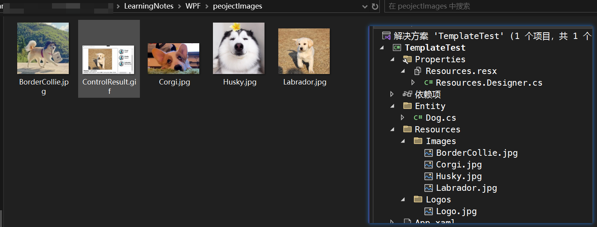

## 1、模板的内涵

Binding 和基于Binding的数据驱动界面是WPF的核心部分，WPF内部系统与程序内容(业务逻辑)的边界是Binding，Binding 把数据源源不断地从程序内部送出来、交由界面元素来显示，又把从界面元素收集来的数据传送回程序内部。界面元素间的沟通则依靠路由事件来完成，有时候路由事件和附加事件也会参与到数据的传输中。

让我们思考一个问题：WPF作为Windows程序的表示方式，它究竟在表示什么？换句话说，WPF作为一种“形式”，它要表现的“内容”究竟是什么？答案是：程序的数据和算法——Binding 传递的是数据，事件参数携带的也是数据；方法和委托的调用是算法，事件传递消息也是算法……数据在内存里就是一串串数字或字符，算法是一组组看不见摸不着的抽象逻辑，如何恰如其分地把它们展现给用户呢？——控件(Control)，是数据内容表现形式和算法内容表现形式的双重载体。换句话说，控件既是数据的表现形式让用户可以直观地看到数据，又是算法的表现形式让用户方便地操作逻辑。

作为“表现形式”，每个控件都是为了实现某种用户操作算法和直观显示某种数据而生，一个控件看上去是什么样子由它的“算法内容”和“数据内容”决定，这就是内容决定形式。这里，我们引入两个概念:

1. 控件的“算法内容”：指控件能展示哪些数据、具有哪些方法、能响应哪些操作、能激发什么事件，简而言之就是控件的功能，它们是一组相关的算法逻辑。
2. 控件的“数据内容”：控件所展示的具体数据是什么。

以往的 GUI开发技术(如 WindowsForms和 ASP.NET)中，控件内部的逻辑和数据是固定的程序员不能改变；对于控件的外观，程序员能做的改变也非常有限，一般也就是设置控件的属性，想改变控件的内部结构是不可能的。如果想扩展一个控件的功能或者更改其外观让其更适应业务逻辑，哪怕只有一丁点改变，也经常需要创建控件的子类或者创建用户控件(UserControl)。造成这个局面的根本原因就是数据和算法的“形式”与“内容”耦合的太紧了。

在 WPF中，通过引入模板(Template)微软将数据和算法的“内容”与“形式”解耦了。WPF中的 Template 分为两大类：

- `ControlTemplate`是算法内容的表现形式，一个控件怎样组织其内部结构才能让它更符合业务逻辑、让用户操作起来更舒服就是由它来控制的。它决定了控件“长成什么样子”并让程序员有机会在控件原有的内部逻辑基础上扩展自己的逻辑。
- `DataTemplate `是数据内容的表现形式，一条数据显示成什么样子，是简单的文本还是直观的图形动画就由它来决定。

Template就是“外衣”——`ControlTemplate是控件的外衣，DataTemplate 是数据的外衣`

## 2、数据的外衣 DataTemplate

一样的内容可以用不同的形式来展现，软件设计称之为“数据—视图”(Data-View)模式。以往的开发技术，如MFC、Windows Forms、ASP.NET等，视图要靠 UserControl来实现，WPF不但支持 UserControl 还支持用 DataTemplate 为数据形成视图。

DataTemplate常用的地方有3处，分别是:

- `ContentControl 的 ContentTemplate 属性`，相当于给 ContentControl 的内容穿衣服
- `ItemsControl 的 ItemTemplate 属性`，相当于给 ItemsControl 的数据条目穿衣服。
- `GridViewColumn 的 CellTemplate 属性`，相当于给 GridViewColumn 单元格里的数据穿衣服。

让我们用一个例子对比 UserControl与DataTemplate的使用。例子实现的需求是这样的：

有一列狗狗的数据（犬种、发源地、技能、体型大小），这列数据显示在一个ListBox里，要求ListBox的条目只需要显示狗狗的简要参数（犬种、发源地），单击某个条目后在窗体的详细内容区域显示狗狗的照片和详细参数。效果如下：


首先添加要显示的图片资源：图片位置如下，注意在代码中要将图片属性中的生成操作设置为资源，否则无法显示图片（这里方便图片的显示，将实体的品种名设置为图片的名了）



设计要显示的Dog类：

```C#
namespace TemplateTest.Entity
{
    public class Dog
    {
        /// <summary>
        /// 品种名
        /// </summary>
        public string Name { get; set; }
        /// <summary>
        /// 来自哪个国家
        /// </summary>
        public string Country{ get; set; }
        /// <summary>
        /// 技能
        /// </summary>
        public string Skill { get; set; }
        /// <summary>
        /// 大型/中型/小型
        /// </summary>
        public string Size { get; set; }

        public Dog(string name, string country, string skill, string size)
        {
            Name = name;
            Country = country;
            Skill = skill;
            Size = size;
        }

        public Dog()
        {
        }
    }
}
```

设计一个UserControl（DogItemControl.xaml）作为列表：列表分为两部分，左边放狗狗的图片使用`Image`标签；右边放狗狗的简要信息如：品种、发源地，使用`StackPanel内部嵌套两个TextBlock`；左右两部分的布局可以使用`<StackPanel Orientation="Horizontal">`

```html
<UserControl x:Class="TemplateTest.DogItemControl"
             xmlns="http://schemas.microsoft.com/winfx/2006/xaml/presentation"
             xmlns:x="http://schemas.microsoft.com/winfx/2006/xaml"
             xmlns:mc="http://schemas.openxmlformats.org/markup-compatibility/2006"
             xmlns:d="http://schemas.microsoft.com/expression/blend/2008"
             xmlns:local="clr-namespace:TemplateTest"
             mc:Ignorable="d" >
    <Grid Margin="2">
        <StackPanel Orientation="Horizontal" x:Name="stackPanel1">
            <Image x:Name="imageLogo" Grid.RowSpan="3" Width="64" Height="64"/>
            <StackPanel Margin="5,10" x:Name="stackPanel2">
                <TextBlock x:Name="textBoxName" FontSize="16" FontWeight="Bold"/>
                <TextBlock x:Name="textBoxCountry" FontSize="14"/>
            </StackPanel>
        </StackPanel>
    </Grid>
</UserControl>
```

.cs文件：列表中的值是最后在主窗体中定义的，列表中每个Item（DogItemControl）就是整个DogItemControl中要显示的内容，所以要在cs文件中绑定控件的值：

```C#
namespace TemplateTest
{
    /// <summary>
    /// DogItemControl.xaml 的交互逻辑
    /// </summary>
    public partial class DogItemControl : UserControl
    {
        private Dog dog;
        public Dog DogItem 
        {
            
            get { return dog; }
            set
            {
                dog = value;
                this.textBoxName.Text = dog.Name;
                this.textBoxCountry.Text = dog.Country;
                string uriStr = $@"/Resources/Logos/Logo.jpg";
                this.imageLogo.Source = new BitmapImage(new Uri(uriStr, UriKind.Relative));
            }
        }
        public DogItemControl()
        {
            InitializeComponent();
        }
    }
}
```

设计一个UserControl（DogDetailControl.xaml）作为左半部分的详情：

详情使用垂直布局的 StackPanel，第一行显示图片；第二行显示犬种；第三行显示详细信息（发源地、技能、体型）

```html
<UserControl x:Class="TemplateTest.DogDetailControl"
             xmlns="http://schemas.microsoft.com/winfx/2006/xaml/presentation"
             xmlns:x="http://schemas.microsoft.com/winfx/2006/xaml"
             xmlns:mc="http://schemas.openxmlformats.org/markup-compatibility/2006"
             xmlns:d="http://schemas.microsoft.com/expression/blend/2008"
             xmlns:local="clr-namespace:TemplateTest"
             mc:Ignorable="d" >
    <Border BorderBrush="Black" BorderThickness="1" CornerRadius="6">
        <StackPanel Margin="5">
            <!--Source="Resources/Images/BorderCollie.jpg"-->
            <Image x:Name="imagePhoto" Width="400" Height="250"/>
            <StackPanel Orientation="Horizontal" Margin="5,0">
                <TextBlock Text="Name:" FontWeight="Bold" FontSize="20"/>
                <TextBlock x:Name="textBlockName" FontSize="20" Margin="5,0"/>
            </StackPanel>
            <StackPanel Orientation="Horizontal" Margin="5,0">
                <TextBlock Text="Country:" FontWeight="Bold"/>
                <TextBlock x:Name="textBlockCountry" Margin="5,0"/>
                <TextBlock Text="Skill:" FontWeight="Bold"/>
                <TextBlock x:Name="textBlockSkill" Margin="5,0"/>
                <TextBlock Text="Size:" FontWeight="Bold"/>
                <TextBlock x:Name="textBlockSize" Margin="5,0"/>
            </StackPanel>
        </StackPanel>
    </Border>
</UserControl>
```

在.cs文件中绑定控件的值

```C#
namespace TemplateTest
{
    /// <summary>
    /// DogDetailControl.xaml 的交互逻辑
    /// </summary>
    public partial class DogDetailControl : UserControl
    {
        private Dog dog;
        public Dog DogDetail
        {
            get { return dog; }
            set
            {
                dog = value;
                this.textBlockName.Text = dog.Name;
                this.textBlockCountry.Text = dog.Country;
                this.textBlockSkill.Text = dog.Skill;
                this.textBlockSize.Text = dog.Size;
                string uriStr = $@"Resources/Images/{dog.Name}.jpg";
                this.imagePhoto.Source = new BitmapImage(new Uri(uriStr, UriKind.Relative));
                //new BitmapImage(new Uri(@"Resources/bears.jpg", UriKind.Relative));
            }
        }
        public DogDetailControl()
        {
            InitializeComponent();
        }
    }
}
```

最后在窗体中使用刚定义详情控件：，当ListBox触发选框变化事件时要更新DogDetailControl的数据源

```html
<Window x:Class="TemplateTest.UserControllWindow"
        xmlns="http://schemas.microsoft.com/winfx/2006/xaml/presentation"
        xmlns:x="http://schemas.microsoft.com/winfx/2006/xaml"
        xmlns:d="http://schemas.microsoft.com/expression/blend/2008"
        xmlns:mc="http://schemas.openxmlformats.org/markup-compatibility/2006"
        xmlns:local="clr-namespace:TemplateTest"
        mc:Ignorable="d"
        Title="UserControllWindow" Height="350" Width="630">
    <StackPanel Orientation="Horizontal" Margin="5">
        <local:DogDetailControl x:Name="detailView"/>
        <ListBox x:Name="listBoxDogs" Width="180" Margin="5,0"
                 SelectionChanged="listBoxDogs_SelectionChanged"/>
    </StackPanel>
</Window>
```

.cs

```C#
namespace TemplateTest
{
    /// <summary>
    /// UserControllWindow.xaml 的交互逻辑
    /// </summary>
    public partial class UserControllWindow : Window
    {
        public UserControllWindow()
        {
            InitializeComponent();
            InitialDogList(); //初始化列表
        }
        private void InitialDogList()
        {
            List<Dog> dogs = new List<Dog>() //设置四个狗狗实体，Name与照片名相同
            {
                new Dog("BorderCollie","England","shepherd","Middle"),
                new Dog("Corgi","welsh","shepherd","Small"),
                new Dog("Husky","Siberia","sledding","Middle"),
                new Dog("Labrador","Newfoundland, Canada","Guiding blind","Middle"),
            };

            foreach(Dog dog in dogs) //初始化列表，将每个狗狗实体作为DogItemControl视图添加到this.listBoxDogs.Items
            {
                DogItemControl view = new DogItemControl();
                view.DogItem = dog;
                this.listBoxDogs.Items.Add(view);
            }
        }
        //选项变化事件处理器
        private void listBoxDogs_SelectionChanged(object sender, SelectionChangedEventArgs e)
        {
            DogItemControl view = e.AddedItems[0] as DogItemControl;
            if(view != null) 
            {
                this.detailView.DogDetail = view.DogItem;
            }
        }
    }
}
```

很难说这样做是错的，但在 WPF 里如此实现需求真是浪费了数据驱动界面这一重要功能。我们常说的“把 WPF当作 Windows Forms来用”指的就是这种实现方法。这种方法对 WPF 最大的曲解在于没有借助 Binding实现数据驱动界面，并且认为 ListBox.Items属性里放置的是控件——这种曲解迫使数据在界面元素间交换并且程序员只能使用事件驱动方式来实现逻辑——程序员必须借助处理ListBox的SelectionChanged事件来推动 DetailView 来显示数据，而数据又是由DogDetailControl控件转交给 DetailView控件的,之间还做了一次类型转换。

显然，事件驱动是控件和控件之间的沟通，数据驱动则是数据与控件之间的沟通，是内容决定形式。使用 DataTemplate 就可以很方便地把事件驱动模式升级为数据驱动模式。90%的代码可以原样拷贝，另10%可以放心删除，再做一点点改动就可以了。

让我们开始吧！首先把两个 UserControl 的“芯”剪切出来，用<DataTemplate>标签包装，再放进主窗体的资源词典里。最重要的一点是为 DataTemplate 里的每个控件设置 Binding，告诉各个控件应该关注数据的哪个属性。因为使用 Binding 在控件与数据间建立关联，免去了在C#代码中访问界面元素，所以 XAML 代码中的大多数 x:Name 都可以去掉，代码看上去地简洁不少。

有些属性的值不能直接拿来用，比如汽车的厂商和名称不能直接拿来作为图片的路径，这时就要使用Converter。有两种办法可以在XAML代码中使用Converter：

- 把Converter以资源的形式放在资源词典里(本例使用的方法)。
- 为Converter 准备一个静态属性，形成单件模式，在XAML代码里使用{x:Static)标签扩展来访问。

```html
<Window x:Class="TemplateTest.TemplateWindow"
        xmlns="http://schemas.microsoft.com/winfx/2006/xaml/presentation"
        xmlns:x="http://schemas.microsoft.com/winfx/2006/xaml"
        xmlns:d="http://schemas.microsoft.com/expression/blend/2008"
        xmlns:mc="http://schemas.openxmlformats.org/markup-compatibility/2006"
        xmlns:local="clr-namespace:TemplateTest"
        xmlns:entity="clr-namespace:TemplateTest.Entity"
        mc:Ignorable="d"
        Title="TemplateWindow" Height="350" Width="630">
    <Window.Resources>
        <!--资源中添加图片转化器-->
        <!--<entity:LogoPathConventer x:Key="logoCon"/>-->
        <entity:NamePathConventor x:Key="nameCon"/>
        <!--将DogItemControl中代码拷过来作为dogDetailTemplate，x:Name去掉改为Binding-->
        <DataTemplate x:Key="dogItemTemplate">
            <Grid Margin="2">
                <StackPanel Orientation="Horizontal">
                    <Image Source="/Resources/Logos/Logo.jpg" Grid.RowSpan="3" Width="64" Height="64"/>
                    <StackPanel Margin="5,10">
                        <TextBlock Text="{Binding Name}" FontSize="16" FontWeight="Bold"/>
                        <TextBlock Text="{Binding Country}" FontSize="14"/>
                    </StackPanel>
                </StackPanel>
            </Grid>
        </DataTemplate>
        <!--将DogDetailControl中代码拷过来作为dogDetailTemplate-->
        <DataTemplate x:Key="dogDetailTemplate">
            <Border BorderBrush="Black" BorderThickness="1" CornerRadius="6">
                <StackPanel Margin="5">
                    <Image Source="{Binding Name,Converter={StaticResource nameCon}}" Width="400" Height="250"/>
                    <StackPanel Orientation="Horizontal" Margin="5,0">
                        <TextBlock Text="Name:" FontWeight="Bold" FontSize="20"/>
                        <TextBlock Text="{Binding Name}" FontSize="20" Margin="5,0"/>
                    </StackPanel>
                    <StackPanel Orientation="Horizontal" Margin="5,0">
                        <TextBlock Text="Country:" FontWeight="Bold"/>
                        <TextBlock Text="{Binding Country}" Margin="5,0"/>
                        <TextBlock Text="Skill:" FontWeight="Bold"/>
                        <TextBlock Text="{Binding Skill}" Margin="5,0"/>
                        <TextBlock Text="Size:" FontWeight="Bold"/>
                        <TextBlock Text="{Binding Size}" Margin="5,0"/>
                    </StackPanel>
                </StackPanel>
            </Border>
        </DataTemplate>
    </Window.Resources>
    <!--窗体内容-->
    <StackPanel Orientation="Horizontal" Margin="5">
        <!--<local:DogDetailControl x:Name="detailView"/>-->
        <UserControl ContentTemplate="{StaticResource dogDetailTemplate}"
                     Content="{Binding SelectedItem,ElementName=listBoxDogs}"/>
        <!--SelectionChanged改为 ItemTemplate -->
        <ListBox x:Name="listBoxDogs" Width="180" Margin="5,0"
                 ItemTemplate="{StaticResource dogItemTemplate}"/>
    </StackPanel>
</Window>

```

```C#
namespace TemplateTest
{
    /// <summary>
    /// TemplateWindow.xaml 的交互逻辑
    /// </summary>
    public partial class TemplateWindow : Window
    {
        public TemplateWindow()
        {
            InitializeComponent();
            InitialGogList();
        }
        private void InitialGogList()
        {
            List<Dog> dogs = new List<Dog>()
            {
                new Dog("BorderCollie","England","shepherd","Middle"),
                new Dog("Corgi","welsh","shepherd","Small"),
                new Dog("Husky","Siberia","sledding","Middle"),
                new Dog("Labrador","Newfoundland, Canada","Guiding blind","Middle"),
            };
            //填充数据源
            this.listBoxDogs.ItemsSource = dogs;
        }
    }
}
```


## 3、控件的外衣 ControlTemplate


### 3.1、庖丁解牛看控件

### 3.2、ItemControl的PanelTemplate

## 4、DataTemplate与ControlTemplate的关系与应用

### 4.1、DataTemplate与ControlTemplate的关系

### 4.2、DataTemplate与ControlTemplate的应用

### 4.3、寻找失落的控件

## 5、深入浅出话Style

### 5.1、Style中的Setter

### 5.2、Style中的Trigger

NuGet\Install-Package Prism.Wpf -Version 8.1.97

