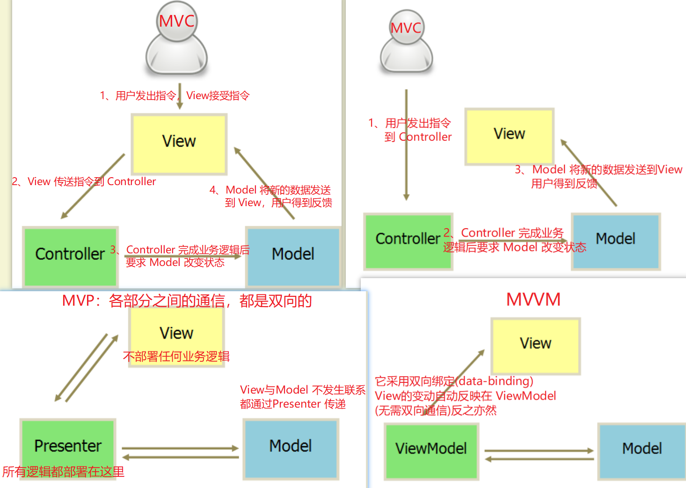
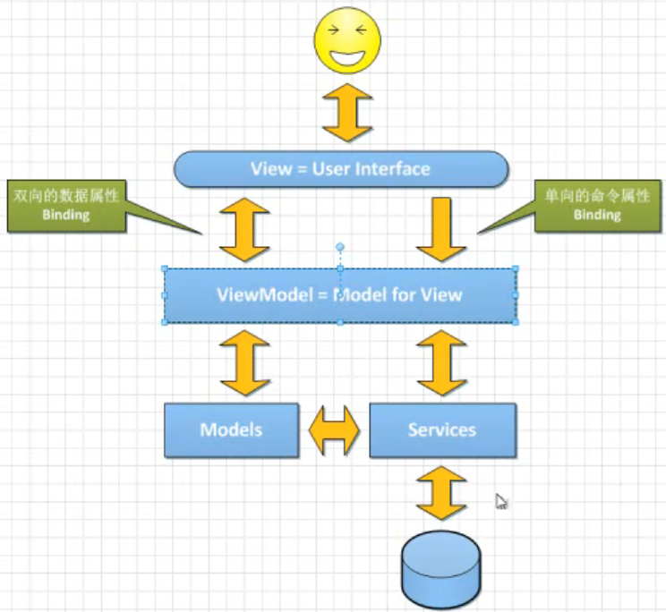
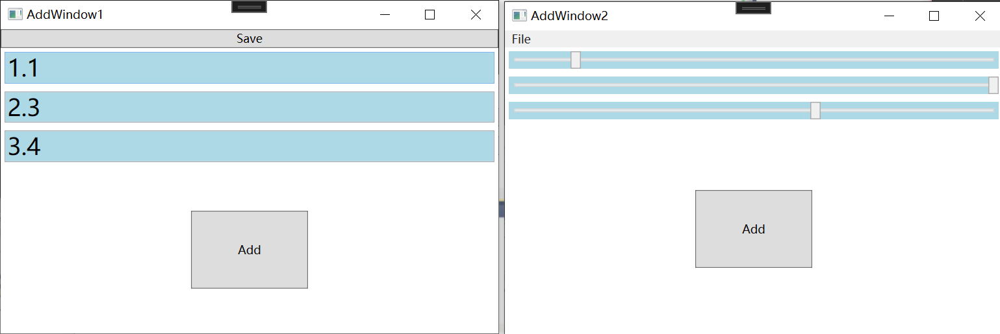
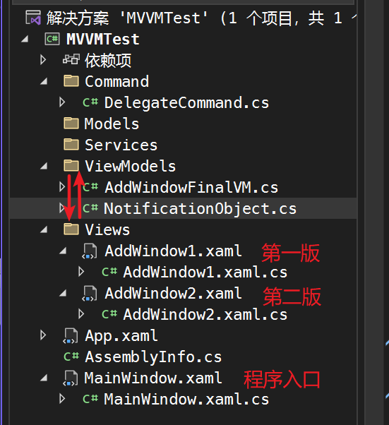

## 1、MVVM = Model—View—ViewModel

View：UI 用户操作界面 数据的展示形态

ViewModel：Model for View

ViewModel和View的沟通：数据属性用来传递数据，命令属性用来传递操作





## 2、不分离会出现的问题：

设计一个窗体，点击Save按钮在弹窗中填写数据，tb1，tb2存储加数，点击Add按钮计算加数显示在tb3中

第一版：tb1，tb2，tb3使用TextBox控件显示：

```html
<Window x:Class="MVVMTest.AddWindow1"
        xmlns="http://schemas.microsoft.com/winfx/2006/xaml/presentation"
        xmlns:x="http://schemas.microsoft.com/winfx/2006/xaml"
        xmlns:d="http://schemas.microsoft.com/expression/blend/2008"
        xmlns:mc="http://schemas.openxmlformats.org/markup-compatibility/2006"
        xmlns:local="clr-namespace:MVVMTest"
        mc:Ignorable="d"
        Title="AddWindow1" Height="350" Width="525">
    <Grid>
        <Grid.RowDefinitions>
            <!--该行的高度将根据其内容的大小自动调整-->
            <RowDefinition Height="Auto"/>
            <!--该行的高度将占据Grid剩余空间的全部或者一部分，具体取决于Grid的大小和其他行的高度-->
            <RowDefinition Height="*"/>
        </Grid.RowDefinitions>
        <Button Content="Save" x:Name="saveButton" Click="saveButton_Click"/>
        <Grid Grid.Row="1">
            <Grid.RowDefinitions>
                <RowDefinition Height="Auto"/>
                <RowDefinition Height="Auto"/>
                <RowDefinition Height="Auto"/>
                <RowDefinition Height="*"/>
            </Grid.RowDefinitions>
            <TextBox x:Name="tb1" Grid.Row="0" Background="LightBlue" FontSize="24" Margin="4"/>
            <TextBox x:Name="tb2" Grid.Row="1" Background="LightBlue" FontSize="24" Margin="4"/>
            <TextBox x:Name="tb3" Grid.Row="2" Background="LightBlue" FontSize="24" Margin="4"/>
            <Button x:Name="addButton" Grid.Row="3" Content="Add" Width="120" Height="80" Click="addButton_Click"/>
        </Grid>
    </Grid>
</Window>
```

.cs文件定义 addButton 和 saveButton 的 click 事件

```C#
using System.Windows;
using Microsoft.Win32;

namespace MVVMTest
{
    /// <summary>
    /// AddWindow1.xaml 的交互逻辑
    /// </summary>
    public partial class AddWindow1 : Window
    {
        public AddWindow1()
        {
            InitializeComponent();
        }
        private void addButton_Click(object sender, RoutedEventArgs e)
        {
            double d1 = double.Parse(this.tb1.Text);
            double d2 = double.Parse(this.tb2.Text);
            var res = d1 + d2;
            this.tb3.Text = res.ToString();
        }

        private void saveButton_Click(object sender, RoutedEventArgs e)
        {
            SaveFileDialog dlg = new SaveFileDialog();
            dlg.ShowDialog();
        }
    }
}
```

第二版：tb1，tb2，tb3使用Slider控件显示：

```html
<Window x:Class="MVVMTest.AddWindow2"
        xmlns="http://schemas.microsoft.com/winfx/2006/xaml/presentation"
        xmlns:x="http://schemas.microsoft.com/winfx/2006/xaml"
        xmlns:d="http://schemas.microsoft.com/expression/blend/2008"
        xmlns:mc="http://schemas.openxmlformats.org/markup-compatibility/2006"
        xmlns:local="clr-namespace:MVVMTest"
        mc:Ignorable="d"
        Title="AddWindow2" Height="350" Width="525">
    <Grid>
        <Grid.RowDefinitions>
            <!--该行的高度将根据其内容的大小自动调整-->
            <RowDefinition Height="Auto"/>
            <!--该行的高度将占据Grid剩余空间的全部或者一部分，具体取决于Grid的大小和其他行的高度-->
            <RowDefinition Height="*"/>
        </Grid.RowDefinitions>
        <Menu>
            <MenuItem Header="_File">
                <MenuItem Header="_Save" x:Name="saveMenuItem" Click="saveMenuItem_Click"/>
            </MenuItem>
        </Menu>
        <Grid Grid.Row="1">
            <Grid.RowDefinitions>
                <RowDefinition Height="Auto"/>
                <RowDefinition Height="Auto"/>
                <RowDefinition Height="Auto"/>
                <RowDefinition Height="*"/>
            </Grid.RowDefinitions>
            <Slider x:Name="slider1" Grid.Row="0" Background="LightBlue" Minimum="-100" Maximum="100" Margin="4"/>
            <Slider x:Name="slider2" Grid.Row="1" Background="LightBlue" Minimum="-100" Maximum="100" FontSize="24" Margin="4"/>
            <Slider x:Name="slider3" Grid.Row="2" Background="LightBlue"  Minimum="-100" Maximum="100" FontSize="24" Margin="4"/>
            <Button x:Name="addButton" Grid.Row="3" Content="Add" Width="120" Height="80" Click="addButton_Click"/>
        </Grid>
    </Grid>
</Window>
```

.cs文件定义 addButton 和 saveMenuItem 的 click 事件

```C#
using System.Windows;
using Microsoft.Win32;

namespace MVVMTest
{
    /// <summary>
    /// AddWindow2.xaml 的交互逻辑
    /// </summary>
    public partial class AddWindow2 : Window
    {
        public AddWindow2()
        {
            InitializeComponent();
        }
        private void addButton_Click(object sender, RoutedEventArgs e)
        {
            this.slider3.Value = this.slider1.Value + this.slider2.Value;
        }

        private void saveMenuItem_Click(object sender, RoutedEventArgs e)
        {
            SaveFileDialog saveFileDialog = new SaveFileDialog();
            saveFileDialog.ShowDialog();
        }
    }
}
```

两版的效果：



从这两版的代码变化来看，可以发现当UI界面修改时，两个click事件都需要随之做出修改，发生界面和代码的耦合。

现在可以抽象出这个功能的本质：

- 有两个值可以给用户输入
- 有一个命令可以操作后台做计算
- 有一个值可以给用户显示操作结果的输出
- 有一个命令可以操作后台做结果的存储

在ViewModel和View之间就会有：三个数据属性，两个命令属性

首先搭建这样的项目框架用于存储不同功能的模块代码：



## 3、分离第一步：NotificationObject与数据属性

已知ViewModel和View之间数据绑定的实现利用的是Binding，实现的原理是ViewModel中的属性发生变化时，通过Binding绑定元素侦听到数据（继承自INotifyPropertyChanged接口）的PropertyChanged变化后的值，进而修改View中Binding的数据

所以首先定义ViewModel的基类（后面作为Windows窗体的DataContext）：

```C#
using System.ComponentModel;

namespace MVVMTest.ViewModels
{
    /// <summary>
    /// ViewModel的基类 用于在对象的属性值发生变化时通知监听者。通过调用RaisePropertyChanged方法并传递属性名称，可以触发PropertyChanged事件，从而实现属性更改的通知机制
    /// </summary>
    public class NotificationObject : INotifyPropertyChanged
    {
        //委托类型，处理属性更改事件
        public event PropertyChangedEventHandler? ;
        //用于触发PropertyChanged事件并通知属性更改
        public void RaisePropertyChanged(string propertyName)
        {
            //检查事件的委托是否为空
            if (this.PropertyChanged != null)
            {
                //触发PropertyChanged事件,并将当前对象和一个新的PropertyChangedEventArgs实例关联
                this.PropertyChanged.Invoke(this,new PropertyChangedEventArgs(propertyName));
            }
        }
    }
}
```

将三个数据属性（有两个值可以给用户输入、有一个值可以给用户显示操作结果的输出） 包装到AddWindowFinalVM类，此类继承ViewModel的基类NotificationObject，这样当值变化时触发父类的RaisePropertyChanged方法，此方法中会操作PropertyChanged属性更改事件，View中绑定的控件就会根据PropertyChanged中参数的属性名，属性值，对控件的值进行修改。

```C#
using System;
using MVVMTest.Command;

namespace MVVMTest.ViewModels
{
    //作为AddWindowFinal的DataContext
    public class AddWindowFinalVM : NotificationObject
    {
        #region 数据属性
        private double input1;
        public double Input1
        {
            get { return input1; }
            set
            {
                input1 = value;
                //每次值变化都会触发基类的RaisePropertyChanged方法,同时变化的属性名作为参数传递
                this.RaisePropertyChanged(nameof(Input1));
            }
        }
        private double input2;
        public double Input2
        {
            get { return input2; }
            set
            {
                input2 = value;
                this.RaisePropertyChanged(nameof(Input2));
            }
        }
        private double result;
        public double Result
        {
            get { return result; }
            set
            {
                result = value;
                this.RaisePropertyChanged(nameof(Result));
            }
        }
        #endregion
    }
}
```

## 4、分离第二步：DelegateCommand与命令属性

至此我们就能够将窗体中的三个数据属性与ViewModel进行绑定，实现View数据变化，ViewModel数据变化，但是不要忘记，我们还有个Add 操作没有与ViewModel进行关联，Add操作可以通过View控件的Command属性（让View 发出Command指令）与ViewModel进行绑定

所以我们下一步就是定义命令属性 DelegateCommand （继承自ICommand接口），内部需要实现CanExecute、Execute方法。在方法内部我们需要添加一个委托的抽象（即委托事件属性ExecuteAction、CanExecuteFunc），使得能够在类的外部添加CanExecute、Execute方法内部执行的操作。

```C#
using System;
using System.Windows.Input;

namespace MVVMTest.Command
{
    public class DelegateCommand : ICommand
    {
        // 帮助命令的呼叫者判断命令能否执行
        public bool CanExecute(object? parameter)
        {
            //当判断命令能否执行时，具体执行的方法由 CanExecuteAction 属性的值指定
            if (this.CanExecuteFunc == null)
                return true;
            else return this.CanExecuteFunc(parameter);
            //忘记给 CanExecuteAction 属性赋值时，永远都可以执行

            //throw new NotImplementedException();
        }
        //命令执行时的具体内容
        public void Execute(object? parameter)
        {
            //当命令执行时，具体执行的方法由 ExecuteAction 属性的值指定
            if (this.ExecuteAction == null)
                return;
            else
                this.ExecuteAction(parameter);
            //throw new NotImplementedException();
        }
        // 命令能否执行时通知命令执行者命令状态发生变化
        public event EventHandler? CanExecuteChanged;

        public Action<object>? ExecuteAction { get; set; }
        public Func<object, bool>? CanExecuteFunc { get; set; }
    }
}
```

至此，在AddWindowFinalVM中我们又可以追加如下代码：Add操作关联的Command命令

```C#
 #region 命令属性
 //声明自定义的DelegateCommand类型的Add命令
 public DelegateCommand AddCommand { get; set; }
//具体的Add操作
 private void Add(object parameter)
 {
     this.Result = this.Input1 + this.Input2;
 }
//声明自定义的DelegateCommand类型的Save命令
public DelegateCommand SaveCommand { get; set; }
//具体的Save操作
private void Save(object parameter)
{
    SaveFileDialog dialog = new SaveFileDialog();
    dialog.ShowDialog();
}
 #endregion
//在构造函数中，将Add操作 作为 委托属性值赋值给this.AddCommand.ExecuteAction
 public AddWindowFinalVM()
 {
     this.AddCommand = new DelegateCommand();
     this.AddCommand.ExecuteAction = new Action<object>(this.Add);
     
     this.SaveCommand = new DelegateCommand();
     this.SaveCommand.ExecuteAction = new Action<object>(this.Save);
 }
```

## 5、View与ViewModel的交互(Binding)

较一开始的xmal代码，我们做了如下修改：将x:Name的数据绑定改为了Binding的属性绑定，将按钮的click事件改为了Command命令的写法

```html
<Window x:Class="MVVMTest.Views.AddWindowFinal"
        xmlns="http://schemas.microsoft.com/winfx/2006/xaml/presentation"
        xmlns:x="http://schemas.microsoft.com/winfx/2006/xaml"
        xmlns:d="http://schemas.microsoft.com/expression/blend/2008"
        xmlns:local="clr-namespace:MVVMTest.Views"
        xmlns:mc="http://schemas.openxmlformats.org/markup-compatibility/2006"
        Title="AddWindowFinal"
        Width="525"
        Height="350"
        mc:Ignorable="d">
    <Grid>
        <Grid.RowDefinitions>
            <!--  该行的高度将根据其内容的大小自动调整  -->
            <RowDefinition Height="Auto" />
            <!--  该行的高度将占据Grid剩余空间的全部或者一部分，具体取决于Grid的大小和其他行的高度  -->
            <RowDefinition Height="*" />
        </Grid.RowDefinitions>
        <Button Command="{Binding SaveCommand}" Content="Save" />
        <Grid Grid.Row="1">
            <Grid.RowDefinitions>
                <RowDefinition Height="Auto" />
                <RowDefinition Height="Auto" />
                <RowDefinition Height="Auto" />
                <RowDefinition Height="*" />
            </Grid.RowDefinitions>
            <!--  如果Binding只指定了path,没有指定ElementAt的值，会逐层去DataContext中找  -->
            <TextBox Grid.Row="0"
                     Margin="4"
                     Background="LightBlue"
                     FontSize="24"
                     Text="{Binding Input1}" />
            <TextBox Grid.Row="1"
                     Margin="4"
                     Background="LightBlue"
                     FontSize="24"
                     Text="{Binding Input2}" />
            <TextBox Grid.Row="2"
                     Margin="4"
                     Background="LightBlue"
                     FontSize="24"
                     Text="{Binding Result}" />
            <Button Grid.Row="3"
                    Width="120"
                    Height="80"
                    Command="{Binding AddCommand}"
                    Content="Add" />
        </Grid>
    </Grid>
</Window>
```

.cs文件，给Windows的DataContext赋值

```C#
using System.Windows;
using MVVMTest.ViewModels;

namespace MVVMTest.Views
{
    /// <summary>
    /// AddWindowFinal.xaml 的交互逻辑
    /// </summary>
    public partial class AddWindowFinal : Window
    {
        public AddWindowFinal()
        {
            InitializeComponent();
            //将View和ViewModel关联上
            this.DataContext = new AddWindowFinalVM();
        }
    }
}
```

## 6、分离后的效果：

至此我们达到了UI界面和后台算法的解耦，后台代码中没有使用到前台的变量或者属性名，即使UI界面换了，编译依然可以通过。

现在模拟一下当需求再次变更时，输入以及数据显示由textbox变更为slider时。较重新设计的xmal代码，我们做了如下修改：将x:Name的数据绑定改为了Binding的属性绑定，将按钮的click事件改为了Command命令的写法。

```html
<Window x:Class="MVVMTest.Views.AddWindowFinal2"
        xmlns="http://schemas.microsoft.com/winfx/2006/xaml/presentation"
        xmlns:x="http://schemas.microsoft.com/winfx/2006/xaml"
        xmlns:d="http://schemas.microsoft.com/expression/blend/2008"
        xmlns:local="clr-namespace:MVVMTest.Views"
        xmlns:mc="http://schemas.openxmlformats.org/markup-compatibility/2006"
        Title="AddWindowFinal2"
        Width="525"
        Height="350"
        mc:Ignorable="d">
    <Grid>
        <Grid.RowDefinitions>
            <!--  该行的高度将根据其内容的大小自动调整  -->
            <RowDefinition Height="Auto" />
            <!--  该行的高度将占据Grid剩余空间的全部或者一部分，具体取决于Grid的大小和其他行的高度  -->
            <RowDefinition Height="*" />
        </Grid.RowDefinitions>
        <Menu>
            <MenuItem Header="_File">
                <MenuItem Header="_Save" Command="{Binding SaveCommand}"/>
            </MenuItem>
        </Menu>
        <Grid Grid.Row="1">
            <Grid.RowDefinitions>
                <RowDefinition Height="Auto" />
                <RowDefinition Height="Auto" />
                <RowDefinition Height="Auto" />
                <RowDefinition Height="*" />
            </Grid.RowDefinitions>
            <Slider Grid.Row="0"
                    Margin="4"
                    Background="LightBlue"
                    Maximum="100"
                    Minimum="-100" 
                    Value="{Binding Input1}"/>
            <Slider Grid.Row="1"
                    Margin="4"
                    Background="LightBlue"
                    FontSize="24"
                    Maximum="100"
                    Minimum="-100" Value="{Binding Input2}"/>
            <Slider Grid.Row="2"
                    Margin="4"
                    Background="LightBlue"
                    FontSize="24"
                    Maximum="100"
                    Minimum="-100" Value="{Binding Result}"/>
            <Button Grid.Row="3"
                    Width="120"
                    Height="80"
                    Content="Add" Command="{Binding AddCommand}"/>
        </Grid>
    </Grid>
</Window>
```

.cs文件将View和ViewModel关联上

```C#
using System.Windows;
using MVVMTest.ViewModels;
namespace MVVMTest.Views
{
    /// <summary>
    /// AddWindowFinal2.xaml 的交互逻辑
    /// </summary>
    public partial class AddWindowFinal2 : Window
    {
        public AddWindowFinal2()
        {
            InitializeComponent();
            //将View和ViewModel关联上
            this.DataContext = new AddWindowFinalVM();
        }
    }
}
```

这样我们只修改了少部分代码，后台代码一行都无需修改