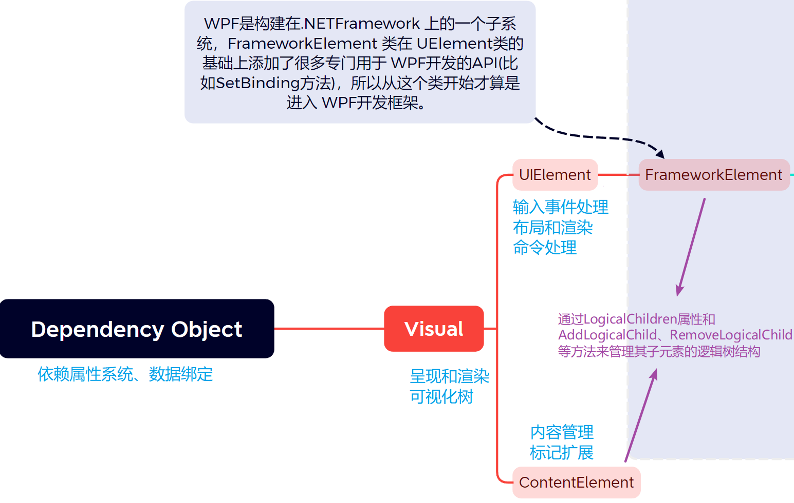

### 1、什么是WPF?

答：WPF（Windows Presentation Foundation）是微软公司推出的基于Windows的用户界面框架，属于.NET Framework 3.0的一部分。它提供了统一的编程模型、语言和框架，真正做到了分离界面设计人员与开发人员的工作；同时它提供了全新的多媒体交互用户图形界面。

### 2、WPF由哪两部分组成?

答：WPF由两个主要部分组成：引擎和编程框架。擎负责底层的渲染和图形处理，而编程框架则提供了开发人员所需的工具和API

1. 引擎是WPF的核心，负责将应用程序的用户界面呈现到屏幕上。WPF引擎基于矢量图形技术，能够提供高质量、高性能的用户界面。
2. 编程框架为开发人员提供了创建WPF应用程序的工具和方法。WPF编程框架包括以下组件：

- PresentationFramework：提供WPF应用程序的核心功能，包括控件、布局、数据绑定、样式和模板、动画、媒体等
- PresentationCore：它提供了WPF的图形渲染引擎、图形处理、输入和事件处理、命令系统功能。
- **MilCore**：MilCore是WPF的渲染引擎，负责将WPF的图形对象转换为屏幕上的像素。它使用硬件加速技术和优化算法，提供高性能和流畅的图形渲染。
- CommonLanguageRuntime：是.NET Framework的运行时环境，提供基本类库和支持多语言编程。
- **WindowsFormsIntegration**：WindowsFormsIntegration是一个用于将Windows Forms和WPF集成的组件。它允许在WPF应用程序中使用Windows Forms的控件，并在两种技术之间进行交互和通信。

### 3、WPF生命周期

当我们谈到WPF应用程序的生命周期时，主要涉及到以下几个阶段：

1. **应用程序启动**：当用户双击应用程序的可执行文件或通过其他方式启动应用程序时，应用程序的启动过程开始。在这个阶段，WPF会创建一个`Application`对象，并触发`Application`类的`Startup`事件。在该事件中，可以进行一些初始化操作，如设置应用程序的主窗口、创建和配置其他资源等。
2. **应用程序运行**：一旦应用程序启动，它就进入了运行阶段。在这个阶段，WPF会显示应用程序的主窗口，并开始处理用户的输入和操作。应用程序的代码将开始执行，处理事件、响应命令、更新界面等。
3. **应用程序关闭**：当用户关闭应用程序的主窗口，或者调用`Application`类的`Shutdown`方法时，应用程序即将关闭。在这个阶段，WPF会触发`Application`类的`Exit`事件，可以在该事件中进行一些清理和保存操作。一旦`Exit`事件处理完成，应用程序将终止。

在这个生命周期中，我们可以通过事件和方法来控制应用程序的行为和进行必要的操作。例如，可以通过订阅`Startup`事件来执行一些初始化任务，通过订阅`Exit`事件来执行一些清理任务，或者调用`Application`类的方法来手动关闭应用程序。

此外，WPF还提供了其他一些事件和机制，用于处理应用程序的其他生命周期事件，如`Activated`事件（当应用程序窗口获得焦点时触发）、`Deactivated`事件（当应用程序窗口失去焦点时触发）等。

总结起来，WPF应用程序的生命周期包括启动、运行和关闭三个主要阶段。通过事件和方法，我们可以控制应用程序的行为，并在适当的时候执行必要的操作。

### 4、VisualTree和LogicalTree

**逻辑树**的组成是由逻辑元素构成的。逻辑元素是`UIElement`或`ContentElement`类的派生类，它们是WPF界面元素的基本构建块。逻辑元素具有一些共同的属性和方法，例如布局、渲染、输入和命令处理等。

逻辑树的组成由以下几个重要的元素组成：

1. **根元素**：逻辑树的根节点通常是应用程序的主窗口，它是`Window`类的实例。主窗口可以包含其他的逻辑元素作为其子元素，形成逻辑树的层次结构。
2. **逻辑元素**：逻辑元素是组成逻辑树的基本单位。它可以是`UIElement`类的派生类（如按钮、文本框、面板等）或`ContentElement`类的派生类（如文本块、流内容控件等）。
3. **逻辑父子关系**：逻辑元素之间通过逻辑父子关系连接在一起。每个逻辑元素可以有一个逻辑父元素和多个逻辑子元素。通过这种关系，逻辑树形成了层次结构。

**可视树**的组成是由可视元素构成的。可视元素是`Visual`类的派生类，它们是WPF界面元素在屏幕上的可视化表示。可视元素具有一些共同的属性和方法，例如呈现、布局转换和触摸输入等。

可视树的组成由以下几个重要的元素组成：

1. **根元素**：可视树的根节点通常是应用程序的主窗口，它是`Window`类的实例。主窗口可以包含其他的可视元素作为其子元素，形成可视树的层次结构。
2. **可视元素**：可视元素是组成可视树的基本单位。它们是`Visual`类的派生类，可以在屏幕上进行呈现和交互。可视元素包括但不限于界面元素（如按钮、文本框、面板等）和视觉效果（如渐变、动画等）。
3. **可视父子关系**：可视元素之间通过可视父子关系连接在一起。每个可视元素可以有一个可视父元素和多个可视子元素。通过这种关系，可视树形成了层次结构。

视觉树和逻辑树的相互关系可以通过LogicalTreeHelper类来访问。LogicalTreeHelper类提供了一系列的方法，用于访问逻辑树中的元素。

### 5、为什么路由事件和命令传递的树不同

`路由事件的传递是基于可视树`的，这是因为`路由事件通常涉及到界面元素的交互和显示`。可视树是描述界面元素的层次结构，它可以很好地反映元素之间的关系和布局。通过路由事件的冒泡或隧道传递，WPF可以在可视树上沿着元素的父子关系进行事件的传递和响应，从而实现事件的冒泡或隧道处理。

`命令的传递则是基于逻辑树`的，这是因为`命令通常涉及到应用程序的功能和交互`。逻辑树是描述界面元素的逻辑关系，它可以很好地反映元素之间的逻辑结构和功能组织。通过命令的传递，WPF可以在逻辑树上沿着元素的逻辑父子关系进行命令的传递和处理，从而实现统一的命令处理和交互模式。

因此，路由事件和命令传递使用不同的树状结构，是因为它们的传递方式和使用目的不同。可视树用于描述界面元素的层次关系和显示，而逻辑树用于描述界面元素的逻辑关系和功能组织。这样，WPF可以根据不同的需求和场景，在可视树和逻辑树上采取不同的传递方式和处理机制

### 6、WPF的DependencyObject以及其子类

DependencyObject的继承关系如下图：



1. `UIElement`类增加的功能包括：
   - 输入事件处理：`UIElement`提供了处理鼠标、键盘和触摸等输入事件的机制，例如`MouseDown`、`KeyDown`等事件。
   - 布局和渲染：`UIElement`提供了布局和渲染的功能，它定义了`Measure`和`Arrange`方法，用于确定界面元素的大小和位置。
   - 命令处理：`UIElement`支持命令的绑定和处理，例如`Command`和`CommandParameter`属性。
2. `ContentElement`类增加的功能包括：
   - 内容管理：`ContentElement`提供了处理文本和流内容的功能，它定义了`ContentStart`和`ContentEnd`等属性，用于管理内容的开始和结束位置。
   - 标记扩展：`ContentElement`支持标记扩展（Markup Extension），可以在内容中使用标记扩展语法，例如`{Binding}`和`{StaticResource}`。
3. `Visual`类增加的功能包括：
   - 呈现和渲染：`Visual`提供了呈现和渲染的功能，它定义了`OnRender`和`HitTestCore`等方法，用于自定义元素的呈现和命中测试。
   - 可视化树：`Visual`类是可视化树的基础，它定义了`VisualTreeHelper`类，用于遍历和操作可视化树的结构。
4. `DependencyObject`类增加的功能包括：
   - 依赖属性系统：`DependencyObject`提供了依赖属性系统的功能，它定义了`GetValue`和`SetValue`等方法，用于读取和设置依赖属性的值。
   - 数据绑定：`DependencyObject`支持数据绑定机制，可以使用`Binding`来连接界面元素和数据源。

### 15、在WPF项目什么是App.xaml？

答：App.xaml 是 WPF 项目的入口文件。它定义了应用程序的根元素，并包含应用程序的启动脚本。

App.xaml 文件由 XAML 语言编写。XAML 是一种标记语言，用于描述 WPF 元素的结构和样式。

App.xaml 文件的根元素是 <Application> 元素。<Application> 元素定义了应用程序的名称、版本和启动脚本。

App.xaml 文件的启动脚本是 <Application.StartupUri> 属性的值。<Application.StartupUri> 属性指定了应用程序启动时要显示的窗口。


它定义了应用程序的全局资源和应用程序级别的事件处理程序。下面让我来解释App.xaml文件的一些重要部分。

1. Application标记：
   App.xaml文件的根元素是`<Application>`标记，表示应用程序的入口点。这个标记中包含了一些属性，用于配置应用程序的行为。

2. ResourceDictionary：
   在`<Application>`标记内部，我们可以定义全局资源，这些资源可以在整个应用程序中共享和访问。资源可以是样式、模板、数据绑定等，用于定义应用程序的外观和行为。

   ```xml
   <Application.Resources>
       <ResourceDictionary>
           <!-- 全局资源定义 -->
       </ResourceDictionary>
   </Application.Resources>
   ```

3. StartupUri：
   `StartupUri`属性指定了应用程序启动时要打开的主窗口。我们可以设置为一个XAML文件，例如`<StartupUri>MainWindow.xaml</StartupUri>`，这样应用程序启动后将会显示MainWindow.xaml中定义的窗口。

   ```xml
   <Application.StartupUri>
       <Uri>MainWindow.xaml</Uri>
   </Application.StartupUri>
   ```

4. 事件处理程序：
   App.xaml文件还可以包含应用程序级别的事件处理程序。例如，我们可以在`<Application>`标记内部定义`<Application.Resources>`之前，添加`<Application.Startup>`和`<Application.Exit>`等事件处理程序。

   ```xml
   <Application.Startup>
       <!-- 应用程序启动事件处理程序 -->
   </Application.Startup>
   <Application.Exit>
       <!-- 应用程序退出事件处理程序 -->
   </Application.Exit>
   ```

App.xaml文件的作用是为整个应用程序提供了一个全局的配置和资源定义的地方。通过在App.xaml文件中定义全局资源和事件处理程序，我们可以在应用程序的各个部分共享和使用它们，从而提供一致的外观和行为。