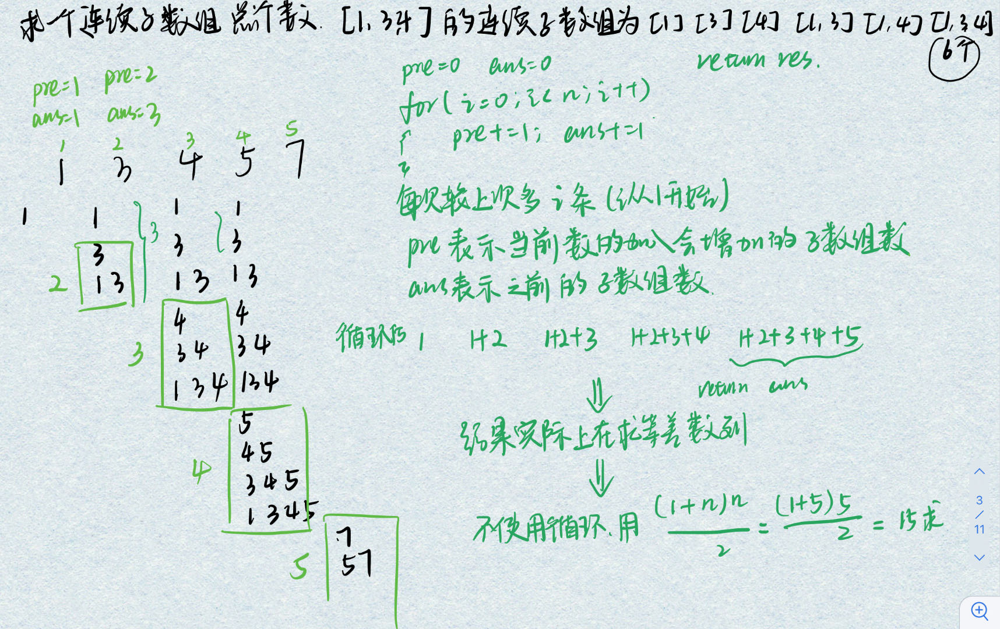
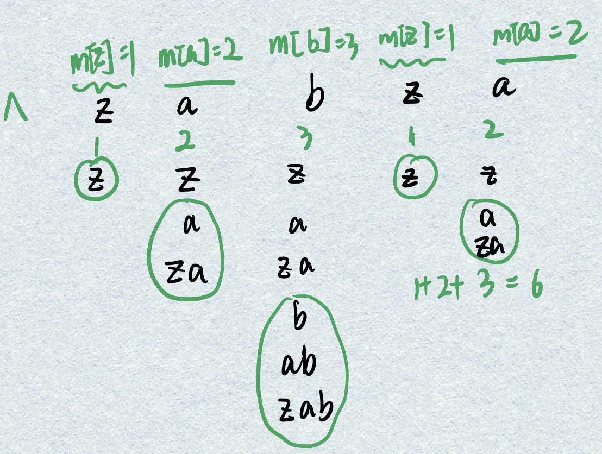

滑动窗口适合在题目要求连续的情况下使用， 而前缀和也是如此。二者在连续问题中，对于优化时间复杂度有着很重要的意义。 因此如果一道题你可以用暴力解决出来，而且题目恰好有连续的限制， 那么滑动窗口和前缀和等技巧就应该被想到。

从类型上说主要有：

- 固定窗口大小
- 窗口大小不固定，求解最大的满足条件的窗口
- 窗口大小不固定，求解最小的满足条件的窗口

参考文章：https://github.com/azl397985856/leetcode/blob/master/thinkings/slide-window.md

```C++
//最长模板:
初始化left,right,result,bestResult
while(右指针没有到结尾){
	窗口扩大，加入right对应元素，更新当前result
    while(result不满足要求){
		窗口缩小，移除left对应元素，left右移
        }
		更新最优结果bestResult
		right++;
}
返回bestResult;
//最短模板:
初始化left,right,result,bestResult
while(右指针没有到结尾){
	窗口扩大，加入right对应元素，更新当前result
    while(result满足要求){
		更新最优结果bestResult
		窗口缩小，移除left对应元素，left右移
    }
	right++;
}
返回bestResult;
```


### 209.长度最小的子数组

https://leetcode.cn/problems/minimum-size-subarray-sum/description/

题目简介：

找出该数组中满足其总和大于等于 `target` 的长度最小的 **子数组** `[numsl, numsl+1, ..., numsr-1, numsr]` ，并返回其长度**。**如果不存在符合条件的子数组，返回 `0` 

思考：

这个题有个坑，就是结果是子数组即选出来的下标必须是连续的，不能使用通过排序后贪心的思想处理

暴力解法（一个循环遍历起始位置，一个循环遍历结束位置）：只有18/21的通过率，数据量一大就会出现“超出时间限制”的错误

```C++
class Solution {
public:
    int minSubArrayLen(int target, vector<int>& nums) {
        int n = nums.size(),res = n,tmp = n;
        long sum = 0,all = 0;
        for(int i = 0;i<n;i++){
            all+=nums[i];
            sum = 0;
            tmp=0;
            for(int j = i;j<n;j++){
                if(sum>=target){
                    break;
                }else{
                    sum+=nums[j];
                    tmp++;
                }
            }
            if(sum>=target && tmp<res) res = tmp;
        }
        if(all<target) return 0;
        else return res;
    }
};
```

滑动窗口解法：

窗口起始位置为i = 0，用 j 遍历得到窗口的结束位置，当窗口内元素的满足和sum>=target，则移动 i 缩小窗口，同时更新sum，直至sum不满足sum>=target。此时再移动 j 寻找下一个满足的窗口

```C++
class Solution {
public:
    int minSubArrayLen(int target, vector<int>& nums) {
     int n = nums.size(),res = n + 1,sum = 0;
        for(int i = 0,j=0;j<n;j++){
            sum += nums[j];
            while(sum>=target){ //窗口内的数据符合条件，i左移找最优解
                res = min(res,j - i + 1);
                sum -= nums[i]; //移动窗口起始位置
                i++;
            }
        }
        if(res == n + 1) return 0;
        else return res;
    }
};
```

每个元素在滑动窗后进来操作一次，出去操作一次，每个元素都是被操作两次，所以时间复杂度是 2 × n 也就是O(n)

#### 前缀和+二分解法待更新

### 713. 乘积小于 K 的子数组

https://leetcode.cn/problems/subarray-product-less-than-k/

给你一个整数数组 `nums` 和一个整数 `k` ，请你返回子数组内所有元素的乘积严格小于 `k` 的连续子数组的数目。

2024.8.18思考：返回子数组内乘积小于k的连续子数组的数目，连续数目想到滑动窗口，j 遍历所有的数，当乘积大于k时 j 无法移动，乘积去除 i 指向元素， i++ ；此时区间内的元素满足条件，可以更新总元素个数res，res+=i至j之间的元素数

```C++
class Solution {
public:
    int numSubarrayProductLessThanK(vector<int>& nums, int k) {
        int res = 0,multi = 1; //左右端点
        if(k<=1){ //特判 [1,1] k=1 和 [1,2] k=0 的情况
            return 0;
        }
        for(int i = 0,j = 0;j<nums.size();j++)//左端点i右端点j
        {
            multi *= nums[j];
            while(multi>=k){ //窗口内的数据不符合条件，i左移找下一解
                multi /= nums[i];
                i++;
            }
            // 结果中子数组中增加的个数为=i-j之间的元素数= j - i + 1
            res += j - i + 1;
        }
        return res;
    }
};
```

### 3.无重复字符的最长子串

https://leetcode.cn/problems/longest-substring-without-repeating-characters/

给定一个字符串 `s` ，请你找出其中不含有重复字符的 **最长子串** 的长度。

2024.8.18思考：子串(连续) 长度(个数) 想到滑动窗口，使区间始终保持不含重复元素，再更新res。j 遍历所有字符，标记出现次数++，如果出现次数大于1 此时 j 无法移动，将 i 指向元素移除区间直至符合条件，更新res。

```C++
class Solution {
public:
    int lengthOfLongestSubstring(string s) {
        int res = 0;
        unordered_map<char,int> m;
        for(int i=0, j=0;j<s.length();j++){
            m[s[j]] ++;
            while(m[s[j]] > 1){ //不满足条件
                m[s[i]] --; //左移端点
                i++;
            }
            res = max(res,j-i+1);
        }
        return res;
    }
};
```

- `0 <= s.length <= 5 * 10^4`
- `s` 由英文字母、数字、符号和空格组成

时间复杂度：O(n)【注意 left 至多增加 n 次，所以整个二重循环至多循环 O(n) 次】。
空间复杂度：O(∣Σ∣)=O(1)【其中 ∣Σ∣ 为字符集合的大小，本题中字符均为 ASCII 字符，所以 ∣Σ∣≤128】

### 2958. 最多 K 个重复元素的最长子数组

https://leetcode.cn/problems/length-of-longest-subarray-with-at-most-k-frequency/

给你一个整数数组 `nums` 和一个整数 `k` 。一个元素 `x` 在数组中的 **频率** 指的是它在数组中的出现次数。如果一个数组中所有元素的频率都 **小于等于** `k` ，那么我们称这个数组是 **好** 数组。

请你返回 `nums` 中 **最长好** 子数组的长度。(**子数组** 指的是一个数组中一段连续非空的元素序列。)

2024.8.18思考：套用滑动区间模版，j 指向nums中的元素，用于扩展右端点使区间范围变大，当加入新数后区间不再满足要求则移动左端点，直至区间符合要求，此时更新res。代码跟3.无重复字符的最长子串几乎一样，只有移动左端点的条件由1变为k

```C++
class Solution {
public:
    int maxSubarrayLength(vector<int>& nums, int k) {
        int res = 0;
        unordered_map<int, int> m;
        for(int i = 0,j = 0;j<nums.size();j++){
            m[nums[j]] ++;
            while(m[nums[j]]>k){ //不满足条件时，i左移区间收缩
                m[nums[i]]--;
                i++;
            }
            res = max(res,j-i+1);
        }
        return res;
    }
};
```

- `1 <= nums.length <= 10^5`
- `1 <= nums[i] <= 10^9`
- `1 <= k <= nums.length`

时间复杂度：O(n)【每个元素被遍历两次，时间复杂度为O(n)】

空间复杂度：O(n) 【map的大小为数组的长度，所以空间复杂度为O(n)】

### 2730. 找到最长的半重复子字符串

https://leetcode.cn/problems/find-the-longest-semi-repetitive-substring/

给你一个下标从 **0** 开始的字符串 `s` ，这个字符串只包含 `0` 到 `9` 的数字字符。

如果一个字符串 `t` 中至多有一对相邻字符是相等的，那么称这个字符串 `t` 是 **半重复的** 。例如，`"0010"` 、`"002020"` 、`"0123"` 、`"2002"` 和 `"54944"` 是半重复字符串，而 `"00101022"` （相邻的相同数字对是 00 和 22）和 `"1101234883"` （相邻的相同数字对是 11 和 88）不是半重复字符串。

请你返回 `s` 中最长 **半重复** 子字符串 的长度。

2024.8.18思考：这里不能使用简单的map来统计每个字符是否出现了两次，因为样例为52233时最长的半重复子字符串是 "5223"，所以区间内要限制的是相邻字符重复出现不能超过1次。使用一个cnt变量存储相邻字符重复的次数，当次数超过1，就要不断移动左端点将重复出现的两个数都剔除区间。

```C++
class Solution {
public:
    int longestSemiRepetitiveSubstring(string s) {
        int res = 0,cnt = 0;
        unordered_map<char, int> m;
        if(s.length() == 1) return 1;
        for(int i = 0,j = 1;j<s.length();j++){
            cnt += (s[j] == s[j-1]);
            while(cnt>1){ //不满足条件时，i左移区间收缩
                cnt -= (s[i] == s[i+1]); //不相同时不统计
                i++;
            }
            res = max(res,j-i+1);
        }
        return res;
    }
};
```

### 2779. 数组的最大美丽值

https://leetcode.cn/problems/maximum-beauty-of-an-array-after-applying-operation/

给你一个下标从 **0** 开始的整数数组 `nums` 和一个 **非负** 整数 `k` 。

在一步操作中，你可以执行下述指令：

- 在范围 `[0, nums.length - 1]` 中选择一个 **此前没有选过** 的下标 `i` 。
- 将 `nums[i]` 替换为范围 `[nums[i] - k, nums[i] + k]` 内的任一整数。

数组的 **美丽值** 定义为数组中由相等元素组成的最长子序列的长度。

对数组 `nums` 执行上述操作任意次后，返回数组可能取得的 **最大** 美丽值。

**注意：**你 **只** 能对每个下标执行 **一次** 此操作。数组的 **子序列** 定义是：经由原数组删除一些元素（也可能不删除）得到的一个新数组，且在此过程中剩余元素的顺序不发生改变。

下面的暴力解法（求出每个数区间范围内出现数的次数，最大的出现次数即为结果）超出时间限制，通过率 606 / 620 

```C++
class Solution {
public:
    int maximumBeauty(vector<int>& nums, int k) {
      unordered_map<int, int> m;
        for (int i = 0; i < nums.size(); i++) {
            int j = -k;
            while (j <= k) {
                int tmp = nums[i] + j;
                if (tmp >= 0) {
                    m[tmp]++;
                }
                j++;
            }
        }
        int maxValue = -1;
        for (const auto& pair : m) {
            if (pair.second > maxValue) {
                maxValue = pair.second;
            }
        }
        return maxValue;
    }
};
```

2024.8.20思考：看了题解，如果想让两个区间交集不为空，则小区间[x-k,x+k]的右端点大于等于大区间[y-k,y+k]的左端点即可（x+k<=y-k即y-x<=2k）。可以将问题等价于排序后找最长连续子数组，其最大值最小值之差<=2k。

使用滑动窗口查找最长连续子数组个数问题，当不满足条件时移动左端点 i++，符合条件时更新结果。

```C++
class Solution {
public:
    int maximumBeauty(vector<int>& nums, int k) {
        int res = 0,n=nums.size();
        sort(nums.begin(),nums.end());
        for(int i=0,j = 0;j<n;j++){
            while(nums[j]-nums[i]>2*k){
                i++;
            }
            res = max(res,j-i+1);
        }
        return res;
    }
};
```

### 1004. 最大连续1的个数 III

https://leetcode.cn/problems/max-consecutive-ones-iii/

给定一个二进制数组 `nums` 和一个整数 `k`，如果可以翻转最多 `k` 个 `0` ，则返回 *数组中连续 `1` 的最大个数* 。

2024.8.20思考：对于滑动窗口的思考，滑动窗口可以解决满足某连续条件的子序列或元素个数。对于这道题，区间内的0个数不能超过k个，如果超过则移动左端点。

```C++
class Solution {public:
    int longestOnes(vector<int>& nums, int k) {
        int res = 0,num0=0;
        for(int i=0,j=0;j<nums.size();j++){
            if(nums[j]==0) num0++;
            while(num0>k){
                if(nums[i]==0) num0--;
                i++;
            }
            res = max(res,j-i+1);
        }
        return res;
    }
};
```

### 2962. 统计最大元素出现至少 K 次的子数组

https://leetcode.cn/problems/count-subarrays-where-max-element-appears-at-least-k-times/

给你一个整数数组 `nums` 和一个 **正整数** `k` 。

请你统计有多少满足 「 `nums` 中的 **最大** 元素」至少出现 `k` 次的子数组，并返回满足这一条件的子数组的数目。

子数组是数组中的一个连续元素序列。

2024.8.27思考：滑动窗口中的序列满足的条件是最大元素maxNum的次数>=k，若不满足则左端点右移（

```C++
class Solution {public:
    long long countSubarrays(vector<int>& nums, int k) {
        int res = 0,maxCount =0,curr=0,maxNum=0;
        auto maxElement = max_element(nums.begin(),nums.end());
        if (maxElement != nums.end()) maxNum= *maxElement;
        for(int i=0,j=0;j<nums.size();j++){
            if(nums[j]==maxNum) maxCount++;
            while(maxCount>=k){
                if(nums[i]==maxNum) {
                    maxCount--;
                }
                i++;
            }
            res+=i;
        }
        return res;
    }
};
```


### 219. 存在重复元素 II

https://leetcode.cn/problems/contains-duplicate-ii/

给你一个整数数组 `nums` 和一个整数 `k` ，判断数组中是否存在两个 **不同的索引** `i` 和 `j` ，满足 `nums[i] == nums[j]` 且 `abs(i - j) <= k` 。如果存在，返回 `true` ；否则，返回 `false` 

2024.8.14 思考过程：首先想到的是如何判断一个数会出现超过两次？排序，不行。进而就想到了用map，key存储当前数，，value存储的是当前数的索引，当第二次遇到这个数时正好就可以比较二者的索引差，如果符合就返回；如果不符合还要考虑到这个数第三次出现的情况，那么如果想满足 `abs(i - j) <= k` 那么就要更新map的value，若不更新越往后索引的差越大，越不会找到结果。

### 904.水果成篮（Mid）

https://leetcode.cn/problems/fruit-into-baskets/description/

2024.8.7首次思考过程：

两个篮子说明只能有两个种类的水果，要找到从某个点开始后面出现次数最多的树，这样才能保证走到最后篮子中水果的数量最多。

可以贪心一下找出现次数最多的两种树，这样从第一个开始到最后，肯定能拿到最多的水果（这个想法是错的，因为走到某个位置后若不是篮子的水果后就不能采摘了）所以要找的某区间内出现次数最多的两种树（没有考虑清楚 i j 的更新方式导致总是数组越界）

2024.8.10思考过程（下面的解法时间复杂度为O(n)）：

主要规则：`j` 指向第一种水果`fruits[j]`，`i` 指向第二种水果`fruits[i]`，如果 i + 1 未越界且指向的水果合法则 i 更新为 i + 1

i 初始化为 j ，当` fruits[i+1] == busk1` 则更新 i = i + 1，

- 当此时 i + 1未越界则++i，此时i指向第二种水果`busk2 = fruits[i]`
- 若此时 i + 1 越界则说明当前 j 后面的水果只能装fruits[j]，无第二种水果，清算 res

i 继续试探下一个树是否合法，若合法则 i ++ ，直至遇到不能装的第三种水果，清算 res，继续下一循环

```C++
class Solution {
public:
    	int totalFruit(vector<int>& fruits) {
		int busk1 = 0, busk2 = 0, res = 1, subLen = 0, n = fruits.size();
		int i = 0, nextJ = 0;
		for (int j = 0; j < n && i < n && n - j > res; j = nextJ) {
			i = j; // i试探找下一个
			busk1 = fruits[j];
			while (i + 1 < n && fruits[i+1] == busk1) {
				i++;
			}
			if (i + 1 < n) {
				nextJ = ++i; //更新j的下一值
				busk2 = fruits[i];
			}
			else {
				subLen = i - j + 1;
				res = max(res, subLen);
				break;
			}
			while (i + 1 < n && (fruits[i + 1] == busk1 || fruits[i + 1] == busk2)) {
				i++;
			}
			subLen = i - j + 1;
			res = max(res, subLen);
		}
		return res;
	}
};
```

### 467. 环绕字符串中唯一的子字符串（Mid）

https://leetcode.cn/problems/unique-substrings-in-wraparound-string/

定义字符串 `base` 为一个 `"abcdefghijklmnopqrstuvwxyz"` 无限环绕的字符串，所以 `base` 看起来是这样的：

- `"...zabcdefghijklmnopqrstuvwxyzabcdefghijklmnopqrstuvwxyzabcd...."`.

给你一个字符串 `s` ，请你统计并返回 `s` 中有多少 **不同****非空子串** 也在 `base` 中出现。

**示例 1：**

```
输入：s = "a"
输出：1
解释：字符串 s 的子字符串 "a" 在 base 中出现。
```

**示例 2：**

```
输入：s = "cac"
输出：2
解释：字符串 s 有两个子字符串 ("a", "c") 在 base 中出现。
```

**示例 3：**

```sql
输入：s = "zab"
输出：6
解释：字符串 s 有六个子字符串 ("z", "a", "b", "za", "ab", and "zab") 在 base 中出现。
```

2024.8.13看了题解后的思考，下面是利用前缀的思路来求连续子数组个数的方法



可知：当前元素加入后子数组增加的数是上一次+1，也就是第一个z加入后使子数组数增加1（curr=1），a加入后使子数组数增加2（curr=2），b加入后使子数组数增加3（curr=3）；当下一个字母z加入后不再连续，~~子数组数回归1（curr=1）~~，这里要注意！由于z已经出现过所以不会让子数组数继续增加，需要引入map做判断，a加入后~~子数组数增加2（curr=2）~~，子数组数不变

为什么要求当前字母加入后子数组数增加值 curr 呢？因为所有增加值累加就是结果，不信可以看下面遍历的结果，虽然这种方法求不出最终子数组都有哪个，但是可以求出最终的个数：



代码如下

```C++
class Solution {
public:
int findSubstringInWraproundString(string s) {
		s = "^" + s; //增加一个非a-z的字母作为虚拟头
        unordered_map<char, int> len_mapper;
        int curr = 1;
        for (int i = 1; i < s.length(); ++i) {
            //if (m.find(s[i]) != m.end()) continue; //会错过"aabb"
            if (s[i] - s[i-1] == 1 || s[i] - s[i-1] == -25) { //连续
                curr += 1; //子数组增加值 较之前+1
            } else {
                curr = 1; //子数组增加值归1 
            }
            len_mapper[s[i]] = max(len_mapper[s[i]], w); //处理 zabza的情况
        }

        int sum = 0;
        for (const auto& pair : len_mapper) {
            sum += pair.second;
        }

        return sum;
	}
};
```

### 795. 区间子数组个数（Mid）

https://leetcode.cn/problems/number-of-subarrays-with-bounded-maximum/

给你一个整数数组 `nums` 和两个整数：`left` 及 `right` 。找出 `nums` 中连续、非空且其中最大元素在范围 `[left, right]` 内的子数组，并返回满足条件的子数组的个数。

生成的测试用例保证结果符合 **32-bit** 整数范围。

### 992. K 个不同整数的子数组（Hard）

https://leetcode.cn/problems/subarrays-with-k-different-integers/

### 76. 最小覆盖子串（Hard）

https://leetcode.cn/problems/minimum-window-substring/

## 定长滑动窗口

1456. 定长子串中元音的最大数目 1263
1457. 找到一个数字的 K 美丽值 1280
1458. 学生分数的最小差值 1306
1459. 子数组最大平均数 I
1460. 大小为 K 且平均值大于等于阈值的子数组数目 1317
1461. 半径为 k 的子数组平均值 1358
1462. 得到 K 个黑块的最少涂色次数 1360
1463. 爱生气的书店老板 1418
1464. 几乎唯一子数组的最大和 1546
1465.  每个子数组的数字种类数（会员题）
1466. 等计数子串的数量（会员题）
1467. 分享 K 个糖果后独特口味的数量（会员题）


## 不定长滑动窗口（求最长/最大）

1456. 无重复字符的最长子串
1457. 删掉一个元素以后全为 1 的最长子数组 1423
1458. 找到最长的半重复子字符串 1502
1459. 水果成篮 1516
1460. 删除子数组的最大得分 1529
1461. 最多 K 个重复元素的最长子数组 1535
1462. 考试的最大困扰度 1643
1463. 最大连续1的个数 III 1656
1464. 绝对差不超过限制的最长连续子数组 1672
1465. 最长优雅子数组 1750
1466. 将 x 减到 0 的最小操作数 1817
1467. 最高频元素的频数 1876
1468. 每种字符至少取 K 个 1948
1469. 找出最长等值子数组 1976
1470. 摘水果 2062
1471. 可见点的最大数目 2147
1472. 最长合法子字符串的长度 2204
1473. 执行操作使频率分数最大 2444
1474. 至少有 K 个重复字符的最长子串
1475. 最长的美好子字符串
1476. 至多包含两个不同字符的最长子串（会员题）
1477. 至多包含 K 个不同字符的最长子串（会员题）
      不定长滑动窗口（求最短/最小）
1478. 长度最小的子数组
1479. 替换子串得到平衡字符串 1878
1480. 删除最短的子数组使剩余数组有序 1932
1481. 最小覆盖子串
      面试题 17.18. 最短超串

## 不定长滑动窗口（求子数组个数）

1456. 统计完全子数组的数目 1398
1457. 乘积小于 K 的子数组
1458. 包含所有三种字符的子字符串数目 1646
1459. 统计最大元素出现至少 K 次的子数组 1701
1460. 统计得分小于 K 的子数组数目 1808
1461. 统计好子数组的数目 1892
1462. 不间断子数组 1940
1463. 统计移除递增子数组的数目 II 2153
1464. 计算没有重复字符的子字符串数量（会员题）
      多指针滑动窗口
1465. 和相同的二元子数组 1592
1466. 统计「优美子数组」 1624
1467. 统计公平数对的数目 1721
1468. 将数组分成三个子数组的方案数 2079
1469. 统计定界子数组的数目 2093
1470. K 个不同整数的子数组 2210
1471. 捉迷藏中可捕获的最大人数（会员题）


链接：https://leetcode.cn/circle/discuss/0viNMK/