##  基础

### 定义

什么是链表，链表是一种通过指针串联在一起的线性结构，每一个节点由两部分组成，一个是数据域一个是指针域（存放指向下一个节点的指针），最后一个节点的指针域指向null（空指针的意思）。

链表的入口节点称为链表的头结点也就是head。

如图所示： 

定义方式如下所示：

```cpp
// 单链表
struct ListNode {
    int val;  // 节点上存储的元素
    ListNode *next;  // 指向下一个节点的指针
    ListNode(int x) : val(x), next(NULL) {}  // 节点的构造函数
};
```

通过自己定义构造函数初始化节点：

```cpp
ListNode* head = new ListNode(5);
```

使用C++默认构造函数初始化节点：

```C++
// 单链表
struct ListNode {
    int val;  // 节点上存储的元素
    ListNode *next;  // 指向下一个节点的指针
};
```

```cpp
ListNode* head = new ListNode();
head->val = 5;
```


所以如果不定义构造函数使用默认构造函数的话，在初始化的时

### 存储方式

数组是在内存中是连续分布的，但是链表在内存中可不是连续分布的。链表是通过指针域的指针链接在内存中各个节点。

所以链表中的节点在内存中不是连续分布的 ，而是散乱分布在内存中的某地址上，分配机制取决于操作系统的内存管理。

如图所示：


## 1、合并链表

### [21. 合并两个有序链表](https://leetcode.cn/problems/merge-two-sorted-lists/) 24-11.10

将两个升序链表合并为一个新的 **升序** 链表并返回。新链表是通过拼接给定的两个链表的所有节点组成的。

递归解法：

通过递归计算当前节点->next指针应该指向的位置，如果当前节点更小则递归参数为当前节点->next，无行中移动了当前处理节点，并返回当前最小的节点，赋值外层的-next的位置

很丝滑的解法学习了（2024.11.7）

```C++
/**
 * Definition for singly-linked list.
 * struct ListNode {
 *     int val;
 *     ListNode *next;
 *     ListNode() : val(0), next(nullptr) {}
 *     ListNode(int x) : val(x), next(nullptr) {}
 *     ListNode(int x, ListNode *next) : val(x), next(next) {}
 * };
 */
class Solution {
public:
    ListNode* mergeTwoLists(ListNode* list1, ListNode* list2) {
        if (list1 == nullptr)
        {
            return list2;
        }
        else if (list2 == nullptr)
        {
            return list1;
        }
        else if (list1->val < list2->val)
        {
            list1->next = mergeTwoLists(list1->next, list2);
            return list1;
        }
        else
        {
            list2->next = mergeTwoLists(list1, list2->next);
            return list2;
        }       
    }
};
```

##

**当你需要创造一条新链表的时候，可以使用虚拟头结点简化边界情况的处理**。


```C#
/**
 * Definition for singly-linked list.
 * public class ListNode {
 *     public int val;
 *     public ListNode next;
 *     public ListNode(int val=0, ListNode next=null) {
 *         this.val = val;
 *         this.next = next;
 *     }
 * }
 */
public class Solution {
    public ListNode MergeTwoLists(ListNode list1, ListNode list2) {
        ListNode dummyHead = new ListNode(-1);
        ListNode curr = dummyHead;
        while(list1 != null && list2!=null){
            if(list1.val < list2.val){
                curr.next = list1;
                list1 = list1.next;
            }else{
                curr.next = list2;
                list2 = list2.next;
            }
            curr = curr.next;
        }
        if(list1 == null) curr.next = list2;
        else curr.next = list1;
        return dummyHead.next;
    }
}
```

1. 

### [23. 合并 K 个升序链表](https://leetcode.cn/problems/merge-k-sorted-lists/) 24-11.10

给你一个链表数组，每个链表都已经按升序排列。

请你将所有链表合并到一个升序链表中，返回合并后的链表。

**示例 1：**

```
输入：lists = [[1,4,5],[1,3,4],[2,6]]
输出：[1,1,2,3,4,4,5,6]
解释：链表数组如下：
[
  1->4->5,
  1->3->4,
  2->6
]
将它们合并到一个有序链表中得到。
1->1->2->3->4->4->5->6
```

**示例 2：**

```
输入：lists = []
输出：[]
```

**示例 3：**

```sql
输入：lists = [[]]
输出：[]
```

2024.11.11 查看题解，思路如下

使用最小堆原理，将所有子链表的头放入最小堆，每次取堆中最小的节点连接到结果链表中，取出后若next节点不为空则需要将该节点的next节点放入堆中，直至堆大小为空则所有节点合并完成

在C#中最小堆使用PriorityQueue实现的，PriorityQueue的第二个泛型参数为int，int值越小则优先级越高，这正好与我们想要升序合并链表不谋而合，将节点作为第一个泛型参数，节点的值作为第二个泛型参数。每次取堆中最小的节点 等价于 每次取优先级最高的节点 连接到结果链表中，判断下一个节点不为空则放入PriorityQueue中，直至队列为空

关于C#的PriorityQue的使用见下：C# 中的 `PriorityQueue<TElement, TPriority>` 是 .NET 6 引入的一个类，位于 `System.Collections.Generic` 命名空间下。它允许你根据优先级管理元素

```C#
// 创建一个优先队列
var pq = new PriorityQueue<string, int>();
// 添加任务和优先级
pq.Enqueue("priority 3 task", 3);
pq.Enqueue("priority 1 task", 1);
pq.Enqueue("priority 2 task", 2);
// 处理任务
while (pq.Count > 0)
{
    string task = pq.Dequeue(); // 获取优先级最高的任务
    Console.WriteLine("Processing: " + task);
}

Console.WriteLine("————————————————————");
// 使用自定义比较器创建优先队列()
var pq2 = new PriorityQueue<string, int>(new CustomComparer());

// 添加任务和优先级
pq2.Enqueue("priority 3 task", 3);
pq2.Enqueue("priority 1 task", 1);
pq2.Enqueue("priority 2 task", 2);

// 处理任务
while (pq2.Count > 0)
{
    string task2 = pq2.Dequeue(); // 获取优先级最高的任务
    Console.WriteLine("Processing: " + task2);
}

public class CustomComparer : IComparer<int>
{
    public int Compare(int x, int y)
    {
        // 这里定义了自定义的排序规则，例如更大的值优先级更高
        return y.CompareTo(x); // 使得较大的整数具有较高的优先级
    }
}
/*
Processing: priority 1 task
Processing: priority 2 task
Processing: priority 3 task
————————————————————
Processing: priority 3 task
Processing: priority 2 task
Processing: priority 1 task
 */
```

解法代码

```C#
/**
 * Definition for singly-linked list.
 * public class ListNode {
 *     public int val;
 *     public ListNode next;
 *     public ListNode(int val=0, ListNode next=null) {
 *         this.val = val;
 *         this.next = next;
 *     }
 * }
 */
public class Solution {
    public ListNode MergeKLists(ListNode[] lists) {
          if (lists.Length == 0) return null;

        // 虚拟头结点
        ListNode dummy = new ListNode(-1);
        ListNode p = dummy;

        // 优先级队列，最小堆
        var pq = new PriorityQueue<ListNode, int>();

        // 将 k 个链表的头结点加入最小堆
        foreach (ListNode head in lists)
        {
            if (head != null)
            {
                pq.Enqueue(head, head.val);
            }
        }

        while (pq.Count > 0)
        {
            // 获取最小节点，接到结果链表中
            ListNode node = pq.Dequeue();
            p.next = node;

            if (node.next != null)
            {
                pq.Enqueue(node.next, node.next.val);
            }

            // p 指针不断前进
            p = p.next;
        }

        return dummy.next;
    }
}
```

优先队列 `pq` 中的元素个数最多是 `k`，所以一次 `poll` 或者 `add` 方法的时间复杂度是O(logk)*O*(logk)；所有的链表节点都会被加入和弹出 `pq`，所以算法整体的时间复杂度是 O(Nlogk)其中 `k` 是链表的条数，`N` 是这些链表的节点总数。

### [264. 丑数 II](https://leetcode.cn/problems/ugly-number-ii/) （待作）

给你一个整数 `n` ，请你找出并返回第 `n` 个 **丑数** 。

**丑数** 就是质因子只包含 `2`、`3` 和 `5` 的正整数。

[204. 计数质数](https://leetcode.cn/problems/count-primes/)


## 2、链表的分解

### [86. 分隔链表](https://leetcode.cn/problems/partition-list/) 24-11.10

给你一个链表的头节点 `head` 和一个特定值 `x` ，请你对链表进行分隔，使得所有 **小于** `x` 的节点都出现在 **大于或等于** `x` 的节点之前。

你应当 **保留** 两个分区中每个节点的初始相对位置。

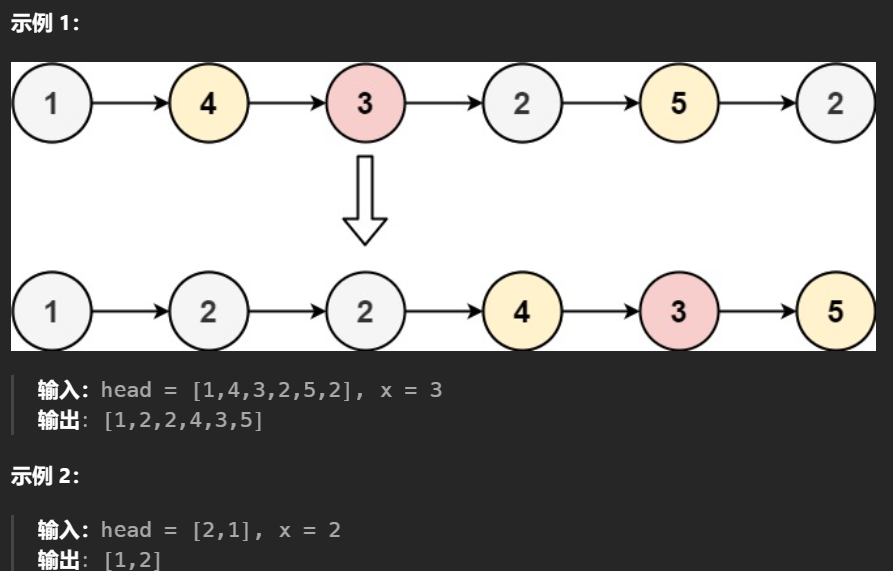

2024.11.10 查看题解，思路如下，由于要保证相对位置不变，所以将链表拆分为两个，一个为小于x一个为大于x，最后将第一个链表的尾接在第二个链表的头部即可

```C#
/**
 * Definition for singly-linked list.
 * public class ListNode {
 *     public int val;
 *     public ListNode next;
 *     public ListNode(int val=0, ListNode next=null) {
 *         this.val = val;
 *         this.next = next;
 *     }
 * }
 */
public class Solution {
    public ListNode Partition(ListNode head, int x) {
        ListNode dummyHead1 = new ListNode(-1,head);
        ListNode dummyHead2 = new ListNode(-1,head);
        ListNode curr=head,curr1=dummyHead1,curr2=dummyHead2;
        while(head != null){
            if(head.val<x){
                curr1.next=head;
                curr1 = curr1.next;
            }else{
                curr2.next=head;
                curr2 = curr2.next;
            }
            head = head.next;
            // ListNode tmp = head.next; 
            // head.next=null;
            // head = tmp;
        }
        if(curr1.next!=null) curr1.next=null;
        if(curr2.next!=null) curr2.next=null;
        curr1.next=dummyHead2.next;
        return dummyHead1.next;
    }
}
```

这里要注意两个链表拆分完的时候由于最后一个节点tail的前一个节点pre之间存在键，会导致dummy1和dummy2之间是半连接(半环)的状态，此时如果直接将第一个链表尾连接第二个链表头后出现一个完整的环。

解决办法有两个：

1. head后移前用tmp记录head.next，完全切断head后面的键后再更新head，保证dummy1和dummy2末尾永远是null
2. head移动到null后手动切开dummy1和dummy2末尾，若存在键则都赋值为null，再将第一个链表尾连接第二个链表头

### [82. 删除排序链表中的重复元素 II](https://leetcode.cn/problems/remove-duplicates-from-sorted-list-ii/) 24-11.12

给定一个已排序的链表的头 `head` ， *删除原始链表中所有重复数字的节点，只留下不同的数字* 。返回 *已排序的链表* 。

2024.11.12 题解中的双指针使用pre，curr跳过重复元素，curr找到第一个不与下一个重复的节点，pre连接后跳过重复部分，更新curr

```C#
/**
 * Definition for singly-linked list.
 * public class ListNode {
 *     public int val;
 *     public ListNode next;
 *     public ListNode(int val=0, ListNode next=null) {
 *         this.val = val;
 *         this.next = next;
 *     }
 * }
 */
public class Solution {
    public ListNode DeleteDuplicates(ListNode head) {
        ListNode dummyHead = new ListNode(-101,head);
        ListNode pre=dummyHead,curr=head;
        while(curr!=null && curr.next!=null){
            //发现curr与下一个重复
            if(curr.next!=null && curr.val == curr.next.val){ 
                //一直移动curr直至不与下一个重复
                while(curr.next!=null && curr.val == curr.next.val){
                    curr=curr.next; 
                }
                //连接被跳过的节点
                pre.next=curr.next;
                curr=pre.next;
            }else{
                pre=pre.next;
                curr=curr.next;
            }
        }
        return dummyHead.next;
    }
}
```


我的解法：

使用递归，递归的返回结果为去除重复元素的链表头，函数过程中找到第一个不重复的节点curr，curr->next = Func(curr->next)，不断地将去除了重复元素的表头连接到外层

```C++
/**
 * Definition for singly-linked list.
 * struct ListNode {
 *     int val;
 *     ListNode *next;
 *     ListNode() : val(0), next(nullptr) {}
 *     ListNode(int x) : val(x), next(nullptr) {}
 *     ListNode(int x, ListNode *next) : val(x), next(next) {}
 * };
 */
class Solution {
public:

    ListNode* deleteDuplicates(ListNode* head) {
        if(head==nullptr) return head;
        //如果head后是重复元素则找head后面第一个不重复的
        if(head->next!=nullptr && head->val == head->next->val){
            //跳过重复元素
            while(head->next!=nullptr && head->val == head->next->val){
                head = head -> next;
            }
            //此时head为第一个不重复的元素，递归处理以head->next为头的链表
            // return deleteDuplicates(head->next);
        }
        //处理完最底层后，head为
        head->next = deleteDuplicates(head->next);
        return head;
    }
};
```

### [1836. 从未排序的链表中移除重复元素 ](https://labuladong.online/algo/problem-set/linkedlist-two-pointers/#slug_remove-duplicates-from-an-unsorted-linked-list) 24-11.12

给定一个链表的第一个节点 `head` ，找到链表中所有出现**多于一次**的元素，并删除这些元素所在的节点。返回删除后的链表。

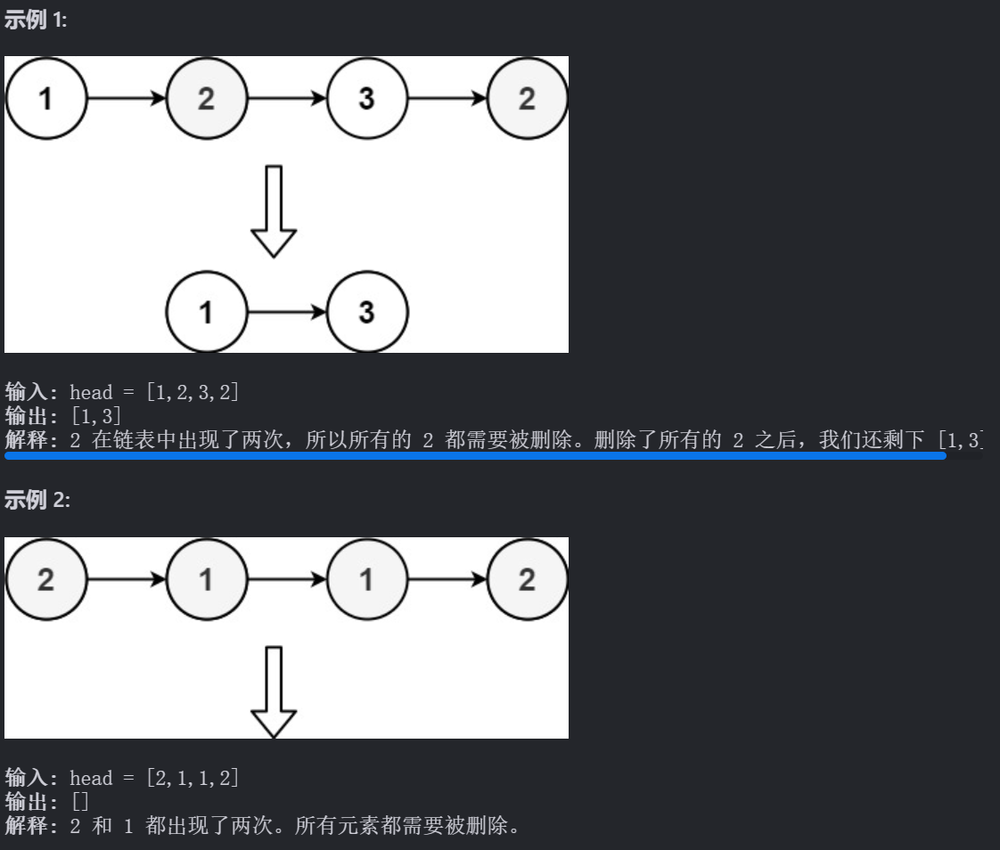

```C#
public class Solution
{
    public ListNode GetIntersectionNode(ListNode head)
    {
        ListNode dummyHead = new ListNode(-1, head);
        ListNode curr = head,pre= dummyHead;
        Dictionary<int,int> dic = new Dictionary<int, int> ();
        //求所有数值出现的次数
        while(curr != null)
        {
            if (dic.ContainsKey(curr.val))
            {
                dic[curr.val]++;
            }
            else
            {
                dic[curr.val] = 1;
            }
            curr = curr.next;
        }
        curr = head;
        //剔除重复的元素
        while (curr != null)
        {
            curr = pre.next;
            while (dic[curr.val] > 1) //跳出循环时curr为不重复的节点
            {
                curr = curr.next;
            }
            pre.next = curr; //通过pre去除中间重复的
            pre = pre.next;
        }
        return dummyHead.next;
    }
}
```


## 3、查找链表

### [19. 删除链表的倒数第 N 个结点](https://leetcode.cn/problems/remove-nth-node-from-end-of-list/) 24-11.11

给你一个链表，删除链表的倒数第 `n` 个结点，并且返回链表的头结点。

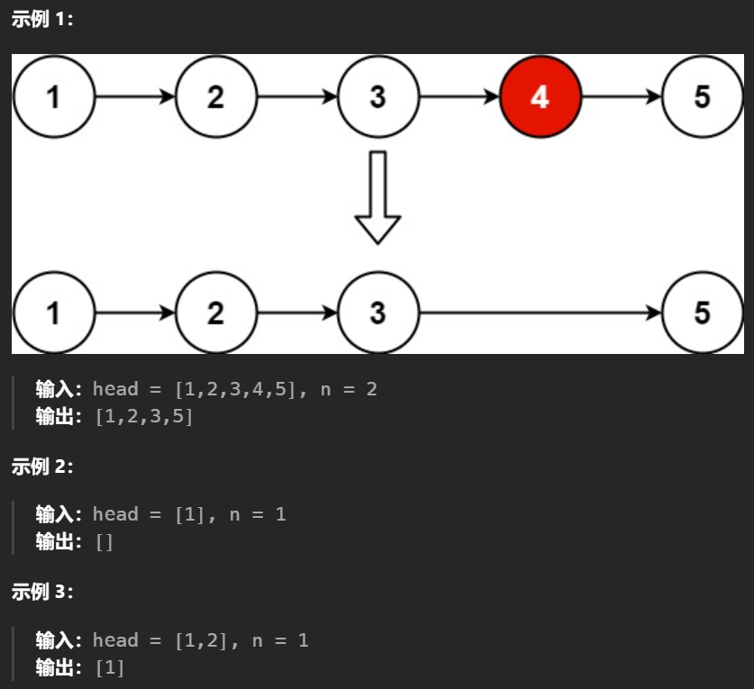

```C++
/**
 * Definition for singly-linked list.
 * struct ListNode {
 *     int val;
 *     ListNode *next;
 *     ListNode() : val(0), next(nullptr) {}
 *     ListNode(int x) : val(x), next(nullptr) {}
 *     ListNode(int x, ListNode *next) : val(x), next(next) {}
 * };
 */
class Solution {
public:
    ListNode* removeNthFromEnd(ListNode* head, int n) {
        ListNode *p, *q, *r;
        q = head;
        p = head;
        for (int i = 0; i < n; i++) {
            p = p -> next;
        }
        if (p == NULL) {
            return q -> next;
        }
        while (p -> next) {
            p = p -> next;
            q = q -> next;
            
        }
        q -> next = q -> next->next;
        return head;
    }
};
```

优化

```C#
/**
 * Definition for singly-linked list.
 * public class ListNode {
 *     public int val;
 *     public ListNode next;
 *     public ListNode(int val=0, ListNode next=null) {
 *         this.val = val;
 *         this.next = next;
 *     }
 * }
 */
public class Solution {
    public ListNode RemoveNthFromEnd(ListNode head, int n) {
        ListNode dummyHead = new ListNode(-1,head);
        ListNode pre = findFromEnd(dummyHead,n+1);
        pre.next = pre.next.next;
        return dummyHead.next;
    }
    private ListNode findFromEnd(ListNode head, int k) {
        //fast 走到最后一个节点，slow走到倒数N-1，删除N节点即可
        ListNode fast = head,slow = head;
        //fast先走N步，始终和slow保持N-1个节点
        for(int i = 0;i<k;i++){
            fast = fast.next;
        }
        while(fast!=null){
            slow = slow.next;
            fast = fast.next;
        }
       
        return slow;
    }
}
```

### [876. 链表的中间结点](https://leetcode.cn/problems/middle-of-the-linked-list/) 24-11.11

给你单链表的头结点 `head` ，请你找出并返回链表的中间结点。

如果有两个中间结点，则返回第二个中间结点。

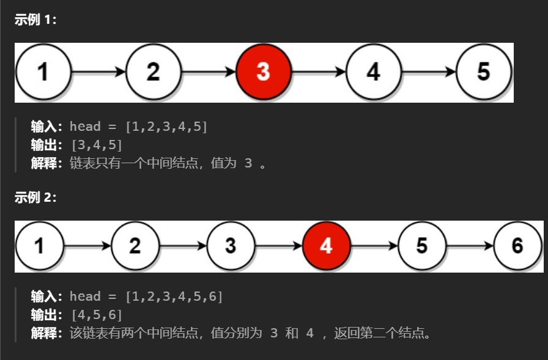

2024.11.11 无需题解直接想出来的，很简单。中点正好和快慢指针的思路契合，快指针走两步，慢指针走一步，当快指针走到最后一个节点/null时slow为中点

```C#
/**
 * Definition for singly-linked list.
 * public class ListNode {
 *     public int val;
 *     public ListNode next;
 *     public ListNode(int val=0, ListNode next=null) {
 *         this.val = val;
 *         this.next = next;
 *     }
 * }
 */
public class Solution {
    public ListNode MiddleNode(ListNode head) {
        ListNode slow=head,fast=head;
        while(fast!=null && fast.next!=null ){
            fast = fast.next.next;
            slow = slow.next;
        }
        return slow;
    }
}
```

### [141. 环形链表](https://leetcode.cn/problems/linked-list-cycle/) 24-11.11

给你一个链表的头节点 `head` ，判断链表中是否有环。

如果链表中有某个节点，可以通过连续跟踪 `next` 指针再次到达，则链表中存在环。 为了表示给定链表中的环，评测系统内部使用整数 `pos` 来表示链表尾连接到链表中的位置（索引从 0 开始）。**注意：`pos` 不作为参数进行传递** 。仅仅是为了标识链表的实际情况。

*如果链表中存在环* ，则返回 `true` 。 否则，返回 `false` 。

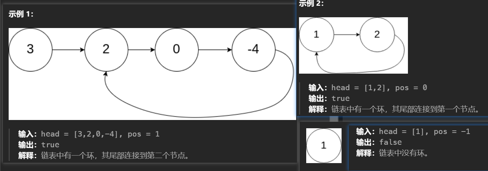

这里同上个解法，使用快慢指针，做一个循环让fast slow一直循环，如果二者相遇则说明存在环。需要注意的是fast走两步，while循环中肯定是fast先遇到null，而且fast更新是用next.next所以fast.next不能为null

```C++
/**
 * Definition for singly-linked list.
 * public class ListNode {
 *     public int val;
 *     public ListNode next;
 *     public ListNode(int x) {
 *         val = x;
 *         next = null;
 *     }
 * }
 */
public class Solution {
    public bool HasCycle(ListNode head) {
        ListNode slow=head,fast=head;
        while(fast!=null && fast.next!=null){ 
            fast = fast.next.next;
            slow = slow.next;
            if(fast == slow) return true;
        }
        return false;
    }
}
```

### [142. 环形链表 II](https://leetcode.cn/problems/linked-list-cycle-ii/) 24-11.12

给定一个链表的头节点  `head` ，返回链表开始入环的第一个节点。 *如果链表无环，则返回 `null`。*

如果链表中有某个节点，可以通过连续跟踪 `next` 指针再次到达，则链表中存在环。 为了表示给定链表中的环，评测系统内部使用整数 `pos` 来表示链表尾连接到链表中的位置（**索引从 0 开始**）。如果 `pos` 是 `-1`，则在该链表中没有环。**注意：`pos` 不作为参数进行传递**，仅仅是为了标识链表的实际情况。

**不允许修改** 链表。

2024.11.12 没看题解直接想出来的，找到环的入口，环的入口是第一个被遍历到两次的节点，所以问题就变为找到第一个出现两次的节点。C#中使用Dictionary做标记就可以了。

```C#
/**
 * Definition for singly-linked list.
 * public class ListNode {
 *     public int val;
 *     public ListNode next;
 *     public ListNode(int x) {
 *         val = x;
 *         next = null;
 *     }
 * }
 */
public class Solution {
    public ListNode DetectCycle(ListNode head) {
        ListNode curr = head;
        Dictionary<ListNode, int> dic = new Dictionary<ListNode, int>();
        while (curr != null)
        {
            if (!dic.ContainsKey(curr))
            {
                dic.Add(curr, 1);
            }
            else
            {
                dic[curr]++;
                return curr;
            }
            curr = curr.next;
        }
        return null;
    }
}
```

做完发现速度不够快，看了题解发现可以用双指针降低空间复杂度，如下图最后会变为求k-m，位置刚好等于fast从相遇点到环起点的位置，也就是说当二者相遇的时候，slow回到head，fast间隔改为1，二者再次相遇的位置就是环起点

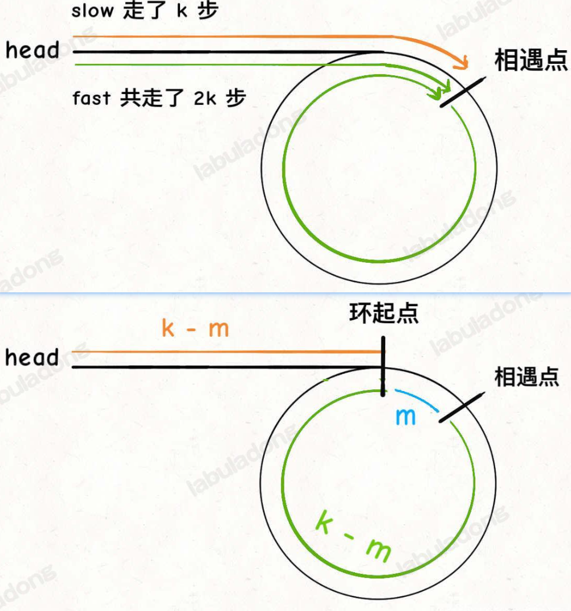

```C#
/**
 * Definition for singly-linked list.
 * public class ListNode {
 *     public int val;
 *     public ListNode next;
 *     public ListNode(int x) {
 *         val = x;
 *         next = null;
 *     }
 * }
 */
public class Solution {
    public ListNode DetectCycle(ListNode head) {
        ListNode slow = head,fast=head;
        //找第一次的交点
        while (fast != null &&fast.next!=null)
        {
           fast = fast.next.next;
           slow = slow.next;
           if(fast==slow) break;
        }
        // fast 遇到空指针说明没有环
        if (fast == null || fast.next == null) {
            return null;
        }
        // 重新指向头结点
        slow = head;
        // 快慢指针同步前进,slow从head走的水平距离=fast从相遇点到环起点的距离
        while (slow != fast) {
            fast = fast.next;
            slow = slow.next;
        }
        return slow;
    }
}
```

### [160. 相交链表](https://leetcode.cn/problems/intersection-of-two-linked-lists/) 24-11.12

给你两个单链表的头节点 `headA` 和 `headB` ，请你找出并返回两个单链表相交的起始节点。如果两个链表不存在相交节点，返回 `null` 。

图示两个链表在节点 `c1` 开始相交**：**

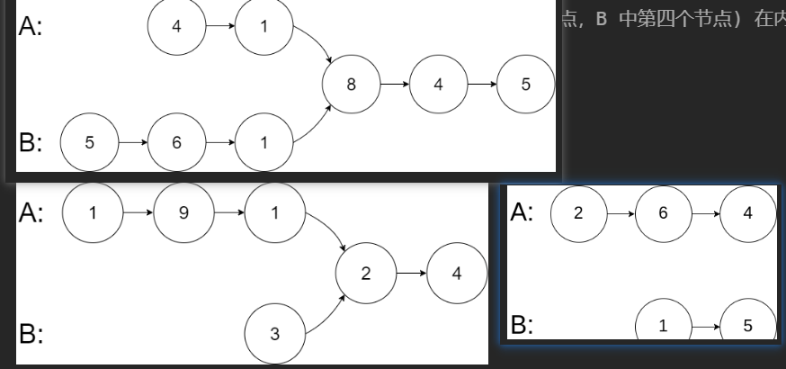

2024.11.12 未看题解一次性做出，跟我第一种判断环的位置思路一样，当一个节点被第二次遍历到则说明为交点，这里用了HashSet做了优化，先将第一条全部插入再用第二条判断是否有交点。

需要注意的是不能将两个部分写到一个while循环中，因为当其中一个到达null时若另外一个还未到达交点则会返回无交点。

```C#
/**
 * Definition for singly-linked list.
 * public class ListNode {
 *     public int val;
 *     public ListNode next;
 *     public ListNode(int x) { val = x; }
 * }
 */
public class Solution {
    public ListNode GetIntersectionNode(ListNode headA, ListNode headB) {
        ListNode currA = headA, currB = headB;
        HashSet<ListNode> hashSet = new HashSet<ListNode>();
        while (currA != null)
        {
            hashSet.Add(currA);
            currA = currA.next;
        }
        while (currB != null)
        {
            if (!hashSet.Contains(currB))
            {
                hashSet.Add(currB);
            }
            else
            {
                return currB;
            }
            currB = currB.next;
        }
        return null;
    }
}
```

看了题解发现可以不用开辟空间，使用双指针做（具体如下图）

如果用两个指针 `p1` 和 `p2` 分别在两条链表上前进，并不能**同时**走到公共节点，也就无法得到相交节点 `c1`。

**解决这个问题的关键是，通过某些方式，让 `p1` 和 `p2` 能够同时到达相交节点 `c1`**。

所以，我们可以让 `p1` 遍历完链表 `A` 之后开始遍历链表 `B`，让 `p2` 遍历完链表 `B` 之后开始遍历链表 `A`，这样相当于「逻辑上」两条链表接在了一起。

如果这样进行拼接，就可以让 `p1` 和 `p2` 同时进入公共部分，也就是同时到达相交节点 `c1`：

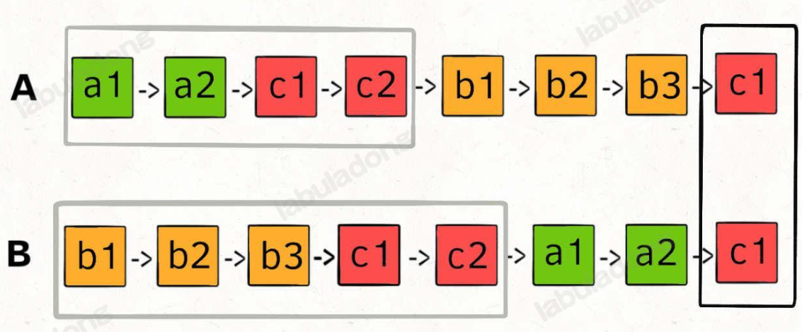

空间复杂度为 O(1)，时间复杂度为 O(N)

```C#
/**
 * Definition for singly-linked list.
 * public class ListNode {
 *     public int val;
 *     public ListNode next;
 *     public ListNode(int x) { val = x; }
 * }
 */
public class Solution {
    public ListNode GetIntersectionNode(ListNode headA, ListNode headB) {
        ListNode currA = headA, currB = headB;
        //当其中一条走到末尾则接上另外一条，当都接上后二者相遇的节点为交点
        while(currA!=currB){
            if(currA==null) currA=headB;
            else currA=currA.next;
            if(currB==null) currB=headA;
            else currB=currB.next;
        }
        return currA;
    }
}
```

## 3、反转链表

### [92. 反转链表 II](https://leetcode.cn/problems/reverse-linked-list-ii/) 24-11.12

给你单链表的头指针 `head` 和两个整数 `left` 和 `right` ，其中 `left <= right` 。请你反转从位置 `left` 到位置 `right` 的链表节点，返回 **反转后的链表** 

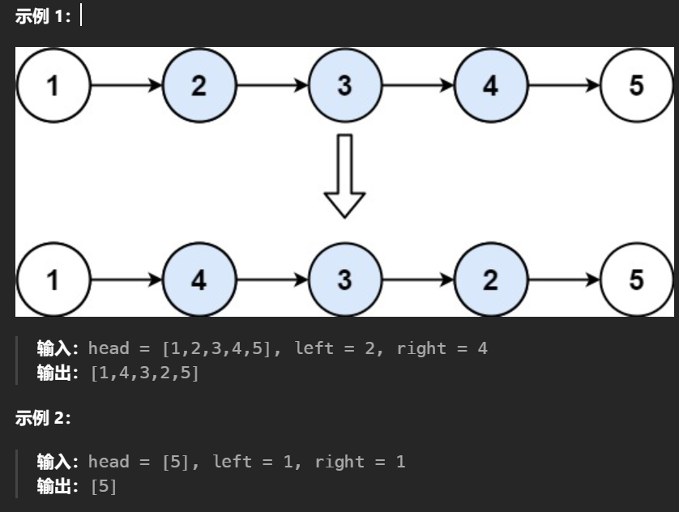

我的解法：找到 left 的前一个节点 pre ，curr从第二个元素开始不断头插法插入left前面，直至curr=right指向的元素

```C++
/**
 * Definition for singly-linked list.
 * public class ListNode {
 *     public int val;
 *     public ListNode next;
 *     public ListNode(int val=0, ListNode next=null) {
 *         this.val = val;
 *         this.next = next;
 *     }
 * }
 */
public class Solution {
    public ListNode ReverseBetween(ListNode head, int left, int right) {
        ListNode dummyHead = new ListNode(-1,head);
        ListNode pre = dummyHead,ne=null,curr=null;
        for(int i=0;i<left-1;i++) pre = pre.next; //位置2走1步
        curr=pre.next;
        for(int i = 0;i<right-left;i++){ //除第一个元素其他元素头插法
            ne=curr.next; 
            curr.next=ne.next;
            ne.next=pre.next; //这样写是不对的 ne.next=curr;
            pre.next=ne;
        }
        return dummyHead.next;
    }
}
```

优化解法（待分析）：

```C++
/**
 * Definition for singly-linked list.
 * struct ListNode {
 *     int val;
 *     ListNode *next;
 *     ListNode() : val(0), next(nullptr) {}
 *     ListNode(int x) : val(x), next(nullptr) {}
 *     ListNode(int x, ListNode *next) : val(x), next(next) {}
 * };
 */
class Solution {
public:
    ListNode* reverseBetween(ListNode* head, int left, int right) {
        ListNode stDummy(0);
        stDummy.next = head;
        auto p =  &stDummy;
        int iLeftPos = left - 1;
        while(iLeftPos--)
        {
            p = p->next;
        }
        
        auto pPrev = p;
        ListNode* pMidd = pPrev->next;
        ListNode* pNext;
        int iCount = right - left;
        for(int i = 0; i < iCount; ++i)
        {
            pNext = pMidd->next;
            pMidd->next = pNext->next;
            pNext->next = pPrev->next;
            pPrev->next = pNext;
        }
        return stDummy.next;
    }
};
```

##  5、回文链表

### [234. 回文链表](https://leetcode.cn/problems/palindrome-linked-list/) 24-11.13

给你一个单链表的头节点 `head` ，请你判断该链表是否为回文链表。如果是，返回 `true` ；否则，返回 `false` 。

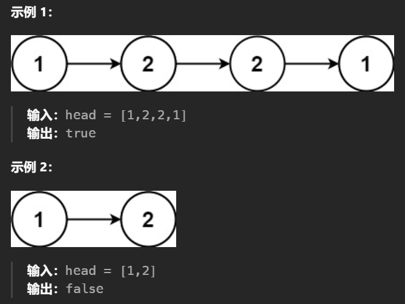

2024.11.13 第一次解会想着在slow找到中点时顺便把左半边放入list，使用list.Reverse()翻转数值后，依次与slow.val比较，直至slow走到最后，就可以判断出来是否是回文链表了

```C#
/**
 * Definition for singly-linked list.
 * public class ListNode {
 *     public int val;
 *     public ListNode next;
 *     public ListNode(int val=0, ListNode next=null) {
 *         this.val = val;
 *         this.next = next;
 *     }
 * }
 */
public class Solution {
    public bool IsPalindrome(ListNode head) {
        List<int> map  = new List<int>();
        ListNode slow = head,fast =head;
        //找中点
        while(fast!=null && fast.next!=null){
            map.Add(slow.val);
            slow = slow.next;
            fast = fast.next.next;
        }
        if(fast!=null) slow = slow.next;
        map.Reverse();
        int i = 0;
        while(slow!=null){
            if(slow.val!=map[i++]) return false;
            slow = slow.next;
        }
        return true;
    }
}
```

2024.11.13看了题解，发现可以通过翻转链表的方式将右半部分回文的部分翻为正序的，翻转我直接想到了昨天写的头插法，是可以做出来的但是效率有点低。看了翻转的方法发现可以直接扭转指针的指向，此方法操作的节点会变少所以更快一些，具体效率如下图

```C#
/**
 * Definition for singly-linked list.
 * public class ListNode {
 *     public int val;
 *     public ListNode next;
 *     public ListNode(int val=0, ListNode next=null) {
 *         this.val = val;
 *         this.next = next;
 *     }
 * }
 */
public class Solution {
    //翻转从head开始所有的节点（速度更快）
    public ListNode Reverse(ListNode head){
        ListNode pre = null,curr = head,ne;
        while(curr!=null){
            ne = curr.next;
            curr.next = pre;
            pre =curr;
            curr = ne;
        }
        return pre;
    }
    //头插法 翻转从head开始所有的节点
    public ListNode Reverse2(ListNode head){
        ListNode pre = new ListNode(-1,head);
        ListNode curr = head,ne;
        while(curr!=null && curr.next!=null){
            ne = curr.next;
            curr.next = ne.next;
            ne.next = pre.next;
            pre.next=ne;
        }
        return pre.next;
    }
    public bool IsPalindrome(ListNode head) {
        ListNode slow=head,fast=head;
        while(fast!=null && fast.next!=null){
            slow = slow.next;
            fast = fast.next.next;
        }
        if(fast != null) slow = slow.next; //奇数个节点slow多移一位
        //右半边翻转，起点变为right
        ListNode left = head;
        ListNode right = Reverse(slow);
        while(right!=null){
            if(left.val != right.val) return false;
            right = right.next;
            left = left.next;
        }
        return true;
    }
}
```

解法的效率如下：

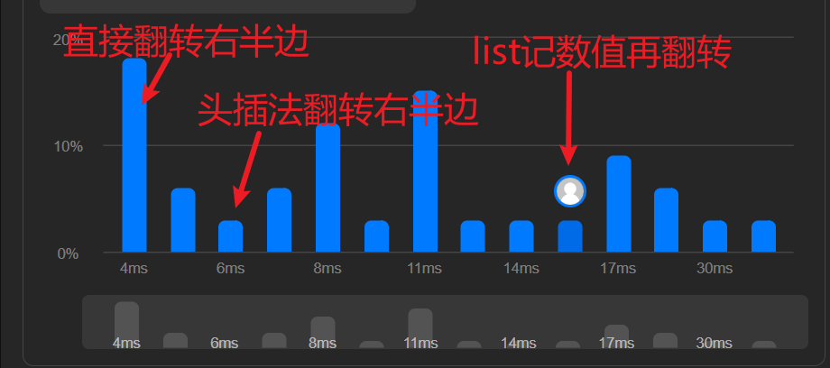
