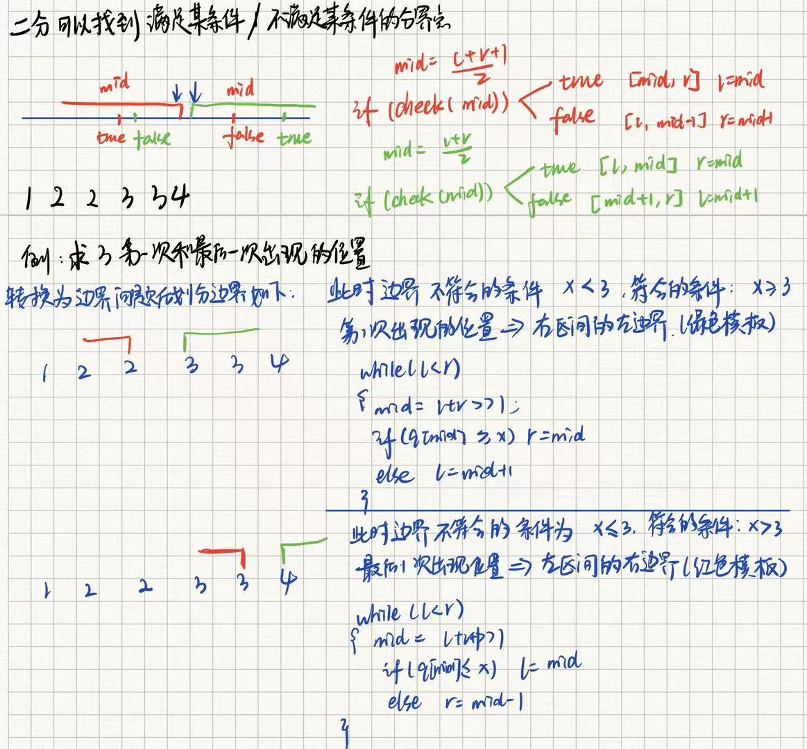

## 1、二分模板

用二分去查找元素要求数组的有序性或者拥有类似于有序的性质，二分可以找到满足某条件的分界点，二分应用有下面这四种情况：

- 找>=数的第一个位置（满足某个条件的第一个数）
- 找<=数的最后一个数（满足某个条件的最后一个数）
- 查找最大值（满足该边界的右边界）
- 查找最小值（满足该边界的左边界）

原题链接：

​	789. 数的范围：https://www.acwing.com/problem/content/791/

此题目的是找到x第一次出现和最后一次出现的下标，x第一次出现转换为找到 >= x的第一个数，x最后一次出现转换为找到 <= x 的最后一个数 （分析如下）



模板代码：

```C++
#include <iostream>
using namespace std;
const int N = 1e5 + 10;
int q[N];
//1 2 2 3 3 4
// 找左边的右边界值
int SL(int l, int r, int x) {
	while (l<r)
	{
		int mid = l + r >> 1;
		if (q[mid] >= x) r = mid;
		else l = mid + 1;
	}
	return l;
}
// 找右边的左边界值
int SR(int l, int r, int x) {
	while (l < r)
	{
		int mid = l + r +1>> 1;
		if (q[mid] <= x) l = mid;
		else r = mid - 1;
	}
	return r;
}
int main()
{
	int n, m;
	scanf("%d %d", &n, &m);
	for (int i = 0; i < n; i++) {
		scanf("%d", &q[i]);
	}
	while (m--) {
		int x;
		scanf("%d", &x);
		int l = SL(0, n - 1, x);
		if (q[l] != x) printf("-1 -1\n");
		else {
			printf("%d %d\n", l, SR(0, n - 1, x));
		}
	}
}
```

## 2、1221. 四平方和

https://www.acwing.com/file_system/file/content/whole/index/content/4184156/

在竞赛中，一般认为计算机1秒能执行 $$5 × 10^8$$ 次计算。本来，我们需要枚举 a, b, c , d四个数字，因为第四个数字可以计算出来，所以至少需要三重循环，即 $$O(n^3)$$，但是这肯定是要超时的，所以就想办法优化循环的次数

一个比较好的思路是把三重循环拆成两次二重循环。在第一次二重循环中，计算一下$$c^2+d^2$$,然后记录下来，在第二次对a和b的循环中可以直接使用，而不需要再次计算。如此一来，时间复杂度就被大大的简化了。


```C++
#include<bits/stdc++.h>
using namespace std;
const int N = 5e6 + 10;

//构造一个类，存储c、d、c+d，重写<符号，先比较s，在比较c，最后比较d
struct CDSum {
	int c, d, s;
	bool operator < (const CDSum &t) const {
		if (s != t.s) return s < t.s;
		if (c != t.c) return c < t.c;
		return d < t.d;
	}
};

int n;
CDSum record[N * 2];

int main() {
	scanf("%d", &n);
	int m = 0;
	//遍历所有c、d的组合(保证d>=c)
	for (int c = 0; c * c <= n; c++) {
		for (int d = c; c * c + d * d <= n; d++) {
			record[m++] = {  c,d,c * c + d * d };
		}
	}
	//按照cd平方和从小到大排序
	sort(record, record + m);
	//根据c、d的组合遍历a、b的组合
	for (int a = 0; a * a <= n; a++) {
		for (int b = a; a * a + b * b <= n; b++) {
			int x = n - a * a - b * b; //c*c+d*d之和
			int l = 0, r = m - 1;
			while (l<r)
			{
				int mid = l + r >> 1;
				if (record[mid].s >= x) r = mid;
				else l = mid + 1;
			}
			if (record[r].s == x) {
				printf("\n%d %d %d %d", a, b, record[r].c, record[r].d);
				return 0;
			}
		}
	}
	//printf("%d %d %d %d", a,b,c,d);
	return 0;
}
```

参考文章：手动哈希的方法见链接

https://www.acwing.com/solution/content/90665/


## 3、1227. 分巧克力

https://www.acwing.com/file_system/file/content/whole/index/content/4184162/

## 4、730. 机器人跳跃问题

https://www.acwing.com/file_system/file/content/whole/index/content/4183854/

## 5、1236. 递增三元组

https://www.acwing.com/file_system/file/content/whole/index/content/4184171/

## 6、P1902 刺杀大使

https://www.luogu.com.cn/problem/P1902

## 7、P2678 [NOIP2015 提高组] 跳石头

https://www.luogu.com.cn/problem/P2678