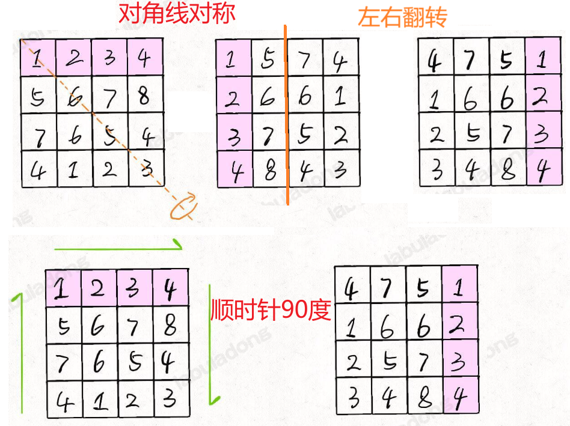

# 1、双指针

双指针技巧主要分为两类：**左右指针**和**快慢指针**。

- 左右指针，就是两个指针相向而行或者相背而行
- 快慢指针，就是两个指针同向而行，一快一慢

## 1.1 快慢指针

### 原地修改

#### [26. 删除有序数组中的重复项](https://leetcode.cn/problems/remove-duplicates-from-sorted-array/) 24-11.13

给你一个 **非严格递增排列** 的数组 `nums` ，请你**[ 原地](http://baike.baidu.com/item/原地算法)** 删除重复出现的元素，使每个元素 **只出现一次** ，返回删除后数组的新长度。元素的 **相对顺序** 应该保持 **一致** 。然后返回 `nums` 中唯一元素的个数。

考虑 `nums` 的唯一元素的数量为 `k` ，你需要做以下事情确保你的题解可以被通过：

- 更改数组 `nums` ，使 `nums` 的前 `k` 个元素包含唯一元素，并按照它们最初在 `nums` 中出现的顺序排列。`nums` 的其余元素与 `nums` 的大小不重要。
- 返回 `k` 。


2024.11.13 这个题好像之前做过，left指针按顺序遍历，right一直移动直至right与right+1指向不同的元素，此时left指向的值 = right指向的值，right = right + 1；

```C#
public class Solution {
    public int RemoveDuplicates(int[] nums) {
        int left = 0, right = 0;
        for (; right < nums.Length - 1; left++)
        {
            //num[right]!=num[right+1]时跳出循环
            while (right + 1 < nums.Length - 1 && nums[right] == nums[right + 1])
                right++;
            nums[left] = nums[right++];
        }
        //处理最后一个值，若与left前一个指向的不同则保存
        if (left > 0 && nums[--left] != nums[right])
            nums[++left] = nums[right];
        return left + 1;
    }
}
```

需要注意的是最后一值的判断，跳出循环时left已经是最终结果的长度了，但此时还没有判断最后一个元素，也就是 nums[right] ，所以此时–left 才能作为下标进行比较，若不同则放入结果。

2024.11.13 看了题解发现自己思路是对的，但是实现又做麻烦了。不需要用right与right+1判断重复，可以利用left指向的值来判断呀，就像上面解法判断最后一个节点时那样！

```C#
public class Solution {
    public int RemoveDuplicates(int[] nums) {
        int left = 0, right = 0;
        while(fast < nums.Length){
            if(nums[left]!=nums[right]) { //将nums[right]加入结果集中
                slow++; 
                nums[left] = nums[right];
            }
            right ++;
        }
        return left + 1;
    }
}
```

#### [27. 移除元素](https://leetcode.cn/problems/remove-element/) 24-11.13

给你一个数组 `nums` 和一个值 `val`，你需要 **[原地](https://baike.baidu.com/item/原地算法)** 移除所有数值等于 `val` 的元素。元素的顺序可能发生改变。然后返回 `nums` 中与 `val` 不同的元素的数量。

假设 `nums` 中不等于 `val` 的元素数量为 `k`，要通过此题，您需要执行以下操作：

- 更改 `nums` 数组，使 `nums` 的前 `k` 个元素包含不等于 `val` 的元素。`nums` 的其余元素和 `nums` 的大小并不重要。
- 返回 `k`。

2024.11.13 看了题解，当right遇到不为val的赋值给left，left左移，其他情况则fast后移，不做操作

```C#
public class Solution {
    public int RemoveElement(int[] nums, int val) {
        int left = 0,right = 0,tmp=0;
        while(right<nums.Length){
            if(nums[right] != val){ //当right遇到不为val的赋值给left
                nums[left]=nums[right];
                left++; //left左移
            }
            right++; //其他情况则fast后移，不做操作
        }
        return left;
    }
}
```

这题像是上题的升级版，上题是删除多余的重复元素，此题是完全删除且数组的元素未排序

2025.2.7 重新做了一下这个题，发现可以用左右指针做，左指针为结果集，右指针向左探索可能的结果，在左右指针相交前如果左数!=val则左移，如果左数等于val则可看能否将右指针的值换过来

```C#
public class Solution {
    public int RemoveElement(int[] nums, int val) {
        int left = 0,right = nums.Length-1;
        while(left <= right){
            //当左指针不为val则右移
            if(nums[left]!=val) left ++; 
            //当左指针为val，右指针不为val则左右指针交换位置
            else if(nums[right]!=val) nums[left++] = nums[right--];
            //当左指针为val，右指针不为val则右指针左移
            else right --;
        }
        return left;
    }
}
```


#### [283. 移动零](https://leetcode.cn/problems/move-zeroes/) 24-11.13

给定一个数组 `nums`，编写一个函数将所有 `0` 移动到数组的末尾，同时保持非零元素的相对顺序。

**请注意** ，必须在不复制数组的情况下原地对数组进行操作。

2024.11.13 根据移除元素的思路，可以将此题改为将val=0的元素移除，并在后面补0就可以了

```C#
public class Solution {
    public void MoveZeroes(int[] nums) {
        int left = 0,right = 0;
        while(right<nums.Length){
            //当right遇到不为val的赋值给left
            if(nums[right] != 0){
                nums[left++] = nums[right];
            }
            //其他情况则fast后移，不做操作
            right++;
        }
        //剩余位置补0
        for(int i = left;i<nums.Length;i++)
            nums[i] = 0;
    }
}
```

2024.2.11 想到第二种方法：
遍历n次：left指向不为0，则右移；left为0时，用right找到第一个不为0的数并交换，left右移

```C#
public class Solution {
    public void MoveZeroes(int[] nums) {
        int left =0,right,n=nums.Length;
        for(int i=0;i<n;i++){
            right = left;
            if(nums[left]!=0) left++; //left指向不为0，则右移
            else{ //left为0时，用right找到第一个不为0的数并交换，left右移
                while(nums[right]==0 && right+1<n) right++;
                (nums[left], nums[right]) =( nums[right], nums[left]);
                left++;
            }
        }
    }
}
```


#### (PLUS)[80. 删除有序数组中的重复项 II](https://leetcode.cn/problems/remove-duplicates-from-sorted-array-ii/) 24-11.20

给你一个有序数组 `nums` ，请你**[ 原地](http://baike.baidu.com/item/原地算法)** 删除重复出现的元素，使得出现次数超过两次的元素**只出现两次** ，返回删除后数组的新长度。

不要使用额外的数组空间，你必须在 **[原地 ](https://baike.baidu.com/item/原地算法)修改输入数组** 并在使用 O(1) 额外空间的条件下完成。

**示例 1：**

```
输入：nums = [1,1,1,2,2,3]
输出：5, nums = [1,1,2,2,3]
解释：函数应返回新长度 length = 5, 并且原数组的前五个元素被修改为 1, 1, 2, 2, 3。 不需要考虑数组中超出新长度后面的元素。
```

**示例 2：**

```sql
输入：nums = [0,0,1,1,1,1,2,3,3]
输出：7, nums = [0,0,1,1,2,3,3]
解释：函数应返回新长度 length = 7, 并且原数组的前七个元素被修改为 0, 0, 1, 1, 2, 3, 3。不需要考虑数组中超出新长度后面的元素。
```

2024.11.20 第一次做思路大概对了，跟删除重复元素一样用fast去探查下一个可能放入的节点，可以放入（新数或出现次数<2）则slow++，再将fast的值赋值给slow的值。当是新数时需要将出现次数置为0，再Count++。

第一次思路几乎是对的，只不过在slow++与slow赋值搞反了，导致第一次放进去就出错了。`slow < fast && count < 2` 这里很关键，也就是二者重合的时候不会再放入，缺了这个判断就怎么也调不对。

```C#
public class Solution {
    public int RemoveDuplicates(int[] nums)
    {
        if(nums.Length==0) return 0;
        int slow = 0, fast = 0,count =0;
        while (fast < nums.Length)
        {
            //当fast值不等于slow说明是新数
            if (nums[fast] != nums[slow])
            {
                slow++;
                nums[slow] = nums[fast];
                count = 0; //初始化出现次数
            }
            //不是新数则判断当前此数出现次数是否小于2
            else if (slow < fast && count < 2)
            {
                slow++;
                nums[slow] = nums[fast];
            }
            fast++;
            count++; //无论是否加到slow中都要将当前数出现次数+1
        }
        return slow+1;
    }
}
```

### 滑动窗口

滑动窗口算法技巧主要用来解决子数组问题，比如让你寻找符合某个条件的最长/最短子数组

该算法的大致逻辑如下：

```C#
// 滑动窗口算法伪码框架
void slidingWindow(String s) {
    // 用合适的数据结构记录窗口中的数据，根据具体场景变通
    // 比如说，我想记录窗口中元素出现的次数，就用 map
    // 如果我想记录窗口中的元素和，就可以只用一个 int
    Object window = ...
    
    int left = 0, right = 0;
    while (right < s.length()) {
        // c 是将移入窗口的字符
        char c = s[right];
        window.add(c)
        // 增大窗口
        right++;
        // 进行窗口内数据的一系列更新
        ...

        // *** debug 输出的位置 ***
        // 注意在最终的解法代码中不要 print
        // 因为 IO 操作很耗时，可能导致超时
        printf("window: [%d, %d)\n", left, right);
        // ***********************

        // 判断左侧窗口是否要收缩
        while (left < right && window needs shrink) {
            // d 是将移出窗口的字符
            char d = s[left];
            window.remove(d)
            // 缩小窗口
            left++;
            // 进行窗口内数据的一系列更新
            ...
        }
    }
}
```

1、我们在字符串 `S` 中使用双指针中的左右指针技巧，初始化 `left = right = 0`，把索引**左闭右开**区间 `[left, right)` 称为一个「窗口」。

为什么要「左闭右开」区间?

> **理论上你可以设计两端都开或者两端都闭的区间，但设计为左闭右开区间是最方便处理的**。
>
> 因为这样初始化 `left = right = 0` 时区间 `[0, 0)` 中没有元素，但只要让 `right` 向右移动（扩大）一位，区间 `[0, 1)` 就包含一个元素 `0` 了。
>
> 如果你设置为两端都开的区间，那么让 `right` 向右移动一位后开区间 `(0, 1)` 仍然没有元素；如果你设置为两端都闭的区间，那么初始区间 `[0, 0]` 就包含了一个元素。这两种情况都会给边界处理带来不必要的麻烦。

2、我们先不断地增加 `right` 指针扩大窗口 `[left, right)`，直到窗口中的字符串符合要求（包含了 `T` 中的所有字符）。

3、此时，我们停止增加 `right`，转而不断增加 `left` 指针缩小窗口 `[left, right)`，直到窗口中的字符串不再符合要求（不包含 `T` 中的所有字符了）。同时，每次增加 `left`，我们都要更新一轮结果。

4、重复第 2 和第 3 步，直到 `right` 到达字符串 `S` 的尽头。

#### [76. 最小覆盖子串](https://leetcode.cn/problems/minimum-window-substring/) 24-11.14

给你一个字符串 `s` 、一个字符串 `t` 。返回 `s` 中涵盖 `t` 所有字符的最小子串。如果 `s` 中不存在涵盖 `t` 所有字符的子串，则返回空字符串 `""` 。

**注意：**

- 对于 `t` 中重复字符，我们寻找的子字符串中该字符数量必须不少于 `t` 中该字符数量。
- 如果 `s` 中存在这样的子串，我们保证它是唯一的答案。

**示例 1：**

```
输入：s = "ADOBECODEBANC", t = "ABC"
输出："BANC"
解释：最小覆盖子串 "BANC" 包含来自字符串 t 的 'A'、'B' 和 'C'。
```

**示例 2：**

```
输入：s = "a", t = "a"
输出："a"
解释：整个字符串 s 是最小覆盖子串。
```

**示例 3:**

```
输入: s = "a", t = "aa"
输出: ""
解释: t 中两个字符 'a' 均应包含在 s 的子串中，
因此没有符合条件的子字符串，返回空字符串。
```

初始化 `window` 和 `need` 两个哈希表，记录窗口中的字符和需要凑齐的字符：


```C#
// 记录 window 中的字符出现次数
Dictionary<char, int> window = new Dictionary<char, int>();
// 记录所需的字符出现次数
Dictionary<char, int> need = new Dictionary<char, int>();

// 填充 need 字典
for (int i = 0; i < t.Length; i++)
{
    char c = t[i];
    if (need.ContainsKey(c)) need[c]++;
    else need[c] = 1;
}

```

使用 `left` 和 `right` 变量初始化窗口的两端

right记录右边界，循环中执行right++，此时指向的元素c若为need中所需的元素，则将c移入window中，同时出现次数++，当次数变化时要判断`window[c]==need[c]`，相等则说明对于字符c来说出现次数达到标准即valid++；

若valid值==need.Count则说明所有字符出现次数都符合要求，判断是否能更新最终s中子串的长度length。此时 left++ 缩小范围，如果移除的元素d为need中的元素，则window[d] - -；当次数变化时要判断`window[d]==need[d]-1`，等于则说明对于字符c来说出现次数不再相等，即valid- -，当`window[d]==0`时就要将d移除window

2024.11.14 看了题解解答如下：

```C#
public class Solution {
    public string MinWindow(string s, string t) {
        Dictionary<char,int> window = new Dictionary<char,int>();
        Dictionary<char,int> need = new Dictionary<char,int>();
        //录入need字典
        foreach (var c in t)
        {
            PutValueIntoDic(need, c);
        }
        int left = 0,right = 0,valid = 0;
        int start = 0, length = int.MaxValue;
        while(right < s.Length)
        {
            // c为待移入的字符
            char c = s[right];
            //扩大窗口
            right++;
            // 新增的字符在need中，则更新窗口内数据
            if (need.ContainsKey(c)) 
            {
                PutValueIntoDic(window, c);
                if (window[c] == need[c]) valid++; //如果window和need中某字符出现的次数相同，说明此字符已经无需再验证
            }
            //当window中字符的个数都符合标准，那么需要更新结果+收缩left
            while (valid == need.Count) 
            {
                //更新结果
                if(right-left < length)
                {
                    length = right-left;
                    start = left;
                }
                //待移除字符
                char d = s[left];
                //缩小窗口
                left++;
                //移除的字符在need中，则更新窗口内的数据
                if(need.ContainsKey(d))
                {
                    if(window[d] == need[d]) valid--; //减之前相等则说明减以后一定不等
                    window[d] --;
                    if (window[d] == 0) //当window中 d 出现的次数=0 则移除元素
                    {
                        window.Remove(d);
                    }
                }
                
            }
        }
        return length == int.MaxValue?"":s.Substring(start,length);
    }
    public void PutValueIntoDic(Dictionary<char, int>dic,char val)
    {
        if (dic.ContainsKey(val)) dic[val]++;
        else dic[val] = 1;
    }
}
```

这样写的原因是针对同一个字符只有当其出现次数第一次从相等变为不等时，才操作valid--，所以减之前`if(window[d] == need[d]) valid--`

```C#
if(window[d] == need[d]) valid--; //减之前相等则说明减以后一定不等
window[d] --;
```

#### [567. 字符串的排列](https://leetcode.cn/problems/permutation-in-string/) 24-11.14

给你两个字符串 `s1` 和 `s2` ，写一个函数来判断 `s2` 是否包含 `s1` 的排列。如果是，返回 `true` ；否则，返回 `false` 。

换句话说，`s1` 的排列之一是 `s2` 的 **子串** 。

**示例 1：**

```
输入：s1 = "ab" s2 = "eidbaooo"
输出：true
解释：s2 包含 s1 的排列之一 ("ba").
```

**示例 2：**

```
输入：s1= "ab" s2 = "eidboaoo"
输出：false
```

2024.11.14看了题解才看懂题，s2中是否包含s1的全排列，说明s1打乱顺序且连续 的结果能在s2中找到，所以窗口中我们放入字符都为 s1 字符的，当窗口大于s1的长度则窗口缩小（在缩小前窗口已经遍历过可能的情况了，所以缩小窗口不会错过可能的解），窗口缩小时要判断window内的字符串`valid==s1.length`刚好移除后为解，return true；若不为解则更新window。

 ==相当给你一个 `S` 和一个 `T`，请问你 `S` 中是否存在一个子串，包含 `T` 中所有字符且不包含其他字符？==

```C#
public class Solution {
    public bool CheckInclusion(string t, string s) {
        Dictionary<char,int> need = new();
        Dictionary<char,int> window = new();
        foreach(var c in t){
            if(need.ContainsKey(c)) need[c]++;
            else need[c] = 1;
        }
        int left=0,right=0;
        int valid=0;
        while(right<s.Length){
            char c = s[right];
            right++;
            if(need.ContainsKey(c)){
                //添加到window中国
                if(window.ContainsKey(c)) window[c]++;
                else window[c] = 1;
                if(window[c] == need[c]) valid++;
            }
            //判断左窗口是否收缩
            while(right-left>=t.Length){
                if(valid==need.Count){ //符合条件的字符数覆盖t时返回true
                    return true;
                }
                char d = s[left];
                left++;
                if(need.ContainsKey(d)){ //缩小窗口后更新window
                    if(window[d] == need[d]) valid--;
                    window[d] --;
                    if(window[d] == 0) window.Remove(d);
                }
            }
        }
        return false;
    }
}
```

#### [438. 找到字符串中所有字母异位词](https://leetcode.cn/problems/find-all-anagrams-in-a-string/) 24-11.14

给定两个字符串 `s` 和 `p`，找到 `s` 中所有 `p` 的 **异位词** 的子串，返回这些子串的起始索引。不考虑答案输出的顺序。

**示例 1:**

```
输入: s = "cbaebabacd", p = "abc"
输出: [0,6]
解释:
起始索引等于 0 的子串是 "cba", 它是 "abc" 的异位词。
起始索引等于 6 的子串是 "bac", 它是 "abc" 的异位词。
```

 **示例 2:**

```sql
输入: s = "abab", p = "ab"
输出: [0,1,2]
解释:
起始索引等于 0 的子串是 "ab", 它是 "ab" 的异位词。
起始索引等于 1 的子串是 "ba", 它是 "ab" 的异位词。
起始索引等于 2 的子串是 "ab", 它是 "ab" 的异位词。
```

2024.11.14做了两个滑动窗口终于做对一个了！字符串的排列是一样的思路，但是此题需要返回出现的位置，字符串排列是返回true和false

```C#
public class Solution {
    public IList<int> FindAnagrams(string s, string p) {
        Dictionary<char,int> need = new ();
        Dictionary<char,int> window = new ();
        List<int> res = new ();
        foreach(var c in p){
            if(need.ContainsKey(c)) need[c]++;
            else need[c] = 1;
        }
        int left=0,right=0,valid=0,start=0;
        while(right<s.Length){
            char c = s[right];
            right++;
            if(need.ContainsKey(c)){
                if(window.ContainsKey(c)) window[c]++;
                else window[c] = 1;
                if(window[c] == need[c]) valid++;
            }
            //当窗口大于p长度则缩小窗口
            while(right-left>=p.Length){
                if(valid==need.Count) {
                    res.Add(left);
                }
                char d = s[left];
                left++;
                if(need.ContainsKey(d)){
                    if(need[d] == window[d]) valid --;
                    window[d]--;
                    if(window[d] == 0) window.Remove(d);
                }
            }
        }
        return res;
    }
}
```

#### [3. 无重复字符的最长子串](https://leetcode.cn/problems/longest-substring-without-repeating-characters/) 24-11.15

给定一个字符串 `s` ，请你找出其中不含有重复字符的 **最长** **子串**的长度。

**示例 1:**

```
输入: s = "abcabcbb"
输出: 3 
解释: 因为无重复字符的最长子串是 "abc"，所以其长度为 3。
```

**示例 2:**

```
输入: s = "bbbbb"
输出: 1
解释: 因为无重复字符的最长子串是 "b"，所以其长度为 1。
```

**示例 3:**

```sql
输入: s = "pwwkew"
输出: 3
解释: 因为无重复字符的最长子串是 "wke"，所以其长度为 3。
     请注意，你的答案必须是 子串 的长度，"pwke" 是一个子序列，不是子串。
```

2024.11.15 首次做题有点思路，此题也是划窗但是没有子串 t 了，所以一个window就够了，right不断右移当指向元素首次出现则移入window，非首次出现则++，窗口缩小的规则为新移入的元素非首次出现，left++，同时window[c] - -  ，left移动完成后才是可能的解长度，此时更新res'

但是res更新的位置写到了`while (window[c] > 1)`内部导致通过的测试用例不全，为 879 / 987 个

```C#
public class Solution {
    public int LengthOfLongestSubstring(string s) {
        Dictionary<char, int> window = new();
        int left = 0, right = 0;
        int res = 0;
        while (right < s.Length)
        {
            char c = s[right];
            right++;
            if (!window.ContainsKey(c))
            {
                window[c] = 1;
            }
            else
            {
                window[c]++;
            }
            while (window[c] > 1)
            {
                char d = s[left];
                left++;
                
                window[d]--;
            }
            res = Math.Max(res, right - left);
        }
        return res;
    }
}
```

## 1.2左右指针

### 二分查找

最常用的二分查找场景：寻找一个数、寻找左侧边界、寻找右侧边界。

二分查找框架（不要出现 else，而是把所有情况用 else if 写清楚，这样可以清楚地展现所有细节）

```C#
int binarySearch(int[] nums, int target) {
    int left = 0, right = ...; //每次进行搜索的区间：[left, right]左右闭区间

    while(...) {
        int mid = left + (right - left) / 2; //防溢出
        if (nums[mid] == target) {
            ...
        } else if (nums[mid] < target) {
            left = ...
        } else if (nums[mid] > target) {
            right = ...
        }
    }
    return ...;
}
```

#### 查找某个数： [704. 二分查找](https://leetcode.cn/problems/binary-search/) 24-11.15

给定一个 `n` 个元素有序的（升序）整型数组 `nums` 和一个目标值 `target` ，写一个函数搜索 `nums` 中的 `target`，如果目标值存在返回下标，否则返回 `-1`。
**示例 1:**

```
输入: nums = [-1,0,3,5,9,12], target = 9
输出: 4
解释: 9 出现在 nums 中并且下标为 4
```

**示例 2:**

```sql
输入: nums = [-1,0,3,5,9,12], target = 2
输出: -1
解释: 2 不存在 nums 中因此返回 -1
```

```C#
public class Solution {
    public int Search(int[] nums, int target) {
        int left = 0,right = nums.Length - 1;
        while(left <= right){
            int mid = left+(right-left)/2;
            if(nums[mid]==target) return mid;
            else if(nums[mid]>target) right=mid-1;
            else if(nums[mid]<target) left=mid+1;
        }
        return -1;
    }
}
```

为什么 while 循环的条件是 `<=` 而不是 `<`？

 while 循环的条件是 `<=` 是因为初始化 `right` 的赋值是 `nums.length - 1`，即最后一个元素的索引

`while(left < right)` 的终止条件是 `left == right`，写成区间的形式就是 `[right, right]`，或者带个具体的数字进去 `[2, 2]`，**这时候区间非空**，还有一个数 2，但此时 while 循环终止了。也就是说区间 `[2, 2]` 被漏掉了，索引 2 没有被搜索，如果这时候直接返回 -1 就是错误的。当然，如果你非要用 `while(left < right)` 也可以，我们已经知道了出错的原因，就打个补丁好了：

```sql
    // ...
    while(left < right) {
        // ...
    }
    return nums[left] == target ? left : -1;
```

#### 寻找左边界

```C#
int left_bound(int[] nums, int target) {
    int left = 0;
    int right = nums.length;// 注意
    while (left < right) {// 注意
        int mid = left + (right - left) / 2;
        if (nums[mid] == target) {
            right = mid;  // 注意
        } else if (nums[mid] < target) {
            left = mid + 1;
        } else if (nums[mid] > target) {
            right = mid; // 注意
        }
    }
    return left;
}
```

1、为什么 while 循环的条件是 `<=` 而不是 `<`？

`while(left < right)` 终止的条件是 `left == right`，此时搜索区间 `[left, left)` 为空，所以可以正确终止。

2、为什么该算法能够搜索左侧边界？

关键在于对于 `nums[mid] == target` 这种情况的处理：

```C#
if (nums[mid] == target) right = mid;
```

可见，找到 target 时不要立即返回，而是缩小「搜索区间」的上界 `right`，在区间 `[left, mid)` 中继续搜索，即不断向左收缩，达到锁定左侧边界的目的。

3、为什么 `left = mid + 1`，`right = mid` ？

因为我们的「搜索区间」是 `[left, right)` 左闭右开，所以当 `nums[mid]` 被检测之后，下一步应该去 `mid` 的左侧或者右侧区间搜索，即 `[left, mid)` 或 `[mid + 1, right)`。

4、为什么返回 `left` 而不是 `right`？

都是一样的，因为 while 终止的条件是 `left == right`。

#### 寻找右侧边界

```C#
int right_bound(int[] nums, int target) {
    int left = 0, right = nums.length;
    
    while (left < right) { // 注意
        int mid = left + (right - left) / 2;
        if (nums[mid] == target) {// 注意
            left = mid + 1;
        } else if (nums[mid] < target) {
            left = mid + 1;
        } else if (nums[mid] > target) {
            right = mid;
        }
    }
    return left - 1;// 注意
}
```

为什么返回 `left - 1`？

while 循环的终止条件是 `left == right`，所以 `left` 和 `right` 是一样的，你非要体现右侧的特点，返回 `right - 1` 好了。

#### 逻辑统一

```C#
int binary_search(int[] nums, int target) {
    int left = 0, right = nums.length - 1; 
    while(left <= right) {
        int mid = left + (right - left) / 2;
        if (nums[mid] < target) {
            left = mid + 1;
        } else if (nums[mid] > target) {
            right = mid - 1; 
        } else if(nums[mid] == target) {
            // 直接返回
            return mid;
        }
    }
    // 直接返回
    return -1;
}

int left_bound(int[] nums, int target) {
    int left = 0, right = nums.length - 1;
    while (left <= right) {
        int mid = left + (right - left) / 2;
        if (nums[mid] < target) {
            left = mid + 1;
        } else if (nums[mid] > target) {
            right = mid - 1;
        } else if (nums[mid] == target) {
            // 别返回，锁定左侧边界
            right = mid - 1;
        }
    }
    // 判断 target 是否存在于 nums 中
    if (left < 0 || left >= nums.length) {
        return -1;
    }
    // 判断一下 nums[left] 是不是 target
    return nums[left] == target ? left : -1;
}

int right_bound(int[] nums, int target) {
    int left = 0, right = nums.length - 1;
    while (left <= right) {
        int mid = left + (right - left) / 2;
        if (nums[mid] < target) {
            left = mid + 1;
        } else if (nums[mid] > target) {
            right = mid - 1;
        } else if (nums[mid] == target) {
            // 别返回，锁定右侧边界
            left = mid + 1;
        }
    }
    // 由于 while 的结束条件是 right == left - 1，且现在在求右边界
    // 所以用 right 替代 left - 1 更好记
    if (right < 0 || right >= nums.length) {
        return -1;
    }
    return nums[right] == target ? right : -1;
}
```

#### [34. 在排序数组中查找元素的第一个和最后一个位置](https://leetcode.cn/problems/find-first-and-last-position-of-element-in-sorted-array/) 24-11.17

```C#
public class Solution -{    public int[] SearchRange(int[] nums, int target) {
        int[] res = new int[2];
        res[0] = SearchLeft(nums,target);
        res[1] = SearchRight(nums,target);
        return res;
    }
    public int SearchLeft(int[] nums, int target){
        int[] res = new int[2];
        int l = 0,r=nums.Length-1;
        while(l<=r){
            int mid = (l+r) >> 1;
            if(nums[mid] == target){
              r = mid - 1;
            }
            else if(nums[mid]<target){
                l = mid + 1;
            }else if(nums[mid]>target){
                r = mid - 1;
            }
        }
        if (l < 0 || l >= nums.Length) {
            return -1;
        }
       return nums[l] == target ? l:-1;
    }
    public int SearchRight(int[] nums, int target){
        int[] res = new int[2];
        int l = 0,r=nums.Length-1;
        while(l<=r){
            int mid = (l+r) >> 1;
            if(nums[mid] == target){
              l = mid + 1;
            }
            else if(nums[mid]<target){
                l = mid + 1;
            }else if(nums[mid]>target){
                r = mid - 1;
            }
        }
        if (r < 0 || r >= nums.Length) {
            return -1;
        }
       return nums[r] == target ? r:-1;
    }
}
```

### n数之和

#### [167. 两数之和 II - 输入有序数组](https://leetcode.cn/problems/two-sum-ii-input-array-is-sorted/) 24-11.17

给你一个下标从 **1** 开始的整数数组 `numbers` ，该数组已按 **非递减顺序排列** ，请你从数组中找出满足相加之和等于目标数 `target` 的两个数。如果设这两个数分别是 `numbers[index1]` 和 `numbers[index2]` ，则 `1 <= index1 < index2 <= numbers.length` 。

以长度为 2 的整数数组 `[index1, index2]` 的形式返回这两个整数的下标 `index1` 和 `index2`。

**示例 1：**

```
输入：numbers = [2,7,11,15], target = 9
输出：[1,2]
解释：2 与 7 之和等于目标数 9 。因此 index1 = 1, index2 = 2 。返回 [1, 2] 。
```

**示例 2：**

```
输入：numbers = [2,3,4], target = 6
输出：[1,3]
解释：2 与 4 之和等于目标数 6 。因此 index1 = 1, index2 = 3 。返回 [1, 3] 。
```

**示例 3：**

```sql
输入：numbers = [-1,0], target = -1
输出：[1,2]
解释：-1 与 0 之和等于目标数 -1 。因此 index1 = 1, index2 = 2 。返回 [1, 2] 。
```

2024.11.17：未看题解：遍历其中一个数，另外一个数用二分去查，查到了且不等于当前数则找到了结果，返回

```C#
public class Solution {
    public int[] TwoSum(int[] numbers, int target) {
        int[] res =new int[2];
        for(int i = 0;i<numbers.Length;i++){
            var other = target - numbers[i];
            var left = FindLeft(numbers, other);
            var right = FindRight(numbers, other);
            if (right != -1 && i != right)
            {
                res[0] = i + 1;
                res[1] = right + 1;
                break;
            }
        }
        return res;
    }
    public int FindLeft(int[] numbers, int target)
    {
        int l = 0, r = numbers.Length - 1;
        while (l <= r)
        {
            int mid = (l + r) >> 1;
            if (numbers[mid] == target)
            {
                r = mid - 1;
            }
            else if (numbers[mid] > target) r = mid - 1;
            else if (numbers[mid] < target) l = mid + 1;
        }
        if (l < 0 || l >= numbers.Length) return -1;

        return numbers[l] == target ? l : -1;
    }
    public int FindRight(int[] numbers, int target)
    {
        int l = 0, r = numbers.Length - 1;
        while (l <= r)
        {
            int mid = (l + r) >> 1;
            if (numbers[mid] == target)
            {
                l = mid + 1;
            }
            else if (numbers[mid] > target) r = mid - 1;
            else if (numbers[mid] < target) l = mid + 1;
        }
        if (r < 0 || r >= numbers.Length) return -1;

        return numbers[r] == target ? r : -1;
    }
}
```

2024.11.17看了题解，发现通过排序的特点可以不用非要用二分查找，直接使用双指针分别指向两端控制加和的大小，使其趋于target即可（因为一定会有一个解）

```C#
public class Solution {
    public int[] TwoSum(int[] numbers, int target) {
        int l = 0,r = numbers.Length-1;
        var res =  new int[2];
        while(l<r){
            if(numbers[l] + numbers[r] == target){
                res = new int[]{l+1,r+1};
                break;
            }
            else if(numbers[l] + numbers[r] < target){
                l++;
            }
            else if(numbers[l] + numbers[r] > target){
                r--;
            }
        }
        return res;
    }
}
```

#### [1. 两数之和](https://leetcode.cn/problems/two-sum/) 24-11.17

给定一个整数数组 `nums` 和一个整数目标值 `target`，请你在该数组中找出 **和为目标值** *`target`* 的那 **两个** 整数，并返回它们的数组下标。

你可以假设每种输入只会对应一个答案，并且你不能使用两次相同的元素。你可以按任意顺序返回答案。

**示例 1：**

```
输入：nums = [2,7,11,15], target = 9
输出：[0,1]
解释：因为 nums[0] + nums[1] == 9 ，返回 [0, 1] 。
```

**示例 2：**

```
输入：nums = [3,2,4], target = 6
输出：[1,2]
```

**示例 3：**

```sql
输入：nums = [3,3], target = 6
输出：[0,1]
```

2024.11.17 如果使用左右指针+二分的思想移动使其最终等于target则数组必须是有序的，但是排序后索引以及数值的对应关系就会被破坏，而题目需要返回被排序前的下标，这就说明必须要先用dictionary记录index和value的关系，这里必须将<index,value>的形式存储，因为value作为key可能会出现重复

```C#
public class Solution {
    public int[] TwoSum(int[] nums, int target) {
        int l = 0, r = nums.Length - 1;
        Dictionary<int, int> dic = new();
        //标记下标
        for (int i = 0; i < nums.Length; i++)
        {
            dic.Add(i, nums[i]);
        }
        var res = new int[2];
        Array.Sort(nums);
        while (l < r)
        {
            if (nums[l] + nums[r] == target)
            {
                int res0 = -1, res1 = -1;
                var leftIndex = dic.Where(x => x.Value == nums[l]).ToList();
                var rightIndex = dic.Where(x => x.Value == nums[r]).ToList();
                res0 = leftIndex.First().Key;
                if (rightIndex.Count == 1) { res1 = rightIndex.First().Key; }
                else res1 = rightIndex.Last().Key;
                res = new int[] { res0, res1 };
                break;
            }
            else if (nums[l] + nums[r] < target)
            {
                l++;
            }
            else if (nums[l] + nums[r] > target)
            {
                r--;
            }
        }
        return res;
    }
}
```

#### [1. 两数之和进阶](https://leetcode.cn/problems/two-sum/) 24-11.18

如果存在多个解，**其中不能出现重复**。怎么将所有结果都返回？

2024.11.18 看了题解：大致解法和上个题是一样的，但是在左右指针移动时增加了跳过相同数值的判断，这样结果中就不会出现重复解了，同时能更快地更新数值

寻找加和结果为target的所有结果集

```C#
public class Solution
{
    public List<List<int>> twoSumTarget(int[] nums, int target)
    {
        // nums 数组必须有序
        Array.Sort(nums);
        int l=0,r=nums.Length-1;
        List<List<int>> res = new List<List<int>>();
        while (l < r)
        {
            int leftValue = nums[l];
            int rightValue = nums[r];
            int sum = leftValue + rightValue;
            if (sum == target)
            {
                res.Add(new List<int>() { leftValue,rightValue});
                while (nums[l] == leftValue) { l++; }
                while (nums[r] == rightValue) {  r--; }
            }
            else if (sum < target)
            {
                while (l < r && nums[l] == leftValue) { l++; }
            }
            else if (sum > target)
            {
                while (l < r && nums[r] == rightValue) { r--; }
            }
        }

        return res;
    }
}
```

#### [15. 三数之和](https://leetcode.cn/problems/3sum/) 24-11.18

给你一个整数数组 `nums` ，判断是否存在三元组 `[nums[i], nums[j], nums[k]]` 满足 `i != j`、`i != k` 且 `j != k` ，同时还满足 `nums[i] + nums[j] + nums[k] == 0` 。请你返回所有和为 `0` 且不重复的三元组。

**注意：**答案中不可以包含重复的三元组。

**示例 1：**

```
输入：nums = [-1,0,1,2,-1,-4]
输出：[[-1,-1,2],[-1,0,1]]
解释：
nums[0] + nums[1] + nums[2] = (-1) + 0 + 1 = 0 。
nums[1] + nums[2] + nums[4] = 0 + 1 + (-1) = 0 。
nums[0] + nums[3] + nums[4] = (-1) + 2 + (-1) = 0 。
不同的三元组是 [-1,0,1] 和 [-1,-1,2] 。
注意，输出的顺序和三元组的顺序并不重要。
```

**示例 2：**

```
输入：nums = [0,1,1]
输出：[]
解释：唯一可能的三元组和不为 0 。
```

**示例 3：**

```sql
输入：nums = [0,0,0]
输出：[[0,0,0]]
解释：唯一可能的三元组和为 0 。
```

2024.11.18 看了题解，在两数和为target的所有解的基础上，限制二元组查找范围为`i+1到length-1`，同时遍历第一个元素时跳过相同的元素，避免查到相同的解

```C#
public class Solution {
    //求加和为target的所有不重复的解胡歌集合
    public List<List<int>> twoSumTarget(int[] nums, int start, int target)
    {
        // nums 数组必须有序
        Array.Sort(nums);
        int l= start, r=nums.Length-1;
        List<List<int>> res = new List<List<int>>();
        while (l < r)
        {
            int leftValue = nums[l];
            int rightValue = nums[r];
            int sum = leftValue + rightValue;
            if (sum == target)
            {
                res.Add(new List<int>() { leftValue,rightValue});
                while (l < r && nums[l] == leftValue) { l++; }
                while (l < r && nums[r] == rightValue) {  r--; }
            }
            else if (sum < target)
            {
                while (l < r && nums[l] == leftValue) { l++; }
            }
            else if (sum > target)
            {
                while (l < r && nums[r] == rightValue) { r--; }
            }
        }
        return res;
    }
    public IList<IList<int>> ThreeSum(int[] nums)
    {
        List<IList<int>> res = new List<IList<int>>();
        Array.Sort(nums);
        //遍历所有的数，取target为 0 - nums[i] 的
        for(int i = 0;i<nums.Length;i++)
        {
            var tmp = twoSumTarget(nums,i+1, 0 - nums[i]);
            foreach (var t in tmp)
            {
                t.Add(nums[i]);
                res.Add(t);
            }
            //跳过下一个相同的解
            while (i + 1 < nums.Length && nums[i] == nums[i + 1]) i++;
        }
        return res;
    }
}
```

排序的复杂度为 O(NlogN)，`twoSumTarget` 函数中的双指针操作为 O(N)，`threeSumTarget` 函数在 for 循环中调用 `twoSumTarget` 所以总的时间复杂度就是 `O(NlogN+N^2)=O(N^2)`。

#### [18. 四数之和](https://leetcode.cn/problems/4sum/) 24-11.18

给你一个由 `n` 个整数组成的数组 `nums` ，和一个目标值 `target` 。请你找出并返回满足下述全部条件且**不重复**的四元组 `[nums[a], nums[b], nums[c], nums[d]]` （若两个四元组元素一一对应，则认为两个四元组重复）：

- `0 <= a, b, c, d < n`
- `a`、`b`、`c` 和 `d` **互不相同**
- `nums[a] + nums[b] + nums[c] + nums[d] == target`

你可以按 **任意顺序** 返回答案 。

**示例 1：**

```
输入：nums = [1,0,-1,0,-2,2], target = 0
输出：[[-2,-1,1,2],[-2,0,0,2],[-1,0,0,1]]
```

**示例 2：**

```sql
输入：nums = [2,2,2,2,2], target = 8
输出：[[2,2,2,2]]
```

- `1 <= nums.length <= 200`
- `-109 <= nums[i] <= 109`
- `-109 <= target <= 109`

此题就是在三数和基础上再套一层，但是要注意数据范围，将target改为long类型否则target为10^9 + 10^9会溢出

```C#
public class Solution {
   public List<List<int>> TwoSum(int[] nums,int start,long target)
    {
        List<List<int>> res = new List<List<int>>();
        int l = start, r = nums.Length - 1;
        while (l < r)
        {
            int leftValue = nums[l];
            int rightValue = nums[r];
            int sum = leftValue + rightValue;
            if (sum == target)
            {
                res.Add(new List<int> { leftValue, rightValue });
                while (l < r && nums[l] == leftValue) { l++; }
                while (l < r && nums[r] == rightValue) { r--; }
            }
            else if(sum < target) 
            { 
                while(l < r && nums[l] == leftValue) { l++; }
            }
            else if (sum > target)
            {
                while (l < r && nums[r] == rightValue) { r--; }
            }
        }
        return res;
    }
    //这里因为target可能是10^9 + 10^9,导致加和溢出，所以改为long
    public List<List<int>> ThreeSum(int[] nums,int start, long target)
    {
        List<List<int>> res = new List<List<int>>();
        for(int i = start; i < nums.Length; i++)
        {
            var tuples = TwoSum(nums, i+1, target - nums[i]);
            foreach(var tuple in tuples)
            {
                tuple.Add(nums[i]);
                res.Add(tuple);
            }
            while (i + 1 < nums.Length && nums[i] == nums[i + 1]) i++;
        }
        return res;
    }
    public IList<IList<int>> FourSum(int[] nums, int target)
    {
        List<IList<int>> res = new List<IList<int>>();
        Array.Sort(nums);
        for (int i = 0; i < nums.Length; i++)
        {
            var tuples = ThreeSum(nums, i + 1, target - nums[i]);
            foreach (var tuple in tuples)
            {
                tuple.Add(nums[i]);
                res.Add(tuple);
            }
            while (i + 1 < nums.Length && nums[i] == nums[i + 1]) i++;
        }
        return res;
    }
}
```

#### 100sum

https://labuladong.online/algo/practice-in-action/nsum/#%E5%9B%9B%E3%80%81100sum-%E9%97%AE%E9%A2%98

```C#
// 注意：调用这个函数之前一定要先给 nums 排序
    // n 填写想求的是几数之和，start 从哪个索引开始计算（一般填 0），target 填想凑出的目标和
List<List<int>> nSumTarget(int[] nums, int n, int start, long target)
{
    int sz = nums.Length;
    List<List<int>> res = new();
    // 至少是 2Sum，且数组大小不应该小于 n
    if (n < 2 || sz < n) return res;
    // 2Sum 是 base case
    if (n == 2)
    {
        // 双指针那一套操作
        int l = start, r = sz - 1;
        while (l < r)
        {
            int sum = nums[l] + nums[r];
            int leftValue = nums[l], rightValue = nums[r];
            if (sum == target)
            {
                res.Add(new List<int> { leftValue, rightValue });
                while (l < r && nums[l] == leftValue) { l++; }
                while (l < r && nums[r] == rightValue) { r--; }
            }
            else if (sum < target)
            {
                while (l < r && nums[l] == leftValue) { l++; }
            }
            else if (sum > target)
            {
                while (l < r && nums[r] == rightValue) { r--; }
            }
        }
    }
    else
    {
        // n > 2 时，递归计算 (n-1)Sum 的结果
        for (int i = start; i < sz; i++)
        {
            var tuples = nSumTarget(nums, n-1,i + 1, target - nums[i]);
            foreach (var tuple in tuples)
            {
                tuple.Add(nums[i]);
                res.Add(tuple);
            }
            while (i + 1 < sz && nums[i] == nums[i + 1]) i++;
        }
    }
    return res;
}
```

### 反转数组

#### [344. 反转字符串](https://leetcode.cn/problems/reverse-string/)

编写一个函数，其作用是将输入的字符串反转过来。输入字符串以字符数组 `s` 的形式给出。

不要给另外的数组分配额外的空间，你必须**[原地](https://baike.baidu.com/item/原地算法)修改输入数组**、使用 O(1) 的额外空间解决这一问题。

**示例 1：**

```
输入：s = ["h","e","l","l","o"]
输出：["o","l","l","e","h"]
```

**示例 2：**

```
输入：s = ["H","a","n","n","a","h"]
输出：["h","a","n","n","a","H"]
```

2024.11.18太简单了，不到三分钟秒了，用左右指针遇到不同则交换

 ```C#
 public class Solution {
     public void ReverseString(char[] s)
     {
         int l = 0, r = s.Length - 1;
         while (l < r)
         {
             if (s[l] != s[r]) {
                 char t = s[l];
                 s[l] = s[r];
                 s[r] = t;
             }
             l++;
             r--;
         }
     }
 }
 ```

#### [151. 反转字符串中的单词](https://leetcode.cn/problems/reverse-words-in-a-string/) 24-11.18

给你一个字符串 `s` ，请你反转字符串中 **单词** 的顺序。

**单词** 是由非空格字符组成的字符串。`s` 中使用至少一个空格将字符串中的 **单词** 分隔开。

返回 **单词** 顺序颠倒且 **单词** 之间用单个空格连接的结果字符串。

**注意：**输入字符串 `s`中可能会存在前导空格、尾随空格或者单词间的多个空格。返回的结果字符串中，单词间应当仅用单个空格分隔，且不包含任何额外的空格。

**示例 1：**

```
输入：s = "the sky is blue"
输出："blue is sky the"
```

**示例 2：**

```
输入：s = "  hello world  "
输出："world hello"
解释：反转后的字符串中不能存在前导空格和尾随空格。
```

**示例 3：**

```sql
输入：s = "a good   example"
输出："example good a"
解释：如果两个单词间有多余的空格，反转后的字符串需要将单词间的空格减少到仅有一个。
```

2024.11.18 看了题解，现将所有字符都翻转，再将单词分别翻转，最后的效果就是所有单词都翻转

```C#
public class Solution
{
    public string ReverseWords(string s)
    {
        int  startIndex = 0,endIndex = s.Length - 1;
  
        var word = new List<char>();
        var res ="";
        //去除开始空白
        for (int i = 0; i < s.Length; i++)
        {
            if (s[i] != ' ')
            {
                startIndex = i;break;
            }
        }
        //去除结束空白
        for (int i = endIndex; i >= 0; i--)
        {
            if (s[i] != ' ')
            {
                endIndex = i; break;
            }
        }
        s = s.Substring(startIndex, endIndex - startIndex + 1);
        s = ReversSingleWord(s.ToArray()) + " ";
        for (int i = 0; i < s.Length; i++)
        {
            if (s[i] != ' ')
            {
                word.Add(s[i]);
            }
            else if(word.Count > 0) //中间空格的情况去除
            {
                res += ReversSingleWord(word.ToArray()) + " "; //手动补充空格
                word.Clear();
            }
        }
        return res.Remove(res.Length - 1); //去除最后多补的空格
    }
    public string ReversSingleWord(char[] s)
    {
        int l = 0, r = s.Length - 1;
        while (l < r)
        {
            if (s[l] != s[r])
            {
                char t = s[l];
                s[l] = s[r];
                s[r] = t;
            }
            l++;
            r--;
        }
        return new string(s);
    }
}
```


#### [14. 最长公共前缀](https://leetcode.cn/problems/longest-common-prefix/) 24-11.23

编写一个函数来查找字符串数组中的最长公共前缀。

如果不存在公共前缀，返回空字符串 `""`。

**示例 1：**

```
输入：strs = ["flower","flow","flight"]
输出："fl"
```

**示例 2：**

```
输入：strs = ["dog","racecar","car"]
输出：""
解释：输入不存在公共前缀。
```

 2024.11.23 我的解法：最长公共前缀长度一定小于长度最小串，以长度最小的串为基准，逐步减小基准的长度，看什么时候符合公共前缀，则此时就一定为最长前缀

```C#
public class Solution {
    public string LongestCommonPrefix(string[] strs) {
        string res = "";
        //最长公共前缀基准为最短的字符
        string shortestWord = strs.OrderBy(s => s.Length).First();
        //从最短字符中逐步减少，如果都具有substring则找到最长前缀
        for(int i = shortestWord.Length; i>= 0;i--) 
        {
            var diffCount = strs.Select(x => x.Substring(0, i)).Distinct().Count();
            if (diffCount == 1) {
                res = strs[0].Substring(0, i);
                break;
            }
        }
        return res;
    }
}
```

```strs.OrderBy(s => s.Length).First();```这里的事件负责度O(nlogn)

外层循环的次数最多为 mmm，其中 mmm 是最短字符串的长度。

在循环内部，`strs.Select(x => x.Substring(0, i))` 生成了一个新的字符串序列，这个操作的时间复杂度是 $$O(n⋅i)$$，因为每个字符串都要生成一个长度为 i 的子串。

然后，`Distinct()` 方法的时间复杂度是 O(n)，因为它需要遍历所有生成的子串以创建唯一集合。

因此，在每次迭代中，内层操作的总时间复杂度为$$ O(n⋅i)+O(n)= O(n⋅i)$$。

整个外层循环的总时间复杂度为
$$
O(n⋅m+n⋅(m−1)+n⋅(m−2)+…+n⋅1)=O(n⋅(m+(m−1)+(m−2)+…+1))=O(n⋅m(m+1)/2)=O(n⋅m^2)
$$
将上述部分结合起来，总时间复杂度为：$$O(nlog⁡n)+O(n⋅m^2)$$

因此，最主导的部分是 $$O(n⋅m^2)$$，所以可以将总时间复杂度简化为： $$O(n⋅m^2)$$

看了题解，跳出每次遍历一个单词的思维，外层遍历每一列，内层遍历所有单词。先以第一个单词为基准，遍历第一个单词的所有列，如果当前单词的col不等于前一个单词的col，则[0..col-1] 是公共前缀

```C#
public class Solution {
    public string LongestCommonPrefix(string[] strs) {
        int m = strs.Length;
        // 以第一行的列数为基准
        int n = strs[0].Length;
        for (int col = 0; col < n; col++)
        {
            for (int row = 1; row < m; row++)
            {
                string thisStr = strs[row], prevStr = strs[row - 1];
                // 判断每个字符串的 col 索引是否都相同
                if (col >= thisStr.Length || col >= prevStr.Length || thisStr[col] != prevStr[col])
                {
                    // 发现不匹配的字符，只有 strs[row][0..col-1] 是公共前缀
                    return strs[row].Substring(0, col);
                }
            }
        }
        return strs[0];
    }
}
```

整体时间复杂度

- 外层循环最多运行 nnn 次。
- 内层循环在每一次外层循环中最多运行 m−1m - 1m−1 次。
- 因此，整体的时间复杂度为：$$ O(m⋅n) $$

其中 mmm 是字符串数组的长度，nnn 是第一个字符串的长度

### 回文字符串

#### [5. 最长回文子串](https://leetcode.cn/problems/longest-palindromic-substring/) 24-11.20

给你一个字符串 `s`，找到 `s` 中最长的 回文 子串。

**示例 1：**

```
输入：s = "babad"
输出："bab"
解释："aba" 同样是符合题意的答案。
```

**示例 2：**

```sql
输入：s = "cbbd"
输出："bb"
```

2024.11.20 看了题解，感觉解法非常巧妙！回文字符串可能是奇数或偶数组成的，若为奇数则只有一个中心，若为偶数则两个中心值相同。以这个思想为起点，通过遍历中心，分别像两边发散则可以找到两个回文串(奇数+偶数)，遍历中心时更新最长的结果即可。

```C#
public class Solution {
    public string LongestPalindrome(string s)
    {
        var res = string.Empty;
        //遍历中心
        for (int i = 0; i < s.Length; i++)
        {
            var oddString = FindBetweenLR(s, i, i);
            var evenString = FindBetweenLR(s, i, i + 1);
            res = res.Length > oddString.Length ? res : oddString;
            res = res.Length > evenString.Length ? res : evenString;
        }
        return res;
    }
    //寻找 在索引 l 和 r 之间的回文串
    public string FindBetweenLR(string s, int l, int r)
    {
        while (l >= 0   && r < s.Length && s[l] == s[r])
        {
            l--;
            r++;
        }
        //取l+1到r-1的字符串
        return s.Substring(l+1, r - (l + 1));
    }
}
```

#### (PLUS)[125. 验证回文串](https://leetcode.cn/problems/valid-palindrome/) 24-11.21

如果在将所有大写字符转换为小写字符、并移除所有非字母数字字符之后，短语正着读和反着读都一样。则可以认为该短语是一个 **回文串** 。

字母和数字都属于字母数字字符。

给你一个字符串 `s`，如果它是 **回文串** ，返回 `true` ；否则，返回 `false` 。

**示例 1：**

```
输入: s = "A man, a plan, a canal: Panama"
输出：true
解释："amanaplanacanalpanama" 是回文串。
```

**示例 2：**

```
输入：s = "race a car"
输出：false
解释："raceacar" 不是回文串。
```

**示例 3：**

```sql
输入：s = " "
输出：true
解释：在移除非字母数字字符之后，s 是一个空字符串 "" 。
由于空字符串正着反着读都一样，所以是回文串。
```

2024.11.21 首次做答，通过左右指针找到的可比较值进行判断，需要注意指针移动时不能越界，当越界跳出时，判断值是否相等增加越界判断

```C#
public class Solution {
     public bool IsPalindrome(string s)
    {
        int left = 0, right = s.Length - 1;
        while (left < right)
        {
            //找到左边第一个可比较的值
            if (!char.IsLetterOrDigit(s[left]))
            {
                do left++; while (left < right && !char.IsLetterOrDigit(s[left]));
            }
            //找到右边第一个可比较的值
            if (!char.IsLetterOrDigit(s[right])) {
                do right--; while (left < right && !char.IsLetterOrDigit(s[right])) ;
            }
            //未越过边界值时比较二者值，不同则返回false
            //char.IsLetterOrDigit(s[left]) && char.IsLetterOrDigit(s[right])
            if (left < right && char.ToLower(s[left]) != char.ToLower(s[right])) return false;
            left++;
            right--;
        }
        return true;
    }
}
```

题解是先过滤掉非字符，变为小写字符后在判断的回文

```C#
class Solution {
    public boolean isPalindrome(String s) {
        // 先把所有字符转化成小写，并过滤掉空格和标点这类字符
        StringBuilder sb = new StringBuilder();
        for (int i = 0; i < s.length(); i++) {
            char c = s.charAt(i);
            if (Character.isLetterOrDigit(c)) {
                sb.append(Character.toLowerCase(c));
            }
        }

        // 然后对剩下的这些目标字符执行双指针算法，判断回文串
        s = sb.toString();
        // 一左一右两个指针相向而行
        int left = 0, right = s.length() - 1;
        while (left < right) {
            if (s.charAt(left) != s.charAt(right)) {
                return false;
            }
            left++;
            right--;
        }
        return true;
    }
}
```

#### (PLUS)[LCR 018. 验证回文串](https://leetcode.cn/problems/XltzEq/) 24-11.21

给定一个字符串 `s` ，验证 `s` 是否是 **回文串** ，只考虑字母和数字字符，可以忽略字母的大小写。

本题中，将空字符串定义为有效的 **回文串** 。

**示例 1:**

```
输入: s = "A man, a plan, a canal: Panama"
输出: true
解释："amanaplanacanalpanama" 是回文串
```

**示例 2:**

```sql
输入: s = "race a car"
输出: false
解释："raceacar" 不是回文串
```

2024.11.21 跟上个题是一样的解法

```C#
public class Solution {
     public bool IsPalindrome(string s)
    {
        int left = 0, right = s.Length - 1;
        while (left < right)
        {
            //找到左边第一个可比较的值
            if (!char.IsLetterOrDigit(s[left]))
            {
                do left++; while (left < right && !char.IsLetterOrDigit(s[left]));
            }
            //找到右边第一个可比较的值
            if (!char.IsLetterOrDigit(s[right])) {
                do right--; while (left < right && !char.IsLetterOrDigit(s[right])) ;
            }
            //未越过边界值时比较二者值，不同则返回false
            //char.IsLetterOrDigit(s[left]) && char.IsLetterOrDigit(s[right])
            if (left < right && char.ToLower(s[left]) != char.ToLower(s[right])) return false;
            left++;
            right--;
        }
        return true;
    }
}
```

### 合并数组

#### (PLUS)[88. 合并两个有序数组](https://leetcode.cn/problems/merge-sorted-array/) 24-11.21

给你两个按 **非递减顺序** 排列的整数数组 `nums1` 和 `nums2`，另有两个整数 `m` 和 `n` ，分别表示 `nums1` 和 `nums2` 中的元素数目。

请你 **合并** `nums2` 到 `nums1` 中，使合并后的数组同样按 **非递减顺序** 排列。

**注意：**最终，合并后数组不应由函数返回，而是存储在数组 `nums1` 中。为了应对这种情况，`nums1` 的初始长度为 `m + n`，其中前 `m` 个元素表示应合并的元素，后 `n` 个元素为 `0` ，应忽略。`nums2` 的长度为 `n` 。

**示例 1：**

```
输入：nums1 = [1,2,3,0,0,0], m = 3, nums2 = [2,5,6], n = 3
输出：[1,2,2,3,5,6]
解释：需要合并 [1,2,3] 和 [2,5,6] 。
合并结果是 [1,2,2,3,5,6] ，其中斜体加粗标注的为 nums1 中的元素。
```

**示例 2：**

```
输入：nums1 = [1], m = 1, nums2 = [], n = 0
输出：[1]
解释：需要合并 [1] 和 [] 。
合并结果是 [1] 。
```

**示例 3：**

```sql
输入：nums1 = [0], m = 0, nums2 = [1], n = 1
输出：[1]
解释：需要合并的数组是 [] 和 [1] 。
合并结果是 [1] 。
注意，因为 m = 0 ，所以 nums1 中没有元素。nums1 中仅存的 0 仅仅是为了确保合并结果可以顺利存放到 nums1 中。
```

2024.11.21 之前做过这个题：一个指针遍历num1，一个指针遍历num2，取最小的放入结果中

```C#
public class Solution {
    public void Merge(int[] nums1, int m, int[] nums2, int n) {
        int [] res = new int[m+n]; //记录临时结果
        int i=0,j=0,k=0;
        //将更小的数存入结果
        while(i<m&&j<n){
            if(nums1[i]<=nums2[j]) res[k++] = nums1[i++];
            else res[k++] = nums2[j++];
        }
        //将剩余部分存入res
        while(i<m) res[k++] = nums1[i++];
        while(j<n) res[k++] = nums2[j++];
        //res值反写回nums1
        for(i=0,k=0;i<m+n;i++,k++){
            nums1[i]=res[k];
        }
    }
}
```

#### (PLUS)[977. 有序数组的平方](https://leetcode.cn/problems/squares-of-a-sorted-array/) 24-11.21

给你一个按 **非递减顺序** 排序的整数数组 `nums`，返回 **每个数字的平方** 组成的新数组，要求也按 **非递减顺序** 排序。

**示例 1：**

```
输入：nums = [-4,-1,0,3,10]
输出：[0,1,9,16,100]
解释：平方后，数组变为 [16,1,0,9,100]
排序后，数组变为 [0,1,9,16,100]
```

**示例 2：**

```
输入：nums = [-7,-3,2,3,11]
输出：[4,9,9,49,121]
```

**提示：**

- `1 <= nums.length <= 104`
- `-104 <= nums[i] <= 104`
- `nums` 已按 **非递减顺序** 排序

 请你设计时间复杂度为 `O(n)` 的算法解决本问题

2024.11.21 错了4次才过，思路很简单就是找到最接近0的数下标startIndex作为起点，向左向右移动指针取最小的数平方放入结果中。但是找startIndex坑点很多，如下

```C#
public class Solution {
        public int[] SortedSquares(int[] nums)
    {
        int startIndex = 0, n = nums.Length;
        //找到平方和最小的数作为索引的起点，即第一个≥0的书
        for (startIndex = 0; startIndex < nums.Length; startIndex++)
        {
            if (nums[startIndex] >= 0)
            {
                break;
            }
        }
        int[] res = new int[n];
        //这里可能全是小于0的数，那么startIndex=n，则需要startIndex置为n-1
        //可能为 ... -1 2 ... 这种startIndex为-1，需要判断一下
        if(startIndex == n) startIndex = n - 1;
        else if(startIndex >= 1 && Math.Abs(nums[startIndex-1]) < Math.Abs(nums[startIndex])]) { startIndex--; }
        //i以startIndex左移，j以startIndex右移，将更小的平方和放入结果
        int i = startIndex, j = startIndex + 1, k = 0;
        while (i >= 0 && j < n)
        {
            if (nums[i] * nums[i] <= nums[j] * nums[j])
            {
                res[k++] = nums[i] * nums[i];
                i--;
            }
            else
            {
                res[k++] = nums[j] * nums[j];
                j++;
            }
        }
        //其中一边到头，剩余的结果就从另外一边中取
        while (i >= 0)
        {
            res[k++] = nums[i] * nums[i];
            i--;
        }
        while (j < n)
        {
            res[k++] = nums[j] * nums[j];
            j++;
        }
        return res;
    }
}
```

2024.11.21 看了题解恍然大悟！

> 可以把元素 0 作为分界线，0 左侧的负数是一个有序数组 `nums1`，0 右侧的正数是另一个有序数组 `nums2`，那么这道题就和 [88. 合并两个有序数组](https://leetcode.cn/problems/merge-sorted-array) 差不多，在进一步就是前文 [链表的双指针技巧汇总](https://labuladong.online/algo/essential-technique/linked-list-skills-summary/) 讲过的 [21. 合并两个有序链表](https://leetcode.cn/problems/merge-two-sorted-lists) 的变体。
>
> 所以，我们可以去寻找正负数的分界点，然后向左右扩展，执行合并有序数组的逻辑。不过还有个更好的办法，不用找正负分界点，而是直接将双指针分别初始化在 `nums` 的**开头和结尾**，相当于**合并两个从大到小排序的数组**，和 88 题类似。

```C#
public class Solution {
    public int[] SortedSquares(int[] nums)
    {
        int n = nums.Length;
        // 两个指针分别初始化在正负子数组绝对值最大的元素索引
        int i = 0, j = n - 1;
        // 得到的有序结果是降序的
        int p = n - 1;
        int[] res = new int[n];
        // 执行双指针合并有序数组的逻辑
        while (i <= j) {
            if (Math.Abs(nums[i]) > Math.Abs(nums[j])) {
                res[p] = nums[i] * nums[i];
                i++;
            } else {
                res[p] = nums[j] * nums[j];
                j--;
            }
            p--;
        }
        return res;
    }
}
```

#### (会员PLUS)[360. 有序转化数组](https://labuladong.online/algo/problem-set/array-two-pointers/#slug_sort-transformed-array) 24-11.22

给你一个已经 **排好序** 的整数数组 `nums` 和整数 `a` 、 `b` 、 `c` 。对于数组中的每一个元素 `nums[i]` ，计算函数值 `f(*x*) = *ax*2 + *bx* + c` ，请 *按升序返回数组* 。

**示例 1：**

```
输入: nums = [-4,-2,2,4], a = 1, b = 3, c = 5
输出: [3,9,15,33]
```

**示例 2：**

```
输入: nums = [-4,-2,2,4], a = -1, b = 3, c = 5
输出: [-23,-5,1,7]
```

**提示：**

- `1 <= nums.length <= 200`
- `-100 <= nums[i], a, b, c <= 100`
- `nums` 按照 **升序排列**

**进阶：**你可以在时间复杂度为 `O(n)` 的情况下解决这个问题吗？

2024.11.22 看了题解，现在已经不记得函数的特性了，

```C#
class Solution {
    public int[] sortTransformedArray(int[] nums, int a, int b, int c) {
        // 双指针，相向而行，逼近对称轴
        int i = 0, j = nums.length - 1;
        // 如果开口朝上，越靠近对称轴函数值越小
        // 如果开口朝下，越靠近对称轴函数值越大
        int p = a > 0 ? nums.length - 1 : 0;
        int[] res = new int[nums.length];
        // 执行合并两个有序数组的逻辑
        while (i <= j) {
            int v1 = f(nums[i], a, b, c);
            int v2 = f(nums[j], a, b, c);
            if (a > 0) {
                // 如果开口朝上，越靠近对称轴函数值越小
                if (v1 > v2) {
                    res[p--] = v1;
                    i++;
                } else {
                    res[p--] = v2;
                    j--;
                }
            } else {
                // 如果开口朝下，越靠近对称轴函数值越大
                if (v1 > v2) {
                    res[p++] = v2;
                    j--;
                } else {
                    res[p++] = v1;
                    i++;
                }
            }
        }
        return res;
    }

    int f(int x, int a, int b, int c) {
        return a*x*x + b*x + c;
    }
}
```


[34. 在排序数组中查找元素的第一个和最后一个位置](https://leetcode.cn/problems/find-first-and-last-position-of-element-in-sorted-array/)

# 2、滑动窗口

2025.07.13 滑动窗口主要解决的是找到一个极值窗口使其满足某个条件

### 76. 最小覆盖子串 25-7.13

https://leetcode.com/problems/minimum-window-substring/

Given two strings `s` and `t` of lengths `m` and `n` respectively, return *the **minimum window*** ***substring\*** *of* `s` *such that every character in* `t` *(**including duplicates**) is included in the window*. If there is no such substring, return *the empty string* `""`.

The testcases will be generated such that the answer is **unique**.

 

**Example 1:**

```
Input: s = "ADOBECODEBANC", t = "ABC"
Output: "BANC"
Explanation: The minimum window substring "BANC" includes 'A', 'B', and 'C' from string t.
```

**Example 2:**

```
Input: s = "a", t = "a"
Output: "a"
Explanation: The entire string s is the minimum window.
```

**Example 3:**

```
Input: s = "a", t = "aa"
Output: ""
Explanation: Both 'a's from t must be included in the window.
Since the largest window of s only has one 'a', return empty string.
```

```C#
public class Solution
{
    public string MinWindow(string s, string t)
    {
        int l = 0, r = 0, valid = 0,needValid = 0;
        string res = "";
        char[] need = new char[150];
        char[] window = new char[150];
        foreach (char c in t)
        {
            need[c]++;
        }
        needValid = need.Count(x => x != 0);
        while (r < s.Length)
        {
            char rValue = s[r];
            r++;
            if (need[rValue] > 0)
            {
                window[rValue]++;
                if (window[rValue] == need[rValue]) valid++;
            }
            while (valid == needValid)
            {
                if (r - l < res.Length || res.Length == 0) res = s.Substring(l, r - l);
                char lValue = s[l];
                l++;
                if (need[lValue] > 0)
                {
                    window[lValue]--;
                    if (window[lValue]+1 == need[lValue]) valid--;
                }
            }
        }
        return res;
    }
}
```

2025.07.13 在这个问题中解决的是最小窗口内的字符种类以及个数与t串相同。会引出两个问题：

1）窗口内字符的个数和种类是怎么确定与t串相同的？

——— 字符的个数和种类是二个维度的问题，将两个维度的问题换为两个一维的问题：用window[字母]==need[字母]来解决字母个数的问题，当个数相同时valid++解决种类的问题

2）为什么滑动窗口时只需要一次遍历就可以获取最优解？

———— 首先滑动窗口内一定是有解的，在有解的基础上移动左边界可以得到一个局部最优解；当窗口不满足时右移继续寻找下一个可行解，寻找局部最优解，这时局部最优解需要更新为全局最优解；当所有的局部最优解都查找完毕时，可以得到全局最优解。这里就解释了为什么res为什么在寻找局部最优解时更新，以及为什么只遍历一次。

**算法优化**

将最优解的更新过程改为 更新start和resLength会提高效率（405ms -> 8ms），原理是`Substring` 在提取子串时需要创建新字符串对象，并复制原字符串中指定范围的字符。其时间复杂度为 **`O(k)`**（`k` 为子串长度）

### 567. 字符串排列 25-7.13

https://leetcode.com/problems/permutation-in-string/description/

Given two strings `s1` and `s2`, return `true` if `s2` contains a permutation of `s1`, or `false` otherwise.(A permutation is a rearrangement of all the characters of a string.)

In other words, return `true` if one of `s1`'s permutations is the substring of `s2`.

 

**Example 1:**

```
Input: s1 = "ab", s2 = "eidbaooo"
Output: true
Explanation: s2 contains one permutation of s1 ("ba").
```

**Example 2:**

```
Input: s1 = "ab", s2 = "eidboaoo"
Output: false
```

2025.7.13 这个题是最小覆盖子串的衍生问题，区别就在于最小覆盖子串的最优解窗口内包含了其他非目标字符，而这个题要求最优解窗口内不能包含(排列的含义)，但是目标字符的顺序可以相同。所以下面的题解中修改了更新最优解的步骤，当valid==目标字符数时，说明窗口有可行解，如果局部最优解的窗口大小==目标字符长度则返回true，当所有的局部最优解中都无法找到目标窗口时最后返回false

```C#
public class Solution
{
    public bool CheckInclusion(string s1, string s2)
    {
        int l = 0, r = 0, needLength = 0;
        int start = 0, resLength = 0, valid = 0 ;
        int[] window = new int[150];
        int[] need = new int[150];
        foreach(var c in s1)
        {
            need[c]++;
        }
        needLength = need.Count(x=>x!=0);
        var s1Length = s1.Length;
        while (r<s2.Length)
        {
            char rValue = s2[r];
            r++;

            if (need[rValue] != 0) {
                window[rValue]++;
                if (need[rValue] == window[rValue])
                {
                    valid++;
                }
            }
            while (valid == needLength)
            {
                if (r - l == s1Length)
                {
                    return true;
                }
                char lValue = s2[l];
                l++;
                if (need[lValue] != 0)
                {
                    window[lValue]--;
                    if (window[lValue] < need[lValue]) valid--;
                }
            }
        }
        return false;
    }
}
```

### 438. 找到字符串中所有字母异位词 25-7.13

https://leetcode.cn/problems/find-all-anagrams-in-a-string/

Given two strings `s` and `p`, return an array of all the start indices of `p`'s anagrams(An anagram is a word or phrase formed by rearranging the letters of a different word or phrase, using all the original letters exactly once) in `s`. You may return the answer in **any order**.

**Example 1:**

```
Input: s = "cbaebabacd", p = "abc"
Output: [0,6]
Explanation:
The substring with start index = 0 is "cba", which is an anagram of "abc".
The substring with start index = 6 is "bac", which is an anagram of "abc".
```

**Example 2:**

```
Input: s = "abab", p = "ab"
Output: [0,1,2]
Explanation:
The substring with start index = 0 is "ab", which is an anagram of "ab".
The substring with start index = 1 is "ba", which is an anagram of "ab".
The substring with start index = 2 is "ab", which is an anagram of "ab".
```

2025.7.13 这道题也是最小覆盖子串的衍生题，在上一个字符串排列的基础上取出所有子串的起始下标，而不是返回true/false。同理需要修改更新最优解的部分：增加一个resList，当局部最优解的长度==目标字符长度则将左端点加入resList

```C#
public class Solution
{
    public IList<int> FindAnagrams(string s, string p)
    {
        int l = 0, r = 0, needLength = 0;
        int valid = 0 ;
        int[] window = new int[150];
        int[] need = new int[150];
        List<int> resList = new();
        foreach(var c in p)
        {
            need[c]++;
        }
        needLength = need.Count(x=>x!=0);
        var pLength = p.Length;
        while (r<s.Length)
        {
            char rValue = s[r];
            r++;

            if (need[rValue] != 0) {
                window[rValue]++;
                if (need[rValue] == window[rValue])
                {
                    valid++;
                }
            }
            while (valid == needLength)
            {
                if (r - l == pLength)
                {
                    resList.Add(l);
                }
                char lValue = s[l];
                l++;
                if (need[lValue] != 0)
                {
                    window[lValue]--;
                    if (window[lValue] < need[lValue]) valid--;
                }
            }
        }
        return resList;
    }
}
```


# 2、二维数组花式遍历

#### [61. 旋转链表](https://leetcode.cn/problems/rotate-list/) 24-11.19

给你一个链表的头节点 `head` ，旋转链表，将链表每个节点向右移动 `k` 个位置


2024.11.19 想到了闭合为环的做法，思路是首位相连，移动 k 步，切断k和k+1之间的连接，k+1作为新Head 但是只通过了 27 / 232 个通过的测试用例，在测试样例为

head = [1,2] k =1 时卡住了，输出结果为 [1,2]，预期结果为 [2,1]

```C#
/**
 * Definition for singly-linked list.
 * public class ListNode {
 *     public int val;
 *     public ListNode next;
 *     public ListNode(int val=0, ListNode next=null) {
 *         this.val = val;
 *         this.next = next;
 *     }
 * }
 */
public class Solution {
    public ListNode RotateRight(ListNode head, int k) {
        ListNode curr = head;
        if(head == null || k == 0) return head;
        //找到最后一个节点
        while(curr.next!=null){
            curr=curr.next;
        }
        //首尾相连
        curr.next = head;
        curr = head;
        while(k > 0){
            curr=curr.next;
            k--;
        }
        head = curr.next;
        curr.next = null;
        return head;
    }
}
```

没有考虑 k 和 长度n 的关系，且在k=1时，会出现无法找到正确头的情况，正确解法应该 `k = k % n;`，且新的头结点为 `第n-k个节点`而不是k+1

```C#
/**
 * Definition for singly-linked list.
 * public class ListNode {
 *     public int val;
 *     public ListNode next;
 *     public ListNode(int val=0, ListNode next=null) {
 *         this.val = val;
 *         this.next = next;
 *     }
 * }
 */
public class Solution {
    public ListNode RotateRight(ListNode head, int k) {
        ListNode curr = head;
        if(head == null || k == 0) return head;
        //找到最后一个节点
        int n = 1;
        while(curr.next!=null){
            curr=curr.next;
            n++;
        }
        //省略周期性结果（修改）
        k = k % n;
        //首尾相连
        curr.next = head;
        curr = head;
        //新头节点为第n-k个节点
        var step = n-k-1;  //curr走到n-k的前一个即n-k-1步
        while(step > 0){ //执行n-k-1次，跳出循环时curr走到n-k节点
            curr=curr.next;
            step--;
        }
        //curr -> newHead
        head = curr.next; 
        curr.next = null;
        return head;
    }
}
```

2024.11.19 看了labuladong的思路，由发现可以通过将 n-k 至 n 部分的节点头插法插入原head前就可以实现一样的效果（暂存）

#### [48. 旋转图像](https://leetcode.cn/problems/rotate-image/) 24-11.19

给定一个 *n* × *n* 的二维矩阵 `matrix` 表示一个图像。请你将图像顺时针旋转 90 度。

你必须在**[ 原地](https://baike.baidu.com/item/原地算法)** 旋转图像，这意味着你需要直接修改输入的二维矩阵。**请不要** 使用另一个矩阵来旋转图像。


2024.11.19看了题解：除了分析坐标之间的规律还可通过 【正对角线对称】+ 【左右翻转】得到结果，如下图



将元素 `(i, j)` 交换为 `(j, i)`

```C#
public class Solution {
    public void ReverseNum(int[] nums){
        int i = 0, j=nums.Length-1;
        while(i<j){
            (nums[i], nums[j]) = (nums[j], nums[i]);
            i++;j--;
        }
    }
    public void Rotate(int[][] matrix) {
        int n = matrix.Length;
        //正对角线翻转
        for(int i = 0;i<n;i++){
            for(int j = i;j<n;j++){
                (matrix[i][j], matrix[j][i]) = (matrix[j][i], matrix[i][j]);
            }
        }
        //左右翻转
        foreach(var row in matrix){
            ReverseNum(row);
        }
    }
}
```

请你将图像逆时针旋转 90 度 =【反对角线对称】+ 【左右翻转】得到结果，如下图


将元素 `(i, j)` 交换为 `(n - 1 - j, n - 1 - i)`

```C#
public class Solution {
    public void ReverseNum(int[] nums){
        int i = 0, j=nums.Length-1;
        while(i<j){
            (nums[i], nums[j]) = (nums[j], nums[i]);
            i++;j--;
        }
    }
    public void Rotate(int[][] matrix) {
        int n = matrix.Length;
        //正对角线翻转
        for(int i = 0;i<n;i++){
           for (int j = 0; j < n - 1 - i; j++) {
               (matrix[i][j], matrix[n - 1 - j][n - 1 - i]) = (matrix[n - 1 - j][n - 1 - i], matrix[i][j]);
    		}
        }
        //左右翻转
        foreach(var row in matrix){
            ReverseNum(row);
        }
    }
}
```

#### [54. 螺旋矩阵](https://leetcode.cn/problems/spiral-matrix/) 24-11.19

给你一个 `m` 行 `n` 列的矩阵 `matrix` ，请按照 **顺时针螺旋顺序** ，返回矩阵中的所有元素。4


2024.11.19看了题解，可以将螺旋遍历的过程看成根据上下左右四个边框顺时针移动，比如在1234遍历完就将upper_bound++，限制下一次只能在第二行遍历，以此类推处理四个边框，直至res中的数量为 m*n


```C#
public class Solution {
    public IList<int> SpiralOrder(int[][] matrix) {
        int m = matrix.Length,n=matrix[0].Length;
        int upBorder = 0,lowBorder=m-1,leftBorder=0,rightBorder=n-1;
        var res = new List<int>();
        while(res.Count < m * n){
            //左到右
            if(upBorder<=lowBorder){
                for(int i = leftBorder;i<=rightBorder;i++){
                    res.Add(matrix[upBorder][i]);
                }
                upBorder++;
            }
            //上到下
            if(leftBorder<=rightBorder){
                for(int i = upBorder;i<=lowBorder;i++){
                    res.Add(matrix[i][rightBorder]);
                }
                rightBorder--;
            }
            //右到左
            if(upBorder<=lowBorder){
                for(int i = rightBorder;i>=leftBorder;i--){
                    res.Add(matrix[lowBorder][i]);
                }
                lowBorder--;
            }
            //下到上
            if(leftBorder<=rightBorder){
                for(int i = lowBorder;i>=upBorder;i--){
                    res.Add(matrix[i][leftBorder]);
                }
                leftBorder++;
            }
        }
        return res;
    }
}
```

#### [59. 螺旋矩阵 II](https://leetcode.cn/problems/spiral-matrix-ii/) 24-11.20

给你一个正整数 `n` ，生成一个包含 `1` 到 `n2` 所有元素，且元素按顺时针顺序螺旋排列的 `n x n` 正方形矩阵 `matrix` 。

2024.11.20 看了第一个螺旋矩阵的遍历后，将顺序中获取值改为赋值即可

```C#
public class Solution {    public int[][] GenerateMatrix(int n)    {
        //初始化结果
        int[][] matrix = new int[n][];
        for (int i = 0;i < n; i++)
            matrix[i] = new int[n];
        //生成 1-n*n 的数组
        var source = Enumerable.Range(1, n*n).ToList();
        int upBorder = 0, lowBorder = n - 1, leftBorder = 0, rightBorder = n - 1;
        //按照螺旋的顺序将对应位置赋值
        for(int t = 0; t < n * n;) //执行n * n次
        {
            //左到右
            if (upBorder <= lowBorder)
            {
                for (int i = leftBorder; i <= rightBorder; i++)
                {
                    matrix[upBorder][i] = source[t++];
                }
                upBorder++;
            }
            //上到下
            if (leftBorder <= rightBorder)
            {
                for (int i = upBorder; i <= lowBorder; i++)
                {
                    matrix[i][rightBorder] = source[t++];
                }
                rightBorder--;
            }
            //右到左
            if (upBorder <= lowBorder)
            {
                for (int i = rightBorder; i >= leftBorder; i--)
                {
                    matrix[lowBorder][i] = source[t++];
                }
                lowBorder--;
            }
            //下到上
            if (leftBorder <= rightBorder)
            {
                for (int i = lowBorder; i >= upBorder; i--)
                {
                    matrix[i][leftBorder] = source[t++];
                }
                leftBorder++;
            }
        }
        return matrix;
    }
```

#### [1329. 将矩阵按对角线排序](https://leetcode.cn/problems/sort-the-matrix-diagonally/) 24-11.22

**矩阵对角线** 是一条从矩阵最上面行或者最左侧列中的某个元素开始的对角线，沿右下方向一直到矩阵末尾的元素。例如，矩阵 `mat` 有 `6` 行 `3` 列，从 `mat[2][0]` 开始的 **矩阵对角线** 将会经过 `mat[2][0]`、`mat[3][1]` 和 `mat[4][2]` 。

给你一个 `m * n` 的整数矩阵 `mat` ，请你将同一条 **矩阵对角线** 上的元素按升序排序后，返回排好序的矩阵。

2024.11.22 首次做题，用画图模拟出来解题过程，30分钟秒了！

我的思路，根据对角线的规律（下一个数为[1+1,j+1]）通过遍历将上半部分按照对角线依次取出，取出后排序，再通过遍历的方式赋值回去；处理完上半部分同理处理下半部分

```C#
public class Solution {
        public int[][] DiagonalSort(int[][] mat)
    {
        int m = mat.Length, n = mat[0].Length;

        //按对角线处理右上半边
        for (int col = 0; col < n; col++)
        {
            //取出对角线所有元素
            List<int> tmp = new();
            for (int i = 0, j = col; i < m && j < n; i++, j++)
            {
                tmp.Add(mat[i][j]);
            }
            tmp.Sort();
            var k = 0;
            //将排好序的数组原路赋值回去
            for (int i = 0, j = col; i < m && j < n; i++, j++)
            {
                mat[i][j] = tmp[k++];
            }
        }
        //同理处理左下半边
        for (int row = 1; row < m; row++)
        {
            List<int> tmp = new();
            for (int j = 0, i = row; i < m && j < n; i++, j++)
            {
                tmp.Add(mat[i][j]);
                //Console.Write(mat[i][j] + " ");
            }
            tmp.Sort();
            var k = 0;
            //Console.WriteLine(string.Join(",", tmp));

            for (int j = 0, i = row; i < m && j < n; i++, j++)
            {
                mat[i][j] = tmp[k++];
                //Console.Write(mat[i][j] + " ");
            }
            //Console.WriteLine();
        }
        return mat;
    }
}
```

时间复杂度

1. **对角线提取和排序**：

   - 对于每条对角线，最坏情况下，提取元素的时间为$$O(min⁡(m,n))$$。
   - 排序操作的时间复杂度为 $$O(klog⁡k)$$，其中 k是对角线上的元素个数。最坏情况下，k可能接近 m 或 n。

   因此，对于每条对角线的时间复杂度为 $$O(min⁡(m,n)log⁡min⁡(m,n))$$。

2. **对角线处理**：

   - 对于右上半边，有 n 条对角线。
   - 对于左下半边，有 m−1 条对角线。

   因此，总时间复杂度为：

   $$O(n⋅min⁡(m,n)log⁡min⁡(m,n)+(m−1)⋅min⁡(m,n)log⁡min⁡(m,n))=O((m+n)⋅min⁡(m,n)log⁡min⁡(m,n))$$

空间复杂度

- 每条对角线的元素存储在临时列表 `tmp` 中，最坏情况下需要 $$O(min⁡(m,n))$$ 的额外空间。
- 因此，空间复杂度为：$$O(min⁡(m,n))$$

题解解法：非常巧妙地利用了对角线坐标的规律，较我的方式减少了坐标的遍历次数（我的解法由于是分为上下两部分处理，处理上半部分时会对所有的对角线执行一次）：同一对角线的横纵坐标差值为同一个数，所以就可以将数据存入  Dictionary<int, List<int>> 中，而不需要

```C#
class Solution {
    public int[][] DiagonalSort2(int[][] mat)
    {
        int m = mat.Length;
        int n = mat[0].Length;

        // 存储所有对角线的元素列表
        Dictionary<int, List<int>> diagonals = new Dictionary<int, List<int>>();

        for (int i = 0; i < m; i++)
        {
            for (int j = 0; j < n; j++)
            {
                // 横纵坐标之差可以作为一条对角线的 ID
                int diagonalID = i - j;
                if (!diagonals.ContainsKey(diagonalID))
                {
                    diagonals[diagonalID] = new List<int>();
                }
                diagonals[diagonalID].Add(mat[i][j]);
            }
        }
        // 倒序排序每条对角线
        foreach (var diagonal in diagonals.Values)
        {
            diagonal.Sort((a, b) => b.CompareTo(a)); // 倒序排序
        }
        // 把排序结果回填二维矩阵
        for (int i = 0; i < m; i++)
        {
            for (int j = 0; j < n; j++)
            {
                //Console.Write($"a[{i}][{j}]={mat[i][j]} i-j={i-j} {string.Join(",", diagonals[i - j])}\n");
                List<int> diagonal = diagonals[i - j];
                mat[i][j] = diagonal[diagonal.Count - 1]; //每次取最后的元素(倒序后小的在最后)
                diagonal.RemoveAt(diagonal.Count - 1); // 移除最后一个元素
            }
        }

        return mat;
    }
}
```

时间复杂度

1. **对角线提取**：

   - 通过遍历整个矩阵，提取所有对角线元素的时间复杂度为 $$ O(m⋅n)$$，因为每个元素只访问一次。

2. **排序操作**：

   - 对于每条对角线，假设对角线的最大元素个数为 k，总共有 m+n−1条对角线。
   - 每条对角线的排序操作为$$ O(klog⁡k)$$，因此总的排序时间为：$$O((m+n−1)⋅klog⁡k)$$

   由于 k 在最坏情况下可以接近 m 或 n，因此可以简化为 $$O((m+n)⋅max⁡(m,n)log⁡max⁡(m,n)) $$，但考虑到所有对角线的元素总和为 $$O(m⋅n)$$，实际上排序时间为$$ O(m⋅nlog⁡(m⋅n))$$也可以接受。

3. **结果回填**：

   - 遍历整个矩阵回填结果的时间复杂度为 $$ O(m⋅n)$$。

因此，总时间复杂度为：

$$O(m⋅n+(m+n−1)⋅klog⁡k)≈O(m⋅nlog⁡(m⋅n))$$

空间复杂度

- 使用 `Dictionary<int, List<int>>` 存储每条对角线的元素，最坏情况下需要 O(m⋅n)O(m \cdot n)O(m⋅n) 的空间。
- 因此，空间复杂度为：$$O(m⋅n)$$

总结

| 解法   | 时间复杂度                        | 空间复杂度      |
| ------ | --------------------------------- | --------------- |
| 解法 1 | $$O((m+n)⋅min⁡(m,n)log⁡min⁡(m,n)) $$ | $$O(min⁡(m,n))$$ |
| 解法 2 | $$O(m⋅nlog⁡(m⋅n))$$                | $$O(m⋅n)$$      |

解法 2 的时间复杂度更高，但它在空间使用上更为宽松。解法 1 在空间上更为高效，但时间复杂度可能略高于解法 2。选择哪种解法可以根据具体的性能要求和内存限制来决定。

#### [1260. 二维网格迁移](https://leetcode.cn/problems/shift-2d-grid/) 24-11.23

给你一个 `m` 行 `n` 列的二维网格 `grid` 和一个整数 `k`。你需要将 `grid` 迁移 `k` 次。

每次「迁移」操作将会引发下述活动：

- 位于 `grid[i][j]`（`j < n - 1`）的元素将会移动到 `grid[i][j + 1]`。
- 位于 `grid[i][n - 1]` 的元素将会移动到 `grid[i + 1][0]`。
- 位于 `grid[m - 1][n - 1]` 的元素将会移动到 `grid[0][0]`。

请你返回 `k` 次迁移操作后最终得到的 **二维网格**。

2024.11.23 纸上模拟一下移动的过程就能发现结果位置与计算加法的进位差不多。

```C#
public class Solution {
    public IList<IList<int>> ShiftGrid(int[][] grid, int k) {
        int m = grid.Length, n = grid[0].Length;
        int[][] res = new int[m][];
        //构造结果二维数组
        for (int i = 0; i < m; i++) res[i] = new int[n];
        // 计算每个数移动后的位置
        for (int i = 0; i < m; i++)
        {
            int resi, resj;
            for (int j = 0; j < n; j++)
            {
                resj = (j + k) % n; //移动后的 j 值
                resi = i + (j + k) / n; //i+= 进位
                resi = resi % m; //加后如果超过m则取余
                res[resi][resj] = grid[i][j];
            }
        }
        return res;
    }
}
```

#### [867. 转置矩阵](https://leetcode.cn/problems/transpose-matrix/)24-11.23

给你一个二维整数数组 `matrix`， 返回 `matrix` 的 **转置矩阵** 。

矩阵的 **转置** 是指将矩阵的主对角线翻转，交换矩阵的行索引与列索引。

2024.11.23 这道题很简单，就是沿着正对角线翻转

```C#
public class Solution {
    public int[][] Transpose(int[][] matrix) {
        int m = matrix.Length,n=matrix[0].Length;
        //初始化结果数组
        int[][] res = new int[n][];
        for(int i =0;i<n;i++) res[i] = new int[m];
        //遍历原二维数组时，按对角线反向赋值给res
        for(int i = 0;i<m;i++){
            for(int j=0;j<n;j++){
                res[j][i] = matrix[i][j];
            }
        }
        return res;
    }
}
```

因为此题二维数组的行列数可能不同，所以不能直接交换位置的数值（如下）

```C#
public class Solution {
    public int[][] Transpose(int[][] matrix) {
        int m = matrix.Length,n=matrix[0].Length;
        for(int i =0;i<m;i++){
            for(int j=i;j<n;j++){
                (matrix[i][j],matrix[j][i]) = (matrix[j][i],matrix[i][j]);
            }
        }
        return matrix;
    }
}
```

####


### 1）找某数第一次/最后一次出现的下标

用二分去查找元素要求数组的有序性或者拥有类似于有序的性质，二分可以找到满足某条件的分界点，二分应用有下面这四种情况：

- 找>=数的第一个位置（满足某个条件的第一个数）
- 找<=数的最后一个数（满足某个条件的最后一个数）
- 查找最大值（满足该边界的右边界）
- 查找最小值（满足该边界的左边界）

原题链接：

​	789. 数的范围：https://www.acwing.com/problem/content/791/

此题目的是找到x第一次出现和最后一次出现的下标，x第一次出现转换为找到 >= x的第一个数，x最后一次出现转换为找到 <= x 的最后一个数 （分析如下）


模板代码：

```C++
#include <iostream>
using namespace std;
const int N = 1e5 + 10;
int q[N];
//1 2 2 3 3 4
// 找左边的右边界值
int SL(int l, int r, int x) {
	while (l<r)
	{
		int mid = l + r >> 1;
		if (q[mid] >= x) r = mid;
		else l = mid + 1;
	}
	return l;
}
// 找右边的左边界值
int SR(int l, int r, int x) {
	while (l < r)
	{
		int mid = l + r +1>> 1;
		if (q[mid] <= x) l = mid;
		else r = mid - 1;
	}
	return r;
}
int main()
{
	int n, m;
	scanf("%d %d", &n, &m);
	for (int i = 0; i < n; i++) {
		scanf("%d", &q[i]);
	}
	while (m--) {
		int x;
		scanf("%d", &x);
		int l = SL(0, n - 1, x);
		if (q[l] != x) printf("-1 -1\n");
		else {
			printf("%d %d\n", l, SR(0, n - 1, x));
		}
	}
}
```

### 2）找某个数的位置

https://leetcode.cn/problems/binary-search/description/

```C++
class Solution {
public:
    int search(vector<int>& nums, int target) {
        int l = 0, r = nums.size() - 1;
        while(l<=r){
            int mid = (l+r)>>1;
            if(nums[mid] > target) r = mid - 1;
            else if(nums[mid] < target) l = mid + 1;
            else return mid;
        }
        return -1;
    }
};
```

时间复杂度 O(logn) 空间复杂度O(1)

### 3）搜索插入位置

https://leetcode.cn/problems/search-insert-position/description/

给定一个排序数组和一个目标值，在数组中找到目标值，并返回其索引。如果目标值不存在于数组中，返回它将会被按顺序插入的位置。

```C++
class Solution {
public:
    int BinarySearch(vector<int>& nums, int target){
        int l = 0, r = nums.size()-1;
        while(l<=r) {
            int mid = (l+r)>>1;
            if(nums[mid]>target) r = mid - 1;
            else if(nums[mid]<target) l = mid + 1;
            else return mid;
        }
        return r + 1;
    }
    int searchInsert(vector<int>& nums, int target) {
        int n = nums.size();
        if(target<nums[0]) return 0;
        else if(target>nums[n-1]) return n;
        else{
            return BinarySearch(nums,target);
        }
    }
};
//或
class Solution {
public:
    int BinarySearch(vector<int>& nums, int target){
        int l = 0, r = nums.size;
        while(l<r) {
            int mid = (l+r)>>1;
            if(nums[mid]>target) r = mid;
            else if(nums[mid]<target) l = mid + 1;
            else return mid;
        }
        return r + 1;
    }
    int searchInsert(vector<int>& nums, int target) {
        int n = nums.size();
        if(target<nums[0]) return 0;
        else if(target>nums[n-1]) return n;
        else{
            return BinarySearch(nums,target);
        }
    }
};
```

时间复杂度 O(logn) 空间复杂度O(1)

解法参考文章：https://programmercarl.com/0035.%E6%90%9C%E7%B4%A2%E6%8F%92%E5%85%A5%E4%BD%8D%E7%BD%AE.html#%E5%85%B6%E4%BB%96%E8%AF%AD%E8%A8%80%E7%89%88%E6%9C%AC

## 2、移除元素

### 移除元素

https://leetcode.cn/problems/remove-element/description/

给你一个数组 nums 和一个值 val，你需要 **原地** 移除所有数值等于 val 的元素，并返回移除后数组的新长度。

双指针算法

要注意特殊的输入：

- 当数组中只有一个元素且不存在val时，i j 都指向第一个元素，i=j=0，返回1
- 数组中只有一个元素且就为val时，i j 都指向第一个元素时，i=j=0，返回0

同时要注意移动i j 时注意不要超出边界

```C++
class Solution {
public:
    int removeElement(vector<int>& nums, int val) {
		int n = nums.size(), res = 0, i = -1, j = n;
		if (n == 1) { //特判
			if (nums[0] == val) return 0;
			else return n;
		}
		while (i < j) {
			do i++; while (i <= n-1 && nums[i] != val); //跳出循环时i指向val
			do j--; while (j >= 0 && nums[j] == val); //跳出循环时j指向非val
			if (i < j) {
				swap(nums[i], nums[j]);
			}
		}
        return i;
    }
};
```

时间复杂度 O(n)

双指针法（快慢指针法）： **通过一个快指针和慢指针在一个for循环下完成两个for循环的工作。**

定义快慢指针

- 快指针：寻找新数组的元素 ，新数组就是不含有目标元素的数组
- 慢指针：指向更新 新数组下标的位置

```C++
// 时间复杂度：O(n)
// 空间复杂度：O(1)
class Solution {
public:
    int removeElement(vector<int>& nums, int val) {
        int slowIndex = 0;
        for (int fastIndex = 0; fastIndex < nums.size(); fastIndex++) {
            if (val != nums[fastIndex]) {
                nums[slowIndex++] = nums[fastIndex];
            }
        }
        return slowIndex;
    }
};

```


### 删除有序数组中的重复项

https://leetcode.cn/problems/remove-duplicates-from-sorted-array/description/


## 3、有序数组的平方

https://leetcode.cn/problems/squares-of-a-sorted-array/description/

暴力排序：

时间复杂度：O(n) + O(nlogn) = O(nlogn) 

```C++
class Solution {
public:
    vector<int> sortedSquares(vector<int>& nums) {
        int n = nums.size();
        for(int i = 0;i<n;i++) 
        {
            nums[i] = nums[i]*nums[i];
        }
        sort(nums.begin(), nums.end());
        return nums;
    }
};
```

双指针解法：

i j 指向数组两端，拿到平方最大的为结果集中最大的值

```C++
class Solution {
public:
    vector<int> sortedSquares(vector<int>& nums) {
        int n = nums.size();
        vector<int> res(n);
        int i = 0,j = n-1,k = n-1;
        while(i<=j) 
        {
            if(nums[j]*nums[j]>=nums[i]*nums[i]){
                res[k--] = nums[j]*nums[j];
                j--;
            }else{
                res[k--] = nums[i]*nums[i];
                i++;
            }
        }
        return res;
    }
};
```

## 4、跳跃游戏

[55. 跳跃游戏](https://leetcode.cn/problems/jump-game/)

给你一个非负整数数组 `nums` ，你最初位于数组的 **第一个下标** 。数组中的每个元素代表你在该位置可以跳跃的最大长度。

判断你是否能够到达最后一个下标，如果可以，返回 `true` ；否则，返回 `false` 。

**示例 1：**

```txt
输入：nums = [2,3,1,1,4]
输出：true
解释：可以先跳 1 步，从下标 0 到达下标 1, 然后再从下标 1 跳 3 步到达最后一个下标。
```

**示例 2：**

```txt
输入：nums = [3,2,1,0,4]
输出：false
解释：无论怎样，总会到达下标为 3 的位置。但该下标的最大跳跃长度是 0 ， 所以永远不可能到达最后一个下标。
```

```C++
class Solution {
public:
	bool CanReach(vector<int>& nums, int idx) {
        int n = nums.size();
        if(idx == 0 && n == 1) return true; //特判只有一个数 0 时
		if (idx == 0 && nums[idx] != 0) return true;

		for (int i = idx - 1; i >= 0; i--) {
			//到idx的距离为
			int len = idx - i;
			if (nums[i] >= len) {
				return CanReach(nums, i);
			}
		}
		return false;
	}
    bool canJump(vector<int>& nums) {

        return CanReach(nums,nums.size()-1);
    }
};
```


## 2、1221. 四平方和


https://www.acwing.com/file_system/file/content/whole/index/content/4184156/

在竞赛中，一般认为计算机1秒能执行 $$5 × 10^8$$ 次计算。本来，我们需要枚举 a, b, c , d四个数字，因为第四个数字可以计算出来，所以至少需要三重循环，即 $$O(n^3)$$，但是这肯定是要超时的，所以就想办法优化循环的次数

一个比较好的思路是把三重循环拆成两次二重循环。在第一次二重循环中，计算一下$$c^2+d^2$$,然后记录下来，在第二次对a和b的循环中可以直接使用，而不需要再次计算。如此一来，时间复杂度就被大大的简化了。


```C++
#include<bits/stdc++.h>
using namespace std;
const int N = 5e6 + 10;

//构造一个类，存储c、d、c+d，重写<符号，先比较s，在比较c，最后比较d
struct CDSum {
	int c, d, s;
	bool operator < (const CDSum &t) const {
		if (s != t.s) return s < t.s;
		if (c != t.c) return c < t.c;
		return d < t.d;
	}
};

int n;
CDSum record[N * 2];

int main() {
	scanf("%d", &n);
	int m = 0;
	//遍历所有c、d的组合(保证d>=c)
	for (int c = 0; c * c <= n; c++) {
		for (int d = c; c * c + d * d <= n; d++) {
			record[m++] = {  c,d,c * c + d * d };
		}
	}
	//按照cd平方和从小到大排序
	sort(record, record + m);
	//根据c、d的组合遍历a、b的组合
	for (int a = 0; a * a <= n; a++) {
		for (int b = a; a * a + b * b <= n; b++) {
			int x = n - a * a - b * b; //c*c+d*d之和
			int l = 0, r = m - 1;
			while (l<r)
			{
				int mid = l + r >> 1;
				if (record[mid].s >= x) r = mid;
				else l = mid + 1;
			}
			if (record[r].s == x) {
				printf("\n%d %d %d %d", a, b, record[r].c, record[r].d);
				return 0;
			}
		}
	}
	//printf("%d %d %d %d", a,b,c,d);
	return 0;
}
```

参考文章：手动哈希的方法见链接

https://www.acwing.com/solution/content/90665/


## 3、1227. 分巧克力

https://www.acwing.com/file_system/file/content/whole/index/content/4184162/

## 4、730. 机器人跳跃问题

https://www.acwing.com/file_system/file/content/whole/index/content/4183854/

## 5、1236. 递增三元组

https://www.acwing.com/file_system/file/content/whole/index/content/4184171/

## 6、P1902 刺杀大使

https://www.luogu.com.cn/problem/P1902

## 7、P2678 [NOIP2015 提高组] 跳石头

https://www.luogu.com.cn/problem/P2678