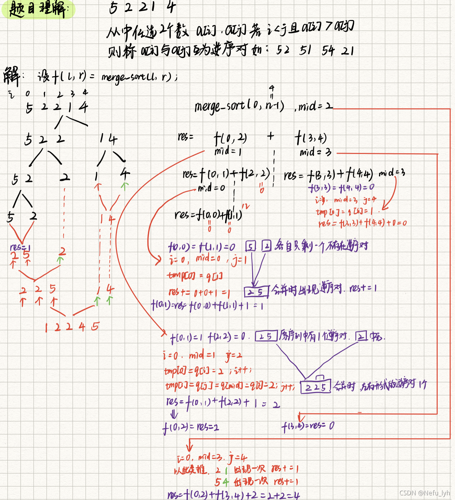

## 1、QuickSort 快排

- 确定分界点 x （q[l]、q[(l+r)/2]、q[r]、或随机的数）
- 调整范围，使得所有<=x的数在x左边，所有>=x的数在x右边
- 递归处理左右两边，直至只剩一个数

注意：虽然x的位置在中间，但是x的值不一定在中间

原题连接：

​	快排模板：https://www.acwing.com/problem/content/787/ 

​	第k个数：https://www.acwing.com/problem/content/788/

快排模板：

```C++
# include <iostream>
using namespace std;
const int N=1e6+10;
int n,q[N];
void QuickSort(int q[],int l,int r){
    if(l>=r) return;
    int i=l-1,j=r+1,x=q[l+r>>1];
    while(i<j){
        do i++; while(q[i]<x);
        do j--; while(q[j]>x);
        if(i<j) swap(q[i],q[j]);
    }
    QuickSort(q,l,j);
    QuickSort(q,j+1,r);
}
int main(){
    scanf("%d",&n);
    for(int i=0;i<n;i++){
        scanf("%d",&q[i]);
    }
    QuickSort(q,0,n-1);
    for(int i = 0; i<n;i++){
        printf("%d ",q[i]);
    }
}
```

快排边界问题详见：

https://www.acwing.com/solution/content/16777/

https://blog.csdn.net/weixin_45636061/article/details/124077136

快排难点总结：如何划分左右两个边界，并在左右边界分别执行以下操作：

通过 i j 指针与x值比较，使得在 i < j 不成立时已经将此边界的所有的值与边界内的划分值x都比较了一次，使得边界内 i 左边值都<=x；j 右边值都 >=x 。

此时递归左边执行上述操作、递归右边执行上述操作，当边界不断划分至边界内只有一个数时，左侧的递归完成。右侧同理，当右侧递归同样完成时，排序完成。

##  2、MergeSort分治排序

快排是左右两边执行操作**与边界值x的比较来交换两个错位的数**，使得左右边都部分有序，再递归左边，递归右边，左右都划分至只剩一个数后，排序完成。

分治排序是递归左边，递归右边，直至左右两边都只剩一个数即边界内部完全有序，再对左右进行有序合并，直至回溯全部完成则排序完成。

二者最大的区别就是，快排是先操作在递归，递归到只剩一个数则排序完成；分治排序是先递归再操作，递归到只剩一个数后才开始合并，回溯完成后才完成排序。

原题连接：

​	https://www.acwing.com/problem/content/789/

快排模板：

```C++
// SortAlgorithem.cpp : 此文件包含 "main" 函数。程序执行将在此处开始并结束。
# include <iostream>
using namespace std;

const int N = 1e6 + 10;
int n, q[N], tmp[N];

void MergeSort(int q[], int l, int r) {
	if (l >= r) return;
	int mid = l + r >> 1;
	MergeSort(q, l, mid);
	MergeSort(q, mid + 1, r);
	int k = 0, i = l, j = mid + 1;
	while (i <= mid && j <= r) {
		if (q[i] <= q[j]) tmp[k++] = q[i++];
		else tmp[k++] = q[j++];
	}
	while (i <= mid) tmp[k++] = q[i++];
	while (j <= r) tmp[k++] = q[j++];
	for (int i = l, j = 0; i <= r; i++) q[i] = tmp[j++];

}
int main() {
	scanf("%d", &n);
	for (int i = 0; i < n; i++) {
		scanf("%d", &q[i]);
	}
	MergeSort(q, 0, n - 1);
	for (int i = 0; i < n; i++) {
		printf("%d ", q[i]);
	}
}
```

求逆序数对原题连接：

​	https://www.acwing.com/problem/content/description/790/

此题利用了归并排序时对两数之间的比较过程来得出逆序对的数量。我们归并排序时需要先将数组进行拆分直至分为单个的数之后，按照分的原路径 一 一进行比较再合并，所以在由下至上合并的过程中如果发现了左右两个序列出现逆序对则res++，再对其进行排序。

由下至上的合并过程中左序列或者右序列内部的排序不影响二者合并时逆序对数量的计算。 所以实际上还有在左右合并的时候才会出现res++，为了保留上一步的res(也就是合并过程中的res)，可以res作为返回值，再回到上一步时进行相加即可。



原文链接：https://blog.csdn.net/qq_46126258/article/details/119893952

逆序数对模板：

```C++
# include <iostream>
using namespace std;
const int N = 1e5 + 10;
typedef long long ll;
int n, q[N], tmp[N];
ll MergeSort(int l, int r) {
	if (l >= r) return 0;
	int mid = l + r >> 1;
	ll res = MergeSort(l, mid) + MergeSort(mid + 1, r);
	int i = l, j = mid + 1, k = 0;
	while (i <= mid && j <= r) {
		if (q[i] <=q[j]) tmp[k++] = q[i++];
		else {
			tmp[k++] = q[j++];
			res += mid - i + 1;
		}
	}
	while (i <= mid) tmp[k++] = q[i++];
	while (j <= r) tmp[k++] = q[j++];
	for (int i = l, j = 0; i <= r; i++, j++) q[i] = tmp[j];
	return res;
}
int main()
{
	scanf("%d", &n);
	for (int i = 0; i < n; i++) {
		scanf("%d", &q[i]);
	}
	printf("%lld", MergeSort(0, n - 1));
}
```

这里需要解释一下为什么要使用long long 作为返回值：
$$
数据范围：1≤n≤100000，数列中的元素的取值范围 [1,10^9]
$$


$$
在32位和64位机器中，int占32位，取值范围为-2147483648～2147483647（-2^{31} \sim 2^{31}-1）
$$

在最坏的情况下，数列中的值呈现完全倒序，例 

```text
n     n-1   n-2   ...   1 分别构成
n-1   n-2   n-3   ...   0 个逆序对，总共 n(n-1)/2个，最大约 5e9个逆序对
```

而int可表示最大值月约为 2.14e9 ，所以要是用long long 类型

