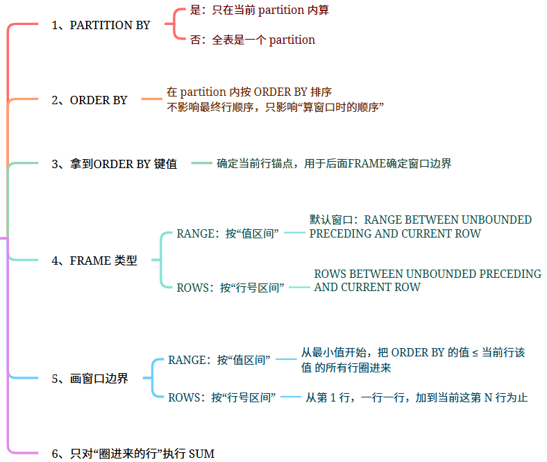
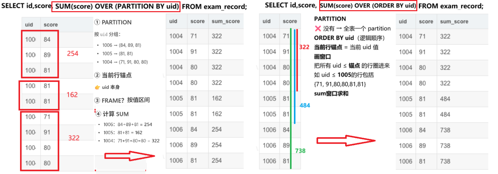
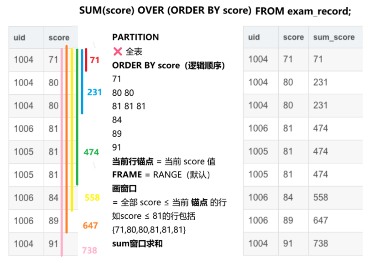
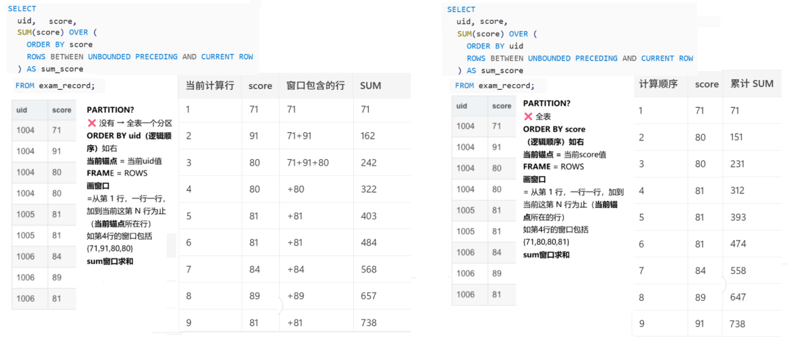
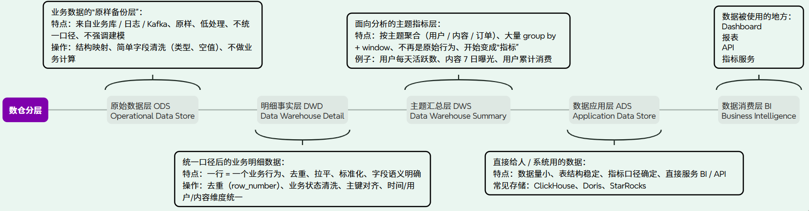

窗口函数（Window Function，也叫 **Analytic Function**）用于**在不改变查询结果行数的情况下，对某一“窗口范围”的数据进行计算**。  
与 `GROUP BY` 不同：

- `GROUP BY`：会**聚合并减少行数**
- 窗口函数：**在每一行上计算一个结果，但计算基于当前行周围的一组行（窗口）**

窗口函数也称为OLAP函数，OLAP 是OnLine Analytical Processing 的简称，意思是对数据库数据进行实时分析处理。例如，市场分析、创建财务报表、创建计划等日常性商务工作。窗口函数就是为了实现OLAP 而添加的标准SQL 功能。

# 1、OLAP

## 1.1 什么是 OLAP（Online Analytical Processing）

**OLAP（Online Analytical Processing）**  面向分析的查询处理 == **对大量历史数据进行复杂统计分析的计算系统**

典型特点有 4 个：

| 特征        | 说明              |
| --------- | --------------- |
| 数据量大      | TB / PB 级       |
| 查询复杂      | group、join、窗口计算 |
| 以读 + 分析为主 | 很少事务写           |
| 结果是统计指标   | 报表 / BI / 数据分析  |

例如企业常见操作：

| OLAP业务场景    | 具体分析需求        | 对应窗口函数/SQL思路                                                          |
| ----------- | ------------- | --------------------------------------------------------------------- |
| 财务报表        | 每月收入累计        | `SUM() OVER (PARTITION BY … ORDER BY …)`                              |
|             | 同比 / 环比       | `LAG()` 或 `LEAD()` 取上一期数据再相减                                          |
| 市场分析        | 各地区销售排名       | `RANK()` / `DENSE_RANK()`                                             |
| 业务分析        | Top N 用户 / 商品 | `ROW_NUMBER() OVER (PARTITION BY … ORDER BY …)` 然后 `WHERE rn <= N`    |
| 运营指标        | DAU趋势         | `SUM()` / `COUNT()` + `OVER (ORDER BY date)`                          |
|             | 最近7天移动平均      | `AVG() OVER (ORDER BY date ROWS BETWEEN 6 PRECEDING AND CURRENT ROW)` |
| 数据分析 / 明细统计 | 每组第一条或最新记录    | `FIRST_VALUE()` 或 `ROW_NUMBER()…=1`                                   |

这些其实都属于：`对数据做统计 + 排序 + 计算趋势。这类查询模式一般是：

```
scan大量数据
   ↓
group by
   ↓
sort
   ↓
window calculation
```

---

## 1.2  OLTP vs  OLAP

OLTP是**联机事务处理**（Online Transaction Processing），OLAP是**联机分析处理**（Online Analytical Processing）。

- **OLTP**​ 像银行的**柜台实时业务**。你存钱、取钱、转账，要求系统瞬间完成、绝对准确，处理的是大量简单、短小的日常操作。核心是“**增删改**”，强调高并发和事务安全。数据库设计是高度规范化的。

- **OLAP**​ 像银行的**月度经营分析报告**。它从海量历史交易数据中，分析“哪个网点存款最多”、“哪种客户增长最快”等复杂问题。核心是“**查**”，但查询非常复杂，涉及大规模数据的聚合、多维度统计。数据仓库设计是面向主题的、集成的。

| **特性**    | **OLTP**              | **OLAP**                     |
| --------- | --------------------- | ---------------------------- |
| **目的**​   | 支持日常业务运营、事务一致性        | 支持管理决策分析、分析效率                |
| **操作**​   | 大量简单事务（增、删、改、简单查）     | 复杂查询，主要读，涉及大量数据聚合            |
| **数据源**   | MySQL产生原始数据           | Hadoop, Spark构建的**数据仓库/数据湖** |
| **数据**​   | 最新的、细节的、当前的           | 历史的、汇总的、集成的                  |
| **数据量**   | 小表、行少                 | TB / PB                      |
| **响应**​   | 毫秒/秒级                 | 秒/分钟/小时级                     |
| **设计模型**​ | 实体关系模型（ER），高度规范化      | 星型/雪花模型，反规范化                 |
| **典型SQL** | `select * where id=1` | `group by / window`          |
| **典型系统**​ | 电商订单系统、银行核心系统         | 数据仓库、商业智能报表系统                |

## 1.3 OLAP 查询的计算本质

一个真实 OLAP 查询通常有下面结构：

```sql
SELECT
  维度 + 指标
FROM
  明细数据
WHERE
  条件
GROUP BY
  维度
WINDOW
  排名 / 累计 / 环比
ORDER BY
  排序
```

举几个 Hive / Spark 常见 SQL：

```sql
# 业务需求：每个地区找销售 Top 用户
# 按 region 分组，每个 region 内排序 revenue，计算 rank
SELECT region,
    user_id,
    revenue,
    RANK() OVER (PARTITION BY region ORDER BY revenue DESC) AS rank
FROM sales;

# 
SELECT user_id,dt,
        revenue,
        SUM(revenue) OVER (PARTITION BY user_id ORDER BY dt) AS cumulative
FROM revenue;
```

这其实非常接近 **MapReduce / Spark shuffle 逻辑**。

---

# 2、OLAP 和 窗口函数

## 2.1 为什么窗口函数和 OLAP 相关

传统 SQL（早期 SQL）只有：

```sql
GROUP BY
SUM / AVG / COUNT
```

比如如下代码只能得到 `每个部门的总sales值`：

```sql
SELECT dept, SUM(sales)
FROM sales
GROUP BY dept;
```

但分析场景往往需要 **更复杂的结果，例如：**：

**① 每个部门内部销售排名**

```
A 部门
1 Jerry
2 Lucy
3 Tom
```

**② 每天的累计销售**

```
day  sales  cumulative_sales
1    100    100
2    200    300
3    150    450
```

**③ 每条记录和上一条比较**

```
day  sales  yesterday_sales
```

这些 **都不能用普通 GROUP BY 实现**。

于是 2003的SQL 标准就增加了一类函数 窗口函数 (Window Function)，专门用于 **OLAP分析计算**，所以窗口函数又名`Analytic Function`。

OLAP 经常需要这些分析能力：

| 分析需求  | SQL实现                     |
| ----- | ------------------------- |
| 排名    | `RANK()`                  |
| TopN  | `ROW_NUMBER()`            |
| 累计值   | `SUM() OVER()`            |
| 移动平均  | `AVG() OVER ROWS BETWEEN` |
| 前后行比较 | `LAG()` / `LEAD()`        |
| 每组第一条 | `FIRST_VALUE()`           |

这些操作都有一个共同点：

> **计算某一行时，需要访问"当前行附近的一组数据"**

例如：

```
day   revenue
1     100
2     200
3     50
```

累计：

```
day1 → 100
day2 → 100 + 200
day3 → 100 + 200 + 50
```

显然：第3行计算需要看到前2行，因此 SQL 需要一个概念定义：

```
当前行 + 周围数据
```

这就是 **Window Function**。

> **OLAP = 业务数据分析需求**  
> **窗口函数 = SQL 为了实现这些分析需求而提供的工具**

## 2.2 为什么叫“窗口”函数

核心思想：**每一行的计算都不是只用当前行，而是使用“当前行周围的一组数据**。

这个数据范围就叫：Window (窗口)

例如：

```sql
SUM(amount) 
OVER (
  PARTITION BY user
  ORDER BY day
  ROWS BETWEEN 3 PRECEDING AND CURRENT ROW
)
```

含义：

```
当前行
+ 前3行
```

这 4 行就形成了一个 **window**。

然后在这个 window 上计算：

```
sum / avg / rank
```

---

## 2.3 为什么窗口函数必须 partition + sort

窗口函数的核心本质是：

> **在一组有序数据中，针对当前行计算一个窗口范围**

这就必然需要两个动作：

```
partition
sort
```

原因如下：

### (1) partition

定义：哪几行属于同一组

例如：`PARTITION BY region` 表示：`每个 region 单独计算`

数据逻辑：

```
region = A
   ↓
A1
A2
A3

region = B
   ↓
B1
B2
```

---

### (2) sort

窗口函数必须 **确定“前/后”顺序**。

例如：

```
LAG()
RANK()
running sum
```

都依赖顺序。

例子：

```
ORDER BY revenue DESC
```

数据变为：

```
300
200
100
```

才能计算：

```
rank
```

---

### (3) window frame

最后定义：

```
窗口范围
```

例如：

```
ROWS BETWEEN 3 PRECEDING AND CURRENT ROW
```

数据：

```
row5 (current)
row4
row3
row2
```

---

# 3、OLAP和应用

## 3.1 OLAP 数据库 vs OLAP 计算系统

> **是否“存数据 + 是否对外提供低延迟查询”**  
> 是区分 OLAP 数据库 和 OLAP 计算系统 的关键。

| 维度         | OLAP 计算系统 | OLAP 数据库 |
| ---------- | --------- | -------- |
| 是否自带存储     | ❌         | ✅        |
| 查询模式       | 批量 / 离线   | 交互式 / 实时 |
| 延迟         | 秒~分钟      | 毫秒~秒     |
| 是否面向 BI 直连 | 否         | 是        |
| 是否“像数据库”   | 否         | 是        |

## 3.2 为什么 Hive / Spark / ClickHouse / Doris / StarRocks 属于 OLAP

它们处理的典型 SQL：**统计、聚合、排名、TopN、累计、趋势**。这些计算的目标不是事务操作，而是 **分析指标**，这正是 **OLAP 的典型 workload**

> 他们本质上解决的是同一类问题：OLAP，区别在：是“算完就走的计算引擎”，还是“随时查的分析数据库”。

| 维度       | Hive           | Spark SQL         | ClickHouse    | Doris                 | StarRocks               |
| -------- | -------------- | ----------------- | ------------- | --------------------- | ----------------------- |
| 本质定位     | 离线 OLAP 计算系统   | 通用 OLAP 计算系统      | OLAP 列式数据库    | MPP OLAP 数据库          | 高性能实时 OLAP DB           |
| 是否自带存储   | ❌              | ❌                 | ✅             | ✅                     | ✅                       |
| 数据规模     | PB             | PB                | TB~PB         | TB~PB                 | TB~PB                   |
| 查询延迟     | 分钟级            | 秒~分钟              | 毫秒~秒          | 秒级                    | 毫秒~秒                    |
| 写入方式     | 批量             | 批量 / 流            | Append        | 批量 / 导入               | 实时 + 批                  |
| 窗口函数     | ✅（重度）          | ✅（重度）             | ✅（高效）         | ✅                     | ✅                       |
| 并发能力     | 低              | 中                 | 高             | 高                     | 很高                      |
| 是否 BI 直连 | ❌              | ❌                 | ✅             | ✅                     | ✅                       |
| 成本优势     | ⭐⭐⭐⭐⭐          | ⭐⭐⭐⭐              | ⭐⭐            | ⭐⭐                    | ⭐⭐                      |
| 典型角色     | 离线数仓           | 复杂分析              | 指标/报表         | 企业数仓                  | 实时数仓                    |
| 一句总结     | 便宜地算完所有历史数据的地方 | 什么复杂计算都能兜底的超强计算引擎 | BI 查得飞快的分析数据库 | 传统企业最容易落地的 OLAP 数仓 DB | 实时 + 复杂分析一体化的现代 OLAP DB |

---

## 3.3 Hive / Spark 执行窗口函数的底层流程

我们画一个 **完整逻辑流程**：

```
            OLAP SQL
               │
               │
               ▼
      SELECT user, revenue,
             SUM(revenue) OVER(
                 PARTITION BY region
                 ORDER BY day
             )
               │
               ▼
        Query Planner
               │
               ▼
        ① Shuffle (按 partition key)
               │
               │
               ├── region = A → Node1
               └── region = B → Node2
               │
               ▼
        ② Partition 内排序
               │
               ▼
        ③ Window Operator
           (滑动窗口)
               │
      ┌────────┼─────────┐
      │        │         │
    row1     row2      row3
      │        │         │
      ▼        ▼         ▼
   window1  window2   window3
      │        │         │
      ▼        ▼         ▼
   result1   result2    result3
```

---

## 3.4 放到 Spark / Hive 执行层

更接近真实执行：

```
Stage 1 (Map)
   读 HDFS / ObjectStore
        │
        ▼
   Partial aggregate
        │
        ▼
     Shuffle
 (按 partition key)
        │
        ▼
Stage 2 (Reduce / Spark Task)
    每个 partition
        │
        ▼
     Sort (ORDER BY)
        │
        ▼
   Window operator
        │
        ▼
     输出结果
```

关键点：

```
window function
   =
partition + sort + iterate rows
```

---

# 4、窗口函数

## 定义

```hive
<窗口函数> 
OVER (
    [PARTITION BY <列名清单>] 
    ORDER BY <排序列名清单> 
    [RAME (RANGE | ROWS | GROUPS between 开始位置 and 结束位置)
)
```

`OVER(...)` 定义的是“窗口规则”，  
真正的 Window = `PARTITION + ORDER + FRAME（RANGE / ROWS）` 三者共同决定



```sql
SUM(score) OVER (PARTITION BY uid)
SUM(score) OVER (ORDER BY uid)
SUM(score) OVER (ORDER BY score)
```

上面的例子只显式写了 **前两层**（PARTITION / ORDER），  **第三层 —— Frame（窗口边界）是“隐式存在的”**，这正是 `RANGE` 的来源。MySQL 8 默认添加了`RANGE BETWEEN UNBOUNDED PRECEDING AND CURRENT ROW`

## sum+over


```sql
name    dept    salary
A       IT      10000
B       IT      12000
C       IT      10000
```

## 分类

| 分类               | 作用       | 核心函数                                        |
| ---------------- | -------- | ------------------------------------------- |
| **1. 序号函数**      | 给行编号/排名  | `ROW_NUMBER`, `RANK`, `DENSE_RANK`, `NTILE` |
| **2. 分布函数**      | 看数据分布    | `CUME_DIST`, `PERCENT_RANK`                 |
| **3. 前后函数**      | 看前一行/后一行 | `LAG`, `LEAD`                               |
| **4. 头尾函数**      | 看窗口首尾值   | `FIRST_VALUE`, `LAST_VALUE`                 |
| **5. 聚合函数（窗口版）** | 在窗口内做统计  | `SUM`, `AVG`, `COUNT`, `MAX/MIN`            |
| **6. 其他分析函数**    | 特殊统计     | `NTH_VALUE`                                 |

## 4.1 序号函数（Row Number / 排名类）

👉 用来解决：**Top N、排名**

### 1️⃣ ROW_NUMBER()

👉 每行唯一编号（不考虑并列）

```SQL
SELECT name, dept, salary,
ROW_NUMBER() OVER (PARTITION BY dept ORDER BY salary DESC) AS rn
```

结果：

```
B 12000 1
C 12000 2
A 10000 3
```

👉 特点：

- **无并列**
- 常用于：`Top1/TopN`

---

### 2️⃣ RANK()

👉 相同值并列，跳号

```
B 12000 1
C 12000 1
A 10000 3
```

---

### 3️⃣ DENSE_RANK()

👉 相同值并列，不跳号

```
B 12000 1
C 12000 1
A 10000 2
```

---

### 4️⃣ NTILE(n)

👉 分桶（分层分析）在指定的窗口内，将有序的行数据尽可能均匀地分配到 N 个“桶”中，并为每一行标记其所属的桶编号（从 1 到 N）。

```sql
SELECT name, salary,
NTILE(3) OVER (ORDER BY salary DESC) AS bucket
FROM t;
```

👉 应用：

- 用户分层（Top 10% / 20%）
- AB 实验分桶

---

# 4.2 分布函数（百分比类）

👉 用于：**数据分布分析（OLAP常用）**

---

### 1️⃣ CUME_DIST()

👉 累计分布函数 **Cumulative Distribution**。CUME_DIST()计算的是在指定窗口内，当前行值 ≤ 某个值的行数占总行数的比例。它返回的是一个0到1之间的值，表示累积分布。​

```sql
SELECT name, salary,
CUME_DIST() OVER (ORDER BY salary DESC) AS cd
FROM t;
```

显示更多行

👉 含义：

> 当前值 ≤ 的数据比例

例子：

```
12000 → 2/5 = 0.4
10000 → 3/5 = 0.6
```

---

### 2️⃣ PERCENT_RANK()

👉 类似排名比例

公式：

```
(rank - 1) / (total - 1)
```

👉 常用于：

- 百分位
- 排名占比

---

# 4.3 前后函数（时间序列必用）

👉 你做数据分析 / 用户行为 / 日活趋势都会用到

---

### 1️⃣ LAG（向前看）

SQL

SELECT name, salary,  

LAG(salary, 1) OVER (ORDER BY salary) AS prev_salary  

FROM t;  

显示更多行

👉 举例：

```
B 12000 → 上一行 10000
```

---

### 2️⃣ LEAD（向后看）

SQL

SELECT name, salary,  

LEAD(salary, 1) OVER (ORDER BY salary) AS next_salary  

FROM t;  

显示更多行

---

✅ 典型场景：

- 日新增 vs 前一天
- 用户行为路径
- 环比分析

👉 和你之前问的 OLAP 完全对应 ✅

---

# 4.4 头尾函数

---

### 1️⃣ FIRST_VALUE()

```SQL
SELECT name,
FIRST_VALUE(name) OVER (PARTITION BY dept ORDER BY salary DESC)
FROM t;
```

👉 每个部门工资最高的人

---

## 2️⃣ LAST_VALUE()

⚠️ Hive 有个坑（重点）

默认窗口是：

```
RANGE BETWEEN UNBOUNDED PRECEDING AND CURRENT ROW
```

👉 所以很多时候返回**当前行值**

✅ 正确写法：

```SQL
LAST_VALUE(name) OVER (
PARTITION BY dept
ORDER BY salary
ROWS BETWEEN UNBOUNDED PRECEDING AND UNBOUNDED FOLLOWING
)
```

👉 才能拿到真正“最后一个值”

---

# 4.5 聚合函数（窗口版）

👉 本质：**在窗口内滚动统计**

---

## 1️⃣ SUM（累计和 / 滚动和）

```sql
SELECT name, salary,
SUM(salary) OVER (
    PARTITION BY dept
    ORDER BY salary
    ) AS cum_salary
FROM t;
```

👉 相当于：

```
10000 → 10000
12000 → 22000
```





## SUM + OVER + ROWS

```sql
SELECT
  uid,
  score,
  SUM(score) OVER (
    ORDER BY uid
    ROWS BETWEEN UNBOUNDED PRECEDING AND CURRENT ROW
  ) AS sum_score
FROM exam_record;

SELECT
  uid,
  score,
  SUM(score) OVER (
    ORDER BY score
    ROWS BETWEEN UNBOUNDED PRECEDING AND CURRENT ROW
  ) AS sum_score
FROM exam_record;
```



---

## 常见：

- `SUM`（累计收入）
- `AVG`（移动平均）
- `COUNT`
- `MAX / MIN`

---

✅ 场景（你之前问 OLAP 已提过）：

| 分析    | 用法             |
| ----- | -------------- |
| 累计收入  | `SUM() OVER`   |
| 移动平均  | `AVG() OVER`   |
| Top N | `ROW_NUMBER()` |

---

# 4.6 其他函数（补充）

Hive 不算特别多，但常见：

### ✅ NTH_VALUE（取第N个）

SQL

NTH_VALUE(col, 2)  

显示更多行

👉 每个窗口的第2个值

---

# ✅ 三、你可以这样记（面试/实战总结）

👉 一句话总结：

```
窗口函数 = 排名 + 分布 + 时间 + 累计
```

---

✅ 再给你一个“数据工程视角”的理解（非常重要）：

| 类型  | 本质          |
| --- | ----------- |
| 排名类 | 排序 + 标号     |
| 分布类 | 排序 + 比例计算   |
| 前后类 | 行偏移（offset） |
| 头尾类 | 边界值         |
| 聚合类 | 滚动聚合        |

👉 本质都依赖：

```
Partition + Order + Frame
```

👉 底层对应（你之前学过）：

- Shuffle
- 分区排序
- Window buffer

# 数仓分层



# 1. 窗口函数基本结构

Hive 的语法核心是 `OVER()`：

```hive
function_name(column) OVER (
    PARTITION BY col1
    ORDER BY col2
    ROWS BETWEEN ...
)
```

主要有三部分：

| 部分             | 作用          |
| -------------- | ----------- |
| `PARTITION BY` | 分区，相当于把数据分组 |
| `ORDER BY`     | 指定窗口内排序     |
| `ROWS / RANGE` | 指定窗口范围      |

简单理解：

```
一组数据 (partition)
    ↓
按照某种顺序 (order)
    ↓
选取当前行周围一段范围 (window)
    ↓
做计算 (sum / rank / avg)
```

# 示例数据

sales表

| dept | name  | sales |
| ---- | ----- | ----- |
| A    | Tom   | 100   |
| A    | Jerry | 200   |
| A    | Lucy  | 150   |
| B    | Mike  | 300   |
| B    | Jack  | 250   |

# 窗口函数

## 聚合型

- `SUM()`
- `AVG()`
- `COUNT()`
- `MAX()`
- `MIN()`

## 例1：计算部门总销售（但保留每一行）

```hive

```

SELECT  

dept,  

name,  

sales,  

SUM(sales) OVER (PARTITION BY dept) AS dept_total  

FROM sales;  

显示更多行

结果：

| dept | name  | sales | dept_total |
| ---- | ----- | ----- | ---------- |
| A    | Tom   | 100   | 450        |
| A    | Jerry | 200   | 450        |
| A    | Lucy  | 150   | 450        |
| B    | Mike  | 300   | 550        |
| B    | Jack  | 250   | 550        |

理解：

```
dept = A 这一组
[100, 200, 150]

sum = 450
```

但每一行都会显示 450。

窗口函数

参考链接：https://blog.csdn.net/xiasiyu123456/article/details/131568710

[Mysql 分组聚合实现 over partition by 功能 - zhwbqd - 博客园](https://www.cnblogs.com/zhwbqd/p/4205821.html)

```sql
[你要的操作] OVER ( PARTITION BY  <用于分组的列名>
                    ORDER BY <按序叠加的列名> 
                    ROWS|RANGE <窗口滑动的数据范围> )
```

[你要的操作]可以分为：

1. `row_number()`
   - `row_number()`函数会为每一行生成一个唯一的行号，无论排序列中是否存在重复值。
   - 对于相同排序值的行，它们的行号会按照它们在结果集中出现的顺序依次递增。
2. `rank()`
   - `rank()`函数会为每一行生成一个行号，相同排序值的行会被分配相同的行号。
   - 对于相同排序值的行，它们会被分配相同的行号，并且下一个行号会跳过相同数量的行。
3. `dense_rank()`
   - `dense_rank()`函数也会为每一行生成一个行号，相同排序值的行会被分配相同的行号。
   - 对于相同排序值的行，它们会被分配相同的行号，并且下一个行号不会跳过相同数量的行，而是连续递增。

输入数据示例：

| Name    | Score |
|:------- |:----- |
| Alice   | 85    |
| Bob     | 92    |
| Charlie | 78    |
| David   | 92    |
| Emily   | 85    |
| Frank   | 78    |
| Grace   | 92    |

使用以下查询：

```sql
SELECT
    Name,
    Score,
    row_number() OVER (ORDER BY Score DESC) AS rowno1,
    rank() OVER (ORDER BY Score DESC) AS rowno2,
    dense_rank() OVER (ORDER BY Score DESC) AS rowno3
FROM
    Students;
```

输出结果示例：

| Name    | Score | rowno1 | rowno2 | rowno3 |
|:------- |:----- |:------ |:------ |:------ |
| Bob     | 92    | 1      | 1      | 1      |
| David   | 92    | 2      | 1      | 1      |
| Grace   | 92    | 3      | 1      | 1      |
| Alice   | 85    | 4      | 4      | 2      |
| Emily   | 85    | 5      | 4      | 2      |
| Charlie | 78    | 6      | 6      | 3      |
| Frank   | 78    | 7      | 6      | 3      |

<窗口滑动的数据范围> 用来限定 [你要的操作] 所运用的数据的范围，具体有如下这些：

```sql
当前 - current row
之前的 - preceding
之后的 - following
无界限 - unbounded
表示从前面的起点 - unbounded preceding
表示到后面的终点 - unbounded following
```

举例：

```sql
取当前行和前五行：ROWS between 5 preceding and current row --共6行
取当前行和后五行：ROWS between current row and 5 following --共6行
取前五行和后五行：ROWS between 5 preceding and 5 following --共11行
取当前行和前六行：ROWS 6 preceding（等价于between...and current row） --共7行
这一天和前面6天：RANGE between interval 6 day preceding and current row --共7天
这一天和前面6天：RANGE interval 6 day preceding（等价于between...and current row） --共7天
字段值落在当前值-100到+200的区间：RANGE between 100 preceding and 200 following  --共301个数值
```
