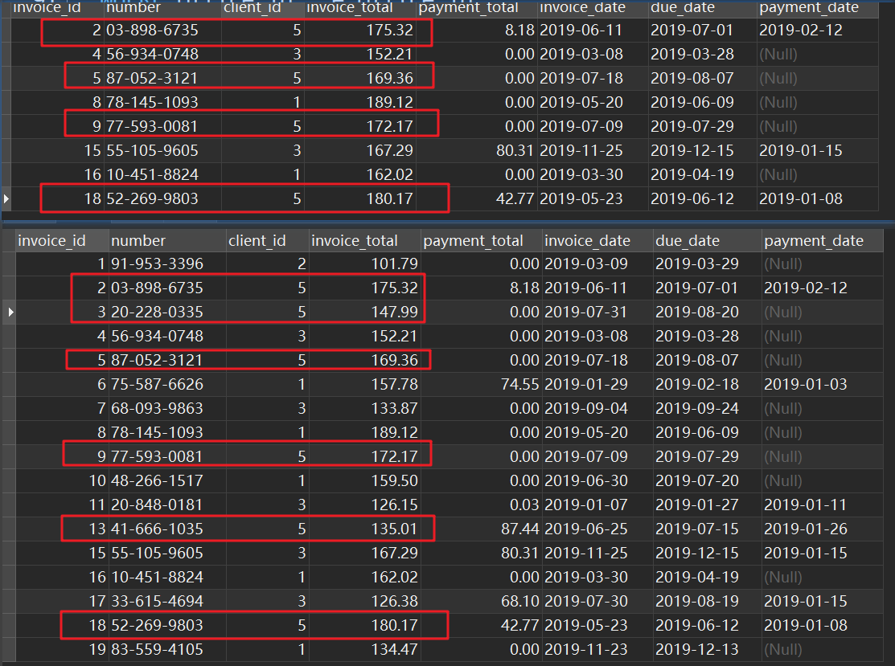

https://zhuanlan.zhihu.com/p/222865842


# 第一章 单表查询


## 1、SELECT、WHERE clause

```sql
USE sql_store;

SELECT * 
FROM customers
WHERE customer_id = 1
ORDER BY first_name;
-- 单行注释
/*
多行注释
*/
```


SQL会完全无视大小写（绝大数情况下的大小写）、多余的空格（超过一个的空格）、缩进和换行，SQL语句间完全由分号 `;` 分割

## 2、AND、OR、NOT clause

```sql
USE sql_store;

SELECT * FROM Customers
where birth_date > '1990-01-01' AND points > 1000
```


From the order_items table, get the items for order #6 where the total price is greater than 30


## 3、IN、BETWEEN clause


Return products with quantity in stock equal to 49,38,72
```sql
SELECT * FROM products
WHERE quantity_in_stock IN (49,38,72)
```

Return customers born between 1/1/1990 and 1/1/2000

```sql
SELECT * FROM customers
where birth_date BETWEEN '1990-01-01' AND '2000-01-01'
```

## 4、字符串搜索

### 4.1 LIKE clause

模糊查找，查找具有某种模式的字符串的记录/行

两种通配符(忽略大小写)：

- `%` 任何个数（包括0个）的字符
- `_` 单个字符


Get the customers whose addresses contain TRAIL or AVENUE

``` sql
SELECT * FROM customers
WHERE address LIKE '%TRAIL%' OR address LIKE '%AVENUE%'
```

Get the customers whose phone numbers end with 9

```sql
SELECT * FROM customers
WHERE phone LIKE '%9';
```


### 4.2 REGEXP clause

正则表达式，在搜索字符串方面更为强大，可搜索更复杂的模板

```sql
SELECT * FROM customers
WHERE last_name LIKE '%y%'; 
-- 等价于
SELECT * FROM customers
WHERE last_name REGEXP 'y';
```

|  符号  |           意义            |
| :----: | :-----------------------: |
|   ^    |           开头            |
|   $    |           结尾            |
| [abc]x |       含ax或bx或cx        |
| [a-d]x | 等价于[abcd]x，即含a到d x |
|   \|   |        logical or         |

Get the customers whose

1. first names 是 ELKA 或 AMBUR
2.  last names 以 EY 或 ON 结束
3. last names 以 MY 开头 或包含 SE
4. last names contains b followed by R or U

```sql
-- 1. first names 是 ELKA 或 AMBUR
SELECT * FROM customers 
WHERE first_name REGEXP 'ELKA|AMBUR'
-- 2.  last names 以 EY 或 ON 结束
SELECT * FROM customers 
WHERE last_name REGEXP 'EY$|ON$'
-- 3. last names 以 MY 开头 或包含 SE
SELECT * FROM customers 
WHERE last_name REGEXP '^MY|SE'
-- 4. last names contains b followed by R or U
SELECT * FROM customers 
WHERE last_name REGEXP 'b[RU]'
```

## 5、NULL 判断

Get the orders that are not shipped

```sql
USE sql_store;

SELECT * FROM orders WHERE shipped_date IS null
```

Get the orders that are not shipped

## 6、分页

### 6.1 ORDER BY clause

可以起别名，并按照别名排序

```sql
SELECT *,quantity * unit_price AS total
FROM order_items 
ORDER BY total DESC
```

可以使用列位置给数据排序


###  6.2 LIMIT clause

限制返回结果的记录数量，“前N个” 或 “跳过M个后的前N个”

取前三个

```sql
SELECT * FROM  customers
LIMIT 3
```

假设页大小为3，第一页：1-3；第二页：4-6；…，第三页的数据如下，第一个参数是offset，第二个参数是取的个数

```sql
SELECT * FROM  customers
LIMIT 6,3
```

# 第二章 多表查询

## 1、INNER JOIN 内连接

默认JOIN 是 INNER JOIN

在order_items表基础上添加product name

```sql
SELECT oi.order_id,p.product_id,p.name,oi.quantity,oi.unit_price
FROM order_items AS oi
INNER JOIN products AS p ON oi.product_id = p.product_id
```

JOIN的两张表在不同的数据库中时，使用前缀区分


查询payments表的详细数据（连接clients和payment_methods）

```sql
SELECT p.payment_id,c.name AS client_name,
		invoice_id,date,amount,pm.name AS payment_methods
FROM payments p
JOIN clients c ON p.client_id = c.client_id
JOIN payment_methods pm ON p.payment_method = pm.payment_method_id;
```

### 1.1、SELF JOIN 自连接

一张表连接自己，比如employees表中只存储了上级id，若想知道上级名称则需要执行自连接


### 1.2、Compound Join Condition复合连接条件

如下图，order_items表没有唯一的主键，使用的是order_id和product_id的复合主键。当使用复合连接主键作为连接条件时，注意使用AND组合两个主键


### 1.3、Implicit JOIN隐式链接

下面两种写法是等价的，但是推荐使用显示连接即第一种写法

```sql
SELECT * 
FROM orders o 
JOIN customers c ON o.customer_id = c.customer_id;

SELECT * 
FROM orders o,customers c
where o.customer_id = c.customer_id;
```

## 2、OUTTER JOIN 外连接

### 2.1 LEFT JOIN

在order_items表中只有部分的product，要显示所有product的订购情况只能使用LEFT JOIN

```sql
SELECT p.product_id,p.name,oi.quantity
FROM products p
LEFT JOIN order_items oi ON p.product_id = oi.product_id;
```

获取order_date order_id first_name shipper status

```sql
SELECT o.order_date, o.order_id,c.first_name,s.name shipper,os.name status
FROM orders o
LEFT JOIN customers c ON o.customer_id = c.customer_id
LEFT JOIN shippers s ON o.shipper_id = s.shipper_id
LEFT JOIN order_statuses os ON o.status = os.order_status_id
ORDER BY status
```

### 2.2 RIGHT JOIN

LEFT  JOIN和RIGHT JOIN是可以相互转换的

```sql
SELECT p.product_id,p.name,oi.quantity
FROM order_items oi
RIGHT JOIN products p ON p.product_id = oi.product_id;
```

### 2.3、SELF JOIN 自连接


### 2.4、USING clause

当两个表的列名完全相同时，可以使用USING替换ON连接表

```sql
SELECT o.order_id,c.first_name
FROM orders o
JOIN customers c
-- 0N o.customer id = c.customer_id
USING (customer_id)
```

组合主键也可以使用USING

```sql
SELECT * FROM 
order_items
JOIN order_item_notes USING(order_id,product_id)
```


USING和ON可以混合使用

```sql
SELECT date,c.name client,amount,pm.name
FROM payments p
LEFT JOIN clients c USING(client_id)
LEFT JOIN payment_methods pm on p.payment_method = pm.payment_method_id;
```

### 2.5、NATUAL JOIN 自连接（不建议使用）

自动按照相同名称的列连接（让数据库引擎自己猜怎么连接，我们无法控制）

```sql
SELECT o.order_id,c.first_name
FROM orders o
NATURAL JOIN customers c;
-- 等价于
SELECT o.order_id,c.first_name
FROM orders o
JOIN customers c USING (customer_id);
-- 0N o.customer id = c.customer_id
```

### 2.5、CROSS JOIN 交叉连接

将第一张表的每条记录和第二张表的每条结合（无需写连接条件）

Do a cross join between shippers and products

using the implicit syntax and then using the explicit syntax

```sql
-- 显示写法
SELECT sh.name shipper,p.name product
FROM shippers sh
CROSS JOIN products p;
-- 隐示写法
SELECT sh.name shipper,p.name product
FROM shippers sh,products p;
```

## 3、UNION 联合

JOIN可以连接多张表的列，UNION可以连接多张表的行

根据customers表的分数将客户分为三个等级，(0,2000)Bronze，[2000,3000)Silver，[3000,...)Gold

```sql
-- (0,2000)Bronze [2000,3000)Silver [3000,...)Gold
SELECT customer_id,first_name,points,'Bronze' type
FROM customers where points < 2000
UNION 
SELECT customer_id,first_name,points,'Silver' type
FROM customers where points between 2000 and 3000
UNION 
SELECT customer_id,first_name,points,'Gold' type
FROM customers where points > 3000
ORDER BY first_name;
```

# 第三章 操作表

## 1、INSERT插入

插入单行

```sql
INSERT INTO `sql_store`.`customers`(`customer_id`, `first_name`, `last_name`, `birth_date`, `phone`, `address`, `city`, `state`, `points`) 
VALUES (DEFAULT, 'Levy', 'Mynett', '1969-10-13', '404-246-3370', '68 Lawn Avenue', 'Atlanta', 'GA', 796);
```

| 11   | Levy1 | Mynett | 1969-10-13 | 404-246-3370 | 68 Lawn Avenue | Atlanta | GA   | 796  |
| ---- | ----- | ------ | ---------- | ------------ | -------------- | ------- | ---- | ---- |

插入多行

```sql
SELECT * FROM shippers;
INSERT INTO shippers(name)
VALUES('shipper1'),('shipper2'),('shipper3')
```

获取最后插入的记录的ID

```sql
SELECT LAST_INSERT_ID();
```

## 2、CREATE 创建表

将一张表的数据复制到另外一张表，不包括主键和自增等设置

```sql
CREATE TABLE order_archived AS -- 最终表
SELECT * FROM orders; -- 子查询

TRUNCATE order_archived; -- 清空表数据
```

将一个复杂子查询的结果作为数据，复制到新表invoices_archieved中

```sql
CREATE invoices_archieved AS 
SELECT *,c.name client_name 
FROM invoices i
LEFT JOIN clients c USING(client_id)
WHERE payment_date IS NOT NULL;
```

使用子查询插入

```sql
INSERT INTO order_archived
SELECT * FROM orders
WHERE order_date < '2019-01-01';
```

## 3、UPDATE 更新行

Write a SQL statement to give any customers born before 199050 extra points

```sql
UPDATE customers 
SET points = points + 50
WHERE birth_date < '1990-01-01'
```

使用子查询更新

```sql
UPDATE orders 
SET comments = 'Gold customer'
WHERE customer_id IN(SELECT customer_id 
					 FROM customers
					 WHERE points > 3000)
```

## 4、DELETE 删除行

```sql
DELETE FROM invoices 
WHERE client_id = (SELECT client_id FROM clients 
					WHERE name = 'Myworks')
```

# 第四章 聚合函数 Aggregate Function

Aggregate Function只计算非空值，如果被统计的数据中含有空，则不会被计算到。先过滤再聚合统计

```sql
SELECT MAX(invoice_total) AS highest,
		MIN(invoice_total) AS highest,
		AVG(invoice_total) AS highest,
		SUM(invoice_total) AS total,
		COUNT(invoice_total) AS number_of_invoices,-- 7
		COUNT(payment_date) AS number_of_payment, -- 2
		COUNT(*) AS total_record, -- 7
		COUNT(DISTINCT client_id) AS total_record -- 3
FROM invoices
WHERE invoice_date > '2019-07-01';
```


```sql
SELECT 
	'First half of 2019' AS date_range,
	SUM(invoice_total) AS total_sales,
	SUM(payment_total) AS total_payments,
	SUM(invoice_total-payment_total)  AS what_we_expect
FROM invoices
WHERE invoice_date BETWEEN '2019-01-01' AND '2019-06-30'
UNION
SELECT 
	'Second half of 2019' AS date_range,
	SUM(invoice_total) AS total_sales,
	SUM(payment_total) AS total_payments,
	SUM(invoice_total) - SUM(payment_total)  AS what_we_expect
FROM invoices
WHERE invoice_date BETWEEN '2019-07-01' AND '2019-12-31'
UNION
SELECT 
	'Total' AS date_range,
	SUM(invoice_total) AS total_sales,
	SUM(payment_total) AS total_payments,
	SUM(invoice_total) - SUM(payment_total)  AS what_we_expect
FROM invoices
WHERE invoice_date BETWEEN '2019-01-01' AND '2019-12-31';
```

## 1、GROUP BY

```sql
SELECT 
	client_id,
	SUM(invoice_total) AS total_sales
FROM invoices
WHERE invoice_date >= '2019-07-01' 
GROUP BY client_id
ORDER BY total_sales DESC;
```

根据日期和支付方式获取，当天某支付方式的支付总金额

```sql
SELECT date, pm.name, SUM(amount) total_amounts
FROM payments p 
JOIN payment_methods pm ON p.payment_method = pm.payment_method_id
GROUP BY date,payment_method
ORDER BY date ;
```

## 2、HAVING

在GROUP BY 之后的过滤使用HAVING，HAVING只能对SELECT中选中的列进行过滤

Get the customers located in Virginia who have spent more than $100

```sql
SELECT 
	c.customer_id,
	first_name,
	last_name,
	SUM(oi.quantity*unit_price) total_sales
FROM customers c
JOIN orders o USING (customer_id) 
JOIN order_items oi USING(order_id)
WHERE c.state = 'VA'
GROUP BY c.customer_id
HAVING total_sales > 100;
```

## 3、WITH ROLLUP

只能应用于聚合值的列

```sql
SELECT 
	client_id,
	SUM(invoice_total) AS total_sales
FROM invoices
GROUP BY client_id WITH ROLLUP;
```


```sql
DELETE FROM invoices 
WHERE client_id = (SELECT client_id FROM clients 
					WHERE name = 'Myworks')
```


# 第五章 复杂查询

## 1、Subquery 子查询

### 1.1 在 WHERE 处使用Sub Query

```sql
-- Find products that are more expensive than Lettuce (id = 3)
USE sql_store;

SELECT * 
FROM products 
WHERE unit_price > (
	SELECT unit_price 
	FROM products 
	WHERE name like '%Lettuce%'
);

-- In sql_hr database: Find employees whose earn more than average
USE sql_hr;

SELECT * 
FROM employees 
WHERE salary > (
	SELECT AVG(salary)  
	FROM employees 
);
```

### 1.2 在 IN 处使用Sub Query

```sql
-- Find the products that have never been ordered'
USE sql_store;

SELECT * FROM products WHERE product_id NOT IN(
	SELECT DISTINCT product_id 
	FROM order_items
);

-- Find clients without invoicesll
USE sql_invoicing;

SELECT * FROM clients WHERE client_id NOT IN(
	SELECT DISTINCT client_id 
	FROM invoices
);
```

### 1.3 SELECT 中使用子查询

```sql
-- 错误写法
SELECT 
	invoice_id,
	invoice_total,
	(SELECT AVG(invoice_total) FROM invoices) AS invoice_avg,
	invoice_total - invoice_avg AS difference
FROM invoices;
-- 正确写法
SELECT 
	invoice_id,
	invoice_total,
	(SELECT AVG(invoice_total) FROM invoices) AS invoice_avg,
	invoice_total - (SELECT invoice_avg) AS difference -- SELECT 包裹
FROM invoices;

```


```sql
SELECT 	
	client_id,name,
	(SELECT SUM(invoice_total) FROM invoices WHERE c.client_id = client_id) total_sales,
	(SELECT AVG(invoice_total) FROM invoices) average,
	(SELECT total_sales - average) difference
FROM clients c
```

### 1.4 FROM 中使用子查询

FROM中使用子查询，需要给子查询写别称

```sql
SELECT * 
FROM(
    SELECT 	
    client_id,name,
    (SELECT SUM(invoice_total) FROM invoices WHERE c.client_id = client_id) total_sales,
    (SELECT AVG(invoice_total) FROM invoices) average,
    (SELECT total_sales - average) difference
    FROM clients c
) AS sales_summary
WHERE total_sales IS NOT NULL;
```


### 1.4 Correlated 相关子查询（子查询的结果关联了外界）

```sql
-- Select employees whose salary is above the average in their office
-- 求出在部门范围内大于平均值的员工
USE sql_hr;

SELECT * FROM employees e
WHERE salary > (
	SELECT AVG(salary) avg
	FROM employees 
	WHERE office_id = e.office_id
);
-- Get invoices that are larger than the client's average invoice amount
-- 求出 所有支票中 数额大于该用户支票平均值 的支票
USE sql_invoicing;

SELECT * FROM invoices i
WHERE invoice_total > (
	SELECT AVG(invoice_total) avg
	FROM invoices 
	WHERE client_id = i.client_id
);
```




## 2、Subquery VS JOIN

根据 效率、可读性选择

```sql
-- Find clients without invoicesll
USE sql_invoicing;

SELECT * FROM clients WHERE client_id NOT IN(
	SELECT DISTINCT client_id 
	FROM invoices
);
-- better
SELECT * FROM clients 
LEFT JOIN invoices USING(client_id)
WHERE invoice_id IS NULL;

-- Find customers who have ordered lettuce (id = 3) Select customer_id, first name, last name
USE sql_store;

SELECT DISTINCT customer_id,first_name,last_name
FROM customers
LEFT JOIN orders USING(customer_id)
LEFT JOIN order_items oi USING(order_id)
WHERE oi.product_id = 3;
```

## 3、ALL

MAX 和 ALL可以等价替换

```sql
-- Select invoices larger than all invoices of client 3
USE sql_invoicing;

SELECT * FROM invoices 
WHERE invoice_total > ( -- Subquery returns a value
	select MAX(invoice_total)
	FROM invoices
	WHERE client_id = 3
);
-- equals to
SELECT * FROM invoices 
WHERE invoice_total > ALL( -- Subquery returns a list of value
	select invoice_total
	FROM invoices
	WHERE client_id = 3
);
```


## 4、ANY

IN 和 ANY可以等价替换

```sql
-- Select clients with at least two invoices
SELECT *
FROM clients c
WHERE client_id IN (
	SELECT client_id
	FROM invoices
	GROUP BY client_id
	HAVING COUNT(*) > 2
);
-- equals to
SELECT *
FROM clients c
WHERE client_id = ANY (
	SELECT client_id
	FROM invoices
	GROUP BY client_id
	HAVING COUNT(*) > 2
);
-- My solution
SELECT c.*,COUNT(*) num
FROM clients c
LEFT JOIN invoices USING(client_id)
GROUP BY c.client_id
HAVING num > 2
```

## 5、Exist

子查询没有给外界返回查询结果，返回的是是否检索到匹配的行 true/false

```sql
-- Find clients that who have an invoices
SELECT * 
FROM clients 
WHERE client_id IN( -- 子查询的结果过大会影响性能
	SELECT DISTINCT client_id 
	FROM invoices
);

SELECT * 
FROM clients c
WHERE EXISTS( -- 子查询没有给外界返回查询结果，返回的是是否检索到匹配的行
	SELECT DISTINCT client_id 
	FROM invoices
	WHERE client_id = c.client_id
);

SELECT DISTINCT c.* FROM clients c
LEFT JOIN invoices USING(client_id)
WHERE invoice_id IS NOT NULL;
```


```sql
-- Find the products that have never been ordered'
USE sql_store;

SELECT * FROM products 
WHERE product_id NOT IN(
	SELECT DISTINCT product_id 
	FROM order_items
);
-- new solution
SELECT * FROM products p
WHERE NOT EXISTS(
SELECT * FROM order_items oi
WHERE product_id = p.product_id
);
```


```vue
<template>
  <div class="navbar">
   <el-tooltip placement="top">
          <div slot="content" class="tips-content text-tips-content">
            <el-button type="text" @click="loadPDF()">点击查看帮助文档</el-button>
          </div>
          <i class="el-icon-question" />
   </el-tooltip>
  </div>
</template>
<script>

// 注意导入的写法
import "pdfjs-dist/web/pdf_viewer.css";
import "pdfjs-dist/build/pdf.worker.entry";
import * as pdfjsLib from "pdfjs-dist";
import * as pdfjsViewer from "pdfjs-dist/web/pdf_viewer";

export default {
  components: {
  },
  computed: {
  },
  watch: {
  },
  created() {
  },
  data() {
    return {
    }
  },
  methods: {
    async loadPDF() {
      // 替换为你服务器上的PDF文件的URL
      const pdfUrl = "http://storage.xuetangx.com/public_assets/xuetangx/PDF/PlayerAPI_v1.0.6.pdf";
      const newTab = window.open(pdfUrl, '_blank');
      // 使用pdf.js加载PDF文件
      const loadingTask = pdfjsLib.getDocument(pdfUrl);
      try {
        const pdf = await loadingTask.promise;
        const numPages = pdf.numPages;
        // 打开一个新标签页显示PDF文件
        const newTab = window.open('', '_blank');
        for (let pageNumber = 1; pageNumber <= numPages; pageNumber++) {
          const page = await pdf.getPage(pageNumber);
          const viewport = page.getViewport({ scale: 1.0 });
          const canvas = document.createElement('canvas');
          const context = canvas.getContext('2d');
          canvas.height = viewport.height;
          canvas.width = viewport.width;
          const renderContext = {
            canvasContext: context,
            viewport: viewport,
          };
          await page.render(renderContext).promise;

          newTab.document.body.appendChild(canvas);
        }
      } catch (error) {
        console.error('加载PDF文件时出错：', error);
      }
    },
  }
}
</script>


```

# 第六章 内置函数

## 1、Numeric Functions 数值函数

```sql
-- 四舍五入
SELECT ROUND(5.1); -- 5
-- 等价于
SELECT ROUND(5.1,0); -- 5

SELECT ROUND(5.136,2); -- 5.14

-- 截断
SELECT TRUNCATE(5.136,2); -- 5.13
-- >=参数的最小整数
SELECT CEILING(5.136); -- 6
SELECT CEILING(5.836); -- 6
SELECT FLOOR(5.136); -- 5
SELECT FLOOR(5.836); -- 5

SELECT ABS(-5.836); -- 5.836
-- 0-1之间的随机浮点数
SELECT RAND(); -- 0.7304317920752166
```


## 2、String Functions

```sql
SELECT LENGTH('sky'); -- 3
SELECT UPPER('sky'); -- SKY
SELECT LOWER('SKy'); -- sky
-- 去除多余的空格
SELECT LTRIM('   sky'); -- sky
SELECT RTRIM('sky   '); -- sky
SELECT RTRIM('  sky   '); -- sky

SELECT LEFT('Kindergarden',4); -- Kind
SELECT RIGHT('Kindergarden',6); -- garden

-- 起始位置是 1，取长度为5的字符串，第二个参数不写默认取到最后
SELECT SUBSTRING('Kindergarden',1,5); -- Kinde
SELECT SUBSTRING('Kindergarden',2); -- indergarden

-- 取第一个参数出现的第一个位置(不区分大小写)
SELECT LOCATE('n','Kindergarden'); -- 3
SELECT LOCATE('N','Kindergarden'); -- 3
SELECT LOCATE('w','Kindergarden'); -- 0
SELECT LOCATE('ab','aabbabab'); -- 2

SELECT REPLACE('Kindergarden','garden','x'); -- Kinderx
SELECT CONCAT('first','last'); -- firstlast
USE sql_store;
SELECT CONCAT(first_name,' ',last_name) FROM customers;
```


## 3、Date Functions

获取时间

```sql
SELECT NOW(),CURDATE(),CURTIME(); -- 2023-10-30 20:34:51;2023-10-30;20:34:51
SELECT YEAR(NOW()),MONTH(NOW()),DAY(NOW()),HOUR(NOW()),MINUTE(NOW()),SECOND(NOW()); -- 2023;10;30;20;37;34;Monday
SELECT DAYNAME(NOW()),MONTHNAME(NOW()) -- Monday;October

-- EXTRACT(unit FROM dateTime) 
SELECT EXTRACT(DAY FROM NOW()) -- 30
```

日期格式化

```sql
-- dateFormat
SELECT DATE_FORMAT(NOW(),'%m %d %y'); -- 10 30 23 
SELECT DATE_FORMAT(NOW(),'%M %D %Y'); -- October 30th 2023
SELECT TIME_FORMAT(NOW(),'%H:%i %p'); -- 22:11 PM 

SELECT DATE_ADD(NOW(),INTERVAL 1 YEAR); -- 2024-10-30 22:54:37
SELECT DATE_ADD(NOW(),INTERVAL -1 DAY); -- 2023-10-29 22:55:00
SELECT DATE_SUB(NOW(),INTERVAL 1 DAY); -- 2023-10-29 22:55:22
-- 前面-后面的天数
SELECT DATEDIFF('2023-09-09','2024-09-06') -- -363
SELECT DATEDIFF('2023-09-09 09:00','2023-09-10 10:00') -- -1
-- 从00:00开始 到参数1的秒数
SELECT TIME_TO_SEC('00:10') -- 600
SELECT TIME_TO_SEC('09:10') - TIME_TO_SEC('09:11') -- -60
```

## 4、IFNULL 和 Coalesce

```sql
USE sql_store;

SELECT 
	order_id,
	-- IFNULL 第一参数为NULL，返回第二参数
	IFNULL(shipper_id,'Not Assigned') shipper_id1, 
	-- COALESCE 返回第一个非NULL参数
	COALESCE(shipper_id,comments,'Not Assigned') shipper_id2
FROM orders;

SELECT 
	CONCAT(first_name,' ',last_name) customer,
	IFNULL(phone,'Unknown') phone,
	COALESCE(phone,'Unknown') phone2
FROM customers;
```

## 5、IF Functions

IF(条件成立, 成立取1, 不成立取2)

```sql
USE sql_store;

SELECT 
	order_id,
	order_date,
	IF(
		YEAR(order_date) = YEAR(DATE_SUB(NOW(),INTERVAL 4 YEAR)),
		'Active',
		'Archived') category
FROM orders;

SELECT 
	product_id,
	p.name,
	COUNT(*) orders,
	IF(COUNT(*) > 1,'Many times','Once')
FROM order_items oi
LEFT JOIN products p USING(product_id)
GROUP BY oi.product_id

```

## 6、Case 运算符

多个并行IF

```sql
SELECT 
	order_id,
	order_date,
	CASE
		WHEN YEAR(order_date) = YEAR(DATE_SUB(NOW(),INTERVAL 4 YEAR)) THEN 'Active'
		WHEN YEAR(order_date) = YEAR(DATE_SUB(NOW(),INTERVAL 5 YEAR)) THEN 'Last Year'
		WHEN YEAR(order_date) < YEAR(DATE_SUB(NOW(),INTERVAL 5 YEAR)) THEN 'Archived'
		ELSE 'Feature'
	END AS category
FROM orders;
-- 下面两种写法都可
SELECT 
	CONCAT(first_name,' ',last_name) customer,
	points,
	CASE
		WHEN points > 3000 THEN 'Gold'
		WHEN points >= 2000 AND points < 3000 THEN 'Silver'
		WHEN points < 2000 THEN 'Bronze'
	END AS category
FROM customers;

SELECT 
	CONCAT(first_name,' ',last_name) customer,
	points,
	CASE
		WHEN points > 3000 THEN 'Gold'
		WHEN points >= 2000 THEN 'Silver'
		ELSE 'Bronze'
	END AS category
FROM customers;
```

