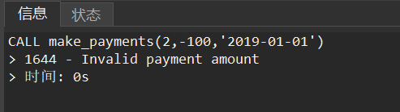
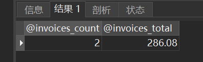
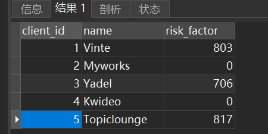
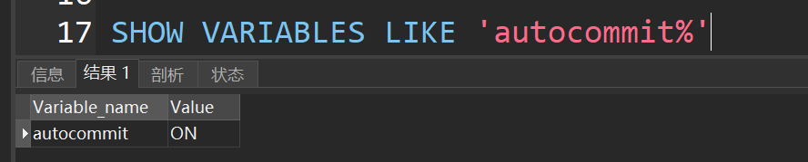
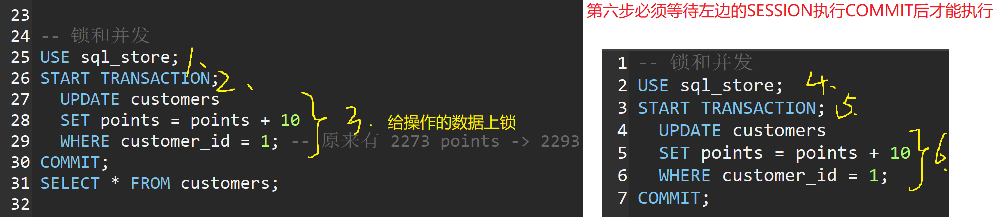
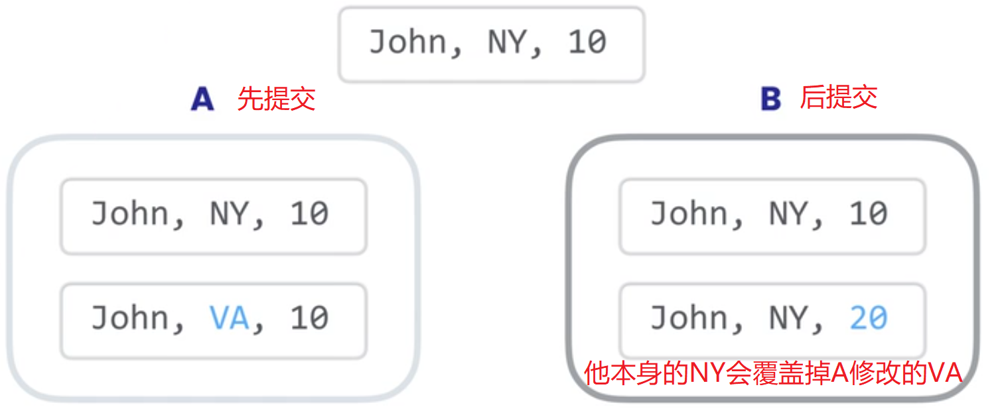
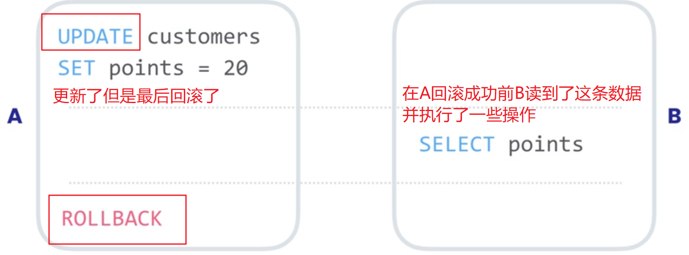
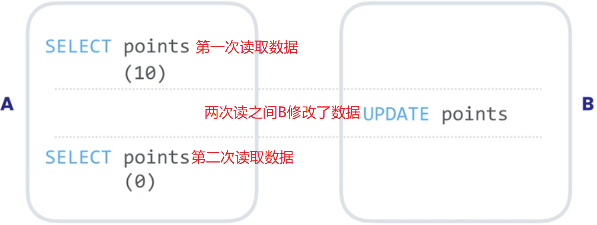
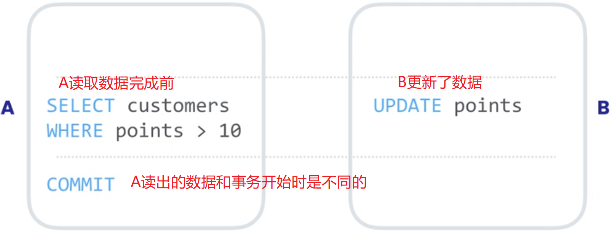

# 第七章 VIEW 视图

## 1、创建视图

CREATE VIEW 名字 AS 查询结果

```sql
USE sql_invoicing;

CREATE VIEW sales_by_client AS
SELECT 
	c.client_id,
	c.name,
	SUM(invoice_total) total_sales
FROM clients c
JOIN invoices i USING(client_id)
GROUP BY c.client_id;

SELECT * 
FROM sales_by_client
ORDER BY total_sales DESC;

-- 取发票表中每个clent的balance
CREATE OR REPLACE VIEW clients_balance AS
SELECT client_id,c.name,invoice_total-payment_total balance
FROM invoices
LEFT JOIN clients c USING(client_id)
GROUP BY c.name;
```


## 2、更新视图

如果视图中没有DISTINCT、Aggregate Functions（MIN、MAX、SUM）、GROUP BY、HAVING、UNION字段，则视图是可更新的。

```sql
CREATE OR REPLACE VIEW invoices_with_balance AS
SELECT 
	invoice_id,
	number,
	client_id,
	invoice_total,
	payment_total,
	invoice_total - payment_total AS balance,
	invoice_date,
	due_date,
	payment_date
FROM invoices
WHERE (invoice_total - payment_total) > 0;

DELETE FROM invoices_with_balance
WHERE invoice_id = 1;

UPDATE invoices_with_balance 
SET due_date = DATE_ADD(due_date,INTERVAL 2 DAY)
WHERE invoice_id = 2;

```

## 3、WITH OPTION CHECK

如果视图的数据源变化，可能会导致视图中的数据缺失。为了防止这种情况出现，可以在创建视图时就使用WITH CHECK OPTION修饰。

```sql
CREATE OR REPLACE VIEW invoices_with_balance AS
SELECT 
	invoice_id,
	number,
	client_id,
	invoice_total,
	payment_total,
	invoice_total-payment_total AS balance,
	invoice_date,
	due_date,
	payment_date
FROM invoices
WHERE (invoice_total - payment_total) > 0
WITH CHECK OPTION;
```

# 第八章 Store Procedure AND Functions 存储过程和函数


## 1、创建存储过程

存储过程和函数的名字一般用小写单词和下划线连接：get_risk_factor

```sql
DELIMITER $$
CREATE PROCEDURE get_clients()
BEGIN 
	SELECT * FROM clients;
END$$
DELIMITER ;

CALL get_clients();

-- Create a stored procedure called get_invoices_with_balance to return all the invoices with a balance > 0

-- DROP VIEW clients_balance;
DROP PROCEDURE IF EXISTS get_clients;

DELIMITER $$
CREATE PROCEDURE get_invoices_with_balance()
BEGIN
	SELECT * FROM invoices_with_balance
	WHERE balance > 0;
END$$
DELIMITER ;

CALL get_invoices_with_balance();
```


## 2、带参数的存储过程

### 2.1 单个参数的存储过程

```sql
DROP PROCEDURE IF EXISTS get_clients_by_state;

DELIMITER $$
CREATE PROCEDURE get_clients_by_state(state CHAR(2))
BEGIN 
	SELECT * FROM clients c
	WHERE c.state = state;
END$$
DELIMITER ;

CALL get_clients_by_state('CA');


DROP PROCEDURE IF EXISTS get_invoices_by_client;

DELIMITER $$
CREATE PROCEDURE get_invoices_by_client(client_id INT)
BEGIN 
	SELECT * FROM invoices i
	WHERE i.client_id = client_id;
END$$
DELIMITER ;

CALL get_invoices_by_client(1);
```

### 2.2 带默认参数的存储过程

```sql
-- 当传入NULL参数查询’CA‘的clients
DROP PROCEDURE IF EXISTS get_clients_by_state;

DELIMITER $$
CREATE PROCEDURE get_clients_by_state(state CHAR(2))
BEGIN 
	IF state IS NULL THEN
	 SET state = 'CA';
	END IF;
	SELECT * FROM clients c
	WHERE c.state = state;
END$$
DELIMITER ;

CALL get_clients_by_state(NULL);


-- 当传入NULL参数查询所有的clients
DROP PROCEDURE IF EXISTS get_clients_by_state2;

DELIMITER $$
CREATE PROCEDURE get_clients_by_state2(state CHAR(2))
BEGIN 
-- 	IF state IS NULL THEN
-- 		SELECT * FROM clients;
-- 	ELSE 
-- 		SELECT * FROM clients c
-- 		WHERE c.state = state;
-- 	END IF;
	SELECT * FROM clients c
	WHERE c.state = IFNULL(state,c.state);
END$$
DELIMITER ;

CALL get_clients_by_state2(NULL);
```

-- Write a stored procedure called get_payments with two parameters:
-- client_id => INT(4B)
-- payment_method_id => TINYINT(0-255)

```sql
DROP PROCEDURE IF EXISTS get_payments;

DELIMITER $$
CREATE PROCEDURE get_payments(client_id INT,payment_method_id TINYINT)
BEGIN 
	SELECT * FROM payments p
	WHERE 
		p.client_id = IFNULL(client_id,p.client_id) AND
		p.payment_method = IFNULL(payment_method_id,p.payment_method);
END$$
DELIMITER ;

CALL get_payments(NULL,NULL); -- arguments = NULL, NULL
CALL get_payments(1,1);
CALL get_payments(1,NULL); -- client_id 1,3,5
```

### 2.3 参数验证（防止直接操作数据库，逃脱代码验证）

```sql
DROP PROCEDURE IF EXISTS make_payments;

DELIMITER $$
CREATE PROCEDURE make_payments(
	invoice_id INT,
	payment_amount DECIMAL(9,2),
	pamyent_date DATE
)
BEGIN 
	IF payment_amount <= 0 THEN
		SIGNAL SQLSTATE '22003' SET MESSAGE_TEXT = 'Invalid payment amount';
		-- throw exception
	END IF;
	UPDATE invoices i
	SET i.payment_total = payment_amount,
			i.payment_date = pamyent_date
	WHERE 
		i.invoice_id = invoice_id;
END$$
DELIMITER ;
CALL make_payments(2,-100,'2019-01-01');
```



### 2.4 输出参数


```sql
-- 输出参数
DROP PROCEDURE IF EXISTS get_unpaied_invoices_for_client;
DELIMITER $$
CREATE PROCEDURE get_unpaied_invoices_for_client(
	client_id INT,
	OUT invoices_count INT,
	OUT invoices_total DECIMAL(9,2)
)
BEGIN 
	SELECT COUNT(*),SUM(invoice_total)
	INTO invoices_count,invoices_total -- 输出参数的赋值
	FROM invoices i
	WHERE i.client_id = client_id AND payment_total = 0;
END$$
DELIMITER ;

-- define varible
SET @invoices_count = 0;
SET @invoices_total = 0;
CALL get_unpaied_invoices_for_client(3,@invoices_count,@invoices_total);
SELECT @invoices_count,@invoices_total;
```




## 3、变量

```sql
-- define varible
-- user or session variables(通过@声明的变量)
SET @invoices_count = 0;
SET @invoices_total = 0;
CALL get_unpaied_invoices_for_client(3,@invoices_count,@invoices_total);
SELECT @invoices_count,@invoices_total;

-- Local variables(通过DECLARE声明的变量)
DROP PROCEDURE IF EXISTS get_risk_factor;
DELIMITER $$
CREATE PROCEDURE get_risk_factor()
BEGIN 
	DECLARE risk_factor DECIMAL(9,2) DEFAULT 0;
	DECLARE invoices_total DECIMAL(9,2);
	DECLARE invoices_count INT;
	
	SELECT COUNT(*),SUM(invoice_total)
	INTO invoices_count,invoices_total -- 输出参数的赋值
	FROM invoices i;
	
	SET risk_factor = invoices_total / invoices_count * 5;
	SELECT risk_factor;
END$$
DELIMITER ;

CALL get_risk_factor(); -- 777.75
```


## 4、函数

函数只能返回单一的值，存储过程可以返回多行的结果集

```sql
-- 函数：根据client_id 求 risk_factor（实时根据invoices表的变化更新）
DROP FUNCTION IF EXISTS get_risk_factor_for_client;
DELIMITER $$
CREATE FUNCTION get_risk_factor_for_client(client_id INT)
RETURNS INTEGER -- 标识返回值类型
-- DETERMINISTIC -- 输入相同则输出相同
READS SQL DATA -- 标识 函数中会使用到SELECT用来读取数据
-- MODIFIES SQL DATA-- 标识 函数中会修改（插入、更新、删除）数据
BEGIN 
	DECLARE risk_factor DECIMAL(9,2) DEFAULT 0;
	DECLARE invoices_total DECIMAL(9,2);
	DECLARE invoices_count INT;
	
	SELECT COUNT(*),SUM(invoice_total)
	INTO invoices_count,invoices_total -- 输出参数的赋值
	FROM invoices i
	WHERE i.client_id = client_id;
	
	SET risk_factor = invoices_total / invoices_count * 5;
	RETURN	IFNULL(risk_factor,0); -- 函数返回值
END$$
DELIMITER ;

SELECT 
	client_id,
	name,
	get_risk_factor_for_client(client_id) AS risk_factor
FROM clients
```




# 第九章 TRIGGER 触发器

触发器是在插入更新和删除语句前后自动执行的一堆SQL代码

## 1、创建触发器

```sql
DELIMITER $$
CREATE TRIGGER payments_after_insert
	AFTER INSERT ON payments
	FOR EACH ROW
BEGIN
	UPDATE invoices
	SET payment_total = payment_total + NEW.amount
	WHERE invoice_id = NEW.invoice_id;
END $$
DELIMITER ;

SELECT * from invoices;

INSERT INTO payments
VALUES(DEFAULT,5,3,'2019-01-01',10,1);


-- Create a trigger that gets fired when we delete a payment.
DROP TRIGGER IF EXISTS payments_after_delete;
DELIMITER $$
CREATE TRIGGER payments_after_delete
	AFTER DELETE ON payments
	FOR EACH ROW
BEGIN
	UPDATE invoices
	SET payment_total = payment_total - OLD.amount
	WHERE invoice_id = OLD.invoice_id;
END $$
DELIMITER ;

SELECT * from payments;

DELETE FROM payments
WHERE payment_id = 11;

-- 根据触发器名查看触发器
SHOW TRIGGERS LIKE 'payments%';
```


## 2、使用能触发器审计

每次新增和删除时，都将操作的记录、操作、操作时间记录到audit表

```sql
-- 创建audit表
USE sql invoicing;
CREATE TABLE payments_audit
(
	client_id INT NOT NULL,
	date DATE NOT NULL,
	amount DECIMAL(9,2) NOT NULL,
	action_type VARCHAR(50) NOT NULL,
	action_date DATETIME NOT NULL
)
-- 新增触发器
DROP TRIGGER IF EXISTS payments_after_insert;
DELIMITER $$
CREATE TRIGGER payments_after_insert
	AFTER INSERT ON payments
	FOR EACH ROW
BEGIN
	UPDATE invoices
	SET payment_total = payment_total + NEW.amount
	WHERE invoice_id = NEW.invoice_id;

	INSERT INTO payments_audit  -- 记录操作
	VALUES(NEW.client_id,NEW.date,NEW.amount,'Insert',NOW());
END $$
DELIMITER ;

-- 删除触发器
DROP TRIGGER IF EXISTS payments_after_delete;
DELIMITER $$
CREATE TRIGGER payments_after_delete
	AFTER DELETE ON payments
	FOR EACH ROW
BEGIN
	UPDATE invoices
	SET payment_total = payment_total - OLD.amount
	WHERE invoice_id = OLD.invoice_id;
	
	INSERT INTO payments_audit  -- 记录操作
	VALUES(OLD.client_id,OLD.date,OLD.amount,'Delete',NOW());
END $$
DELIMITER ;

-- 新增
INSERT INTO payments
VALUES(DEFAULT,5,3,'2019-01-01',10,1);
-- 删除
DELETE FROM payments
WHERE payment_id = 15;
-- 验证
SELECT * FROM payments;
SELECT * FROM payments_audit;
```

## 3、事件

事件是根据计划执行的任务或一堆SQL代码，比如每天早上十点或者每月一次 诸如此类，自动化数据库维护任务。我们首先要打开MySQL事件调度器

```sql
SHOW VARIABLES LIKE 'event%';
SET GLOBAL event_scheduler = ON;

DROP EVENT IF EXISTS yearly_delete_stale_audit_rows;
DELIMITER $$
CREATE EVENT yearly_delete_stale_audit_rows
ON SCHEDULE 
	-- AT '2019-05-01'
	EVERY 1 HOUR STARTS '2019-05-01' ENDS '2029-05-01'
DO BEGIN
	DELETE FROM payments_audit
	WHERE action_date < NOW() - INTERVAL 1 YEAR;
-- 	action_date < DATESUB(NOW() ,INTERVAL 1 YEAR)
END $$
DELIMITER ;
```

## 4、查看、删除、修改事件

```sql
-- 查看、删除、编辑事件
SHOW EVENTS LIKE 'yearly%';

ALTER EVENT yearly_delete_stale_audit_rows DISABLE; -- ENABLE

DELIMITER $$
ALTER EVENT yearly_delete_stale_audit_rows
ON SCHEDULE 
	-- AT '2019-05-01'
	EVERY 1 HOUR STARTS '2019-05-01' ENDS '2029-05-01'
DO BEGIN
	DELETE FROM payments_audit
	WHERE action_date < NOW() - INTERVAL 1 YEAR;
-- 	action_date < DATESUB(NOW() ,INTERVAL 1 YEAR)
END $$
DELIMITER ;
```


# 第十章事务和并发

你们都了解了事务是一组代表单个工作单元的SQL语句

## 1、创建事务

包裹在事务中的每条语句都执行成功才会将修改提交到数据库。

```sql
USE sql_store;

START TRANSACTION;

INSERT INTO orders (customer_id,order_date,status)
VALUES (1,'2019-01-01',1);

INSERT INTO order_items
VALUES (LAST_INSERT_ID(),1,1,1);

COMMIT;
-- ROLLBACK;

SELECT * FROM orders;
SELECT * FROM order_items;

```


默认情况下，执行的每一条语句都被一个事务包装的，如果运行成功就会提交事务，更新数据库。



## 2、Concurrency and Locking 并发和锁定

会存在有两个以及更多的用户同时访问相同的数据的情况，这就是我们所说的“并发”，当一个用户修改其他用户正在检索或修改的数据时，并发可能会成为一个问题。



一个事务操作时会给这些行上锁，这个锁防止其他事务修改这些行，直到第一个事务完成会回滚。

## 3、Concurrency Problems 并发问题

### 3.1 Lost Update 丢失更新



### 3.2 Dirty Reads 脏读

脏读就是当一个事务读取了尚未被提交的数据（READ COMMITTED处理）



### 3.3 Non-repeating Reads 不可重复读

你读取了某个数据两次，并得到了不同的结果怎么办?（REPEATABLE READ只会读取第一次的snipshot）

 

### 3.4 Phantom Reads 幻读

在执行查询后（未提交）才添加、更新、删除的数据（SERIALIZABLE）

如果在查询过中的结果会被其他事务的操作影响，那么查询的事务必须等他们完成；也就是事务的执行属性必须是一个序列，为操作提供了最大的确定性。（影响性能和扩展性）



## 4、事务隔离


## 5、隔离级别


### 5.1 READ UNCOMMITTED


### 5.2 READ COMMITTED


### 5.3 REPEATABLE READ


### 5.4 SERIALIZABLE


## 6、Deadlock 死锁


周四：辣椒炒肉  炒河粉

周五：青菜+香菜+芋头+年糕+丸子+羊肉  炒河粉

周六：炖牛肉（番茄+芋头+香菜）


