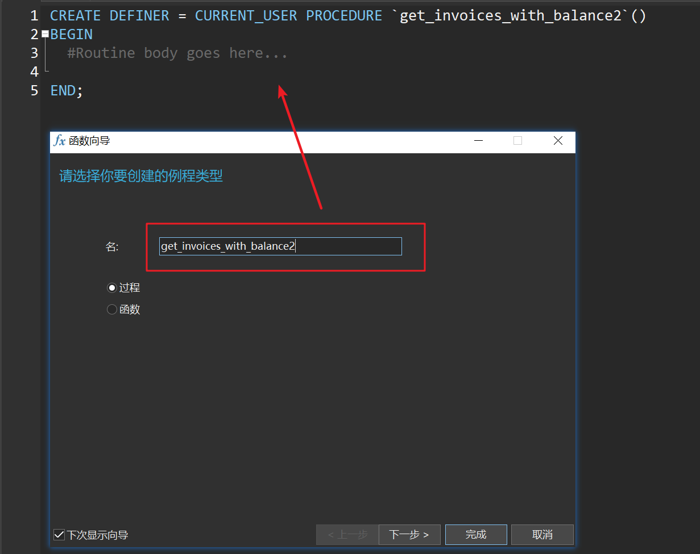

# 第七章 VIEW 视图

## 1、创建视图

CREATE VIEW 名字 AS 查询结果

```sql
USE sql_invoicing;

CREATE VIEW sales_by_client AS
SELECT 
	c.client_id,
	c.name,
	SUM(invoice_total) total_sales
FROM clients c
JOIN invoices i USING(client_id)
GROUP BY c.client_id;

SELECT * 
FROM sales_by_client
ORDER BY total_sales DESC;

-- 取发票表中每个clent的balance
CREATE OR REPLACE VIEW clients_balance AS
SELECT client_id,c.name,invoice_total-payment_total balance
FROM invoices
LEFT JOIN clients c USING(client_id)
GROUP BY c.name;
```


## 2、更新视图

如果视图中没有DISTINCT、Aggregate Functions（MIN、MAX、SUM）、GROUP BY、HAVING、UNION字段，则视图是可更新的。

```sql
CREATE OR REPLACE VIEW invoices_with_balance AS
SELECT 
	invoice_id,
	number,
	client_id,
	invoice_total,
	payment_total,
	invoice_total - payment_total AS balance,
	invoice_date,
	due_date,
	payment_date
FROM invoices
WHERE (invoice_total - payment_total) > 0;

DELETE FROM invoices_with_balance
WHERE invoice_id = 1;

UPDATE invoices_with_balance 
SET due_date = DATE_ADD(due_date,INTERVAL 2 DAY)
WHERE invoice_id = 2;

```

## 3、WITH OPTION CHECK

如果视图的数据源变化，可能会导致视图中的数据缺失。为了防止这种情况出现，可以在创建视图时就使用WITH CHECK OPTION修饰。

```sql
CREATE OR REPLACE VIEW invoices_with_balance AS
SELECT 
	invoice_id,
	number,
	client_id,
	invoice_total,
	payment_total,
	invoice_total-payment_total AS balance,
	invoice_date,
	due_date,
	payment_date
FROM invoices
WHERE (invoice_total - payment_total) > 0
WITH CHECK OPTION;
```

# 第八章 Store Procedure AND Functions 存储过程和函数


## 1、创建存储过程


```sql
DELIMITER $$
CREATE PROCEDURE get_clients()
BEGIN 
	SELECT * FROM clients;
END$$
DELIMITER ;

CALL get_clients();

-- Create a stored procedure called get_invoices_with_balance to return all the invoices with a balance > 0

-- DROP VIEW clients_balance;
DROP PROCEDURE IF EXISTS get_clients;

DELIMITER $$
CREATE PROCEDURE get_invoices_with_balance()
BEGIN
	SELECT * FROM invoices_with_balance
	WHERE balance > 0;
END$$
DELIMITER ;

CALL get_invoices_with_balance();
```



## 2、带参数的存储过程

单个参数的存储过程

```sql
DROP PROCEDURE IF EXISTS get_clients_by_state;

DELIMITER $$
CREATE PROCEDURE get_clients_by_state(state CHAR(2))
BEGIN 
	SELECT * FROM clients c
	WHERE c.state = state;
END$$
DELIMITER ;

CALL get_clients_by_state('CA');


DROP PROCEDURE IF EXISTS get_invoices_by_client;

DELIMITER $$
CREATE PROCEDURE get_invoices_by_client(client_id INT)
BEGIN 
	SELECT * FROM invoices i
	WHERE i.client_id = client_id;
END$$
DELIMITER ;

CALL get_invoices_by_client(1);
```

带默认参数的存储过程

```sql
-- 当传入NULL参数查询’CA‘的clients
DROP PROCEDURE IF EXISTS get_clients_by_state;

DELIMITER $$
CREATE PROCEDURE get_clients_by_state(state CHAR(2))
BEGIN 
	IF state IS NULL THEN
	 SET state = 'CA';
	END IF;
	SELECT * FROM clients c
	WHERE c.state = state;
END$$
DELIMITER ;

CALL get_clients_by_state(NULL);


-- 当传入NULL参数查询所有的clients
DROP PROCEDURE IF EXISTS get_clients_by_state2;

DELIMITER $$
CREATE PROCEDURE get_clients_by_state2(state CHAR(2))
BEGIN 
-- 	IF state IS NULL THEN
-- 		SELECT * FROM clients;
-- 	ELSE 
-- 		SELECT * FROM clients c
-- 		WHERE c.state = state;
-- 	END IF;
	SELECT * FROM clients c
	WHERE c.state = IFNULL(state,c.state);
END$$
DELIMITER ;

CALL get_clients_by_state2(NULL);
```

-- Write a stored procedure called get_payments with two parameters:
-- client_id => INT(4B)
-- payment_method_id => TINYINT(0-255)

```sql
DROP PROCEDURE IF EXISTS get_payments;

DELIMITER $$
CREATE PROCEDURE get_payments(client_id INT,payment_method_id TINYINT)
BEGIN 
	SELECT * FROM payments p
	WHERE 
		p.client_id = IFNULL(client_id,p.client_id) AND
		p.payment_method = IFNULL(payment_method_id,p.payment_method);
END$$
DELIMITER ;

CALL get_payments(NULL,NULL); -- arguments = NULL, NULL
CALL get_payments(1,1);
CALL get_payments(1,NULL); -- client_id 1,3,5
```


周三：腊肉+青菜 玉米面条

周四：辣椒炒肉 青菜+香菜+芋头+年糕+丸子+羊肉 

周五：番茄牛腩（香菜根+芋头） 辣椒炒肉

周六：番茄牛腩 


