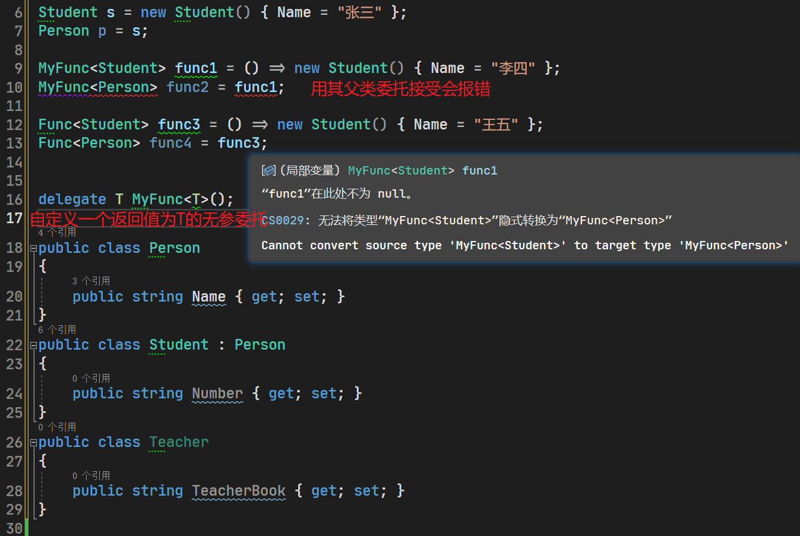

900道：https://blog.csdn.net/m0_65636467/article/details/127789800

问答题：https://www.cnblogs.com/home-wang/p/11002968.html

面试题汇总https://developer.aliyun.com/article/356953

## 1、填空

### 1、C#平台

CTS全称是Common Type System,即通用类型系统。

它是.NET平台的一个关键组成部分。CTS规定了.NET应用程序可以使用的类型、操作以及程序集之间交互的规则。

CTS的主要特点和作用包括:

- 统一所有的.NET语言公共类型,如对象、类、接口等。这些类型在任何.NET语言中都是通用的。
- 定义值类型和引用类型,以及它们之间的区别和交互规则。
- 规定程序集及程序集之间的加载规则、类型匹配规则等。
- 提供运行时类型系统,支持动态语言运行时类型检查和转换。
- 统一异常处理机制。

实际开发中,我们使用的所有.NET类型、类库以及不同语言之间的交互,都必须遵循CTS的规范。

CTS使得不同.NET语言之间可以直接复用类型和组件,在同一个运行时环境下无缝协作。它极大提升了多语言编程的效率。可以说,CTS是.NET横跨不同语言的基石。

1. C#通用类型系统CTS分为（ 值类型 ）和（引用类型）
2. ？（CTS或通用类型系统）保证在.NET开发中不同的语言类型之间的相互兼容
3. C#程序的基本单位是（语句）
4. （MSIL）是独立于CPU 的指令集，它可以被高效地转换为特定于某种CPU 的代码
5. C#程序中，可使用try…catch 机制来处理程序出现的（运行）错误
6. C#的值类型包括（简单类型）、结构类型和枚举类型
7. 开发C#程序的集成开发环境是（Visual Studio .NET）
8. 结构化的程序设计的3种基本结构是（顺序结构），（选择结构）和（循环结构）
9. 错误的类型是什么：语法错误(Syntax error) 逻辑错误(Logic error) 运行时错误(Runtime error)

### 2、基本数据类型

| 基本数据类型        | 占用的字节数(1byte =8bit) |
| ------------------- | ------------------------- |
| sbyte、byte、 bool  | 1                         |
| short、ushort、char | 2                         |
| int、float、uint    | 4                         |
| long、ulong、double | 8                         |
| decimal             | 16                        |

1. 一个元素类型为double的二维数组，共有2行5列，计算存储空间的大小可以按照以下步骤进行：

2. - 计算每个元素的大小：
     一个double类型的元素占用8个字节（64位）的存储空间。
   - 计算二维数组的总元素个数：
     二维数组共有2行5列，因此总共有2 * 5 = 10个元素。
   - 计算二维数组的总存储空间大小：
     总存储空间大小 = 每个元素的大小 * 总元素个数
     = 8字节/元素 * 10个元素
     = 80字节

3. byte b = 'a'; byte c = 1; byte d = 'ab'; byte e = '啊'; byte g = 256; 这些变量有些错误是错再哪⾥?

   - b = 'a'; - 正确。'a'的ASCII码值为97,在byte范围内。
   - c = 1; - 正确。1在byte范围内。
   - d = 'ab'; - 错误。'ab'的ASCII码值超出了byte范围（'a'的ASCII码值为97，b'的ASCII码值为98，字符串是以ASCII码顺序存储字符的,例如'ab'会存储为9798，超出了byte范围）。
   - e = '啊'; - 错误。'啊'的Unicode码值超出了byte范围。
   - g = 256; - 错误。256超出了byte类型的范围,最大只能到255（C#⾥⼀个byte是0~255）。

4. byte a =255;a+=5;a的值是多少？

   - 所以a+=5之后是260发生无符号数溢出，数值会重置计算，结果为余数=260%255=4

5. 分析下⾯代码，a、b的值是多少？

   ```C#
   string strTmp = "a1某某某";
   int a = System.Text.Encoding.Default.GetBytes(strTmp).Length; //8或11
   int b = strTmp.Length;//5
   ```

   如果使用GBK编码,每个中文字符实际占用2个字节；使用UTF-8,情况就不同了。UTF-8是一种变长编码,中文字符会编码为3个字节（GetBytes时可能会选择UTF-8等其他多字节编码）

6. .short s1 = 1; s1 = s1 + 1;有什么错? short s1 = 1; s1 += 1;有什么错?

   - `short s1 = 1; s1 = s1 + 1;` 错，需要手动添加强制转换
   - `short s1 = 1; s1 += 1;` 对，+=内部做了强制类型转换

7. Math.Round()

   ```C#
   Console.WriteLine(Math.Round(-11.5)); //-12
   Console.WriteLine(Math.Round(-11.5,1));//-11.5
   ```

   

8. C#中的字符串有两类，规则字符串和逐字字符串，定义逐字字符串时，应在其前面加上（ @ ）号。https://www.cnblogs.com/XiaoAi3/archive/2012/06/13/2548642.html

9. 浮点类型包括（float）、（double）和（decimal）

### 3、复杂数据类型

枚举类型是一组命名的常量集合，所有整形都可以作为枚举类型的基本类型，如果类型省略，则定义为（ a ）。

在Queue类中，Enqueue方法的作用是（ 在队列末端加入新的元素 ）移除并返回队列前端对象的方法是（ Dequeue ）

### 4、C# 运算

1. （ Array ）是所有数组的基类
2. ？（不规则数组）是数组的数组，它内部每个数组的长度可以不同，就像一个锯齿形状
3. 优先级最高的运算符是（( )）
4. 要定义一个3行4列的单精度型二维数组f，使用的定义语句为（float[,] f=new float[3,4]; ）
5. C#中的表达式类似于数学运算中的表达式，是由操作符、操作对象和（运算符）等连接而成的式子
6. Random.Next 方法用来产生随机数
7. 在catch语句中列出异常类型时FormatException异常应列在Exception异常的（ 前面 ）
8. switch（expr1）中，expr1的类型都有哪些？
   - 整数类型（byte、sbyte、short、ushort、int、uint、long、ulong）
   - 字符类型（char）
   - 字符串类型（string）C# 7.0及更高版本中，可以使用字符串类型的表达式进行匹配。
   - 枚举类型（enum）
   - 布尔类型（bool）C# 8.0及更高版本中，可以使用布尔类型的表达式进行匹配。

### 5、类特性

1. C#的类修饰符和成员修饰符：https://blog.csdn.net/moakun/article/details/78638547

2. 类及成员的访问修饰符


| 修饰符             | 注释                                                       |
| ------------------ | ---------------------------------------------------------- |
| public             | 访问不受限制                                               |
| private            | 只能在定义此类的类型中访问                                 |
| protected          | 在该类中以及其派生类中访问                                 |
| internal           | 能在同一个程序集中访问                                     |
| protected internal | 表示在同一程序集中的派生类中或同一程序集中的其他类型中可见 |
| private protected  | 等效于protected,但只能在派生类中访问                       |

- 接口只能定义公有方法,没有权限修饰符。
- 结构体的方法默认就是public的,不能声明为private或protected。
- 委托的方法一律当作public处理

1. 在C#中**类的默认访问修饰符**是（internal）；类的**方法声明中默认访问修饰符**是（private）
2. 类的protected类型成员只允许在（ 当前类）和(其子类）被直接访问
3. 使用（sealed）关键字修饰的类，可以避免类被继承。String类是密封类故不可以继承
4. 封装的对象之间进行通信的一种机制叫做（　消息传递　）
5. （ 多态 ）是指同一个消息或操作作用于不同的对象，可以有不同的解释，产生不同的执行结果。
6. （ 封装 ）是用一个框架把数据和代码组合在一起，形成一个对象。
7. 继承具有（传递性），即当基类本身也是某一类的派生类时，派生类会自动继承间接基类的成员。
8. 创建新对象时将调用类的 构造函数 。它主要用来为对象分配存储空间，完成初始化操作
9. 派生类构造函数的执行顺序是从最上面的（基类）开始，直到最后一个（派生类）结束
10. 派生类的对象对它的基类成员中的（　私有或private　）成员是不可访问的
11. （索引器）是一类特殊的属性，通过它们可以像引用数组一样引用自己的类
13. C#中使用（struct）关键字表示泛型的值类型约束

### 6、接口、方法特性

1. ？接口的实现指出接口成员所在的接口，称为显式接口成员，它只能通过（接口）来调用
2. 属性能在接⼝中声明，但不能有访问修饰符，不能初始化赋值
3. C#虽然不支持多重继承，但提供了另一种类似的机制是（ 接口 ），可以多继承。
4. ？在C#中实参与形参有四种传递方式，它们分别是（ 值参数 ）（ 引用参数 ）（ 输出参数 ）和（ 参数数组 ）
5. 对于方法，参数传递分为值传递和 (引用传递)两种
6. C#通过（装箱 ）和（拆箱）机制，可以实现值类型和引用类型之间的转换，整数a赋值给一个obiect对象时，整数a将会被（装箱）
7. - 

### 7、Winform

1. 在C#中，可以标识不同的对象的属性是（Name）
2. Windows窗体应用程序的编程模型主要由（窗体）、（控件）和（事件）
3. 所有的Windows窗体控件都是从System.Windows.Forms.Control类继承而来，它公开的成员主要包含：（属性、事件、方法）。
4. 用鼠标右击一个控件时出现的菜单一般称为（快捷菜单）
5. Timer控件的（Interval）属性，用来指定时钟空间触发时间的时间间隔，单位毫秒。
6. 在windows程序中，若想选中复选框，则应将该控件的（Checked）属性设置为true
7. Web程序中的GridView控件和Windows程序的（DataGrid/DataGridView）控件类似
8. ComboBox控件的SelectedIndex属性返回对应于组合框中选定项的索引整数值，其中，第1项为（0），未选中为（-1）
9. 若要在文本框中输入密码，常指定（PasswrodChar）属性。
10. 在Visual Studio中双击窗体中的某个按钮，则会自动添加该按钮的（Clicked）事件
11. CheckBox与RadioButton控件的区别在于（后者只能单选）
12. 选定或取消选定RadioButton时，都会触发（CheckedChanged）事件
13. 使用Message.Show( )方法可以显示消息框，消息框的返回值是一个 DialogResult 类型
14. 让控件不可用的属性是（enabled）让控件不可见的属性是（visible）

### 8、ADO.NET

1. 使用SqlDataReader一次可以读取（1）条记录

2. 在ADO.NET中，可以在DataSet中维护（ DataRelation）对象的集合来管理表间的导航关系

3. 在DataSet对象中，可通过（ Tables ）集合遍历DataSet对象中所有的数据表对象

4. 在ADO.NET中，通过执行Command对象的ExecuteReader方法返回的DataReader对象是一种（只向前的只读的结果集 ）

5. ADO.NET框架中的类主要属于（ System.Data ）命名空间

6. ADO.NET对象模型包含（.NET数据提供程序）和（DataSet）两部分

7. 若想从数据库中查询到student表和course表中的所有信息并显示出来，则应该调用命令对象的（ExecuteReader）方法

8. 在ADO.NET中，为访问DataTable对象从数据源提取的数据行，可使用DataTable

   对象的（Rows）属性

9. 若想在数据表中创建一个计算列，应设置数据列的（Expression）属性

10. DataAdapter 对象使用与（UpdateCommand）属性关联的Command 对象将DataSet 修改的数据保存入数据源。（InsertCommand）属性相关联的Command对象将DataSet插入的数据更新入数据源。

11. 填充数据集应调用数据适配器的（Fill）方法

12. 更新数据集应调用数据适配器的（Update）方法

### 9、数据库

在设置连接字符串时，参数Initial Catalog代表的含义是（数据库的名称）

看到选择题的31题

Type对象包含了完整的类型信息元数据,我们可以通过它来访问类的:

- 名称、成员(字段、属性、方法)
- 修饰符(public、private等)
- 构造函数
- 实现的接口
- 父类

```C#
//1、获取类型信息:
Type type = typeof(MyClass);
//获取类型名
string name = type.Name;

//2、访问字段:
FieldInfo field = type.GetField("fieldName");
object value = field.GetValue(obj);

//3、调用方法:
MethodInfo method = type.GetMethod("MethodName");
object result = method.Invoke(obj, args);

//4、创建对象:
ConstructorInfo constructor = type.GetConstructor(Type.EmptyTypes);
object instance = constructor.Invoke(null);

5、设置属性值:
PropertyInfo property = type.GetProperty("PropertyName");
property.SetValue(obj, value, null);
```

AOP(Aspect Oriented Programming)即面向切面编程,是一种编程范式。AOP的主要思想和特点是:

1. 将程序功能分为核心关注点(Core Concern)和边角关注点(Cross-cutting Concern)。
2. 核心关注点即业务功能本身,边角关注点是跨越多模块的通用功能,如日志、缓存、安全等。
3. 通过切面(Aspect)来实现边角关注点的代码逻辑,使用反射可以在不修改原有代码的情况下注入这些边角关注点。
4. 常见的AOP实现工具有PostSharp和AspectCore等。它们使用动态代理、继承或 IlEmit来生成代理类实现AOP功能。
5. AOP可以让程序更利于维护、扩展,比如日志可以在所有需要的方法前后插入, centralized管理

主要应用场景包括:

1. 日志记录:可以在方法前后插入日志代码,记录方法调用情况等。
2. 事务处理:统一在方法周围实现事务提交和回滚逻辑。
3. 权限检查:对方法访问进行鉴权,只允许授权用户调用。
4. 性能监控:记录方法执行时间,提高性能问题诊断能力。
5. 缓存:实现方法结果的缓存,避免重复调用。
6. 异常处理:对所有方法的异常进行统一处理或日志记录。
7. 验证:对参数和返回值进行格式和正确性验证。
8. 编程规范:强制执行命名标准、日志标准等各模块通用规则。
9. 与第三方应用交互:在方法调用前后处理第三方API相关任务。
10. 持久层操作:统一地实现方法 BEGIN/COMMIT事务等数据操作。

5. 

https://leetcode.cn/problems/consecutive-numbers/description/?envType=study-plan-v2&envId=sql-free-50

```sql
select p.product_id,p.change_date,p.new_price 
from Products p
left join (
    select product_id,min(datediff('2019-08-16', change_date)) below_day from Products
    where change_date<='2019-08-16'
    group by product_id 
)a on (p.product_id = a.product_id and datediff('2019-08-16', change_date)=a.below_day) or datediff('2019-08-16', change_date) < 0


select * from (
    select distinct p.product_id,a.below_day from Products p
    left join (
        select product_id,min(datediff('2019-08-16', change_date)) below_day,new_price from Products 
        where change_date<='2019-08-16'
        group by product_id 
    ) a on p.product_id = a.product_id
) b
left join Products pp on b.product_id = pp.product_id and (datediff('2019-08-16', pp.change_date)=b.below_day )


select a.category,count(*) accounts_count from(
select case 
when income < 20000 then 'Low Salary'
when income >= 20000 and income <= 50000 then 'Average Salary'
when income > 50000 then 'High Salary'
end as category
from Accounts
) a 
group by a.category
```

## C#基础语法

### 1、Deep Copy与Shadow Copy

深拷贝(Deep Copy)意味着对象以及它包含的属性都被复制了一份,修改副本不会影响原对象。实现`IClonable接口`后能深度复制一个对象出来。深度复制的特征是调用对象的构造方法，创建新的对象，包括创建对象中嵌套的引用对象的新实例。

而浅拷贝(Shadow Copy)只复制对象自身,不复制它包含的内部对象,所以修改副本的内部对象同时会影响原对象。浅表复制的实现是Object.MemberWiseClone()

- 基础值类型属性(如string、int等)在赋值时进行深拷贝
- 引用类型属性(如类类型)在赋值时进行浅拷贝

```C#
public class Person 
{
  public string Name {get; set;}
  public Address Address {get; set;}
}

public class Address
{
  public string Street {get; set;}
}
```

如果直接赋值`p2 = p1`，这里p2是p1的浅拷贝,它们指向同一个Address对象。如果修改p2.Address.Street,会影响p1。

```C#
Person p1 = new Person();
p1.Name = "Tom";
p1.Address = new Address(){Street="One way"};

Person p2 = p1; 
```

而深拷贝需要手动拷贝Address

```C#
Person p3 = new Person();
p3.Name = p1.Name;
p3.Address = new Address(){Street = p1.Address.Street};
```

或让Person、Address实现IClonable接口

```C#
public class Person : ICloneable
{
  public string Name { get; set; }
  public Address Address { get; set; }

  public object Clone() 
  {
    return new Person() 
    {
      Name = this.Name,
      Address = (Address)this.Address.Clone() //引用类型也需要深拷贝
    };
  }
}

public class Address : ICloneable
{
  public string Street { get; set; }

  public object Clone()
  {
    return new Address() { Street = this.Street }; 
  }  
}
```

### 应用程序域、受管制的代码、托管代码

应用程序域(AppDomain)是应用程序执行的一个隔离单元，用于**隔离和管理应用程序的托管环境**。每个应用程序域都有自己的虚拟地址空间，并且可以加载和执行独立的程序集。

主要特征和作用:

- 一个AppDomain隔离其它AppDomain,如果一个AppDomain发生崩溃不会影响其它AppDomain。
- AppDomain可以独立加载和卸载程序集,每个程序集只能加载一次。不同AppDomain可以加载不同版本的同一个程序集。
- AppDomain可以用来隔离插件。每个插件运行在独立的AppDomain中。

托管代码(.NET代码)是由CLR(通用语言运行时间)托管和管理的代码。它被编译成中间语言IL,在运行时利用JIT编译转换为本机码运行。

受管制代码是指在.Net环境中运行的任何代码都是受管制的代码（managed code），.Net外部的代码也运行在windows上，这些代码称为未受管制的代码（unmanaged code）

这三个概念都关系到.NET程序的执行环境和隔离机制。希望解释能帮助您更好地理解它们在.NET体系结构中的位置和作用。

### const和readonly

const定义的常量必须在编译时就能确定其值,所以const变量只能初始化为字面量或编译时就能计算出来的值，对const变量的修改都会导致编译错误。

而readonly允许在运行时初始化,但之后就不能再修改，readonly在运行时会检查修改,产生异常。

- const适用于编译时确定不变的常量。
- 适用于运行时可能变化但后续不变的常量。

|              | const                                               | readonly                                     |
| ------------ | --------------------------------------------------- | -------------------------------------------- |
| 修饰的范围   | 只能应用于基本类型或字符串类型的字段                | 可以用在任何类型的字段或属性                 |
| 设定时机     | const字段必须在**声明时或构造函数中**被显式赋值     | 在声明处赋值,也可以在其他方法/构造函数中赋值 |
| 是否可以改变 | const值在编译期间被确定，在整个程序运行期间保持不变 | 在有限的初期化阶段被设置,之后就被禁止修改    |
| 作用域       | 在任意程序集中命中名称                              | 只是约束了当前类型的实例修改行为             |

使用const可以避免由于误操作而导致的值被修改,从而提高程序的健壮性。const使用起来更严格，但能提供更强的安全保证（const不能用static修饰）；而readonly则灵活一些但保证程度较低。根据实际需要,灵活选择使用。

### 堆和栈

| 线程堆栈 stack                                               | 托管堆 heap                                                  |
| ------------------------------------------------------------ | ------------------------------------------------------------ |
| 值类型大多分配在栈上（如作为类的成员时，也可能存储在堆上）   | 引用类型都分配在堆上                                         |
| 栈由操作系统管理，栈上的变量在其作用域完成后就被释放，效率较高，但空间有限。 | 堆受CLR的GC控制                                              |
| 栈是基于线程的，每个线程都有自己的线程栈，初始大小为1M       | 堆是基于进程的，一个进程分配一个堆，堆的大小由GC根据运行情况动态控制 |
| 由系统管理生存期，存储代码执行和调用路径，执行或调用完毕即从栈中清除 | 调用完毕之后依然存在，由垃圾回收器查找栈中有无指向该值或对象的引用，无则从堆中删除。 |

（1）“结构”对象可能分配在堆上吗？什么情况下会发生，有什么需要注意的吗？

答：结构是值类型，有两种情况会分配在堆上面： 结构作为class的一个字段或属性，会随class一起分配在堆上面； 装箱后会在堆中存储，尽量避免值类型的装箱，值类型的拆箱和装箱都有性能损失

（2）如果结构体中定义引用类型，对象在内存中是如何存储的？例如下面结构体中的class类 User对象是存储在栈上，还是堆上？

```c#
public struct MyStruct
{
    public int Index;
    public User User;
}
```

答：MyStruct存储在栈中，其字段User的实例存储在堆中，MyStruct.User字段存储指向User对象的内存地址。

### as和is

当⼀个不正确的类型转换发⽣时，会产⽣InvalidCastException异常，有时我们会⽤try-catch块做⼀些尝试性的类型转换，这样的代码没有任何错误，但是性能却相当糟糕，为什么呢？异常是⼀种耗费资源的机制，每当异常被抛出时，异常堆栈将会被建⽴，异常信息将被加载，⽽通常这些⼯作的成本相对较⾼，并且在尝试性类型转换时，这些信息都没有意义。

is 只负责检查类型的兼容性，并返回结果：true 和 false，对象为null也会返回false。→ 进⾏类型判断

```C#
object o = new object();
// 执⾏类型兼容性检查
if (o is ISample)
{
    // 执⾏类型转换
    ISample sample = (ISample)o;
    sample.SampleShow();
}
Console.ReadKey();
```

as 不仅负责检查兼容性还会进⾏类型转换，并返回结果，如果不兼容则返回 null 。→ ⽤于类型转
型as⽐is效率更⾼，as只需要做⼀次类型兼容检查

```C#
object o = new object();
// 执⾏类型兼容性检查
ISample sample = o as ISample;
if (sample != null)
{
    sample.SampleShow();
}
Console.ReadKey();
```


### ref和out

out和ref关键字类似，不同之处在于（ref）要求变量在作为参数传递之前必须进行初始化，而（out）不需要初始化。ref会使用原来的变量地址，out是返回一个新的变量。out适合用在需要retrun多个返回值的地方，而ref则用在需要被调用的方法修改调用者的引用的时候

```C#
static void Main(string[] args)
{
  int x = 1; //需要初始化
  
  Method1(ref x); //将x作为ref参数传递
  Console.WriteLine(x); //输出10

  int y; //无需赋值
  Method2(out y);
  Console.WriteLine(y); //输出20
}

static void Method1(ref int num) 
{
  num = 10; //直接修改num的值,实际上修改了调用 ref的x
}

static void Method2(out int num)
{
  num = 20; //必须显式赋值给out类型的参数
}
```

直接使用返回值其实也可以实现在方法内修改调用参数的值这一需求。那么为什么还需要ref和out关键字呢?

主要有以下几点原因:

1. 函数定义时如果不能或不想用返回值,就需要使用ref/out。比如void方法。

2. 对性能有影响。ref/out可以避免额外的复制和内存开销。

3. 语义更清晰准确。直接看参数定义就知道是否会被修改。

4. 有些场景下更方便编程。比如交换两个变量的值就通常用ref。

   ```C#
   static void SwapValues(ref int x, ref int y)  
   {
     int temp = x;
     x = y;
     y = temp;
   }
   static (int x, int y) SwapValuesRet2(int x, int y) //v使用值返回不如ref方便,需要特殊处理
   {
     return (y, x);
   }
   static void Main(string[] args)
   {
     int a = 10;
     int b = 20;
   
     Console.WriteLine("Before swap:"); 
     Console.WriteLine("a = {0}, b = {1}", a, b);
   
     SwapValues(ref a, ref b);
   
     Console.WriteLine("After swap:");
     Console.WriteLine("a = {0}, b = {1}", a, b); 
   }
   ```

5. 函数重载。ref和out可以与非ref函数区分开来 overloading。

   ```C#
   int Add(int x, int y) //普通加法
   {
     return x + y;
   }
   
   int Add(ref int x, int y)  //累加第一个参数
   {
     x += y;
     return x;
   }
   
   int Add(int x, out int y)//给第二个参数赋初始值
   {
     y = x + 5;
     return y;
   }
   ```

6. 历史原因。C#从一开始就支持ref/out,覆盖更广泛的使用场景。

请利⽤ foreach 和 ref 为⼀个数组中的每个元素加 1

```C#
int[] arr = { 1, 2, 3, 4, 5, 6 };
 
foreach (ref int a in arr.AsSpan())
{
    a++;
}
foreach (int a in arr)
{
    Console.Write(a+" ");
}
```

### 拆箱与装箱

3.1 什么是拆箱和装箱？
装箱就是值类型转换为引用类型，拆箱就是引用类型（被装箱的对象）转换为值类型。

3.2 什么是箱子？
就是引用类型对象。

3.3 箱子放在哪里？
托管堆上。

3.4 装箱和拆箱有什么性能影响？
装箱和拆箱都涉及到内存的分配和对象的创建，有较大的性能影响。

3.5 如何避免隐身装箱？
编码中，多使用泛型、显示装箱。

3.6 箱子的基本结构？
箱子就是一个引用类型对象，因此她的结构，主要包含两部分：值类型字段值；引用类型的标准配置，引用对象的额外空间：TypeHandle和同步索引块

3.7 装箱的过程？

```C#
var i = 123;    //System.Int32
//对 i 装箱（隐式）进对象 o
object o = i;
```

**下面的图来自[装箱](https://www.cnblogs.com/liqingwen/p/6486332.html)**

1. 在堆中申请内存，内存大小为值类型的大小，再加上额外固定空间（引用类型的标配：TypeHandle和同步索引块）；
2. 将值类型的字段值（x=1023）拷贝新分配的内存中；
3. 返回新引用对象的地址（给引用变量object o）

装箱默认是隐式的，当然，你可以选择显式，但这并不是必须的

3.8 拆箱的过程？

1. 检查实例对象（object o）是否有效，如是否为null，其装箱的类型与拆箱的类型（int）是否一致，如检测不合法，抛出异常；
2. 指针返回，就是获取装箱对象（object o）中值类型字段值的地址；
3. 字段拷贝，把装箱对象（object o）中值类型字段值拷贝到栈上，意思就是创建一个新的值类型变量来存储拆箱后的值；

```c#
int i = 123;       // 值类型
object o = i;     // 装箱
int j = (int)o;    // 拆箱
```

要在运行时成功拆箱值类型，被拆箱的项必须是对一个对象的引用，该对象是先前通过装箱该值类型的实例创建的。

int?是通过int装箱为引⽤类型实现的吗？

答：错，int?是.NET框架提供的Nullable类型的语法糖写法。Nullable类型的全称`System.Nullable<T>`它是一个结构体，内部使用`boolHasValue属性`标记是否有值,`Value属性`表示值本身，专门用于表示值类型变量可以设置为null

### record、class、struct

参考文章：https://blog.kitlau.dev/posts/csharp-3-years-ago-record-have-you-used-it-now/#

record 类型是不可变的引用类型，具有值语义，主要适用于表示不可变的数据结构。class 类型是可变的引用类型，适用于表示具有复杂行为和状态的对象。struct 类型是可变的值类型，适用于表示轻量级的、简单的数据结构。

### 索引器

允许一个对象可以像数组一样使用下标的方式来访问。当您为类定义一个索引器时，该类的行为就会像一个 **虚拟数组（virtual array）** 一样。您可以使用数组访问运算符 **[ ]** 来访问该类的的成员。

```C#
public class MyCollection
{
    private string[] data = new string[10];

    // 索引器的定义
    public string this[int index]
    {
        get
        {
            if (index >= 0 && index < data.Length) return data[index];
            else throw new IndexOutOfRangeException();
        }
        set
        {
            if (index >= 0 && index < data.Length) data[index] = value; 
            else throw new IndexOutOfRangeException();
        }
    }
}
//使用
MyCollection collection = new MyCollection();
collection[0] = "Hello";
string value = collection[0];
Console.WriteLine(value); // 输出："Hello"
```


### 常量池

为了提高性能和保证执行效率，.Net Framework维护了一个字符串池（暂存池、常量池），用以对使用过的字符串进行缓存。当为字符串类型的变量赋值时，此值同时被放入常量池中，在以后需要创新新的字符串时，CLR会首先检查池中是否存在相同值的字符串对象，如果存在，就将变量指向池中已经存在的对象，那么旧的对象又得以重用了，这个过程称为“字符串驻留”。而常量池缓存字符串对象的原则是：**直接出现在代码中的字符串都会被放入“常量池”，而动态创建的字符串对象并不会被放入。**可使用string.IsInterned(string)进行测试。

字符串常量池的大小并没有明确规定,它会动态增长以适应程序中使用到的字符串常量数量和大小。但通常情况下:

- .NET Framework 4.0 及更低版本时,字符串常量池默认最大大小为64KB(在32位系统下,64KB是一个较大但又不至于浪费的内存尺寸,可以满足大多数应用程序的需要)。
- .NET Framework 4.5 及更高版本时,字符串常量池默认最大值为2GB。

### string的不可变性

字符串对象是不可变的：即它们创建之后就无法更改。 所有看似修改字符串的 String 方法和 C# 中的运算符，实际上都以新字符串对象的形式返回结果。 在下面的示例中，当连接 s1 和 s2 的内容以形成一个字符串时，不会修改两个原始字符串。 += 运算符会创建一个包含组合内容的新字符串。 这个新对象赋给变量 s1，而最初赋给 s1 的对象由于没有其他任何变量包含对它的引用而释放，将在后续被垃圾回收。

```c#
static void Main(string[] args)
{
      var s1 = "Hi!";
      var s2 = "Fanguzai!";
      //拼接 s1 和 s2，并且修改 s1 指向的值
      s1 += s2;  //即 s1 = s1 + s2;
      Console.WriteLine(s1);
      Console.Read();
}
```

4.1 字符串是引用类型类型还是值类型？
引用类型

4.2 在字符串连加处理中，最好采用什么方式，理由是什么？

- 多修少读：StringBuilder
- 少修多读：String

少量字符串连接，使用String.Concat。
大量字符串使用StringBuilder，因为StringBuilder的性能更好(由于string的不可变性，如果使用string的话会创建大量字符串对象;StringBuilder通常用于那些需要重复多次修改的场景,比如高频率的字符串拼接。)

都是引⽤类型，分配再堆上
StringBuilder默认容量是16，可以允许扩充它所封装的字符串中字符的数量.每个StringBuffer对象都有⼀定的缓冲区容量，当字符串⼤⼩没有超过容量时，不会分配新的容量，当字符串⼤⼩超过容量时，会⾃动增加容量。

对于简单的字符串连接操作，在性能上stringbuilder不⼀定总是优于strin因为stringbulider对象的创建也
消耗⼤量的性能，在字符串连接⽐较少的情况下，过度滥⽤stringbuilder会导致性能的浪费⽽⾮节约，只有⼤量⽆法预知次数的字符串操作才考虑stringbuilder的使⽤。从最后分析可以看出如果是相对较少的字符串拼接根本看不出太⼤差别。

4.3 `String s = new String("xyz");`创建了几个String Object?
两个对象:

1. 一个是字符串池中的"xyz"对象。由于首次出现这个字符串字面量,会在字符串池中新增一个"xyz"对象。
2. 另一个是使用new关键字直接创建的String实例对象s。这时会执行new String("xyz")的构造方法,但此时字符串池中已有"xyz",所以会直接返回池中的对象引用。

`String s = new String("xyz"):`与`String s = "xyz"`二者区别

- String s = new String("xyz"): 使用new关键字创建String对象,每次都会新建一个String实例。(对象方式每次都会创建新的String对象,增加内存开销)
- String s = "xyz": 字符串池的工作方式。这种写法相当于从字符串池中查找和获取一个"xyz"字符串对象的引用。如果池中没有就新建一个加入池中。

4.4 是否可以继承String类?
String类是sealed类故不可以继承。

4.5 string与String的区别
string、int是C#定义的类型，而String、Int32是.net类型即是CTS类型；
string 是 .NET 框架中 System.String 的别名。
string在编译的时候会转化为String类

4.6 String str=new String("a")和String str = "a"有什么区别？
String str = "a"; 这个只是一个引用，内存中如果有“a"的话，str就指向它，如果没有才创建如果你以后还用到"a"这个字符串的话并且是这样用： `String str1 = "a"; String str2 = "a"; String str2 = "a";`这4个变量都共享一个字符串"a" 而`String str = new String("a");`是根据"a"这个String对象再次构造一个String对象，将新构造出来的String对象的引用赋给str
[string字符串](https://www.cnblogs.com/home-wang/p/10971414.html)

4.7 判断字符串变量str是否为空的方法？

- str=="";
- str==String.Empty
- str.Length==0;String.IsNullOrEmpty(str)

微软的实现

```c#
// Token: 0x060002C0 RID: 704 RVA: 0x00380D97 File Offset: 0x0037EF97
[NonVersionable]
public static bool IsNullOrEmpty(string value)
{
    return value == null || 0 >= value.Length;
}
```

4.8 string str = null 与 string str = “” 说明其中的区别?
string str = null 是不给他分配内存空间,而string str = "" 给它分配长度为空字符串的内存空间。 string str = null没有string对象，string str = “”有一个字符串对象。

4.9 StringBuilder 和 String 的区别？
String 在进行运算时（如赋值.拼接等）会产生一个新的实例，而 StringBuilder 则不会。所以在大量字符串拼接或频繁对某一字符串进行操作时最好使用 StringBuilder，不要使用 String

如果要操作一个不断增长的字符串，尽量不用String类,改用StringBuilder类。两个类的工作原理不同:String类是一种传统的修改字符串的方式，它确实可以完成把一个字符串添加到另一个字符串上的工作没错，但是在.NET框架下，这个操作实在是划不来。因为系统先是把两个字符串写入内存，接着删除原来的String对象，然后创建一个String对象，并读取内存中的数据赋给该对象。这一来二去的，耗了不少时间。而使用System.Text命名空间下面的StringBuilder类就不是这样了，它提供的Append方法，能够在已有对象的原地进行字符串的修改，简单而且直接。当然，一般情况下觉察不到这二者效率的差异，但如果你要对某个字符串进行大量的添加操作，那么StringBuilder类所耗费的时间和String类简直不是一个数量级的。

4.10 不是说字符串是不可变的吗？string s="abc";s="123"不就是变了吗？
String是不可变的在这段代码中，s原先指向一个String对象，内容是 "abc"，然后我们将s指向"123"，那么s所指向的那个对象是否发生了改变呢？答案是没有。这时，s不指向原来那个对象了，而指向了另一个 String对象，内容为"123"，原来那个对象还存在于内存之中，只是s这个引用变量不再指向它了。

4.11 字符串中string str=null和string str=""和string str=string.Empty的区别？

` string.Empty`相当于`string str=""`,Empty是⼀个静态只读的字段。 string str="" ,初始化对象，并分配⼀个空字符串的内存空间 string str=null,初始化对象，不会分配内存空间

### abstract和interface有什么区别

抽象类一种不可以被实例化的类。抽象类中一般含有抽象方法，当然也可有具体实现。继承类只有实现过所有抽象类的抽象方法后才能被实例化。
相同点：都不能被直接实例化，都可以通过继承实现其抽象方法。

| 层次           | 抽象类                                                       | 接口                                                         |
| -------------- | ------------------------------------------------------------ | ------------------------------------------------------------ |
| 继承           | 抽象类不能实现多继承                                         | 接口支持多继承                                               |
| 表达的概念     | 抽象类用于共性，强调父子                                     | 接口用于规范，更强调契约                                     |
| 子类重写       | 继承类对于两者所涉及方法的实现是不同的。继承类对于抽象类所定义的抽象方法，可以不用重写，也就是说，可以延用抽象类的方法； | 对于接口类所定义的方法或者属性来说，在继承类中必须重写，给出相应的方法和属性实现。 |
| 方法实现       | 抽象类是一类事物的高度聚合，那么对于继承抽象类的子类来说，对于抽象类来说，属于"Is A"的关系； | 接口是定义行为规范，强调“Can Do”的关系，因此对于实现接口的子类来说，相对于接口来说，是"行为需要按照接口来完成" |
| 方法实现       | 对抽象类中的方法，即可以给出实现部分，也可以不给出           | 接口的方法（抽象规则）都不能给出实现部分，接口中方法不能加修饰符 |
| 新增方法的影响 | 在抽象类中，新增一个方法的话，继承类中可以不用作任何处理     | 而对于接口来说，则需要修改继承类，提供新定义的方法。         |
| 定义           | 抽象类可以定义字段、属性、包含有实现的方法                   | 不能包含字段和已实现的方法，接口只包含方法、属性、索引器、事件的签名 |
| 作用           | 只能作用于引用类型（抽象类需要子类共享数据,需要子类在堆上,所以只能被引用类型继承） | 值类型（枚举可以实现接口）和引用类型                         |

- 接口是可以继承其他接口的

  ```C#
  public interface IShape
  {
      void Draw();
  }
  
  public interface ICircle : IShape, IEllipse
  {
      double GetRadius();
  }
  
  public interface IEllipse
  {
      double GetMajorAxisLength();
      double GetMinorAxisLength();
  }
  ```

- 抽象类是可以实现接口

  ```C#
  abstract class Class1 : Inter
  {
      //public abstract void GetNum();
      public void GetNum()
      {
          
      }
  }
  interface Inter
  {
      void GetNum();
  }
  ```

- 抽象类是否可继承实体类

  ```C#
  ```

  

### 泛型

泛型类型参数的约束还有以下几种形式:

- 派生约束（要求 T 必须是一个引用类型或者值类型）：`where T : class`或`where T : struct`
- 基类约束（要求 T 必须派生自 BaseClass）：`where T : BaseClass`
- 接口约束（要求 T 同时实现多个接口）：`where T : Interface1, Interface2, etc`
- new()约束（要求 T 必须有公共参数无构造函数）：`where T : new()`
- 非引用类型约束（要求 T 不能为 null）：`where T : notnull`
- 也可以组合使用上述约束：`where T: class, IInterface, new()`

泛型在传入参数是

1. 当定义泛型类、接口或方法时,类型参数T留为未知,只是表示一个类型。
2. 编译器检查这一泛型结构的定义且不会检查T的具体类型。
3. 当首次使用泛型结构时,如new MyClass<int>(),才会给T传入实际类型参数int。
4. 从此开始,编译器会把T视为同义于int一样对待（编译器会把后续涉及到T的地方,都换成使用int类型来编译和检查）,并非object。
5. 但是定义这个int类型的参数内容,还是在运行时动态识别出来。

### HashMap和Hashtable

|             | Dictionary<TKey, TValue>                                     | Hashtable                                                    |
| ----------- | ------------------------------------------------------------ | ------------------------------------------------------------ |
| 类型安全性  | 泛型类（`HashMap<TKey, TValue>`），可以指定键和值的类型，并且在编译时进行类型检查，提供类型安全性。 | 非泛型类，可以存储任意类型（ `object` ）的键和值，不提供类型安全性，需要进行类型转换 |
| 线程安全性  | 是非线程安全的，不提供对多线程访问的同步支持。如果在多线程环境下使用 `HashMap`，需要自行实现同步机制来保证线程安全性 | 是线程安全的，提供对多线程访问的同步支持。它使用了锁机制来确保线程安全。 |
| Null 键和值 | 允许键和值为 null。它允许存储一个 null 键和多个 null 值      | 不允许键和值为 null。如果尝试存储 null 键或值，将会抛出 `ArgumentNullException` |
| 性能        | 使用了哈希表和更高效的算法来实现快速的键值对访问和插入       | 性能在大规模数据和高并发环境下可能会受到影响                 |

通常推荐使用 `Dictionary<TKey, TValue>`，因为它是泛型的、类型安全的，并且在性能方面更优秀。只有在需要线程安全性或与遗留代码进行交互时，才会考虑使用 `Hashtable`。

### override和overload

| 重写                                                         | 重载                                                  |
| ------------------------------------------------------------ | ----------------------------------------------------- |
| 重写作用在基类和派生类之间,需要基类的方法声明为虚方法(virtual) | 重载作用在同一个类或结构内,允许方法名称相同但参数不同 |
| 类中只允许一个方法重写一次                                   | 重载可以在同一类中多次应用                            |
| 重写方法的访问级别不能低于被覆盖方法                         | 重载方法的访问级别可以有任何修改                      |
| 重写在运行时根据对象类型动态绑定                             | 重载在编译期间绑定,调用根据参数选择                   |

当⼀个类需要⽤不同的实现来做同⼀件事情，此时应该⽤重写，⽽重载是⽤不同的输⼊做同⼀件事情

### new关键字的作⽤

运算符：创建对象实例

```C#
var x = new Object();
```

修饰符：在派⽣类定义⼀个重名的⽅法，隐藏掉基类⽅法

```C#
public class Base 
{
  public virtual void Method() {}
}

public class Derived : Base
{
  public new void Method() 
  {
    // 隐藏基类方法
  }
}
```

约束：泛型约束定义，约束T必须有公共无参构造函数

```C#
public class ItemFactory<T> where T : IComparable, new()
{
}
```

### 类的执行顺序

执⾏顺序：⽗类，⼦类，静态块，静态字段，⾮静态块，⾮静态字段，子类static构造器，父类static构造器，父类public构造器，子类public构造器，⽅法

```C#
var x = new Class2();

public class Class1
{
    static Class1()
    {
        Console.WriteLine("Class1 static");
    }
    public Class1()
    {
        Console.WriteLine("Class1 public");
    }
    ~ Class1()
    {
        Console.WriteLine("Class1 ~");
    }
}
public class Class2:Class1
{
    static Class2()
    {
        Console.WriteLine("Class2 static");
    }
    public Class2()
    {
        Console.WriteLine("Class2 public");
    }
    ~Class2()
    {
        Console.WriteLine("Class2 ~");
    }
}
/*
Class2 static
Class1 static
Class1 public
Class2 public
*/
```

- 首先会调用Class2的静态构造函数,输出"Class2 static"然后会调用Class2的公共构造函数
- 同时会隐式调用基类Class1的公共构造函数。输出"Class2 public" 和 "Class1 public"
- 使用var类型声明x后,x的内存会被分配,此时Class1和Class2的析构函数不会被调用
- 当x变量离开作用域后,其关联的对象会被垃圾回收器回收。此时会调用Class2和Class1的析构函数,输出"Class2 ~"和"Class1 ~"
- ~标记的析构函数在对象被销毁时自动执行一些清理工作,如释放资源、关闭流等，它保证了在对象生命周期结束时能正确释放相关资源

第二个例子：

先执行ClassB的构造函数，但是还没到赋值那部就进入了 public ClassA()，调用PrintFields()后（当使用基类指针或引用调用虚函数时，实际执行的是派生类中的重写版本）执行ClassB中的输出，所以y的值为初始默认值的0

```C#
var classB = new ClassB(); //x=1,y=0
public class ClassA
{
    public ClassA()
    {
        PrintFields();
    }

    public virtual void PrintFields()
    {
        
    }
}
public class ClassB:ClassA
{
     int x = 1;
     int y;
    public ClassB()
    {
        y = -1;
    }

    public override void PrintFields()
    {
        Console.WriteLine("x={0},y={1}", x, y);
    }
}
```

第三个例子：

先访问A.X，执行`static A()`，对`X = B.Y + 1;`赋值，到B的静态字段` public static int Y = A.X + 1;`，此时A.x是初始的默认值0，所以B.Y=1，进而输出的A.X= B.Y + 1 = 2

```C#
Console.WriteLine("X={0},Y={1}", A.X, B.Y); // X=2,Y=1
class A
{
    public static int X;
    static A()
    {
        X = B.Y + 1;
    }

}

class B
{

    public static int Y = A.X + 1;
    static B() { }
}
```

### 虚函数和抽象函数

虚函数是在基类中声明的函数，可以在派生类中进行重写（Override）。通过在基类函数名前面添加关键字 virtual，可以将该函数声明为虚函数。**当使用基类指针或引用调用虚函数时，实际执行的是派生类中的重写版本。**

```C#
var classB = new ClassB();  //1 0

public class ClassA
{
    public ClassA()
    {
        PrintFields();
    }

    public virtual void PrintFields()
    {
        Console.WriteLine("123");
    }
}
public class ClassB : ClassA
{
    int x = 1;
    int y;
    public ClassB()
    {
        y = -1;
    }

    public override void PrintFields()
    {
        Console.WriteLine("x={0},y={1}", x, y);
    }
}
```

抽象函数是在抽象类（Abstract Class）或接口（Interface）中声明的函数，没有具体的实现。抽象函数只有方法签名，没有方法体。派生类必须实现（Override）抽象函数，以提供具体的实现。

```C#
public abstract class Shape
{
    public abstract double CalculateArea();
}

public class Rectangle : Shape
{
    private double length;
    private double width;

    public Rectangle(double length, double width)
    {
        this.length = length;
        this.width = width;
    }

    public override double CalculateArea()
    {
        return length * width;
    }
}

Shape shape = new Rectangle(5, 3);
double area = shape.CalculateArea();  // 输出: 15
```

抽象函数只能在抽象类或接口中声明，而虚函数可以在普通类中声明。抽象函数没有方法体，必须在派生类中进行实现，而虚函数有默认的实现，可以选择在派生类中进行重写。

### Equals和GetHash() 方法为什么要同时声明

```C#
public class Person
{
    public string Name { get; set; }
    public int Age { get; set; }

    public override bool Equals(object obj)
    {
        if (obj == null || GetType() != obj.GetType())
            return false;

        Person otherPerson = (Person)obj;
        return Name == otherPerson.Name && Age == otherPerson.Age;
    }

    public override int GetHashCode()
    {
        return Name.GetHashCode() ^ Age.GetHashCode();
    }
}
```

1. 相等的对象具有不同的哈希码：如果两个对象被认为相等（Equals方法返回true），但它们的哈希码不相等，那么哈希表将无法正确识别它们。这将导致在查找、添加或删除对象时出现错误。
2. 相等的对象不能正确比较：如果两个对象被认为相等（Equals方法返回true），但它们的哈希码不相等，那么在使用对象作为键进行比较时，可能会出现错误的结果。这将影响到对集合中对象的查找和操作。

### 静态方法

静态方法不允许直接访问非静态成员变量，因为:

- 静态成员不依赖于任何对象实例,它属于类本身。
- 而实例(非静态)成员变量需要通过对象实例来访问,这个对象在静态方法中不存在。

### CTS、CLS、CLR

CTS：通⽤语⾔系统。CLS：通⽤语⾔规范。CLR：公共语⾔运⾏库。

CTS：Common Type System 通⽤类型系统。Int32、Int16→int、String→string、Boolean→bool。
每种语⾔都定义了⾃⼰的类型，.Net通过CTS提供了公共的类型，然后翻译⽣成对应的.Net类型。

CLS：Common Language Specification 通⽤语⾔规范。不同语⾔语法的不同。每种语⾔都有⾃⼰的语
法，.Net通过CLS提供了公共的语法，然后不同语⾔翻译⽣成对应的.Net语法。

CLR：Common Language Runtime 公共语⾔运⾏时，就是GC、JIT等这些。有不同的CLR，⽐如服务
器CLR、Linux CLR（Mono）、Silverlight CLR(CoreCLR)。相当于⼀个发动机，负责执⾏IL（IL是一种类似于汇编语言的中间表示）当应用程序运行时，JIT编译器将IL代码实时（Just-In-Time）地编译为本机机器代码，以便在目标计算机上执行。这个过程发生在代码被第一次执行之前或需要重新编译的时候。

### Class和Struct

| Class                       | Struct                         |
| --------------------------- | ------------------------------ |
| 引用类型，继承于Object      | 值类型                         |
| class创建的实例通过引用访问 | struct是直接保存值的 copy      |
| class没有默认无参构造函数   | struct有默认无参构造函数       |
| class允许继承、被继承       | struct不支持继承，只能实现接⼝ |

### Property和Attribute

https://www.cnblogs.com/handsomer/p/4181752.html

Property（属性）是一种特殊的成员，用于封装类的字段（field）并提供对其进行访问和操作的方式。通过在类中定义属性，可以控制对类的成员的访问，并实现对类的数据的封装和保护。属性通常由一个getter（获取器）和一个setter（设置器）组成，用于读取和写入属性的值。

```C#
public class Person
{
    private string name;

    public string Name
    {
        get { return name; }
        set { name = value; }
    }
}

Person person = new Person();
person.Name = "John";
string name = person.Name;  // 输出: "John"
```

在上面的例子中，Person类定义了一个Name属性。通过使用getter和setter，可以对私有字段name进行访问和修改。这样可以通过属性来控制对name字段的访问权限和数据验证等操作。

Attribute（属性）是一种用于给程序元素（如类、方法、属性、字段等）添加元数据的方式。属性可以包含附加信息，用于描述元素的特性、行为或用途。属性通常以方括号([])包围，并放置在要添加属性的目标元素之前。

```C#
[Serializable]
public class Person
{
    [Required]
    public string Name { get; set; }
}

Person person = new Person();
```

在上面的例子中，Serializable和Required都是属性。Serializable属性表示该类可以被序列化，Required属性表示Name属性是必需的。这些属性的存在可以影响编译器和运行时的行为，例如在序列化对象时，Serializable属性会告诉编译器可以对该类进行序列化操作。

### error和Exception

- 错误（Error）是严重的问题，通常由系统级别的故障引起，无法被程序处理和恢复。
- 异常（Exception）是意外或非正常情况，通常由程序逻辑、输入错误等引起，可以被程序捕获和处理。

| error                                                        | error                                                        |
| ------------------------------------------------------------ | ------------------------------------------------------------ |
| 在程序运行过程中发生的严重问题，它可能导致程序无法正常执行或终止 | 在程序运行过程中遇到的意外或非正常情况，它可能导致程序流程中断或出现错误结果 |
| 由于系统级别的问题，如硬件故障、内存溢出、网络中断等引起的   | 由于逻辑错误、输入错误、资源不足、网络问题等引起的           |
| 错误通常无法被程序处理和恢复，它们是不可恢复的               | 异常可以被程序捕获和处理，以便进行恢复、记录错误信息或采取其他适当的操作。 |
| 一般由操作系统或底层硬件直接报告，程序很少直接处理错误       | 通过抛出（throw）和捕获（catch）机制来处理                   |

## C#高级语法

### 泛型约束

主要约束决定T的类型本质，⼀个泛型参数⾄多拥有⼀个主要约束，主要约束可以是⼀个引⽤类型、class或者struct。

```C#
public class ClassT1<T> where T : Exception
{
    private T myException;
    public ClassT1(T t)
    {
        myException = t;
    }
    public override string ToString()
    {
        // 主要约束保证了myException拥有source成员
        return myException.Source;
    }
}

public class ClassT2<T> where T : class
{
    private T myT;
    public void Clear()
    {
        // T是引⽤类型，可以置null
        myT = null;
    }
}

public class ClassT3<T> where T : struct
{
    private T myT;

    public override string ToString()
    {
        // T是值类型，不会发⽣NullReferenceException异常
        return myT.ToString();
    }
}
```

次要约束是指实参实现的接⼝的限定。可以有0到⽆限的次要约束，次要约束规定了实参必须实现所有的次要约束中规定的接⼝。

```C#
public class ClassT3<T> where T : struct, IComparable
{ 
......
}
```


### 协变和逆变

[参考文章 ](https://www.cnblogs.com/ricolee/p/cs-generic.html#泛型委托action的入参只有逆变)

可变性是以⼀种类型安全的⽅式，将⼀个对象作为另⼀个对象来使⽤。可变性有两种类型：协变和逆变。

- `协变量`:意味着泛型类型参数可以从一个派生类更改为它的基类(子类可以转为父类)；`string str = "test";object obj = str;`
- `逆变量`：意味着泛型类型参数可以从一个基类改为该类的派生类(父类可以转为子类)；`string s = (string) new object();`
- `不变量`：意味着泛型参数不能更改；

总结：协变逆变中的协逆是相对于继承关系的继承链方向而言的。协变性指定返回类型的兼容性，而逆变性指定参数的兼容性

- Func泛型委托的出参只有协变

  

  但是使用Func却能够兼容，看一下委托定义有什么区别：（返回值前多了out，**out关键字会告诉编译器Student到Person是有效转换**）

  ```C#
  delegate T MyFunc<T>();
  public delegate TResult Func<out TResult>();
  ```

  那出参可以协变，入参是否可以协变呢？完全不可以，就像父类转为子类一样是不合法的

  

- 泛型委托Action的入参只有逆变

  以下代码可以正常编译为什呢？明明object类型不可以转为string类型

  ```cs
  Action<object> action1 = t => { Console.WriteLine(t.GetType()); };
  Action<string> action2 = action1;
  ```

  而反过来却是错的

  ```cs
  Action<string> action3 = t => { Console.WriteLine(t.GetType()); };
  Action<object> action4 = action3;
  ```

  看看Action是如何定义的？

  ```cs
  public delegate void Action<in T>(T obj);//泛型委托，无返回值
  ```

  **in关键会告诉编译器，要么传递T作为委托的参数类型，要么传递T的派生类型**。string是oject的派生类，所有是正常的。所以这里不能单纯理解为object转为string类型了,而要理解为string可以安全的替换掉object，因为string是object的子类呀，object有的，string都有，这个转换肯定是安全的。


- 协变(Covariant):子类型可以赋值给超类型。例如 IEnumerable<out T> 中的 out 表示 T 是协变的。
- 逆变(Contravariant): 超类型可以赋值给子类型。例如 Action<in T> 中的 in 表示 T 是逆变的。

为什么in只能作为输入参数的逆变？

```cs
void Main()
{
	var p = new Person();
	var s = new Student();
	var gs = new GoodStudent();
	this.Method(p);//编译出错
	this.Method(s);
	this.Method(gs);
}
public void Method(Student stu)
{
}
public class Person
{
	public string Name { get; set; }
}
public class Student : Person
{
	public string Number { get; set; }
}
public class GoodStudent : Student
{
}
```

方法体形参可以把子类当成父类来用(传递Student还是GoodStudent对象都无所谓)，但是不能把父类当成子类来用(传递Person对象就出错了)。【里氏替换原则】

为什么out只能作为返回值的协变？

通常定义一个变量来接受返回值，父类可以接收子类的数据(这里可以理解为object obj=str)，子类能接收父类的数据吗(这里理解为string str = (string)objcet)？肯定不是不能。所以只能是协变

这两种变换都满足泛型安全性要求:

- 协变只允许读取操作,因此从特定到通用没有问题。
- 逆变只允许写入操作,从通用到特定也没有问题。

相关单词

- Covariant：协变量
- Contravariant:逆变量
- Covariance：协变性
- Contravariance：逆变性

### 委托

将⽅法当作参数传⼊另⼀个⽅法的参数。 .net中有很多常⻅的委托如：Func 、Action（各有16种重载）
作⽤：提⾼⽅法的扩展性

几个优势:

1. 设计可扩展的接口。使用委托类型作为参数,可以创建接受不同处理器的接口。
2. 动态改变执行行为。通过设置委托变量的值,可以在运行时选择所要调用的方法。
3. 隔离抽象与实现。使用委托可以使调用方无需知道具体实现,只需关注方法签名。
4. 实现回调。可以将委托传递给其他方法,在需要时触发委托Action。

```C#
// 委托类型 
public delegate void Handler(string msg);

// 接口
public interface IChat {
  void Send(Handler handler);
}

// 实现类
public class WhatsApp : IChat {
  public void Send(Handler handler) =>
     handler("Sent via WhatsApp!"); 
}
```

如果需要使⽤ref或out关键字，以传引⽤的⽅式传递⼀个参数，就可能不得不定义⾃⼰的委托：
delegate void Test(ref int i)
3.如果委托要通过C#的params关键字获取可变数量的额参数，要为委托的任何桉树指定默认值，或者要对委托的泛型类型参数进⾏约束，也必须定义⾃⼰的委托类型
delegate void EventHandler(Object sender, TEventArgs e) where TEventArgs : EventArgs;
4.使⽤获取泛型实参和返回值的委托时，可利⽤逆变与协变。逆变：⽗类转换为⼦类；协变：⼦类转换为⽗类

如果定义一个获取字符串的委托:

```
public delegate T ReadData<T>(); 
```

这里T作为返回值,我们可以定义它为out(协变):

```
public delegate out T ReadData<out T>();
```

这样从特定到通用的赋值就被允许,比如:

```
ReadData<string> reader = GetString;
ReadData<object> objReader = reader;
```

反过来,如果定义一个接收泛型参数的委托:

```
public delegate void WriteData<T>(T data);
```

这里T作为参数,我们可以定义它为in(逆变):

```
public delegate void WriteData<in T>(T data);
```

允许从通用到特定的赋值。

所以总之,利用泛型的协变和逆变,我们可以灵活控制泛型类型在委托签名中的方向限定。

- 

### 闭包

通过Lambda表达式可以访问Lambda表达式块外部的变量，这成为闭包。

```C#
int y = 5;
Func<int, int> lambda = x => x + y; 
Console.WriteLine(lambda(1)); //6
y = 10;
Console.WriteLine(lambda(1)); //11
```

闭包实现原理:

- 当函数被定义时,他会引用到自由变量。
- 当函数离开原作用域时,这些变量一并被保存起来组成闭包。
- 以后运行这个函数时,还能访问到原先的自由变量值。

C#中常见用法:

- 事件处理函数可以引用外部变量,形成闭包。
- LINQ表达式树中使用闭包延迟执行查询逻辑。
- 使用async/await时,任务函数在返回后还能访问外部状态。

闭包的好处:

- 让函数可以访问并记录状态信息。
- 实现了“记忆”能力,比如缓存之类。
- 只在需要时执行部分逻辑,比如延迟执行查询。

闭包需要注意的性能问题:

- 消耗更多内存用于保存闭包环境。
- 如果长期引用,可能导致内存泄漏。
- 多次执行闭包函数会重复地创建环境。

清楚闭包概念有助于使用和理解诸如LINQ、委托等语言特性。以上就是闭包的基本说明。

### Collection<T>接口

Collection继承自IEnumerable,增加了更多常用的集合操作方法,如添加、删除、清空等。

`System.Collections.Generic`命名空间:

- List<T>: 动态数组实现,支持插入、删除、随机访问等操作。
- SortedList<TKey, TValue>：排序列表，key是排好序的数组。
- LinkedList<T>: 单向链表实现,支持快速插入、删除,但索引访问性能差。
- Queue<T>: 先入先出队列实现,适合用于队列和消息传递场景。
- Stack<T>: 后入先出堆栈实现,用于函数调用和撤消操作。
- Dictionary<TKey,TValue>: 键值对映射存储,支持快速通过键访问值。
- HashSet<T>: 去重集合,只存储唯一元素,支持快速添加和查询。（内部也是使用散列表来存储元素，使用链地址法解决哈希冲突,将元素链接到槽中）获取元素时也会利用哈希查找对应槽,速度非常快。
- SortedSet<T> - 排序集合,元素自动排序并唯一。

### IEnumerable<T>接口

它只含有⼀个⽅法GetEnumerator。Enumerable这个静态类型含有很多扩展⽅法，其扩展的⽬标是IEnumerable。实现了这个接⼝的类可以使⽤Foreach关键字进⾏迭代（迭代的意思是对于⼀个集合，可以逐⼀取出元素并遍历之）。实现这个接⼝必须实现⽅法GetEnumerator。

访问IEnumerable只能通过迭代，不能使⽤索引器。迭代显然是⾮线程安全的，每次IEnumerable都会⽣成新的IEnumerator，从⽽形成多个互相不影响的迭代过程。在迭代时，只能前进不能后退。新的迭代不会记得之前迭代后值的任何变化。

要对某个数据源(如集合)执行Linq查询,那么这个数据源本身就需要实现IEnumerable接口。Linq提供了一整套Query方法,如Where、Select、OrderBy等,这些方法的输入输出都是IEnumerable类型。

### 延迟执⾏ (Lazy Loading)是什么

使用Linq对数据源进行查询时,默认是采用懒加载模式:

- 调用Where、Select等方法不会立即执行,只是构建一个表达式树。
- 但最后调用ToList()或者foreach枚举时,才会真正执行查询

允许延迟实际查询操作到最后一刻，具体好处有以下几点:

1. 提高效率,避免预先执行不必要的查询操作。
2. 允许在查询链中添加额外的查询操作或过滤条件。
3. 支持联合查询,先执行一部分后执行其他子查询。
4. 对于Web请求,可以在每次需要数据时再从数据库或缓存中加载。

### 异常

`try catch finally`的执行顺序（有return的情况下）：

- 不管有没有出现异常，finally块中代码都会执行；
- 当try和catch中有return时，finally仍然会执行；
- finally是在return后面的表达式运算后执行的（此时并没有返回运算后的值，而是先把要返回的值保存起来，管finally中的代码怎么样，返回的值都不会改变，仍然是之前保存的值），所以函数返回值是在finally执行前确定的；
- finally中最好不要包含return，否则程序会提前退出，返回值不是try或catch中保存的返回值。

C#中，所有异常都继承⾃System.Exception类，Exception类定义了C#异常应该具有的信息和⽅法。

```C#
public virtual string Message { get; }// 错误的信息，⽂字描述
public virtual string StackTrace { get; }// 发⽣异常的调⽤堆栈信息
public System.Reflection.MethodBase TargetSite { get; }//引发这个错误的⽅法
public Exception InnerException { get; }// ⼦异常
```

### 序列化、反序列化

通过上⾯的流类型可以⽅便地操作各种字节流，但是如何把现有的实例对象转换为⽅便传输的字节流，就需要使⽤序列化技术。对象实例的序列化，是指将实例对象转换为可⽅便存储、传输和交互的流。在.NET中，通过Serializable特性提供了序列化对象实例的机制，当⼀个类型被申明为Serializable后，它就能被诸如BinaryFormatter等实现了IFormatter接⼝的类型进⾏序列化和反序列化。

### ORM

Object Relational Mapping 对象关系映射

- O - Object 表示对象
- R - Relational,表明涉及关系型数据库
- M - Mapping,即对象和关系型数据之间的映射

ORM框架通过对象和关系数据之间的映射,使开发人员可以使用面向对象的方式操作关系数据库,大大简化了开发与数据库交互的难度。

常见的ORM框架有Entity Framework、NHibernate、Dapper等。它们都实现了对象与表、对象属性与字段、集合属性与关联表之间的映射关系。开发人员只需操作对象,ORM会自动生成和执行SQL语句完成持久化工作。

### EF

提升从数据库中拿数据的速度，可以参考以下⼏种⽅法：

- 在数据库中的表中定义合适的索引和键
- 只获得你需要的列（使⽤ViewModel或者改进你的查询）和⾏（使⽤IQueryable）
- 尽可能使⽤⼀条查询⽽不是多条
- 只为了展示数据，⽽不进⾏后续修改时，可以使⽤AsNoTracking。它不会影响⽣成的SQL，但它可以令系统少维护很多数据，从⽽提⾼性能
- 使⽤Reshaper等⼯具，它可能会在你写出较差的代码时给出提醒

请说明EF中映射实体对象的⼏种状态

1. Detached：该实体未由上下⽂跟踪。刚使⽤新运算符或某个 System.Data.Entity.DbSet Create ⽅法创
   建实体后，实体就处于此状态。
2. Unchanged：实体将由上下⽂跟踪并存在于数据库中，其属性值与数据库中的值相同。
3. Added：实体将由上下⽂跟踪，但是在数据库中还不存在。
4. Deleted：实体将由上下⽂跟踪并存在于数据库中，但是已被标记为在下次调⽤ SaveChanges 时从数据库中删除。
5. Modified：实体将由上下⽂跟踪并存在于数据库中，已修改其中的⼀些或所有属性值。

