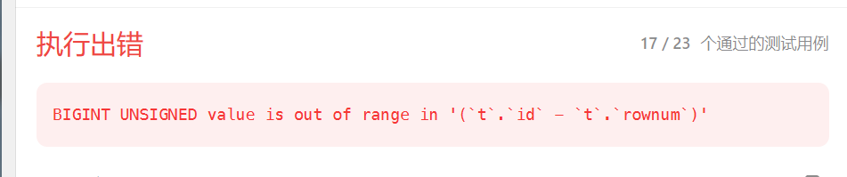

##基础问答： 

## SQL 关键词

### delete from和 truncate

| delete from                                                  | truncate                                                     |
| ------------------------------------------------------------ | ------------------------------------------------------------ |
| 删除表中的行，可以根据指定的条件删除特定的行                 | 表中删除所有行，即将表截断为一个空表                         |
| 数据操作语言（DML）语句，它执行逐行删除操作，并且可以搭配使用事务 | 数据定义语言（DDL）语句，它执行的是整体删除操作，而不是逐行删除。 |
| 触发表上的触发器和约束                                       | 不会触发表上的触发器，也不会检查约束                         |
|                                                              | 将重置表的自增长标识（如果有的话）                           |
|                                                              | 通过删除表中的数据页来实现的，更快                           |

### SQL命令类型

DML：数据操作语言（Data Manipulation Language）

- DML是用于对数据库中的数据进行操作的语言。
- 一些常见的DML语句包括SELECT、INSERT、UPDATE和DELETE。

DDL：数据定义语言（Data Definition Language）

- DDL是用于定义和管理数据库结构的语言。创建、修改和删除数据库对象，如表、视图、索引和约束等。
- 一些常见的DDL语句包括CREATE、ALTER和DROP等。

DQL：数据查询语言（Data Query Language）

- DQL是用于查询数据库中的数据的语言。
- DQL主要用于执行SELECT语句来从数据库中检索数据。

DCL：数据控制语言（Data Control Language）

- DCL用于控制数据库的访问、安全性和权限等方面的语言。
- DCL包括授予或撤销用户的权限、创建或删除用户等操作。

TCL：事务控制语言（Transaction Control Language）

- TCL用于控制数据库事务的语言。
- TCL包括开始事务、提交事务、回滚事务等操作。

DRI：数据完整性约束（Data Referential Integrity）

- DRI用于定义和维护数据之间的完整性约束。
- DRI包括主键、外键、唯一性约束等。

CRUD：创建（Create）、读取（Read）、更新（Update）、删除（Delete）

- CRUD是指针对数据进行的基本操作。
- CRUD是一个广泛应用于描述数据操作的术语。

### Aggregate Functions（聚合函数）

| 聚合函数 |                                          |
| -------- | ---------------------------------------- |
| AVG      | 返回平均值                               |
| COUNT    | 返回⾏数                                 |
| MAX、MIN | 回最⼤值/最⼩值                          |
| ROUND    | 基于⼗进制规范，此函数对数字字段进⾏舍⼊ |
| SUM      | 返回总和                                 |

### SQL的执行顺序

select--from--where--group by--having--order by

## SQL类型

### CHAR 和 VARCHAR 的区别

其中char(M)定义的列的⻓度为固定的，M的取值可以0-255之间，当保存char值时，在它们的右边填充空格以达到指定的⻓度

VARCHAR是一种可变长度的字符类型，它根据存储的实际值的长度来决定占用的存储空间

### timestamp、datetime、bigint

timestamp，该类型是4个字节的整数，它能表示的时间范围为1970-01-01 08:00:01到2038-01-19
11:14:07。2038年以后的时间，是⽆法⽤timestamp类型存储的。但是它有⼀个优势，timestamp类型是带有时区信息的。⼀旦你系统中的时区发⽣改变，例如你修改了时区，该字段的值会⾃动变更。这个特性⽤来做⼀些国际化⼤项⽬，跨时区的应⽤时，特别注意！

datetime，占⽤8个字节，它存储的时间范围为1000-01-01 00:00:00 ~ 9999-12-31 23:59:59。显然，存储时间范围更⼤。但是它坑的地⽅在于，它存储的是时间绝对值，不带有时区信息。如果你改变数
据库的时区，该项的值不会⾃⼰发⽣变更！

bigint，也是8个字节，⾃⼰维护⼀个时间戳，查询效率⾼，不过数据写⼊，显示都需要做转换。

## 数据库基础知识

### 关系型数据库和⾮关系型数据库

关系型数据库（RDBMS）是一种以关系模型为基础的数据库系统。它使用表（表格）来组织和存储数据，表中的数据以行和列的形式进行表示。关系型数据库使用结构化查询语言（SQL）来定义、操作和查询数据。它具有以下特点：

1. 数据模型：关系型数据库使用表（表格）来表示实体和实体之间的关系，每个表都有固定的列（字段）和行（记录）结构，表之间可以通过关联键（外键）建立关系。
2. 数据一致性：关系型数据库强调数据的一致性和完整性，通过定义表的结构和约束条件（如主键、唯一键、外键等）来保证数据的有效性。
3. 数据查询：关系型数据库使用SQL进行数据查询和操作，SQL提供了丰富的查询语法和功能，可以对表和表之间的关系进行复杂的查询和连接操作。
4. 数据安全性：关系型数据库提供了对数据的安全性和权限控制的支持，可以定义用户、角色和权限，限制对数据的访问和操作。

非关系型数据库（NoSQL）是一种不依赖于关系模型的数据库系统。它可以以各种不同的方式组织和存储数据，例如键值对存储、文档存储、列存储和图形存储等。非关系型数据库具有以下特点：

1. 数据模型：非关系型数据库可以使用不同的数据模型，如键值对、文档、列族和图形等。它们不依赖于固定的表结构，可以根据数据的特点和需求进行灵活的建模。
2. 可扩展性：非关系型数据库通常具有良好的可扩展性和性能，可以支持大规模数据和高并发访问。
3. 灵活性：非关系型数据库强调灵活性和易用性，可以适应快速变化的数据需求和开发迭代。
4. 查询能力：非关系型数据库的查询语言和功能通常比较简单，对于复杂的查询和关联操作可能不如关系型数据库方便。

### TCP/IP端⼝是什么？

| 数据库     | 默认端口 |
| ---------- | -------- |
| MySQL      | 3306     |
| Oracle     | 1521     |
| SQL Server | 1433     |
| PostgreSQL | 5432     |
| MongoDB    | 27017    |
| Redis      | 6379     |

### 主键和外键

唯⼀标识⼀条记录，不能有重复的，不允许为空

表的外键是另⼀表的主键, 外键可以有重复的, 可以是空值

### 主键是⽤⾃增还是UUID

最好是⽤⾃增主键，主要是以下两个原因：

1.如果表使⽤⾃增主键，那么每次插⼊新的记录，记录就会顺序添加到当前索引节点的后续位置，当⼀⻚写满，就会⾃动开辟⼀个新的⻚。

2.如果使⽤⾮⾃增主键（如uuid），由于每次插⼊主键的值近似于随机，因此每次新纪录都要被插到索引⻚的随机某个位置，此时MySQL为了将新记录插到合适位置⽽移动数据，甚⾄⽬标⻚⾯可能已经被回写到磁盘上⽽从缓存中清掉，此时⼜要从磁盘上读回来，这增加了很多开销，同时频繁的移动、分⻚操作造成索引碎⽚，得到了不够紧凑的索引结构，后续不得不通过OPTIMIZE TABLE来重建表并优化填充⻚⾯。

不过，也不是所有的场景下都得使⽤⾃增主键，可能场景下，主键必须⾃⼰⽣成，不在乎那些性能的开
销。那也没有问题。

### 主键为什么不推荐有业务含义?

最好是主键是⽆意义的⾃增ID，然后另外创建⼀个业务主键ID， 因为任何有业务含义的列都有改变的可能性,主键⼀旦带上了业务含义，那么主键就有可能发⽣变更。主键⼀旦发⽣变更，该数据在磁盘上的存储位置就会发⽣变更，有可能会引发⻚分裂，产⽣空间碎⽚。

还有就是，带有业务含义的主键，不⼀定是顺序⾃增的。那么就会导致数据的插⼊顺序，并不能保证后⾯插⼊数据的主键⼀定⽐前⾯的数据⼤。如果出现了，后⾯插⼊数据的主键⽐前⾯的⼩，就有可能引发⻚分裂，产⽣空间碎⽚。

### SQL中的Constraints(约束)是什么

它可⽤于设置表中数据类型的限制。在创建或更新表语句时，可以使⽤约束。⼀些限制是：
NOT NULL、PRIMARY KEY、FOREIGN KEY、UNIQUE、CHECK、DEFAULT

### 字段为什么要定义为NOT NULL

⼀般情况，都会设置⼀个默认值，不会出现字段⾥⾯既有null，⼜有空的情况。主要有以下⼏个原因：

1. 数据完整性：通过将字段定义为NOT NULL，可以防止在数据库中出现缺失必要数据的情况。这可以保证数据的完整性，避免出现不一致或不完整的记录。
2. 查询性能优化：对于经常被查询或用作关联条件的字段，将其定义为NOT NULL可以提高查询的性能。因为数据库不需要额外的检查和处理空值，可以减少查询的复杂性和执行时间。
3. 难以优化引⽤可空列查询，它会使索引、索引统计和值更加复杂。可空列需要更多的存储空间，还需要mysql内部进⾏特殊处理。可空列被索引后，每条记录都需要⼀个额外的字节（只在索引中使用，并不会影响原始表中的存储空间）——可空需要将空串存储，空间占用大，查询的范围大，还需要额外的字节记录索引

## 索引：

索引的原理：https://developer.aliyun.com/article/841106

### 聚簇索引和非聚簇索引

参考文章：https://www.cnblogs.com/wphl-27/p/7093280.html

正文内容本身就是一种按照一定规则排列的目录称为"聚集索引"。聚簇索引是顺序结构与数据存储物理结构一致的一种索引，并且一个表的聚簇索引只能有唯一的一条

我们把这种目录纯粹是目录，正文纯粹是正文的排序方式称为"非聚集索引"。    非聚簇索引记录的物理顺序与逻辑顺序没有必然的联系，与数据的存储物理结构没有关系；一个表对应的非聚簇索引可以有多条，根据不同列的约束可以建立不同要求的非聚簇索引；

### 唯⼀索引、主键索引

唯一索引可以作为主键索引的替代品。唯一索引可以有多个，每个唯一索引可以包含一个或多个列。

主键索引是唯⼀索引的特殊类型。主键索引要求主键中的每个值是唯⼀的，并且不能为空

唯一索引和主键索引用于保证数据的唯一性和完整性，而聚集索引主要用于物理存储和排序。

### 使用in会导致索引失效？

- 如果where条件中的列不是索引列,那么该查询就无法利用索引,效率可能会下降。
- in后列表参数值过多,索引效果也不理想。一般建议值数量控制在1000个以下。
- 两边如果都带索引列,可以利用组合索引优化效率。
- like与in搭配使用时,索引可能失效或效率差,需要根据实际 SQL 和索引选择来评估。
- 参数化SQL能利用参数值改写查询选项,从而利用索引。non-param化可能导致重新编译影响性能。

https://www.cnblogs.com/codedisco/p/12609231.html

### 什么是最左前缀原则

在多列索引中，索引的最左边的前缀列应该被优先考虑，以便最大程度地提高查询的性能。

假设有一个包含"FirstName"、"LastName"和"City"三列的表，经常使用的查询模式是根据"City"进行筛选和排序。那么按照最左前缀原则，创建一个以"City"列为最左列的多列索引，可以显著提高这类查询的性能。

## 事务ACID

⼀个Session中所进⾏所有的操作，要么同时成功，要么同时失败ACID — 数据库事务正确执⾏的四个基本要素包含：

原⼦性（Atomicity）、⼀致性（Consistency）、隔离性（Isolation）、持久性（Durability）。

⼀个⽀持事务（Transaction）中的数据库系统，必需要具有这四种特性，否则在事务过程（Transaction processing）当中⽆法保证数据的正确性，交易过程极可能达不到交易。

1. 原子性（Atomicity）：原子性指的是事务是一个不可分割的操作单元，要么全部执行成功，要么全部失败回滚。事务的原子性确保了数据的完整性，如果事务中的任何操作失败，数据库会自动回滚到事务开始前的状态，保证数据的一致性。
2. 一致性（Consistency）：一致性指的是事务将数据库从一个一致的状态转换到另一个一致的状态。事务在执行过程中会对数据进行修改，但必须满足预定义的约束条件和完整性规则，以确保数据的一致性。
3. 隔离性（Isolation）：隔离性指的是并发执行的事务之间应该相互隔离，每个事务的操作应该与其他事务相互独立。隔离级别定义了事务之间的隔离程度，包括读未提交（Read Uncommitted）、读已提交（Read Committed）、可重复读（Repeatable Read）和串行化（Serializable）等级别。较高的隔离级别通常会降低并发性能，因为需要更多的锁和资源管理。
4. 持久性（Durability）：持久性指的是一旦事务提交成功，对数据库的修改将永久保存，即使在系统故障或崩溃的情况下也不会丢失。数据库系统通过将事务的操作记录到事务日志（transaction log）或使用其他持久化机制来实现持久性。

## 存储过程

### 4.视图是什么？游标是什么？

答：视图是一种虚拟表，虚拟表具有和物理表相同的功能，可以对虚拟表进行增该查操作;

  视图通常是一个或多个表的行或列的子集;

  视图的结果更容易理解（修改视图对基表不影响），获取数据更容易（相比多表查询更方便），限制数据检索（比如需要隐藏某些行或列），维护更方便。

  游标对查询出来的结果集作为一个单元来有效的处理，游标可以定位在结果集的特定行、从结果集的当前位置检索一行或多行、可以对结果集中当前位置进行修改

### 5.什么是存储过程？有什么优点？

答：存储过程是一组预编译的SQL语句

1. 允许模块化程序设计，就是说只需要创建一次过程，以后在程序中就可以调用该过程任意次。
2. 允许更快执行，如果某操作需要执行大量SQL语句或重复执行，存储过程比SQL语句执行的要快。
3. 减少网络流量，例如一个需要数百行的SQL代码的操作有一条执行语句完成，不需要在网络中发送数百行代码。
4. 更好的安全机制，对于没有权限执行存储过程的用户，也可授权他们执行存储过程。

### 存储过程比直接用SQL语句运行速度更快的原因:

1. 存储过程是预编译的对象,直接执行已编译好的执行计划,而SQL语句每次运行都需要编译解析。这对性能影响很大。
2. 存储过程可以利用参数化查询功能,批量处理多个相同结构的数据,比直接SQL语句效率高。
3. 存储过程能跨语句进行优化,例如过滤条件能下推到JOIN和WHERE条件处,减少数据扫描量。而SQL不易整体优化。
4. 数据库引擎在优化存储过程时,可以使用更丰富的统计信息,生成更优执行计划。
5. 存储过程经常被引擎缓存查询计划,后续调用直接使用缓存,性能开销小。而SQL每次都需要编译解析。
6. 复杂逻辑可以封装在存储过程内,而不必拼写成长串SQL,易维护和调试。

## 触发器

### 6.什么是触发器？

答：触发器是一种特殊类型的存储过程，触发器主要通过事件触发而被执行的，触发器的优点：

1.强化约束，触发器能够提供比CHECK约束;

2.跟踪变化，触发器可以跟踪数据库内的操作，从而不允许未经允许许可的更新和变化;

3.联级运算，比如某个表上的触发器中包含对另一个表的数据操作，而该操作又导致该表上的触发器被触发

## SQL应用题

### 取出表A中第31到第40记录

（以自动增长的ID作为主键,注意：ID可能不是连续的）

```sql
SELECT *
FROM A
ORDER BY ID
LIMIT 30, 10;
```

### 随机的从表中取10条

```sql
select * from tablename sample 10
```

### 至少有5名直接下属的经理

[至少有5名直接下属的经理](https://leetcode.cn/problems/managers-with-at-least-5-direct-reports/)：

编写一个解决方案，找出至少有**五个直接下属**的经理。以 **任意顺序** 返回结果表。

表: `Employee`

```
+-------------+---------+
| Column Name | Type    |
+-------------+---------+
| id          | int     |
| name        | varchar |
| department  | varchar |
| managerId   | int     |
+-------------+---------+
id 是此表的主键（具有唯一值的列）。
该表的每一行表示雇员的名字、他们的部门和他们的经理的id。
如果managerId为空，则该员工没有经理。
没有员工会成为自己的管理者。
```

 题解：

```sql
# Write your MySQL query statement below
select e1.name
from Employee e1 -- 经理
left join Employee e2 on e1.id = e2.managerId -- 员工
group by e1.id
having count(*)>=5
```

###  leetcode 1493 确认率

[确认率](https://leetcode.cn/problems/confirmation-rate/)

表: `Signups`

```
+----------------+----------+
| Column Name    | Type     |
+----------------+----------+
| user_id        | int      |
| time_stamp     | datetime |
+----------------+----------+
User_id是该表的主键。
每一行都包含ID为user_id的用户的注册时间信息。
```

表: `Confirmations`

```
+----------------+----------+
| Column Name    | Type     |
+----------------+----------+
| user_id        | int      |
| time_stamp     | datetime |
| action         | ENUM     |
+----------------+----------+
(user_id, time_stamp)是该表的主键。
user_id是一个引用到注册表的外键。
action是类型为('confirmed'， 'timeout')的ENUM
该表的每一行都表示ID为user_id的用户在time_stamp请求了一条确认消息，该确认消息要么被确认('confirmed')，要么被过期('timeout')。
```

用户的 **确认率** 是 `'confirmed'` 消息的数量除以请求的确认消息的总数。没有请求任何确认消息的用户的确认率为 `0` 。确认率四舍五入到 **小数点后两位** 。

编写一个SQL查询来查找每个用户的 确认率 。

以 任意顺序 返回结果表。

```sql
# Write your MySQL query statement below
select s.user_id ,IFNULL(Round(a.confirmation_rate,2),0) confirmation_rate 
from Signups s
left join (
    -- 计算已存在的确认率，不包括未出现的
    select user_id,sum(if(action='confirmed',1,0))/count(*) confirmation_rate 
    from Confirmations 
    group by user_id 
) a on s.user_id = a.user_id
```

优化：

子查询是为了解决为空的确认率，可以通过join+IFNULL解决。此外，`IFNULL(Round(a.confirmation_rate,2),0)` 改为 `AVG(c.action='confirmed')`

```C#
select s.user_id,ROUND(IFNULL(AVG(c.action='confirmed'),0),2) confirmation_rate
from Signups s
left join Confirmations c on s.user_id = c.user_id
group by s.user_id
```

### leetcode 1193 每月交易 1

[1193. 每月交易 I](https://leetcode.cn/problems/monthly-transactions-i/)

表：`Transactions`

```sql
+---------------+---------+
| Column Name   | Type    |
+---------------+---------+
| id            | int     |
| country       | varchar |
| state         | enum    |
| amount        | int     |
| trans_date    | date    |
+---------------+---------+
id 是这个表的主键。
该表包含有关传入事务的信息。
state 列类型为 ["approved", "declined"] 之一。
```

编写一个 sql 查询来查找每个月和每个国家/地区的事务数及其总金额、已批准的事务数及其总金额。

```sql
输入：
Transactions table:
+------+---------+----------+--------+------------+
| id   | country | state    | amount | trans_date |
+------+---------+----------+--------+------------+
| 121  | US      | approved | 1000   | 2018-12-18 |
| 122  | US      | declined | 2000   | 2018-12-19 |
| 123  | US      | approved | 2000   | 2019-01-01 |
| 124  | DE      | approved | 2000   | 2019-01-07 |
+------+---------+----------+--------+------------+
输出：
+----------+---------+-------------+----------------+--------------------+-----------------------+
| month    | country | trans_count | approved_count | trans_total_amount | approved_total_amount |
+----------+---------+-------------+----------------+--------------------+-----------------------+
| 2018-12  | US      | 2           | 1              | 3000               | 1000                  |
| 2019-01  | US      | 1           | 1              | 2000               | 2000                  |
| 2019-01  | DE      | 1           | 1              | 2000               | 2000                  |
+----------+---------+-------------+----------------+--------------------+-----------------------+
```

```sql
select DATE_FORMAT(trans_date,'%Y-%m') month,
        country,
        count(*) trans_count,
        sum(if(state='approved',1,0)) approved_count,
        sum(amount) trans_total_amount,
        sum(if(state='approved',amount,0))approved_total_amount
from Transactions 
group by country,DATE_FORMAT(trans_date,'%Y-%m') 
```

### leetcode 1174 即时食物配送 II

[1174. 即时食物配送 II](https://leetcode.cn/problems/immediate-food-delivery-ii/)

配送表: `Delivery`

```
+-----------------------------+---------+
| Column Name                 | Type    |
+-----------------------------+---------+
| delivery_id                 | int     |
| customer_id                 | int     |
| order_date                  | date    |
| customer_pref_delivery_date | date    |
+-----------------------------+---------+
delivery_id 是该表中具有唯一值的列。
该表保存着顾客的食物配送信息，顾客在某个日期下了订单，并指定了一个期望的配送日期（和下单日期相同或者在那之后）。
```

如果顾客期望的配送日期和下单日期相同，则该订单称为 「**即时订单**」，否则称为「**计划订单**」。

「**首次订单**」是顾客最早创建的订单。我们保证一个顾客只会有一个「首次订单」。

编写解决方案以获取即时订单在所有用户的首次订单中的比例。**保留两位小数。**

```sql
# Write your MySQL query statement below
select Round(sum(a.is_same)/count(*)*100,2) immediate_percentage
from(
    select customer_id,min(order_date)=min(customer_pref_delivery_date) is_same
    from Delivery 
    group by customer_id
)a 
```

配送日期的最小值为首次日期，期望日期若等于首次日期则期望日期=首次日期时，期望日期也是最小的

```sql
select round(avg(a2.event_date is not null),2)  fraction from (
    -- 每个用户首次登录时间
  select player_id,min(event_date) first_date from Activity
  group by player_id
)a
-- join 获取第二天又登录的记录
left join Activity a2 on a.player_id=a2.player_id and a2.event_date>a.first_date and a2.event_date<=date_add(a.first_date,interval 1 day)
```

### leetcode 1045 买下所有产品的客户

[1045. 买下所有产品的客户](https://leetcode.cn/problems/customers-who-bought-all-products/)

`Customer` 表：

```
+-------------+---------+
| Column Name | Type    |
+-------------+---------+
| customer_id | int     |
| product_key | int     |
+-------------+---------+
该表可能包含重复的行。
customer_id 不为 NULL。
product_key 是 Product 表的外键(reference 列)。
```

`Product` 表：

```
+-------------+---------+
| Column Name | Type    |
+-------------+---------+
| product_key | int     |
+-------------+---------+
product_key 是这张表的主键（具有唯一值的列）。
```

编写解决方案，报告 `Customer` 表中购买了 `Product` 表中所有产品的客户的 id。

返回结果表 **无顺序要求** 。

```sql
select customer_id from(
  select customer_id,count(distinct product_key) products_num from Customer
  group by  customer_id 
)a 
where a.products_num = (select count(*) from Product )
```

优化：去除子查询，将where部分改为having中判断

```sql
select customer_id
from Customer
group by  customer_id 
having  count(distinct product_key) = (select count(*) from Product )
```

### leetcode 180 连续出现的数字

[180. 连续出现的数字](https://leetcode.cn/problems/consecutive-numbers/)

表：`Logs`

```
+-------------+---------+
| Column Name | Type    |
+-------------+---------+
| id          | int     |
| num         | varchar |
+-------------+---------+
在 SQL 中，id 是该表的主键。
id 是一个自增列。
```

找出所有至少连续出现三次的数字。

返回的结果表中的数据可以按 **任意顺序** 排列。


如果id连续可以使用下面的代码处理：

```sql
SELECT distinct num ConsecutiveNums 
FROM(
    SELECT *,
        ROW_NUMBER() OVER (PARTITION BY Num ORDER BY Id) rownum,
        ROW_NUMBER() OVER (ORDER BY Id) id2
    FROM LOGS
) t
GROUP BY Num,(id2-rownum)
HAVING COUNT(*)>=3
```

1.增加了不连续id的测试用例，并且从结果来看，不连续id的同一个num不被视作“连续出现”，所以把原题解中的 `row_number over (order by id)` 直接替换为 `id` 即可

```sql
SELECT distinct num ConsecutiveNums 
FROM(
    SELECT *,
        ROW_NUMBER() OVER (PARTITION BY Num ORDER BY Id) rownum
    FROM LOGS
) t
GROUP BY Num,(id-rownum)
HAVING COUNT(*)>=3
```



2.增加了包含id小于1的测试用例，导致上一条修改后的题解也不能通过，所以需要额外做一次查询，把最小的id查出来，然后将测试用例中的所有id进行偏移修正，保证最小的id为1，具体做法是用 `id - (select min(id) from Logs) + 1` 替换上一条中的 `id`

3.注意上一条中的查询需要使用 min 函数，不能使用 limit 1，因为存在id乱序的测试用例

4.仅针对当前测试用例的话，直接用 `id + 1` 也是可以的。不清楚查询中的临时计算列的数值范围是否受参与计算的真实列的数值范围影响，如果二者有关联的话，那么这个计算列的非负约束是来源于id的，也就是说id本身不可能为负数，所以直接加一就可以了，不需要再查询最小id

```sql
SELECT distinct num ConsecutiveNums 
FROM(
    SELECT *,
        ROW_NUMBER() OVER (PARTITION BY Num ORDER BY Id) rownum
    FROM LOGS
) t
GROUP BY Num,(id+1-rownum)
HAVING COUNT(*)>=3
```

### leetcode 1204 最后一个能进入巴士的人

[最后一个能进入巴士的人](https://leetcode.cn/problems/last-person-to-fit-in-the-bus/)

表: `Queue`

```
+-------------+---------+
| Column Name | Type    |
+-------------+---------+
| person_id   | int     |
| person_name | varchar |
| weight      | int     |
| turn        | int     |
+-------------+---------+
person_id 是这个表具有唯一值的列。
该表展示了所有候车乘客的信息。
表中 person_id 和 turn 列将包含从 1 到 n 的所有数字，其中 n 是表中的行数。
turn 决定了候车乘客上巴士的顺序，其中 turn=1 表示第一个上巴士，turn=n 表示最后一个上巴士。
weight 表示候车乘客的体重，以千克为单位。
```

有一队乘客在等着上巴士。然而，巴士有`1000` **千克** 的重量限制，所以其中一部分乘客可能无法上巴士。

编写解决方案找出 **最后一个** 上巴士且不超过重量限制的乘客，并报告 `person_name` 。题目测试用例确保顺位第一的人可以上巴士且不会超重。

```sql
# Write your MySQL query statement below
select person_name from
(
    select turn,person_name,
    sum(weight) over(order by turn) as sum_weight
    from Queue
) t
where sum_weight <= 1000
order by turn desc
limit 1
```

### leetcode 626 换座位

[626. 换座位](https://leetcode.cn/problems/exchange-seats/)

表: `Seat`

```
+-------------+---------+
| Column Name | Type    |
+-------------+---------+
| id          | int     |
| student     | varchar |
+-------------+---------+
id 是该表的主键（唯一值）列。
该表的每一行都表示学生的姓名和 ID。
id 是一个连续的增量。
```

编写解决方案来交换每两个连续的学生的座位号。如果学生的数量是奇数，则最后一个学生的id不换。

按 `id` **升序** 返回结果表。

```sql
# Write your MySQL query statement below
select
    if(
        id % 2 = 0,
        id - 1,
        if(
            id = (select max(id) from seat),
            id,
            id + 1
        )
    ) as id,
    student
from seat
order by id;
```

### leetcode 1321. 餐馆营业额变化增长

[1321. 餐馆营业额变化增长](https://leetcode.cn/problems/restaurant-growth/)

表: `Customer`

```
+---------------+---------+
| Column Name   | Type    |
+---------------+---------+
| customer_id   | int     |
| name          | varchar |
| visited_on    | date    |
| amount        | int     |
+---------------+---------+
在 SQL 中，(customer_id, visited_on) 是该表的主键。
该表包含一家餐馆的顾客交易数据。
visited_on 表示 (customer_id) 的顾客在 visited_on 那天访问了餐馆。
amount 是一个顾客某一天的消费总额。
```

你是餐馆的老板，现在你想分析一下可能的营业额变化增长（每天至少有一位顾客）。

计算以 7 天（某日期 + 该日期前的 6 天）为一个时间段的顾客消费平均值。`average_amount` 保留两位小数。结果按 `visited_on` **升序排序**。

```sql
# Write your MySQL query statement below
SELECT DISTINCT visited_on,sum_amount AS amount,
    ROUND(sum_amount/7, 2) AS average_amount
FROM 
(
    SELECT visited_on, 
    SUM(amount) OVER ( ORDER BY visited_on RANGE interval 6 day preceding  
    ) AS sum_amount 
    FROM Customer
) t
-- 最后手动地从第7天开始
WHERE DATEDIFF(visited_on, (SELECT MIN(visited_on) FROM Customer)) >= 6
```


```sql
select Round(sum(tiv_2016),2) tiv_2016 from Insurance 
where tiv_2015 in (
    select tiv_2015 from Insurance 
    group by tiv_2015
    having count(*) > 1
) and concat(lat,lon) in(
    select concat(lat,lon) from Insurance 
    group by lat,lon
    having count(*) = 1
)
```

