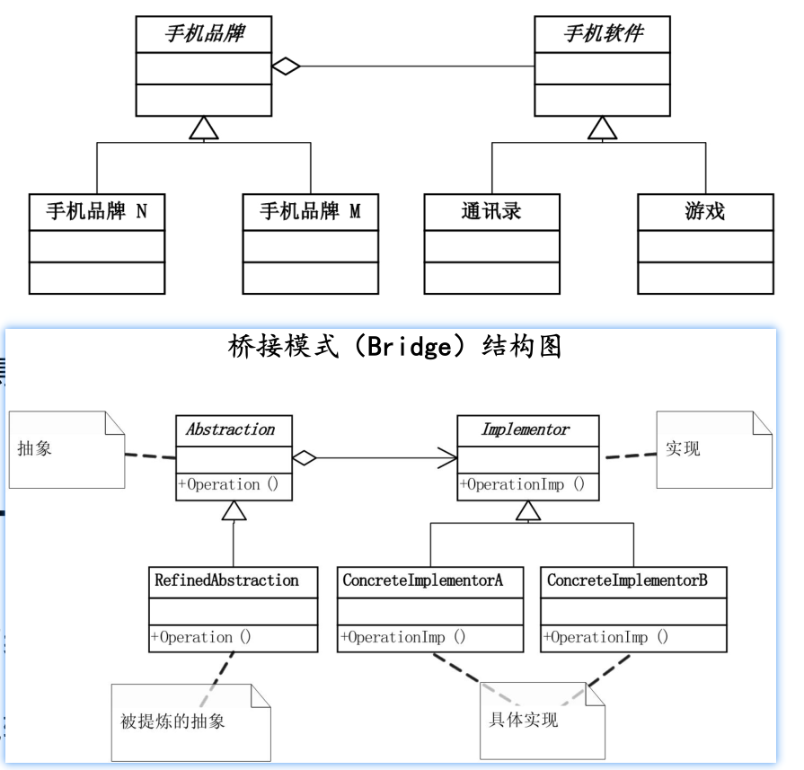
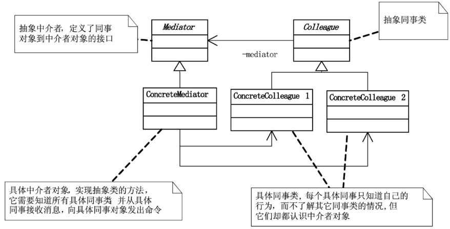

设计模式：https://www.liaoxuefeng.com/wiki/1252599548343744/1281319214514210

## 常见设计模式

单例模式:保证一个类只有一个实例,与线程安全有关。

工厂模式:定义一个创建对象的接口,让子类自己决定实例化哪一个类。避免使用 new 运算符直接实例化。

观察者模式:定义对象间一对多的依赖关系,当一个对象的状态发生变化时,所有依赖于它的对象都会得到通知。

适配器模式:将一个类的接口转换成客户端期望的另一个接口。如孙悟空适配人间。

策略模式:定义一系列算法,把它们一个个封装起来,相互替换。

命令模式:将一个请求封装为一个对象,从而可以对请求排队或记录请求日志,并且可以支持撤销操作。

责任链模式:避免请求发送者与接收者耦合在一起,让一个接收对象由另一个接收对象处理请求。

迭代器模式:访问聚合对象的元素而又不存在明确的顺序。

## 法则

### 依赖倒转原则：

> 1）高层次模块不应该以来底层模块，应该依赖抽象。
>
> 2）抽象不应该依赖细节，细节应该依赖抽象。

依赖倒转其实就是谁也不要依靠谁，除了约定的接口，大家都可以灵活自如。

### 里氏代换原则

> 子类必须能够替换掉他的父类。

正是由于子类型的可替换性才使得使用父类类型的模块在无需修改的情况下就可以扩展

### 迪米特法则、最少知识原则：

> 如果两个类不必彼此直接通信，那么这两个类就不应当发生直接的相互作用。如果其中一个类需要调用另一个类的某一个方法，可以通过第三者转发这个调用。

迪米特法则首先强调的前提是在类的结构设计上，每一个类都应当尽量降低成员的访问权限，也就是说，一个类包装好自己的private状态，不需要让别的类知道的字段或行为就不要公开。

在程序设计时，类之间的耦合越弱，越有利于复用，一个处在弱耦合的类被修改，不会对有关系的类造成波及。也就是说，信息的隐藏促进了软件的复用

## 一、创建型模式：

### 1、单例模式

单例模式(Singleton)，保证一个类仅有一个实例，并提供个访问它的全局访问点。

一个类仅有一个实例：将instance声明为private static，这样instance就是类层面的静态变量

提供个访问它的全局访问点：将GetInstance声明为static类型，属于类层面的静态变量

```C#
namespace HelloDesignPattern.Entities
{
    /// <summary>
    /// 在第一次被引用时，才会将自己实例化，所以就被称为[懒汉式单例类]
    /// </summary>
    public class SingletonTest
    {
        private static SingletonTest? instance;
        private static readonly object instanceLock = new object();
        private SingletonTest()
        {

        }
        public static SingletonTest GetInstance()
        {
            if (instance == null)
            {
                lock (instanceLock) //当两个线程同时访问，只有进入并出来一个后，第二个才能进入(第二个不会new)
                {
                    if (instance == null)
                    {
                        instance = new SingletonTest();
                    }
                }
            }
            return instance;
        }
    }
    
    /// <summary>
    /// 在类被加载时就将自己实例化(提前占用系统资源)，所以被形象地称之为[饿汉式单例类]
    /// </summary>
    public sealed class SingletonTest2
    {
        //静态初始化,依赖公共语言运行库来初始化变量
        private static readonly SingletonTest2 Instance = new SingletonTest2();

        private SingletonTest2()
        {

        }

        public static SingletonTest2 GetInstance()
        {
            return Instance;
        }
    }
}
```

1. 当第一个线程进入lock时,会阻塞其他线程进入锁代码块。
2. 第一个线程new出实例,代码执行完毕后, lock会自动释放锁。
3. 第二个等待的线程被唤醒,进入判断发现instance不为空,则直接返回。

单例模式因为类本身封装它的唯一实例，可以严格地控制外部`怎样访问它以及何时访问它`。简单地说就是对唯一实例的受控访问。

使用场景：

1. 资源的统一访问点。如文件系统、数据库、网络连接池等,需要全局唯一访问。
2. 配置文件对象。比如系统级配置和环境变量,需要全局加载和访问。
3. 缓存对象。如框架级别的缓存文件或网络请求缓存。
4. 日志记录组件。如 log4net,需要全局记录日志信息。
5. 工具类。如格式化转换工具、算法工具类等,非当场需要,全局可用。
6. 表现单例。如任务调度器、后台服务等系统级对象需要单例。
7. 单 threaded 对象。如一些只需在一个线程中操作的类。
8. 许多第三方类库中的helper类也采用单例模式。

### 2、工厂方法

### 3、抽象工厂

### 4、生成器

### 5、原型

## 二、结构性模式

### 1、适配器

适配器模式(Adapter)，将一个类的接口转换成客户希望的另外一个接口。Adapter 模式使得原本由于接口不兼容而不能起工作的那些类可以一起工作。类适配器模式和对象适配器模式，由于类适配器模式通过多重继承对一个接口与另一个接口进行匹配，而C#、VB.NET、JAVA等语言都不支持多重继承（C+
+支持），也就是一个类只有一个父类，所以我们这里主要讲的是对象适配器。

### 2、桥接

继承是一种强耦合的结构。父类变，子类就必须要变;

桥接模式(Bridge)，将抽象部分与它的实现部分分离，使它们都可以独立地变化。就刚才的例子而言，就是让‘手机’既可以按照品牌来分类，也可以按照功能来分类.由于实现的方式有多种，桥接模式的核心意图就是把这些实现独立出来，让它们各自地变化。这就使得每种实现的变化不会影响其他实现，从而达到应对变化的目的。



```C#
namespace HelloDesignPattern.Entities
{
    abstract class Implementor
    {
        public abstract void Operation();
    }
    class ConcreteImplA : Implementor
    {
        public override void Operation()
        {
            Console.WriteLine("具体实现A的方法执行");
        }
    }
    class ConcreteImplB : Implementor
    {
        public override void Operation()
        {
            Console.WriteLine("具体实现B的方法执行");
        }
    }

    class Abstraction
    {
        protected Implementor Implementor;

        public void SetImplementor(Implementor implementor)
        {
            Implementor = implementor;
        }

        public virtual void Operation()
        {
            Implementor.Operation();
        }
    }

    class RefinedAbstraction : Abstraction
    {
        public override void Operation()
        {
            Implementor.Operation();
        }
    }
}
```

### 3、组合

### 4、装饰器

### 5、外观

### 6、享元

### 7、代理

## 三、行为型模式


### 1、责任链

### 2、命令

### 3、解释器

### 4、迭代器

### 5、中介

> 用一个中介对象来封装一系列的对象交互。中介者使各对象不需要显式地相互引用，从而使其松耦合，而且可以独立地改变他们之间的交互。 



colleague1发送消息调用`c1.Send("吃饭了没？");`实际上是通过其内部的中介mediator调用其Send方法实现的，在mediator内部判断发出者是谁后，调用另一个人的`colleague2.Notigy(message);`让其接收消息。

发起消息的类Colleague、ConcreteColleague1、ConcreteColleague2定义如下

```C#
namespace ConsoleApp1.MediatorDP
{
    abstract class Colleague
    {
        protected Mediator mediator;
        public Colleague(Mediator mediator)
        {
            this.mediator = mediator;
        }
    }
    class ConcreteColleague1 : Colleague
    {
        public ConcreteColleague1(Mediator mediator) : base(mediator)
        {
        }

        public void Send(string message)
        {
            mediator.Send(message, this);
        }
        public void Notigy(string message)
        {
            Console.WriteLine("同事1得到消息：" + message);
        }
    }
    class ConcreteColleague2 : Colleague
    {
        public ConcreteColleague2(Mediator mediator) : base(mediator)
        {
        }

        public void Send(string message)
        {
            mediator.Send(message, this);
        }
        public void Notigy(string message)
        {
            Console.WriteLine("同事2得到消息：" + message);
        }
    }
}
```

中介者Mediator、ConcreteMediator定义如下：

```C#
using System;
using System.Collections.Generic;
using System.Linq;
using System.Text;
using System.Threading.Tasks;

namespace ConsoleApp1.MediatorDP
{
    
    abstract class Mediator
    {
        public abstract void Send(string message, Colleague colleague);
    }

    class ConcreteMediator : Mediator
    {
        private ConcreteColleague1 colleague1;
        private ConcreteColleague2 colleague2;

        public ConcreteColleague1 Colleague1
        {
            set { colleague1 = value; }
        }
        public ConcreteColleague2 Colleague2
        {
            set { colleague2 = value; }
        }
        public override void Send(string message, Colleague colleague)
        {
            if (colleague == colleague1) colleague2.Notigy(message);
            else colleague1.Notigy(message);
        }
    }
}
```

测试让Colleague1发起消息，Colleague2回复消息

```C#
using ConsoleApp1.MediatorDP;

ConcreteMediator  mediator  = new ConcreteMediator();
ConcreteColleague1 c1 = new ConcreteColleague1(mediator);
ConcreteColleague2 c2 = new ConcreteColleague2(mediator);

mediator.Colleague1 = c1;
mediator.Colleague2 = c2;

c1.Send("吃饭了没？");
c2.Send("吃了");
Console.Read();
/*
同事2得到消息：吃饭了没？
同事1得到消息：吃了
*/
```

中介者模式的优点首先是Mediator的出现减少了各个Colleague的耦合，使得可以独立地改变和复用各个Colleague类和Mediator。

中介者类ConcreteMediator可能会因为ConcreteColleague的越来越多，而变得非常复杂，反而不容易维护。

### 6、备忘录

### 7、观察者

### 8、状态

### 9、策略

### 10、模板方法

### 11、访问者


